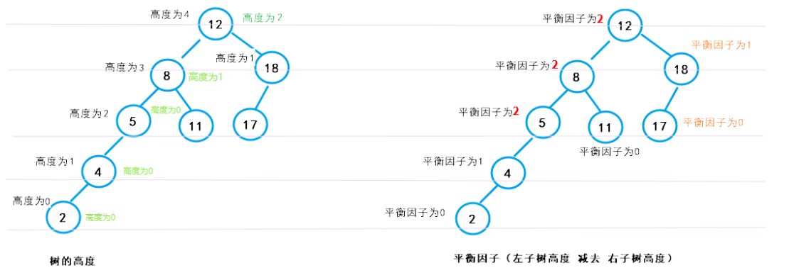
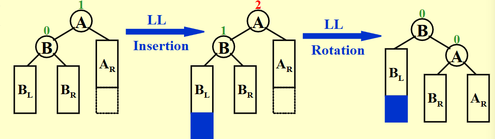
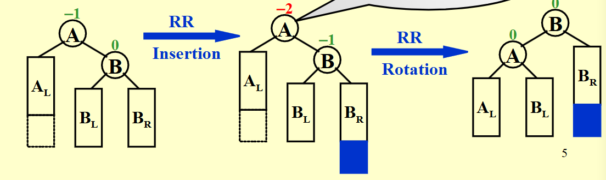
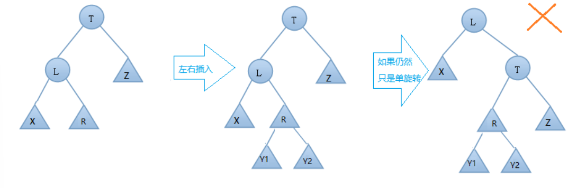
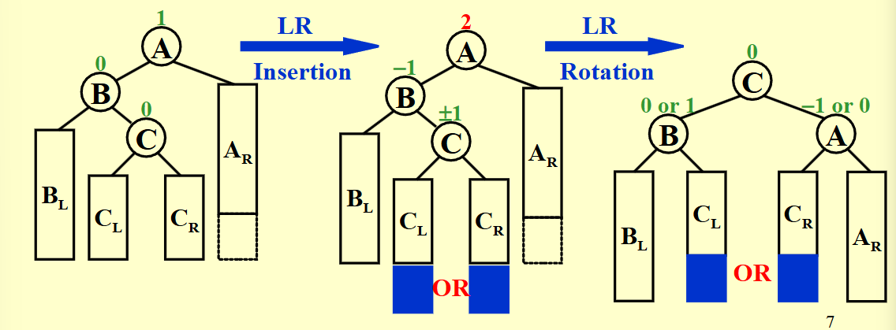
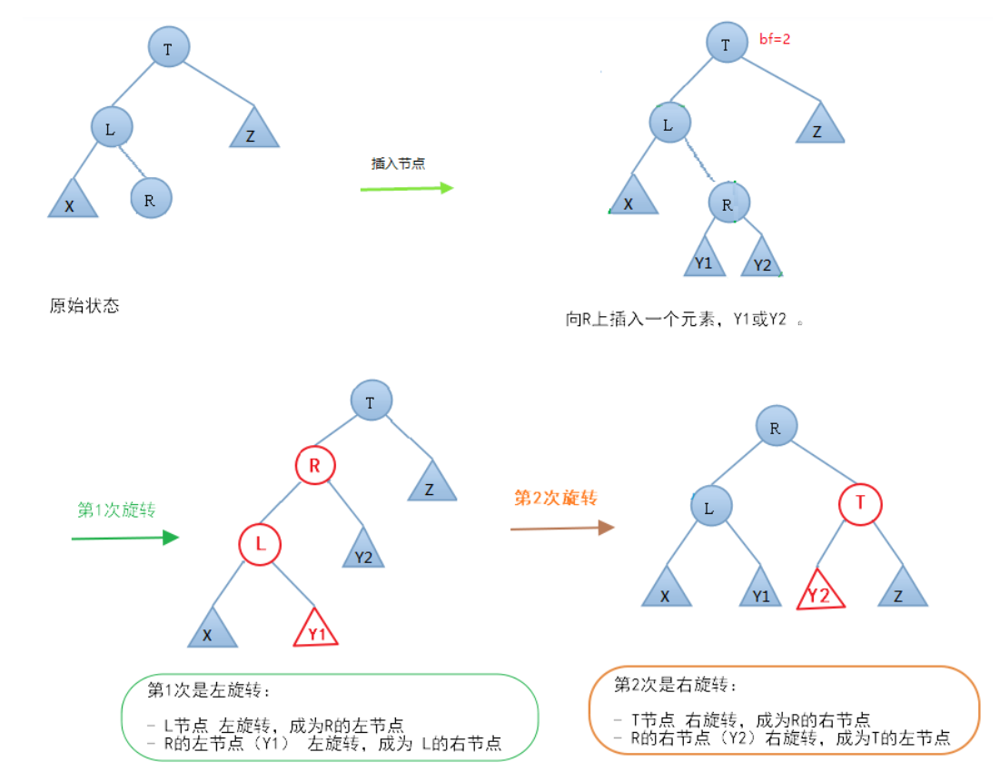
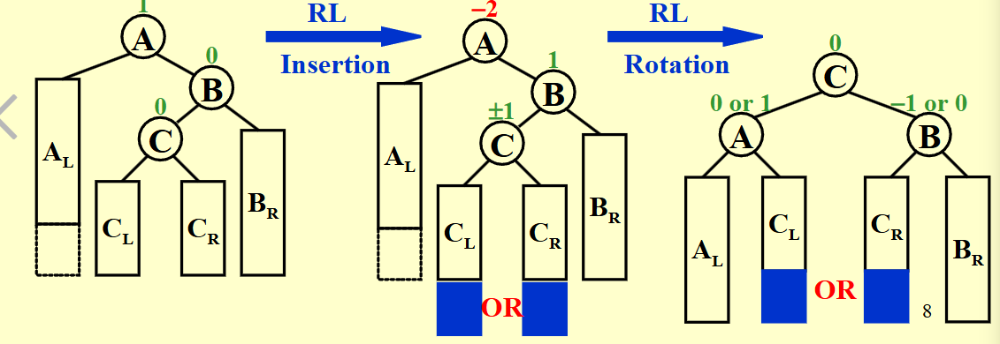
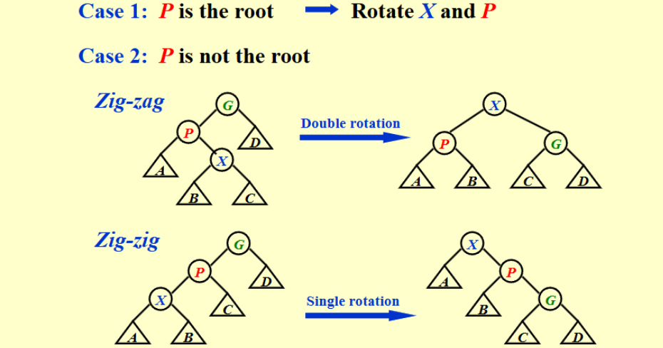
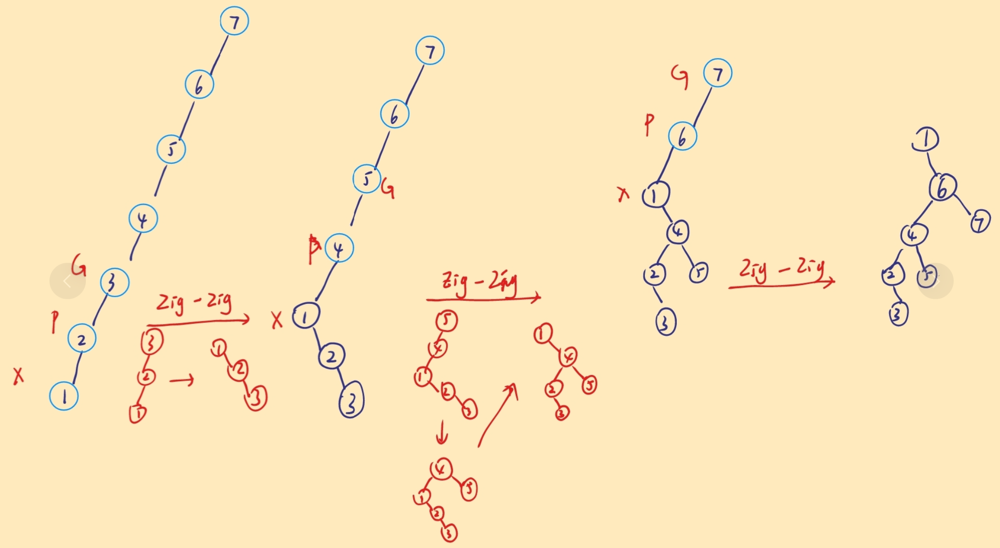

# Advance Data Structures and Algorithm Analysis 
> 浙江大学高级数据结构与算法分析个人笔记


## AVL tree(平衡二叉树)

AVL 数的想法是强制要求每次插入，删除之后都保证树的绝对平衡

!!!note "AVL 数的递归定义"
    一颗空的树或它的左右两个子树的高度差的绝对值不超过1是AVL树，同时它的左右两个子树也是AVL树（从下往上看，不要从上往下看）


- 平衡因子(Balence factor)
   简称 $bf$,计算公式为
   
   $$
   bf = height_{left}-height_{right}
   $$

   在AVL tree 中，$bf$ 只能为 -1,0,1 三种情况之一




AVL tree 可以解决当顺序数据被插入到普通二叉搜索树的过程中，二叉搜素树会退化为链表的过程

### 不同类型的插入

#### LL型-右旋

**在某结点的左结点(L)的左子树(L)上做了插入元素的操作导致失衡，我们称这种情况为左左型，应该进行右旋转**

- A 向右旋转成为 B 的 右 child 
- B的右子树成为A的左子树



!!!Warning
    需要注意的是，在这里，节点A的 $bf$ 值只能是1，如果是0，说明左右树高相等，再插入也是AVL树，如果是-1，说明左边比右边矮，左边再长高1，也不会导致失衡

#### RR型-左旋

**在某结点的 右结点(R)的 右子树(R)上做了插入元素的操作，我们称这种情况为 右右型 ，我们应该进行左旋转。**

- A 向左旋转成为B的左child
- B 的左子树 成为 A 的右子树

 

!!!Warning
    节点A的 $bf$ 值也是确定的

!!!Note 
    总的来说，对于LL和RR型，我们解决失衡的方式是
    
    对于LL，左结点当根

    对于RR，右节点当根

#### LR 型-左右旋

**在某结点的 左结点（L） 的 右子树（R） 上做了插入元素的操作导致失衡，我们称这种情况为 左右型 ，我们应该进行左右旋。**


???info "对于左右型，如果只进行单旋，不会解决问题"
    

- 需要进行两次旋转(左右旋)
    + 第一次（左旋）: B左旋，成为C的左结点，C的左子树成为B的右子树
    + 第二次（右旋）: A右旋，成为C的右节点，C的右子树成为A的左子树

 

???Example "一个例子"
    

#### RL 型-右左旋转

**在某节点的在结点T的 右结点（R） 的 左子树（L） 上做了插入元素的操作，我们称这种情况为 右左型 ，我们应该进行右左旋。**

同样，单旋对于RL型也没有用

- 需要进行两次旋转(右左旋)
    + 第一次（右旋）: B右旋，称为C的右结点，C的右子树成为B的左子树 
    + 第二次（左旋）: A左旋，成为C的左节点，C的左子树成为A的右子树



!!!Note "总结"
    总的来说，对于LR和RL型，我们解决失衡的方式是
    
    对于LR，左结点的右 child 当根

    对于RL，右节点的左child 当根


!!!Tip
    如果一次插入最多只会导致插入路径上的一连串的结点失衡，我们只需要解决找到的第一个（最靠下的）失衡结点，将其解决，上面的结点自然也恢复到正常的平衡因子

    旋转前后，结点之间的相对位置不变，亦即左边的结点仍然在左边，右边的结点仍然在右边

AVL 树的搜索、插入和删除操作的时间复杂度为 $O(\log n)$


## Splay tree(伸展树)

!!!quote "吴一航学长的ADS讲义"
    Splay 树的想法一方面来源于希望可以不像 AVL 那样保持严格的平衡约束，但也能保证某种层面（均摊）的对数时间复杂度，另一方面 Splay 树在访问（特别注意访问包括搜索、插入和删除）时都需要将元素移动到根结点，这非常符合程序局部性的要求，即刚刚访问的数据很有可能再次被访问，因此在实现缓存和垃圾收集算法中有一定的应用。

Splay 树并不在乎二叉树是否时刻都平衡，而是通过在每次操作时加上Splay操作，即通过一系列旋转将我们访问的结点移动到根结点

!!!Note
    Any M consecutive tree operations starting from an empty tree take at most $O(M \log N)$ time.
    
    Splay tree 希望从一棵空树开始连续的M个操作是 $O(M \log N)$ 的

我们有两种旋转方式

**naive的方式:**

不断地把访问的结点与其父节点更换父子方式，即不断使用单旋一直转到根节点的位置，但是这种方法虽然满足了将访问的结点移动到根的需求，其路径上的结点却被移动到了很深的位置，这种方式不满足我们对于复杂度的要求


**下面是合理的旋转方式:**

对于任何不是根结点的结点 X ,我们关心它的 parent 节点 P 和它的 grandparent 结点 G:

- case 1: 如果 P 已经是根，直接旋转交换 P 和 X ，这与普通方法没什么区别
- case 2: 如果 P 并不是根，又分为两种情况
    + Zig-zag(之字型): 双旋,使得X成为树根(不一定是树的根，是XPG子树的树根)，这种情况与普通方法是一样的，与 AVL 树的 RL 和 LR 型也是一样的
    + Zig-zig(同侧型): 单旋，其实叫做单旋，实际上也是转两次，应该是为了和 AVL 树不一样才这么叫。
    **Zig-zig 的方法才是是与naive的方法不一样的地方**,普通方法先交换了 X 和 P 的位置，再交换 X 和 G 的位置; Zig-zig 的操作方法是先交换 P 和 G ，再交换 X 和 P，相当于 X 直接跨了两步 
 


???Example "insert 1 to 7 and then find 1"
    


!!!question "编程实践-Find root of AVL tree"
     For each case, the first line contains a positive integer $N$ which is the total number of keys to be inserted.  Then $N$ distinct integer keys are given in the next line.  All the numbers in a line are separated by a space.

     output the root of AVL treeeeeeeeeeeeeee!


???Answer "pseudo code"
    ```C++
    Define structure Node:
    data: integer
    left: pointer to Node (initially NULL)
    right: pointer to Node (initially NULL)
    height: integer (initially 0)

    Define height(root):
        If root is NULL:
            Return -1
        Else:
            Return root.height

    Define LL_rotation(root):
        new_root = root.left
        root.left = new_root.right
        new_root.right = root
        Update root.height
        Update new_root.height 
        Return new_root

    Define RR_rotation(root):
        new_root = root.right
        root.right = new_root.left
        new_root.left = root
        Update root.height
        Update new_root.height 
        Return new_root

    Define LR_rotation(root):
        root.left = RR_rotation(root.left)
        Return LL_rotation(root)

    Define RL_rotation(root):
        root.right = LL_rotation(root.right)
        Return RR_rotation(root)

    Define insert(root, x):
        If root is NULL:
            Create a new node with data x
            Set left and right child to NULL
            Set height to 0
            Return the new node
        Else if x < root.data:
            Recursively insert x into the left subtree
            If height difference between left and right subtree is 2:
                If x < root.left.data:
                    Perform LL_rotation on root
                Else:
                    Perform LR_rotation on root
        Else if x > root.data:
            Recursively insert x into the right subtree
            If height difference between right and left subtree is 2:
                If x > root.right.data:
                    Perform RR_rotation on root
                Else:
                    Perform RL_rotation on root
        Update root.height = max(height(root.left), height(root.right)) + 1
        Return root

    Main function:
        Read integer N (number of nodes to be inserted)
        Initialize root as NULL
        For each node:
            Read integer x
            Insert x into the AVL tree (root = insert(root, x))
        Output the data of the root node

    ```