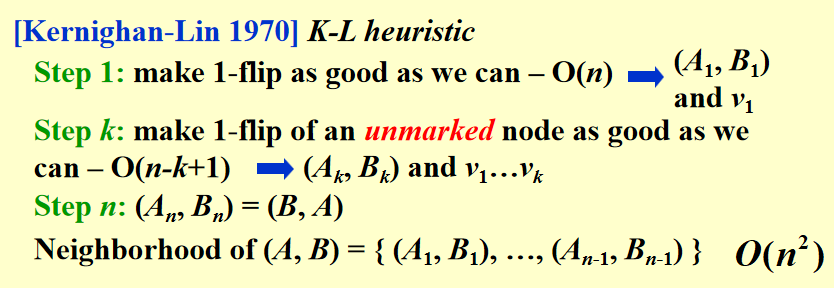

# 局部搜索
> 昔孟母，择邻处

!!!quote "引入"
    如果我们位于一座山上，所拥有的信息只有我们周围的地形，现在我们要下山，理所应当的，我们会选择当前所能看到的最低的位置前进，当然，这样的选择并不一定能够保证我们最终能够到达山脚下，有可能只是到达一个山谷；但是有时候这种方法是有效的。

局部搜索（Local Search）是一种常用的优化方法，主要用于求解大规模的优化问题，尤其是那些解空间较大且不容易通过全局搜索找到最优解的问题。局部搜索算法从一个初始解出发，在当前解的邻域中不断进行探索，以寻找更好的解，直到满足某些停止条件。

具体来说，局部搜索的基本流程包括以下几个步骤：

1. **初始化**：选择一个初始解。
2. **邻域搜索**：通过某种方式生成当前解的邻域解，即在当前解的基础上进行微小的改变，得到一组相似的解。
3. **选择最优邻域解**：从邻域解中选择一个“更优”的解，作为新的当前解。
4. **迭代**：重复邻域搜索和选择最优邻域解的步骤，直到满足停止条件（如达到最大迭代次数、解的改进达到一定程度等）。

局部搜索通常用于求解 **组合优化问题** （如旅行商问题、图着色问题等），尤其在搜索空间庞大的情况下，它通过聚焦在较小的局部区域内进行搜索，能够在较短的时间内找到一个较好的解，尽管该解不一定是全局最优。

局部搜索的一些常见变种包括：

- **爬山算法（Hill Climbing）**：一种简单的局部搜索方法，通过选择邻域中最好的解逐步优化，直到没有更好的解为止。
- **模拟退火（Simulated Annealing）**：在爬山算法的基础上引入了随机性，允许接受较差的解，从而避免陷入局部最优解。
- **禁忌搜索（Tabu Search）**：通过维护一个禁忌表来记录已经访问过的解，防止算法反复访问已探索过的区域，从而提高搜索效率。

局部搜索的优点是计算效率高、实现简单，但其缺点是容易陷入局部最优解(到达了山谷而不是山底)。

## 局部搜索的框架

**局部性(Locality)**

- 需要在neighborhood中进行搜索，即在可行集中的邻域进行搜索

- 需要保证局部最优是 **自身邻域** 的全局最优


**搜索**

- 从一个可行解开始，每一次迭代都会在当前解的邻域中选择一个更好的解

- 达到局部最优当且仅当邻域内没有更好的解

## 伪代码

S $\sim$ S' : S' is a neighboring solution of S, whree S' can be obtained by a {==slight modification==} of S.

即对S进行一次小的改变，得到S'。

N(S): neighborhood of S – the set { S': S $\sim$ S' }.

```cpp
SolutionType Gradient_descent()
{   Start from a feasible solution S  FS ;
    MinCost = cost(S);
    while (1) {
        S’ = Search( N(S) ); /* find the best S’ in N(S) */
        CurrentCost = cost(S’);
        if ( CurrentCost < MinCost ) {
            MinCost = CurrentCost;    S = S’;
        }
        else  break;
    }
    return S;
}
```

## 点集覆盖问题

{==Vertex Cover Problem==}

给定一个无向图$G=(V,E)$，以及一个正整数$K$，是否存在V的一个子集$C$，使得$C$中点的个数不超过$K$，且对于每一条边$(u,v)$ $\in$ $E$，至少有一个端点在$C$中。


{==Vertex cover problem (optimization)==}

在点集覆盖问题的基础上，找到最小的点集覆盖。

在这一问题中

- Feasible solution($\mathcal{FS}$): 所有点集覆盖的集合
- Cost(S) = |S|
- S $\sim$ S' 

在点集覆盖中，每一个点集覆盖S至多有|V|个邻居，即N(S)的大小是有限的。

- search: Start from S = V; delete a node and check if S' is a vertex cover with a smaller cost.

!!!Example
    <div align="center"></div>

    Case0,是正确的，依次删去所有点，最后得到的是空集，是一个点集覆盖。

    Case1,是错误的，因为删除了一个点后，我们将最优解删去了；


### 改进

如果我们可以容忍暂时的代价升高，有可能会遇到代价降低更好的情况

```cpp
SolutionType Metropolis()
{   Define constants k and T;
    Start from a feasible solution S in FS ;
    MinCost = cost(S);
    while (1) {
        S’ = Randomly chosen from N(S); //Adding is allowed
        CurrentCost = cost(S’);
        if ( CurrentCost < MinCost ) {
            MinCost = CurrentCost;    S = S’;
        }
        else {
            With a probability, let S = S’;
            else  break;
        }
    }
    return S;
}
```

## 模拟退火

!!!info
    这种改进的方法由Metropolis，Rosenbluth，Rosenbluth，Teller和Teller于1953年提出，被称为Metropolis算法。他们希望利用统计力学中的原理模拟物理系统的行为。在统计物理中有一个假设，当一个系统的能量为E时，它出现的概率为$e^{−E/kT}$，其中$T>0$是温度，$k$是玻尔兹曼常数。这个假设被称为Boltzmann分布。显然的，当$T$固定时，能量越低的状态出现的概率越大，因此一个物理系统也有更大的概率处于能量低的状态。然后我们考虑温度T的影响，当$T$很大时，根据指数函数的特点，不同能量对应的概率其实差别可能不是很大；但$T$较低的时候，不同的能量对应的概率差别就会很大。

基于玻尔兹曼分布，我们可以将Metropolis算法描述如下：

- 初始化：随机选择一个可行解 $S$，设 $S$ 的能量为 $E(S)$，并确定一个温度 $T$；

- 不断进行如下步骤：

(1) 随机选择 $S$ 的一个邻居 $S'$（可以按均匀分布随机选择）；

(2) 如果 $E(S') \leqslant E(S)$，则接受 $S'$ 作为新的解；

(3) 如果 $E(S') > E(S)$，则以概率 $e^{-(E(S')-E(S))/kT}$ 接受 $S′$ 作为新的解；如果接受了则更新解，继续下一轮迭代，否则保持原解 $S$，继续迭代。

直观地说，Metropolis算法就是在当前解S的邻居中随机选择一个解S′，如果S′的能量更低则接受，否则以一定概率接受一个更差的解——这就使得我们有可能跳出一个局部最优解。当然有一个注意的问题是，我们上面没有写算法的停止点，实际上进行到一个满意的结果中断算法即可。Metropolis等人证明了他们的算法具有如下性质

!!!Note
    设 $Z = \sum_{S } e^{−E(S)/kT}$，则对于任意状态 $S$，记$f_S(t)$为在$t$轮迭代中选到了状态$S$的比例，则当$t \to \infty$时，$f_S(t) \text{(以概率1收敛)} \to e^{−E(S)/kT}/Z$。

## Hopfield 神经网络

Hopfield神经网络是一种全连接的反馈神经网络，于1982年由J.Hopfeld教授提出;Hopfield神经网络有一个能量函数，如果能将能量函数与一个优化问题绑定，那么Hopfield神经网络就可以用来解决这个优化问题，例如旅行商问题

!!!Definition
    1. Hopfield 神经网络可以抽象为一个无向图 \( G = (V, E) \)，其中 \( V \) 是神经元的集合，\( E \) 是神经元之间的连接关系，并且每条边 \( e \) 都有一个权重 \( w_e \)，这可能是正数或负数：

    2. Hopfield 神经网络的一个状态 (configuration) 是指网络中每个神经元 (即图的顶点) 的状态的一个取值，倾向值能为 1 或 -1。我们记顶点u的状态为 \( s_u \)。

    3. 如果对于边 \( e = (u, v) \)，我们定义 \( c_e = w_e s_u s_v \)，我们希望$c_e < 0$

    4. 我们将上述条件的边称为“好”的 (good)，而称为“坏”的 (bad)。

    5. 如果我们一点是“满意的” (satisfied)，当且仅当它所连接的所有点中，好边的权重绝对值大于等于坏边的，即
       
    \[
    \sum_{(u,v) \in E} w_{e(u,v)} s_v s_u < 0,
    \]
    
    反之，如果不满足这一条件，我们称其为“不满意的” (unsatisfied)。

    6.最后，我们称一个构型是“稳定的（stable）”，当且仅当所有的点都是满意的

    <div align="center"></div>

### 局部搜索算法

如果要设计一个局部搜索算法，我想我们有一个非常简单直接的方式。在这一问题中，我们自然地就会定义一个构型的邻居就是将其中一个点的状态取反得到的新构型，然后我们就可以设计一个局部搜索算法了：我们从一个随机初始构型开始，然后检查每个点是否满意，如果有不满意的点，我们就翻转这个点的状态（那么这个点自然就变得满意了），然后继续检查，直到所有的点都满意为止。 **如果这个算法会停止** ，那么停止的时候我们得到的就是一个稳定构型：因为所有点都满意了;

我们称为状态翻转算法（State flipping algorithm）：

```cpp
ConfigType State_flipping()
{
    Start from an arbitrary configuration S;
    while ( ! IsStable(S) ) {
        u = GetUnsatisfied(S);
        su = - su;
    }
    return S;
}
```

!!!idea "这个算法一定会停止吗"
    {==
    *State_flipping算法至多反转$\sum_{e \in E}|w_e|$后会停止*
    ==}

    首先，定义势能函数为一个构型$S$所有好边的权重的绝对值之和

    \[
    \Phi(S) = \sum_{e \in E} |w_e| \cdot \mathbb{I}(c_e < 0)
    \]

    显然，对于任意的构型$S$，$\Phi(S) \geqslant 0$，并且最大值就是所有边的权重绝对值之和。即

    \[
    \Phi(S) \leqslant \sum_{e \in E} |w_e|
    \]

    假设当前状态为$S$,有一个不满意的点$u$，那么我们将$u$的状态取反变为$\overline{u}$，设此时状态为$S'$，那么

    \[
        \Phi(S') - \Phi(S) =  \sum_{e=(u,v),e \in bad} |w_e| - \sum_{e=(u,v),e \in good} |w_e| \geqslant 0
    \]

    这是因为翻转后原先与 $u$ 相连的好边都变成了坏边，坏边都变成了好边，其余边没有变化。又因为 $u$ 是不满意的，因此与 $u$ 相连的坏边比好边权重绝对值之和大，所以上式大于 0

    势能函数只能取整数值，所以 $\Phi(S') \geqslant \Phi(S)+1$

    这就意味着我们每次翻转一个不满意的点，势能函数就会增加至少 1。因为势能函数的取值范围是有限的（0 到所有边权重绝对值之和），所以我们的局部搜索算法一定会停止;

    有推论:

    设 $S$ 是一个构型，如果 $\Phi(S)$ 是局部最大值，则 $S$ 是一个稳定构型

    证明：如果 $S$ 不是一个稳定构型，那么至少有一个点是不满意的，我们可以翻转这个点，势能函数会增加至少 1，这就意味着 $\Phi(S)$ 不是局部最大值，矛盾。

## 最大割问题 (Max Cut)

最大割问题也是一个经典的 NP 困难问题，在这一问题中，我们希望将一个边权全为正的无向图 $G =
(V, E)$ 的顶点集合 $V$ 分成两个集合 $A$ 和 $B$（这时的解记为 $(A, B)$），使得割边的权重和最大，其中割边的含义就是一条边的两个端点分别在 $A$ 和 $B$ 中，即我们要最大化

\[
   w(A,B) = \sum_{(u, v) \in E} w_{uv} \cdot \mathbb{I}(u \in A, v \in B)
\]


!!!Note "与Hopfield的关联"
    我们希望给出一个局部搜索解法----这是非常自然的，因为它和 Hopfield 神经网络问题之间有一个很直接的关联。我们有一个很简单的观察，对于任意的解 $(A, B)$，然后将 $A$ 中的点赋状态$-1$，$B$ 中的点赋状态 $1$，因为所有边的权重都是正数，所以最大化割边权重和对应于$Hopfield$ 神经网络问题其实就是最大化好边的总权重和 $\Phi(S)$，这就和 Hopfield 神经网络问题一样了,使用State flipping算法即可


### 局部算法与最优解的关系

在最大割问题中，我们可以证明局部搜索算法的最优解和全局最优解之间的关系：局部搜索算法给出的局部最优解最差也不会低于最优解的一半

即

**设 $(A, B)$ 是如上局部搜索算法得出的一个局部最优解，$(A^∗, B^∗)$ 是最优解，则**

\[
    w(A, B) \geqslant \frac{1}{2} w(A^∗, B^∗)
\]

!!!Proof
    设 $u \in A$,因为$(A,B)$是局部最优解，所以，如果将$u$从$A$中移到$B$中，割边权重和会减少；即

    \[
        \sum_{v \in A} w_{uv} \leqslant \sum_{v in B} w_{uv}
    \]    
    
    对所有的$u \in A$都成立，所以求和得到

    \[
        \sum_{u \in A}\sum_{v \in A} w_{uv} \leqslant \sum_{u \in A}\sum_{v \in B} w_{uv}
    \]

    等式左边为$A$中所有的边权重和的两倍，右边为$A$和$B$之间的边权重和(所有的割边的权重和)，所以

    \[
        2w(A,A) \leqslant w(A,B)
    \]

    同理，我们可以得到

    \[
        2w(B,B) \leqslant w(A,B)
    \]

    我们又知道，总的边权重和为

    \[
        W = w(A,A) + w(B,B) + w(A,B)
    \]

    所以

    \[
        w(A^*,B^*) \leqslant w(A,B) + w(A,A) + w(B,B) \leqslant 2w(A,B)
    \]

### 优化

事实上在控制迭代次数引起的复杂度时非常常用（这里就是求 $\Phi(S)$ 的局部最优值需要的迭代次数可能太多）。我们要求算法在找不到一个能对解有 “比较大的提升” 的时候就停止，即使当时的解不是局部最优解：

当我们处于解 $w(A, B)$ 时，我们要求下一个解的权重至少要增大$\dfrac{2\varepsilon}{n}w(A, B)$，其中 $n$ 是图 $G$ 的顶点数。对于这一算法，我们有如下结论：

**设 $(A, B)$ 是如上局部搜索算法得出的一个解，$(A^∗, B^∗)$ 是最优解，则**

\[
    w(A, B) \geqslant \frac{1}{2+\varepsilon} w(A^∗, B^∗)
\]

并且这一算法会在 $O(\dfrac{n}{\varepsilon} \log W)$ 次状态翻转后停止，其中 $W$ 是所有边的权重之和

!!!Proof
    对于任意的解 $(A, B)$，设$u \in A$

    \[
        \sum_{v \in A} w_{uv} \leqslant \sum_{v \in B} w_{uv} + \frac{2\varepsilon}{n} w(A,B)
    \]

    对所有的$u \in A$都成立，所以求和得到

    \[
        2w(A,A) \leqslant w(A,B) + \frac{2\varepsilon}{n} w(A,B) \cdot n_A
    \]

    其中 $n_A$ 是 $A$ 中的点数，同理

    \[
        2w(B,B) \leqslant w(A,B) + \frac{2\varepsilon}{n} w(A,B) \cdot n_B
    \]

    所以

    \[
        w(A^*,B^*) \leqslant w(A,B) + w(A,A) + w(B,B) \leqslant 2w(A,B) + \varepsilon w(A,B) 
    \]

    因为我们每次反转会使得割边权重和增加$1+\dfrac{\varepsilon}{n}$倍，所以我们需要$O(\dfrac{n}{\varepsilon} \log W)$次状态翻转后会达到停止条件

???Summary "选择更好的邻居"
    