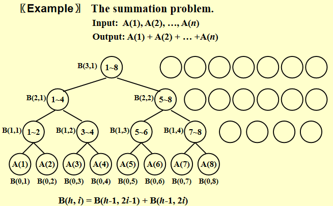
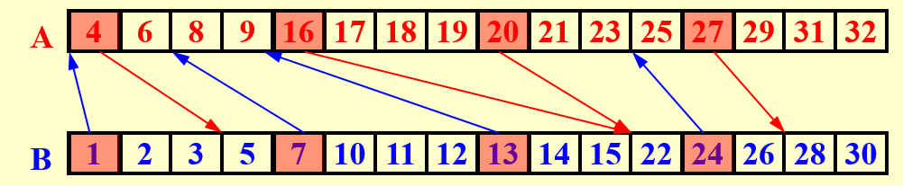

# 并行算法


并行算法的设计是为了提高计算效率和性能。随着数据量的增加和计算任务的复杂化，单一处理器的计算能力已经无法满足需求。通过并行算法，可以将一个大的计算任务分解成多个小任务，并行执行，从而显著减少计算时间
。从而更好利用现代计算机多核的优势

## 概念与定理

!!!Definition
    **加速比 (Speedup)**  是指在并行计算中，使用 \( p \) 个处理器时相对于使用一个处理器时的性能提升比例，记为 \( S(p) \)，

    \[ S(p) = \frac{T_1}{T_p} \]
    
    其中 \( T_1 \) 是使用一个处理器时的运行时间，\( T_p \) 是使用 \( p \) 个处理器时的运行时间。

    理想加速比:

    \[ S(p) = \frac{T_1}{T_p} = p \]

    **内存共享方式**

    1. **EREW (Exclusive Read Exclusive Write)**: 每个内存位置在任意时刻只能被一个处理器读取或写入；
    
    2. **CREW (Concurrent Read Exclusive Write)**: 每个内存位置在任意时刻可以被多个处理器读取，但只能被一个处理器写入；
    
    3. **CRCW (Concurrent Read Concurrent Write)**: 每个内存位置在任意时刻可以被多个处理器读取或写入，因为写入涉及到同时写入不同值可能造成的冲突。因此写入策略可以分如下三种:
    
        (a) **CRCW-C (Common)**: 所有处理器写入的值相同时才会写入；
        
        (b) **CRCW-A (Arbitrary)**: 所有处理器写入的值可以不同，任意读取其中一个写入即可；
        
        (c) **CRCW-P (Priority)**: 所有处理器写入的值可以不同，但存在一个优先级，只有优先级最高的写入才会生效。


!!!info "阿姆达尔定律"
    设 \( 0 \leqslant f \leqslant 1 \) 是一个程序中必须串行执行的部分的比例，那么使用 \( p \) 个处理器的最大加速比 \( S(p) \) 满足

    \[
    S(p) = \frac{1}{f + (1-f)/p}
    \]

    **证明**: 设整个程序中串行部分的时间为 \( t \)，那么串行部分的时间为 \( ft \)，并行部分的时间为 \( (1-f)t \)。使用 \( p \) 个处理器时，串行部分的时间不变，而并行部分的时间最少为 \( (1-f)t/p \)，因此总的时间最少为 \( ft + (1-f)t/p \)，因此加速比最大为

    \[
    S(p) = \frac{t}{ft + (1-f)t/p} = \frac{1}{f + (1-f)/p}
    \]

    这个定律假定串行部分不可独立于问题大小


!!!info "Gustafson定律"
    设某个程序使用 \( p \) 个处理器并行执行时，串行部分花费的时间为 \( f_1 \)（不是比例），并行部分花费的时间为 \( f_2 \)，那么使用 \( p \) 个处理器的最大加速比 \( S(p) \) 满足

    \[
    S(p) = \frac{f_1 + f_2 \cdot p}{f_1 + f_2}
    \]

    **证明**: 由此可知，使用 \( p \) 个处理器并行执行的时间为 \( T_p = f_1 + f_2 \)，使用一个处理器单件执行的时间应当为 \( T_1 = f_1 + f_2 \cdot p \)，因此加速比为

    \[
    S(p) = \frac{T_1}{T_p} = \frac{f_1 + f_2 \cdot p}{f_1 + f_2}
    \]
    
    
!!!info "孙-倪定律"
    定理 14.4 (孙-倪定律, 1990) 设某个程序串行部分占比为 \( f \)，并行部分占比为 \( 1-f \)，内存受限函数为 \( G(p) \)，那么使用 \( p \) 个处理器的最大加速比 \( S(p) \) 满足

    \[
    S(p) = \frac{f + (1-f) \cdot G(p)}{f + \frac{(1-f) \cdot G(p)}{p}}
    \]


!!!Definition
    \[
         D = T_{\infty}
    \]
    
    $D$ 具有无穷多个处理器时的时间

    \[
        W = T_1
    \]
    
    $W$ 是使用一个处理器时的时间


    \[
        \frac{D}{W} = \frac{T_{\infty}}{T_1}
    \]

    定义为算法的平均并行度


!!!info "布伦特定律"
    定理 14.5 (布伦特定律, Brent's Theorem) 设一个并行计算用到的工作量为 \( W \)，关键路径长度为 \( D \)，那么使用 \( p \) 个处理器的并行时间满足如下不等式：

    \[
    \frac{W}{p} \leqslant T_p \leqslant \frac{W - D}{p} + D
    \]

    证明: 下界是显然的，因为 \( T_p \geqslant T_{\infty} \)，而 \( T_{\infty} \) 也是受理想模型加速比的限制的，因此 \( T_p \geqslant W/p \)。

    对于上界，因为关键路径长度为 \( D \)，因此能够并行执行的计算可以分为 \( D \) 个内部任务，互相之间有前后的依赖，设每个阶段的工作量为 \( W_i \)，则有

    \[
    W = \sum_{i=1}^{D} W_i
    \]

    使用 \( p \) 个处理器时，每一个阶段所需的时间为 \( \lceil W_i/p \rceil \)，向上取整的原因在于，每个阶段的工作量可能不能被整除。因此如果任务分成了 7 个任务，每个任务有 3 个处理器，那么每个处理器会分到的任务个数是 2, 2, 3。

    因此我们需要的时间就是

    \[
    T_p = \sum_{i=1}^{D} \left\lceil \frac{W_i}{p} \right\rceil = \sum_{i=1}^{D} \left( \left\lfloor \frac{W_i - 1}{p} \right\rfloor + 1 \right) \leqslant \sum_{i=1}^{D} \left( \frac{W_i - 1}{p} + 1 \right) = \frac{W - D}{p} + D.
    \]

    其中我们使用了等式

    \[
    \left\lceil \frac{x}{y} \right\rceil = \left\lfloor \frac{x+y-1}{y} \right\rfloor + 1
    \]
    

## 前缀和问题

首先，对于求和问题，可以转换为二叉树的求和问题，每个节点表示一个求和操作，每个节点有两个子节点，分别表示两个求和操作。


<figure markdown="span">
  { width="70%" }
  <figcaption>求和问题</figcaption>
</figure>

对于前缀和问题，先定义如下式子

\[
    C(h,i) = \sum_{k=0}^{\alpha} A(k)
\]

其中 \( h \) 表示树的高度，\( i \) 表示树的第 \( i \) 个节点，\( \alpha \) 表示树的最右下角节点的 \( i \) 值，\( A(k) \) 表示数组 \( A \) 的第 \( k \) 个元素。

在计算前缀和时，先从上往下计算得到每一个部分和的$B$值，然后从下往上计算得到每一个部分和的$C$值。

并且运用以下性质

1. 如果 \( i = 1 \)，那么 \( C(h, i) = B(h, i) \)，这是因为 \( i = 1 \) 的时候，根据定义，\( C(h, 1) \) 是从第 1 个元素加到这 \( i \) 点为根的子树右下角的叶子节点。而 \( B(h, 1) \) 实际上也就是从第一个元素加到这 \( i \) 点为根的子树右下角的叶子（看图可以很清楚地看出）。

2. 如果 \( i \) 是偶数，这表明这 \( i \) 点是其父点的右儿子，因此它和它的父亲根右下角的叶子是同一个，因此有 \( C(h, i) = C(h + 1, i/2) \);

3. 如果 \( i \) 是奇数且不是 1，这表明这一点是某个点的左儿子，首先它自己的值 \( B(h, i) \) 不是从 1 开始加的，所以我们要选一个左边的点，把从 1 开始加到这个点对应的之前的部分补上，即 \( C(h, i) = C(h + 1, (i - 1)/2) + B(h, i) \)。需要注意的是，如果不是并行算法，\( C(h + 1, (i - 1)/2) \) 可以替换为 \( C(h, i - 1) \)，但因为并行算法要求每一行是一起算出来的，所以要用上一行的才合理。或者用他父亲的\(C\)减去他兄弟的\(B\)

<figure markdown="span">
  { width="80%" }
  <figcaption>前缀和问题</figcaption>
</figure>

## 归并问题

归并 - 将两个非递减数组 \( A(1), A(2), \ldots, A(n) \) 和 \( B(1), B(2), \ldots, B(m) \) 归并成另一个非递减数组 \( C(1), C(2), \ldots, C(n+m) \)

### 直接查找

!!!idea 
    既然我们可以设计并行算法，那么如果我们能同时将所有 \( A \) 和 \( B \) 中的元素在最后的数组 \( C \) 中的位置找到，然后同时将它们放到正确的位置上，那么我们就可以以很快的速度解决这一问题
    

    这里的关键步骤就是同时找到 \( A \) 和 \( B \) 中的元素在 \( C \) 中的位置，这是一个并不困难的问题。例如对 \( A \) 中的元素 \( A[i] \)，它在 \( A \) 中恰是 \( i+1 \) 个元素（下标从 0 开始），即在它前面有 \( i \) 个元素。如果我们能找到它在 \( B \) 中处于

    \[
    B[l] < A[i] < B[l+1]
    \]

    的位置，那么 \( B \) 中有 \( l+1 \) 个元素在合并后的 \( C \) 中位于 \( A[i] \) 前面。因此此时 \( A[i] \) 在 \( C \) 中的位置就是 \( C[i + l + 1] \)，这样它前面就有 \( i + (l + 1) \) 个元素。对 \( B \) 中的元素 \( B[k] \) 也有类似的分析。

<figure markdown="span">
  { width="80%" }
  <figcaption>排列规则</figcaption>
</figure>


```cpp
for Pi , 1 <= i <= n  pardo
    C(i + RANK(i, B)) := A(i)
for Pi , 1 <= i <= n  pardo
    C(i + RANK(i, A)) := B(i)
```
    

有两种策略

1. **逐个元素二分查找**: 使用二分查找定位到一个元素在另一个数组中的位置其需要 \( O(\log n) \) 的时间，即 \( D = O(\log n) \)，总工作量为 \( O(n \log n) \)；然后我们需要将所有元素放到正确的位置上。这一步复杂为 \( O(1) \)，总工作量为 \( O(n) \) (如果数组长度不同则是 \( O(n+m) \))，两步合起来复杂为 \( O(\log n) \)，总工作量为 \( O(n \log n) \)。

2. **整体性查找**: 伪代码如下

```cpp
i = j = 0; 
while ( i <= n || j <= m ) {
    if ( A(i+1) < B(j+1) )
        RANK(++i, B) = j;
    else RANK(++j, A) = i;
}
```

实际上和归并排序的操作并无本质差别，就是两个数组的元素从头依次向后比较，因此完全没有并行，深度和总工作量都是 \( O(n) \)（或者数组长度不同就是 \( O(m + n) \)）

### 划分范式

划分范式的想法非常简单，且实际运用起来非常有效，分为如下两个步骤：


1. **划分 (partitioning)**: 把问题划分为多（设为 \( p \) 个）很小的子问题。每个子问题大小大致为 \( n/p \)；

2. **实际工作 (actual work)**: 同时对所有子问题进行处理，得到最终结果。


划分：我们将每个数组划分为 \( p \) 份（此时 \( p \) 未知，分析后我们可以选取到最优的 \( p \)），\( p \) 是一个很大的值，每个子问题很小，如 PPT 第 17 页图所示。我们首先对每个子问题的第一个元素求出它们在另一个数组的位置，这一步应当使用二分查找，否则因为子问题很多，使用线性查找会导致总工作量达到 \( O(p \cdot n) \)，这几乎是平方级别的工作量，显然是不可接受的；因此我们使用二分查找，这样深度为 \( O(\log n) \)，总工作量为 \( O(p \log n) \)；

<figure markdown="span">
  { width="80%" }
  <figcaption>划分A</figcaption>
</figure>
<figure markdown="span">
  { width="80%" }
  <figcaption>划分B</figcaption>
</figure>
<figure markdown="span">
  { width="80%" }
  <figcaption>得到互不相干子问题</figcaption>
</figure>

真实工作：现在剩下的工作就是相邻两个箭头之间的部分需要在这一很小的区域内确认相对位置，因为这些位置确定后直接可以根据上一步划分中得到的结果确定在整
个最终的数组中的位置。


注意，很显然的一点是，这些箭头不会交叉，这是由箭头代表的大小关系决定的。另一方面，相邻两个箭头之间的距离一定不超过 \( n/p \)，因为一旦超过 \( n/p \)，那其中一定会有一个箭头（箭头出现的频率是每 \( n/p \) 个元素一次）。并且一个数组上有 \( p \) 个出发的位置和 \( p \) 个到达的位置，所以在任意一个数组上，出发点和到达点一共最多有 \( 2p \) 个。然后两个数组的这些划分区域按图中形式一一对应进行计算，每个区域实际上就是一个子问题，即现在还剩下 \( 2p \) 个大小为 \( O(n/p) \) 的子问题。这时我们并行对每个子问题直接使用线性查找即可，因为每个子问题都非常小（大小为 \( O(n/p) \)），此时深度为 \( O(n/p) \) 也很小，总工作量为 \( 2p \cdot O(n/p) = O(n) \) 是符合要求的。而如果使用二分查找，总工作量为


\[
2p \cdot \frac{n}{p} \cdot O\left(\log \frac{n}{p}\right) = 2n \log \frac{n}{p},
\]

这是因为有 \( 2p \) 个子问题，每个子问题都至多有 \( \frac{n}{p} \) 个元素要用至多 \( \log \left( \frac{n}{p} \right) \) 的时间确定位置，这并无法保证是 \( O(n) \) 的。


现在的问题就在于，还有两个时间复杂度未定：第一步划分的总工作量为 \( O(p \log n) \)，第二步真实工作的深度为 \( O(n/p) \)。我们希望找到一个最优的 \( p \)，使得第一步总工作量是 \( O(n) \) 的，第二步深度是 \( O(\log n) \) 的。这样我们就可以得到一个深度为 \( O(\log n) \)，总工作量为 \( O(n) \) 的并行算法，成功做到取长补短。事实上，我们很容易看出，\( p = \frac{n}{\log n} \) 就是满足条件的，因此我们就选取这个 \( p \)，得到了一个深度为 \( O(\log n) \)，总工作量为 \( O(n) \) 的并行算法。


## 寻找最大元素

给定一组数列 \( A \)，要求找到其中最大的元素。


### 不使用划分范式

类似于前面求和问题的做法，构造一棵二叉树，初始元素两两分组比较，然后逐层上递，最终得到最大值。这样的算法深度为 \( O(\log n) \)，总工作量为 \( O(n) \)

我们可以采取更激进的策略：为什么不一次性比较所有元素呢？这样深度只需 \( O(1) \)。如果不考虑总工作量过大的问题，这种方法是可行的：并行比较每一对元素 \( A[i] \) 和 \( A[j] \)，只要 \( A[i] \) 在比较中较小，就在新数组 \( B[i] \) 中写入 1（初始时 \( B \) 的所有位置为 0）。最终，最大的元素从未被写入 1，因此仍为 0。我们并行检查 \( B \) 中哪个元素为 0，即为最大值。

这类似于一场混战，每个人都要与他人对战，胜者留下，败者离场。最后留下的就是最大者。

在并行比较每对元素时，可能会有多个线程同时写入数组 \( B \)。实际上，我们只需使用前面提到的 CRCW 策略，允许同时写入，并按 common 规则写入即可，因为所有线程在任意 \( B[i] \) 处只会写入数字 1，故用 common 规则即可实现写入。

显然，这种算法的深度非常理想，为 \( O(1) \)，但总工作量主要在于比较每对元素的值，因此为 \( O(n^2) \)。如果能在总工作量和深度上取长补短，这两种方法将非常完美。

### 双对数划分范式(double logarithmic partitioning)

双对数范式是一种可以二叉树的扩展。在完全二叉树中，设叶子的数量为 \( n \)，那么树高是 \( \log n \) 级别的，
这里双对数则是希望构造一棵树，使得树高是 \( \log \log n \) 级别的。为了构造这样一棵树，我们首先设树
中每个节点的 level 为从根到该节点的距离（需要经过的边数），根的 level 为 0。接下来我们构造这棵
树如下：

1. 设某个节点的 level 为 \( s \)，当 \( s \leq \log \log n - 1 \) 时，则它有 \( 2^{2^{h-s-1}} \) 个孩子；

2. 当 \( s = \log \log n \) 时，它有 2 个孩子作为树的叶子。


事实上，我们可以观察到，当一个节点的层级（level）为 \( s \) 且不在倒数两行时，根据定义，它有 \( 2^{2^{h-s-1}} \) 个孩子。以该节点为根的子树的叶子数量可以计算为 \( 2^{2^{h-s}} \)。我们知道：

\[
2^{2^{h-s-1}} = \sqrt{2^{2^{h-s}}}
\]

这意味着在每个节点处，我们实际上将问题分成了 \( \sqrt{m} \) 个子问题，其中 \( m \) 是该节点对应的子树的叶子数量。我们知道，在双对数树中，某一层单个节点为根的子树的叶子数，其实是上一层某个节点为根的子树的叶子数的平方根（因为层数为 \( s \) 的某个节点，以它为根的子树的叶子数量是 \( 2^{2^{h-s}} \)，每增加一层 \( s \) 实际上就是开一次平方根）。因此，层数越往下，子问题的大小逐步开平方根。

假设原问题的输入大小为 \( n \)，我们可以通过添加一些虚拟节点（dummy nodes）来构造出以这 \( n \) 个节点为叶子的双对数树。这样，我们就可以使用双对数范式来设计一个并行算法，即在每一层将问题分为 \( \sqrt{m} \) 个子问题，其中 \( m \) 是这一层单个节点为根的子树的叶子数量。这样，每个子问题（实际上就是树上的某个节点）对应的叶子数也就是 \( \sqrt{m} \)，这就与双对数树结合起来了。我们熟知的二叉树则是每层分成两个子问题，是更简单的策略。


将这一思路套用在我们的问题上：我们首先将数组划分为 \( \sqrt{n} \) 份，每一份的大小为 \( \sqrt{n} \)，然后我们并行递归找到每一份中的最大值，最后在归并阶段再并行找到这 \( \sqrt{n} \) 个最大值中的最大值即可。设整个算法深度为 \( D(n) \)，工作量为 \( W(n) \)，它们都是关于数组长度的函数。每一份中的最大值我们采用递归的策略，因此长度为 \( \sqrt{n} \) 的数组的最大值的寻找需要 \( D(\sqrt{n}) \) 的深度和 \( W(\sqrt{n}) \) 的总工作量。以上是递归阶段，在归并阶段，返回的 \( \sqrt{n} \) 个最大值中的最大值我们采用前面的两两比较的方法即可，深度为 \( O(1) \)，总工作量为 \( O((\sqrt{n})^2) = O(n) \)。于是我们按照分治法的方式可以写出递推式

\[
   D(n) = D(\sqrt{n}) + O(1)
\]

\[
   W(n) = \sqrt{n} W(\sqrt{n}) + O(n)
\]

换元法得到 $D(n) = O(\log \log n)$，$W(n) = O(n \log \log n)$。


<figure markdown="span">
  { width="80%" }
  <figcaption>双对数划分范式</figcaption>
</figure>


### 加速级联范式(accelerated cascade)
1. 将数组分为 \( \frac{n}{\log \log n} \) 份，即每一份的大小为 \( \log \log n \)，实际上每一份的大小都很小了，所以我们可以直接利用线性查找的方式找到每一份的最大值，则每一份的深度和工作量都是 \( O(\log \log n) \) 的；
2. 然后我们对上面求出的 \( \frac{n}{\log \log n} \) 个最大值使用双对数范式的算法。


总的深度为每一份的深度加上双对数范式的深度，即 

\[
D(n) = O(\log \log n) + O(\log \log (n/\log \log n)) = O(\log \log n)
\]


总工作量为每一份的工作量之和加上双对数范式的总工作量，即 

\[
    W(n) = \frac{n}{\log \log n} \cdot O(\log \log n) + O(n/ \log \log n \cdot \log \log(n/ \log \log n)) = O(n)
\]


### 随机算法

看起来我们还有改进的空间，毕竟当初暴力的两两比较方法能实现 O(1) 的深度。接下来的随机算法，它可以保证以非常高的概率在 O(1) 的深度和 O(n) 的工作量内找到最大值。

1. **第一步**: 从长度为 \( n \) 的数组 \( A \) 中，依照均匀分布取出 \( n^{7/8} \) 个元素，得到新的数组记为 \( B \)。这一步需要 \( n^{7/8} \) 个处理器各自负责抽一个然后放到内存中某个位置，深度为 \( O(1) \)，总工作量为 \( O(n^{7/8}) \)。

2. **第二步**: 求出 \( B \) 中的最大值，使用确定性的算法实现，通过如下三个子步骤实现：
   -  把 \( B \) 分成 \( n^{3/4} \) 个长度为 \( n^{1/8} \) 的子数组，然后使用两两比较的暴力算法并行找到每个子数组的最大值。这一步深度为 \( O(1) \)，总工作量为 \( O(n^{3/4} \cdot (n^{1/8})^2) = O(n) \)，因为有 \( n^{3/4} \) 个子数组，每个子数组用两两比较的办法的复杂度是数组长度平方级别的；然后将这 \( n^{3/4} \) 个最大值放在新数组 \( C \) 中。
   -  把 \( C \) 分成 \( n^{1/2} \) 个长度为 \( n^{1/4} \) 的子数组，然后使用两两比较的暴力算法并行找到每个子数组的最大值。这一步深度为 \( O(1) \)，总工作量为 \( O(n^{1/2} \cdot (n^{1/4})^2) = O(n) \)，然后将这 \( n^{1/2} \) 个最大值放在新数组 \( D \) 中。
   -  数组 \( D \) 直接使用两两比较的方法找到最大值。这一步深度为 \( O(1) \)，总工作量为 \( O((n^{1/2})^2) = O(n) \)。

综合上述方法，整个第二步相当于一个三轮的淘汰赛，整体而言第二步的深度为 \( O(1) \)，总工作量为 \( O(n) \)，并且我们能求出 \( B \) 中的最大值，也就是抽取的 \( n^{7/8} \) 个元素中的最大值。


第三步：目前我们只得到了 \( n^{7/8} \) 个元素中的最大值（记为 \( M \)）。如何进一步提高概率呢？答案是再来一轮，但这再来一轮是有讲究的。这一步我们首先均匀分布取出 \( n^{7/8} \) 个元素，得到数组 \( B \)。然后用 \( n \) 个处理器，每个处理器放 \( A \) 的一个元素，与前一步得到的 \( M \) 进行比较。如果小于 \( M \)，则什么也不用做；大于 \( M \) 则往数组 \( B \) 的一个随机位置写入这一更大的值。为什么要随机写入呢？因为一共 \( n \) 个处理器，但只有 \( n^{7/8} \) 个位置可供选择，不能一一对应位置供每个处理器使用，但我们又要在 \( O(1) \) 时间内完成位置分配，只能是随机了。写完后，我们再次求出更新后的 \( B \) 中的最大值。这一步的深度和工作量与第二步相同，因此是 \( O(1) \) 的深度和 \( O(n) \) 的工作量。


{==

以上算法以非常高的概率在 \( O(1) \) 的深度和 \( O(n) \) 的工作量内找到数组 \( A \) 中的最大值：存在常数 \( c \)，使得算法只有 \( \frac{1}{n^c} \) 的概率无法在这一时间复杂度内找到最大值。

==}


