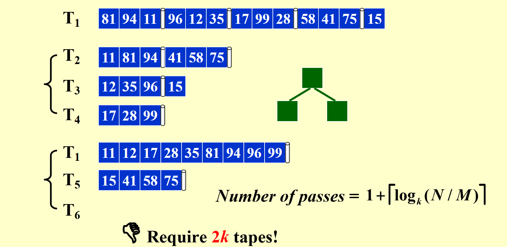

# 外部排序(External Sorting)

大部分排序算法都依赖于内存可以直接寻址的特性，但是如果数据输入在磁带上，由于磁带只能被顺序访问，所以适合用于外部排序的排序算法是归并排序。

## 简单做法

<figure markdown="span">
  { width="80%" }
  <figcaption>简单做法</figcaption>
</figure>

假设一开始数据存在磁带$T_1$上，外部内存容量是3，则依次读取3个数据为一组，交替放在磁带$T_2$和$T_3$上，然后按对应归并$T_2$和$T_3$上的数据，结果交替放在$T_1$和$T_4$上，然后重复这个过程，直到所有数据都排序完成。

!!!Definition  
    - run: 每组排好序的数据称为一个run
    - pass: 将所有数据读过一遍的称为一个pass

对于上述的例子，需要第一次从$T_1$读的一个pass加上下面三个归并的过程，一共有$1+3=4$个pass。

对于$N$个数据，如果外部内存容量是$M$，则需要$1+\lceil \log_2(N/ M) \rceil$个pass。

## K-way Merge

第一个优化方向就是减少工作的趟数，显然如果我们使用 k 路的归并，也就是每次归并 k 条纸带上对应位置的顺串，那么每次合并后顺串长度增加 k 倍，因此加上初始的 1 趟，我们只需要$ 1 + \lceil \log_k(N/M) \rceil $趟即可完成排序，减少了趟数，因此减少了磁带移动的次数，从而减少总时间。这样的算法称为 k 路合并。

k 路合并有一个实现上需要注意的点，因为我们是 k 个顺串要合并，因此我们需要不断的在 k 个元素中选取最小值放到输出的磁带上，这个操作可以使用优先队列来实现。

<figure markdown="span">
  { width="80%" }
  <figcaption>k 路合并</figcaption>
</figure>

!!!key-point  
    对于k路合并，需要$2k$个tape。

## 多相合并

为了优化多路合并对于磁带数的成本，我们考虑多相合并，这种方法对于多路合并的磁带成本可以从$2k$减少到$k+1$。

首先，假设我们有三个磁带，使用2-way merge:

<figure markdown="span">
  { width="80%" }
  <figcaption>均分</figcaption>
</figure>

设有三盘磁带$T_1、T_2$和$T_3$。在$T_1$上有一个输入文件，它将产生$34$个顺串(run)。我们可以选择在$T_2$和$T_3$的每一盘磁带中放入$17$个顺串。然后，将结果合并到$T_1$上，得到一盘有$17$个顺串的磁带。由于所有的顺串都在一盘磁带上，因此我们必须将其中的一些顺串放到$T_2$上以进行另一次合并。合并的逻辑是将前$8$个顺串从$T_1$拷贝到$T_2$并进行合并。这样做的结果是，每次合并都需要额外的复制工作，而复制也需要磁头的移动，这是一项昂贵的操作，因此这种方法并不好。如果我们继续完成所有步骤，我们会发现总共需要$1$次初始操作$+6$次合并工作，外加$5$次复制操作,This sucks.

<figure markdown="span">
  { width="80%" }
  <figcaption>不均分</figcaption>
</figure>

另一种选择是把原始的 $34$个顺串不均衡地分成两份。设我们把$21$个顺串放到$T_2$上，而把$13$个顺串放到$T_3$上。然后，在$T_3$用完之前将$13$个顺串合并到$T_1$上。然后我们可以将具有$13$个顺串的$T_1$和$8$个顺串的$T_2$合并到$T_3$上。此时，我们合并$8$个顺串直到$T_2$用完为止，这样，在$T_1$上将留下$5$个顺串，而在$T_3$上则有$8$个顺串。然后，我们再合并$T_1$和$T_3$，等等，直到合并结束。

???eg "详细过程"
    <figure markdown="span">
      { width="80%" }
      <figcaption>2</figcaption>
      { width="80%" }
      <figcaption>3</figcaption>
      { width="80%" }
      <figcaption>4</figcaption>
      { width="80%" }
      <figcaption>5</figcaption>
      { width="80%" }
      <figcaption>6</figcaption>
    </figure>

    最后使用了$1+7=8$个pass。

事实上，我们给出的最初 21 + 13 的分配是最优的，否则都可能出现上面的需要复制或者有长短不对齐导致浪费的情况。如果顺串的个数是一个斐波那契数 \( F_n \)，那么分配这些顺串最好的方式是把它们分裂成两个斐波那契数 \( F_{n-1} \) 和 \( F_{n-2} \)。否则，为了将顺串的个数补足成一个斐波那契数就必须用一些哑顺串（dummy run）来填补磁带。

将上述算法应用到k-way merge，则需要k阶斐波那契数。

定义为

\[
F^{(k)}(n) = F^{(k)}(n-1) + F^{(k)}(n-2) + \cdots + F^{(k)}(n-k)
\]

且

\[
F^{(k)}(0) = F^{(k)}(1) = \cdots = F^{(k)}(k-2) = 0, F^{(k)}(k-1) = 1
\]

经过第一个pass之后,k+1个tape的结构如下

\[
\begin{align*}
tape1: & \quad F^{(k)}(n-1) + F^{(k)}(n-2) + \cdots + F^{(k)}(n-k+1) + F^{(k)}(n-k) \\
tape2: & \quad F^{(k)}(n-1) + F^{(k)}(n-2) + \cdots + F^{(k)}(n-k+1) \\
& \quad \vdots \\
tapek: & \quad F^{(k)}(n-1) \\
tapek+1: & \quad 0
\end{align*}
\]

然后合并1-k个tape，结果放在tapek+1上，结果如下

\[
\begin{align*}
tape1: & \quad F^{(k)}(n-2) + F^{(k)}(n-3) + \cdots + F^{(k)}(n-k) \\
tape2: & \quad F^{(k)}(n-2) + F^{(k)}(n-3) + \cdots + F^{(k)}(n-k+1) \\
& \quad \vdots \\
tape k: & \quad 0 \\
tape k+1: & \quad F^{(k)}(n-1) = F^{(k)}(n-2) + F^{(k)}(n-3) + \cdots + F^{(k)}(n-k-1)
\end{align*}
\]

此时我们的顺串个数分布与之前的是类似的，只是下标减了 1，因此我们可以继续合并除磁带 k 外每个磁带的前 \( F^{(k)}(n-2) \) 个顺串，将合并后的结果放到磁带 k 上，以此类推，直到顺串个数为 1，此时我们就完成了排序。

## 缓存并行处理(copy from wyy's Handout)

在实现外部排序时，我们通常会分块读取数据，而不是每次比较后立即将一个元素写入磁盘。这样做会导致每次比较后都需要等待磁盘处理，耗费大量时间。在2路合并中，内存应划分为2个输入缓存区和1个输出缓存区。输入缓存区用于存放从磁盘读取的数据，两个输入缓存区的数据比较后，结果暂存于输出缓存区。当输出缓存区满时，再一次性写入磁盘。

然而，这种实现仍有问题：当输出缓存区写回磁盘时，内存中的操作会暂停。为解决此问题，我们将输出缓存区拆分为两个。当一个缓存区满并写回磁盘时，另一个缓存区继续接收数据，实现并行处理——一个在内存中操作，另一个进行I/O交互。

输入缓存区也类似。如果只有2个输入缓存区，当数据比较完时，我们必须等待新数据从磁盘读入。因此，我们将其进一步划分为4个输入缓存区。当两个缓存区的数据正在比较时，另外两个缓存区可以并行读取新数据。

这也解释了为什么在k路合并中，尽管趟数减少，但k过高并不一定更优。根据前述讨论，内存应划分为$2k$个输入缓存区和$2$个输出缓存区。当k很大时，输入缓存区被划分得很细，单次读取的数据量减少（即块大小降低），导致I/O操作增多。因此，尽管趟数减少降低了I/O成本，但并不一定更优。最优的k值与具体的硬件配置有关。

!!!Note 
    划分为$2k$个输入缓存区和$2$个输出缓存区是因为需要$k+1$个tapes, $k$ 个输入, $1$个输出, 然后为了一直工作,需要double buffer;

## 替换选择(replacement selection)

