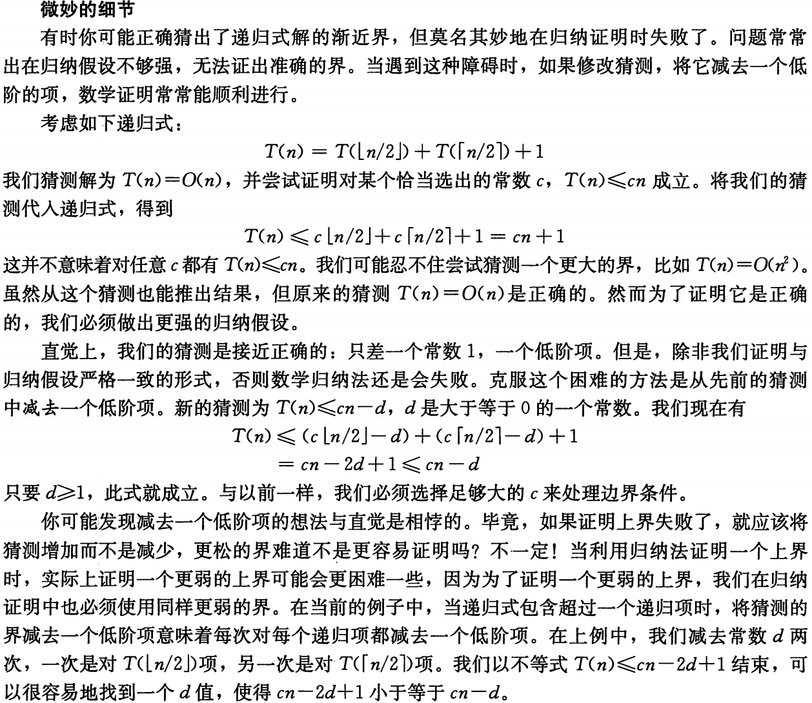

# 分治法

我们主要关心分治法的时间复杂度的分析以及它的应用

## 主定理

通常而言，分治法递归的时间复杂度有以下形式

\[
    T(n) = aT(\frac{n}{b}) + f(n)
\]

其中\(a\)是子问题的个数，\(b\)是子问题的规模，\(f(n)\)是合并的时间；

### 代入法

代入法即猜想证明：

- 猜测解的形式
- 使用数学归纳法求出解中的常数，并证明是正确的

!!!Example 
    \( T(N) = 2 \, T\left(\left\lfloor \frac{N}{2} \right\rfloor\right) + N \)

    **Guess**: \( T(N) = O(N \log N) \)

    **Proof**: Assume it is true for all \( m < N \), in particular for \( m = \left\lfloor \frac{N}{2} \right\rfloor \).

    Then there exists a constant \( c > 0 \) so that  
    \( T\left(\left\lfloor \frac{N}{2} \right\rfloor\right) \leqslant c \left\lfloor \frac{N}{2} \right\rfloor \log \left\lfloor \frac{N}{2} \right\rfloor \)

    Substituting into the recurrence:  
    
    \begin{align*}
      T(N) &= 2 \, T\left(\left\lfloor \frac{N}{2} \right\rfloor\right) + N \\
      &\leqslant 2 \, c \left\lfloor \frac{N}{2} \right\rfloor \log \left\lfloor \frac{N}{2} \right\rfloor + N \\
      &\leqslant c \, N (\log N - \log 2) + N \\
      &\leqslant c \, N \log N \quad \text{for } c \geqslant 1
    \end{align*}

     注意$c$一定要是常数，不能与$N$有关

可以通过记住一些常见的结论，例如归并排序来简化计算

!!!eg
    \[
        T(n)=2T(\sqrt{n})+\log n
    \]

    令\(m=\log n\),则\(n=2^m\),则

    \[
        T(2^m)=2T(2^{m/2})+m
    \]

    令\(S(m)=T(2^m)\),则

    \[
        S(m)=2S(m/2)+m
    \]

    代入法得到\(S(m)=O(m \log m)\),所以\(T(n)=O(\log n \log \log n)\)

    
???quote "算法导论-微妙的细节"
    

### 递归树法
递归树法是一种分析递归算法复杂度的常用方法，特别适用于分治算法的复杂度分析；通过把递归过程表示为一棵树，分析树的每一层的代价，从而得出整个算法的时间复杂度。以下是递归树法的主要步骤：

- **构建递归树**：将递归公式表示为一棵树，其中每个节点代表递归中的一次计算。根节点表示最初调用的递归问题，子节点表示递归调用的子问题，树的深度反映递归的层数。

- **计算每一层的代价**：对于递归树的每一层，计算该层所有节点的代价之和。通常，分治算法的每一层的计算量是相同的，或者遵循某种规律。

- **汇总每层的代价**：将每一层的代价相加，得到整个递归树的总代价。

- **计算递归树的高度**：递归树的高度代表递归调用的深度，通常与问题规模 \(N\) 有关。树的高度可以通过递归公式中的分割因子来确定。

- **总结总的复杂度**：根据每层代价的总和以及递归树的高度，可以得出递归的总时间复杂度。

!!!Example
    考虑经典的分治算法，例如合并排序，其递归公式为：

    \[
    T(N) = 2T\left(\frac{N}{2}\right) + O(N)
    \]

    应用递归树法的步骤如下：

    1. **构建递归树**：

       - 根节点为规模 \(N\) 的问题，分解成两个规模为 \(N/2\) 的子问题。
       - 每个子问题进一步分解，直到分解到规模为 1 的问题。

    2. **计算每一层的代价**：

       - 第一层的代价是 \(O(N)\)。
       - 第二层的两个子问题各自代价为 \(O(N/2)\)，总计 \(O(N)\)。
       - 第三层有四个子问题，每个代价 \(O(N/4)\)，总计 \(O(N)\)。

       可以看出每一层的代价都是 \(O(N)\)。

    3. **汇总每层的代价**：

       - 由于每一层的代价都是 \(O(N)\)，如果递归树有 \( \log N \) 层，那么总代价为 \(O(N \log N)\)。

    4. **计算递归树的高度**：

       - 递归树的高度为 \( \log N\)，因为每次将问题规模减半，直到规模为 1。

    5. **总结总的复杂度**：

       - 根据每层代价的总和以及树的高度，得到总时间复杂度为 \(O(N \log N)\)。

### 主定理

对于

\[
    T(n) = a T\left(\frac{n}{b}\right) + f(n),a \geqslant 1,b \geqslant 1
\]

则

!!!section 
    === "形式1"
         - 如果\(f(n)=O(n^{\log_b a-\epsilon})\),则\(T(n)=\Theta(n^{\log_b a})\)
         - 如果\(f(n)=\Theta(n^{\log_b a})\),则\(T(n)=\Theta(n^{\log_b a} \log n)\)
         - 如果\(f(n)=\Omega(n^{\log_b a+\epsilon})\),且对于某个常数$c<1$和所有足够大的$n$有
       
        \[
             a f\left(\frac{n}{b}\right) \leqslant c f(n)
        \]
         
        则\(T(n)=\Theta(f(n))\)

        !!!warning
             这三种情况并未覆盖 $f(n)$ 的所有可能性。情况 1 和情况 2 之间有一定间隙，情况 2 和情况 3 之间也有一定间隙。如果函数 $f(n)$ 落在这两个间隙中，或者情况 3 中要求的正则条件不成立.就不能使用主方法来求解递归式

         
        !!!Key-point 
             实际上主定理并不需要死记硬背，无论什么形式的主定理，其实关键都在于比较 $n^{\log_b a}$ 和 $f(n)$ 之间的关联，如果前者大，则前者 “掌控了” 整个时间复杂度，所以时间复杂度就是 $T(n) = aT(n/b)$ 对应的复杂度，这也很符合直观，因为此时 $a$ 比较大，分叉比较多，树比较大（结合前面递归树的例子），所以更大的复杂度会落在叶子上；反之后者大则每一层的复杂度 “掌控了” 整个时间复杂度，故整体时间就是 $f(n)$ 级别的。这也就是 “主定理” 这一名字的含义，十分形象，就是看前后两半谁 master 了整体时间复杂度
    
    === "形式2"
        -  若对于某个常数$c>1$,有$af(\frac{n}{b})=cf(n)$,则$T(n)=\Theta(n^{\log_b a})$
        -  若$af(\frac{n}{b})=f(n)$,则$T(n)=\Theta(n^{\log_b a}\log n)$
        -  若对于某个常数$c<1$,有$af(\frac{n}{b})=cf(n)$,则$T(n)=\Theta(f(n))$
        
        这实际上是形式1的推论，可以直观上来理解一下

        - 情况1说明每次分治对于$f(n)$的影响很大，将它分得很小，所以复杂度由前半部分控制
        - 情况2说明每次分治对于$f(n)$的影响适中，将它分得适中，所以复杂度是共同影响
        - 情况3说明每次分治对于$f(n)$的影响很小，将它分得很大，所以复杂度由后半部分控制

    === "形式3"
        对于递推式

        \[
            T(n)=aT(n/b)+\Theta(n^k \log^p n) \ a \geqslant 1,b>1,k \geqslant 0,p \geqslant 0
        \]

        有如下结论：

        - 若 $\log_b a > k$，则 $T(n) = \Theta(n^{\log_b a})$
        - 若 $\log_b a = k$，则 $T(n) = \Theta(n^k \log^{p+1} n)$
        - 若 $\log_b a < k$，则 $T(n) = \Theta(n^k \log^p n)$
        
        这里的主要变化是第二种情况，它相比于原先的形式更加强大，如果按照原来的形式就是$n^k \log n$,这里在对数的基础上增强了；
    
    === "形式3-pro"
        - 若 $\log_b a > k$，则 $T(n) = \Theta(n^{\log_b a})$
        - 若 $\log_b a = k$，则 
              + $p>-1$,$T(n) = \Theta(n^k \log^{p+1} n)$
              + $p=-1$,$T(n) = \Theta(n^k \log \log n)$
              + $p<-1$,$T(n) = \Theta(n^k)$
        - 若 $\log_b a < k$，则
              + $p \geqslant 0$,$T(n) = \Theta(n^k \log^p n)$
              + $p<0$,$T(n) = \Theta(n^k)$

## 分治法的应用
> 回忆梦开始的地方

### 最大子序列问题

最大子序列问题是一个经典的分治算法问题，其目标是找到一个序列中的一个连续子序列，使得该子序列的和最大。即寻找子数组 `A[low,high]` 的最大子序列和，我们首先找到数组中央位置 `mid`，这个问题可以通过分治算法来解决，其基本思路是将问题分解成三个子问题,假设目标子序列是$A[i,j]$：

1. 最大子序列和完全在 `A[low,high]`中，即 $low \leqslant i \leqslant j \leqslant mid$；
2. 最大子序列和完全在 `A[mid+1,high]` 中，即 $mid+1 \leqslant i \leqslant j \leqslant high$；
3. 最大子序列和跨越 `mid` 两边，即 $low \leqslant i \leqslant mid < j \leqslant high$。

- 分治：将原数组平分为两半 `A[low, mid]` 和 `A[mid + 1, high]`，然后分别对这两半求解最大子序列和；一定不能忘记递归有 base case，这里的 base case 就是数组只剩下一个元素，那就什么都不用操作，直接返回进入下一步合并阶段；

-  合并：首先我们要计算跨越 `mid` 两边的最大子序列和，然后和左右两半的结果比较，选择最大的作为最终结果。关键在于计算跨越 `mid` 两边的最大子序列和，这其实是线性的，为什么？因为这里的子序列都必须跨越 `mid`，所以最大子序列和就是最大的 `A[i, mid]` 加上最大的 `A[mid + 1, j]`，这个只需要对 `i`, `j` 做遍历就行，所以是线性的。

那么我们得到的递推公式就是很简单的 $T(n) = 2T(n/2) + O(n)$，所以就是 $O(n \log n)$ 的复杂度。

!!!info "exstra"
    归并排序与快速排序的时间复杂度都是$O(n \log n)$；
    注意快速排序最坏是$O(n^2)$，
    但是其期望时间复杂度是 $O(n \log n)$

### 逆序对计数

???Note "逆序数”
    逆序对计数问题是计算一个数组中逆序对的数量的经典算法问题。在一个数组中，逆序对指的是数组中满足以下条件的一对元素 \((i, j)\)：

    - **索引条件**：\(i < j\)
    - **大小关系**：\(A[i] > A[j]\)

    换句话说，逆序对是数组中一个较大的数出现在一个较小的数之前的情况。

分治法将问题分为三类

- 全在左半边的逆序对个数
- 全在右半边的逆序对个数
- 跨越中点的逆序对个数

但是跨越中点的逆序对个数看起来似乎有$\frac{n}{2} * \frac{n}{2}$种，所以我们每次算完左右两边的逆序对个数后，进行一次merge sort，那么合并过程中计算跨越中点的逆序对个数就只需要线性时间了：在合并两个已排序的子序列的过程中我们就很容易完成逆序对的计算

### 最近点对问题

这是 PPT 上的例子，也是相当经典的应用。同样分为三个部分，左最近点对、右最近点对和分离最近点对，那么关键就在于线性地找到分离最近点对。

我们记 $x$ 坐标的中点的横坐标为 $\overline{x}$，记作左右两半中最近点对距离为 $\delta$。因为我们要找分离最近点对，于是只要考虑 $[\overline{x}-\delta, \overline{x}+\delta]$ 之间的所有点 $ q_1, q_2, \cdots, q_n $，它们按 $y$ 坐标从小到大排序。设 $q_i$ 的  $y$ 坐标为 $y_i$，那么我们只需要从下往上检查坐标在 $[\overline{x}-\delta, \overline{x}+\delta]$ 和 $[y_i, y_i+\delta]$ 之间的长方形区域中的所有点，考察这些点是否和 $q_i$ 有更近的点对即可。

我们将这个长方形区域分为平均分割成 8 块，则每块内最多出现一个点（否则每块内两点之间的距离就不超过 $\dfrac{\sqrt{2}}{2} \delta$ 了，这就与左右两半中最近点对距离为 $\delta$ 相矛盾），于是对于每个 $q_i$，我们至多只需要向上找 7 个点即可。

实际上我们还可以把这 7 个点进一步减少：

- 例如当前我们循环到了一个在左半边的点，那么整个左半边的点都不需要考虑，只需要考虑右半边 4 个格子最多的 4 个点。但要注意的是这种情况你需要提前维护好左右两边各自的按 y 坐标排序的点列，然后要维护 y 坐标紧跟着左半边的每个点的四个右半边的点，对称的右半边也要维护，这并不复杂。

- 再更进一步，我们还可以将 4 这个数字降为 3。因为我们每在右半部分放一个点($q_i$ 在右半部分)，那么在右半部分，以这个点为圆心半径为 $\delta$ 的圆内不可能再有另一个点，事实上最差的情况就是有四个这样的圆心，此时这四个圆心在左半区域的四个角上（$(0,0)$, $(0, \delta)$, $(\delta, 0)$, $(\delta, \delta)$），这时候毫无疑问的就是 $(0, 0)$ 处的点最好。而其它情况下不可能有四个圆心，只能有三个，那么在最多三个圆心中寻找最近点对，也就只需要遍历 3 个点就足够了