# Pipelining

## Overlapping Execution

假设指令被分为三个阶段

- Instruction Fetch
- Instruction Decode
- Execute

<figure markdown="span">
{ width="400" }
</figure>

如果是顺序执行

<figure markdown="span">
{ width="400" }
</figure>

那么总时间：

\[
    T_{total} = \sum_{i=1}^{n} (T_{IFi} + T_{IDi} + T_{EXi})
\]

如果使用流水线,在理想情况下,每个阶段的时间都是相同的,那么总时间：

<figure markdown="span">
{ width="400" }
</figure>

但是实际上，如果每个阶段的时间不一样，那么就会造成资源的浪费，比如：

<figure markdown="span">
{ width="400" }
</figure>

或者

<figure markdown="span">
{ width="400" }
</figure>

!!!info
    **sequential execution** :Simple and easy to understand, saving equipment.

    **Overlapping execution** :More complex,High-usage of functional units.

### Single overlapping execution

Execute the k-th instruction at the same time as the (k+1)-th instruction.

<figure markdown="span">
{ width="400" }
</figure>

对于3个stage的例子，每2个时钟周期得到一个结果，充满流水线需要1个时钟周期，那么对于n条指令，需要的时间为：

\[
    T_{total} = (2n + 1) \times T_{clock}
\]

Advantages:

- Execution time is reduced by nearly 1/3
-  The utilization rate of functional unit is improved obviously

Disadvantages:

-  Some additional hardware was needed, and the control process became 
complicate

### Twice overlapping execution

Twice overlapping execution

- Decode the k instruction at the same time as fetch the k+1 instruction
- Execute the k instruction at the same time as decode the k+1 instructio

<figure markdown="span">
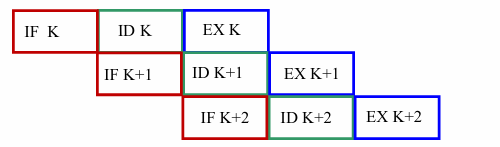{ width="400" }
<figcaption> twice overlapping</figcaption>
</figure>

流水线充满之后每个时钟周期得到一个结果，充满流水线需要2个时钟周期，那么对于n条指令，需要的时间为：

\[
    T_{total} = (n + 2) \times T_{clock}
\]

Advantages:

- Execution time was reduced by nearly 2/3
- The utilization rate of functional unit is improved obviously

Disadvantages:

- Much more hardware was needed
- Separate fetch, decode, and execution components are required

### Adding buffer

- Conflict in access memory
    - Instruction memory & data memory
    - Instruction cache & data cache (same memory): Harvard structure 
    - Multibody cross structure (same memory with limitations)
    - Adding instruction buffer between memory and instruction decode unit

<figure markdown="span">
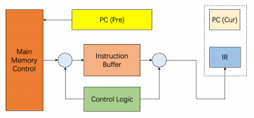{ width="400" }
<figcaption>Add a buffer</figcaption>
</figure>

在取指和内存阶段加上一个buffer，只要这个buffer没有满就一直取指令进来放着，这样可以缩短instruction fetch的时间，从而提高效率,甚至可以将其与decode合并。

If the time of fetching instruction phase is very short, fetch operation 
can be incorporated into the decode operation. The twice overlapping 
becomes single overlapping

理想情况下，可以做到

<figure markdown="span">
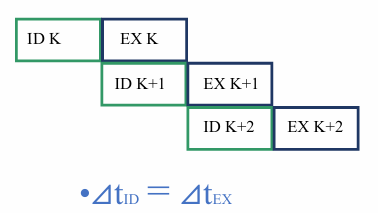{ width="400" }
</figure>

但是有时候ID阶段长，有时候EX阶段长

<figure markdown="span">
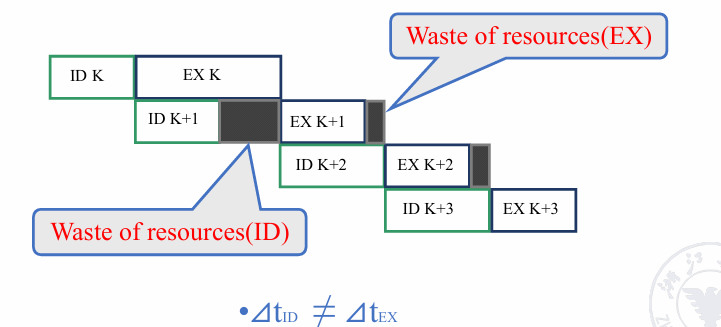{ width="500" }
</figure>

### Advance control

为了解决这个问题，可以提前ID阶段，接着执行，将结果存在buffer中，就不用等上一条的ID阶段执行完再执行了。

<figure markdown="span">
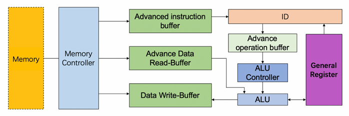{ width="500" }
</figure>

1. **Memory 和 Memory Controller**：内存和内存控制器负责从内存中获取指令和数据。

2. **Advanced Instruction Buffer**：高级指令缓冲区用于存储从内存中获取的指令，以便快速访问。

3. **Advance Data Read-Buffer 和 Data Write-Buffer**：这些缓冲区用于读取和写入数据，确保数据可以快速传输到处理单元。

4. **Advance Operation Buffer**：高级操作缓冲区用于存储即将执行的操作，优化执行效率。

5. **ALU 和 ALU Controller**：算术逻辑单元（ALU）执行指令中的算术和逻辑操作，ALU控制器负责管理这些操作。

6. **General Register**：通用寄存器用于存储操作的中间结果和最终结果。

这些组件通过先进的控制逻辑和FIFO（先进先出）机制进行协调，以提高处理器的效率和速度。

可以实现

<figure markdown="span">
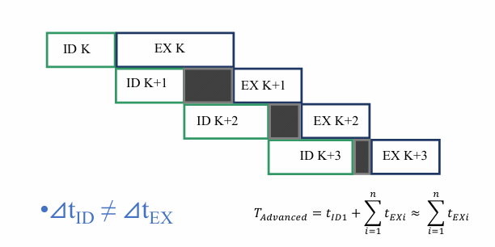{ width="500" }
</figure>

## Classes of pipeling

- **Single function pipelining** : only one fixed function pipelining

- **Multi-function pipelining** : each section of the pipelining can be 
connected differently for several different functions

<figure markdown="span">
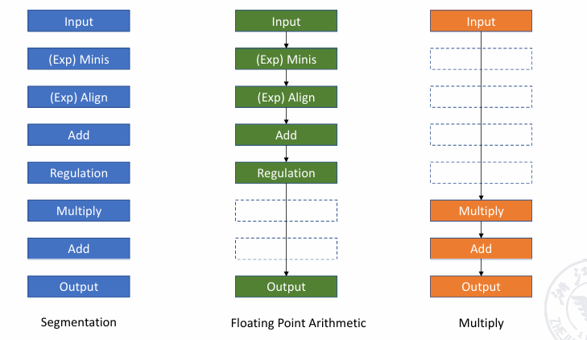{ width="500" }
<figcaption>Multi-function pipelining</figcaption>
</figure>
>蓝色部分为该流水线的所有功能，通过连接不同的部分，可以实现不同的功能

对于 **Multi-function pipelining** ，又可以继续细分为两类：

-  **Static pipelining** : 在静态流水线中，每个流水线段在同一时间只能按照相同功能的连接模式工作。也就是说，流水线的每个部分在同一时间只能执行相同类型的操作。
        
    - 在同一时间，流水线的每个部分只能按照相同功能的连接模式工作。
    - 对于静态流水线，只有当输入是一系列相同的操作任务时，流水线的效率才能得到充分发挥。

这意味着静态流水线适合处理重复性高、相同类型的任务，因为它的设计限制了每个部分只能执行特定的功能。

<figure markdown="span">
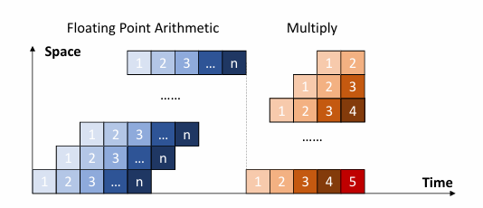{ width="500" }
<figcaption>Static pipelining</figcaption>
</figure>

-  **Dynamic pipelining** : 在动态流水线中，每个流水线段在同一时间可以按照不同的功能连接模式工作。也就是说，流水线的每个部分在同一时间可以执行不同的操作。
        
    - 动态流水线具有更高的灵活性，但控制逻辑更加复杂。
    - 它可以提高功能单元的可用性和利用率。

这种设计允许流水线更好地适应不同类型的任务，但需要更复杂的控制机制来协调不同部分的操作。

<figure markdown="span">
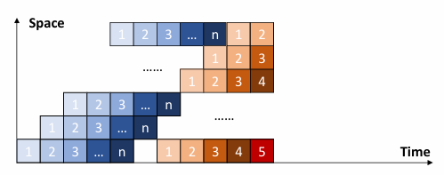{ width="500" }
<figcaption>Dynamic pipelining</figcaption>
</figure>

- **Component level pipelining**（组件操作流水线）：处理器的算术和逻辑操作组件被分成多个段，这样可以通过流水线执行各种类型的操作

- **Processor level pipelining**：
 指令的解释和执行是通过流水线实现的。一条指令的执行过程被分为几个子过程，每个子过程都在一个独立的功能单元中执行

-  **Inter processor pipelining** (inter processor- macro pipelining): 两个或多个处理器串联处理相同的数据流，每个处理器完成整个任务的一部分

- **Linear pipelining**：流水线的每个部分都是串行连接的，没有反馈回路。当数据通过流水线的每个段时，每个段最多只能流过一次

- **Nonlinear pipelining**：除了串行连接外，流水线中还存在反馈回路

- **Ordered pipelining** : 在流水线中，任务的输出顺序与输入顺序完全相同，每个任务按顺序流经流水线的每个段

- **Disordered pipelining** : 在流水线中，任务的输出顺序与输入顺序不同，允许后面的任务先完成

- **Scalar processor** : 处理器不具有向量数据表示和向量指令，只能通过流水线处理标量数据

- **Vector pipelining processor** : 处理器具有向量数据表示和向量指令，它是向量数据表示和流水线技术的结合

## Performance 

### Throughput

Throughput(TP): the number of instructions completed per clock cycle

\[
    TP = \frac{n}{T_{total}}
\]

$n$: the number of instructions

$T_{total}$: the total time to complete all instructions

<figure markdown="span">
{ width="500" }
</figure>

\[
    TP = \dfrac{n}{T_{total}} = \dfrac{n}{(n+m-1) \times T_{clock}} 
\]

当$n$很大时，$TP$会趋近于$\frac{1}{T_{clock}}$，也就是说最大的吞吐量与流水线是多少级无关，只与时钟周期有关。

So

\[
    TP= \dfrac{n}{n+m-1} TP_{max}
\]

如果流水线每个阶段的时钟周期不一致，那么

\[
    TP_max = \dfrac{1}{max(T_{clock1}, T_{clock2}, ..., T_{clockm})}
\]

<figure markdown="span">
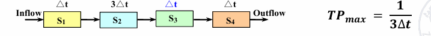{ width="500" }
<figcaption>Example</figcaption>
</figure>

对于某个阶段特别慢的解决方法有两种：

- 将该阶段拆分成多个部分(subdivision)
- 将该阶段拆分成多个部分，每个部分使用多个功能单元并行执行(Repetition)

<figure markdown="span">
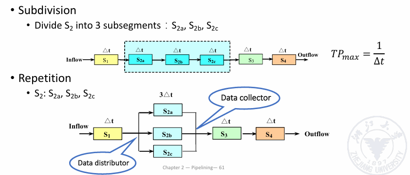{ width="500" }
<figcaption>Example</figcaption>
</figure>

### Speed up

Speed up(Sp): the ratio of the execution time of the non-pipelined processor to the execution time of the pipelined processor

\[
    Sp = \dfrac{T_{non-pipeline}}{T_{pipeline}}
\]

<figure markdown="span">
{ width="500" }
</figure>

总时间为

\[
    T_{total} = (n+m-1) \times T_{clock}
\]

没有加速的时间为

\[
    T_{non-pipeline} = nm \times T_{clock}
\]

所以

\[
    Sp = \dfrac{nm \times T_{clock}}{(n+m-1) \times T_{clock}} = \dfrac{nm}{n+m-1}
\]

当$n$很大时，$Sp$会趋近于$m$

### Efficiency

Efficiency(E or $\eta$): the ratio of the execution time of the pipelined processor to the execution time of the non-pipelined processor

即框图中流水线中执行的指令占比

\[
    E = \dfrac{S_{pipeline}}{S_{total \ space}}
\]

<figure markdown="span">
{ width="500" }
</figure>

总空间为

\[
    S_{total \ space} = m(n+m-1)
\]

指令占的空间为

\[
   n \times m
\]

所以

\[
    E = \dfrac{n \times m}{m(n+m-1)} = \dfrac{n}{n+m-1}
\]

当$n$很大时，$E$会趋近于1；

!!!Example
    === "static pipelining"
        <figure markdown="span">
        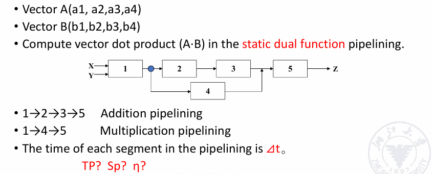{ width="500" }
        </figure>
        必须等待乘法的功能全部做完，才能开始加法的功能
        <figure markdown="span">
        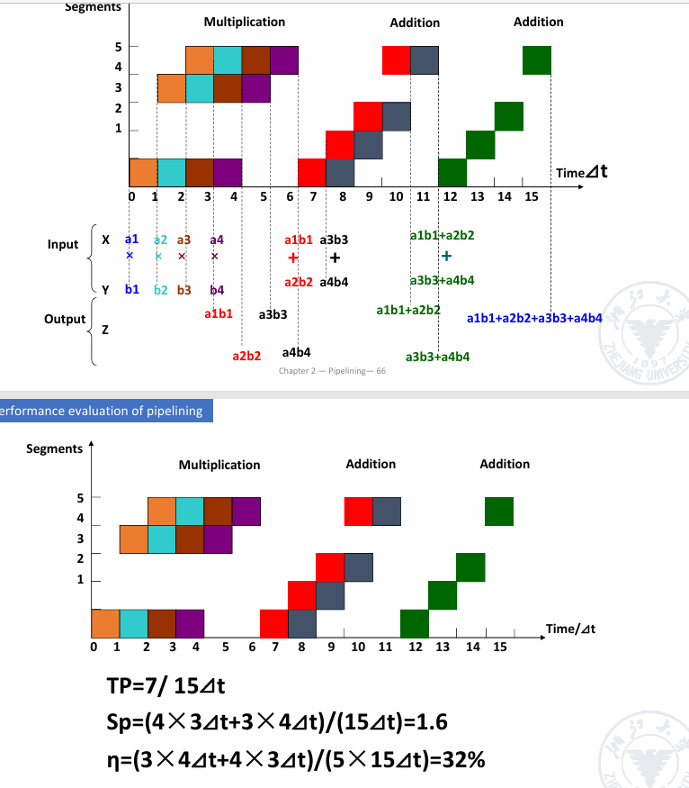{ width="500" }
        </figure>
    === "dynamic pipelining"
        <figure markdown="span">
        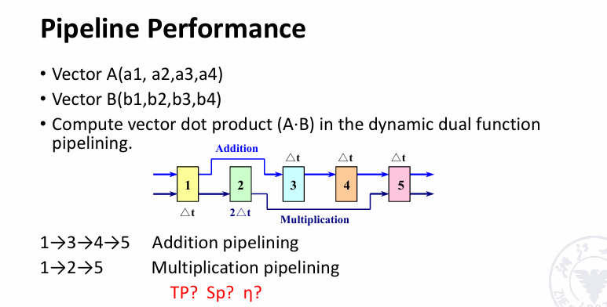{ width="500" }
        </figure>
        乘法和加法可以同时进行，只要等待操作数准备好即可
        <figure markdown="span">
        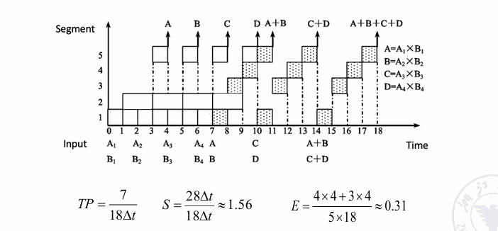{ width="500" }
        </figure>

!!!question
    为什么流水线的级数不可以太高（比如100级）？
    
    - 流水线级数增加会带来很多复杂性：
        - 5级流水线是可以接受的，但50级流水线就会有很大问题
        - 需要处理大量在执行中指令之间可能存在的依赖关系
        - 控制逻辑会变得非常庞大和复杂

    - 具体来说：
        - 指令之间的数据依赖和控制依赖会变得更难处理
        - 需要更多的硬件来处理和检测这些依赖
        - 控制逻辑的复杂度会随着级数呈指数增长
        - 流水线停顿和冒险的处理会变得更加困难

    - 因此，流水线级数需要在性能提升和实现复杂度之间找到平衡点。

