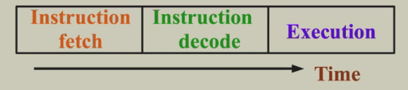
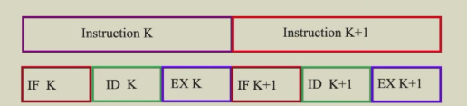
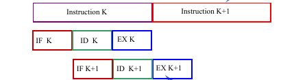
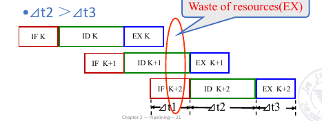
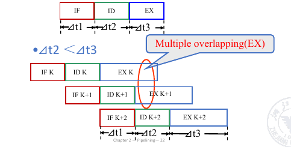
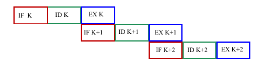

# Pipelining

## Overlapping Execution

假设指令被分为三个阶段

- Instruction Fetch
- Instruction Decode
- Execute

<figure markdown="span">
{ width="400" }
</figure>

如果是顺序执行

<figure markdown="span">
{ width="400" }
</figure>

那么总时间：

\[
    T_{total} = \sum_{i=1}^{n} (T_{IFi} + T_{IDi} + T_{EXi})
\]

如果使用流水线,在理想情况下,每个阶段的时间都是相同的,那么总时间：

<figure markdown="span">
{ width="400" }
</figure>

但是实际上，如果每个阶段的时间不一样，那么就会造成资源的浪费，比如：

<figure markdown="span">
{ width="400" }
</figure>

或者

<figure markdown="span">
{ width="400" }
</figure>

!!!info
    **sequential execution** :Simple and easy to understand, saving equipment.

    **Overlapping execution** :More complex,High-usage of functional units.

### Single overlapping execution

Execute the k-th instruction at the same time as the (k+1)-th instruction.

<figure markdown="span">
{ width="400" }
</figure>

