# Instruction-Level Parallelism

## Dynamic scheduling

<figure markdown="span">
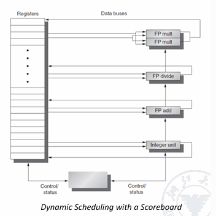
<figcaption>dynamic scheduling with Scoreboard</figcaption>
</figure>

在RISC-V中，处理器会在ID阶段检查structure hazards和data hazards；

当一条指令可以在没有危险的情况下执行时，它会从ID阶段发出，因为所有的数据危险都已解决

为了支持乱序执行，将ID阶段分成两个阶段

- **Issue(IS)**  这是指令发射的第一阶段，主要功能是解码指令并检查结构冒险(structural hazards),这是一个按序(in-order)的阶段，意味着指令必须按照程序顺序进入这个阶段

结构冒险检查包括：

- 检查是否有可用的功能单元(如ALU、FPU等)
- 检查是否有可用的寄存器文件端口
- 检查是否有可用的保留站(reservation station)空间

- **Read Operands(RO)** 阶段：这是指令发射的第二阶段，主要功能是等待直到没有数据冒险，然后读取操作数
这是一个乱序(out-of-order)的阶段，意味着指令可以在这个阶段以不同于程序顺序的方式执行

在这个阶段：

- 处理器会等待所有数据依赖都被解决
- 一旦数据可用，就会读取操作数
- 指令可以开始执行

### Scoreboard algorithm

Scoreboard的主要组成部分：

- 指令状态表：
  记录每条指令的执行状态
  包括：Issue、Read Operands、Execute、Write Result等阶段

- 功能单元状态表：
  记录每个功能单元(如ALU、FPU等)的状态
  包括：Busy、Op、Fi、Fj、Fk、Qj、Qk、Rj、Rk等字段  


- 寄存器结果状态表：
  记录每个寄存器的状态
  指示哪个功能单元将写入该寄存器


例如下面的例子


```assembly
FLD F6,34(R2)# 将内存地址为34+R2的值加载到F6

FLD F2 45(R3)# 将内存地址为45+R3的值加载到F2

Fmul F0 F2 F4# 将F2和F4相乘，结果存储到F0 RAW

Fsub F8 F6 F2# 将F6减去F2，结果存储到F8  RAW

Fdiv F10 F0 F6# 将F0除以F6，结果存储到F10  RAW

Fadd F6 F8 F2# 将F8和F2相加，结果存储到F6 WAR RAW
```

<figure markdown="span">
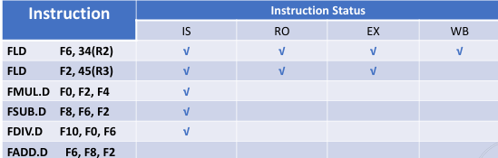
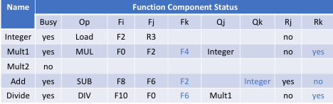
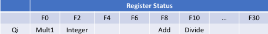
</figure>


首先，第一条指令全部执行，Board上没有其信息，第二条指令执行到EX阶段( *各种指令的EX阶段所需时钟周期不一样* ),第三条指令与第二条指令F2数据依赖，不能进入RO；第四条指令与第二条指令F2数据依赖，不能进入RO；第五条指令与第三条指令F0数据依赖，不能进入RO；第六条指令与第四条指令有结构冲突，都要使用加法单元，不能进入IS；

以上的判断都是处理器根据Scoreboard上的信息做出的；

在这个阶段，Integer单元(进行地址计算，整数访问，内存访问的单元)Busy，其对应的指令是Load，Fi是F2，Fj是R3，Rj是no表示已经读取了R3的值，Qj是null表示没有功能单元正在使用R3的值；


根据已有信息，将第三条指令放入IS阶段，更新表，其使用第一个乘法器，所以Fi是F0，Fj是F2，Fk是F4，Qj是Integer，Qk是null，Rj是no，Rk是yes；代表F2即将来自Integer单元，但是没有准备好，F4准备好了，但是没有读取，这条指令不能进入RO阶段；

然后到SUB指令，由于加法单元是空闲的，所以可以进入IS阶段，更新表，Add被使用，Fi是F8，Fj是F6，Fk是F2，Qk是Integer，Rj是yes，Rk是no；代表F6准备好了，F2即将来自Integer单元，但是没有准备好，这条指令不能进入RO阶段；

然后后是DIV指令，除法单元空闲，所以可以进入IS阶段，更新表，Div被使用，Fi是F10，Fj是F0，Fk是F6，Qj是Mult1，Rj是no，Rk是yes；代表F0的数据来自Mult1单元，还没有准备好，F6的已经准备好了，这条指令可以进入RO阶段；

最后是add指令，发现加法单元busy，停在IS阶段，等待加法单元空闲；

寄存器信息来自哪些单元是通过查找寄存器状态表得到，并不断更新；


!!!Note "各个字段的意义"
    1 `Busy`: 功能单元是否正在使用
    
    - yes = 功能单元正忙
    - no = 功能单元空闲

    2 `Op`: 当前执行的操作类型
    
    - Load = 加载操作
    - MUL = 乘法操作
    - SUB = 减法操作
    - DIV = 除法操作

    3 `Fi`: 目标寄存器(存放结果的寄存器)

    4 `Fj`, `Fk`: 源操作数寄存器
    
    - 例如：R3, F2, F4等是源操作数

    5 `Qj`, `Qk`: 产生源操作数的功能单元
    
    - Integer = 整数单元
    - Mult1 = 乘法单元1
    - 如果为空，表示操作数已就绪

    6 `Rj`, `Rk`: 源操作数的就绪状态

    - "yes" = 操作数已就绪但未读取
    - "no" & "Qj = null" = 操作数已读取
    - "no" & "Qj != null" = 操作数未就绪

    寄存器状态表(Register Status)的字段：

    1 寄存器编号：F0, F2, F4等
    
    2 `Qi`: 指示哪个功能单元将会写入该寄存器
    
    - Mult1 = 乘法单元1将写入
    - Integer = 整数单元将写入
    - Add = 加法单元将写入
    - Divide = 除法单元将写入

<figure markdown="span">
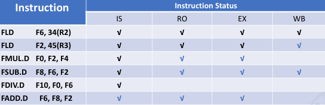
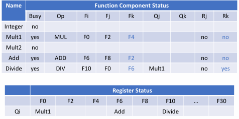
</figure>

第二条指令WB后，寄存器状态表更新，此时第三条指令在EX阶段，第四条指令是减法，可以比较快完成，其结束后，ADD指令可以进入到EX阶段，但是由于必须等到DIV阶段进入RO后，才能进入WB阶段，所以ADD指令必须等待，而DIV阶段要进入RO，就必须等待F0的数据准备好，所以DIV指令也要等待；

<figure markdown="span">
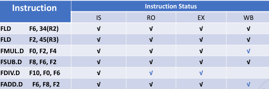
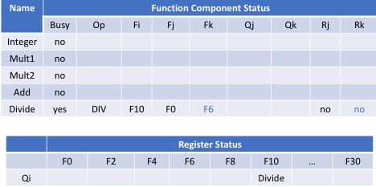
</figure>

当MUL指令结束后，FDIV指令进入RO阶段时，ADD指令可以写回，此时没有冲突了，只剩下DIV指令继续执行结束即可；

!!!Example 
    假设EX阶段有以下时钟周期

    - Load： 1
    - MUL： 10
    - SUB/ADD： 2
    - DIV： 40

    其它阶段为1;

    则对于上面的指令，完成的时钟周期为，对于第一条指令，直接顺序完成

    |指令|IS|RO|EX|WB|
    |---|---|---|---|---|
    |FLD F6,34(R2)|1|2|3|4|
    |FLD F2 45(R3)|||||
    |Fmul F0 F2 F4|||||
    |Fsub F8 F6 F2|||||
    |Fdiv F10 F0 F6|||||
    |Fadd F6 F8 F2|||||
    
    由于Integer在第一条指令未结束期间都被占用，所以第二条指令在第一条结束之后才能进入
    
    |指令|IS|RO|EX|WB|
    |---|---|---|---|---|
    |FLD F6,34(R2)|1|2|3|4|
    |FLD F2 45(R3)|5|6|7|8|
    |Fmul F0 F2 F4|||||
    |Fsub F8 F6 F2|||||
    |Fdiv F10 F0 F6|||||
    |Fadd F6 F8 F2|||||

    而IS是需要顺序的，所以第二条指令进入RO阶段，第三条指令才能进入IS，在第二条指令结束之后，第三条指令才能进入RO阶段,之后就继续执行


    |指令|IS|RO|EX|WB|
    |---|---|---|---|---|
    |FLD F6,34(R2)|1|2|3|4|
    |FLD F2 45(R3)|5|6|7|8|
    |Fmul F0 F2 F4|6|9|10-19|20|
    |Fsub F8 F6 F2|||||
    |Fdiv F10 F0 F6|||||
    |Fadd F6 F8 F2|||||

    第四条指令等待Fmul的IS阶段结束之后进入，而其与F2存在冲突，所以也需要等待F2的WB阶段结束再继续进入RO阶段，然后正常执行
    
    |指令|IS|RO|EX|WB|
    |---|---|---|---|---|
    |FLD F6,34(R2)|1|2|3|4|
    |FLD F2 45(R3)|5|6|7|8|
    |Fmul F0 F2 F4|6|9|10-19|20|
    |Fsub F8 F6 F2|7|9|10-11|12|
    |Fdiv F10 F0 F6|||||
    |Fadd F6 F8 F2|||||
    
    第五条指令等待Fmul的WB阶段结束之后进入R0，然后正常执行

    |指令|IS|RO|EX|WB|
    |---|---|---|---|---|
    |FLD F6,34(R2)|1|2|3|4|
    |FLD F2 45(R3)|5|6|7|8|
    |Fmul F0 F2 F4|6|9|10-19|20|
    |Fsub F8 F6 F2|7|9|10-11|12|
    |Fdiv F10 F0 F6|8|21|22-61|62|
    |Fadd F6 F8 F2|||||

    最后一条指令，需要等待Fsub的WB阶段结束后，加法单元被释放，然后进入EX阶段，在这里，需要等待Fdiv的RO结束，F6读走了，才能WB

    |指令|IS|RO|EX|WB|
    |---|---|---|---|---|
    |FLD F6,34(R2)|1|2|3|4|
    |FLD F2 45(R3)|5|6|7|8|
    |Fmul F0 F2 F4|6|9|10-19|20|
    |Fsub F8 F6 F2|7|9|10-11|12|
    |Fdiv F10 F0 F6|8|21|22-61|62|
    |Fadd F6 F8 F2|13|14|15-16|22|


### Tomasulo algorithm

Tomasulo's Algorithm 是一种处理器指令级并行的重要算法，主要用于动态调度和乱序执行。它的核心目标是通过硬件机制来解决数据依赖和资源冲突，提高指令级并行性。


1. **动态调度**：允许指令乱序执行
2. **寄存器重命名**：消除写后读(WAR)和写后写(WAW)冒险
3. **硬件保留站(Reservation Stations)**：管理指令执行
4. **公共数据总线(Common Data Bus, CDB)**：广播计算结果

<figure markdown="span">
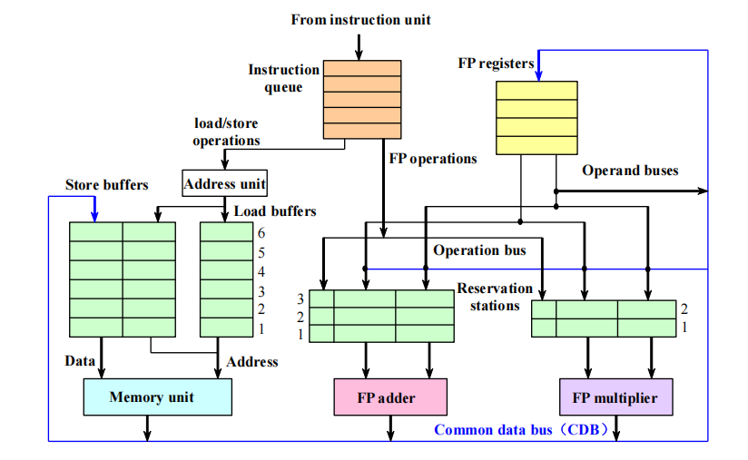{ width="500" }
</figure>

#### Reservation Stations

- 每种功能单元(ALU、乘法器、除法器等)都有自己的保留站
- 存储等待执行的指令信息
- 跟踪操作数的状态和来源

#### 数据依赖处理

- **RAW依赖**：通过跟踪操作数的可用性来最小化影响
  - 当操作数就绪时，立即将值传递给等待的指令
  - 使用Qj和Qk字段跟踪哪些保留站将产生所需的操作数

- **WAW和WAR依赖**：通过硬件寄存器重命名自动消除
  - 指令使用保留站而不是实际寄存器作为中间存储
  - 允许多个指令同时写入同一逻辑寄存器的不同物理位置


#### Renaming

- 使用保留站消除寄存器相关性
- 允许指令提前执行，避免不必要的等待

#### 发射阶段(Issue)

- 检查是否有可用的保留站
- 检查操作数是否就绪，如果就绪，则将操作数写入保留站，如果没有就绪，那么仍让将其写入保留站，但是需要等待，并跟踪会产生操作数的unit
- 如果保留站满，则暂停发射

!!!Note
     在这个阶段，消除了WAR和WAW依赖，因为此时发生了重命名

#### 执行阶段(Execute)

- 当操作数就绪时，开始执行
- 可以乱序执行
- 等待功能单元可用


!!!Note 
     对应Load和Store指令需要两步运算过程，第一步是当base register和offset相加得到地址，然后将其放入到load store buffer中


#### 写回阶段(Write Back)

- 通过公共数据总线(CDB)广播结果
- 更新等待该结果的保留站
- 更新寄存器状态


!!!Note 
     当一条Store指令执行时，它的值和地址可能不会立即同时可用,这些信息会被暂时存储在"存储缓冲区"(store buffer)中,只有当两个信息（值和地
     址）都准备好时，并且内存单元空闲时才会真正执行实际的内存写入操作


!!!Example
    假设现在有两条指令

    ```assembly
    MUL F0 F2 F4
    ADD F2 F0 F6
    ```
    <figure markdown="span">
    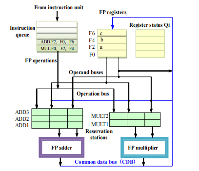{ width="500" }
    </figure>

    首先，将乘法指令放入乘法保留站，然后将F2的值(a),F4的值(b)写入,结果是要写回F0的，所以在F0需要track结果来自MULT1

    <figure markdown="span">
    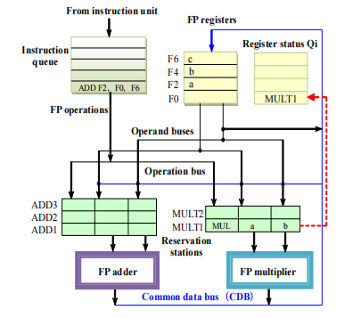{ width="500" }
    </figure>
    
    接下来，ADD指令进入,将其放入ADD保留站，F0的值查看寄存器状态表，得知来自MULT1，F6的值立即准备好，然后其要写回F2，所以需要track结果来自ADD

    <figure markdown="span">
    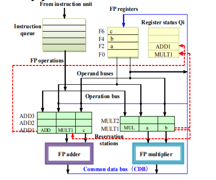{ width="500" }
    </figure>

    当乘法指令结束后，写回F0，将值加载到ADD保留站，最后将ADD指令执行完即可.


### Tables of Tomasulo algorithm

在这个算法中，主要有以下三张表

- **Instruction status table** : This table is included only to help you understand the algorithm; it is not actually a part of the hardware.
    
- **Reservation stations table** : The reservation station keeps the state 
of each operation that has issued.

- **Register status table (Field Qi)** : The number of the reservation station that contains the operation whose result should be stored into this register.当进入reservation station时发现不能直接取出寄存器的值时，需要通过这张表来找到对应的保留站，查看来自哪个保留站；（这里面存的是reservation station的编号，在这个reservation station中，其操作结果会写入这个寄存器）

每个保留站包含七个字段：

- **Op**：对源操作数执行的操作。
- **Qj, Qk**：将产生相应源操作数的保留站编号。
- **Vj, Vk**：源操作数的值。
- **Busy**：表示此保留站及其附带的功能单元正在被占用。
- **A**：用于保存加载或存储操作的内存地址计算信息。

这些字段共同工作，使得Tomasulo算法能够有效地跟踪指令依赖关系，实现乱序执行，并确保结果的正确性。当一个操作需要等待其他操作的结果时，Qj和Qk字段会指向产生这些结果的保留站，一旦结果可用，它们会通过CDB广播并更新到相应的Vj和Vk字段中。

!!!Example
    假设现在有以下指令

    ```assembly linenums="1"
    FLD F6, 34（R2）
    FLD F2, 45（R3）
    FMUL.D F0, F2, F4
    FSUB.D F8, F2, F6
    FDIV.D F10, F0, F6
    FADD.D F6, F8, F2
    ```

    在某一时刻，三张表的状态可能如下所示

    <figure markdown="span">
    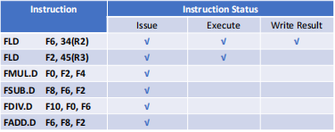{ width="500" }
    <figcaption>Instruction status table</figcaption>
    </figure>

    <figure markdown="span">
    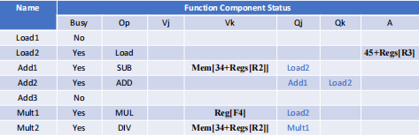{ width="500" }
    <figcaption>Reservation stations table</figcaption>
    </figure>
    
    <figure markdown="span">
    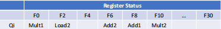{ width="500" }
    <figcaption>Register status table</figcaption>
    </figure>

    
!!!Summary
    Tomasulo算法的主要贡献：

    - **动态调度（Dynamic scheduling）** ：允许指令在数据依赖关系允许的情况下乱序执行，提高处理器利用率。

    - **寄存器重命名（Register renaming）** ：通过保留站机制实现了隐式的寄存器重命名，有效消除了WAW（写后写）和WAR（写后读）冒险。

    - **加载/存储消歧义（Load/store disambiguation）** 

    - **优于记分板算法（Better than Scoreboard Algorithm）** ：Tomasulo算法通过CDB（公共数据总线）和保留站机制，提供了更灵活的执行模型，能够更有效地处理复杂的依赖关系和资源竞争。

    但是，Tomasulo算法也有一些缺点：

    - **复杂性** ：需要维护多个表，增加了硬件开销。

    - 其性能会受到公共数据总线的限制

    **Load/Store Disambiguation**

    加载/存储消歧义是Tomasulo算法中处理内存操作的重要机制。它允许处理器确定何时可以安全地乱序执行内存操作。

    当处理器遇到加载（load）和存储（store）指令时，需要确定这些操作是否可以安全地乱序执行：

    - **不同地址的操作**：如果加载和存储操作访问的是不同的内存地址，它们可以安全地乱序执行。

    - **相同地址的操作**：如果加载和存储操作访问相同的内存地址，则必须考虑以下情况：
      
      - 如果加载在程序顺序中位于存储之前，而执行时将它们交换顺序，会导致**写后读（WAR）冒险**。
      
      - 如果存储在程序顺序中位于加载之前，而执行时将它们交换顺序，会导致**读后写（RAW）冒险**。
      
      - 如果交换两个访问相同地址的存储操作的顺序，会导致**写后写（WAW）冒险**。
    
    
    假设有以下两条内存访问指令：

    ```assembly linenums="1"
    LOAD R1, [A]  // 将内存地址A中的值加载到寄存器R1
    STORE [A], R2 // 将寄存器R2的值存储到内存地址A
    ```

    在程序的顺序执行中，这两条指令应该是先执行LOAD指令，将内存地址A的值加载到R1，然后执行STORE指令，将R2的值存储到内存地址A。
    但在乱序执行的处理器中，如果执行顺序被交换（即STORE指令先执行，然后再执行LOAD指令），就会发生WAR冒险：
    STORE指令先执行，内存地址A的值会被R2的值覆盖
    随后执行LOAD指令时，加载的将是R2的值而不是原来内存地址A中应该读取的值
    

!!!question
    
    ```assembly linenums="1"
    FLD F6, 34（R2）
    FLD F2, 45（R3）
    FMUL.D F0, F2, F4
    FSUB.D F8, F2, F6
    FDIV.D F10, F0, F6
    FADD.D F6, F8, F2
    ```

    仍是上面的指令，如果ADD需要2个周期，乘法需要10个周期，除法需要40个周期，其它的需要1个周期，那么每个指令每个阶段都在什么周期完成

    
    |指令|IS|EX|WB|
    |---|---|---|---|
    |FLD F6, 34（R2）|1|3|4|
    |FLD F2, 45（R3）|2|4|5|
    |FMUL.D F0, F2, F4|3|6-15|16|
    |FSUB.D F8, F2, F6|4|6-7|8|
    |FDIV.D F10, F0, F6|5|17-56|57|
    |FADD.D F6, F8, F2|6|9-10|11|
    
    由于保留站的存在，可以比计分板算法更早进入IS阶段.


## Hardware-Based Speculation

乱序执行，顺序提交.

硬件推测执行是一种高级处理器优化技术，它允许处理器在不确定指令是否应该执行的情况下提前执行指令。这种技术主要用于分支预测和异常处理。

ROB是实现乱序执行、顺序提交的核心组件，它为未提交的指令结果提供缓存：

1. **结构**：ROB包含三个主要字段
    - 指令类型
    - 目标地址
    - 值

2. **工作流程**：
    - 当指令执行阶段完成时，将保留站(RS)中的值替换为ROB编号
    - 增加指令提交阶段
    - ROB提供完成阶段和提交阶段的操作编号
    - 一旦操作数提交，结果将写入寄存器

3. **恢复机制**：
    - 当分支预测失败时，可以轻松恢复推测执行的指令
    - 当异常发生时，可以轻松恢复处理器状态

#### 推测执行的优势

1. **性能提升**：允许处理器在等待分支结果时继续执行后续指令
2. **资源利用**：提高处理器资源的利用率
3. **隐藏延迟**：可以隐藏内存访问和其他长延迟操作的延迟

#### 推测执行的实现

1. **分支预测**：处理器预测分支的结果，并沿着预测路径执行指令
2. **检查点机制**：在推测执行前保存处理器状态
3. **提交控制**：只有当确认推测是正确的时，才会提交指令结果
4. **回滚机制**：当推测错误时，丢弃推测执行的结果并恢复到检查点状态

推测执行与乱序执行结合使用时，可以显著提高处理器的性能，特别是在处理具有复杂控制流的程序时。

如果使用tomasulo算法，那么需要新增一个ROB，用于存储指令的执行结果，然后当指令执行完成后，将结果写入ROB，然后当指令提交时，将结果写入寄存器.同时指令执行需要多一个Commit阶段

- Issue
- Execute
- Write Back
- Commit

!!!property
    硬件推测执行结合了以下三个关键思想：

    1. **动态分支预测**：
        - 用于选择要执行哪些指令
        - 基于历史执行模式预测分支方向
        - 允许处理器在分支结果确定前继续执行

    2. **推测执行**：
        - 允许在控制依赖解决前执行指令
        - 具备撤销错误推测序列效果的能力
        - 使用ROB等机制保存中间状态以便回滚

    3. **动态调度**：
        - 处理不同基本块组合的调度
        - 允许指令根据数据依赖关系和资源可用性动态重排序
        - 最大化指令级并行性

对于register status，需要新增一个ROB，用于存储指令的执行结果，还有一个是否Busy的字段；


## Multiple Issue

### Superscalar、

超标量处理器（Superscalar）是一种能够在单个时钟周期内发射和执行多条指令的处理器架构。

- 每个时钟周期发射的指令数量不是固定的
- 实际发射数量取决于代码的具体情况
- 通常有一个上限（1-8条指令）
- 如果上限为n，则称为n发射超标量处理器

!!!Warning
    注意只是上限，并不是说一定发射这么多


- 可以通过编译器静态调度
- 也可以基于Tomasulo算法进行动态调度

超标量处理器相比于标量处理器能够显著提高处理器的吞吐量，但也增加了硬件复杂度和功耗。


<figure markdown="span">
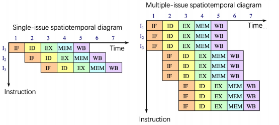{ width="500" }
<figcaption>超标量处理器</figcaption>
</figure>

<figure markdown="span">
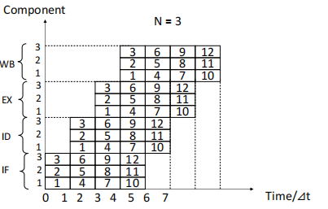{ width="500" }
<figcaption>超标量处理器</figcaption>
</figure>

### VLIW
> Very Long Instruction Word

VLIW（超长指令字）是一种计算机架构设计，具有以下特点：

- 每个时钟周期发射的指令数量是固定的（通常为4-16条），这些指令组成一个长指令或指令包（instruction packet）。
- 在指令包中，指令之间的并行性通过指令本身显式表达。
- 指令调度由编译器静态完成，而非硬件动态调度。
- 已成功应用于数字信号处理和多媒体应用领域。

VLIW架构将复杂性从硬件转移到编译器，编译器负责识别和调度并行指令，从而简化了处理器设计，并减少了硬件复杂度。

**VLIW的主要特征：**

- **指令包中的并行性是显式的**：多条指令被打包成一个长指令字，每条指令独立执行在不同的功能单元上。
- **固定的发射宽度**：每个时钟周期发射固定数量的指令（4-16条），不像超标量处理器发射数量可变。
- **编译时调度**：编译器负责所有的指令调度和依赖分析，硬件不需要复杂的乱序执行逻辑。
- **简化的硬件设计**：减少了动态调度的硬件复杂性，使得处理器设计更简单、功耗更低。
- **适用领域**：特别适合于数字信号处理和多媒体应用，这些领域有大量可并行执行的计算。

**与超标量架构的对比：**

| 特性 | VLIW | 超标量 |
|------|------|--------|
| 指令发射数量 | 固定（4-16） | 可变（上限1-8） |
| 并行性识别 | 编译时（静态） | 运行时（动态） |
| 指令调度 | 编译器完成 | 硬件完成 |
| 硬件复杂度 | 较低 | 较高 |
| 编译器复杂度 | 较高 | 较低 |
| 代码兼容性 | 较差（通常需要重编译） | 较好 |

**VLIW的优缺点：**

优点：
- 硬件设计简单，成本低
- 功耗较低
- 可预测的执行行为，有利于实时应用
- 潜在的高并行度

缺点：
- 代码密度较低（长指令字包含空操作）
- 二进制兼容性差（不同处理器间难以移植）
- 编译器要求高
- 对于控制密集型代码效率不高

### super pipeline

超流水线（Superpipelining）是一种计算机架构设计技术，具有以下特点：

- 包含8个或更多指令流水线阶段的处理器被称为超流水线处理器
- 通过将传统流水线阶段分解为更多更简单的子阶段，使每个阶段的工作量更少，从而可以提高时钟频率
- 典型的超流水线处理器例子：SGI的MIPS系列R4000

**R4000微处理器的主要特性：**

- **缓存系统**
  - 芯片内集成了两种缓存：指令缓存和数据缓存
  - 每个缓存容量为8 KB
  - 每个缓存的数据宽度为64位

- **核心处理组件（整数部分）**
  - 一个32×32位通用寄存器组
  - 算术逻辑单元（ALU）
  - 专用乘法/除法单元

**超流水线的优缺点：**

优点：
- 更高的时钟频率，潜在地提高了处理器性能
- 更细粒度的流水线阶段分解，使指令处理更加高效
- 更好的硬件资源利用率

缺点：
- 增加了流水线冒险的可能性
- 分支预测失败的惩罚更大（需要清空更多流水线阶段）
- 控制逻辑更加复杂
- 流水线寄存器增加，可能导致功耗和芯片面积增加

超流水线技术是提高指令级并行性的重要方法之一，通过平衡各阶段的延迟，使处理器能够以更高的频率运行，从而提高整体性能。


<figure markdown="span">
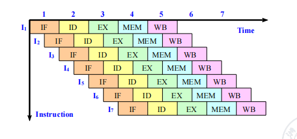{ width="500" }
<figcaption>超流水线</figcaption>
</figure>


