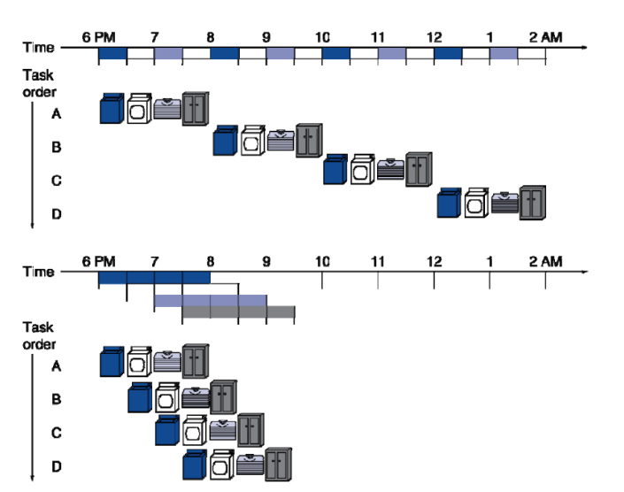
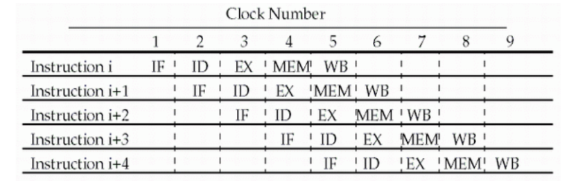
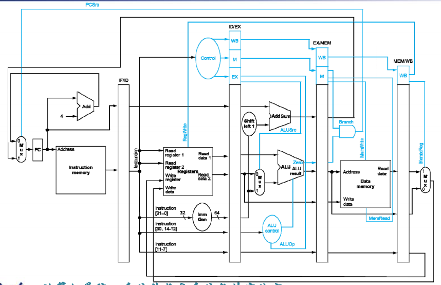
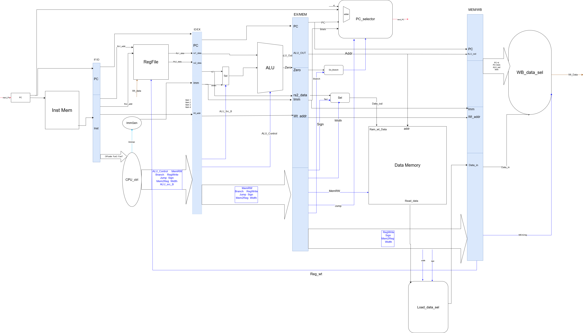
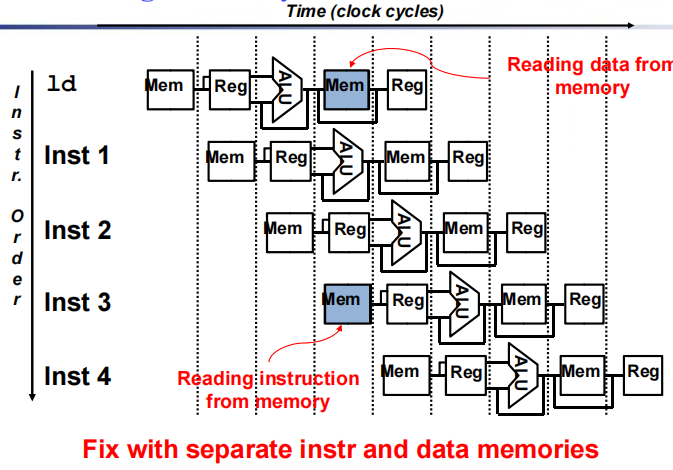
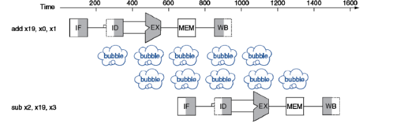
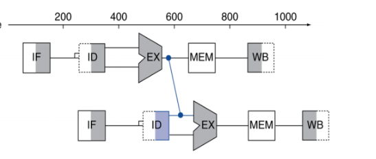
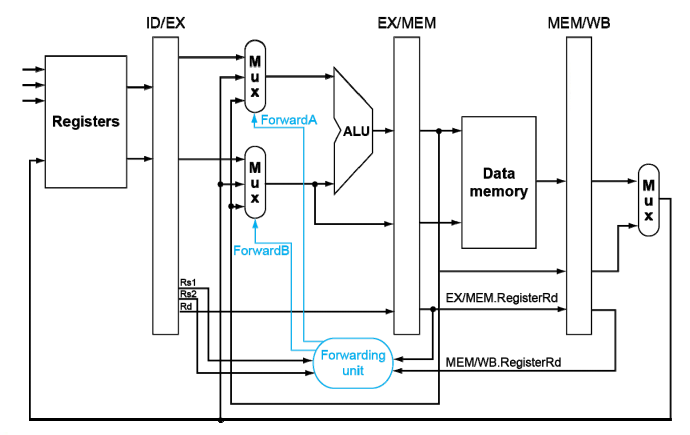
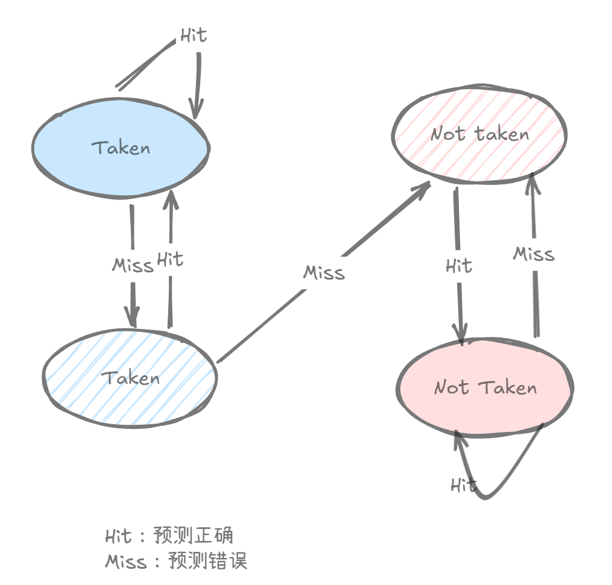

# 处理器

这一章节主要讨论了单周期和流水线CPU的原理和设计,在实验课上,我们也会使用Verilog来实现这两种CPU.

而CPU的工作流程可以分为以下几个步骤:

1. **取指令 (Instruction Fetch)**，IF: 从内存中取出当前指令，并将其存储在指令寄存器中。
2. **指令译码 (Instruction Decode)**，ID: 解析指令，确定操作码和操作数，并读取必要的寄存器值。
3. **执行 (Execution)**，EX: 根据指令类型执行相应的操作，例如算术运算、逻辑运算或内存访问。
4. **访存 (Memory Access)**，MEM: 如果指令需要访问内存（例如加载或存储指令），则进行相应的内存读写操作。
5. **写回 (Write Back)**，WB: 将执行结果写回到目标寄存器中，以便后续指令使用。

这些步骤在单周期CPU中是顺序执行的,且在同一个时钟周期内完成,而在流水线CPU中则是并行执行的,同一个时钟周期内可以完成多个步骤,以提高处理器的效率。

## 单周期CPU

SCPU的理论实际上做过一遍实验就很清楚了,考察的点也只是对于Datapath的理解还有不同指令对应的control signal的设置.

在这里贴上笔者这一部分的实验报告

<div class="card file-block" markdown="1">
<div class="file-icon"></div>
<div class="file-body">
<div class="file-title">SCPU</div>
<div class="file-meta"></div>
</div>
<a class="down-button" target="_blank" href="../pc/SCPU.pdf"  markdown="1">:fontawesome-solid-download: 查看</a>
</div>


<div class="card file-block" markdown="1">
<div class="file-icon"></div>
<div class="file-body">
<div class="file-title">带中断的SCPU</div>
<div class="file-meta"></div>
</div>
<a class="down-button" target="_blank" href="../pc/interrupt.pdf"  markdown="1">:fontawesome-solid-download: 查看</a>
</div>


中断/异常实际上就是说在执行指令的过程中，如果发生了中断/异常，那么就跳转到中断处理程序，执行完中断处理程序之后再跳转回来继续执行指令。

更详细的各种寄存器可以参考

[**TonyCrane的RISC-V笔记**](https://note.tonycrane.cc/cs/pl/riscv/privileged/)


## 流水线CPU

与单周期相比,流水线的理论部分由于Harzard的存在,就变得比较困难了;

笔者在实验课上实现的是一个5级流水线的CPU,使用Forwarding来解决数据冒险,使用将BJ-type的指令提前到ID阶段来解决控制冒险.

贴上实验报告

<div class="card file-block" markdown="1">
<div class="file-icon"></div>
<div class="file-body">
<div class="file-title">流水线CPU</div>
<div class="file-meta"></div>
</div>
<a class="down-button" target="_blank" href="../pc/pipeline.pdf"  markdown="1">:fontawesome-solid-download: 查看</a>
</div>

### 引入

教材上对于流水线CPU的引入采用了洗衣服的比喻

<figure markdown="span">
{ width="500" }
<figcaption>示意图</figcaption>
</figure>

如图所示,将洗衣服这一过程分成了互不相干的四个步骤：

- 取衣服
- 用洗衣机洗
- 叠衣服
- 放好

如果按顺序做,洗三次需要3*4=12个时间单位,而如果流水线化,则只需要4+3=7个时间单位.

加速比为

\[
\text{Speedup} = \frac{12}{7} \approx 1.71
\]

运用这一思想,我们也可以将CPU互不影响的的五个阶段分别执行,以提高CPU的效率;

!!!Note
    上面的例子也给了我们加速比的计算方法,对于$k$级流水线,如果有$m$条指令,那么加速比为

    \[
    \text{Speedup} = \frac{m \times k}{m + k - 1}
    \]

    当$m$趋近于无穷大时,加速比趋近于$k$.

理想情况下,当指令充满流水线时,每一个时钟周期都可以完成一条指令,即CPI=1.

<figure markdown="span">
{ width="500" }
<figcaption>示意图</figcaption>
</figure>

!!!info inline
    对于上面的示意图,横向看,对于每一条指令,每一个阶段在不同的时钟周期完成,纵向看,对于每一个时钟周期(当指令充满流水线时)都有五条指令的不同阶段在执行.


**流水线可以提高CPU的吞吐量(throughput),但是并没有改变每一条指令的执行时间Latency**

在SCPU中,一个时钟周期的长度取决于用时最长的 **指令** 所需的时间(五个阶段加起来).

在流水线CPU中,一个时钟周期的长度取决于用时最长的 **阶段** 所需的时间.


### Datapath

与单周期CPU不同,流水线CPU的datapath当然不能直接照搬过来,由于每个时钟周期都有不同的指令的不同阶段在执行,所以中间需要插入四个寄存器将五个阶段的信号隔开来;

<figure markdown="span">
{ width="500" }
<figcaption>datapath示意图</figcaption>
</figure>

同时也附上笔者画的Datapath:

<figure markdown="span">
{ width="700" }
<figcaption>Datapath示意图</figcaption>
</figure>

由于在前面阶段的信号在后面也有可能要用到,所以需要考虑哪些信号需要跟着流水级一起前进,
同时从datapath也可以看到一条指令每一个阶段用到的东西都是不一样的(对于寄存器堆虽然读和写用的是同一个regfile,但是在不同的时间段用到,所以也是不一样的)


!!!advice
    如果想要完全掌握CPU的工作流程,一定要自己画一遍Datapath！一定要
    自己画一遍Datapath！一定要自己画一遍Datapath！

至此来看,流水线CPU的设计似乎已经完美了,然而现实很骨感,仍有三座大山阻碍着我们的前进

- 结构冒险
- 数据冒险
- 控制冒险

### Structure Hazard

Structure Hazard是由于硬件资源的冲突导致的,比如在一个时钟周期内,两个指令同时要访问同一个硬件资源,这就会导致Structure Hazard(结构冒险).

可能同时被两条指令访问的结构有

- 寄存器堆:这个不用担心,因为我们实现的寄存器堆同时具有读口和写口,所以不会有冲突

- 内存:如果我们只有一个内存,那么在同一个时钟周期内,两个指令同时要访问内存(取指令和数据访存),解决的方法也很简单,只要把数据内存和指令内存分开就行了

<figure markdown="span"> 
{ width="500" }
<figcaption>S Hazard</figcaption>
</figure>

然而,有的时候为了减小成本或者提高性能,有可能会允许机器出现结构冒险;


### Data Hazard

Data Hazard是由于数据相关导致的,即某条指令的执行依赖于前面指令的完成;

例如下面的指令

```ASM
add x1, x2, x3
add x4, x1, x5
```
当第二条指令执行到EX阶段时,第一条指令在MEM阶段,还没有写回;

!!!question "隔多少条指令才不会有data hazard"
    - 相邻的指令,肯定有,无需多言
    - 隔一条指令,当后执行的指令在ID阶段时,前面的指令在MEM阶段,也会有
  
    - 隔两条指令,当后执行的指令在ID阶段时,前面的指令在WB阶段,此时分为两种情况

        - 如果实现了double pump,即阶段寄存器在时钟上升沿写,寄存器堆在时钟下降沿写,即写回阶段在前半个时钟周期完成写入,由于ID阶段是一直读的,所以后半个时钟周期读到了正确的数据,在下一个时钟周期上升沿到来之前可以把数据传递给EX阶段,所以不会有data hazard

        - 如果没有实现double pump,那么在下一个时钟周期上升沿到来之前,数据还没有写入,所以会有data hazard

#### stall

解决data hazard的方法有两种,第一种是直接等待(stall),即在ID阶段检测到data hazard之后,停止流水线,等待数据写回,这样会导致流水线效率的降低;

对于实现了double pump的CPU,只用停两个时钟周期,对于没有实现double pump的CPU,则需要停三个时钟周期.

<figure markdown="span">
{ width="500" }
<figcaption>stall</figcaption>
</figure>

这就好比在流水线中插入了气泡

stall的检测在ID阶段,stall做的事就是IF/ID阶段不变,PC也不变,ID/EX阶段的控制信号设置为0,这样就可以停止流水线了.

#### Forwarding

第二种方法是Forwarding,即前递,这个名字很形象,就是把数据提前传递给需要的地方;

<figure markdown="span">
{ width="400" }
<figcaption>Forwarding</figcaption>
</figure>

在上一条指令的EX阶段结束后,就可以在该指令的MEM阶段把数据往前传递给下一条指令的EX阶段来使用.

判断的条件为MEM阶段或者WB阶段的目的寄存器是否需要改变ID阶段的源寄存器,如果是,则需要进行Forwarding.

- `EX/MEM.write && ID/EX.rs1 == EX/MEM.rd`
- `EX/MEM.write && ID/EX.rs2 == EX/MEM.rd`
- `MEM/WB.write && ID/EX.rs1 == MEM/WB.rd`
- `MEM/WB.write && ID/EX.rs2 == MEM/WB.rd`

其中`EX/MEM.write=EX/MEM.regWrite && EX/MEM.rd!=0`, `MEM/WB.write=MEM/WB.regWrite && MEM/WB.rd!=0`

所以,需要在EX阶段的ALU加入判断是否前递的旁路输入线路

<figure markdown="span">
{ width="500" }
<figcaption>Forwarding Unit</figcaption>
</figure>

还没结束,当我们连续对同一个寄存器进行改变

```ASM
add x1 x1 1
add x1 x1 1
add x1 x1 1
add x1 x1 1
```
这时候明显两种条件都满足,所以需要为它们加上优先级,实际上也不难发现,我们应该优先检测EX/MEM阶段的前递,因为它的数据是最新的,只有当它不满足，我们才检测MEM/WB阶段的前递.

还有最后一种需要考虑的情况

```ASM
ld x1 0(x2)
add x3 x1 x4
```

当我们load指令后面跟着依赖它的指令的时候,我们必须要stall一个周期等待mem阶段结束,再把数据传递给下一条指令的EX阶段.

否则就会出现"时间穿梭",即MEM阶段还没结束就把数据传出去了,这是不允许的.


很好,现在我们只剩下最后一个控制冒险了

### Control Hazard

当我们遇到跳转指令的时候,我们在EX阶段判断它是否跳转,但是早在ID阶段,下一条指令的IF阶段就已经开始取指令了,这就会导致控制冒险.

解决的方法有以下几种

- stall直接等待知道判断结束再进行取指令,但是太慢了
- 静态预测
     - 总是预测跳转:将跳转后的指令取进来，如果最后是不跳转的，那么就flush掉
     - 总是预测不跳转:将原本跟着的指令取进来，如果最后是跳转的，那么就flush掉
- 动态预测(最常用)
     - 一位预测,根据前面的跳转情况来预测当前情况,但是对于嵌套循环必有两次错误
     - 两位预测,根据前面两次的跳转情况来预测当前情况,只有连续预测错两次才改变预测结果,容错率更高 
- 将BJ-type的指令提前到ID阶段,可以与静态预测结合使用,也可以直接跟一条nop指令,ID结束后把正确的指令拿进来,不需要flush,比较简单

- 将跳转过的地址做一张索引表,快速寻址


<figure markdown="span">
{ width="500" }
<figcaption>2 bit prediction</figcaption>
</figure>