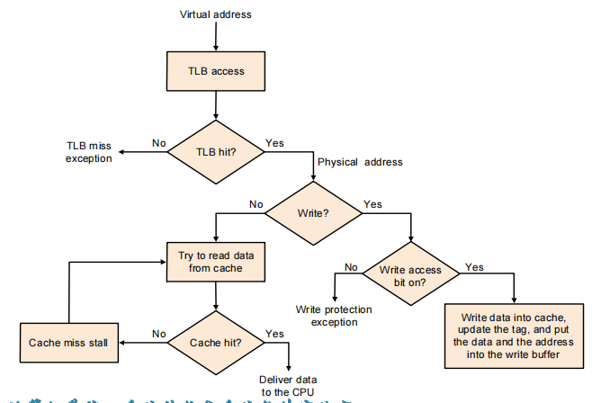

# Large and Fast: Exploiting Memory Hierarchy

- 硬盘: 慢, 大, 便宜;
- SRAM: 静态随机存取存储器, 速度快, 价格贵, 容量小;
- DRAM: 动态随机存取存储器, 速度慢, 价格便宜, 容量大;

## Cache的引入

在访问指令和数据时,我们都需要对memory进行访问;直接访问memory时很费时的,为了节省时间,我们可以造一块小的"内存",将其放在内存和CPU之间,这个小内存的访问速度比较快,里面存放的是即将被访问的数据,这就是cache(缓存);

这样的实现依赖于程序对memory的访问具有 **两个局部性(Locality)**

- 时间局部性(Temporal Locality): 如果一个内存位置被访问,那么它很可能在不久的将来再次被访问;
- 空间局部性(Spatial Locality): 如果一个内存位置被访问,那么它附近的位置很可能在不久的将来被访问;

<figure markdown="span">
{ width="400" }
<figcaption>内存层次架构</figcaption>
</figure>

!!!definition "基本概念"
    - Block: 存储在缓存中的数据单位。一般是Byte的倍数;
    - Hit: 当所需数据在缓存中找到时的情况。
    - Miss: 当所需数据不在缓存中，需要从更低层次的存储器中获取时的情况。
    - Miss Rate: 缓存未命中次数占总访问次数的比例。
    - Miss Penalty: 由于缓存未命中而需要从更低层次存储器中获取数据所花费的额外时间。
    

## Cache的基本组成

### 直接映射Cache

所谓直接映射的Cache(Direct-Mapped Cache),就是将内存中的一个Block直接映射到Cache中的一个Block;

是单射, 即一个内存地址只能映射到Cache中的一个地址;

假设我们现在有一个Cache,其能存放八个块(8 entry),现在有32个Block,那么我们就可以将这32个Block依次标上0-31的编号,得到块地址(Block index),然后依次将这些index模8,得到0-7的编号,然后将这些编号作为Cache的index,这样就可以将32个Block映射到Cache的8个块中;

<figure markdown="span">
{ width="400" }
<figcaption>直接映射Cache</figcaption>
</figure>

从上面也可以看出,可能会有多种内存地址映射到同一个Cache的index,为了区分,我们还需要额外的一些位来区分不同的block,这就是标签(Tag).

最后,我们还需要一位Valid bit来区分当前的Block是否是内存中取出来的有效数据，还是一些无用的杂乱数据

所以，我们就得到了Cache的组成:

<figure markdown="span">
{ width="400" }
<figcaption>Cache的组成</figcaption>
</figure>

!!!Cache
     Cache 里面每一行只用存放一个Block，一个Tag和一个Valid bit，index是不需要要存放的.

举个例子,假如我们现在有一个32位字节地址,一个块是4个字节,Cache有8个块,那么我们就可以将32位字节地址分为三部分:

- Byte offset: 2位
- Block index: 3位
- Tag: 27位

如果有的时候给出十进制地址,我们也可以将其转换为二进制地址,然后进行上述的划分;

当然，更快捷的方法是：

原地址 / 块大小 = 块地址，然后取余数，得到Byte offset;

块地址 / Cache的组数(对于直接映射Cache,组数为块数) = Tag，然后取余数，得到Block index;

!!!Example "计算Cache的大小"
    

    
    

### 组相联Cache

组相连Cache(Set Associative Cache)，就是将Cache中的块分为若干组，每组中的块数可以是多块;

例如二路组相联Cache,一组,允许两个块映射到同一个Cache的同一组;

但是要在同一组中并行比较两个Tag,所以需要多一个比较器(直接映射Cache只需要一个比较器);

如果是多路组相联Cache,那么就需要多路比较器;

如果整个块都是一组,那么就是全相连Cache(Fully Associative Cache);一个Cache有多少块就需要多少个比较器;

同时也不难发现,每多一组,Index的位数就会减少一位,Tag的位数就会增加一位;

对于n路组相联,首先得到块index,然后将块index mod n,得到组index,然后进入到组中将Tag和该组中的所有Tag进行比较,如果匹配成功,那么就命中,否则就未命中;

例如:

- 直接映射Cache: 8个块,8组,3位Index, 27位Tag;
- 二路组相联Cache: 8个块,4组,2位Index, 28位Tag;
...

<figure markdown="span">
{ width="600" }
<figcaption>不同的Cache</figcaption>
</figure>

!!!info "Block大小对于Cache的影响"
     Block越大,Cache的命中率越高,但是Cache的Miss Penalty也越大;同时,Cache的容量也会变大.占用更多的空间.

## Hit和Miss的处理

### Read

如果要读某一个地址的数据,如果

- Read Hit Cache命中,那么就直接从Cache中读取数据;
- Read Miss Cache未命中,那么就从更低层次的存储器中读取数据,然后将其放入Cache中;
     - data cache miss：先把对应的 block 从内存中取到 cache 里，然后再读
     - instruction cache miss：暂停 CPU 的运行，即保持 PC 不变，从 memory 里把对应的 block 拿到 cache，然后重新运行当前这条指令   

### Write

- Write Hit:
     - Write Back: 只更新Cache中的数据,不更新更低层次的存储器,当更新过的数据从Cache中被替换出去时,才更新更低层次的存储器;此时需要一个Dirty bit来标记该数据是否被更新过;
     - Write Through: 同时更新Cache和更低层次的存储器;

- Write Miss:
     - Write Allocate: 将数据从更低层次的存储器中读取到Cache中,然后更新Cache中的数据;
     - Write No Allocate: 不将数据从更低层次的存储器中读取到Cache中,直接更新更低层次的存储器;
  
Write Back通常和Write Allocate一起使用(即先写入缓存,再写入更低层次的存储器),而Write Through通常和Write No Allocate一起使用(即直接写入更低层次的存储器);

### 替换策略

当Cache某一组已经满了,但是又要有新的块要进来,这时候就需要替换掉Cache中的一个块;

- 随机替换(Random Replacement): 随机选择一个块进行替换;
- 最近最少使用(Least Recently Used, LRU): 选择最近最少使用的块进行替换;
- 先进先出(First In First Out, FIFO): 选择最早进入Cache的块进行替换;

### 多级Cache

多级Cache的主要目的是为了在不同层次的存储器之间取得平衡。每一级Cache都有不同的大小和速度，越靠近CPU的Cache越小但速度越快，越远离CPU的Cache越大但速度越慢。

- 一级Cache（L1）非常小且非常快，通常与CPU核心集成在一起，用于存储最频繁使用的数据。二级Cache（L2）稍大一些，速度稍慢一些，但仍然比主存储器快。三级Cache（L3）更大更慢，但仍然比主存储器快。通过这种方式，系统可以在速度和容量之间取得平衡。

- 多级Cache可以显著减少内存访问的延迟。CPU首先尝试从L1 Cache读取数据，如果未命中则尝试从L2 Cache读取，依此类推，直到最终从主存储器读取数据。每一级Cache的命中率都很高，从而减少了访问主存储器的次数。

- 由于多级Cache可以减少内存访问的延迟，因此可以显著提高系统的整体性能。CPU可以更快地访问所需的数据，从而减少等待时间，提高指令执行效率。

- 多级Cache还可以帮助优化能效。访问较低层次的Cache比访问主存储器消耗更少的能量，因此多级Cache可以帮助减少系统的整体能耗。

总的来说,越靠近CPU的Cache,速度越快,容量越小,更加关注访问速度;越远离CPU的Cache,速度越慢,容量越大,更加关注Miss Rate;

!!!Example "多级Cache"
    假设初始CPI为1,L1 Cache的Miss Rate为1%,L2 Cache的Miss Rate为5%;

    访问L2 Cache的时钟周期为10,访问主存的时钟周期为100;

    - 如果没有L2 Cache,那么CPI为1+1%*100=11;
    - 如果使用L2 Cache,那么CPI为1+1%*10+1%*5%*100=1.15;
    
    大大减少了CPI,提高了性能;
    
    这里还需要注意的一个点是,并不是说越往下的Cache Miss Rate一定越低,例如L1 Cache的Miss Rate为1%,L2 Cache的Miss Rate为5%,但是增加了L2 Cache后,Miss时必须要两个Cache都未命中,即增加多级Cache,可以降低整体的Miss Rate,单个Cache的Miss Rate未必低。

## 虚拟内存(Virtual Memory)

虚拟内存（Virtual Memory）是一种内存管理技术，它为应用程序提供了一个假象，即每个进程都拥有连续且独立的内存空间。实际上，虚拟内存将物理内存和磁盘存储结合起来，使得系统能够运行比实际物理内存更大的程序。

虚拟内存技术使得各个进程之间并不知道其他进程的物理地址空间，只有操作系统（OS）知道所有进程的地址空间，这样就保证了进程之间不会相互干扰，也避免了某些进程对于内存空间的破坏。

有以下几个概念

- 页(Page): 虚拟内存将内存划分为固定大小的块，称为页。
- 页表(Page Table): 页表是一个数据结构，用于映射虚拟地址到物理地址。每个进程都有一个独立的页表。

<figure markdown="span">
{ width="600" }
<figcaption>虚拟内存示意图</figcaption>
</figure>

例如上图中左边是一个进程的虚拟地址空间,右边是物理地址空间和磁盘;虚拟地址空间是连续的，映射到了不连续的物理地址空间和磁盘空间;

虚拟地址映射只对地址的高位进行，即只进行虚拟页与物理页的映射;页内偏移是固定的；

<figure markdown="span">
{ width="600" }
<figcaption>虚拟地址映射</figcaption>
</figure>

一般而言，虚拟地址的位数比物理地址的位数更多;

每一次出现 page fault 我们都需要访问一次 disk，这是非常耗时的（访问时间可以达到访问 memory 的十万倍），因此我们需要尽可能减少 page fault，例如增大 page 的大小可以减少 page fault 的次数;访问硬盘太慢了，因此我们要采用 write back 策略。

### Page Table 和 TLB

使用一个表格来记录虚拟地址到物理地址的映射关系;其index就是Virtual address,即虚拟页号;页表里面存放的是物理页号+1 bit的valid bit;

<figure markdown="span">
{ width="600" }
<figcaption>Page Table</figcaption>
</figure>

每一个进程都有自己各自的 page table，program counter 和 page table register（用来存储它对应的 page table 的位置），当我们在进程中切换时，只需要切换页表就可以了。

为了减少miss rate,页表使用的是全相连;但是注意页表不是Cache；

为了进一步提高Page Table的访问速度,我们可以使用TLB(Translation Lookaside Buffer)来加速;

TLB是页表的Cache,使用虚拟页号作为地址,有直接映射，组相联，全相联三种;

首选拿到虚拟地址,然后进行TLB的访问,如果TLB命中,那么就返回物理地址;如果TLB未命中,那么就去页表里面找;

- 如果发现对应项的 valid bit 是 1，那么就把它拿到 TLB 里此时被替换掉的 TLB entry 的 dirty bit 如果是 1，也要写回 page table）
- 如果对应项的 valid bit 是 0，就说明这一个 page 不在内存中，会触发一个 page fault。OS 会先把这个 page 从 disk 中取到内存中，并更新 page talbe，最后再重新执行一次 TLB 的查找

<figure markdown="span">
{ width="600" }
<figcaption>流程图</figcaption>
</figure>

<figure markdown="span">
{ width="600" }
<figcaption>从虚拟内存到数据访问</figcaption>
</figure>

TLB, Page Table, Cache 三者之间Hit的情况如下表所示：

| TLB  | Page table | Cache | Possible? If so, under what circumstance?                                      |
|------|------------|-------|--------------------------------------------------------------------------------|
|Hit   |Hit         |Hit    |Possible, although the page table is never really checked if TLB hits.         |
| Hit  | Miss       | Miss  | Possible, although the page table is never really checked if TLB hits.         |
| Miss | Hit        | Hit   | TLB misses, but entry found in page table; after retry, data is found in cache.|
| Miss | Hit        | Miss  | TLB misses, but entry found in page table; after retry, data misses in cache.  |
| Miss | Miss       | Miss  | TLB misses and is followed by a page fault; after retry, data must miss in cache.|
| Hit  | Miss       | Miss  | Impossible: cannot have a translation in TLB if page is not present in memory. |
| Hit  | Miss       | Hit   | Impossible: cannot have a translation in TLB if page is not present in memory. |
| Miss | Miss       | Hit   | Impossible: data cannot be allowed in cache if the page is not in memory.      |

