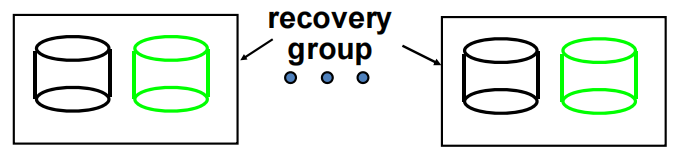
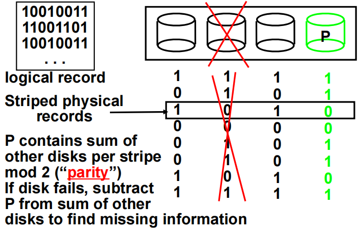
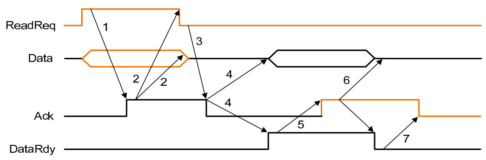

# Storage, Networks and Other I/O Topics

## 引入

I/O 操作是计算机系统中的一个重要组成部分，它是计算机与外部设备之间的数据传输。

I/O 设备的设计需要考虑许多方面，包括：

- 可拓展性
- 可靠性
- 性能
- 适应性

I/O 的性能主要由以下几个方面决定：

- 设备和系统之间的连接
- 内存层次架构
- 操作系统

    

每一个 I/O 设备都有一个对应的控制器，负责管理设备的操作。控制器通过总线（bus）与 CPU 进行通信，从而实现 I/O 设备与 CPU 的交互。

IO 的行为有输入（input）和输出（output）,或者存储（storage）。

- Input: 从设备到主存,read once;
- Output: 从主存到设备,write only;
- Storage: can be reread and usually rewritten

如何评价一个 I/O 设备的性能主要取决于它的具体用途

Throughput

这里的吞吐量可以指单位时间传输的数据量，也可以指单位时间进行的 I/O 的操作的数量

Response time

响应时间，其实就是进行一次 I/O 操作所需的时间

both throughput and response time

同时考虑上面两个因素

## 硬盘的结构

硬盘（Hard Disk Drive, HDD）是计算机中常见的存储设备之一。它由多个盘片（platter）组成，这些盘片通过主轴（spindle）固定在一起，并且可以高速旋转。每个盘片的两面都覆盖有磁性材料，用于存储数据。

硬盘的主要组成部分包括：

1. 盘片（Platter）：硬盘内部的圆形磁盘，用于存储数据。盘片的数量可以有多个，通常为2到5个。每一个盘上都有很多同心圆，这些同心圆称为磁道（track），每一个磁道被划分为多个扇区（sector）。扇区是硬盘存储数据的最小单位。
2. 主轴（Spindle）：用于固定和旋转盘片的轴。主轴电机驱动盘片旋转，通常转速为5400 RPM（转每分钟）到7200 RPM，高性能硬盘可以达到10000 RPM甚至15000 RPM。
3. 磁头（Read/Write Head）：用于读取和写入数据的部件。每个盘片的两面都有一个磁头，磁头通过悬臂（actuator arm）固定在一起，并由伺服电机（servo motor）控制其移动。
4. 悬臂（Actuator Arm）：连接磁头并控制其在盘片表面上的移动。悬臂的移动由伺服电机驱动，可以在盘片的半径方向上移动，以便磁头能够访问盘片上的不同位置。
5. 控制电路（Controller Circuit）：硬盘内部的电路板，用于控制硬盘的读写操作、数据传输和错误校正等功能。

硬盘的工作原理如下：

1. 当计算机需要读取或写入数据时，硬盘控制器会将相应的指令发送给硬盘。
2. 主轴电机驱动盘片高速旋转，磁头在悬臂的控制下移动到指定的轨道（track）位置。
3. 磁头通过感应盘片表面的磁性变化来读取数据，或通过改变盘片表面的磁性来写入数据。
4. 读取或写入的数据通过控制电路传输到计算机的主存或其他设备。

硬盘的性能主要由以下几个方面决定：

1. 转速（RPM）：盘片的旋转速度，转速越高，数据访问速度越快。
2. 磁头寻道时间（Seek Time）：磁头移动到目标轨道所需的时间，寻道时间越短，数据访问速度越快。
3. 数据传输率（Data Transfer Rate）：硬盘与计算机之间的数据传输速度，传输率越高，数据访问速度越快。
4. 缓存（Cache）：硬盘内部的高速缓存，用于临时存储数据，提高数据传输效率。

硬盘的优点包括容量大、价格低廉、数据保存时间长等，但其缺点是速度较慢、易受震动影响、功耗较高等。

    

!!!info "硬盘可靠性指标"
    - MTTF: Mean Time To Failure, 平均无故障时间,即两次故障之间的平均时间
    - MTTR: Mean Time To Repair, 平均修复时间,即两次故障之间的平均修复时间
    - MTBF: Mean Time Between Failure, 平均故障间隔时间,即两次可用时间之间的平均时间(MTTF+MTTR)
    - Availability: 可用性,即硬盘在正常工作状态下的时间占总时间的比例(MTBF/(MTBF+MTTR))
    - AFR: Annualized Failure Rate, 年化故障率,即硬盘在一年内的故障率,AFR=YEAR/MTTF
    
    提升MTTF（平均无故障时间）的方法包括：

    - Fault avoidance
    - Fault tolerance
    - Fault forecasting

    Reliability of N disks = Reliability of 1 disk / N

    硬盘的可靠性随着硬盘数量的增加而降低，这是因为每个硬盘都有可能发生故障.

## RAID

RAID（Redundant Array of Inexpensive Disks，廉价磁盘冗余阵列）是一种将多个独立的物理硬盘组合成一个逻辑单元，以提高数据存储性能、可靠性和容量的技术。RAID有多个级别，每个级别都有不同的特点和应用场景。

### RAID 0

RAID 0通过将数据条带化（striping）分布在多个磁盘上来提高性能。RAID 0没有冗余，因此数据的可靠性较低。如果其中一个磁盘发生故障，所有数据将会丢失。

- 优点：读写性能显著提高，存储利用率为100%。
- 缺点：没有数据冗余，可靠性低。

<figure markdown="span">
{ width="400" }
<figcaption>RAID-1</figcaption>
</figure>

### RAID 1

RAID 1通过将数据镜像（mirroring）到两个或多个磁盘上来提高数据可靠性。每个磁盘都有相同的数据副本，因此即使一个磁盘发生故障，数据仍然可以从其他磁盘中恢复。

- 优点：高数据可靠性，读性能有所提高。
- 缺点：存储利用率为50%，写性能略有下降。

### RAID 2

RAID 2使用位级条带化（bit-level striping）和海明码（Hamming code）进行错误校正。RAID 2在现代系统中很少使用，因为其复杂性和对同步磁盘的需求。

- 优点：提供错误检测和校正。
- 缺点：实现复杂，存储利用率低。

### RAID 3

RAID 3使用字节级条带化（byte-level striping）和一个专用的奇偶校验磁盘来提供数据冗余,当其中一个盘的数据出现问题时，可以通过其他盘的数据和校验位来恢复数据。RAID 3适用于大文件的顺序读写，但在处理多个并发请求时性能较差。

- 优点：提供数据冗余，适合大文件顺序读写。
- 缺点：并发处理性能较差，奇偶校验磁盘成为瓶颈；我们无法确定哪一个盘出现问题。

<figure markdown="span">
{ width="400" }
<figcaption>RAID-3</figcaption>
</figure>

### RAID 4

RAID 4使用块级条带化（block-level striping）和一个专用的奇偶校验磁盘。与RAID 3类似，但RAID 4在处理并发请求时性能更好。

- 优点：允许同时对不同的盘进行独立的读操作，RAID 4 让每一个 sector 都有自己单独的校验位，这样就可以确定出错的硬盘。对于 small read 和 large write 表现良好

- 缺点：奇偶校验磁盘仍然是瓶颈，对于 small write 表现不佳

### RAID 5

RAID 5使用块级条带化和分布式奇偶校验。奇偶校验信息分布在所有磁盘上，消除了单一奇偶校验磁盘的瓶颈。RAID 5在性能和数据冗余之间取得了良好的平衡。

- 优点：提供数据冗余，读写性能较好，存储利用率高。
- 缺点：写操作需要计算和写入奇偶校验信息，性能略有下降。

### RAID 6

RAID 6类似于RAID 5，但使用双重分布式奇偶校验，可以容忍两个磁盘同时发生故障。RAID 6提供了更高的数据可靠性，适用于对数据安全性要求较高的场景。

- 优点：提供更高的数据冗余，能够容忍两个磁盘故障。
- 缺点：写操作开销更大，存储利用率略低于RAID 5。

## 总线

总线并不只有单独一根线，实际上时多条线组合在一起，把各种设备相互连接起来。

- 控制线(Control Lines): 用于传输控制信号，如时钟信号、复位信号等。
- 数据线(Data lines): 用于上传输数据，例如地址和读写的数据。

总线工作：包括两个部分：发送地址和接收或发送数据

- 输入：从设备向内存输入数据
- 输出：从内存向设备输出数据

!!!example "Bus transaction"
    === "Input"
        

            
        

    === "Output"
        

            
        

###  同步和异步

- 同步(Synchronous):所有的设备都有相同的时钟频率，但由于数据传输有延迟，clock skew 无法避免，所以信号线的长度必须尽可能短
- 异步(Asynchronous): 设备不需要有相同的时钟频率，通过握手协议来进行数据传输

<figure markdown="span">
{ width="400" }
<figcaption>七次握手</figcaption>
</figure>

1. 首先，I/O 设备发出 `ReadReq` 信号，请求从主存储器读取数据，并传输相应的内存地址。
2. 主存储器接收到 `ReadReq` 信号并读取地址后，发出 `Ack` 信号，表示已收到 `ReadReq` 信号，并开始准备数据。
3. I/O 设备收到 `Ack` 信号后，将 `ReadReq` 信号置低，同时释放数据总线。
4. 主存储器检测到 `ReadReq` 信号已被置低后，将 `Ack` 信号置低。
5. 当主存储器准备好数据后，将数据放到数据总线上，并升高 `DataRdy` 信号。
6. I/O 设备收到 `DataRdy` 信号后，读取数据总线上的数据，并在数据读取完成后发出 `ACK` 信号，表示数据已读取完毕。
7. 主存储器收到 `ACK` 信号后，将 `DataRdy` 信号置低，并释放数据总线。
8. I/O 设备收到 `DataRdy` 信号后，将 `ACK` 信号置低，表示整个数据传输过程已完成，总线可以用于其他操作。

## Bus Arbitration

总线上由多个设备共享，其中如果多个设备同时需要使用总线，就会出现冲突，这时就需要总线仲裁（bus arbitration）来解决这个问题,总线可能有多个Master，来决定哪一个I/O设备可以访问总线。这些master拥有不同的优先级

## Communication with the processor

- polling: 轮询，CPU 不断询问每个设备是否需要使用总线，直到有一个设备响应为止,轮询会浪费 CPU 大量的时间，因为大部分情况下 I/O 设备都没有请求或者还没有准备好。
- interrupt: 中断，当设备需要使用总线时，通过中断请求（interrupt request）来通知CPU，CPU 在处理完当前任务后，会立即响应中断请求，并处理设备的需求,中断驱动的 I/O 操作可以让 CPU 在 I/O 设备读写数据的时候做其他的事情。
- DMA: 直接内存访问，DMA 控制器直接从内存中读取数据，而不需要CPU的干预，DMA 控制器可以独立于CPU进行数据传输，这样可以提高数据传输的效率,DMA 不需要 CPU 的控制，所以不会占用 CPU 的时间，但 DMA 实际上只用于数据的传输，它与 polling 和 interrupt 并不冲突

