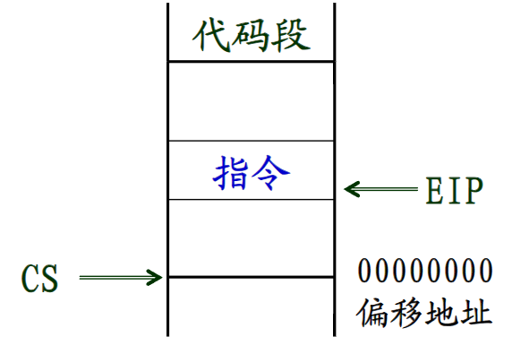

# 计算机的硬件组成结构

计算机有三大硬件组成部分

- CPU:包含运算器，控制器，寄存器

- 主存储器

- I/O接口：辅助存储器，输入设备，输出设备

而汇编程序员将硬件抽象为

- 寄存器

- 存储器地址

- 输入输出地址 
## 寄存器(Register)

!!!info
    寄存器是处理器内部的高速存储单元,用于暂时存放程序执行过程中的代码和数据

    大致可以分成两类
    
    - 透明寄存器：对应用人员不可见，不能编程直接控制
    
    - 可编程（programmable）寄存器：具有引用名称，可以直接供编程使用

可编程寄存器又分为通用寄存器和专用寄存器

### 处理器通用寄存器

处理器最常使用整数通用寄存器，可以用于保存整数数据，地址等

32位的IA-32处理器具有8个32位通用寄存器

- EAX，EBX，ECX，EDX，ESI，EDI，EBI，ESP

| Register | English Name        | Chinese Name      |
|----------|---------------------|-------------------|
| EAX      | Accumulator         | 累加器            |
| EBX      | Base Address        | 基址寄存器        |
| ECX      | Counter             | 计数器            |
| EDX      | Data                | 数据寄存器        |
| ESI      | Source Index        | 源变址寄存器      |
| EDI      | Destination Index   | 目的变址寄存器    |
| EBP      | Base Pointer        | 基址指针          |
| ESP      | Stack Pointer       | 堆栈指针          |

源自16位8086处理器的8个16位通用寄存器（E为扩展，即extend）

- AX，BX，CX，DX，SI，DI，BP，SP，前四个寄存器可分高低字节，形成8个8位的通用寄存器：AH,AL,BH,BL,CH,CL,DH,DL
  
这使得这些寄存器既是一个整体，又可以独立使用

???Note "图示"
    
    

### 处理器专用寄存器

专用寄存器主要有三类，**标志寄存器**，**指令指针寄存器**，**段寄存器**

#### 标志（Flag）寄存器

???info "什么是标志"
    标志体现了某种工作状态，有些处理器标志用于反映指令执行结果（加减是否进位借位，数据是否为0，正负），有些处理器标志用于控制指令执行形式（处理器是否单步操作，是否响应外部中断）

各种标志组合在一个专用寄存器形成标志寄存器，8086支持16位的标志寄存器FLAGS

IA-32处理器形成32位EFLAGS标志寄存器

- 状态标志：记录指令执行结果的辅助信息，**是处理器最基本的标志**
       + 加减运算和逻辑运算指令主要设置他们
       + 其他有些指令的执行也会相应地设置他们
       + 处理器主要使用其中5个构成各种条件（分支指令判断这些条件实现程序分支）
     
- 控制标志： 方向标志DF，仅用于串操作指令
- 系统标志： 控制操作系统或核心管理程序的操作方式

#### 指令指针寄存器EIP

用于保存 **将要执行的指令在主存的存储器地址** ，相当于一个指向将要执行指令的指针

- 在顺序执行时会自动增量，指向下一条指令

- 分支，调用等操作时执行控制转移指令修改，引起程序到指定的指令执行

- 在出现中断或者异常时被处理器赋值而相应改变

#### 段寄存器

!!!Note "存储空间分段管理"
    
    “段”是保存相关代码或者数据的一个主存区域

     应用程序主要涉及三类基本段

     - 代码段（Code Segment）
       存放程序的可执行代码（处理器指令）

     - 数据段（Data Segment）
       存放全局变量等程序所用的数据

     - 堆栈段（Stack Segment）
       这是程序所需要的特殊区域，用于存放返回地址，临时变量等
    
       
段寄存器表明某个段在主存中的位置

根据各个段的首字母缩写来给相应的寄存器命名，共有6个16位寄存器

|代码段|CS|
|-----|---|
|堆栈段|SS|
|数据段|DS，ES（Extra segment），FS，DS|

**代码段的当前指令地址**

- 段基地址：由代码段寄存器CS保存
- 偏移地址：由指令指针寄存器EIP保存

**堆栈段的当前栈顶地址**

- 段基地址：堆栈段寄存器SS保存
- 堆栈指针寄存器ESP保存   

**数据段的操作数地址**

- 段基地址：数据段寄存器DS指示，有时候也用ES，FS，GS指示
- 偏移地址：没有专门的寄存器，由存储器寻址方式计算出的有效地址EA指示

编程采用的逻辑地址为  段基地址:偏移地址 的组合

- 段基地址：在主存中的起始地址
- 偏移地址：距离段基地址的便宜量

???info
    
    
    

!!!Note "总结"
    寄存器分为不可编程的 **透明寄存器** 和 **可编程寄存器** ，可编程寄存器又可以进行分类

       
    | 分类          | 类型             | 寄存器                                               |
    |---------------|------------------|-----------------------------------------------------|
    | **通用寄存器** | 32位通用寄存器   | EAX EBX ECX EDX ESI EDI EBP ESP                      |
    |               | 16位通用寄存器   | AX  BX  CX  DX  SI  DI  BP  SP                       |
    |               | 8位通用寄存器    | AH  AL  BH  BL  CH  CL  DH  DL                       |
    | **专用寄存器** | 标志寄存器       | EFLAGS                                               |
    |               | 指令指针寄存器   | EIP                                                  |
    |               | 段寄存器         | CS  DS  SS  ES  FS  GS                               |

## 存储器组织

计算机硬件组成结构中的主存储器容量很大，被划分为许多存储单元，每个存储单元被编排一个号码，即存储单元地址，称为 **存储器地址（Memory Address）**

每个存储单元以字节为基本存储单位

- 即字节编址（Byte Addressable）
- 一个字节（Byte）等于8个二进制位（Bit）,两个字节称为字，两个字称为双字
- IA-32有32位地址，可以访问 4GB 内存

### 存储器的物理地址

处理器连接的物理存储器使用物理地址

- 从0开始顺序编排，直到其支持的最大存储单元

#### 存储管理单元和存储模型

高性能处理器集成有存储管理单元MMU，利用它进行主存储器空间管理

**存储管理单元**（Memory Management Unit, MMU）是计算机系统中的一个硬件组件，负责管理计算机的内存使用情况。它在CPU与物理内存（RAM）之间起到桥梁作用，主要职责有：

- **地址转换（虚拟内存到物理内存映射）**
程序并不直接寻址物理存储器 
MMU将程序使用的虚拟地址（逻辑地址）转换为物理地址。这种地址转换通常是通过分页（paging）或分段（segmentation）机制来实现的。每个进程在自己的虚拟地址空间中运行，这样可以使多个进程共存于系统内存中而互不干扰。

- **内存保护**
MMU可以设置不同的权限（如读、写、执行）来保护内存区域，防止一个进程访问另一个进程的内存或操作系统内存，保障系统的安全性和稳定性。

-  **内存分配与回收**
MMU协助操作系统在程序运行时分配和释放内存。它帮助管理物理内存的分配，以确保内存高效利用并减少碎片化。

-  **分页管理**
MMU通过分页机制，将程序的虚拟内存划分为固定大小的块（称为页面），并将这些页面映射到物理内存的实际位置。这样可以有效地管理内存，并支持虚拟内存技术，使程序能够使用超过物理内存大小的内存空间。

- **缓存管理**
在一些高级系统中，MMU也参与管理CPU缓存（如L1、L2缓存）与内存之间的数据交换。它确定哪些数据应该留在缓存中以提高访问速度。

- **异常处理**
当程序试图访问无效的地址（如没有映射到物理内存的虚拟地址）时，MMU会产生一个异常（通常称为页面错误或缺页中断），通知操作系统处理这个情况，如分配新的内存页或从磁盘加载需要的数据。

**IA-32** 处理器的存储模型

- 平展存储模型（Flat Memory Model）：存储器是一个连续的4GB线性地址空间
- 段式存储模型（Segmented Memory Model）
     + 存储器由一组独立的地址空间组成：段（Segment）
     + 每个段都可以达到4GB
- 实地址存储模型（Real-address Memory Model）
     + 8086处理器的存储模型（最大1MB）
     + 段式存储模型的特例（段最大64KB）
  
!!!Example
    存储器空间可以分段管理，采用逻辑地址指示

    举个例子，有一幢楼，3层，每一层有10个房间，首先我们从第一层01开始编号到最后一个房间30

    对于第二层第五个房间，物理地址是绝对地址:15，但是为了方便，它被称为205，这就是它的逻辑地址（相对地址）

!!!Note "三大地址的关系"
    程序员编程时采用逻辑地址，操作系统利用存储管理单元MMU将逻辑地址映射成线性地址（虚拟地址），处理器使用物理地址访问主存储器芯片

    **逻辑地址（Logical Address）**

    - **定义**: 逻辑地址是程序员在编写程序时使用的地址，由CPU在执行程序时生成。
    - **特点**: 逻辑地址是相对于程序的起始地址的偏移量，与实际的物理内存位置无关。
    - **别名**: 逻辑地址也被称为 **虚拟地址（Virtual Address）** 。在每个进程的上下文中，逻辑地址是唯一的。
    - **使用**: 逻辑地址是在程序代码中使用的，比如指针或数组索引。它们是由编译器生成的，并且不会直接对应到物理内存的具体位置。

    **线性地址（Linear Address）**

    - **定义**: 线性地址是将逻辑地址转换成物理地址之前的一个中间地址。它是经过分段（segmentation）计算后的地址。
    - **特点**: 线性地址是通过把逻辑地址和段寄存器（如CS、DS等）中的段基址相加得到的。  
    - **使用**: 在有些体系结构中，线性地址可能直接等于物理地址（如无分页机制的情况下），但是在大多数现代处理器中，线性地址通过分页机制进一步转换为物理地址。
      
    **物理地址（Physical Address）**

    - **定义**: 物理地址是内存单元在计算机实际物理内存（RAM）中的位置。它是CPU最终使用的实际地址。
    - **特点**: 物理地址由线性地址经过分页（paging）机制转换而来，是指向实际内存芯片的地址。
    - **使用**: 物理地址是由内存控制器使用的，用于访问实际的物理内存位置。

    1. **逻辑地址到线性地址的转换（分段）**:

       - 逻辑地址由程序生成，分为段选择器和段内偏移量。段选择器指向内存段描述符（存储在段寄存器中），而偏移量指向段内的具体位置。
       - MMU使用段选择器查找段基址，然后将段基址与偏移量相加，生成线性地址。
       - **公式**:  

       $$
       \text{线性地址} = \text{段基址} + \text{逻辑地址中的偏移量}
       $$

    2. **线性地址到物理地址的转换（分页）**:

       - 线性地址进一步通过分页机制转换为物理地址。分页机制将线性地址划分为多个固定大小的页面，线性地址中的页号部分用于查找页表（Page Table），得到物理页帧号。
       - 线性地址的页内偏移量部分与物理页帧号组合形成物理地址。
       - **公式**:

       $$
       \text{物理地址} = \text{物理页帧号} + \text{页内偏移量}$$

    - **逻辑地址** 是程序员或编译器使用的地址，描述的是虚拟内存中的位置。
    - **线性地址** 是经过分段机制转换后的地址，是逻辑地址与段基址之和。
    - **物理地址** 是存储器中实际访问的位置，由线性地址经过分页机制转换得到。
