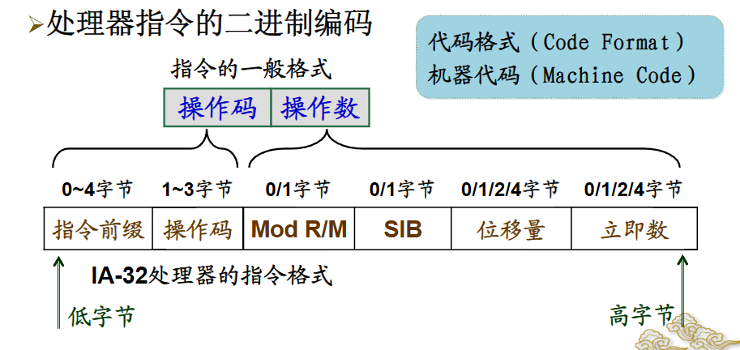
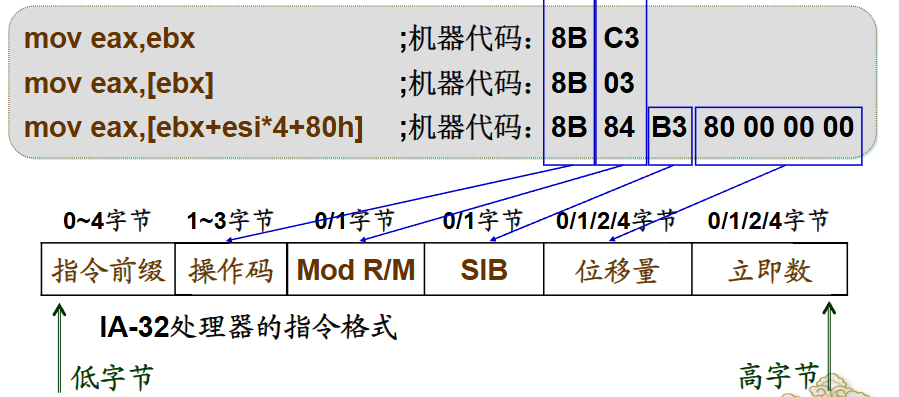

# 汇编程序格式

## 处理器指令格式

程序由程序设计语言编写，由 **指令** 构成，**指令** 由 **操作码** 和 **操作数（地址码）** 构成，**操作码（Opcode）** 表明处理器执行的操作， **操作数（Oprand）** 是参与操作的数据对象


!!!Note "最基本的数据传送指令--MOV(move)"
    传送指令的助记符：`MOV`
    
    类似于高级语言的赋值语句，将数据从一个位置 **传送** 到另一个位置
    
    例如
    
    ```ASM
    mov dest,src  ;操作码为mov，操作数为dest src
    ```
 
    `src`为源操作数，是被传送的数据或者数据所在的位置

    `dest`为目的操作数，是数据将要传送到的位置


IA-32 处理器采用可变长度指令格式

- 操作码
    + 可选的指令前缀（用于扩展指令功能，一般0至4字节
    + 1至3字节的主要操作码

- 操作数
    + 可选的寻址方式域
    + 可选的位移量
    + 可选的立即数
  

???Example
    

    


## 汇编语言语句格式

源程序由语句组成，通常一个语句占一行，一个语句不超过132个字符，4个部分

!!!info "语句的种类"
    **执行性语句** ：表达处理器指令，实现功能，格式为

    ```标号: 硬指令助记符 操作数,操作数 ;注释```

    **说明性语句** : 表达伪指令，控制汇编方式 格式为

    ```名字 伪指令助记符 参数,参数,... ;注释```


在汇编语言中，**标号**（Label）和 **名字**（Name）都是用于标识特定内存位置、代码段或数据的符号。

### 1. 标号（Label）

**标号** 通常用于标记代码中的特定位置，通常是处理器指令的逻辑地址。指示分支，循环等程序的目的地址。标号在汇编程序中有两个主要用途：

- **跳转目标** ：标号常用于控制程序的流，例如条件跳转（`JMP`、`JE`、`JNE`等）或循环结构中，标号表示目标地址，指明程序应跳转到的特定位置。

- **函数或过程的入口** ：标号也常用于标记一个函数或过程的起始地址，以便程序能够正确调用。

!!!Example
    **语法** ：

    ```ASM
    label_name:
        ; 一些指令
    ```

    例如：

    ```ASM
    start:              ; 这是一个标号
        mov eax, 1
        jmp start       ; 跳转到标号 'start'
    ```

### 2. 名字（Name）

**名字** 通常用于数据段中，表示变量、常量或其他数据元素的名称。名字便于程序员在编写代码时识别和引用这些数据。

- **数据定义** ：名字用于在数据段中定义和标识数据项。
- **指针或偏移量** ：名字可用来表示特定数据项在内存中的位置或偏移量，以便在程序中引用。

!!!example
    **语法**：

    ```ASM
    name db 0x10       ; 定义一个字节大小的变量 'name' 并初始化为 0x10
    ```

    例如：
    ```ASM
    msg db 'Hello, World!', 0    ; 'msg' 是一个名字，表示一个字符串的起始地址
    ```
- **标号** 用于标识代码位置（如跳转目标）。
- **名字** 用于标识数据（如变量、常量）。

### 标识符

标号和名字都属于标识符，标识符由程序员自己定义，跟高级语言中的变量定义类似，不能以数字开头，一个源程序中，用户定义的每个标识符必须唯一，也不能是保留字（reserve word）

???Note "保留字"
    保留字（Reserved Word）是汇编语言（以及大多数编程语言）中具有特殊意义的单词。这些单词被编译器或汇编器预先定义和保留，不能用作用户自定义的标识符（如变量名、标号或函数名），因为它们已经用于特定的语法结构或操作

    在汇编语言中，常见的保留字有以下几种类型：

    指令操作码：用于表示具体的处理器指令，如：

    `MOV`、`ADD`、`SUB`、`MUL`、`DIV`、`JMP`、`CMP`、`CALL`、`RET` 等。
    
    伪指令（汇编指令）：用于指示汇编器在汇编过程中执行的操作，不直接生成机器指令，如：

    `DB（Define Byte）`、`DW（Define Word）`、`DD（Define Double Word）`、`ORG（Origin）`、`END（End of Program）`、`EQU（Equate）`等。

    寄存器名：用于表示处理器内部的寄存器，如：

    EAX、EBX、ECX、EDX（通用寄存器）、CS、DS、SS、ES（段寄存器）等。

    数据类型：用于表示数据的类型或大小，如：

    `BYTE`、`WORD`、`DWORD`、`QWORD`、`TBYTE` 等。

    条件码和控制结构：用于程序流程控制，如：

    `IF`、`ELSE`、`ENDIF`、`LOOP`、`WHILE`、`BREAK` 等。


### 助记符

助记符是帮助记忆指令功能的符号，主要分硬指令助记符和软指令助记符


在汇编语言中，**硬指令助记符**（也称为 **机器指令助记符** ）和 **软指令助记符** （也称为 **伪指令助记符** ）是两种不同类型的指令，它们用于不同的目的。

#### 硬指令助记符（机器指令助记符）

**硬指令助记符** （Machine Instruction Mnemonics）是直接对应于处理器支持的机器语言指令的汇编语言符号。每一个硬指令助记符表示一条由处理器硬件直接执行的具体操作。硬指令助记符是汇编语言的核心部分，它们被翻译成机器码，直接由计算机的 CPU 执行。

特点

- **直接映射到机器代码**：硬指令助记符是汇编程序中最接近硬件的部分，直接对应于 CPU 指令集。
- **被处理器直接执行**：这些指令是硬件支持的，可以被 CPU 直接执行。
- **执行特定的操作**：如数据传送、算术操作、逻辑操作、跳转、函数调用等。

常见的硬指令助记符

- **数据传送指令**：`MOV`、`PUSH`、`POP` 等。
- **算术指令**：`ADD`、`SUB`、`MUL`、`DIV` 等。
- **逻辑指令**：`AND`、`OR`、`XOR`、`NOT` 等。
- **控制流指令**：`JMP`、`JE`、`JNE`、`CALL`、`RET` 等。

!!!example
    ```ASM
    MOV AX, BX    ; 数据传送指令，将 BX 的值传送到 AX
    ADD AX, 5     ; 算术指令，将 5 加到 AX 中
    JMP start     ; 控制流指令，跳转到标号 start
    ```

#### 软指令助记符（伪指令助记符）

**软指令助记符** （Pseudo-Instruction Mnemonics）或 **伪指令**（Pseudo-Instructions）并不是处理器的真实指令。它们是汇编器理解和执行的特殊指令，用来辅助程序开发和编译过程，如定义数据、分配存储、设置程序位置等。这些指令在汇编过程中执行，不会被翻译成机器代码。

特点

- **不对应机器代码** ：软指令助记符是汇编器在汇编时使用的指令，不会被转换为直接的机器指令。
- **用于编译控制** ：这些指令帮助控制汇编过程，比如定义常量、变量、内存布局等。
- **用于结构化编程** ：定义宏、设置条件编译等。

常见的软指令助记符

- **数据定义指令**：`DB`（Define Byte）、`DW`（Define Word）、`DD`（Define Double Word）等。
- **编译控制指令**：`ORG`（Origin，设置代码的起始地址）、`END`（结束程序）等。
- **宏定义和使用指令**：`MACRO`、`ENDM` 等。
- **条件编译指令**：`IF`、`ELSE`、`ENDIF` 等。

!!!Example
    ```ASM
    DATA_SEG SEGMENT          ; 定义一个数据段
    num1 DB 10                ; 软指令，定义一个字节变量 'num1' 并初始化为 10
    DATA_SEG ENDS             ; 结束数据段

    ORG 100h                  ; 软指令，设置代码的起始地址为 100h
    ```


!!!Note "操作数和参数"

    **操作数** ：表示参与操作的对象，跟在处理器指令后面

    **参数**   ：伪指令的参数，可以有多个，参数之间用逗号分隔


## 汇编程序基本框架

!!!abstract "需要注意的地方"
    不同汇编语言，不同汇编器，其结构和语法有所不同，我学习的是基于 MASM 的 IA-32 汇编语言

在使用 MASM（Microsoft Macro Assembler）编写 IA-32 汇编语言程序时，我们通常会遵循一个标准的程序框架。MASM 是微软提供的汇编器，主要用于 Windows 平台，因此其语法和结构会更贴近 Windows 的程序编写风格。MASM 提供了许多宏和指令来简化编写汇编程序的过程。

### 基于 MASM 的 IA-32 汇编语言程序框架

一个典型的 MASM 程序框架通常包括以下部分：

1. **数据段（.data）**：定义程序中的已初始化数据（如常量、字符串、变量等）。
2. **代码段（.code）**：包含程序的指令（实际操作代码）。
3. **栈段（.stack）**：定义程序运行时使用的堆栈空间（通常为可选项）。
4. **入口点（main 或 start）**：程序的入口点，通常通过 `main` 或 `start` 标签来定义。
5. **结束指令（END）**：指示程序的结束点。

!!!Example "示例：基于 MASM 的 IA-32 汇编程序框架"

      ```ASM
      ; eg0101.asm - 程序名称
      include io32.inc       ; 包含头文件 io32.inc

      .data                  ; 数据段
      msg byte 'Hello, Assembly!', 13, 10, 0  ; 定义一个字符串变量 msg，以回车（13）、换行（10）和结束符（0）结尾

      .code                  ; 代码段
      start:                 ; 程序执行起始位置

          mov eax, offset msg  ; 将 msg 的地址载入 eax 寄存器
          call dispmsg         ; 调用 dispmsg 函数，显示消息

          exit 0               ; 正常退出程序
      end start               ; 程序结束，指定入口点为 start
      ```

      程序解释

      1. **`include io32.inc`**: 包含一个名为 `io32.inc` 的头文件，该文件包含常用的宏、函数声明或输入输出例程。例如，这里使用的 `dispmsg` 函数在 `io32.inc` 中定义的，用来在屏幕上显示字符串。

      2. **`.data` 段**: 数据段，用于定义数据（如变量、常量、字符串等）。在这里，定义了一个字符串 `msg`，内容为 "Hello, Assembly!"，后面跟着回车（13）、换行（10）和字符串结束符（0）。

      3. **`.code` 段**: 代码段，包含程序的指令部分。程序从 `start` 标签开始执行。

         - **`mov eax, offset msg`**: 将字符串 `msg` 的地址载入 `EAX` 寄存器。
         - **`call dispmsg`**: 调用 `dispmsg` 函数，将 `msg` 的内容显示在屏幕上。
         - **`exit 0`**: 正常退出程序，返回码为 `0`。
         
      4. **`end start`**: 告诉汇编器程序的结束，并指定程序从 `start` 标签开始

???info "io32.inc"
      ```ASM
      .nolist
      ;filename: io32.inc
      ;A include file used with io32.lib for Windows Console

      	.686
      	.model flat,stdcall

      	option casemap:none
      	includelib bin\kernel32.lib

      ExitProcess proto,:DWORD
      exit	MACRO dwexitcode
      	invoke ExitProcess,dwexitcode
      	ENDM

      ;declare procedures for inputting and outputting charactor or string
      	extern readc:near,readmsg:near
      	extern dispc:near,dispmsg:near,dispcrlf:near
      ;declare procedures for inputting and outputting binary number
      	extern readbb:near,readbw:near,readbd:near
      	extern dispbb:near,dispbw:near,dispbd:near
      ;declare procedures for inputting and outputting hexadecimal number
      	extern readhb:near,readhw:near,readhd:near
      	extern disphb:near,disphw:near,disphd:near
      ;declare procedures for inputting and outputting unsigned integer number
      	extern readuib:near,readuiw:near,readuid:near
      	extern dispuib:near,dispuiw:near,dispuid:near
      ;declare procedures for inputting and outputting signed integer number
      	extern readsib:near,readsiw:near,readsid:near
      	extern dispsib:near,dispsiw:near,dispsid:near
      ;declare procedures for outputting registers
      	extern disprb:near,disprw:near,disprd:near,disprf:near
      ;declare I/O libraries
      	includelib io32.lib

      .list
      ```
      这个文件是一个包含文件，定义了各种输入/输出（I/O）函数和宏，并且声明了这些函数的原型和它们所在的库。具体内容如下：

      1. **汇编选项设置**：
         - **`.686`**: 指定使用 686 指令集（Pentium Pro 及以上）。
         - **`.model flat,stdcall`**: 使用平坦内存模型和 `stdcall` 调用约定。
         - **`option casemap:none`**: 禁用大小写映射，使得标识符是大小写敏感的。

      2. **库引用**：
         - **`includelib bin\kernel32.lib`**: 引入 Windows API 的 `kernel32.lib` 库，该库包含常见的系统调用（如 `ExitProcess`）。

      3. **宏定义**：
         - **`exit MACRO dwexitcode`**: 定义了一个名为 `exit` 的宏，用于调用 `ExitProcess` 函数退出程序。
           ```assembly
           invoke ExitProcess,dwexitcode
           ```
         - 该宏可以简化退出程序的代码，使得在程序中调用 `exit` 宏时，可以直接传递一个退出代码。

      4. **外部函数声明**：
         - **`extern` 声明**：这些声明告诉汇编器，这些函数在其他地方定义（例如 `io32.lib` 库中），并且它们是 `near` 类型（即在相同的段中）。这些函数包括：
           - **字符或字符串的输入/输出**：
             - `readc`、`readmsg`：用于读取字符或字符串。
             - `dispc`、`dispmsg`、`dispcrlf`：用于显示字符、字符串和换行符。
           - **二进制数的输入/输出**：
             - `readbb`、`readbw`、`readbd`：用于读取字节、字和双字的二进制数。
             - `dispbb`、`dispbw`、`dispbd`：用于显示字节、字和双字的二进制数。
           - **十六进制数的输入/输出**：
             - `readhb`、`readhw`、`readhd`：用于读取字节、字和双字的十六进制数。
             - `disphb`、`disphw`、`disphd`：用于显示字节、字和双字的十六进制数。
           - **无符号整数的输入/输出**：
             - `readuib`、`readuiw`、`readuid`：用于读取字节、字和双字的无符号整数。
             - `dispuib`、`dispuiw`、`dispuid`：用于显示字节、字和双字的无符号整数。
           - **有符号整数的输入/输出**：
             - `readsib`、`readsiw`、`readsid`：用于读取字节、字和双字的有符号整数。
             - `dispsib`、`dispsiw`、`dispsid`：用于显示字节、字和双字的有符号整数。
           - **寄存器的输出**：
             - `disprb`、`disprw`、`disprd`、`disprf`：用于显示寄存器的值。

      5. **库文件包含**：
         - **`includelib io32.lib`**: 包含 `io32.lib` 库文件，这个库文件实际上实现了这些 `extern` 声明的输入/输出函数。


???info "用于一键运行的make文件"
    ```batch
     @echo off
      REM make32.bat, for assembling and linking 32-bit Console programs (.EXE)
      BIN\ML /c /coff /Fl /Zi %1.asm
      if errorlevel 1 goto terminate
      BIN\LINK32 /subsystem:console /debug %1.obj
      if errorlevel 1 goto terminate
      DIR %1.*
      :terminate
      @echo on
    ```


      ```batch
      @echo off
      ```

      - 关闭命令回显，使批处理文件的命令不显示在控制台窗口中（除了显式打开回显的部分）。

      ```batch
      REM make32.bat, for assembling and linking 32-bit Console programs (.EXE)
      ```

      - `REM` 是批处理文件中的注释命令，说明文件的用途：用于汇编和链接32位控制台程序。

      ```batch
      BIN\ML /c /coff /Fl /Zi %1.asm
      ```

      - 调用 `ML`（Microsoft Macro Assembler）进行汇编：
        - `/c`：只汇编，不链接。
        - `/coff`：生成COFF（通用目标文件格式）。
        - `/Fl`：生成源代码列表文件。
        - `/Zi`：生成用于调试的完整符号信息。
        - `%1.asm`：表示命令行传递的第一个参数，即汇编源文件的名称。

      ```batch
      if errorlevel 1 goto terminate
      ```
      - 检查上一条命令的返回码 (`errorlevel`) 是否大于或等于1（表示错误）。如果是，跳转到 `:terminate` 标签，结束批处理。

      ```batch
      BIN\LINK32 /subsystem:console /debug %1.obj
      ```

      - 调用 `LINK32`（Microsoft 32-bit Linker）进行链接：
        - `/subsystem:console`：指定子系统为控制台应用程序。
        - `/debug`：生成调试信息。
        - `%1.obj`：表示由上一条汇编命令生成的目标文件。

      ```batch
      if errorlevel 1 goto terminate
      ```

      - 再次检查错误码。如果链接命令返回错误，跳转到 `:terminate` 结束。

      ```batch
      DIR %1.*
      ```
      
      - 列出指定文件（如生成的可执行文件和其他相关文件）的详细信息。

      ```batch
      :terminate
      @echo on
      ```

      - `:terminate` 是批处理文件的标签，表示一个跳转目标。
      - `@echo on` 打开命令回显。

      这个批处理文件的作用是自动化汇编源代码并将其链接成32位的可执行程序，同时提供调试信息。批处理文件会在任一阶段（汇编或链接）发生错误时停止执行。
