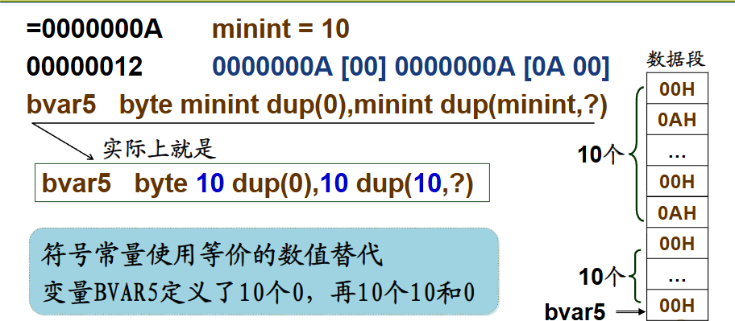
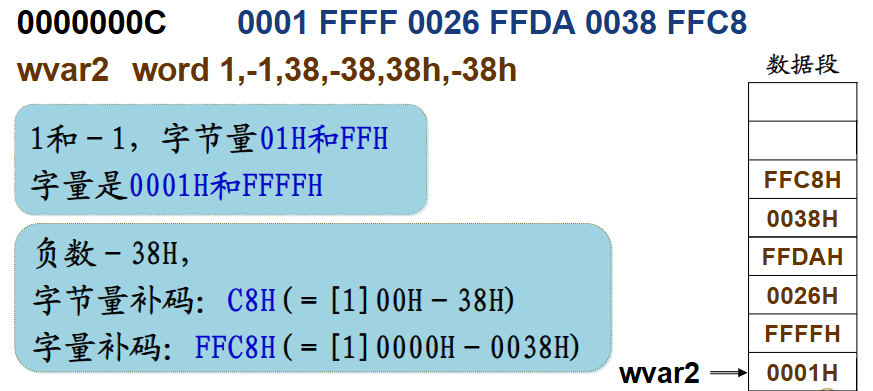
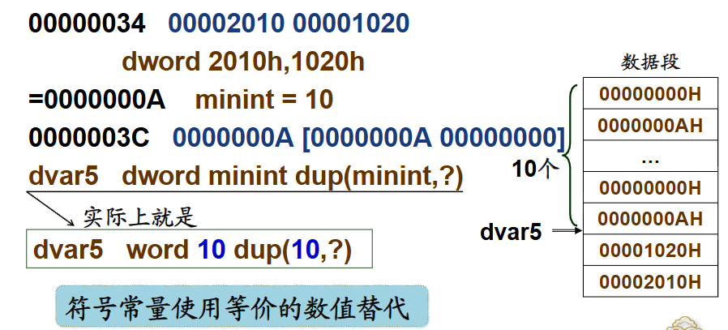

# 数据表示

## 常量表达

常量是程序使用的一个确定的数值，在汇编阶段就可以确定，直接编码于指令代码中，而不是保存在存储器中可变的变量

汇编语言支持多种常量的表达形式

### 常数

**多种进制的表达**:以后缀字母来区分（D，H，B分别对应10，16，2进制），10进制数可以不加，对于以字母A~F开头的十六进制常数，要加前导的0 以便于区分字母开头的标识符(`AH`是八位寄存器，`0Ah`是16进制数)

!!!Example
    
    |十进制数|100，255D|
    |-------|---------|
    |十六进制数|64H，0FFH|
    |二进制数|01101100b| 

### 字符和字符串
用`''`或者`""`括起来的多个字符 ，每个字符的数值是对应的ASCII码值

!!!Note
    单引号，双引号没有什么区别，字符和字符串也没有什么本质上的区别

### 符号常量

允许使用标识符来表达一个数值，在高级程序设计语言中，`=`用于变量的定义，而在汇编语言中`=`用来定义符号常量，例如

```ASM
Zero = 0 ;或者Zero equ 0 
```
的作用相当于C语言中

```C
#define Zero 0 
```
在接下来的程序里面`Zero`出现的位置都会被0替代

### 数值表达式

用运算符连结各种常量构成数据表达式，常用的算术运算符有加减乘除等，如果是地址表达式，那么只能加减，表示地址移动的若干的字节存储单元


## 变量定义

!!!info "什么是变量"
    随程序运行会发生变化的数据，保存在可读可写的主存空间中，变量的实质是主存单元的数据，因而可以改变，变量需要事先定义才能使用，变量具有属性，方便应用


**定义变量的格式**

一般格式为

```
变量名 变量定义伪指令  初值表
```

- 变量名：用户定义的标识符，需要满足定义标识符规则，表示首元素的逻辑地址，便于直接访问，**但是，没有变量名并不影响变量的定义**

- 伪指令助记符：例如 `byte`,`word`,`dword`,表示变量类型
  
- 初值表是用逗号分隔的一个或者多个参数，表示变量的初值（汇编中一个变量可以有多个变量值，类似于C语言中的数组）
     + 可以是各种形式的常量
     + 使用`?`来表示初值不确定，即未赋初值，一半会存储为0
     + 使用复制操作符`DUP`来表示多个同样的数值`重复次数 DUP(需要重复的参数)`


!!!Note "主要的变量定义伪指令"

    **BYTE**：字节类型，分配一个或者多个字节单元，每个数据是8位字节量，对应C语言中的`char`类型。

    **WORD**：字类型，分配一个或者多个字单元，每个数据是16位字量，对应C语言中的`short`类型。

    **DWORD**：双字类型，分配一个或者多个双字单元，每个数据是32位双字量对应C语言中的`long`类型。


### 8位变量的定义

可以定义：

- 8位的无符号整数（0~255）
- 8位补码表示的有符号整数-128~+127
- 一个字符（ASCII码值）
- 压缩BCD码0~99
- 非压缩BCD码0~9

???Example
    ```ASM
    bvar1 byte 0,128,255,-128,0,+127;对应机器指令为00 80无符号128） FF 80（有符号-128） 00 7F
    ```
    `bvar1`是首元素0的逻辑地址，要想访问下一个元素需要`bvar1+1`
    
    其数据段为

    ||
    |--|
    |7FH|
    |00H|
    |80H|
    |FFH|
    |80H|
    |00H(`bvar1`指向这里)|

     

### 16位和32位变量的定义

**16位**

- 16位无符号整数（0~65535）
- 16为补码表示的有符号整数（-32768~+32767）
- 16位段地址
- 16位偏移地址


**32位**

- 32位无符号整数$0 \sim 2^{32}-1$
- 32位补码表示的有符号整数$-2^{31} \sim 2^{31}-1$
- 32位逻辑地址

???Example
    ```ASM
    wvar1 word 0,32768,65535,-32768,0,+32767
    ```

    要想访问下一个元素，需要`wvar1+2`

    每一个元素都使用两个字节来表示
    


    ```ASM
    dvar1 dword 0,80000000h
    ```

    要想访问下一个元素，需要`dvar1+4`

    每一个元素，使用四个字节来表示
    


## 变量应用

###  多字节数据的存储顺序

最小的存储单位是bit，最常用的存储单位是字节（Byte），一个存储单元保存一个字节量数据，对应一个存储器地址。

**小端方式**（little Endian）

- 高字节数据保存在高地址存储单元
- 低字节数据保存在低地址存储单元

**大端方式**（Big Endian）

- 高字节数据保存在低地址存储单元
- 低字节数据保存在高地址存储单元


!!!info
    大端存储和小端存储两个名字来自《格列佛游记》关于如何打开一个鸡蛋的争论: How to open an egg,from the little end or the big end


80x86采用小段方式存储多字节数据

```ASM
bvar byte 39h,31h,32h,38h
wvar word 3139h,3832h
dvar dword 38323139h
```
三个变量在主存中的存放方式是一样的


对于`bvar`,由低到高依次存放四个字节的数据

|数据段|
|----|
|38H|
|32H|
|31H|
|39H|

`wvar`有两种方式存储

如果是大端存储

|数据段|
|----|
|32H|
|38H|
|31H|
|39H|

如果是小段存储

|数据段|
|----|
|38H|
|32H|
|31H|
|39H|

同理，`dvar`也有两种方式

!!!warning
    大端方式和小端方式存储都是合理的，不存在哪种方式更好，谁对谁错之分

### 变量的地址属性

定义后的变量名具有两类属性

- 地址属性：首个变量所在的存储单元的逻辑地址，包含 **段基地址** 和 **偏移地址**
- 类型属性：变量定义的数据单位


通过地址操作符可以获得变量的地址属性值

|||
|--|--|
|`[]`|括起的表达式作为存储器地址指针，整个相当于取括号里的地址的值|
|`$`|返回当前的偏移地址|
|`OFFSET` 变量名|返回变量名所在段的偏移地址|
|`SEG` 变量名 |返回段基地址（实地址存储模型）|


!!!Example
    ```ASM
    ;数据段
    bvar       byte 12h, 34h
               org $+10;bvar地址为00000000，当前地址为00000002H，相当于数据段的下一个变量从当前地址+10字节再开始
    array      word 1, 2, 3, 4, 5, 6, 7, 8, 9, 10
    wvar       word 5678h 
    arr_size   = $ - array ;计算出当前地址到array地址一共占有多少字节
    arr_len    = arr_size / 2;计算出一共有多少内存空间
    dvar       dword 9abcdef0h
    ;代码段
    mov al, bvar;相当于[bvar]取出第一个元素12H送到al
    mov ah, bvar + 1;取出第二个，类似于数组的操作
    mov bx, wvar[2];从wvar开始再+2，指向了dvar的最低字节F0，赋给了bx
    mov ecx, arr_len; 将arr_len所代表的长度11传给ecx
    mov edx, $ ; 将当前的（指令）地址传给edx，即代码段地址+偏移地址
    mov esi, offset dvar;将dvar的数据段地址传递给esi，即数据段地址+22H
    mov edi, [esi];将esi的值作为地址取出该地址的元素，即9abcdef0h
    mov ebp, dvar;9abcdef0h
    ```

### 变量的类型属性

变量的类型属性表示变量定义的数据单位，BYTE，WORD，DWORD对应的类型值为1，2，4；即其所占的字节数

**类型操作符**

-  ` 类型名 PTR  变量名`，将变量名按照指定的类型使用
-  `TYPE 变量名` 返回占用字节空间的字量数值
-  `LENGTHOF 变量名`:返回整个变量的数据项数
-  `SIZEOF 变量名`:返回整个变量所占用的字节数

!!!Example
     在上例中，若有`mov eax,dword ptr array`，则是将array当作双字类型访问，会把`00020001H`传递给eax