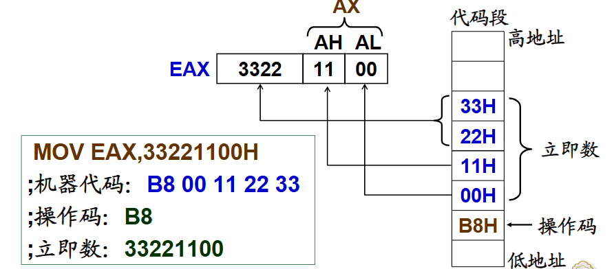

# 寻址方式

指令由操作码和操作数组成，操作码是处理器要执行哪种操作，用助记符表示；操作数是指令执行的参与者，是各种操作的对象，需要通过地址指示


需要通过地址访问数据或者指令

- 数据寻址：指令执行过程中，访问所需要操作的数据（操作数）
    + 立即数寻址：数据在指令代码中，用于常量表达
    + 寄存器寻址：数据在寄存器中，用寄存器名表示
    + 存储器寻址：数据在主存中，用存储器地址代表
    + I/O寻址：数据在外设（I/O设备）中，用I/O地址代表

- 指令寻址：一条指令执行后，确定执行的下一条指令的位置


## 立即数寻址

操作数紧跟操作码，是机器码的一部分

!!!Note
    操作数从指令代码中得到，即立即数（Immediate）


???Example "例"
    ```ASM
    MOV EAX,33221100H
    ;机器代码: B8 00 11 22 33
    ;操作码: B8
    ;立即数 ： 33221100
    ```
    机器码的排列方式说明是小端存储，`B8` 代表将一个数传递到EAX，`33221100H` 就是那个数
    


**各种立即数形式**

- 十六进制常数
- 字符(ASCII 码值)
- 十进制负数(补码)
- 符号常量
- 表达式
- 变量的偏移地址，标号的偏移地址，例如
```ASM
;数据段
bvar byte 01h
;代码段
labl: mov bx,-1
mov edi,labl;labl的偏移地址
mov ax,offset bvar;变量的偏移地址
```

!!!Note
    立即数本身没有类型，它的类型可以根据对应的寄存器或者变量类型决定


|符号|含义|
|----|---|
|i8|8位立即数|
|i16|16为立即数|
|i32|32位立即数|
|imm|立即数|