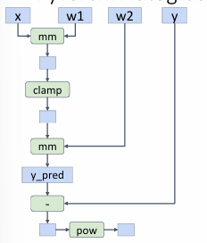

# Software in CV--PyTorch

## Autograd

在 PyTorch 中，`autograd` 是一个用于自动微分的包，它是 PyTorch 的核心特性之一。`autograd` 使得神经网络的反向传播变得非常简单，因为它能够自动计算张量的梯度。

### Autograd 的工作原理

1. **计算图**: `autograd` 通过记录张量上的所有操作来构建一个有向无环图（DAG），其中叶子节点是输入张量，根节点是输出张量。每个节点表示一个计算过程。

2. **反向传播**: 当调用 `.backward()` 方法时，`autograd` 会自动计算损失函数相对于每个叶子节点的梯度。梯度是通过链式法则计算的。

3. **梯度存储**: 计算得到的梯度会存储在调用 `.backward()` 的张量的 `.grad` 属性中。

### 使用 Autograd

以下是一个简单的例子，展示了如何使用 `autograd` 进行自动微分：

```python
import torch

# 创建一个张量，并设置 requires_grad=True 以便追踪其计算历史
x = torch.tensor([2.0, 3.0], requires_grad=True)

# 定义一个简单的函数 y = x1^2 + x2^3
y = x[0]**2 + x[1]**3

# 反向传播以计算梯度
y.backward()

# 输出梯度
print(x.grad)  # 输出: tensor([4., 27.])
```

在这个例子中，`x` 是一个具有两个元素的张量，并且我们希望计算 `y` 对 `x` 的梯度。通过调用 `y.backward()`，`autograd` 自动计算了 `y` 对 `x` 的偏导数，并将结果存储在 `x.grad` 中。


- **requires_grad**: 只有设置了 `requires_grad=True` 的张量会被 `autograd` 跟踪。默认情况下，所有创建的张量的 `requires_grad` 属性为 `False`。

- **梯度累积**: 每次调用 `.backward()` 时，梯度会累积到 `.grad` 属性中。因此，在每次反向传播之前，通常需要将梯度清零（`x.grad.zero_()`）。

- **不需要梯度的计算**: 在某些情况下（例如推理阶段），你可能不需要计算梯度。可以使用 `torch.no_grad()` 上下文管理器来临时禁用梯度计算，从而提高性能并节省内存。

```python
with torch.no_grad():
    # 进行不需要梯度的计算
    ...
```

!!!Example
    ```python
    import torch

    N, D_in, H, D_out = 64, 1000, 100, 10
    x = torch.randn(N, D_in)
    y = torch.randn(N, D_out)
    w1 = torch.randn(D_in, H, requires_grad=True)
    w2 = torch.randn(H, D_out, requires_grad=True)

    learning_rate = 1e-6
    for t in range(500):
        y_pred = x.mm(w1).clamp(min=0).mm(w2)
        loss = (y_pred - y).pow(2).sum()

        loss.backward()

        with torch.no_grad():
            w1 -= learning_rate * w1.grad
            w2 -= learning_rate * w2.grad
            w1.grad.zero_()
            w2.grad.zero_()
    ```

    在这段代码执行时，torch会自动构建如下的计算图

    <figure markdown="span">
        { width="70%" }
    </figure>
    
    并在反向传播时自动计算梯度
    
    在不需要构建计算图时，可以使用 `torch.no_grad()` 上下文管理器来临时禁用梯度计算，在这里，我们进行梯度下降时，不需要构建计算图，所以使用 `torch.no_grad()` 上下文管理器来临时禁用梯度计算，结束之后，在进入下一次的迭代之前，需要将梯度清零，所以使用 `w1.grad.zero_()` 和 `w2.grad.zero_()` 清零梯度。


### 自定义函数


在 PyTorch 中，可以通过继承 `torch.autograd.Function` 来定义新的自动求导算子，并实现 `forward` 和 `backward` 方法。以下是使用 sigmoid 函数的示例：

````python
import torch

class SigmoidFunction(torch.autograd.Function):
    @staticmethod
    def forward(ctx, input):
        # 计算 sigmoid 函数
        result = 1 / (1 + torch.exp(-input))
        # 保存结果以便在反向传播中使用
        ctx.save_for_backward(result)
        return result

    @staticmethod
    def backward(ctx, grad_output):
        # 获取保存的结果
        result, = ctx.saved_tensors
        # 计算 sigmoid 函数的梯度
        grad_input = grad_output * result * (1 - result)
        return grad_input

# 示例用法
x = torch.tensor([1.0, 2.0, 3.0], requires_grad=True)
sigmoid = SigmoidFunction.apply
y = sigmoid(x)
y.backward(torch.ones_like(x))

print(x.grad)  # 输出梯度
````
1. **继承 `Function`**:
   - 创建一个类 `SigmoidFunction`，继承自 `torch.autograd.Function`。

2. **Forward 方法**:
   - `forward` 方法计算函数的输出。它接收一个上下文 `ctx` 和输入张量。
   - 计算 sigmoid: \( \text{result} = \frac{1}{1 + e^{-\text{input}}} \)。
   - 使用 `ctx.save_for_backward(result)` 保存结果，以便在反向传播中使用。

3. **Backward 方法**:
   - `backward` 方法计算函数相对于输入的梯度。
   - 使用 `ctx.saved_tensors` 获取保存的结果。
   - 计算梯度: \( \text{grad\_input} = \text{grad\_output} \times \text{result} \times (1 - \text{result}) \)。

4. **用法**:
   - 使用 `SigmoidFunction.apply` 来应用自定义函数。
   - 使用 `y.backward()` 进行反向传播以计算梯度。

## Modules

在 PyTorch 中，`torch.nn` 模块提供了构建神经网络的基础组件。它包含了各种神经网络层、损失函数和其他工具，帮助你快速构建和训练深度学习模型。

```python
import torch
import torch.nn as nn
import torch.optim as optim

# 定义一个简单的全连接神经网络
class SimpleNet(nn.Module):
    def __init__(self):
        super(SimpleNet, self).__init__()
        self.fc1 = nn.Linear(10, 50)
        self.relu = nn.ReLU()
        self.fc2 = nn.Linear(50, 1)

    def forward(self, x):
        x = self.fc1(x)
        x = self.relu(x)
        x = self.fc2(x)
        return x

# 创建模型、定义损失函数和优化器
model = SimpleNet()
criterion = nn.MSELoss()
optimizer = optim.SGD(model.parameters(), lr=0.01)

# 示例输入和目标
input = torch.randn(5, 10)
target = torch.randn(5, 1)

# 前向传播
output = model(input)
loss = criterion(output, target)

# 反向传播和优化
optimizer.zero_grad()
loss.backward()
optimizer.step()
```

## Graphs

在深度学习框架中，计算图用于表示计算过程。PyTorch 和其他框架（如 TensorFlow）在计算图的构建上有不同的策略，主要分为动态计算图和静态计算图。

### 动态计算图（Dynamic Computation Graph）

- **特性**: 
  - 计算图在每次前向传播时动态构建。
  - 允许在运行时改变图的结构。
  - 更加灵活，适合处理变长输入和条件逻辑。

- **优点**:
  - 易于调试，因为可以使用标准的 Python 调试工具。
  - 代码更直观，与普通的 Python 代码相似。

- **缺点**:
  - 可能在某些情况下效率不如静态图，因为每次前向传播都需要重新构建图。


动态计算图允许在前向传播过程中使用常规的 Python 控制流。这意味着你可以在模型的前向传播中使用 Python 的条件语句、循环等控制结构，而不需要预先定义整个计算图。

你可以根据输入数据的不同，动态调整计算图的结构。例如，可以在前向传播中使用 `if` 语句来选择不同的计算路径。

```python
import torch

def dynamic_model(x, threshold):
    if x.sum() > threshold:
        return x * 2
    else:
        return x / 2

x = torch.tensor([1.0, 2.0, 3.0], requires_grad=True)
threshold = 5.0
y = dynamic_model(x, threshold)
y.backward(torch.ones_like(x))

print(x.grad)  # 输出梯度
```


在这个例子中，`dynamic_model` 使用了一个 `if` 语句来根据输入 `x` 的和是否大于 `threshold` 来选择不同的计算路径。这种灵活性是动态计算图的一个重要特性，使得模型可以根据不同的输入动态调整其行为。


### 静态计算图（Static Computation Graph）

- **特性**:
  - 计算图在编译时构建，并在训练过程中保持不变。
  - 需要在开始时定义整个模型的计算图。

- **优点**:
  - 可以进行全局优化，可能提高性能。
  - 适合在生产环境中部署，因为图是固定的。

- **缺点**:
  - 不易于调试，因为图在编译时构建。
  - 代码可能不如动态图直观，尤其是在处理变长输入时。


使用静态图的例子如下：

```python
import torch
def model(x, y, w1, w2a, w2b, prev_loss):
    w2 = w2a if prev_loss < 5.0 else w2b
    y_pred = x.mm(w1).clamp(min=0).mm(w2)
    loss = (y_pred - y).pow(2).sum()
    return loss
N, D_in, H, D_out = 64, 1000, 100, 10
x = torch.randn(N, D_in)
y = torch.randn(N, D_out)
w1 = torch.randn(D_in, H, requires_grad=True)
w2a = torch.randn(H, D_out, requires_grad=True)
w2b = torch.randn(H, D_out, requires_grad=True)

graph = torch.jit.script(model)#使用 torch.jit.script 将 model 函数转换为 TorchScript。

prev_loss = 5.0
learning_rate = 1e-6
for t in range(500):
    loss = graph(x, y, w1, w2a, w2b, prev_loss)
    prev_loss = loss.item()

    loss.backward()

    with torch.no_grad():
        w1 -= learning_rate * w1.grad
        w2a -= learning_rate * w2a.grad
        w2b -= learning_rate * w2b.grad
        w1.grad.zero_()
        w2a.grad.zero_()
        w2b.grad.zero_()
```


!!!Summary
    - **PyTorch**: 使用动态计算图，提供了更大的灵活性和易用性。
    - **TensorFlow**: 早期版本使用静态计算图，TensorFlow 2.x 引入了 Eager Execution，支持动态计算图动态计算图的灵活性使得 PyTorch 在研究和开发中非常受欢迎，而静态计算图的优化能力使得它在某些生产环境中更具优势。
