# Object Detection

## Introduction

物体检测：

- 分类问题：判断图片中是否存在某个物体
- 检测问题：判断图片中存在哪些物体，并给出它们的位置


Input: RGB image
Output: 

- Class
- Bounding box

<figure markdown="span">

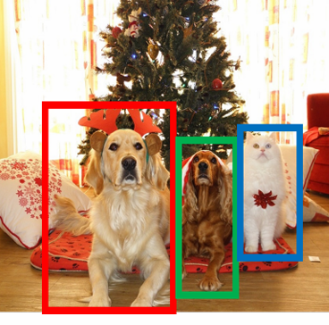

</figure>

与图像分类不同，物体检测需要输出多个物体的位置和类别。

- Multiple outputs
- Multiple types of output 

!!!info "Modal vs. Amodal boxes"
    一般的检测框只考虑物体在图片中的位置，而Amodal boxes则需要考虑整个物体在图片中的位置。

    <figure markdown="span">

    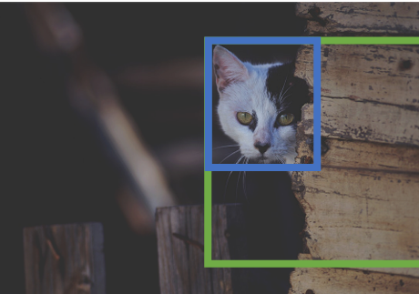

    </figure>

## IoU

IoU（Intersection over Union）是用于评估物体检测模型性能的重要指标。它用于衡量预测边界框与真实边界框之间的重叠程度。

\[
\text{IoU} = \frac{\text{Area of Overlap}}{\text{Area of Union}}
\]

- **Area of Overlap** ：预测框和真实框重叠部分的面积。
- **Area of Union** 预测框和真实框的总面积（即两个框的面积之和减去重叠部分的面积）。

IoU 的值介于 0 和 1 之间，值越接近 1 表示预测框与真实框的重叠程度越高。通常在物体检测任务中，会设定一个阈值（如 0.5）来判断预测是否为正确检测。


<figure markdown="span">

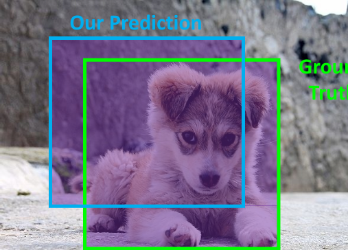

</figure>

一般而言，IoU 的阈值为 0.5 时，可以认为预测框与真实框的重叠程度较高。大于0.7时，已经是很好的检测了，大于0.9时，几乎可以认为预测框与真实框是相同的。


## Detecting

### Single object

<figure markdown="span">

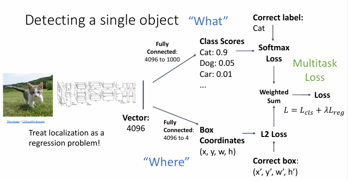
<figcaption>
Single object detection
</figcaption>
</figure>

首先输入图片到一个预训练的CNN模型(Tranfer Learning)，然后得到一个特征向量，将其通过两个神经网络分别得到分类结果和位置结果(一般是四个值,x,y,w,h,表示中心坐标和宽高)。将两个结果分别计算损失函数，然后相加，再加上正则化项，得到总的损失函数。

但是这样的问题是，如果图片中存在多个物体，那么每个图片需要预测的输出数量是不同的，这样就无法使用一个固定的神经网络来处理所有图片。


### Multiple objects

#### Sliding Window

在滑动窗口方法中，将 CNN 应用于图像的多个不同裁剪，CNN 将每个裁剪分类为物体或背景。

依次将裁剪后的部分输入到CNN模型中，然后得到分类结果和位置结果，并加上一个额外的类别作为背景。

<figure markdown="span">

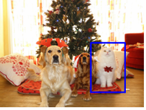

</figure>

- 考虑一个大小为 \(h \times w\) 的框：
  - 可能的 x 位置：\(W - w + 1\)
  - 可能的 y 位置：\(H - h + 1\)
  - 可能的位置总数：\((W - w + 1) \times (H - h + 1)\)


\[
\sum_{h=1}^{H} \sum_{w=1}^{W} (W - w + 1)(H - h + 1) = \frac{H(H + 1)W(W + 1)}{4}
\]

- 对于一个 \(800 \times 600\) 的图像，大约有 5800 万个框
- 无法评估所有这些框。

#### Region Proposals

Region Proposal 方法通过使用预训练的卷积神经网络（CNN）来生成候选区域，这些候选区域可能包含物体。

一般来说，Region Proposal 方法可以在CPU上运行；

然后真实框的生成是根据Region Proposal 方法生成的候选区域，然后通过IoU来判断是否为真实框。

<figure markdown="span">

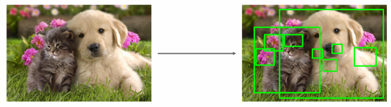

</figure>

### R-CNN

R-CNN（Region-based Convolutional Neural Network）是第一个基于Region Proposal的物体检测方法，由Ross Girshick等人于2014年提出。

R-CNN的工作流程包括以下步骤：

1. **区域提议（Region Proposal）**  ：使用选择性搜索（Selective Search）算法生成约2000个可能包含物体的候选区域。
   
- **特征提取**：对每个候选区域，将其裁剪并缩放到固定大小（如227×227），然后通过预训练的CNN（如AlexNet）提取特征。

- **分类**：对CNN提取的特征进行分类，确定每个区域属于哪一类物体或背景。

- **边界框回归**：使用回归器对边界框位置进行微调，使其更准确地包围物体。

<figure markdown="span">

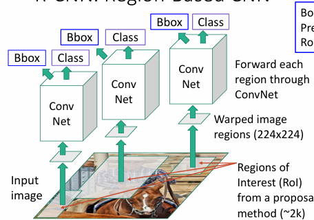
<figcaption>R-CNN架构</figcaption>
</figure>

在边界框回归(Box Regression)中,其过程一般是这样的:

首先对于一个候选区域(Region Proposal生成的)，假设其中心位置为 \( (p_x, p_y) \)，宽为 \( p_w \)，高为 \( p_h \)，其预测的中心位置为 \( (x, y) \)，宽为 \( w \)，高为 \( h \)。

假设回归时调整的四个参数为 \( (t_x, t_y, t_w, t_h) \)，那么其回归的公式为：

\[
    x' = p_x + t_x \cdot p_w
\]

\[
    y' = p_y + t_y \cdot p_h
\]

\[
    w' = p_w \cdot e^{t_w}
\]

\[
    h' = p_h \cdot e^{t_h}
\]


即对于中心位置，进行一个平移，对于宽高，进行一个缩放。

#### Categorize region proposals

在R-CNN训练过程中，需要对每个候选区域（Region Proposal）进行分类，确定它们是前景（包含目标物体）还是背景。这个分类过程基于候选区域与真实标注边界框（Ground Truth Box）之间的IoU值。

根据IoU值，候选区域被分为三类：

- **GT box** ：真实区域
- **正样本（Positive）** ：与某个真实标注框的IoU > 0.5的区域，一般来说这种样本可以确定物体
- **负样本（Negative）** ：与所有真实标注框的IoU < 0.3的区域，一般来说这种样本可以确定为背景
- **中性样本（Neutral）** ：IoU值在0.3到0.5之间的区域，一般来说这种样本可能是包含了物体的一部分，不太准确，但又不完全是背景。

<figure markdown="span">
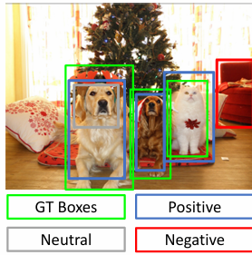
<figcaption>R-CNN中区域提议的分类</figcaption>
</figure>

在训练过程中，正样本用于学习特定类别的特征，负样本用于学习背景类别的特征，而中性样本通常在训练中被忽略，因为它们既不是很好的正样本也不是很好的负样本，可能会引入噪声。

对于每个正样本，R-CNN使用其对应的真实标注框类别作为训练标签；对于负样本，则将其标记为"背景"类别。这种分类策略有助于模型学习区分目标物体和背景，提高检测精度。


在测试过程中，分为以下三个步骤

- 生成候选区域
- 对于每个候选区域，使用RCNN模型得到分类的分数和位置的回归结果
- 调整分类阈值，得到最终的检测结果

但是有以下两个问题

- 预测的结果经常会出现重复的框
- 如何设置阈值？


#### NMS

非极大值抑制(Non-Maximum Suppression, NMS)是物体检测后处理的重要技术，用于解决检测算法可能产生的多个重叠边界框问题。

**问题**：物体检测器通常会为同一个物体生成多个重叠的检测框，尤其是当使用区域提议方法时。

**解决方案**：使用非极大值抑制对原始检测结果进行后处理，保留最可能的检测框，删除冗余的检测框。

NMS算法步骤：

1. 选择具有最高置信度分数的检测框
- 删除与该框IoU大于设定阈值(例如0.7)的所有低分框
- 如果还有检测框剩余，返回步骤1继续处理

<figure markdown="span">

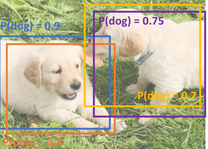
<figcaption>NMS示例</figcaption>
</figure>

在上图示例中，多个框检测到同一只狗，置信度分别为0.9、0.8、0.75和0.7。

首先对0.9的框进行NMS，删除与该框IoU大于0.7的所有低分框，即删除0.8的框，然后保留0.9的框。

然后对0.75的框进行NMS，删除与该框IoU大于0.7的所有低分框，即删除0.7的框，然后保留0.75的框。

没有剩下的框了，所以结束。

NMS是几乎所有现代物体检测系统的标准后处理步骤，它显著提高了检测的准确性和可视化结果的质量。

**R-CNN的缺点：**

- **速度慢**：需要对每个候选区域单独进行特征提取，计算量大。一张图像的处理时间约为47秒。
- **训练复杂**：分为多个阶段，需要分别训练CNN、SVM和边界框回归器。
- **存储需求大**：需要存储所有候选区域的特征。

尽管存在这些缺点，R-CNN作为深度学习在物体检测领域的早期应用，奠定了后续Fast R-CNN、Faster R-CNN等方法的基础。


### Evaluating Object Detectors

#### Mean Average Precision (mAP)

平均精度均值(Mean Average Precision, mAP)是评估物体检测模型性能最常用的指标。它综合考虑了模型的精确率(Precision)和召回率(Recall)。

!!!Note "计算mAP的步骤"
    - 在所有测试图像上运行物体检测器(应用NMS后)
    - 对于每个类别，计算平均精度(Average Precision, AP)：
        - AP = 精确率-召回率曲线下的面积
        - 具体计算过程：
            - 将该类别的所有检测结果按置信度分数从高到低排序
            - 依次处理每个检测结果：
            - 如果检测与某个真实边界框(GT box)的IoU > 0.5，则标记为正样本(TP)，并从考虑列表中移除该GT box
            - 否则标记为负样本(FP)
            - 根据累积的TP和FP，计算每个检测点的精确率和召回率
            - 绘制PR曲线并计算曲线下面积
        - 计算所有类别AP值的平均值，得到mAP

<figure markdown="span">
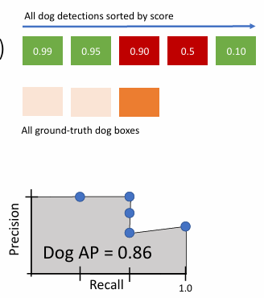
<figcaption>PR曲线和检测结果排序</figcaption>
</figure>

上面的例子中，其过程是这样的，首先，对于最高的0.99的框，其match了一个GT box，将这个GT box从考虑列表中移除，此时

- Precision = 1/1 = 1
- Recall = $\frac{1}{3}$

所以在图中第一个点为(1, $\frac{1}{3}$)

接下来，对于0.95的框，也match了一个GT box，将这个GT box从考虑列表中移除，此时

- Precision = $\frac{2}{2} = 1$
- Recall = $\frac{2}{3}$

所以在图中第二个点为(1, $\frac{2}{3}$)

对于0.90的框，其没有match任何GT box，所以此时

- Precision = $\frac{2}{3}$
- Recall = $\frac{2}{3}$

所以在图中第三个点为($\frac{2}{3}$, $\frac{2}{3}$)

对于0.5的框，其没有match任何GT box，所以此时

- Precision = $\frac{2}{4}$
- Recall = $\frac{2}{3}$

所以在图中第四个点为($\frac{2}{4}$, $\frac{2}{3}$)

最后一个点，对于0.1的框，其match最后的GT box，所以此时

- Precision = $\frac{3}{5}$
- Recall = $\frac{3}{3}$

所以在图中第五个点为($\frac{3}{5}$, $\frac{3}{3}$)

然后计算PR曲线下面积，即AP，为0.86


作为例子，上图显示"狗"类别的AP为0.86，表示该模型在检测狗方面有较好的性能。最终的mAP值将是所有类别AP值的平均。即例如APdog = 0.86, APcar = 0.75, APbike = 0.64, 那么mAP = $\frac{APdog + APcar + APbike}{3}$ = 0.75


**注意事项：**

- 要获得AP=1.0，模型必须检测到所有IoU>0.5的GT boxes，且不存在任何"假阳性"检测结果排在"真阳性"之，即若有n个GT box，那么模型需要检测到n个TP，且不存在任何FP排在TP之前。

- mAP可以在不同IoU阈值下计算，常见的有IoU=0.5(称为mAP@0.5)和IoU=0.5:0.95(多个IoU阈值的平均，如COCO数据集)

- 较高的mAP值表示检测器在精确率和召回率方面都有良好表现

## Object Detectors

### Fast R-CNN

Fast R-CNN是R-CNN的改进版本

Fast R-CNN的工作流程包括以下步骤：

1. **特征提取** ：整个输入图像通过"backbone"网络（如AlexNet、VGG、ResNet等）一次性提取特征，生成特征图
   
2. **区域提议** ：使用某种区域提议方法（如Selective Search）生成候选区域（RoIs）

3. **RoI池化** ：对每个候选区域在特征图上进行裁剪和调整大小操作

4. **特征分类与回归** ：将处理后的特征通过一个每区域网络(Per-Region Network)，最终输出每个区域的类别(Class)和边界框(Bbox)位置

<figure markdown="span">
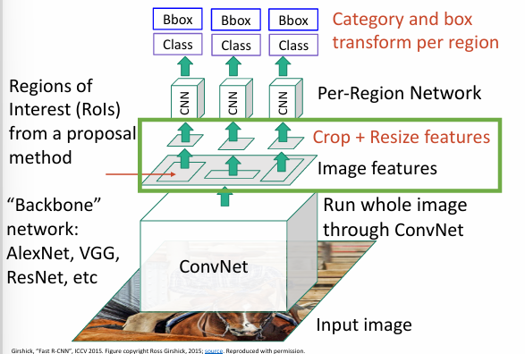 { width=70% }
<figcaption>Fast R-CNN架构</figcaption>
</figure>


#### RoI Pooling

<figure markdown="span">
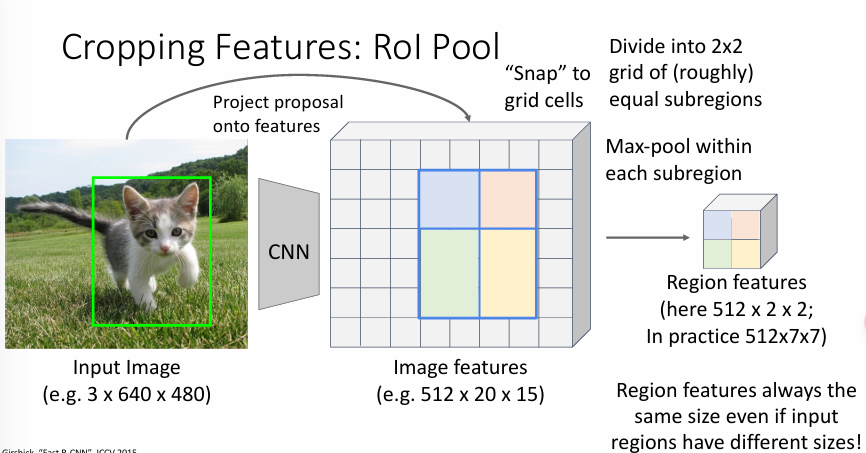
<figcaption>RoI Pooling</figcaption>
</figure>

这张图片展示了Fast R-CNN中的RoI Pool（区域兴趣池化）操作，这是Fast R-CNN的核心创新之一。

- 输入图像（Input Image），尺寸例如3×640×480，显示一只小猫的照片，绿色方框代表一个候选区域（Region Proposal）。

- 图像经过CNN backbone处理后得到的特征图（Image features），尺寸例如512×20×15（其中512是特征通道数）。

- 操作过程：将原始图像上的候选区域"Project proposal onto features"（投影到特征图上），即将输入图像上的区域映射到对应的特征图位置。

- 目标："Want features for the box of a fixed size"（想要获得固定大小的特征表示）：
    - 在这个例子中是2×2大小
    - 在实际应用中通常是7×7或14×14

RoI Pool的关键作用是：

- 将不同大小的候选区域统一转换为固定大小的特征表示
- 这样后续的全连接层就可以处理固定维度的输入
- 大大提高了计算效率，因为整个图像只需要通过CNN一次

这种操作解决了R-CNN中每个区域都需要单独通过CNN的低效问题，是Fast R-CNN速度快的关键原因之一。

#### ROI Align

RoI Align是对RoI Pool的改进版本，主要解决了RoI Pool中的量化误差问题。

1. **无四舍五入操作**：No snapping!，意味着RoI Align不像RoI Pool那样对区域坐标进行四舍五入，而是保留精确的浮点数位置。

2. **双线性插值采样**：在每个子区域中使用规则间隔的采样点，通过双线性插值(bilinear interpolation)来计算这些点的特征值,而不必进行四舍五入。

3. **更精确的特征提取**：图中右侧展示了如何计算一个采样点(x,y)的特征值：
   - 找到该点周围的四个网格单元(如f6,5、f7,5、f6,6、f7,6)
   - 根据距离计算权重，进行加权平均
   - 例如：f6.5,5.8 = (f6,5 * 0.5 * 0.2) + (f7,5 * 0.5 * 0.2) + (f6,6 * 0.5 * 0.8) + (f7,6 * 0.5 * 0.8)

<figure markdown="span">
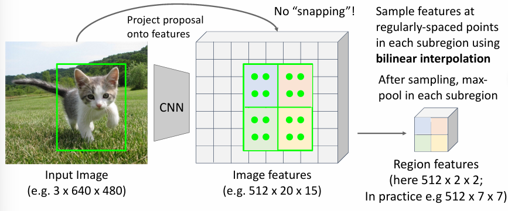{ width='400' }
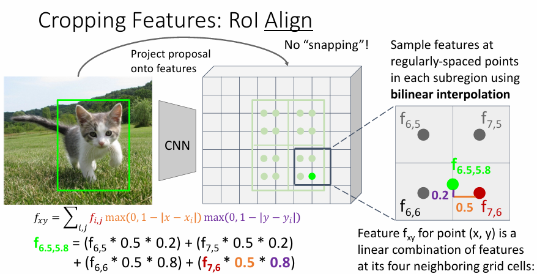{ width='400' }
</figure>


- **避免了量化误差**：不再强制将浮点坐标四舍五入到整数位置
- **保留了更多空间信息**：通过插值计算特征值，而不是直接max pooling
- **提高了检测精度**：特别是对小物体和需要精确定位的任务效果明显


???Example 
    当我们有一个特征图和一个感兴趣区域(RoI)时，需要从特征图中提取该区域的特征，并将其转换为固定大小（例如7×7）。

    第1步：映射RoI到特征图
    
    - 假设原始图像中有一个物体边界框（例如左上角坐标为(20,30)，右下角为(180,240)）
    - 由于图像经过CNN后特征图变小了（比如缩小了16倍），这个边界框在特征图上的坐标变为：(1.25, 1.875)到(11.25, 15)
    - **注意** : RoI Pool会将这些坐标四舍五入为整数，而RoI Align保留精确的浮点数坐标

    第2步：将RoI划分为固定数量的子区域
    
    - 假设我们要得到7×7大小的特征表示
    - 则将RoI在特征图上对应的区域均匀分成7×7=49个小格子
    - 每个小格子在特征图上可能不是整数大小（例如宽1.428，高1.875）

    第3步：在每个子区域内放置采样点
    
    - 在每个小格子内部放置一组规则间隔的采样点（通常是2×2或3×3个点）
    - 例如：一个小格子内放置4个采样点，它们的位置也是精确的浮点数坐标

    第4步：对每个采样点进行双线性插值
    
    - 每个采样点的坐标通常落在特征图的"像素网格"之间
    - 找出该采样点周围的4个特征图像素（如上图中的f6,5, f7,5, f6,6, f7,6）
    - 根据采样点到这4个像素的距离计算权重
    - 用这些权重对4个像素的特征值进行加权平均

    举个具体例子：
    
    - 采样点坐标为(6.5, 5.8)
    - 它周围的4个特征图像素坐标为(6,5), (7,5), (6,6), (7,6)
    - 计算水平和垂直方向的权重：
    - 水平距离：|6.5-6|=0.5和|6.5-7|=0.5
    - 垂直距离：|5.8-5|=0.8和|5.8-6|=0.2
    - 最终特征值计算：

    - f6.5,5.8 = (f6,5×0.5×0.2) + (f7,5×0.5×0.2) + (f6,6×0.5×0.8) + (f7,6×0.5×0.8)

    第5步：聚合采样点特征
    
    - 计算完每个小格子内所有采样点的特征值后
    - 对这些采样点进行聚合（通常是取平均值或最大值）
    - 得到该小格子的最终特征值

    第6步：生成最终特征表示
    
    - 49个小格子分别得到一个特征值
    - 组合起来形成7×7大小的特征表示
    - 这个固定大小的特征表示会传递给后续网络进行分类、回归等任务

    RoI Align的核心创新就是在第4步，通过精确计算保留了更多的空间信息，避免了RoI Pool中的量化误差。

### Faster R-CNN

有了Fast R-CNN后，限制时间的主要因素就在于Region Proposal，所以Faster R-CNN的提出就是为了解决这个问题。

<figure markdown="span">
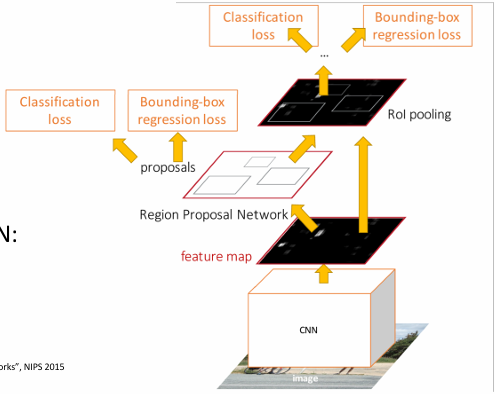
<figcaption>Faster R-CNN架构</figcaption>
</figure>

其创新点在于插入了一个RPN(Region Proposal Network)，用于生成Region Proposal。

- 输入图像首先通过CNN骨干网络(如VGG、ResNet)进行处理
- 生成特征图(feature map)，包含了图像的高级特征表示


- 特征图被送入区域提议网络(RPN)
- RPN是一个小型的卷积神经网络，直接在特征图上滑动窗口
- 对于特征图上的每个位置，RPN预测：

    - 是否包含物体(二分类：前景/背景)
    - 多个不同尺寸和比例的边界框(称为"锚点框"，anchors)
    - 每个边界框的调整量(位置微调)

- 应用非极大值抑制(NMS)筛选出最佳的区域提议


- 将RPN生成的区域提议映射回特征图上
- 使用RoI Pooling(或改进版RoI Align)将不同大小的区域转换为固定大小的特征表示

- 这些固定大小的RoI特征通过两个并行的全连接层网络：
    - 分类网络：预测每个区域的物体类别(Classification loss)
    - 回归网络：进一步精细调整边界框位置(Bounding-box regression loss)

- 应用NMS去除重复检测
- 生成最终的检测结果：物体类别和精确边界框

与Fast R-CNN相比，Faster R-CNN将整个检测流程变成了一个完全可学习的端到端系统，大幅提高了检测速度和准确性。


#### RPN

<figure markdown="span">
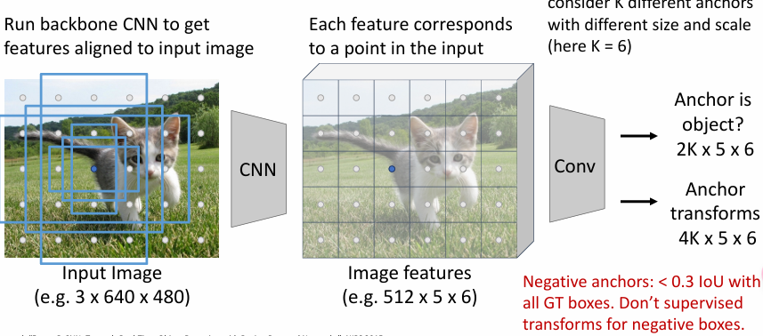
<figcaption>RPN的工作流程</figcaption>
</figure>

RPN的工作流程如下：

1. 特征提取
    - 输入图像（例如3×640×480大小的猫咪图片）首先通过骨干CNN网络处理
    - 生成与输入图像对齐的特征图（例如512×5×6，其中512是特征通道数）
    - 特征图上的每个点对应原始输入图像上的一个区域

2. 锚点机制
    - 在特征图的每个位置上，生成多个预定义的边界框，称为"锚点"(anchors),在特征图上是一个点，对应到原图上感受野的中心点，然后生成多个不同尺寸和比例的边界框
    - 这些锚点有不同的尺寸和比例，以适应不同大小的物体
    - 图中没有直接显示，但通常每个位置会有k个锚点（比如k=9，3种尺寸×3种比例）

3. 锚点二分类
    - 使用卷积层对特征图进行处理（512个输入通道，2个输出通道）
    - 对每个锚点进行二分类：
    - 正样本（绿色）：可能包含物体的锚点
    - 负样本（红色）：不包含物体的锚点
    - 输出维度为2×5×6×k（k为每个位置的锚点数）

4. 锚点位置调整
    - 虽然图中没有明确显示，但RPN还包括一个边界框回归部分：
    - 对于每个锚点，预测位置调整量（中心点坐标x、y和宽高w、h的调整值）
    - 这部分通常是另一个卷积层，输出维度为4×5×6×k（每个锚点4个回归值）

在训练过程中，还需要根据生成的锚点框分类成

- Positive: 与GT box的IoU>0.7，这样锚点框与GT box的IOU越大，表示越可能包含物体
- Negative: 与GT box的IoU<0.3，这样锚点框与GT box的IOU越小，表示越不可能包含物体
- 中性样本（Neutral）：IoU在0.3到0.7之间的锚点框，通常在训练中被忽略

对于正样本锚点框，网络会同时学习分类（前景/背景）和边界框回归（位置调整）。
而对于负样本锚点框，网络只学习分类任务（将其识别为背景），不监督其位置变换，因为这些区域不包含需要精确定位的物体。


### Dealing with Scale

我们需处理不同尺度的物体，如何增加detector的尺度不变性呢？

#### Image Pyramid

图像金字塔(Image Pyramid)是处理不同尺度物体检测的经典方法。其基本思想是：

- 将输入图像调整为多个不同尺度（大小）的版本，形成一个"金字塔"
- 对每个尺度的图像独立运行物体检测器
- 合并来自不同尺度的检测结果

<figure markdown="span">

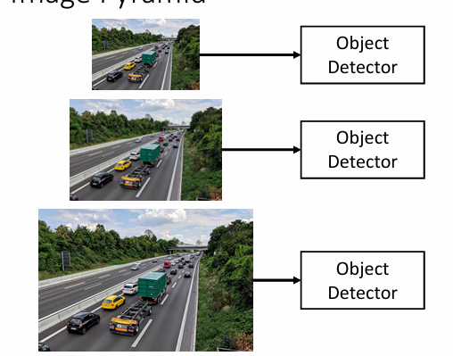

</figure>

这种方法的主要优点是：

- 简单直观，容易实现
- 可以检测到不同大小的物体，特别是非常小的物体
- 与任何物体检测算法兼容

然而，图像金字塔也存在明显的缺点：

- 计算成本高昂：需要对每个尺度的图像独立运行完整的检测流程
- 不同尺度之间没有共享计算，导致大量冗余计算
- 内存消耗大：需要存储多个尺度的图像和中间特征
- 推理速度慢：处理时间与金字塔层数成正比

这些缺点限制了图像金字塔在需要实时性能的应用中的使用，尤其是在计算资源有限的设备上。

#### Multi-Scale Features

多尺度特征(Multi-Scale Features)是解决不同尺度物体检测的另一种方法，利用CNN网络内部不同层级的特征图进行检测。

基本思想是：

- CNN网络有多个阶段(stages)，每个阶段的特征图分辨率不同
- 较浅层(early stages)的特征图分辨率高，包含更多空间细节，适合检测小物体
- 较深层(later stages)的特征图分辨率低，但包含更抽象的语义信息，适合检测大物体
- 在多个不同分辨率的特征图上分别进行物体检测

<figure markdown="span">

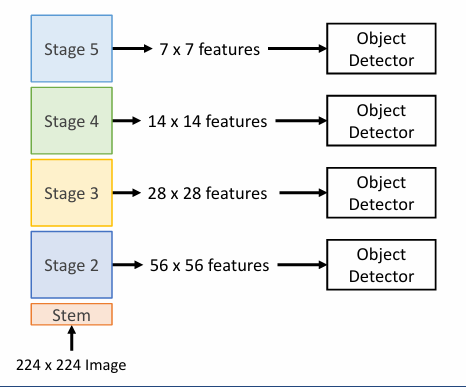

</figure>

如图所示，一个典型的多尺度特征检测系统包括：

- 输入图像(例如224×224大小)经过CNN网络的几个阶段处理
- 从不同阶段提取特征图：
  - Stage 2：产生56×56大小的特征图
  - Stage 3：产生28×28大小的特征图
  - Stage 4：产生14×14大小的特征图
  - Stage 5：产生7×7大小的特征图
- 对每个特征图使用独立的物体检测器

这种方法的主要优点：

- 计算效率高：只需要处理一次输入图像
- 特征复用：不同尺度的检测共享早期计算结果
- 适应性强：可以处理不同尺度的物体

但也存在一些问题：

- 检测器问题：在早期特征上的检测器无法利用整个backbone网络，无法访问高层次的语义特征
- 特征不平衡：不同层级的特征具有不同的语义信息和分辨率，可能导致检测性能不一致

为了解决这些问题，研究人员提出了特征金字塔网络(Feature Pyramid Network, FPN)等改进方法，通过自顶向下的路径和横向连接，将高层次语义信息融合到所有尺度的特征图中。

#### Feature Pyramid Network

特征金字塔网络(Feature Pyramid Network, FPN)是解决多尺度物体检测问题的另一种方法，通过自顶向下的路径和横向连接，将高层次语义信息融合到所有尺度的特征图中。

<figure markdown="span">
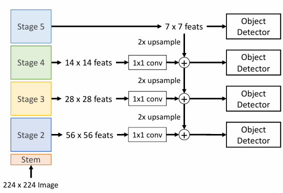
<figcaption>特征金字塔网络架构</figcaption>
</figure>

FPN的设计理念是结合了图像金字塔和多尺度特征的优点，同时克服了它们的缺点。主要组成部分包括：

1. **自底向上路径(Bottom-up Pathway)**
      - 这就是CNN骨干网络的前向传播
      - 从输入图像开始，通过卷积、池化等操作逐渐减小特征图尺寸
      - 生成不同分辨率的特征图(如上图中C2、C3、C4、C5)

2. **自顶向下路径(Top-down Pathway)**
      - 从最高层(最小分辨率)的特征图开始
      - 通过上采样(通常是2倍放大)将特征图的空间尺寸逐步恢复
      - 生成与自底向上路径相同分辨率的特征图(P5、P4、P3、P2)

3. **横向连接(Lateral Connections)**
   - 将自底向上路径的特征图与上采样的特征图相连接
   - 通过1×1卷积调整通道数，使其匹配
   - 通过元素级加法融合两种特征，结合了高层语义信息和低层空间细节

FPN的主要优势：

- **丰富的特征表示**：每个尺度的特征图都包含了高级语义信息和适当的空间细节
- **计算效率**：只需要处理一次输入图像，比图像金字塔高效得多
- **检测性能**：各尺度的物体检测性能更一致，小物体的检测精度显著提升
- **通用性**：可以与多种物体检测框架(如Faster R-CNN、RetinaNet等)结合使用

在实际应用中，通常在P2-P5这四个特征图上分别运行RPN和检测器，然后合并结果。相比于单一尺度的特征图，FPN显著提高了物体检测的准确率，特别是对于小物体的检测。

### Single-Stage Detectors

上述介绍的R-CNN系列方法都是双阶段检测器，需要先生成候选区域，再进行分类和位置回归。而单阶段检测器则直接在图像上进行检测，跳过了区域提议这一步骤。

#### YOLO (You Only Look Once)

YOLO是一种快速、准确的单阶段物体检测算法，由Joseph Redmon等人于2016年提出。其核心思想是将物体检测视为一个直接从图像像素到边界框坐标和类别概率的回归问题。


1. **网格划分**：

   - 将输入图像划分为S×S个网格
   - 在原始YOLO中，通常S=7，即7×7=49个网格

2. **预测**：对于每个网格，预测：
  
   - B个边界框(每个框包含5个值：x, y, w, h, confidence)
   - C个类别的条件概率
   - 每个网格的输出维度为B×5+C

3. **置信度评分**：
  
   - 每个边界框有一个置信度分数：Pr(Object)×IoU
   - Pr(Object)：表示框中是否包含物体
   - IoU：如果包含物体，表示预测框与真实框的重叠程度

4. **后处理**：
  
   - 过滤低置信度的预测框
   - 应用非极大值抑制(NMS)去除重复检测
   - 输出最终的检测结果

YOLO的主要优点：

- **速度快**：在强大的GPU上可以达到45-155 FPS的实时性能
- **全局推理**：在预测时考虑整个图像的上下文，减少了背景错误
- **可泛化能力强**：学到的表示更具泛化性，在新领域或不常见情景中表现更好
- **端到端训练**：可以直接优化检测性能

缺点：

- **空间约束**：由于每个网格只能预测有限数量的边界框，对于密集物体的检测性能有限
- **小物体检测性能较弱**：特别是当多个小物体聚集在一个网格内时
- **分类精度略低于双阶段检测器**：在某些基准测试上

YOLO后来有多个改进版本，包括YOLOv2、YOLOv3、YOLOv4等，不断提升了检测精度和速度.


## Image Segmentation

图像分割(Image Segmentation)是计算机视觉领域的一个重要任务，旨在将图像中的每个像素分类为不同的语义类别，如物体、背景等。

### Semantic Segmentation

语义分割(Semantic Segmentation)是图像分割的一种形式，旨在将图像中的每个像素分类为不同的语义类别，如物体、背景等。

<figure markdown="span">
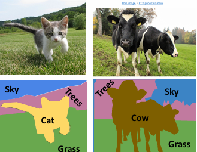
<figcaption>语义分割</figcaption>
</figure>

但是这个并不区分每种类别的具体个数；

#### Sliding Window

<figure markdown="span">
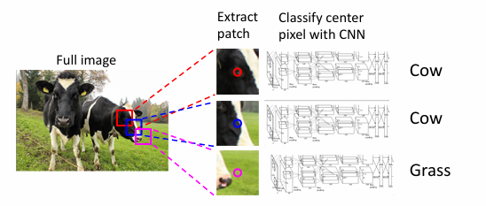
<figcaption>Sliding Window</figcaption>
</figure>

仍然可以通过滑动窗口的方式，来检测每个像素的类别，但是这样会存在大量的冗余计算

#### Convolutional Neural Network

<figure markdown="span">
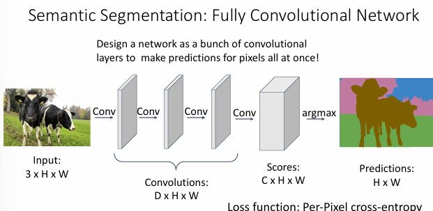
<figcaption>Convolutional Neural Network</figcaption>
</figure>

全卷积网络(Fully Convolutional Network, FCN)是一种端到端的语义分割方法，它可以一次性对整张图片进行像素级的分类预测。

**网络结构**：

1. **输入层**：
   
    - 输入是一张 3×H×W 的图片（3个颜色通道，高度H，宽度W）

2. **卷积层**：
    - 包含多个连续的卷积层
    - 每层输出特征图大小为 D×H×W（D是特征通道数）

3. **输出层**：
    - 最后通过argmax得到每个像素的类别预测
    - 输出大小为 H×W，每个位置的值表示对应像素的类别

**工作原理**：

- 网络完全由卷积层组成，没有全连接层
- 保持空间信息，实现像素级的预测
- 对整张图片一次性进行预测，而不是逐像素滑动窗口
- 最终输出与输入图像具有相同的空间尺寸

**损失函数**：

- 使用逐像素的交叉熵损失（Per-Pixel cross-entropy）
- 每个像素位置都有一个分类任务
- 将所有像素位置的损失加总得到总体损失

这种方法相比传统的滑动窗口方法更加高效，因为它可以一次性对整张图片进行预测，而不需要重复计算重叠区域。同时，由于网络是全卷积的，它可以自然地保持图像的空间信息，这对于语义分割任务来说是非常重要的。

但是也有缺点：

**1. 感受野问题**：

- 有效感受野的大小与卷积层数呈线性关系
- 使用L个3×3的卷积层，感受野大小为1+2L
- 需要很多层才能获得较大的感受野，从而捕获更大范围的上下文信息

**2. 高分辨率图像的计算开销**：

- 对高分辨率图像进行卷积运算的计算成本很高
- ResNet等网络通常会积极地进行下采样以减少计算量
- 但这可能导致空间细节信息的丢失

#### Downsampling and Upsampling

为了解决上述问题，我们可以使用下采样(Downsampling)和上采样(Upsampling)来解决：

<figure markdown="span">
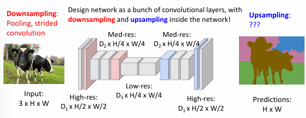
<figcaption>Downsampling and Upsampling</figcaption>
</figure>

**网络结构设计**：

下采样阶段：

- 输入：3×H×W的原始图像
- 通过池化或步长卷积进行下采样
- 逐步减小特征图的空间尺寸：
- High-res: $D_1×H/2×W/2$
- Med-res: $D_2×H/4×W/4$
- Low-res: $D_3×H/4×W/4$

上采样阶段：

- 从低分辨率特征图开始
- 通过上采样操作逐步恢复空间分辨率
- 最终输出H×W大小的预测图

**优势**：

- 下采样减少了特征图的空间维度，显著降低计算量
- 在较低分辨率下进行主要的特征处理
- 下采样使得网络能够用较少的层数获得更大的感受野
- 有助于捕获更大范围的上下文信息
- 网络同时具有高分辨率的细节信息和低分辨率的语义信息
- 通过上采样过程将不同尺度的信息进行融合

下采样可以通过池化层或步长卷积来实现

上采样主要有两种方法

#### Unpooling

<figure markdown="span">
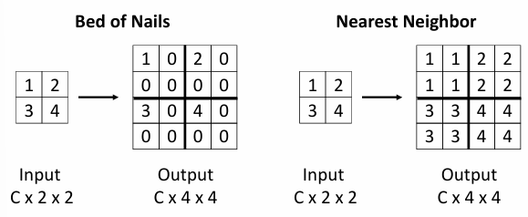
<figcaption>Unpooling</figcaption>
</figure>

Bed of Nails方法，将周围值设置为0即可；

Nearest Neighbor方法，将周围值设置为最近的一个值；

#### Bilinear Interpolation

<figure markdown="span">
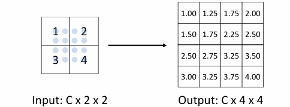
<figcaption>Bilinear Interpolation</figcaption>
</figure>

- 对于输出特征图中的每个位置(x,y)
- 找到输入特征图中最近的四个点
- 基于相对距离计算权重
- 使用这些权重对四个点的值进行加权平均

相比Bed of Nails和Nearest Neighbor方法，双线性插值能够产生更平滑的上采样结果，这对于语义分割等需要精细空间信息的任务特别重要。

#### Bicubic Interpolation

<figure markdown="span">
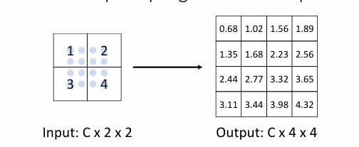
<figcaption>Bicubic Interpolation</figcaption>
</figure>   

双三次插值是一种更高级的插值方法，它使用x和y方向上最近的三个邻居来构建三次近似。这是图像处理中最常用的调整大小方法。


- 在x和y方向上分别使用三个最近的邻居点
- 构建三次多项式函数进行插值
- 考虑更大范围的像素信息来生成新值

这种方法虽然计算量较大，但在图像处理和计算机视觉任务中经常被使用，因为它能够提供更高质量的插值结果。


#### Max Unpooling

<figure markdown="span">
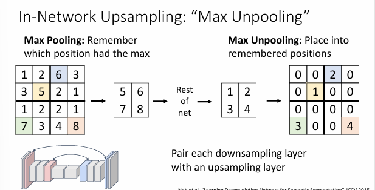
<figcaption>Max Unpooling</figcaption>
</figure>

Max Unpooling是一种特殊的上采样方法，它与Max Pooling（最大池化）操作相对应。这种方法的特点是需要在下采样时记住最大值的位置，然后在上采样时将值放回原来的位置。

**Max Pooling阶段**：

- 对输入特征图进行最大池化操作
- 记录每个池化窗口中最大值的位置（switch variables）
- 如图所示，4×4的输入经过池化后变为2×2
- 同时保存了最大值的具体位置信息

**Max Unpooling阶段**：

- 使用保存的位置信息（switch variables）
- 将池化后的值放回原来的位置
- 其他位置填充为0
- 如图所示，2×2的特征图被还原为4×4

输入特征图中值5被选为最大值，位置信息被记录，在反池化时，值5被放回原来的确切位置，未被选为最大值的位置填充为0，这样保证了重要特征的精确位置信息不会丢失

这样的方法，保留了精确的空间位置信息，特征的定位更加准确，适合需要精确重建的任务，与最大池化层自然配对

#### Transposed Convolution

<figure markdown="span">
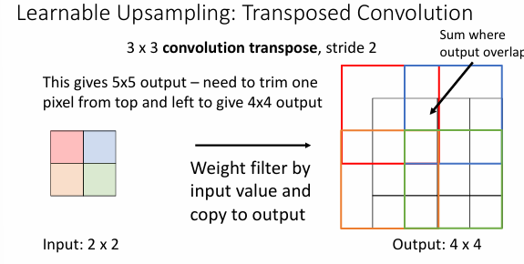
<figcaption>Transposed Convolution</figcaption>
</figure>

转置卷积(Transposed Convolution)，也称为反卷积(Deconvolution)，是一种用于上采样的卷积操作。

其基本过程如下：

例如，输入是2×2的特征图，卷积核是3×3，步幅为2，填充为0，输出是4×4的特征图。

将输入特征图对应位置的值与卷积核相乘，得到一个3×3的特征图，然后将其中心点作为输出图的第一个位置，然后依次进行，每次前进的步幅为2，对于重叠的部分，取相加；

!!!Example
    <figure markdown="span">
    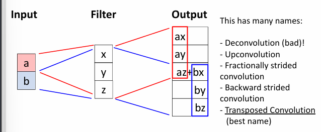
    <figcaption>Example</figcaption>
    </figure>

    首先，将a与卷积核相乘，得到第一部分，将b与卷积核相乘，得到第二部分，两部分放到对应的位置上，然后重叠的部分进行相加；


!!!info "Transposed Convolution"
    为什么叫做转置卷积呢？

    我们可以将卷积操作表示为矩阵乘法：

    1. **普通卷积**：

       - 可以表示为 \(\vec{x} * \vec{a} = X\vec{a}\)
       - a是输入，X是卷积核
       - 例如，当步长为1时：
        
         ```
         [x y z 0 0 0][a]   [ay + bz    ]
         [0 x y z 0 0][b] = [ax + by + cz]
         [0 0 x y z 0][c]   [bx + cy + dz]
         [0 0 0 x y z][d]   [cx + dy    ]
         ```

    2. **转置卷积**：

       - 表示为 \(\vec{x} *^T \vec{a} = X^T\vec{a}\)
       - 使用了原卷积矩阵的转置
       - 当步长为1时，就是普通卷积（但padding规则不同）
       例如上面的转置卷积为
       ```
       [x 0 0 0]
       [y x 0 0][a]
       [z y x 0][b]
       [0 z y x][c]
       [0 0 z y][d]
       [0 0 0 z]
       ```
    当步长大于1时，就不能使用普通的卷积来表示它了

    <figure markdown="span">
    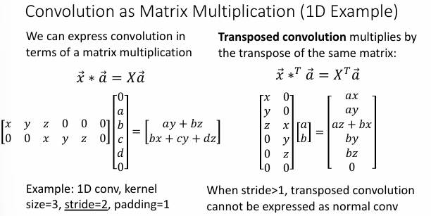{ width='500' }
    <figcaption>Example</figcaption>
    </figure>


#### Things and stuff

- Things: 物体，有明确的边界，例如人、车、动物等
- Stuff: 背景，没有明确的边界，例如天空、草地、墙壁等

在object detection中，我们通常需要区分things和stuff，但是只会把box给到things而不是stuff；

在semantic segmentation中，我们通常需要区分things和stuff，同时关注这两个部分；


### Instance Segmentation

实例分割(Instance Segmentation)是图像分割的一种形式，旨在将图像中的每个像素分类为不同的语义类别，如物体、背景等。

<figure markdown="span">
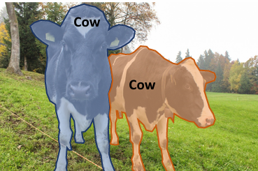
<figcaption>Instance Segmentation</figcaption>
</figure>


#### Mask R-CNN

Mask R-CNN是在Faster R-CNN的基础上扩展出来的实例分割模型，它不仅可以检测出物体的位置和类别，还能生成每个物体的像素级掩码（mask）。

即在最后会输出：

- **分类分支**：预测物体类别（Classification Scores: C）
- **边界框分支**：预测边界框坐标（Box coordinates per class: 4×C）
- **掩码分支**：为每个类别预测二值掩码（Mask Prediction: C×28×28）

<figure markdown="span">
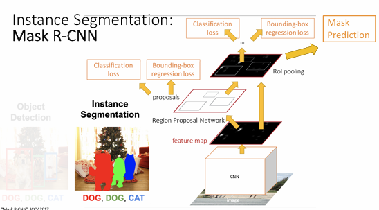
<figcaption>Mask R-CNN架构示意图</figcaption>
</figure>

其工作流程如下

<figure markdown="span">
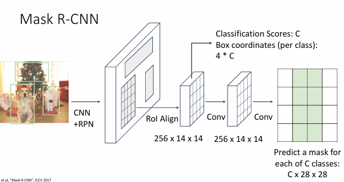
<figcaption>Mask R-CNN工作流程</figcaption>
</figure>

即再输出了box和class之后，还会输出mask，共有C个通道，每个通道对应一个物体的mask，每个mask的大小为H×W，即与原图的大小相同；即在某个像素中，如果属于物体A的通道的值比较高，那么这个像素被归于物体A；


