# Recurrent Neural Networks


Recurrent Neural Networks (RNNs) 循环神经网络是一种特殊的神经网络，它能够处理序列数据。对于一般的前馈神经网络，输入和输出是one-to-one的关系，而对于RNNs，输入和输出可以是one-to-many, many-to-one, many-to-many的关系。

<figure markdown="span">
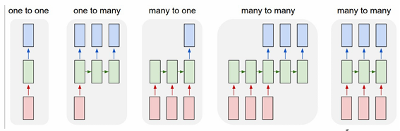{ width=70%" }
</figure>

## Structure of RNNs

>Key idea: RNNs have an “internal state” that is updated as a sequence is processed

<figure markdown="span">
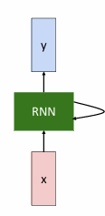{ width=70%" }
</figure>

\[
    h_t=f_W(h_{t-1},x_t)
\]

其中，$h_t$ 是RNN的下一时刻的隐藏状态，$x_t$ 是输入，$f_W$是激活函数。例如tanh函数。当然一般也会包含偏置项$b_h$。

例如

\[
  h_t=tanh(W_{hh}h_{t-1}+W_{xh}x_t+b_h)
\]

### Computation Graph

<figure markdown="span">
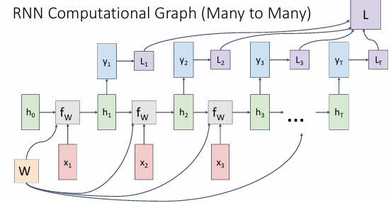{ width=70%" }
<figcaption>
    many-to-many
</figcaption>
</figure>

对于多对多的情况，例如语言预测模型，每一个输出都依赖当前的输入和前一个隐藏状态。得到输出之后，再计算损失，最后每个输出的损失结合在一起，得到总的损失。

<figure markdown="span">
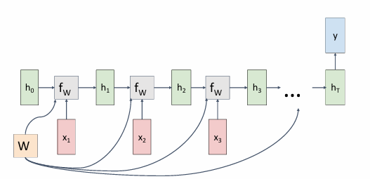{ width=70%" }
<figcaption>
    many-to-one
</figcaption>
</figure>

对于多对一的情况(例如情感分析，输入一个句子，输出一个情感标签。)输出只在最后一个阶段产生。

<figure markdown="span">
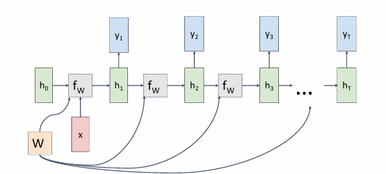{ width=70%" }
<figcaption>
    one-to-many
</figcaption>
</figure>

对于一对多的情况(例如图像描述，输入是一张图片，输出是描述这个图片的句子。)输入只在第一个阶段，每一个输出依赖于前一个隐藏状态。

<figure markdown="span">
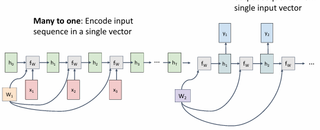{ width=70%" }
<figcaption>
    sequence-to-sequence
</figcaption>
</figure>

对于序列到序列的情况(例如机器翻译，输入是一个句子，输出是另一个句子。)会分为两个部分，一个编码器，一个解码器。

编码器是一个many-to-one的RNN，解码器是一个one-to-many的RNN。

编码器的输出作为解码器的隐藏状态的初始值。

!!! Warning
    每一个RNN内部的$W_{hh}$和$W_{xh}$是共享的。


!!!Example "Language Modeling"
    Given characters 1, 2, …, t-1, model predicts character t;
    例如现在字典有[h,e,l,o],使用字符串"Hello"训练一个语言模型来预测下一个字符；
    <figure markdown="span">
    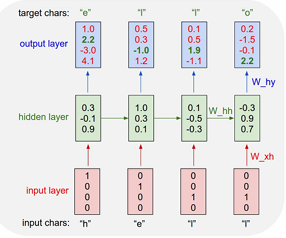{ width=70%" }
    <figcaption>
    train-time
    </figcaption>
    </figure>
     
    - 给输入'h',将输出与'e'比较，计算损失，然后更新参数。
    - 给输入'he',将输出与'l'比较，计算损失，然后更新参数。
    - 给输入'hel',将输出与'l'比较，计算损失，然后更新参数。
    - 给输入'hell',将输出与'o'比较，计算损失，然后更新参数。
    - 给输入'hello',将输出与'e'比较，计算损失，然后更新参数。


    <figure markdown="span">
     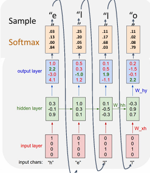{ width=70%" }
    <figcaption>
    test-time
    </figcaption>
    </figure>
    在使用的时候只给定第一个字符，将其输出作为第二个输入，以此类推。

    每个输入都可以用one-hot编码来表示。

    所以其与矩阵相乘实际上选中的是矩阵的对应的那一列。
    <figure markdown="span">
    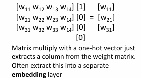{ width=70%" }
    </figure>

    当一个独热向量与权重矩阵相乘时，它实际上是从矩阵中提取一列。 当字典很大时，one-hot编码的维度会很高，所以需要使用嵌入层（Embedding Layer）来将类别数据（如单词或标记）转换为密集的向量表示。
    
    
    嵌入层（Embedding Layer）是一种神经网络层，用于将类别数据（如单词或标记）转换为密集的向量表示。这在自然语言处理（NLP）任务中尤为重要，因为需要以一种能够捕捉语义意义的方式来表示单词。通过直接将索引映射到向量来优化这一过程，从而提高计算效率。

    <figure markdown="span">
    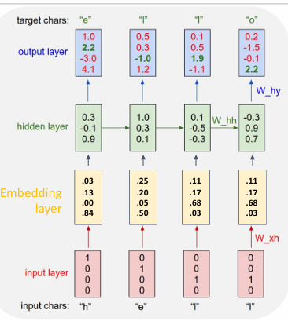{ width=70%" }
    <figcaption>
    Embedding Layer
    </figcaption>
    </figure>

### Backpropagation through time

在标准的反向传播中，梯度是通过网络的每一层从输出层向输入层传播的。然而，在RNN中，隐藏层的状态不仅依赖于当前的输入，还依赖于前一个时间步的隐藏状态。因此，BPTT需要在时间维度上展开RNN，并计算每个时间步的梯度。

具体来说，BPTT的步骤如下：

1. **展开RNN**：将RNN在时间维度上展开，形成一个包含多个时间步的前馈神经网络。
2. **前向传播**：通过展开的网络进行前向传播，计算每个时间步的输出和隐藏状态。
3. **计算损失**：根据实际输出和预测输出计算损失。
4. **反向传播**：从最后一个时间步开始，逐步向前计算每个时间步的梯度。梯度不仅在时间步之间传播，还在网络层之间传播。
5. **更新参数**：使用计算得到的梯度更新网络的参数。

需要注意的是，由于RNN的展开长度可能非常长，BPTT的计算开销较大。此外，长时间步的反向传播可能导致梯度消失或梯度爆炸问题。为了解决这些问题，可以使用截断的BPTT（Truncated BPTT），即只在固定的时间步数内进行反向传播。

<figure markdown="span">
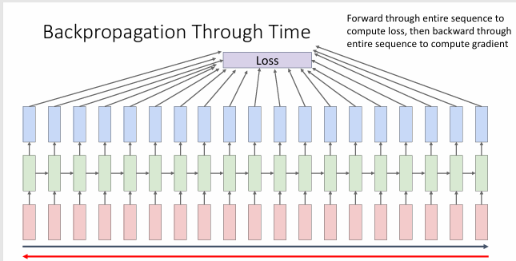{ width=70%" }
<figcaption>
Backpropagation through time
</figcaption>
</figure>
> Takes a lot of memory for long sequences


<figure markdown="span">
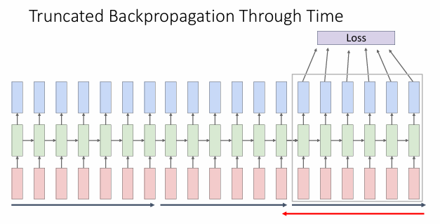{ width=70%" }
<figcaption>
Truncated BPTT
</figcaption>
</figure>
>Carry hidden states forward in time forever, but only backpropagate for some smaller number of steps


在语言预测模型中，对于RNN中隐藏单元的解释是，它表示了在当前时间步的上下文，以及其主要关注的单词，换句话说，它正在对当前文本进行着色，并指出它正在关注哪些单词。

<figure markdown="span">
{ width=70%" }
<figcaption>
Interpretable Hidden Units
</figcaption>
</figure>


!!!Example "image captioning"
    <figure markdown="span">
    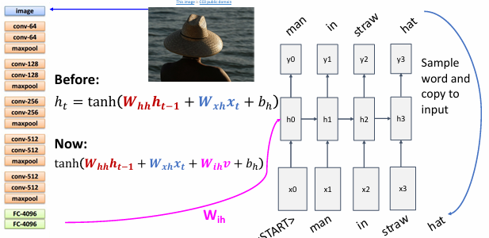{ width=100%" }
    <figcaption>
    Image Captioning
    </figcaption>
    </figure>

    首先使用已经训练好的image net模型提取图片特征，然后使用RNN生成描述图片的句子。

    在这个过程中
    
    \[
        tanh(W_{hh}h_{t-1}+W_{xh}x_t+W_{ih}v+b_h)
    \]
    
    - 向量 \( v \) 代表从图像中提取的特征向量。这个特征向量通过卷积神经网络（CNN）从输入图像中提取，并用于初始化或影响循环神经网络（RNN）的隐藏状态，以帮助生成与图像相关的文本描述。

    - 向量 \( h_{t-1} \) 代表前一个时间步的隐藏状态。

    - 向量 \( x_t \) 代表当前时间步的输入。

    - 向量 \( b_h \) 代表偏置项。


## long short term memory (LSTM)

### Vanilla RNN Gradient

<figure markdown="span">
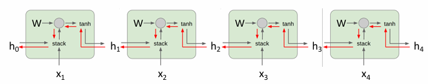{ width=90%" }
<figcaption>
Vanilla RNN Gradient
</figcaption>
</figure>


\[
h_t = \tanh(W_{hh}h_{t-1} + W_{xh}x_t + b_h) \\
= \tanh\left(\begin{bmatrix} W_{hh} & W_{xh} \end{bmatrix} \begin{bmatrix} h_{t-1} \\ x_t \end{bmatrix} + b_h\right) \\
= \tanh\left(W \begin{bmatrix} h_{t-1} \\ x_t \end{bmatrix} + b_h\right)
\]

在对$h_t$进行反向传播时，每一次都会乘以一个$W_{hh}$

- 如果$W_{hh}$的值小于1，那么随着反向传播的进行，$h_t$的值会趋近于0，会发生Vanishing gradients
- 如果$W_{hh}$的值大于1，那么随着反向传播的进行，$h_t$的值会趋近于无穷大，会发生Exploding gradients


对于梯度爆炸，可以采取截断梯度（Gradient Clipping）的方法来解决。
```python
grad_norm = np.sum(np.square(grad))
if grad_norm > threshold:
    grad = grad * threshold / grad_norm
```


对于梯度消失，就需要使用LSTM来解决。


### LSTM

LSTM是一种特殊的RNN，它能够更好地处理长期依赖关系。LSTM通过引入一个记忆单元来解决RNN的梯度消失问题。

\[
\begin{pmatrix}
i_t \\
f_t \\
o_t \\
g_t
\end{pmatrix}
=
\begin{pmatrix}
\sigma \\
\sigma \\
\sigma \\
\tanh
\end{pmatrix}
\left(W
\begin{pmatrix}
h_{t-1} \\
x_t
\end{pmatrix}
+ b_h\right)
\]

\[
c_t = f_t \odot c_{t-1} + i_t \odot g_t
\]

\[
h_t = o_t \odot \tanh(c_t)
\]

!!!definition
    - $i_t$ is the input gate:  whether to write to cell
    - $f_t$ is the forget gate:  whether to keep the cell content
    - $o_t$ is the output gate:  how much to reveal cell
    - $g_t$ is the candidate cell content,or the Gate gate: how much to write to cell

<figure markdown="span">
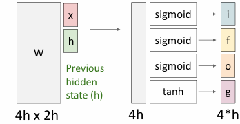{ width=90%" }
<figcaption>
LSTM
</figcaption>
</figure>
>首先执行$(4h \times 2h)\times (2h \times 1)$的映射，然后对应应用sigmoid或者tanh函数，得到四个门，再与$c_{t-1}$和$g_t$相乘加上$i_t$乘$g_t$，得到$c_t$，最后通过$o_t$和$\tanh(c_t)$得到$h_t$。

<figure markdown="span">
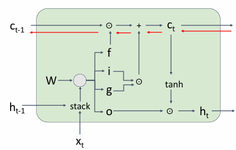{ width=90%" }
<figcaption>
Computation Graph of LSTM
</figcaption>
</figure>

有了cell state，在反向传播的过程中由于只有加法，就不会出现信息的流失。可以解决梯度消失的问题。

<figure markdown="span">
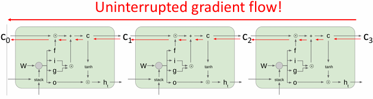{ width=90%" }
<figcaption>
Backpropagation through time of LSTM
</figcaption>
</figure>

这与ResNet的残差连接类似，可以解决梯度消失的问题。

## Motilayer RNN

<figure markdown="span">
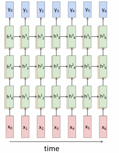{ width=90%" }
<figcaption>
Multi-layer RNN
</figcaption>
</figure>

在多层RNN中，每一层的输入是前一层的输出，每一层的输出是下一层的输入。

即

\[
h_t^\ell = \tanh \left( W \begin{pmatrix} h_{t-1}^\ell \\ h_t^{\ell-1} \end{pmatrix} + b_h^\ell \right)
\]

对于LSTM，

\[
\begin{pmatrix}
i_t^\ell \\
f_t^\ell \\
o_t^\ell \\
g_t^\ell
\end{pmatrix}
=
\begin{pmatrix}
\sigma \\
\sigma \\
\sigma \\
\tanh
\end{pmatrix}
\left(W
\begin{pmatrix}
h_{t-1}^\ell \\
h_{t}^{\ell-1}
\end{pmatrix}
+ b_h^\ell\right)
\]

\[
c_t^\ell = f_t^\ell \odot c_{t-1}^\ell + i_t^\ell \odot g_t^\ell
\]

\[
h_t^\ell = o_t^\ell \odot \tanh(c_t^\ell)
\]


