# Attention

> Attention is all you need!

## Introduction

在Seq2Seq模型中，编码器将输入序列编码为固定长度的上下文向量，然后解码器使用该上下文向量生成输出序列。然而，这种方法在处理长序列时存在问题，因为编码器需要将整个序列编码为单个向量，这会导致信息丢失。

<figure markdown="span">
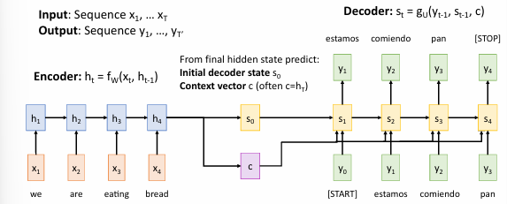{ width=90%" }
<figcaption>
Seq2Seq模型
</figcaption>
</figure>

如果说输入序列很长，那么将其编码为单个向量会不可避免地丢失信息。所以需要引入一种注意力机制，使得解码器在生成每个输出时，能够关注输入序列的不同部分。

!!!info "人眼的注意力机制"
    人眼在看一个物体时，会有一个focus，对于某个部分会看得更清楚，而其他部分则看得比较模糊。

## Attention

<figure markdown="span">
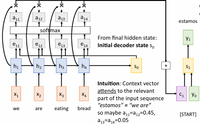{ width=90%" }
<figcaption>
Attention
</figcaption>
</figure>

例如，一开始，将$s_0$和每个$h_i$进行运算，得到$e_{1i}$，然后进行softmax运算，得到$\alpha_{1i}$，然后根据$\alpha_{1i}$和对应的$h_i$求数学期望，得到最后的$c_1$。

即

\[
    e_{t+1,i} = f_{att}(s_t, h_i)
\]

\[
    \alpha_{t+1,i} = \frac{e_{t+1,i}}{\sum_{j=1}^T e_{t+1,j}}
\]

\[  
    c_{t+1} = \sum_{i=1}^T \alpha_{t+1,i} h_i
\]

得到$c_t$后，再和$y_t$进行运算，得到下一阶段的$s_{t+1}$。然后再重复上述过程，直到生成结束符。

<figure markdown="span">
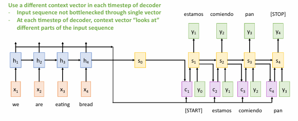{ width=90%" }
<figcaption>
Attention
</figcaption>
</figure>

!!!Example "Attention"
    <figure markdown="span">
    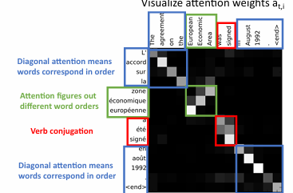{ width=90%" }
    <figcaption>
    Attention
    </figcaption>
    </figure>
    
    例如将英语翻译成法语的过程，每一个法语单词对英语的每个单词的注意力都不一样(在这里越亮代表注意力越大)

    <figure markdown="span">
    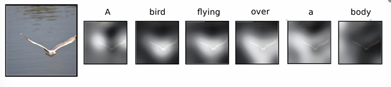{ width=90%" }
    <figcaption>
    Attention
    </figcaption>
    </figure>

    生成图像字幕时，每一个单词对图像的每个区域的关注度也不一样(在这里越亮代表注意力越大)

### image Captioning with RNN and attention

<figure markdown="span">
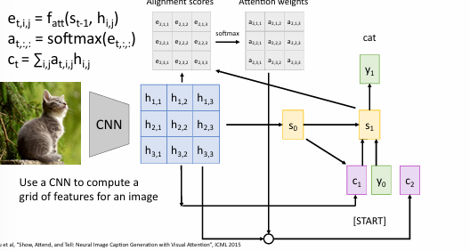{ width=90%" }
<figcaption>
image Captioning with RNN and attention
</figcaption>
</figure>

图像首先通过CNN处理，生成特征网格（如图中蓝色矩阵所示）。每个特征向量 \( h_{i,j} \) 代表图像不同区域的信息。

使用注意力函数 \( f_{att}(s_{t-1}, h_{i,j}) \) 计算对齐分数 \( e_{t,i,j} \)，表示解码器在时间步 \( t \) 时对图像特征 \( h_{i,j} \) 的关注程度。

对对齐分数进行 softmax 运算，得到注意力权重 \( \alpha_{t,i,j} \)，用于衡量每个特征在生成当前输出时的重要性。

通过加权求和计算上下文向量 \( c_t = \sum_{i,j} \alpha_{t,i,j} h_{i,j} \)，整合了图像中不同区域的信息。

解码器从起始状态 \( s_0 \) 开始，结合上下文向量 \( c_t \) 和前一个输出 \( y_{t-1} \) 生成下一个状态 \( s_t \) 和输出 \( y_t \)。

这个过程持续进行，直到生成结束符。

## Attention layer

### single Query Vector 

输入：

- Query Vector: $q$ shape: $D_q$,例如$s_t$
- Input Vector: $X$ shape: $N_X \times D_q$，例如$h$
- similarity function: scaled dot-product

计算

Computation:

- Similarities: \( e \) (Shape: \( N_X \)) where \( e_i = q \cdot x_i / \sqrt{D_Q} \)
- Attention weights: \( a = \text{softmax}(e) \) (Shape: \( N_X \))
- Output vector: \( y = \sum_i a_i x_i \) (Shape: \( D_q \))

!!!info 
    在注意力机制中，使用点积来计算相似度。如果向量的维度 \( D \) 很大，点积的值也会很大。这会导致 softmax 的输出趋于极端值，从而影响梯度的有效传播。
    解决方法：为了缓解这个问题，通常会对点积进行缩放（例如，除以 \( D \) ），以防止相似度值过大。这就是“缩放点积注意力”的由来。

### Multi Query Vector

输入：

- Query Vectors: $Q$ shape: $N_q \times D_q$
- Input Vectors: $X$ shape: $N_X \times D_q$
- similarity function: scaled dot-product

输出

- Similarities: \( E \) (Shape: \( N_q \times N_X \)) where \( e_{i,j} = q_i \cdot x_j / \sqrt{D_Q} \)，即$E=QX^T/\sqrt{D_Q}$

- Attention weights: \( A \) (Shape: \( N_q \times N_X \)) where \( a_{i,j} = \text{softmax}(e_{i,j}，dim=1) \)

- Output vectors: \( Y \) (Shape: \( N_q \times D_q \)) where \( y_i = \sum_j a_{i,j} x_j \)，即$Y=AX$

### Key & Value matrix

<figure markdown="span">
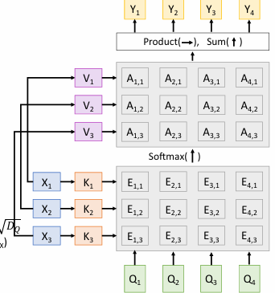{ width=90%" }
<figcaption>
Key & Value matrix
</figcaption>
</figure>

Inputs:

- Query vectors: \( \mathbf{Q} \) (Shape: \( N_q \times D_q \))
- Input vectors: \( \mathbf{X} \) (Shape: \( N_x \times D_x \))
- Key matrix: \( \mathbf{W}_K \) (Shape: \( D_x \times D_q \))
- Value matrix: \( \mathbf{W}_V \) (Shape: \( D_x \times D_v \))

Computation:

- Key vectors: \( \mathbf{K} = \mathbf{X} \mathbf{W}_K \) (Shape: \( N_x \times D_q \))
- Value Vectors: \( \mathbf{V} = \mathbf{X} \mathbf{W}_V \) (Shape: \( N_x \times D_v \))
- Similarities: \( \mathbf{E} = \mathbf{Q} \mathbf{K}^T / \sqrt{D_q} \) (Shape: \( N_q \times N_x \)), \( E_{i,j} = (\mathbf{Q}_i \cdot \mathbf{K}_j) / \sqrt{D_q} \)
- Attention weights: \( \mathbf{A} = \text{softmax}(\mathbf{E}, \text{dim}=1) \) (Shape: \( N_q \times N_x \))
- Output vectors: \( \mathbf{Y} = \mathbf{A} \mathbf{V} \) (Shape: \( N_q \times D_v \)), \( Y_i = \sum_j A_{i,j} \mathbf{V}_j \)

将值向量和键向量分开来，分别通过不同的矩阵进行变换，可以得到更好的效果。

得到对应的E矩阵后，按列进行softmax归一化，得到A矩阵。

最后将A矩阵的列和对应的V矩阵点积运算，得到Y矩阵。

### Self-attention

<figure markdown="span">
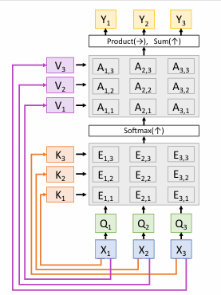{ width=90%" }
<figcaption>
Self-attention
</figcaption>
</figure>

Inputs:

- Input vectors: \( \mathbf{X} \) (Shape: \( N_x \times D_x \))
- Key matrix: \( \mathbf{W}_K \) (Shape: \( D_x \times D_q \))
- Value matrix: \( \mathbf{W}_V \) (Shape: \( D_x \times D_v \))
- Query matrix: \( \mathbf{W}_Q \) (Shape: \( D_x \times D_q \))

Computation:

- Query vectors: \( \mathbf{Q} = \mathbf{X} \mathbf{W}_Q \) (Shape: \( N_x \times D_q \))
- Key vectors: \( \mathbf{K} = \mathbf{X} \mathbf{W}_K \) (Shape: \( N_x \times D_q \))
- Value Vectors: \( \mathbf{V} = \mathbf{X} \mathbf{W}_V \) (Shape: \( N_x \times D_v \))
- Similarities: \( \mathbf{E} = \mathbf{Q} \mathbf{K}^T / \sqrt{D_q} \) (Shape: \( N_x \times N_x \)), \( E_{i,j} = (\mathbf{Q}_i \cdot \mathbf{K}_j) / \sqrt{D_q} \)
- Attention weights: \( \mathbf{A} = \text{softmax}(\mathbf{E}, \text{dim}=1) \) (Shape: \( N_x \times N_x \))
- Output vectors: \( \mathbf{Y} = \mathbf{A} \mathbf{V} \) (Shape: \( N_x \times D_v \)), \( Y_i = \sum_j A_{i,j} \mathbf{V}_j \)

查询向量，键向量，值向量都是由输入向量通过不同的矩阵变换得到的。

!!!key-point "permutation invariant"
    自注意力机制是排列不变的，即输入序列的顺序不会影响输出结果。只会影响计算的顺序。

    <figure markdown="span">
    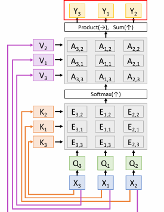{ width=90%" }
    <figcaption>
    permutation invariant
    </figcaption>
    </figure>

    即

    \[
        f(s(x))=s(f(x))
    \]
    

   - 自注意力机制本身不“知道”它处理的向量的顺序。这意味着它对输入序列的排列不敏感。

   - 为了使模型能够感知输入序列中元素的顺序，可以将位置编码与输入向量连接或相加。位置编码为每个输入位置提供唯一的表示，使模型能够区分不同位置的元素。

   通过添加位置编码，模型可以在处理输入时考虑元素的顺序。这对于自然语言处理等任务非常重要，因为词语的顺序会影响句子的意义。

#### Masked Self-attention

<figure markdown="span">
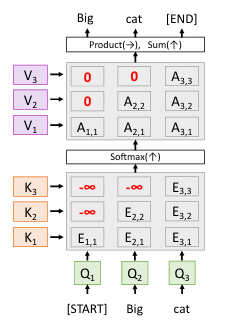{ width=90%" }
<figcaption>
Masked Self-attention
</figcaption>
</figure>

在自注意力机制中，**Masked Self-Attention Layer** 是一种特殊的自注意力层

在生成任务中，模型在预测下一个词时不应该看到未来的词。Masked Self-Attention 通过遮掩（masking）未来的词来实现这一点。

在计算注意力权重时，使用遮掩矩阵将未来的词的相似度设置为负无穷大。这确保了 softmax 输出的注意力权重为零，从而忽略未来的信息。

通过这种方式，Masked Self-Attention Layer 能够在不泄露未来信息的情况下进行序列生成。

#### Multi-head Self-attention

<figure markdown="span">
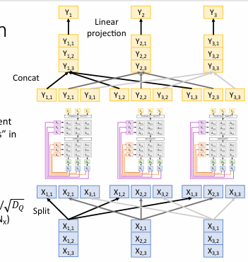{ width=90%" }
<figcaption>
Multi-head Self-attention
</figcaption>
</figure>

将输入向量分成多个子空间，每个子空间称为一个“头”。每个头独立执行自注意力计算，捕获不同的特征和关系。

步骤：

- 将输入向量 \( \mathbf{X} \) 分割成多个部分，每个部分对应一个注意力头。

- 每个头独立计算自注意力，包括生成查询、键和值向量，计算相似度，应用 softmax，生成输出。

- 将所有头的输出连接（concat）在一起。

- 对连接后的输出进行线性投影，生成最终的输出。

- 多头机制允许模型在不同的子空间中关注不同的特征，增强了模型的表达能力。

- 通过并行计算提高了效率。

!!!Example 
    <figure markdown="span">
     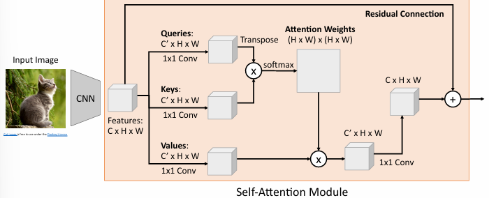{ width=90%" }
    <figcaption>
    CNN with Self-attention
    </figcaption>
    </figure>

    >最后通过 1×1 卷积将加权求和的结果转换回原始通道数 $C$。

    <figure markdown="span">
    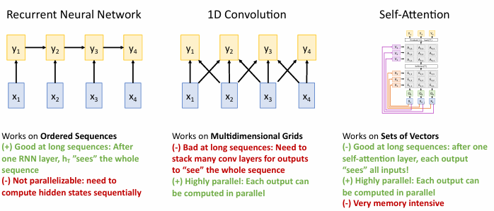{ width=90%" }
    <figcaption>
    Three ways of Processing Sqs
    </figcaption>
    </figure>

## Transformer

<figure markdown="span">
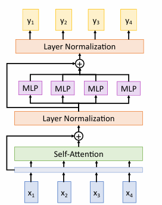{ width=90%" }
<figcaption>
Transformer Block
</figcaption>
</figure>

包括自注意力机制、前馈神经网络和层归一化。

- 输入向量 \( x_1, x_2, x_3, x_4 \) 是经过嵌入处理的输入数据。

- 计算输入向量之间的相似度，生成注意力权重。
- 使用注意力权重对输入进行加权求和，捕获全局依赖关系。

- 自注意力的输出与输入相加（残差连接），然后进行层归一化，稳定训练过程。

**前馈神经网络（MLP）**：

- 每个位置的向量通过一个小型的前馈神经网络（通常包含两个线性变换和一个激活函数，如 ReLU）。
- 这种结构增强了模型的非线性表达能力。

**第二个残差连接和层归一化**：
- 前馈网络的输出与自注意力层的输出相加，再进行层归一化。

**输出**：
- 最终输出 \( y_1, y_2, y_3, y_4 \) 是经过自注意力和前馈网络处理后的结果。

### Pre-norm Transformer

上面的结构称为Post-norm Transformer，其在残差连接之后进行层归一化。在深层网络中可能导致训练不稳定。

Pre-norm Transformer 在残差连接之前进行层归一化。更稳定，适合更深的网络。

<figure markdown="span">
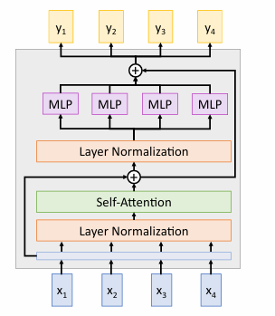{ width=90%" }
<figcaption>
Pre-norm Transformer
</figcaption>
</figure>

