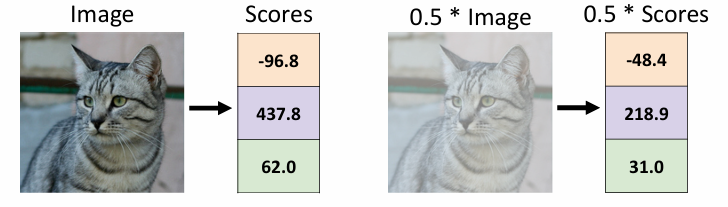
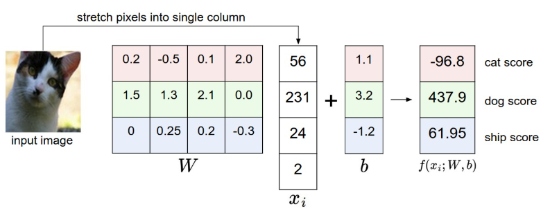
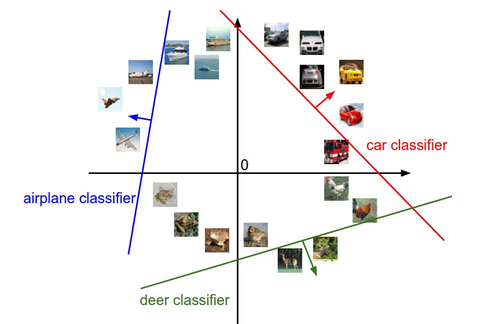
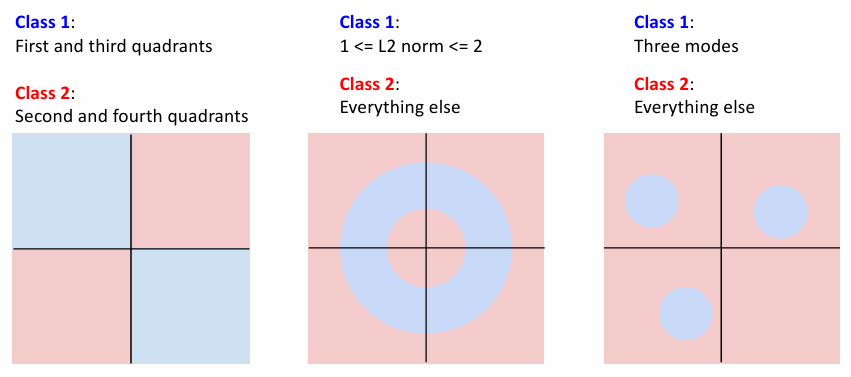
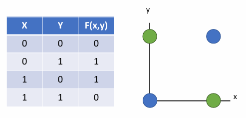
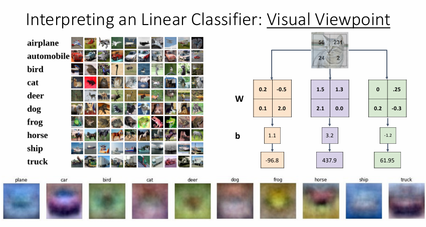
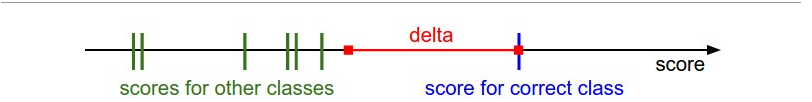
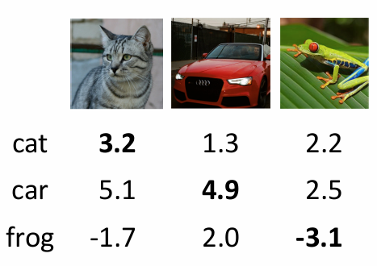
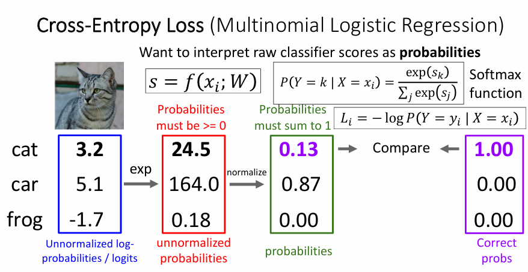
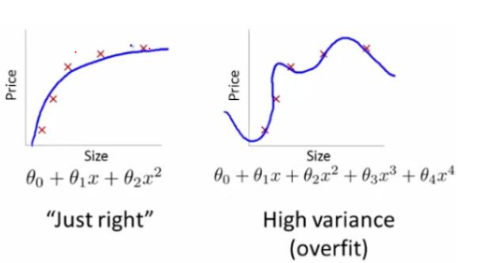

# linear classifier

## Format of the score function

Define a score function $f: \mathbb{R}^D \rightarrow \mathbb{R}^K$:

\[
    f(x_i, W, b) = Wx_i + b
\]

where $W$ is a matrix of weights of size $K \times D$ and $b$ is a vector of biases of size $K$.

$x_i$ is the input data, a column vector of size $D \times 1$,in our CIFAR-10 example, $D = 32 \times 32 \times 3 = 3072$.

and $f$ is a function that maps the raw image pixels to class scores. output $f(x_i, W, b)$ is a vector of size $K \times 1$.$K$ is the number of classes.In our CIFAR-10 example, $K = 10$.

- ote that the single matrix multiplication $Wx_i$ is effectively evaluating 10 separate classifiers in parallel (one for each class), where each classifier is a row of $W$.

- Notice also that we think of the input data $(x_i,y_i)$
 as given and fixed, but we have control over the setting of the parameters $W,b$. Our goal will be to set these in such way that the computed scores match the ground truth labels across the whole training set.  we wish that the correct class has a score that is higher than the scores of incorrect classes.

- An advantage of this approach is that the training data is used to learn the parameters W,b, but once the learning is complete we can discard the entire training set and only keep the learned parameters. That is because a new test image can be simply forwarded through the function and classified based on the computed scores.

An according to the linearity of the score function，if we ignore the bias term $b$:

\[
    f(cx,W)=W(cx)=cWx=cf(x,W)
\]

<figure markdown="span">
{ width="500" }
<figcaption>Example</figcaption>
</figure>

## Explanaition 

For example, for a single pixel, which has three channels, the weight matrix is $K \times 3$, and each of the three positions in a row can be used to represent the class "dislike or like" a certain color by setting the weight positive or negative. For example, for a ship, the blue weight may be larger, while for a plane, the red weight may be larger.


<figure markdown="span">
{ width="500" }
<figcaption>Example</figcaption>
</figure>

>An example of mapping an image to class scores. For the sake of visualization, we assume the image only has 4 pixels (4 monochrome pixels, we are not considering color channels in this example for brevity), and that we have 3 classes (red (cat), green (dog), blue (ship) class). (Clarification: in particular, the colors here simply indicate 3 classes and are not related to the RGB channels.) We stretch the image pixels into a column and perform matrix multiplication to get the scores for each class. Note that this particular set of weights W is not good at all: the weights assign our cat image a very low cat score. In particular, this set of weights seems convinced that it's looking at a dog.

!!!Note
    对于上面所示的例子，我们也可以将偏移量接到$W$的最后一列，这样只需要将输入数据的最后一行设置为1，就可以将偏移量视为权重的一部分。

### Hyperplane 

Assume that each images(represented by a column vector) is a point in a $D$-dimensional space, and the hole dataset is a set of points in that space. The score function $f(x_i, W, b)$ is a linear function of the input data $x_i$, which means that the classes are separated by linear hyperplanes.

We cannot visualize 3072-dimensional spaces, but if we imagine squashing all those dimensions into only two dimensions, then we can try to visualize\ what the classifier might be doing:

using *Hyperplane* to separate the classes into different regions.

<figure markdown="span">
{ width="500" }
<figcaption>Example</figcaption>
</figure>

>Cartoon representation of the image space, where each image is a single point, and three classifiers are visualized. Using the example of the car classifier (in red), the red line shows all points in the space that get a score of zero for the car class. The red arrow shows the direction of increase, so all points to the right of the red line have positive (and linearly increasing) scores, and all points to the left have a negative (and linearly decreasing) scores.

As we saw above, every row of $W$ is a classifier for one of the classes. The geometric interpretation of these numbers is that as we change one of the rows of $W$, the corresponding line in the pixel space will rotate in different directions. The biases $b$
, on the other hand, allow our classifiers to translate the lines. In particular, note that without the bias terms, plugging in $x_i=0$
would always give score of zero regardless of the weights, so all lines would be forced to cross the origin.

偏移量的存在使得我们的分类器可以在空间中平移，而不仅仅是旋转。

But sometimes it is hard to find a hyperplane to separate the classes:

<figure markdown="span">
{ width="500" }
<figcaption>Example</figcaption>
</figure>

and that is the reason whyb Perceptron couldn’t learn XOR function.

<figure markdown="span">
{ width="500" }
<figcaption>XOR</figcaption>
</figure>

We cannot separate the "Blue" and "Green" classes with a single line.

### template

If we think of the weights as a template for each of the classes:

*At first we represent each image into a column vector,we can also represent each column vector in the weight matrix as a template for each class.Just like the figure below.*

<figure markdown="span">

<figcaption>Example</figcaption>
</figure>

then the score function is computing how well each template matches the image. The score for each class is obtained

Here we calculate the inner product as

\[
   \mathbf{A} \cdot \mathbf{B} = \sum_{i=1}^{n} a_{ij}b_{ij}
\]

因为之前就是按照一行乘一列来计算内积，这里只不过是更改了表示方式，所以计算方式是对应位置相乘再相加，而不是矩阵乘法，这就是上面的图中的计算方式。


!!!Note "图像预处理"
    在实际应用中，通常会对图像进行预处理，例如减去均值，除以方差等，例如从图像中减去均值图像，将像素值从[0，255]变成大概是[-127，127]，然后进一步处理变成[-1，1]等……


## Loss function

We are going to measure our unhappiness with outcomes with a **loss function** (or sometimes also referred to as the **cost function** or the **objective**). Intuitively, the loss will be high if we’re doing a poor job of classifying the training data, and it will be low if we’re doing well.

### Multiclass Support Vector Machine loss

The Multiclass Support Vector Machine(SVM) loss is set up so that the SVM “wants” the correct class for each image to have a score higher than the incorrect classes by some fixed margin $\Delta$.

It looks for certain outcome in the sence that the outcome will yield a lower loss.

The loss function for the $i$-th example is:

\[
    L_i = \sum_{j \neq y_i} \max(0, s_j - s_{y_i} + \Delta)
\]

where $s_{y_i}$ is the score of the correct class($f(x_i,W)$) and $s_j$ is the score of the j-th class($f(x_i,W)$).

For example,if $\Delta = 1$,and the score of the correct class is 13,then any score below 12 will contribute 0 to the loss.Any score above 12 will contribute to the loss.

#### Hinge loss

The  threshold at zero $max(0,-)$ function is called the **hinge loss**. It is a piecewise linear function that behaves like the following:


<figure markdown="span">
{ width="500" }
<figcaption>Hinge loss</figcaption>
</figure>

>The Multiclass Support Vector Machine "wants" the score of the correct class to be higher than all other scores by at least a margin of delta. If any class has a score inside the red region (or higher), then there will be accumulated loss. Otherwise the loss will be zero. Our objective will be to find the weights that will simultaneously satisfy this constraint for all examples in the training data and give a total loss that is as low as possible.


!!!Example
    <figure markdown="span">
    { width="500" }
    <figcaption>Example</figcaption>
    </figure>
    
    Here shows the score of three classes for each input image(cat,car.frog)

    Assume $\Delta=1$ the loss for the cat input image is:

    Neglect the score of the correct class(cat),the loss $L_1$ is:
    
    \[
    max(0,5.1-3.2+1)+max(0.-1.7-3.2+1)=2.9
    \]

    Similarly, the loss for the car input image is:

    \[
        max(0, 1.3 -4.9 + 1)+max(0, 2.0 -4.9 + 1)=0
    \]

    The loss for the frog input image is:
    
    \[
        max(0, 2.2 - (-3.1) + 1)+max(0, 2.5 - (-3.1) + 1)=12.9
    \]


    This claims that the weight matrix acts good on the car image, but not such good the cat, bad on the frog.

    Finaly the total loss on the data set is the average of all the losses:

    \[
        L = \frac{1}{N} \sum_{i=1}^{N} L_i =\dfrac{2.9+0+12.9}{3}=5.27
    \]

!!!question
    - Q:  What happens to the loss if the scores for the car image change a bit

    - A: Once the score for car image is 0,it will not change at all if the score for the cat image changes a bit.

    - Q:  What are the min and max possible loss?
    - A: The min loss is 0, and the max loss is $\infty$.
    

    - Q:  If all the scores were random, what loss would we expect
    - A: The total loss would be $K-1$, where $K$ is the number of classes.**This is because if all the scores are random,it can be regard as a Gauss distribution, $s_i$ and $s_j$ will be close to each other, so the loss will be near to $1$**,so it will be $K-1$ for each class

    - Q: What would happen if the sum were over all classes? (including the correct class)
    - A: All of loss will add 1.

    - Q:What if the loss used a mean instead of a sum
    - A: It still works, since dividing by a constant doesn't change the optimization landscape.

    - Q: What if we used this loss instead?
     
    \[
        L_i = \sum_{j \neq y_i} \max(0, s_j - s_{y_i} + \Delta)^2
    \]
     
    - A: It still works, since squaring doesn't change the optimization landscape.But it changes the preference of the model.

## Softmax classifier

Another common loss function is the **Softmax classifdier**. It has the form:

\[
    L_i = -\log\left(\frac{e^{s_{y_i}}}{\sum_{j} e^{s_j}}\right)
\]

or

\[
    P(Y=y_i|X=x_i) = \dfrac{e^{s_{y_i}}}{\sum_{j} e^{s_j}}
\]

\[
    L_i = -\log P(Y=y_i|X=x_i)
\]

the function $f_j(z)=\dfrac{e^{z_j}}{\sum_{k} e^{z_k}}$ is called the **softmax function**. It takes a vector of arbitrary real-valued scores (in $z$) and squashes it to a vector of values between zero and one that sum to one.


<figure markdown="span">
{ width="500" }
<figcaption>Softmax</figcaption>
</figure>

>应用这个函数将原始的分数转换为概率;期望的情况是，正确的类别的概率应该接近1，而错误的类别的概率应该接近0。

The cross-entropy between a “true” distribution $p$ and an estimated distribution $q$ is defined as:

\[
    H(p,q) = -\sum_{x} p(x) \log q(x)
\]

The Softmax classifier is hence minimizing the cross-entropy between the estimated class probabilities(i.e. the output of the Softmax function)and the “true” distribution, which in this interpretation is the distribution where all probability mass is on the correct class (i.e. $p=[0,0,...1,...,0]$ contains a single 1 at the $y_i$-th position).

and since the cross-entropy can be written in terms of entropy and the Kullback-Leibler divergence as $H(p,q) = H(p) + D_{KL}(p||q)$, we see that the Softmax classifier is exactly minimizing the KL divergence between the estimated class probabilities and the true distribution.

i.e the cross-entropy objective wants the predicted distribution to have all of its mass on the correct answer.


When using softmax classifier, because of:


\[
    \dfrac{e^{s_{y_i}}}{\sum_{j} e^{s_j}} = \dfrac{Ce^{s_{y_i}}}{C\sum_{j} e^{s_j}}=\dfrac{e^{s_{y_i}+logC}}{\sum_{j} e^{s_j+logC}}
\]

We are free to choose the value of $C$. This will not change any of the results, but we can use this value to improve the numerical stability of the computation. A common choice for $C$ is to set $\logC=−max_jf_j$. This simply states that we should shift the values inside the vector $f$ so that the highest value is zero. In code:

```python
f = np.array([123, 456, 789]) # example with 3 classes and each having large scores
p = np.exp(f) / np.sum(np.exp(f)) # Bad: Numeric problem, potential blowup

# instead: first shift the values of f so that the highest number is 0:
f -= np.max(f) # f becomes [-666, -333, 0]
p = np.exp(f) / np.sum(np.exp(f)) # safe to do, gives the correct answer
```

!!!question 
    - Q: what is the min and max possible loss?
    - A: The min loss is 0, and the max loss is $\infty$.But the two bounds could never be reached.

    - Q: What is the difference between the SVM loss and the Softmax loss?

    - A: The SVM loss is a hinge loss, while the Softmax loss is a cross-entropy loss. The SVM loss is a bit more robust to outliers, while the Softmax loss is more informative and can drive the model to be more confident in its predictions.

## Regularization

In practice, we also add a regularization term to the loss function to prevent overfitting. The most common regularization is the L2 regularization, which has the form:

\[
    R(W) = \sum_{k} \sum_{l} W_{k,l}^2
\]

or L1 regularization:

\[
    R(W) = \sum_{k} \sum_{l} |W_{k,l}|
\]

or Elastic Net regularization:

\[
    R(W) = \sum_{k} \sum_{l} \alpha W_{k,l}^2 + (1-\alpha)|W_{k,l}|
\]

We add the regularization term to the loss function in order to prevent overfitting. The regularization strength $\lambda$ is a hyperparameter that we tune using the validation set.

<figure markdown="span">
{ width="500" }
<figcaption>Overfititng</figcaption>
</figure>

> Overfitting is a common problem in machine learning, where a model performs well on the training data but poorly on the test data. Regularization is a technique used to prevent overfitting by adding a penalty term to the loss function that discourages large weights.


so the final loss function is:

\[
    L = \dfrac{1}{N} \sum_{i} L_i + \lambda R(W)
\]

where $N$ is the number of training examples, $L_i$ is the loss for the $i$-th example, and $R(W)$ is the regularization term.

It also help us to choose different weight matrix when there are multiple solutions that causes the same loss.

Such as the following example:

image: [1.0, 1.0, 1.0]

$W_1$: [1.0, 0.0, 0.0]

$W_2$: [0.25,0.25, 0.25]

the score of the two weight matrix is the same, but if we use L2 regularization, the $W_1$ will cause higher loss than $W_2$. So we will choose $W_2$.

