# Visualizing and Generating

## Visualizing and Understanding Convolutional Networks

卷积神经网络的第一层的filters主要学习的是边缘特征

<figure markdown="span">
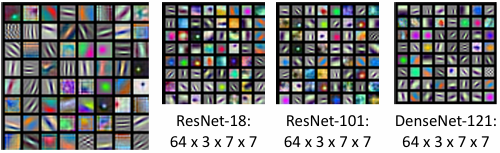{ width=70%" }
<figcaption>
    Visualizing the filters of the first layer of a convolutional network
</figcaption>
</figure>

因为第一层filters的通道数和输入的通道数相同，所以可以将其可视化。为各种边边角角的组合。

但是越往后，filters的通道数就比较奇怪，例如20x16x7x7，将其作为RGB图像可视化没有什么意义，可以将其看作是20组，每组16个7x7的特征灰度图。但是即使这样，看起来也并不像任何东西。

<figure markdown="span">
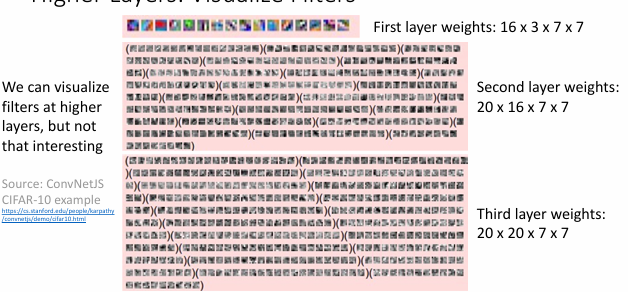{ width=70%" }
</figure>

由于最后一层在全连接层之前是一个大向量，例如4096维；可以将各种图像应用在训练好的网络中，根据这个大的特征向量使用nearest neighbor的方法找到最相似的向量，然后将它们的图像匹配在一起；

<figure markdown="span">
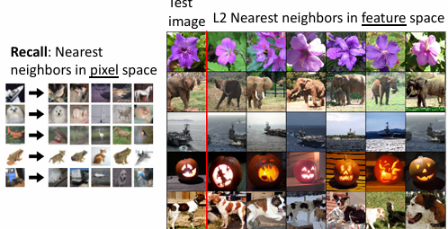{ width=70%" }
</figure>

与linear classifier使用像素不同，在这个特征向量上使用最近邻的结果表现得非常好，这说明神经网络通过学习，消除了图像本身的一些特征，例如光照，位置，角度等，提取出了更高层次的特征；

还可以通过Dimension Reduction的方法将4096维的特征向量降维到2维的点，然后将对应的点替换为图像，就可以得到图像在空间上的分布；

<figure markdown="span">
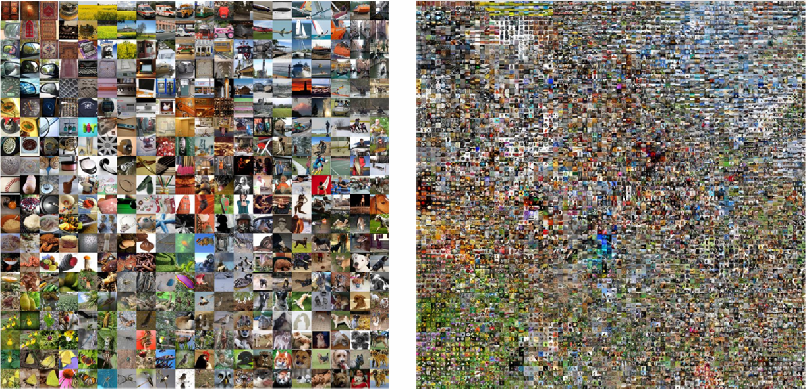{ width=70%" }
</figure>
> [高清图](https://cs.stanford.edu/people/karpathy/cnnembed/)

可以看到相似的图像都紧凑地聚集在一起，而不同的图像则分散在各个角落。

### Visualizing the activations

还可以通过中间层的特征来可视化图像

例如conv5是128x13x13的，可以将其看作是128个13x13的特征图，可以将其可视化，在下面这个例子中，其中一个特征图可视化后非常像人脸，说明这个特征图学习到了人脸的特征。

<figure markdown="span">
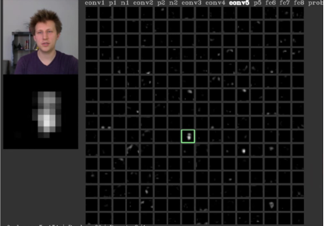{ width=70%" }
</figure>

#### Maximally Activating Patches

最大激活补丁（Maximally Activating Patches）是指在卷积神经网络中，选择一个特定的层和通道，然后输入大量图像，记录该通道的激活值，最后可视化那些产生最大激活值的图像补丁。

工作流程如下：

- 选择网络中的一个特定层和通道，例如conv5层（尺寸为128×13×13），可以选择其中的第17个通道
- 将大量图像输入网络，记录所选通道的激活值
- 可视化那些产生最大激活值的图像补丁

<figure markdown="span">
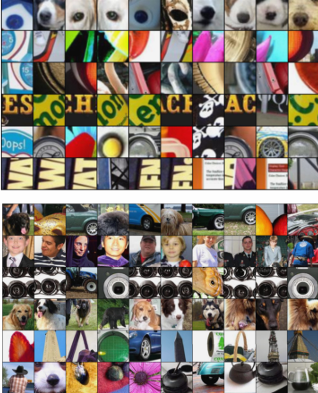{ width=70%" }
</figure>

这种可视化方法揭示了卷积神经网络中不同通道学习识别的具体视觉特征。通过查看最大激活补丁，我们可以理解每个通道在"寻找"什么样的图像特征，从而解释网络如何进行特征提取。这表明神经网络的不同部分专门负责检测图像中的不同语义元素，进一步证实了深度学习模型具有层次化特征学习能力。

#### Saliency Via Occlusion

遮挡显著性(Saliency via Occlusion)是一种确定图像中哪些区域对CNN预测最重要的方法。其基本思想是通过系统地遮挡图像的不同部分，然后观察模型预测概率的变化，来判断哪些区域对分类结果影响最大。

工作流程如下：

- 使用滑动窗口方法，用灰色方块（或其他颜色）系统地遮挡输入图像的不同区域
- 每次遮挡后，将修改后的图像输入CNN，记录预测概率的变化
- 生成热力图，显示遮挡每个区域后导致的预测概率下降程度

<figure markdown="span">
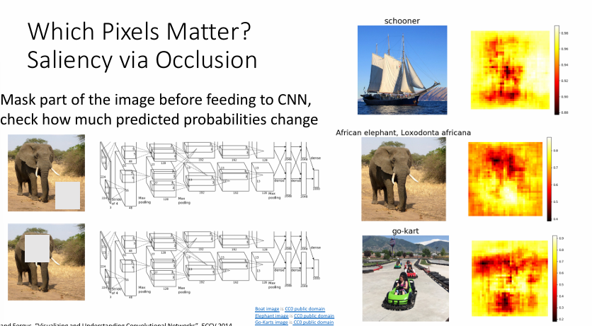{ width=70%" }
<figcaption>
    使用遮挡技术可视化CNN中重要的像素区域
</figcaption>
</figure>

如上图所示，右侧的热力图显示了对每个类别（帆船、非洲象、卡丁车）的预测贡献最大的区域。热力图中的亮色区域表示该区域被遮挡后会导致预测概率大幅下降，说明这些区域对模型的决策至关重要。

这种方法直观地展示了CNN在做决策时"关注"图像的哪些部分，有助于我们理解模型的工作原理并验证其是否真正学习到了有意义的特征，而不是依赖于图像中的无关背景或伪相关。

#### Saliency via Backpropagation

反向传播显著性(Saliency via Backpropagation)是一种通过反向传播梯度来确定图像中哪些区域对CNN预测结果影响最大的方法。

<figure markdown="span">
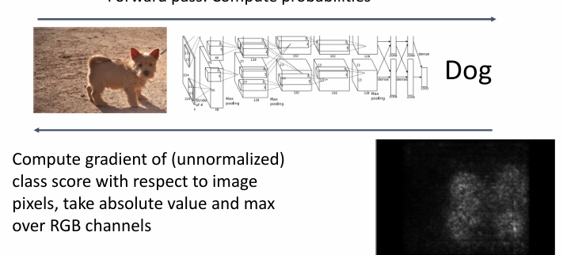{ width=70%" }
</figure>

具体实现步骤：

- 将图像输入网络，进行前向传播，得到类别预测分数
- 计算特定类别（如"狗"）的未归一化分数相对于输入图像像素的梯度
- 取梯度的绝对值，并在RGB通道上取最大值
- 生成可视化热力图，显示哪些像素对预测结果贡献最大

这种方法的优势在于计算效率高，只需一次反向传播即可获得显著性图，而且能直接揭示网络关注的图像区域。与遮挡方法相比，它不需要进行多次前向传播，因此速度更快。

通过这种可视化技术，我们可以验证CNN是否真正关注目标对象的相关特征，而非背景或无关元素，有助于解释模型决策过程并检测潜在的偏见或过拟合问题。

#### Intermediate Features via Guided Backpropagation

引导反向传播(Guided Backpropagation)是对标准反向传播方法的一种改进，用于更好地可视化CNN中间层神经元所关注的图像区域。

工作流程如下：

- 选择网络中特定的一个中间神经元（例如conv5层128×13×13特征图中的一个值）
- 计算该神经元的激活值相对于输入图像像素的梯度
- 但与标准反向传播不同，引导反向传播在反向传递中对ReLU激活函数进行特殊处理

<figure markdown="span">
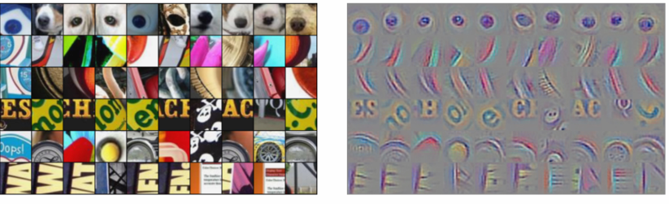{ width=70%" }
</figure>

引导反向传播的特点：

- 在反向传播过程中，仅允许正梯度通过ReLU层（"引导"过程）
- 这意味着在ReLU层，同时考虑前向传播和反向传播的限制：
  - 前向传播时，只有正值会被传递（ReLU的标准行为）
  - 反向传播时，只有正梯度会被传递（引导部分）

- 结果产生更清晰的可视化，更好地展示了神经元响应的图像区域

这种方法相比普通反向传播可以生成更加锐利和聚焦的可视化结果，使我们能够更清楚地了解CNN中特定神经元对应的图像特征。从右侧的比较可以看出，引导反向传播的结果更加清晰，噪声更少。

这项技术最早由Springenberg等人在2015年的ICLR研讨会论文"Striving for Simplicity: The All Convolutional Net"中提出，它为理解CNN内部表示提供了重要工具。

#### Class Activation Mapping

类激活映射(Class Activation Mapping)是一种用于可视化卷积神经网络中特定类别的激活区域的方法。

<figure markdown="span">
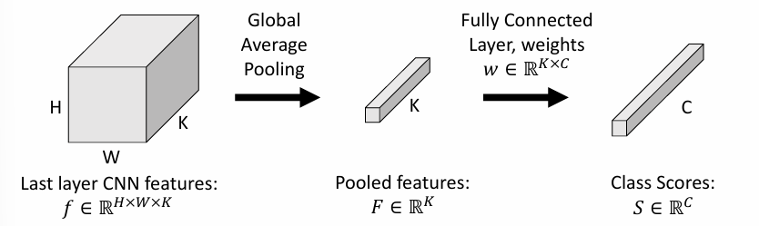{ width=70%" }
</figure>

首先，对CNN提取出的图像(H,W,K)特征进行全局平均池化(K,)，得到一个特征向量，然后通过全连接层得到一个类别得分(C,)。

由于平均池化：

\[
    F_k = \frac{1}{HW}\sum_{h,w}f_{h,w,k}
\]

将其带入每个类别的得分中:

\[
S_c = \sum_k w_{k,c}F_k = \frac{1}{HW}\sum_k w_{k,c}\sum_{h,w}f_{h,w,k} = \frac{1}{HW}\sum_{h,w}\sum_k w_{k,c}f_{h,w,k}
\]

这样就得到了CAM的公式：

\[
    M_{c,h,w} = \sum_k w_{k,c}f_{h,w,k}
\]

即，对于类别c，其在位置(h,w)的激活值是权重矩阵中第c列和特征图f按k通道进行内积的结果。

这种方式可以直观展示图像中对分类决策起关键作用的区域。

<figure markdown="span">
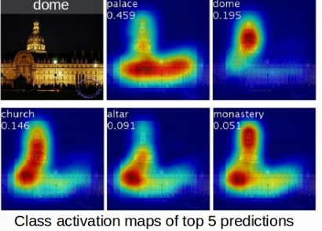{ width=70%" }
</figure>
> 但缺点是只能在最后的全连接层进行，如果想要在中间层进行，需要使用Grad-CAM。

## Generating Images

### Gardient Ascent

在之前，图像是固定的，我们通过反向传播来查看哪些像素的变化对于某个中间神经元的影响最大，来查看中间层通道在学习什么特征；

现在，我们可以从零开始，聚焦在中间层某一个神经元的值，不断通过梯度上升，来生成使得神经元激活值最大的图像。

总的来说，是重复执行以下步骤：

- 前向传播，计算当前得分
- 反向传播，计算得分对于像素的梯度
- 更新图像，使得得分上升

目标是

\[
    argmax_I S_c(I) - \lambda ||I||_2^2
\]

需要添加正则项，防止其生成得分很高但是没有意义的图像。

<figure markdown="span">
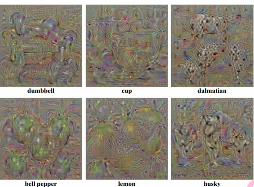{ width=70%" }
</figure>

通过多面特征，可以生成更加多样化的图像。

### Adversarial Attack

对抗样本（Adversarial Examples）是通过对输入数据进行微小但有目的的修改，以欺骗机器学习模型的技术

#### Start from arbitrary image

对抗样本的生成可以从任何图像出发，包括自然图像（如照片）或随机噪声。关键是通过后续步骤对图像进行修改，使其被模型错误分类。例如：  

- 若原始图像是“猫”，攻击者可能希望模型将其误判为“狗”或其他类别。  
- 起始图像的选择会影响生成对抗样本所需的扰动大小和复杂度。

#### Select a target class

攻击者需指定希望模型误判的类别（如“飞机”或“汽车”）。这一步决定了对抗样本的生成方向： 

- 定向攻击（Targeted Attack）：强制模型输出特定目标类别。  
- 非定向攻击（Untargeted Attack）：仅需让模型输出错误类别，不指定具体目标。  
目标类别的选择会影响生成对抗样本的策略和扰动模式。

#### gradient ascent

这是生成对抗样本的核心步骤，具体流程如下：  

- 计算梯度：利用反向传播，计算模型对输入图像的梯度。梯度表示“如何调整图像像素值才能最大程度提高目标类别的预测概率”。  

- 梯度上升（Gradient Ascent）：与训练模型的梯度下降相反，梯度上升沿着梯度方向更新图像，逐步增加目标类别的分数。  

#### Stop condition

停止条件通常有两种：  

- 置信度阈值：当目标类别的预测概率达到预设值（如99%）。  
- 扰动限制：当添加的扰动（如L2范数）超过允许范围，确保扰动对人类不可见。  

例如，当原始图像被修改后，模型以高置信度将其分类为“飞机”而非真实的“猫”，则认为攻击成功。

#### Key characteristics

- 微小扰动：人类难以察觉的微小修改即可欺骗模型。  
- 可转移性：针对某模型生成的对抗样本，可能对其他模型也有效。  
- 高维敏感性：模型在高维特征空间中对微小扰动高度敏感。

在自动驾驶、人脸识别等安全关键系统中，对抗样本可能导致严重错误。研究其生成与防御对提升AI系统的安全性和可靠性至关重要。

例如

<figure markdown="span">
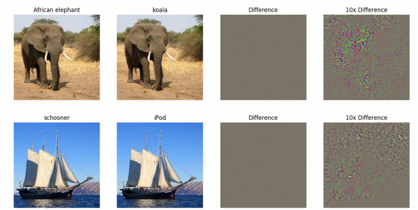{ width=70%" }
</figure>
> 通过微小的调整，就足以让其误判，但是人眼难以察觉。

#### White-Box Attack

白盒攻击（White-Box Attack）是指攻击者拥有目标模型的完整信息，包括模型结构、参数和训练数据。

#### Black-Box Attack

黑盒攻击（Black-Box Attack）是指攻击者没有目标模型的完整信息，只能通过模型预测结果进行攻击。

### Feature Inversion

特征反转（Feature Inversion）是一种用于生成特定特征的图像的技术;

Feature Inversion（特征逆变换）是计算机视觉中一种用于 **从神经网络的特征表示重建原始图像** 的技术，通过逆向生成与特定特征匹配的图像，可以直观分析网络对输入数据的抽象表示能力。

- 目标：给定某层特征图（如CNN中间层的输出），生成一张新图像，使其通过网络前传后在该层的特征尽可能接近目标特征。
- 本质：通过优化输入图像，最小化生成图像与目标特征之间的差异，从而反推网络“认为”什么样的输入会激活该特征。

<figure markdown="span">
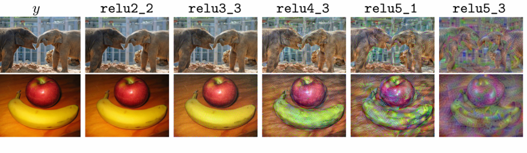{ width=70%" }
</figure>

可以看到，越往后，特征越抽象，越难以理解。

\[
\mathbf{x}^* = \underset{\mathbf{x} \in \mathbb{R}^{H \times W \times C}}{\text{argmin}} \, \ell(\Phi(\mathbf{x}), \Phi_0) + \lambda \mathcal{R}(\mathbf{x})
\]

其中，特征匹配的损失函数定义为：

\[
\ell(\Phi(\mathbf{x}), \Phi_0) = \|\Phi(\mathbf{x}) - \Phi_0\|^2
\]

\[
\mathcal{R}_{V^\beta}(\mathbf{x}) = \sum_{i,j} \left( (x_{i,j+1} - x_{i,j})^2 + (x_{i+1,j} - x_{i,j})^2 \right)^{\frac{\beta}{2}}
\]

通过最小化网络特征表示与目标特征之间的差异，同时加入正则化项以获得视觉上更合理的结果。

### DeepDream

DeepDream是一种基于深度学习的图像生成技术，通过神经网络的中间层特征来生成具有艺术风格的图像。

即，比起生成图像，更像是特征的放大。

其流程是，首先，选择一张图像，然后选择一个想要放大特征的层

- Forward： 计算选定层的特征激活值
- Set gradient of chosen layer equal to its activation
- Backward： 计算梯度
- Update： 更新图像

通过将梯度设置为等于激活值，DeepDream算法实际上是在鼓励网络增强它已经检测到的特征。这是因为梯度通常指示如何改变输入以增加某个值，所以当梯度等于激活值时，这意味着我们希望增加已经存在的特征。

这一步创造了一个反馈循环，使得图像中的特定模式越来越明显。网络检测到某个特征，然后通过梯度下降（实际上是梯度上升，因为我们想要最大化激活）来增强该特征，然后在下一次迭代中，网络可能会检测到更强的同一特征，进一步增强它，依此类推。

普通的梯度上升通常是为了最大化某个特定类别的分数（如在对抗样本生成中）。而在DeepDream中，我们不关心特定类别，而是希望最大化选定层的整体激活，无论它们代表什么。通过将梯度设为激活值，我们实质上是说"给我更多已经存在的东西"。

此时不再关注它到底属于什么类别，只在乎增强已经存在的特征。

<figure markdown="span">
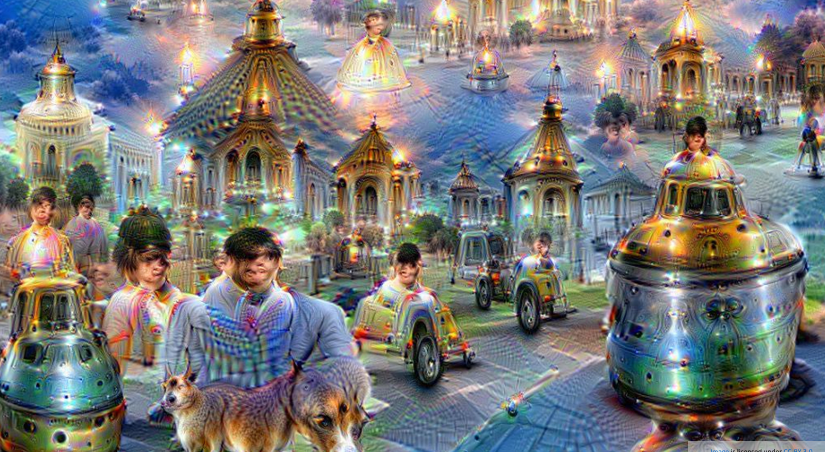{ width=70%" }
</figure>

这会生成很魔幻的图像

### Texture Synthesis

纹理合成（Texture Synthesis）是一种基于深度学习的图像生成技术，通过学习图像的纹理特征，生成具有相似纹理的图像。

#### Nearest Neighbor

生成顺序是扫描线顺序，也就是逐行逐个生成像素。对于每一个待生成的像素，查看其周围的已生成像素（可能是左方、上方以及左上方的像素，因为扫描线顺序下右边的和下方的像素还未生成），组成一个邻域。然后，在输入的样本纹理中寻找与该邻域最匹配的位置，然后将该位置对应的下一个像素复制到当前生成的位置。

#### Gram Matrix

Gram矩阵是用于描述图像纹理特征的矩阵。

!!!Definition
    给定一组向量 \( \{\mathbf{v}_1, \mathbf{v}_2, \dots, \mathbf{v}_n\} \)，Gram Matrix \( G \) 是一个 \( n \times n \) 的矩阵，其中每个元素 \( G_{i,j} \) 是向量 \( \mathbf{v}_i \) 和 \( \mathbf{v}_j \) 的内积：
    
    \[
        G_{i,j} = \mathbf{v}_i \cdot \mathbf{v}_j
    \]

    每一层的卷积神经网络（CNN）都会生成一个形状为 C x H x W 的特征张量；即 H x W 的网格，每个网格包含一个 C 维的向量

    <figure markdown="span">
    { width=70%" }
    </figure>
    
    在这里，Gram Matrix 的维度是 CxC，每个位置就是对应通道特征图的内积；

    即，将每个通道的特征图展平为向量，得到矩阵 \( F_{\text{flat}} \in \mathbb{R}^{C \times (H \times W)} \)。

    然后计算Gram Matrix：

    \[
    G = F_{\text{flat}} \cdot F_{\text{flat}}^\top \in \mathbb{R}^{C \times C}
    \]
    
    其中 \( G_{i,j} \) 表示第 \( i \) 个通道与第 \( j \) 个通道在所有空间位置上的相关性。

Gram Matrix 编码了不同通道特征之间的 **协方差** ，反映哪些特征倾向于同时激活。通过展平特征图，Gram Matrix 仅保留通道间的统计特性，更适合表示全局风格（如纹理、颜色分布）。

<figure markdown="span">
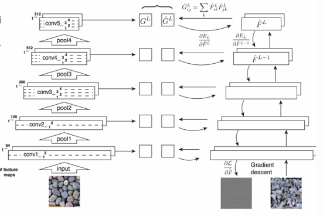{ width=70%" }
</figure>

通过Gram Matrix生成纹理图像的步骤：

**预训练CNN模型**：

- 使用在ImageNet上预训练好的CNN模型（如VGG-19）作为特征提取器

**提取原始纹理特征**：

- 将原始纹理图像输入CNN
- 记录CNN各层的激活值（特征图）

- 每一层的特征表示为 \(\mathbf{F}^l \in \mathbb{R}^{C_l \times H_l \times W_l}\)

**计算原始纹理的Gram矩阵**：

- 对每一层的特征图计算Gram矩阵
   - Gram矩阵计算公式：\(G^l_{c,c'} = \sum_{h,w} F^l_{c,h,w} F^l_{c',h,w}\)

**初始化生成图像**：

- 从随机噪声开始（通常是白噪声）

**迭代优化过程**：

- 将当前生成的图像输入CNN
- 计算生成图像在各层的特征图和Gram矩阵

**计算损失函数**：

- 计算生成图像与原始纹理图像在各层Gram矩阵之间的L2距离
- 损失函数：\(E_l = \frac{1}{4N_l^2M_l^2} \sum_{c,c'} (G^l_{c,c'} - G'^l_{c,c'})^2\)
- 总损失：\(L = \sum_l w_l E_l\)，其中 \(w_l\) 是每层的权重

**梯度下降更新**：

- 通过反向传播计算损失函数对生成图像的梯度
- 根据梯度更新生成图像

**重复迭代**：

- 重复步骤5-7，直到生成图像稳定或达到预设迭代次数

<figure markdown="span">
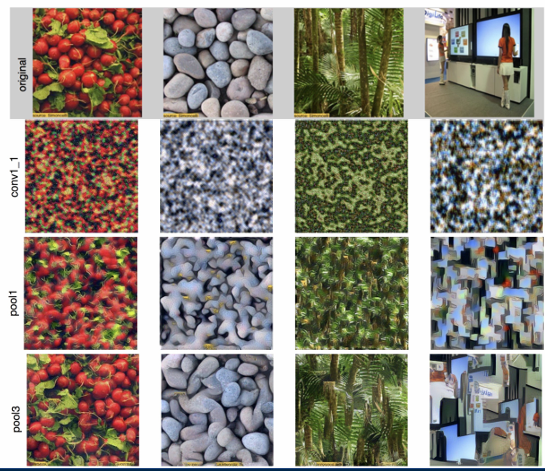{ width=70%" }
</figure>

从更高层重建纹理可以恢复输入纹理中的较大特征

### Neural Style Transfer

神经风格迁移（Neural Style Transfer）是一种基于深度学习的图像生成技术，通过将内容图像和风格图像的特征进行融合，生成具有艺术风格的图像。

有两个输入，一个是内容图像(content image)，一个是风格图像(style image)。

将特征与内容图像进行匹配，将Gram Matrix与风格图像进行匹配，然后进行优化，使得生成图像既具有内容图像的内容，又具有风格图像的风格。

即同时结合feature reconstruction和texture synthesis。

<figure markdown="span">
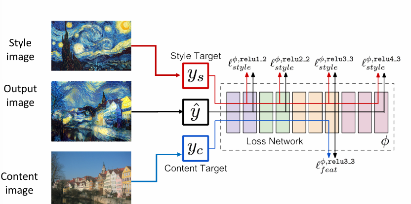{ width=70%" }
</figure>

通过调整两者结合的权重，可以生成不同风格的图像，更加写实还是更加抽象。

