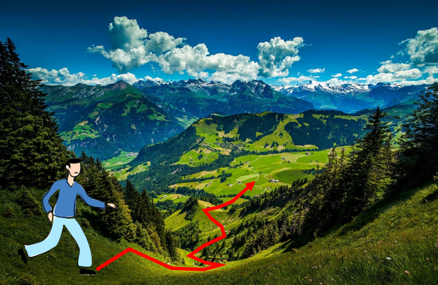
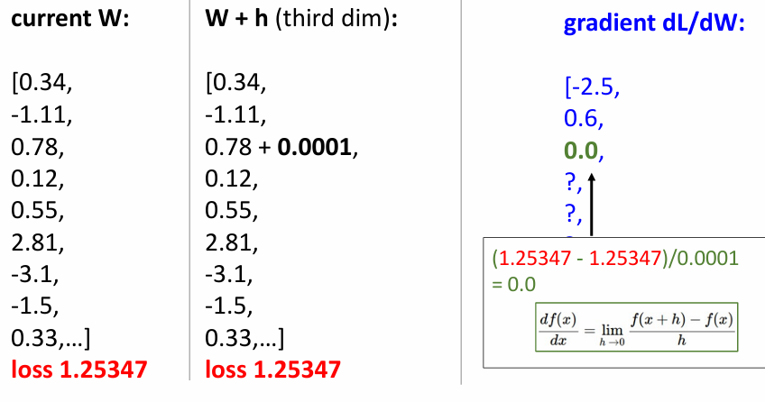
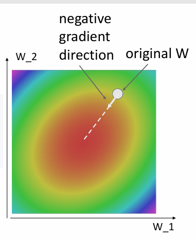
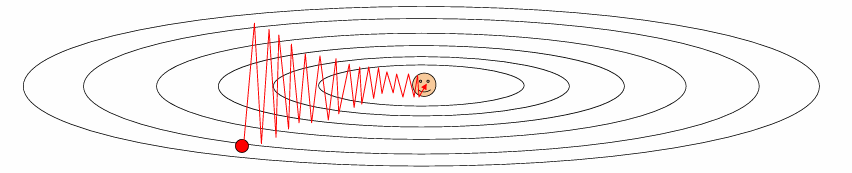
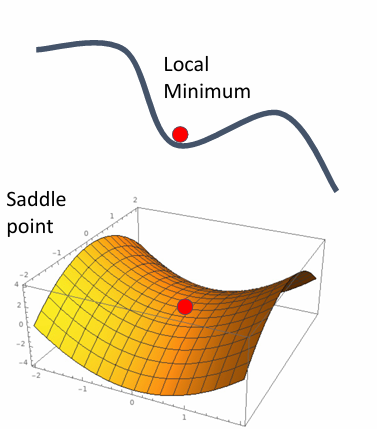
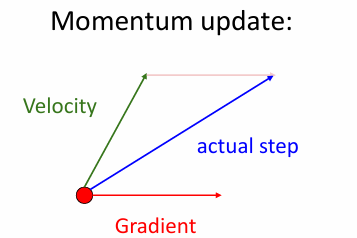
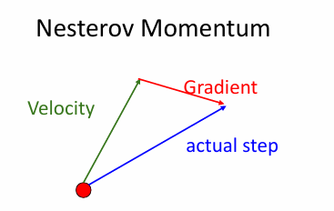
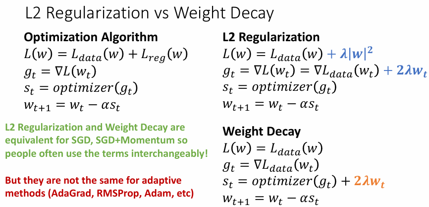
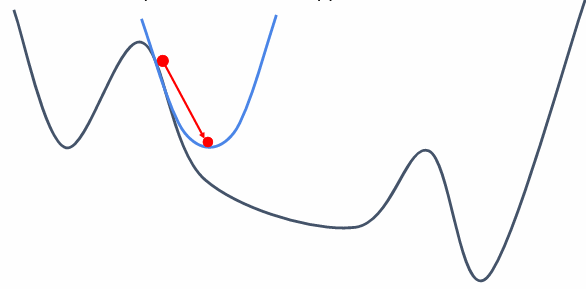
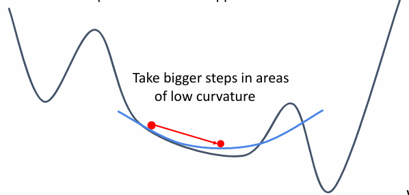

# Optimization

For linear classifiers, we need to find the best weight matrix $W$ to separate the data.

A simple idea is to find such a $W^*$ that satisfies the following equation:

\[
    W^* = \arg\min_{W} L(W)
\]

where $L(W)$ is the loss function.

Now our goal is similar to the following case:

*A blind man on the top of a hill, looking for the lowest point.*

<figure markdown="span">
{ width="600" }
</figure>

## Random Search

The first idea is to try random search,we loop through the parameter space and find the best $W$ that minimizes the loss function.

```python
bestloss = float('inf')  # Python assigns the highest possible float value
for num in range(1000):
    W = np.random.rand(10, 3073) * 0.0001  # generate random parameters
    loss = L(X_train, Y_train, W)  # get the loss over the entire training set
    if loss < bestloss:  # keep track of the best solution
        bestloss = loss
        bestW = W
    print('in attempt %d the loss was %f, best %f' % (num, loss, bestloss))
```

This is a simple idea that gets nearly 15.5% accuracy.(the best accuracy is ~95%)


## Follow the slope

Although the man on the hill is blind, he can feel the slope near him using his foot or stick.And follow the slope to find the lowest point.This is kind of [*local search*.](../../ADS/wk11.md)


In 1-D case, the slope is the derivative of the loss function.

\[
    \frac{dL}{dx}=f'(x)
\]

And in multi-dimensional case, the gradient is the vector of partial derivatives along each dimension.

The slope in any direction is the dot product of the direction with the gradient
The direction of steepest descent is the negative gradient (方向导数)

When computing Gradients，we have the following methods:

1. Numerical Gradient
2. Analytical Gradient

### Numerical Gradient

Numerical Gradient is a technique used to approximate the gradient of a function through numerical methods. It is particularly useful in optimization problems in computer science and machine learning when the analytical gradient is not readily available.

The basic idea of the numerical gradient is to use finite differences to estimate the gradient of a function at a point. Specifically, for a function \( f \) and a point \( x \), the numerical gradient can be calculated using the following formula:

\[
\frac{\partial f}{\partial x_i} \approx \frac{f(x + h \cdot e_i) - f(x)}{h}
\]

where:

- \( h \) is a very small number, often referred to as the step size.
- \( e_i \) is a unit vector with 1 at the \( i \)-th position and 0 elsewhere.

This method allows us to compute the partial derivatives for each dimension, resulting in the gradient vector at that point.

The advantage of numerical gradient is its simplicity and ease of implementation, as it does not require the analytical form of the function. However, it can be computationally expensive, especially in high-dimensional spaces, and may introduce numerical errors due to the approximation.

An example of numerical gradient is:

<figure markdown="span">
{ width="600" }
</figure>

### Analytical Gradient

Analytical Gradient is a technique for directly computing the gradient of a function using analytical methods. Unlike numerical gradient, analytical gradient relies on the mathematical expression of the function and uses differentiation rules to obtain the gradient.

For a function \( f \), the analytical gradient at a point \( x \) is obtained by computing the partial derivatives of the function. For a multi-dimensional function, the analytical gradient is a vector composed of the partial derivatives with respect to each variable:

\[
\nabla f(x) = \left( \frac{\partial f}{\partial x_1}, \frac{\partial f}{\partial x_2}, \ldots, \frac{\partial f}{\partial x_n} \right)
\]

The advantages of analytical gradient include:

- **Accuracy**: Since it is computed using analytical methods, there is no numerical error.
- **Efficiency**: In many cases, computing the analytical gradient is faster than the numerical gradient, especially in high-dimensional spaces.

However, calculating the analytical gradient requires a clear mathematical expression of the function, and for some complex functions, differentiation can become very complicated. In such cases, numerical gradient might be a simpler alternative.

!!!advice
    in practice, Always use analytic gradient, but check implementation 
    with numerical gradient. This is called a gradient check.

    in the `torch` library, we can use `torch.autograd` to compute the gradient.
    `torch.autograd.gradcheck` and `torch.autograd.gradgradcheck` are two functions that can be used to check the gradient.


So follow the slop,we use Gradient Descent(梯度下降) to update the parameters.

```python
w = initialize_weights()

for i in range(num_iterations):
    dw = compute_gradient(loss_fn,data,w)
    w -= learning_rate * dw
```

The **Hyperparameter** are:

- initialize function
- number of iterations
- learning rate

<figure markdown="span">
{ width="500" }
</figure>


## SGD

Stochastic Gradient Descent(SGD) is a variant of Gradient Descent that updates the parameters using a *single sample* at a time.Because the full gradient is too expensive to compute when we have a large dataset.

```python
w = initialize_weights()
for t in range(num_iterations):
    minibatch = sample_data(data, batch_size)
    dw = compute_gradient(loss_fn, minibatch, w)
    w -= learning_rate * dw
```


We  Think of loss as an expectation over the full data distribution $p_{data}$

Approximate expectation via sampling

\[
    L(W) = \mathbb{E}_{(x,y) \sim p_{data}} [L(W;x,y)] + \lambda R(W) \approx \frac{1}{N} \sum_{i=1}^{N} L(W;x_i,y_i) + \lambda R(W)
\]

and

\[
    \nabla_W L(W) = \nabla_W \mathbb{E}_{(x,y) \sim p_{data}} [L(x, y, W)] + \lambda \nabla_W R(W) 
    \approx \sum_{i=1}^{N} \nabla_W L(W; x_i, y_i, W) + \nabla_W R(W)
\]


### Probelms with SGD

#### Oscillation

What if loss changes quickly in one direction and slowly in another?
What does gradient descent do?
> Very slow progress along shallow direction, jitter along steep direction

Because when we update the parameters, we simply follow the gradient, so if the gradient is small, the update will be small,cause it stays almost the same.But if the gradient is large, the update will be large,cause it changes too much, may cross the valley and go up,so will oscillate.

<figure markdown="span">
{ width="500" }
</figure>

#### Saddle Point

What if the loss function has a local minimum or saddle point?
> Local minimum: gradient is 0, can't move,达到了局部最优

<figure markdown="span">
{ width="60%" }
</figure>

## SGD+Momentum

To escape from local minima, we introduce momentum, which gives gradient descent a certain amount of inertia. This allows it to continue moving even when the gradient is zero, similar to how a ball rolling down a hill continues to move even when it reaches the bottom.

---

In SGD:

\[
    x_{t+1} = x_t - \alpha \nabla f(x_t)
\]


---

In SGD+Momentum:

\[
    v_{t+1} = \rho v_t + \nabla f(x_t)
\]

\[
    x_{t+1} = x_t - \alpha v_{t+1}
\]

- Build up "velocity" as a running mean of gradients
- Rho gives "friction"; typically $\rho=0.9$ or $0.99$


```python
v = 0
rho = 0.9

for t in range(num_steps):
    dw = compute_gradient(w)
    v = rho * v + dwb 
    w -= learning_rate * v
```

---


<figure markdown="span">
{ width="60%" }
<figcaption> 
Combine gradient at current point 
with velocity to get step used to 
update weights
</figcaption>
</figure>


### Nesterov Momentum

Nesterov Momentum is a variant of Momentum that uses the gradient at the next point to update the parameters.


<figure markdown="span">
{ width="60%" }
<figcaption> 
"Look ahead" to the point where updating using velocity would take us; compute gradient there and mix it with velocity to get actual update direction
</figcaption>
</figure>

\[
    v_{t+1} = \rho v_t - \alpha \nabla f(x_t + \rho v_t)
\]

\[
    x_{t+1} = x_t + v_{t+1}
\]

But this format is a little bit annoying, so we can rewrite it as:


\[
\text{Change of variables } \tilde{x}_t = x_t + \rho v_t \text{ and rearrange:}
\]

\[
    x_{t} = \tilde{x}_t - \rho v_t 
\]

\[
v_{t+1} = \rho v_t - \alpha \nabla f(\tilde{x}_t)
\]

\[
\tilde{x}_{t+1} = \tilde{x}_t + v_{t+1} + \rho(v_{t+1} - v_t)
\]

```python
v = 0
rho = 0.9

for t in range(num_steps):
    dw = compute_gradient(w)
    old_v = v
    v = rho * v - learning_rate * dw
    w = w + (1 + rho) * v - rho * old_v
```


## AdaGrad

Added element-wise scaling of the gradient based on the historical sum of squares in each dimension.

```python
grad_squared = 0

for t in range(num_steps):
    dw = compute_gradient(w)
    grad_squared += dw * dw
    w -= learning_rate * dw / (np.sqrt(grad_squared) + 1e-7)
```

by doing this, when we meet a large gradient, the learning rate will be small, and when we meet a small gradient, the learning rate will be larger.

But it still has a problem, the grad_squared will always increase, so the learning rate will become smaller and smaller, and finally become near 0.


So we can use the following method to fix it:

### RMSProp

```python
grad_squared = 0

for t in range(num_steps):
    dw = compute_gradient(w)
    grad_squared = decay_rate * grad_squared + (1 - decay_rate) * dw * dw
    w -= learning_rate * dw / (np.sqrt(grad_squared) + 1e-7)
```

### Adam

Adam is a variant of RMSProp that uses the momentum and the gradient at the current point to update the parameters.

```python
moment1 = 0
moment2 = 0

for t in range(1, num_steps + 1):  # Start at t = 1
    dw = compute_gradient(w)
    moment1 = beta1 * moment1 + (1 - beta1) * dw
    moment2 = beta2 * moment2 + (1 - beta2) * dw * dw
    w -= learning_rate * moment1 / (np.sqrt(moment2) + 1e-7)
```

This has a problem too,when at `t=1`,assume beta2=0.999,then the moment2 will be very small,so the learning rate will be very large

So we can use the following method(Bias Correction) to fix it:

```python
for t in range(1, num_steps + 1):  # Start at t = 1
    dw = compute_gradient(w)
    moment1 = beta1 * moment1 + (1 - beta1) * dw #Momentum
    moment2 = beta2 * moment2 + (1 - beta2) * dw * dw #RMSProp
    moment1_unbias = moment1 / (1 - beta1 ** t) #Bias Correction
    moment2_unbias = moment2 / (1 - beta2 ** t) #Bias Correction
    w -= learning_rate * moment1_unbias / (np.sqrt(moment2_unbias) + 1e-7)
```

## Comparison of Optimization Algorithms

| Algorithm       | Tracks first moments (Momentum) | Tracks second moments (Adaptive learning rates) | Leaky second moments | Bias correction for moment estimates |
|-----------------|---------------------------------|-------------------------------------------------|----------------------|--------------------------------------|
| SGD             | ❌                              | ❌                                              | ❌                   | ❌                                   |
| SGD+Momentum    | ✔️                              | ❌                                              | ❌                   | ❌                                   |
| Nesterov        | ✔️                              | ❌                                              | ❌                   | ❌                                   |
| AdaGrad         | ❌                              | ✔️                                              | ❌                   | ❌                                   |
| RMSProp         | ❌                              | ✔️                                              | ✔️                   | ❌                                   |
| Adam            | ✔️                              | ✔️                                              | ✔️                   | ✔️                                   |

## L2 Regularization vs Weight Decay

<figure markdown="span">
{ width="500" }
</figure>


L2 Regularization and Weight Decay have some differences in their application within optimization algorithms:

### L2 Regularization

- **Objective Function**: \( L(w) = L_{\text{data}}(w) + \lambda |w|^2 \)
    - Here, \(\lambda |w|^2\) is the regularization term used to prevent overfitting.
- **Gradient Calculation**: \( g_t = \nabla L(w_t) = \nabla L_{\text{data}}(w_t) + 2\lambda w_t \)
    - The gradient includes the effect of the regularization term.
- **Update Step**: \( w_{t+1} = w_t - \alpha s_t \)
    - Here, \( s_t \) is the update amount calculated by the optimizer.

### Weight Decay

- **Objective Function**: \( L(w) = L_{\text{data}}(w) \)
    - There is no explicit regularization term.
- **Gradient Calculation**: \( g_t = \nabla L(w_t) \)
    - Only the gradient of the data loss is calculated.
- **Update Step**: \( w_{t+1} = w_t - \alpha s_t + 2\lambda w_t \)
    - The weight decay term is directly subtracted in the update step.

- \( s_t \) represents the update amount calculated by the optimizer based on the current gradient \( g_t \). It varies depending on the optimization algorithm:
    - **SGD**: \( s_t = g_t \)
    - **SGD+Momentum**: \( s_t \) includes a momentum term
    - **Adam**: \( s_t \) includes both momentum and adaptive learning rate adjustments


### Key Differences

- **Equivalence**: For SGD and SGD+Momentum, L2 Regularization and Weight Decay are equivalent, so they are often used interchangeably.
- **Differences**: For adaptive methods (such as AdaGrad, RMSProp, Adam, etc.), they are not equivalent. In adaptive methods, weight decay directly affects the update step, while L2 regularization affects the gradient calculation.


When using adaptive optimization algorithms, careful selection of the regularization strategy is necessary.


## Second order optimization

Upon using first other optimization,we can also use the *second order optimization* 

- Use gradient and Hessian to make quadratic qpproximation
- Step to minimize the approximation

For those who are steep,the step will be smaller,and for those who are flat,the step will be larger.

<figure markdown="span">
{ width="400" }
<figcaption> steep </figcaption>
</figure>

<figure markdown="span">
{ width="400" }
<figcaption> flat </figcaption>
</figure>


Second-Order Taylor Expansion:

\[
L(w) \approx L(w_0) + (w - w_0)^T \nabla_w L(w_0) + \frac{1}{2}(w - w_0)^T H_w L(w_0)(w - w_0)
\]

Solving for the critical point we obtain the Newton parameter update:


\[
w^* = w_0 - H_w L(w_0)^{-1} \nabla_w L(w_0)
\]


