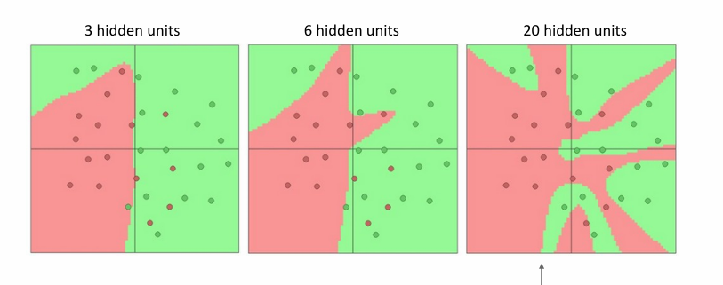

# Neural Networks

## Feature Transforms

On the geometric viewpoint of linear classifiers, we can see that the classifier is a hyperplane in the feature space.While this may not be useful in the following cases:

<figure markdown="span">
{ width="400" }
<figcaption>original space</figcaption>
</figure>

One solution is to use feature transforms to map the data to a higher dimensional space.For example, we can use the following feature transform to convert cartesian coordinates to polar coordinates:

\[
    \begin{bmatrix}
        x \\
        y
    \end{bmatrix}
    \rightarrow
    \begin{bmatrix}
        r \\
        \theta
    \end{bmatrix}
\]

where $r = \sqrt{x^2 + y^2}$ and $\theta = \tan^{-1}(y/x)$. and $x,y$ are the original features.**This is a non-linear transform.**

And we get the following result:

<figure markdown="span">
    { width="400" }
<figcaption>transformed space</figcaption>
</figure>

Now we can use a linear classifier to classify the data in the transformed space.

For image feature, there are two major features transformed from the original image:

- **Color Histogram**
- **Histogram of Oriented Gradients (HOG)**

### Color Histogram

A color histogram is a representation of the distribution of colors in an image. It is used to describe the color content of an image and is a common feature in image processing and computer vision. Here's how it works:

1. **Color Space**: The image is represented in a specific color space, such as RGB (Red, Green, Blue) or HSV (Hue, Saturation, Value).

2. **Quantization**: The color space is divided into discrete bins. For example, in an 8-bit RGB image, each color channel can have 256 possible values, but these can be grouped into fewer bins to simplify the histogram.

3. **Counting**: For each pixel in the image, the color is determined and the corresponding bin in the histogram is incremented. This results in a histogram where each bin represents the number of pixels in the image that have colors within a certain range.

4. **Normalization**: The histogram can be normalized to make it independent of the image size, allowing for comparison between images of different sizes.

Color histograms are useful for applications such as image retrieval, object recognition, and image classification, as they provide a compact summary of the color information in an image.

An example of color histogram is shown below:

<figure markdown="span">
    { width="400" }
<figcaption>color histogram</figcaption>
</figure>

### Histogram of Oriented Gradients (HOG)

The Histogram of Oriented Gradients (HOG) is a feature descriptor used in computer vision and image processing for the purpose of object detection. It is widely used in the field of object detection, such as pedestrian detection in computer vision systems.And it is some kind of dual of color histogram.

The HOG descriptor is based on the observation that local object appearance and shape can often be characterized effectively by the distribution of local intensity gradients or edge directions in a local region around each pixel.

The steps to compute the HOG descriptor are as follows:

1. **Gradient Calculation**: Compute the gradient of the image in the x and y directions.

2. **Orientation Binning**: Divide the gradient magnitude and orientation into a set of bins.

3. **Block Normalization**: Normalize the histogram of local gradients in each block.

4. **Feature Vector**: Concatenate the histogram of local gradients in all blocks to form the HOG descriptor.

The HOG descriptor is then used as input to a machine learning algorithm, such as Support Vector Machine (SVM), to train a classifier for object detection.

An example of HOG is shown below:

<figure markdown="span">
    { width="400" }
<figcaption>HOG</figcaption>
</figure>

### Bag of Words

The Bag of Words (BoW) model is a feature extraction technique commonly used in computer vision and natural language processing. In computer vision, it's often called "Bag of Visual Words" and is used to represent images as collections of visual features.

It is data driven,and usually has following steps:

- **Build code book** : Extract random patches from training images,and cluster them into 'visual words' aka 'code words'.

- **Encode images** : For each image,extract local features,and assign each 
feature to its nearest visual word.
- **Build histogram** : Count how many features were assigned to each visual word.

An example of the BoW process is shown below:

<figure markdown="span">
    { width="400" }
<figcaption>Bag of Visual Words process</figcaption>
</figure>

In real applications,we usually combine the 3 Image Features to get a better performance.

<figure markdown="span">
    { width="400" }
<figcaption>Bag of Visual Words process</figcaption>
</figure>

## Neural Networks

<figure markdown="span">
    { width="400" }
<figcaption>Neural Networks vs Image Features</figcaption>
</figure>
> Neural Networks are end-to-end,and can learn features from raw data.

In the context of machine learning, "end-to-end" refers to a system's ability to learn directly from input data to output results without intermediate manual feature extraction or other human intervention. This term is usually associated with neural networks, particularly deep learning models, rather than traditional Image Features methods.

- **Automatic Feature Learning**: Neural networks can automatically learn features from raw data without manual feature extraction steps, making the entire process from input to output a continuous learning process.
- **Direct Mapping**: In end-to-end systems, the model directly maps input data (e.g., images) to output results (e.g., classification labels) without requiring manual feature engineering.
- **Unified Framework**: The entire model is trained under a unified framework, with the loss function directly affecting the final output, guiding the parameter updates throughout the network.

In contrast, traditional Image Features methods typically require manual feature extraction before feeding these features into a separate machine learning algorithm for training and prediction, which is not considered "end-to-end."

### Neural Network Architecture

In a Linear Classifier,we have:

\[
    f(x,w,b) = w^Tx + b
\]

Now in a 2-layer Neural Network,we have:

\[
    f(x,w,b) = w_2 \sigma(w_1^Tx + b_1) + b_2
\]

where $\sigma$ is the activation function.Here we use ReLU as the activation function.Which is defined as:

\[
    \sigma(x) = \max(0,x)
\]

<figure markdown="span">
    { width="500" }
<figcaption>Neural Network Architecture</figcaption>
</figure>
> $h_i=\sigma(W1_i^Tx+b1_i)$,$s_i=W2_i^Th+b2_i$,in this case $W1(100*3072)$ and $W2(10*100)$ are the weights,and $b1(100)$ and $b2(10)$ are the biases.h is the hidden layer,and s is the output layer.

!!!info "Deep Neural Network"
    A Deep Neural Network (DNN) is a type of neural network that consists of multiple layers of neurons, allowing it to learn more complex patterns and relationships in the data.

    If there are $n$ weight matrices,then we call it a $n$-layer Neural Network.

    <figure markdown="span">
        { width="500" }
    <figcaption>six layer Neural Network</figcaption>
    </figure>

<figure markdown="span">
    { width="500" }
<figcaption>Biological Neuron and Artificial Neuron</figcaption>
</figure>
> 与生物学上的神经元类似，图中隐藏层的一个元素是其它神经元的输出累加的结果，这里的w并不是指矩阵中的元素w，而是指与其连接的神经元对应的权重。例如这里的第二个元素是$h_2=w_{21}x_1+w_{22}x_2+w_{23}x_3+b_2$。

### Activation Function

<figure markdown="span">
    { width="500" }
<figcaption>Activation Function</figcaption>
</figure>

Without the activation function,the output is still a linear combination of the inputs.Which will still not be useful when dealing with complex problems,such as the xor problem.

But with the activation function,we can do some Space Warping,which is something that feature transform cannot do, to make the data more separable.

For example

<figure markdown="span">
    { width="500" }
<figcaption>Feature Transform</figcaption>
</figure>
 
But with the activation function

<figure markdown="span">
    { align=left width="350" }
    { align=right width="350" }
</figure>

对于A区域，在两条直线上方，不变，对于B区域，在绿色直线下方，其得到的值为0，向绿色部分靠拢，对于D区域，在红色直线下方，其得到的值为0，向红色部分靠拢。对于C区域，在两条直线之间，向原点靠拢，所以最后的结果很容易被一个Hyperplane分开。

激活函数做的事相当于允许这个Hyperplane在空间中折叠，激活函数越多，折叠越多，可以拟合的函数越复杂。

<figure markdown="span">
    { width="500" }
<figcaption>Activation Function</figcaption>
</figure>

### Universal Approximation

A neural network with one hidden layer can approximate any function $f: \mathbb{R}^N \rightarrow \mathbb{R}^M$ with arbitrary precision.

<figure markdown="span">
    { width="400" }
<figcaption>Example</figcaption>
</figure>

\[
\begin{align*}
h_1 &= \max(0, w_1 \cdot x + b_1) \\
h_2 &= \max(0, w_2 \cdot x + b_2) \\
h_3 &= \max(0, w_3 \cdot x + b_3) \\
y &= u_1 \cdot h_1 + u_2 \cdot h_2 + u_3 \cdot h_3 + p \\
\end{align*}
\]

Output is a sum of shifted, scaled ReLUs:

- Flip left/right based on sign of \( w_i \)
- Slope is given by \( u_i \cdot w_i \)
- Position of "bend" given by \( b_i \)

<figure markdown="span">
    { width="400" }
<figcaption>Universal Approximation</figcaption>
</figure>

To approximate a "bump" function",we can use a two-layer ReLU network.

<figure markdown="span">
    { width="400" }
<figcaption>Bump Function</figcaption>
</figure>

For any function,we can use sufficient number of "Bump" function to approximate it.

<figure markdown="span">
    { width="400" }
<figcaption>Approximation</figcaption>
</figure>

## Convex Function

A function $f$ is convex if for any $x,y$ in the domain of $f$,the following inequality holds:

\[
    f(tx+(1-t)y)\leqslant tf(x)+(1-t)f(y)
\]

This inequality is also called the Jensen's inequality.

*Generally speaking, convex functions are easy to optimize: can derive theoretical guarantees about converging to global minimum.*

Linear classifiers optimize a convex loss function.

<figure markdown="span">
    { width="380" }
<figcaption>Convex Function</figcaption>
</figure>

In Neural Networks,most of them need nonconvex optimization ,there is few or no guarantees to converge to the global minimum.

But luckily,for most of the cases,the local minimum is also good,and finding a theoretical guarantee is a active research area.

