# Backpropagation

## Backprop with scalars

### Computational Graphs

In order to make the process of computing gradients more efficient, we can use computational graphs,a way to represent the computation of a function.

<figure markdown="span">
    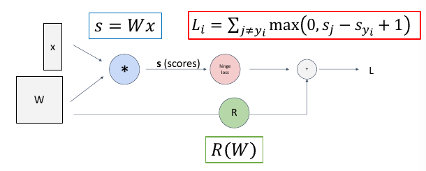{ width="400" }
<figcaption>Computational Graph</figcaption>
</figure>


In a computational graph, to compute the gradient of the function by backpropagation, we can use the chain rule.

There is two passes:

- Forward pass: Compute the value of the function.
- Backward pass: Compute the gradient of the function.


<figure markdown="span">
    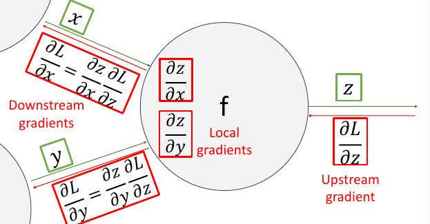{ width="400" }
<figcaption>Computing Gradients</figcaption>
</figure>

\[
    \frac{\partial z}{\partial x} =\frac{\partial y}{\partial x} \frac{\partial z}{\partial y} 
\]

where $\frac{\partial z}{\partial y}$ is called the upstream gradient, and $\frac{\partial y}{\partial x}$ is the local gradient,and $\frac{\partial z}{\partial x}$ is the downstream gradient.


for the common functions, such as sigmoid, ReLU, etc, we can compute the local gradient easily.And pack them into the computational graph instead of computing them step by step.

<figure markdown="span">
    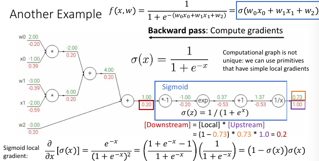{ width="400" }
<figcaption>Computational Graph</figcaption>
</figure>

### Patterns in Gradient flow

#### Add gate

An add gate is a gradient distribution gate.

<figure markdown="span">
    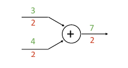{ width="400" }
<figcaption>Add Gate</figcaption>
</figure>

For example,$f(x,y)=x+y$, the gradient of $f$ with respect to $x$ and $y$ is $\frac{\partial f}{\partial x}=1$ and $\frac{\partial f}{\partial y}=1$ . So whatever the upstream gradient is, it will be distributed to the two inputs.

#### Copy gate

A copy gate is a gradient addition gate,somehow a dual of the add gate.

<figure markdown="span">
    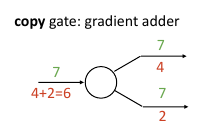{ width="400" }
<figcaption>Copy Gate</figcaption>
</figure>
For example,if we have a function $z=f(x,y)$,and $x=y=t$,

then

\[\frac{\partial z}{\partial t} = \frac{\partial x}{\partial t} \frac{\partial z}{\partial x} + \frac{\partial y}{\partial t} \frac{\partial z}{\partial y}\]

where the local stream $\frac{\partial x}{\partial t}$ and $\frac{\partial y}{\partial t}$ is $1$.


#### Multiply gate

A multiply gate is a gradient swap gate.

<figure markdown="span">
    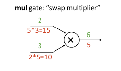{ width="400" }
<figcaption>Multiply Gate</figcaption>
</figure>

For example,if we have a function $z=xy$,

we know that $\frac{\partial z}{\partial x}=y$ and $\frac{\partial z}{\partial y}=x$,

so if we have an upstream gradient $\frac{\partial L}{\partial z}=2$,

then the downstream gradient of $x$ and $y$ are $\frac{\partial L}{\partial x}=2y$ and $\frac{\partial L}{\partial y}=2x$.


### Coding format

when we write the code, we follow the following steps:

- store every intermediate value in the forward pass.
- compute the gradient of the loss with respect to every variable in the backward pass.

For example,if we have a function as following:

<figure markdown="span">
    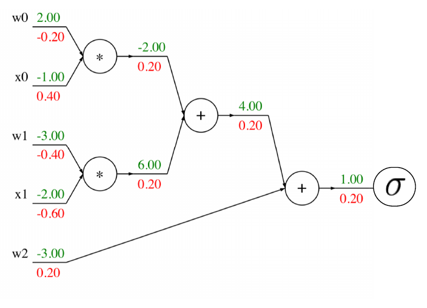{ width="400" }
<figcaption>Sample</figcaption>
</figure>

the code would be written as:

```python
def f(w0,x0,w1,x1,w2):
    s0=w0*x0
    s1=w1*x1
    s2=s0+s1
    s3=s2+w2
    L=sigmoid(s3)

    grad_L=1.0
    grad_s3=sigmoid_grad(L)*grad_L
    grad_w2=grad_s3# add gate distributes the gradient
    grad_s2=grad_s3
    grad_s0=grad_s2
    grad_s1=grad_s2
    grad_w1=grad_s1*x1# multiply gate swaps the gradient
    grad_x1=grad_s1*w1
    grad_w0=grad_s0*x0
    grad_x0=grad_s0*w0

    return L,grad_w0,grad_x0,grad_w1,grad_x1,grad_w2
```

## Backprop with vectors and matrices

### Backprop with vectors

$x \in \mathbb{R},y \in \mathbb{R}$

\[
    \dfrac{\partial y}{\partial x} \in \mathbb{R}
\]

$x \in \mathbb{R}^n,y \in \mathbb{R}$

\[
    \dfrac{\partial y}{\partial x} \in \mathbb{R}^n
\]

$x \in \mathbb{R}^n,y \in \mathbb{R}^m$

\[
    \dfrac{\partial y}{\partial x} \in \mathbb{R}^{n \times m}
\]

for example,$\mathbf{x}=(x_1,x_2,x_3)$,$\mathbf{y}=(y_1,y_2)$

the Jacobian matrix is $3 \times 2$ matrix.

\[
  \frac{\partial y}{\partial x} = \begin{bmatrix}
      \frac{\partial y_1}{\partial x_1} & \frac{\partial y_2}{\partial x_1}\\
      \frac{\partial y_1}{\partial x_2} & \frac{\partial y_2}{\partial x_2}\\
      \frac{\partial y_1}{\partial x_3} & \frac{\partial y_2}{\partial x_3}
  \end{bmatrix}
\]


!!!Note
    其实在数学上，如果$y$是$m$维，$x$是$n$维，那么传统的Jacobian 矩阵的形状经常写为 $\frac{\partial y}{\partial x} \in \mathbb{R}^{m \times n}$的。但是在这里，由于反向传播的链式法则的写法是

    \[
        \frac{\partial L}{\partial x} = \frac{\partial y}{\partial x} \frac{\partial L}{\partial y}
    \]

    而不是传统的

    \[
        \frac{\partial L}{\partial x} = \frac{\partial L}{\partial y} \frac{\partial y}{\partial x}
    \]
    
    在一维的情况下，由于乘法可以交换，所以两种写法是等价的。但是在多维的情况下，要想反转这种顺序，就需要给矩阵加上转置。

    所以我们把Jacobian 矩阵的形状写为 $\frac{\partial y}{\partial x} \in \mathbb{R}^{n \times m}$的。
    
    记忆Jacobian形状也根据链式法则的写法来记忆，即如果是第一种$\frac{\partial L}{\partial x} =  \frac{\partial L}{\partial x}\frac{\partial L}{\partial L}$，所以是L的形状在后面，

    如果是第二种$\frac{\partial L}{\partial x} =  \frac{\partial L}{\partial x}\frac{\partial x}{\partial x}$，所以是x的形状在后面。


<figure markdown="span">
    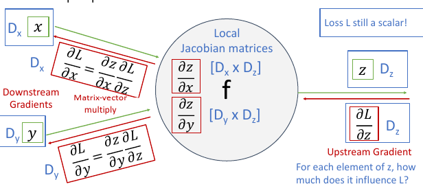{ width="400" }
<figcaption>Sketch</figcaption>
</figure>

!!!eg
    <figure markdown="span">
        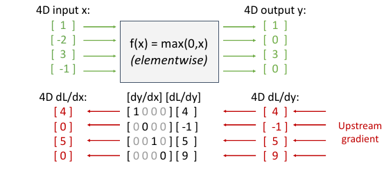{ width="400" }
    <figcaption>ReLU</figcaption>
    </figure>
    
    for the ReLU function, if we have a 4D input $x=(1,-2,3,-1)$,

    the output is $y=(1,0,3,0)$.

    the Jacobian matrix is

    \[
        \frac{\partial y}{\partial x} = \begin{bmatrix}
            1 & 0 & 0 & 0\\
            0 & 0 & 0 & 0\\
            0 & 0 & 1 & 0\\
            0 & 0 & 0 & 0
        \end{bmatrix}
    \]
    
    the upstream gradient is $\frac{\partial L}{\partial y}=(4,-1,5,9)$,

    so the downstream gradient is

    \[
        Jacobian \times upstream \ gradient = \begin{bmatrix}
            1 & 0 & 0 & 0\\
            0 & 0 & 0 & 0\\
            0 & 0 & 1 & 0\\
            0 & 0 & 0 & 0
        \end{bmatrix} \times \begin{bmatrix}
            4\\-1\\5\\9
        \end{bmatrix} = \begin{bmatrix}4\\0\\5\\0\end{bmatrix}
    \]
    
    we can see that the jacobian matrix is a sparse matrix, which is a good property for computing by human but not for computer,if we want to compute high dimensional input, the Jacobian matrix will be too large to handle.

    so it is important to come up with some tricks to make the computation more efficient.

    For the ReLU function, we can use the following trick:

    \[
       \left(\frac{\partial L}{\partial x}\right)_{i} = \begin{cases}
           \left(\frac{\partial L}{\partial y}\right)_{i} & x_{i} > 0\\
           0 & x_{i} \leq 0
       \end{cases}
    \]

    and we can get the downstream gradient directly from the upstream gradient, without computing the Jacobian matrix.

    
    
### Backprop with matrices
> or tensors

<figure markdown="span">
    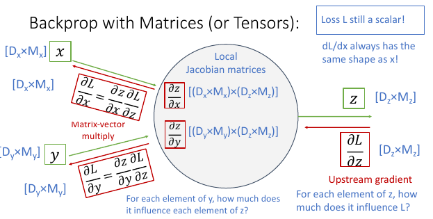{ width="400" }
<figcaption>Matrix</figcaption>
</figure>


when we compute backprop with matrices,the jacobian matrix is a 4D tensor,which is very hard to handle.so we need to use some tricks to make the computation more efficient.

One simple way is to compute the gradient element-wise.

<figure markdown="span">
    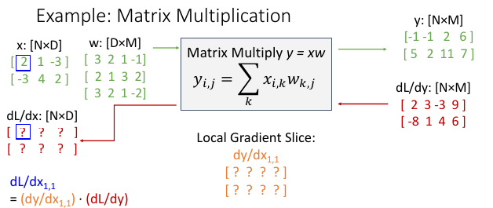{ width="400" }
<figcaption>example</figcaption>
</figure>

\[
    \frac{d L}{d x_{11}} = \frac{d y}{d x_{11}} \frac{d L}{d y}
\]


$\frac{d y}{d x_{11}}$ is a 2D matrix,

\[
    \frac{d y}{d x_{11}} = \begin{bmatrix}
        \frac{d y_{11}}{d x_{11}} & \frac{d y_{12}}{d x_{11}} &\frac{d y_{13}}{d x_{11}} & \frac{d y_{14}}{d x_{11}} \\
        \frac{d y_{21}}{d x_{11}} & \frac{d y_{22}}{d x_{11}} & \frac{d y_{23}}{d x_{11}} & \frac{d y_{24}}{d x_{11}} 
    \end{bmatrix} = \begin{bmatrix}
       W_1\\
       \mathbf{0}
    \end{bmatrix}
\]

So  

\[
    \frac{d L}{d x_{11}}=\frac{d L}{d x_{11}} \cdot \frac{d L}{d y}=3
\]

!!!Note
    这里进行的是inner product,而不是矩阵乘法。即两个矩阵对应元素相乘后的结果。可以类比2维矩阵相乘的时候，结果矩阵的第i行第j列的元素是两个矩阵的第i行和第j列的内积。

    那么对于$[(D_x \times D_y) \times (D_z \times M_z)]$的张量与$[D_z \times M_z]$的矩阵进行乘法的时候，结果张量的形状是$[D_x \times D_y]$的，其第i行第j列的元素是第一个张量第ij位置的矩阵与第二个矩阵的乘积。
    
Similarly

$\frac{d y}{d x_{ij}}$ is a 2D matrix,where the i-th row is the j-row of $W$ other rows are all zero.

And we can get the downstream gradient directly from the upstream gradient  and the matrix $W$ with:

\[
    \frac{d L}{d x} = \frac{d L}{d y} W^\mathtt{T}
\]

it seems a little bit confusing,but 

$ \frac{d L}{d x} \in \mathbb{R}^{N \times D}$

$ \frac{d L}{d y} \in \mathbb{R}^{N \times M}$

$ W \in \mathbb{R}^{D \times M}$

SO this format is the only way to make the matrix multiplication work.

!!!warning
    这不是反向传播的一种形式，而是一种用于计算的推论


We can also use the backprop to compute the hige-order derivatives.

<figure markdown="span">
    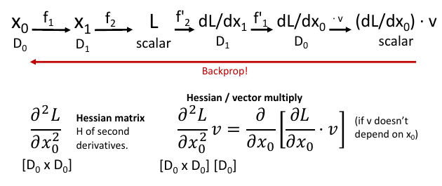{ width="400" }
<figcaption>example</figcaption>
</figure>


