# Convolutional Neural Networks

## Convolution  Layer
Neither Linearclassifier nor the two dimensional nenueral network respect the spatial structure on images!
 
they convert the 3x32x32 image into a 3072x1 vector.Stretch pixels into column.

<figure markdown="span">
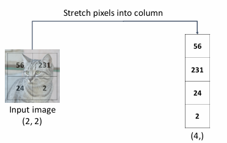{ width="500" }
</figure>

A convolutional layer applies a set of filters to the input image.

### single filter
<figure markdown="span">
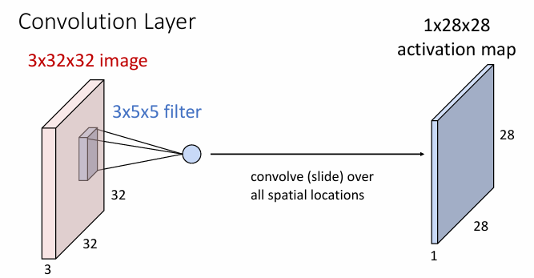{ width="500" }
</figure>
> 对于一个3x32x32的图像，如果使用1个3x5x5的filter，对于每一个位置，会进行一个3x5x5=75的两个张量的内积运算再加上一个bias，然后得到一个值。对应到输出图像的一个位置。所以输出维度是1x28x28。

### multiple filters
<figure markdown="span">
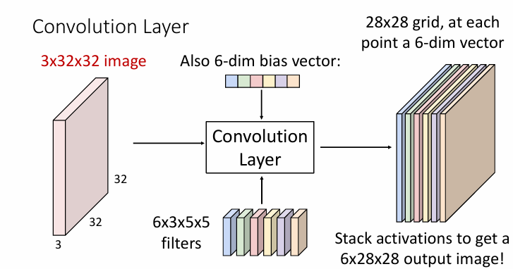{ width="500" }
</figure>
> 对于一个3x32x32的图像，如果使用6个3x5x5的filter，对于每一个位置，会进行一个3x5x5=75的两个张量的内积运算再加上一个bias，然后得到一个值。对应到输出图像的一个位置。这样的操作会进行6次，所以输出维度是6x28x28。有六个filter张量，当然也会有一个6维的bias。

For the output of the convolutional layer, we can consider them as

- 6 activation maps,each 1x28x28
- 28x28 grid,at each point,6-dimensional vector

### Multiple input

<figure markdown="span">
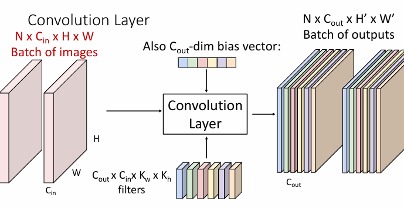{ width="500" }
</figure>
> 对于2个3x32x32的图像，如果使用6个3x5x5的filter，对于每一个位置，会进行一个3x5x5=75的两个张量的内积运算再加上一个bias，然后得到一个值。对应到输出图像的一个位置。这样的操作会进行6次，有2个输入，所以输出维度是2x6x28x28。有六个filter张量，当然也会有一个6维的bias。

Summary

- input $N \times C_{in} \times H \times W$
- filter $C_{out} \times C_{in} \times k \times k$
- bias $C_{out}$
- output $N \times C_{out} \times H' \times W'$

$C_{in}$ will disappear in the output since it is the same in the input and the filter.

### Connect multiple hidden layers

<figure markdown="span">
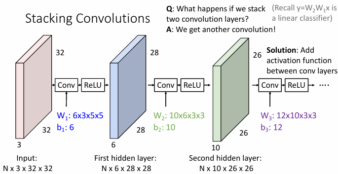{ width="500" }
</figure>
> 通过依次过滤之后得到一些activation maps，然后把这些activation maps作为输入，再进行过滤，得到更多的activation maps。如果中间只是简单的连接，那么完全可以用另外一些filters来代替，因为这一过程仍然是线性的。
所以需要激活函数(eg.ReLU)来引入非线性。这样的连接才会make sense。

!!!info "what do convolutional filters learn"
    - for linear classifier,the weight matrix(C,D);each row could reshape as a template image.多少种类别就有多少个模板。
    
    - for neural network,the weight matrix W1(H,D);each row could reshape as a  Bank of whole-image templates与Hidden Layer H个神经元一一对应。
 
    - for convolutional neural network, local image templates (Often learns oriented edges, opposing colors)，表现局部特征

    <figure markdown="span">
    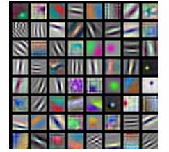{ width="500" }
    </figure>
    > AlexNet: 64 filters,each3x11x11

### padding

For input size $W\times W$,filter size $k\times k$

The output size is $(W-k+1)\times (W-k+1)$

<figure markdown="span">
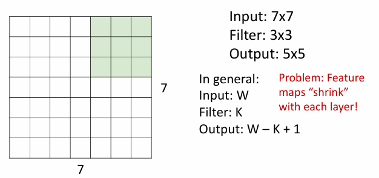{ width="500" }
</figure>
> This is a problem because the output size is smaller and smaller.

By adding additional pixels around the input image(usually 0 padding), we can control the output size.

<figure markdown="span">
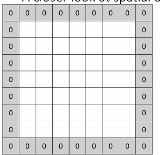{ width="500" }
</figure>

Therefore, the output size is 

\[
    (W-k+2P+1) \times (W-k+2P+1)
\]

### Receptive Field

在卷积神经网络（CNN）中，激活的感受野（receptive field）是指输入图像中对某个激活值影响最大的区域。换句话说，感受野是指在输入图像中，某个特定的神经元（或激活值）能够“看到”或“感知到”的那一部分区域。感受野的大小和位置会影响神经网络对图像特征的提取和理解。

<figure markdown="span">
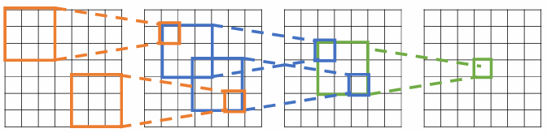{ width="500" }
</figure>
> 输出图像的某一个点，是由以输入图像对应点为中心的$K \times K$的区域决定的。$K$是filter的尺寸。

Each successive convolution adds $K – 1$ to the receptive field size
With $L$ layers the receptive field size is $1 + L * (K – 1)$

这个也不难理解，以上图最后的输出图像的中心位置的元素为例(假设其为C3，有C2，C1，C0)，它在前一层C2的感受野是$K \times K$，而这$K \times K$的区域的感受野是C3区域中，中心位于其中的filter的感受野，要考虑其大小，只需要在四个角扩展边长即可，边长会增加$(K-1)/2 * 2=K-1$.

所以对于$L$层，感受野的大小是$1$(末层感受野)+$L*(K-1)$，(L次扩展)

Problem: For large images we need many layers for each output to “see” the whole image

### Stride

 Solution: Downsample inside the network

By increasing the stride, we extend the receptive field.

Now the output size should be 

\[
    \left\lfloor \frac{W-k+2P}{S} \right\rfloor + 1
\]

> 1是一开始的位置，$(W-k+2P)/S$是接下来可选的位置。

!!!Example
    Input volume: 3 x 32 x 32, 10 3x5x5 filters with stride 1, pad 2

    Output volume: 10x((32-5+2*2)/1+1)=10x32x32 (Whoa,same size!)

    Number of learnable parameters:

    - Parameters per filter: $5 \times 5 \times 3 + 1 = 76$
    - Total: $10 \times 76 = 760$

     Number of multiply-add operations:
    
    \[
        10 \times 32 \times 32 \times 75 \times 2 = 768k
    \]

???Note "Other types of convolution"
    目前为止看到的是2D的卷积，实际上还有1D和3D的卷积。

    1D的卷积：

    - 输入：$C_{in} \times L$
    - 输出：$C_{out} \times (L-K+1)$
    - 参数：$C_{out} \times C_{in} \times K$
    <figure markdown="span">
    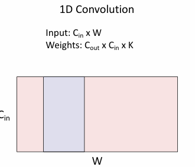{ width="400" }
    </figure>
    > 对于一个输入，一个filter对这个输入操作完后只会得到一个Vector，然后多个filter就会得到多个Vector
    
    3D的卷积：

    - 输入：$C_{in} \times H \times W \times D$
    - 输出：$C_{out} \times (H-K+1) \times (W-K+1) \times (D-K+1)$
    - 参数：$C_{out} \times C_{in} \times K \times K \times K$
    <figure markdown="span">
    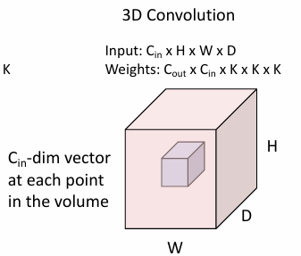{ width="400" }
    </figure>
    > 实际上已经可以总结出卷积之后的维度取决于filter在输入上移动的自由度

!!!Summary
    - Input: $C_{in} \times H \times W$
    - Hyperparameters:
        - Kernel size: $K_H \times K_W$ 
        - Number of filters: $C_{out}$
        - Padding: $P$
        - Stride: $S$
    - Weight matrix: $C_{out} \times C_{in} \times K_H \times K_W$ (giving $C_{out}$ filters of size $C_{in} \times K_H \times K_W$)
    - Bias vector: $C_{out}$
    - Output size: $C_{out} \times H' \times W'$ where:
        
        \[
            H' = \frac{H - K + 2P}{S} + 1
        \]

        \[
        W' = \frac{W - K + 2P}{S} + 1
        \]

## Pooling Layers

Pooling layer is a downsampling layer.

在卷积神经网络（CNN）中，池化（Pooling）层是一种下采样层，用于减少特征图的尺寸，同时保留重要的特征信息。池化层的主要目的是降低计算复杂度、减少内存使用，并在一定程度上控制过拟合。

### Types of Pooling

- **Max Pooling**：
   - 在一个池化窗口内选择最大值作为输出。
   - 这种方法可以保留最显著的特征。

<figure markdown="span">
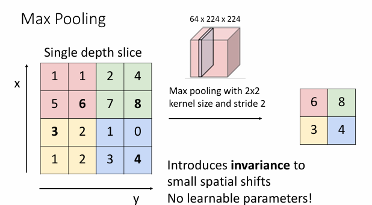{ width="400" }
</figure>

- **Average Pooling**：
   - 在一个池化窗口内计算平均值作为输出。
   - 这种方法可以平滑特征图。

### Parameters of Pooling

- **池化窗口大小（Kernel Size）**：定义了池化操作的区域大小。
- **步幅（Stride）**：定义了池化窗口在特征图上移动的步长。
- **填充（Padding）**：有时会在特征图的边缘添加额外的像素，以便池化窗口可以完全覆盖特征图。

### Effect of Pooling

- **降维**：通过减少特征图的尺寸，降低了模型的计算复杂度。
- **特征不变性**：通过池化操作，模型对输入的微小变化（如平移、旋转）具有更强的鲁棒性。
- **防止过拟合**：通过减少参数数量，降低了模型过拟合的风险。

池化层通常在卷积层之后使用，以便在提取特征后进行下采样。

!!!Summary
    Key characteristics of pooling layers:

    - **Input size**: $C \times H \times W$
    - **Hyperparameters**:
        - Kernel size: $K$
        - Stride: $S$
        - Pooling function: max pooling or average pooling
    - **Output size**: $C \times H' \times W'$ where:
        
        \[
        H' = \frac{H - K}{S} + 1
        \]
        
        \[
        W' = \frac{W - K}{S} + 1
        \]

    - **Learnable parameters**: None

    实际上是与卷积filter的作用是类似的，都是把一个局部映射成一个值来缩小，但池化比较EZ。且池化不会改变通道数。

???Example
    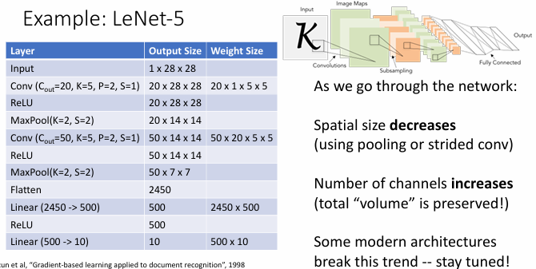
    in fact,the max pooling already add some non-linearity to the network,some after this, if we don't use ReLU,the result is still correct.

## Batch Normalization
Idea: “Normalize” the outputs of a layer so they have zero mean and unit variance

Why？Because Deep Networks are very hard to train!

进行批量归一化（Batch Normalization）的主要原因是为了减少“内部协变量偏移”（internal covariate shift），从而改善模型的优化过程。具体来说，批量归一化通过将每一层的输出标准化为零均值和单位方差，来稳定和加速神经网络的训练过程。这种标准化操作是可微的，因此可以在网络中作为一个操作符使用，并通过反向传播进行训练。

具体来说

<figure markdown="span">
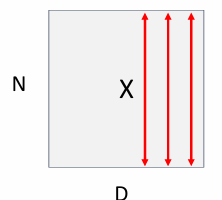{ width="400" }
</figure>

\[
    x \in \mathbb{R}^{N \times D}
\]

\[
    \mu_j = \frac{1}{m} \sum_{i=1}^{m} x_{ij}
\]

(Running) average of values seen during training

\[
    \sigma^2_j = \frac{1}{m} \sum_{i=1}^{m} (x_{ij} - \mu_j)^2
\]

(Running) average of values seen during training

\[
    \hat{x}_{ij} = \frac{x_{ij} - \mu_j}{\sqrt{\sigma^2_j + \epsilon}}
\]

> $\epsilon$ is a small constant to avoid division by zero.

\[
    y_{ij} = \gamma_j \hat{x}_{ij} + \beta_j
\]

> $\gamma$ and $\beta$ are learnable parameters,when $\gamma=\sigma$ and $\beta=\mu$,the output is the same as the input.

上面展示的是按Batch的计算，即按样本计算,最后会得到$1 \times D$的均值和方差张量，然后进行广播，得到$N \times D$的均值和方差张量。

<figure markdown="span">
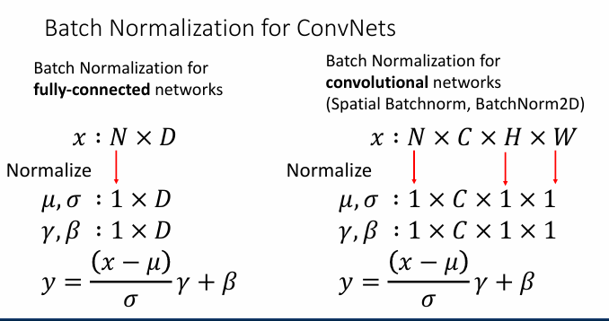{ width="300" }
</figure>

还有按layer和Instance的计算

<figure markdown="span">
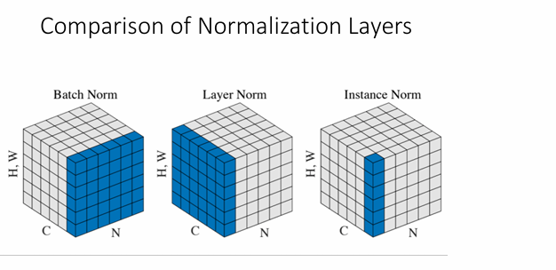{ width="400" }
<figcaption>
   the elements that are highlighted are the elements used to compute the mean and variance.
</figcaption>
</figure>

