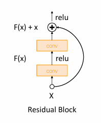

# Training Neural Networks

<div align="center">
    <span style="font-size: 24px; font-weight: bold;color:blue">One time setup</span>
</div>

## Activation Functions

### Sigmoid

<figure markdown="span">
{ width="70%" }
</figure>

Sigmoid function is defined as:

\[
\sigma(x) = \frac{1}{1 + e^{-x}}
\]

其输出在(0,1)之间，当$x$趋近于正无穷时，$\sigma(x)$趋近于1，当$x$趋近于负无穷时，$\sigma(x)$趋近于0。

主要的问题有：

- 梯度消失(Kill the gradient)：当$x$趋近于正无穷或负无穷时，$\sigma(x)$的梯度趋近于0，这会导致反向传播时出现导致梯度消失。


- 输出不是以0为中心的。也就是说，它的输出总是正的。而在神经网络中，下一层隐藏层和上一层的关系为


\[
h_i^{(\ell)} = \sum_j w_{i,j}^{(\ell)} \sigma \left( h_j^{(\ell-1)} \right) + b_i^{(\ell)}
\]

local stream对于weight matrix的求导会得到$\sigma \left( h_j^{(\ell-1)} \right)$,但是由于它总是正的，所以down stream的符号永远和upstream的符号相同。

这将会导致loss function对于weight matrix的梯度永远为正或者永远为负;如果现在有两个权重矩阵$W_1$和$W_2$

<figure markdown="span">
{ width="500" }
</figure>

假设$x$轴代表$W_1$，$y$轴代表$W_2$，一开始的loss在原点，需要朝着第四象限移动，即要求$dW_1$为正而$dW_2$为负，但是由于$\sigma \left( h_j^{(\ell-1)} \right)$总是正的，所以$dW_1$和$dW_2$的符号总是相同的，这将会导致其只能以诡异的之字形下降。

- 计算复杂度高：Sigmoid函数需要计算指数运算，在硬件实现上其计算比其他激活函数更复杂。(但是如果在GPU上计算，由于GPU移动数据的时间已经很大，往往计算时间差别不大。)

### tanh

<figure markdown="span">
{ width="400" }
</figure>

tanh函数定义为：

\[
\tanh(x) = \frac{e^x - e^{-x}}{e^x + e^{-x}}
\]

其输出在(-1,1)之间，当$x$趋近于正无穷时，$\tanh(x)$趋近于1，当$x$趋近于负无穷时，$\tanh(x)$趋近于-1。

**解决了Sigmoid的输出不是以0为中心的问题**，但是仍然有梯度消失的问题存在.


### ReLU

ReLU函数定义为：

\[
\text{ReLU}(x) = \max(0, x)
\]

**在正区域不饱和**

当输入值增加时，函数的输出不会达到最大限制。换句话说，随着输入值变得越来越大，激活函数的输出会继续增加，而不会接近一个固定的上限。

在正区域（即当 \( x > 0 \) 时），ReLU 的输出等于输入 \( x \)。这意味着当 \( x \) 增加时，输出也线性增加而不会饱和。这个特性有助于缓解深度神经网络训练中的梯度消失问题，因为对于正输入值，梯度保持显著。

相比之下，像 Sigmoid 或 tanh 这样的激活函数在正负区域都会饱和。对于较大的正输入值，Sigmoid 函数的输出接近 1，而 tanh 函数的输出也接近 1。这种饱和可能导致非常小的梯度，从而在反向传播过程中引发梯度消失问题。

同时，ReLU的计算速度比Sigmoid和tanh快很多，因为ReLU只需要一个比较运算。

<figure markdown="span">
{ width="60%" }
</figure>

不过RelU也有问题，因为它不是以0为中心的

而且存在 **Dead ReLU** 的问题，当$x<0$时，ReLU的输出为0，这会导致梯度为0，从而导致神经元死亡。

<figure markdown="span">
{ width="60%" }
<figcaption>
    dead ReLU
</figcaption>
</figure>


### Leaky ReLU

Leaky ReLU函数定义为：

\[
\text{Leaky ReLU}(x) = \max(0.01x, x)
\]

为了解决Dead ReLU的问题，Leaky ReLU引入了一个小的斜率，当$x<0$时，输出为$0.01x$。这样它就不会die。

#### Parametric ReLU

Parametric ReLU函数定义为：

\[
\text{Parametric ReLU}(x) = \max(\alpha x, x)
\]

其中$\alpha$是一个可学习的参数，可以参与反向传播.

### ELU

ELU函数定义为：

\[
\text{ELU}(x) = \begin{cases} 
    x & \text{if } x \geq 0 \\
    \alpha (e^x - 1) & \text{if } x < 0 
\end{cases}
\]

1. **更接近零均值输出**：ELU 函数的输出更接近于零均值，这有助于加速神经网络的学习过程。与 ReLU 不同，ELU 在负值区域有一个负的输出，这使得其输出的均值更接近于零，从而有助于减少偏移（bias shift）问题。


- **负饱和区域**：ELU 在负值区域有一个负的饱和输出，这与 ReLU 的零输出不同。这种特性可以帮助网络在负值区域保持一定的梯度，从而避免神经元死亡的问题。


- **相较于 Leaky ReLU 增加了一些对噪声的鲁棒性**：ELU 的负指数部分使其在负值区域的变化更加平滑，这可以增加对输入噪声的鲁棒性。相比之下，Leaky ReLU 在负值区域的线性变化可能对噪声更敏感。

这些特性使得 ELU 在某些情况下比 ReLU 和 Leaky ReLU 更加有效，尤其是在深度神经网络的训练中。


#### SeLU

SeLU函数定义为：

\[
\text{SeLU}(x) = \lambda \begin{cases} 
    x & \text{if } x \geq 0 \\
    \alpha (e^x - 1) & \text{if } x < 0 
\end{cases}
\]

通过设置 $\alpha = 1.6732632423543772848170429916717$ 和 $\lambda = 1.0507009873554804934193349852946$，可以使得其有很好的表现。


但是总的来说，使用ReLU在大部分下就足够了。

<figure markdown="span">
{ width="400" }
<figcaption>
    各种激活函数在不同神经网络中对于CIFAR-10的准确率。
</figcaption>
</figure>

## Data Preprocessing

### zero-center

对数据进行zero-center处理，即减去均值，可以将数据平移到原点附近，从而使得数据更加对称。

### normalize

对数据进行normalize处理，即除以标准差，可以使得数据更加稳定。

<figure markdown="span">
{ width="400" }
<figcaption>
    对数据进行zero-center和normalize处理后的效果。
</figcaption>
</figure>

如果不进行以上两步的处理,首先有可能会出现之字形下降的问题，其次如果说classifier穿过原点，而数据在离原点很远的地方，那么其对于微小变化会非常敏感，从而导致模型不稳定，也难以优化

<figure markdown="span">
{ width="400" }
<figcaption>
    Example
</figcaption>
</figure>


### PCA and Whitening

<figure markdown="span">
{ width="400" }
<figcaption>
    PCA and Whitening
</figcaption>
</figure>

PCA（主成分分析）的主要目的是降维，即在保留数据中大部分信息的同时，减少数据的维度。这有助于降低计算复杂度和减少噪声。


PCA通过线性变换将原始数据投影到一个新的坐标系中。这个新坐标系的轴（称为主成分）是数据方差最大的方向。第一个主成分是数据方差最大的方向，第二个主成分是与第一个主成分正交且方差次大的方向，依此类推。

计算数据的协方差矩阵。

计算协方差矩阵的特征值和特征向量。

选择前 \(k\) 个最大特征值对应的特征向量作为主成分。

将数据投影到这些主成分上。

白化的目的是将数据的特征去相关化，并使每个特征的方差为1。这有助于消除特征之间的线性相关性，使得数据在各个方向上具有相同的尺度。

白化是对PCA的进一步处理。通过对PCA变换后的数据进行缩放，使得每个主成分的方差为1。

首先进行PCA，得到主成分。

对PCA变换后的数据进行缩放，使得每个主成分的方差为1。这通常通过除以每个主成分的标准差来实现。

## Weight Initialization

对于权重矩阵的初始化也是需要考虑的，如果说权重矩阵初始化为0，那么就无法进行训练，因为所有神经元的输出都是0；常见的初始化是满足高斯分布(正态分布)，的随机初始化

```python
w = np.random.randn(Din, Dout) * 0.01
```
在numpy中np.random.randn会生成一个均值为0，方差为1的正态分布的随机数。再乘以0.01，可以使得初始的权重矩阵的值比较小,同时标准差(std)变为0.01。

在简单的网络中这表现得还不错，但是在比较大型的网络中就表现得比较差

如果说weight-scale比较小，由于activations(f(weight*input))随着神经网络的加深可能会变的集中在0附近

<figure markdown="span">
{ width="400" }
<figcaption>
    随着神经网络的加深，activations会变得很小。
</figcaption>
</figure>

这将会导致所有的输出都趋近于0，从而导致梯度消失的问题。


可是如果weight-scale比较大，神经网络的激活函数可能会进入饱和状态（saturation）。这是因为大权重会导致输入到激活函数的值变得很大，从而使得激活函数的输出趋于其极限值。(sigmoid or tanh),同样也会导致local stream=0 and no learning。


### Xavier Initialization
究其原因，我们希望恰当的初始化，使得经过一层layer后，output的分布不会发生太大的变化,对于Gaussian distribution，希望和input的std一致.

暂时忽略bias

\[
    y = W^Tx
\]

\[
    y_i=\sum_{j=1}^{D_{in}} W_{i,j}x_j
\]

假设$W$和$x$独立，$W$的每个元素也独立同分布，则

\[
    \operatorname{Var}(y_i) = D_{in} \times \operatorname{Var}(W_{i,j}) \times \operatorname{Var}(x_j) = \operatorname{Var}(x_j)
\]

那么就希望

\[
    \operatorname{Var}(W_{i,j}) = \frac{1}{D_{in}}
\]

所以在初始化时，所有weight的初始化应该满足

```python
w = np.random.randn(Din, Dout) * np.sqrt(1/Din)
```

<figure markdown="span">
{ width="400" }
<figcaption>
    初始化方式对结果的影响
</figcaption>
</figure>


### He Initialization
> ReLU

MSRA初始化，也称为He初始化，是一种用于神经网络权重初始化的方法。它是由何恺明（Kaiming He）及其同事在2015年提出的，专门为ReLU（Rectified Linear Unit）及其变体设计的初始化方法。MSRA初始化的目的是解决深层神经网络中梯度消失和梯度爆炸的问题。

MSRA初始化的基本思想是：为了保持信号在网络的前向传播和反向传播过程中具有适当的方差，权重应该根据输入的数量进行缩放。具体来说，MSRA初始化建议将权重从一个均值为0、方差为 \(\frac{2}{\text{fan\_in}}\) 的高斯分布中抽取，其中 \(\text{fan\_in}\) 是输入层的神经元数量。

```python
w = np.random.randn(Din, Dout) * np.sqrt(2/Din)
```

- **ReLU的特性**: ReLU激活函数在正区域是线性的，而在负区域输出为0。为了确保信号在通过ReLU时不会过于衰减或放大，MSRA初始化选择了 \(\frac{2}{\text{fan\_in}}\) 作为方差。这是因为ReLU激活函数会使得大约一半的输入为0，因此需要更大的方差来补偿。

- **信号的稳定性**: 通过这种初始化，信号在网络的每一层中保持稳定的方差，从而避免了梯度消失或梯度爆炸的问题。

<figure markdown="span">
{ width="400" }
<figcaption>
    ReLU的初始化方式对结果的影响
</figcaption>
</figure>

### Residual Network

<figure markdown="span">
{ width="400" }
<figcaption>
    Residual Network
</figcaption>
</figure>

如果以ReLU为激活函数，以MSRA初始化，那么Var(F(x))=Var(x),Var(F(x)+x)不等于Var(x)，解决方法是第二层权重矩阵直接初始化为0,这样就可以有Var(F(x)+x)=Var(x)。


## Regularization

除了常见的L1,L2，Elastic Net正则化之外，还有一些其他的方法。

### Dropout

Dropout 是一种用于防止神经网络过拟合的正则化技术。它通过在训练过程中随机地“丢弃”一部分神经元来实现。这种方法可以有效地减少模型对训练数据的过拟合，从而提高模型的泛化能力。

1. **随机丢弃神经元**: 在每次训练迭代中，Dropout 会以一定的概率 \( p \) 随机地将一些神经元的输出设置为零。这意味着这些神经元在当前的前向传播和反向传播中被忽略。

- **缩放激活**: 为了保持输出的期望值不变，在训练过程中，未被丢弃的神经元的输出会被缩放（通常是除以 \( 1-p \)）。这样可以确保在测试时，网络的输出不会因为Dropout而变得不稳定。

- **测试阶段**: 在测试阶段，Dropout 不会丢弃任何神经元，而是使用所有神经元的完整网络结构进行预测。

### DropConnect

DropConnect 是一种用于防止神经网络过拟合的正则化方法。与 Dropout 随机丢弃神经元不同，DropConnect 随机丢弃的是权重连接。这意味着在每次训练迭代中，网络的权重矩阵会被随机稀疏化。

- **工作原理**:
    - 在每次训练迭代中，DropConnect 会以一定的概率 \( p \) 随机地将一些权重设置为零。这意味着这些权重在当前的前向传播和反向传播中被忽略。
    - 这种方法可以看作是对权重矩阵的随机稀疏化，而不是对激活值的稀疏化。
    - 在测试阶段，DropConnect 不会丢弃任何权重，而是使用所有权重的完整网络结构进行预测。

- **优点**:
    - DropConnect 可以有效地减少模型对训练数据的过拟合，从而提高模型的泛化能力。
    - 由于它是对权重进行稀疏化，因此可以在某些情况下提供比 Dropout 更好的正则化效果。

- **实现**:
  - 在实现 DropConnect 时，通常会在每次前向传播时生成一个与权重矩阵相同大小的二进制掩码矩阵。这个掩码矩阵决定了哪些权重在当前迭代中被丢弃。

### Data Augmentation

Data Augmentation 是一种用于提高神经网络泛化能力的正则化技术。它通过在训练过程中生成新的训练样本，从而增加训练数据集的多样性。


- 在训练过程中，Data Augmentation 会对原始训练样本进行各种变换，生成新的训练样本。
- 这些变换可以是图像的旋转、翻转、裁剪、缩放等几何变换，也可以是图像的亮度、对比度、饱和度等颜色变换。


### Mixup

Mixup 是一种用于提高神经网络泛化能力的正则化技术。它通过在训练过程中生成新的训练样本，从而增加训练数据集的多样性。


例如将猫和狗的图片进行mixup，得到新的训练样本。

---
<div align="center">
    <span style="font-size: 24px; font-weight: bold;color:blue">Training dynamics</span>
</div>


## Learning rate

<figure markdown="span">
{ width="400" }
<figcaption>
    Learning rate
</figcaption>
</figure>

非常大的learning rate会导致模型震荡，甚至不收敛。

高learning rate会导致模型在训练初期就进入饱和状态，从而导致模型无法达到比较低的loss。

低learning rate会导致模型收敛速度变慢，训练时间变长。

好的learning rate应该在训练初期和训练后期都能保持一个比较好的学习速度，并把loss降到最低。

### Step decay

Step decay 是一种用于调整学习率的策略。它在训练过程中定期降低学习率。


ResNet所使用的就是这种策略

<figure markdown="span">
{ width="400" }
<figcaption>
    Step decay
</figcaption>
</figure>

### Cosine decay

Cosine decay 是一种用于调整学习率的策略。它在训练过程中使用余弦函数来调整学习率。

\[
    \alpha_t=\alpha_0\frac{1}{2}\left(1+\cos\left(\frac{t}{T}\pi\right)\right)
\]

<figure markdown="span">
{ width="400" }
<figcaption>
    Cosine decay
</figcaption>
</figure>

这个会比较好，因为它没有引入额外的超参数，只需要设置一个初始学习率和训练的epoch数。但是这本来就是需要设置的.

### linear decay

linear decay 是一种用于调整学习率的策略。它在训练过程中使用线性函数来调整学习率。

\[
    \alpha_t=\alpha_0(1-\frac{1}{T}t)
\]

### Inverse sqrt

\[
    \alpha_t=\alpha_0\frac{1}{\sqrt{t}}
\]

### Constant

\[
    \alpha_t=\alpha_0
\]

一般而言，不应该在一开始就过分关注学习率；即使使用constant，也会达到比较好的效果。


## Hyperparameter Optimization

### Grid Search

Grid Search 是一种用于超参数优化的方法。它在训练过程中使用网格搜索来调整超参数。

即给定一个超参数的搜索空间，然后在这个空间中进行搜索，找到最优的超参数。

### Random Search

Random Search 是一种用于超参数优化的方法。它在训练过程中使用随机搜索来调整超参数。

即给定一个超参数的搜索空间，然后在这个空间中进行随机搜索，找到最优的超参数。

一般而言，Random Search 比 Grid Search 效果更好，因为它允许超参数的搜索空间更大，从而找到更优的超参数，有可能某些超参数对于结果的影响并不是很大，而有些超参数对于结果的影响比较大。

例如下面的例子

<figure markdown="span">
{ width="400" }
<figcaption>
    Random Search
</figcaption>
</figure>

空间上的点代表超参数的组合，绿色的曲线代表其中一个超参数对于结果的影响，橙色的曲线代表另一个超参数对于结果的影响。可以看到，如果使用Grid Search，那么对于绿色曲线比较难找到比较好的超参数，而如果使用Random Search，那么就可以找到比较好的超参数。，因为它覆盖了更多的情况。

### Steps when training

#### Step1

**Check initial loss**

Turn off weight decay, sanity check loss at initialization

e.g. log(C) for softmax with C classes
>why? 一开始估计每个类别的概率是等可能的，即loss=\(-log(\frac{1}{C})=log(C)\)


#### Step2

**Overfit a small sample**

尝试在一小部分训练数据（大约5-10个小批量）上训练到100%的训练准确率；可以调整网络结构、学习率和权重初始化。关闭正则化。

- 如果损失没有下降，可能是学习率太低或初始化不佳。
- 如果损失爆炸到无穷大或NaN，可能是学习率太高或初始化不佳。


#### Step3

**Find LR that makes loss go down**

使用上一步中的网络结构，使用所有训练数据，开启小的权重衰减，找到一个能在大约100次迭代内显著降低损失的学习率。


#### Step4

**Coarse grid, train for ~1-5 epochs**

选择几个接近步骤3中有效的学习率和权重衰减值，训练几个模型大约1-5个周期。


#### Step5

**Refine grid, train longer**

改进步骤4中有效的学习率和权重衰减值，训练更长的时间。

#### Step6

**Look at learning curves**

如果loss一开始很平缓，有可能是初始化没做好；
如果loss一开始下降很快，有可能是学习率太高；Try decay；
如果train_acc的gap比较小，那么欠拟合；
如果val_acc的gap比较大，且train_acc上升但是val_acc下降，那么过拟合；

#### Step7

Go back to step 5;

确定好大致结构之后就开始调参。

---
<div align="center">
    <span style="font-size: 24px; font-weight: bold;color:blue">After training</span>
</div>

## Model ensembles

在神经网络中，**模型集成（Model Ensembles）** 是一种提高模型性能和泛化能力的技术。它通过结合多个模型的预测结果来获得更好的整体预测效果。以下是模型集成的关键概念：


模型集成涉及训练多个独立的模型，然后将它们的预测结果进行组合。每个模型可能在不同的数据子集上训练，或者使用不同的初始化和超参数。


通过结合多个模型的预测，集成方法可以减少单个模型的偏差和方差，从而提高整体模型的泛化能力。


- **优点**:
    - **提高准确性**: 通过结合多个模型的预测，集成方法通常能获得比单个模型更高的准确性。
    - **降低过拟合风险**: 由于集成方法结合了多个模型的预测，它们通常比单个模型更不容易过拟合。

- **缺点**:
    - **计算成本高**: 训练和评估多个模型需要更多的计算资源和时间。
    - **复杂性增加**: 管理和调试多个模型的集成可能会增加系统的复杂性。

例如在图像分类中，可以训练多个模型，然后对它们的预测结果进行平均或投票。

比如现在有10个模型，那么最终的预测结果就是这10个模型预测结果的平均值。或者使用投票的方式，选择预测结果最多的那个类别。类似于KNN的思想。

## Transfer Learning

迁移学习（Transfer Learning）是一种机器学习方法，它利用在一个任务中学到的知识来帮助解决另一个相关任务。迁移学习特别适用于当目标任务的数据有限或难以获取时。

例如在图像分类中，如果目标任务是识别1000个类别，那么可以先使用一个在ImageNet上预训练的模型，然后在这个模型上进行微调。


- **选择预训练模型**: 首先，选择一个在 ImageNet 上预训练的模型。常用的模型包括 VGG、ResNet、Inception、DenseNet 等。这些模型在 ImageNet 上已经学习到了丰富的特征表示。

- **冻结卷积层**: 通常，预训练模型的前几层（卷积层）会被保留并冻结，因为它们学习到的特征（如边缘、纹理）是通用的，不需要在目标任务中重新训练。

- **替换全连接层**: 最后的全连接层通常与 ImageNet 的 1000 个类别相关。需要将其替换为与目标任务类别数相匹配的新层。


- **微调策略**:
    - **冻结大部分层**: 只训练最后几层或新添加的层。这种方法适用于目标任务与 ImageNet 任务相似的情况。
    - **解冻部分层**: 如果目标任务与 ImageNet 任务有较大差异，可以解冻部分卷积层进行微调，以适应新任务的特征。

- **选择合适的学习率**: 微调时，通常使用较小的学习率，以避免对预训练权重进行过大的调整。

- **数据增强**: 使用数据增强技术（如旋转、翻转、缩放）来增加数据的多样性，提高模型的泛化能力。

- **数据预处理**: 确保输入图像的尺寸和格式与预训练模型的要求一致（例如，通常需要将图像缩放到 224x224 像素，并进行归一化处理）。


由于模型已经在大规模数据集上预训练，微调所需的时间通常较短。迁移学习可以显著提高目标任务的性能，特别是在数据有限的情况下。过利用预训练模型，目标任务所需的数据量可以显著减少。

