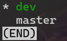
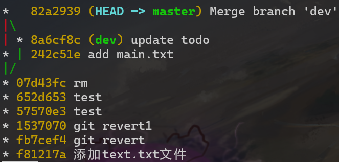
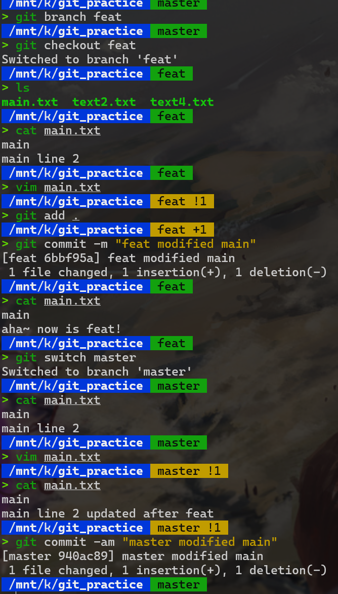
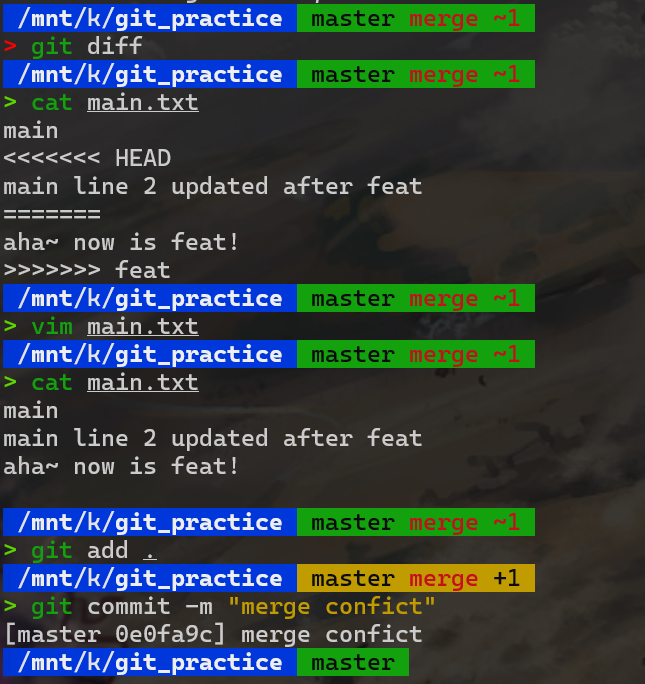
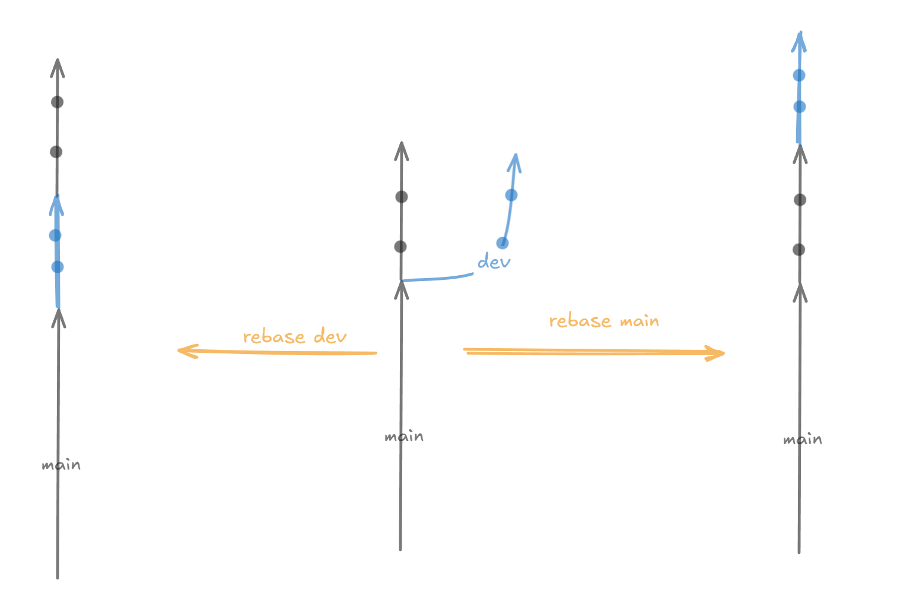
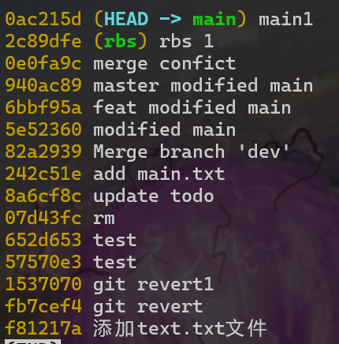
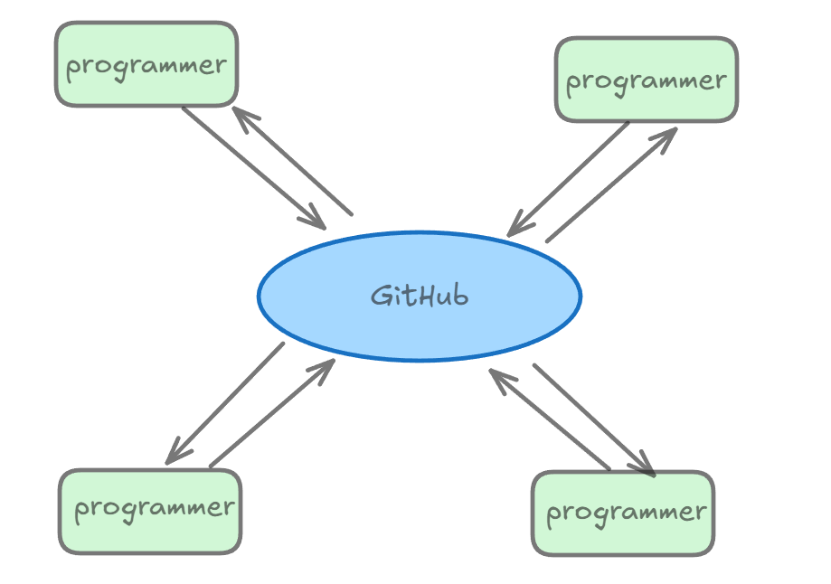

# Git 笔记

作为计科专业的学生,怎么能不会Git呢

git命令比较多,有些命令的意义比较长难以一直记住,在这里推荐一个非常好用的工具[tldr](https://tldr.sh/)，Too long don't read~


## 安装

Windows 用户可以通过[Git官网](https://git-scm.com/download/win)下载安装包进行安装

Linux 用户可以通过以下命令进行安装

```bash
sudo apt-get update
sudo apt-get install git
```

macOS 用户可以通过以下命令进行安装

```bash
brew install git
```

### 检验是否安装成功

在终端中输入以下命令,如果出现版本号,则说明安装成功

```bash
git --version
```

!!!info "git 是怎么工作的"

    首先,有以下几个概念

    1. **工作区 (Working Directory)**: 这是你在本地计算机上看到的文件和目录。你在这里进行文件的添加、修改和删除操作。

    2. **暂存区 (Staging Area)**: 当你对工作区中的文件进行修改后，可以使用 `git add` 命令将这些修改添加到暂存区。暂存区是一个临时区域,它是工作区和本地仓库的桥梁，起到缓冲的作用,用于记录即将提交的更改。

    3. **本地仓库 (Local Repository)**: 使用 `git commit` 命令将暂存区中的更改提交到本地仓库。提交后，这些更改将被记录在本地仓库的历史记录中。

    4. **远程仓库 (Remote Repository)**: 远程仓库是存储在服务器上的 Git 仓库。你可以使用 `git push` 命令将本地仓库中的更改推送到远程仓库，或者使用 `git pull` 命令从远程仓库拉取最新的更改。

    5. **版本库 (Repository)**: 版本库是 Git 用来保存项目历史记录的地方。它包含了所有提交的记录和项目的所有版本。在本地仓库中,版本库是.git文件夹,在远程仓库中,版本库是远程仓库里面的.git文件夹

    <figure markdown="span">
    { width="400" }
    <figcaption>示意图</figcaption>
    </figure>
    
    <figure markdown="span">
    { width="400" }
    <figcaption>版本库,工作区和暂存区</figcaption>
    </figure>


## 本地操作

### 初始化

创建一个文件夹,然后进入文件夹,在终端中输入以下命令

```bash
git init
```
这条命令会在当前目录下创建一个.git文件夹,这个文件夹就是版本库

<figure markdown="span">
{ width="400" }
<figcaption>初始化</figcaption>
</figure>

### 添加文件

此时 **工作区** 中有一个text.txt文件,现在我们想把这个文件添加到 **暂存区** 中

```bash
git add text.txt
```

此时 **暂存区** 中就多了一个text.txt文件，我们可以使用

```bash
git status
```

来查看此时git的状态


<figure markdown="span">
{ width="400" }
<figcaption>添加文件</figcaption>
</figure>

在这里,将文件加入暂存区后,文件就在暂存区中等待我们的提交(Commit)了

???Note "常见的 git add 的指令"
    1. 添加单个文件：
    ```bash
    git add <filename>
    ```
    例如，添加 `text.txt` 文件：
    ```bash
    git add text.txt
    ```

    2. 添加多个文件：
    ```bash
    git add <file1> <file2> <file3>
    ```
    例如，添加 `file1.txt`、`file2.txt` 和 `file3.txt`：
    ```bash
    git add file1.txt file2.txt file3.txt
    ```

    3. 添加当前目录下的所有文件：
    ```bash
    git add .
    ```
    这条命令会将当前目录下的所有更改添加到暂存区。

    4. 添加特定目录下的所有文件：
    ```bash
    git add <directory>/
    ```
    例如，添加 `src` 目录下的所有文件：
    ```bash
    git add src/
    ```

    5. 添加符合特定模式的文件：
    ```bash
    git add *.txt
    ```
    这条命令会将当前目录下所有 `.txt` 文件添加到暂存区。

    6. 交互式添加文件：
    ```bash
    git add -i
    ```
    这条命令会进入交互模式，允许你选择性地添加文件。

    7. 更新已追踪文件的更改：
    ```bash
    git add -u
    ```
    这条命令只会添加已追踪文件的更改，不会添加新文件。

    8. 添加所有更改，包括未追踪文件：
    ```bash
    git add -A
    ```
    这条命令会将所有更改（包括新文件和删除的文件）添加到暂存区。

    这些指令可以帮助你根据不同的需求灵活地将文件添加到 Git 的暂存区中。

### 提交

```bash
git commit -m "提交信息"
```
例如,在上面的例子中,我们可以运行

```bash
git commit -m "添加text.txt文件"
```
来进行提交

<figure markdown="span">
{ width="400" }
<figcaption>提交</figcaption>
</figure>

查看信息

```
[master (root-commit) f81217a] 添加text.txt文件
 1 file changed, 1 insertion(+)
 create mode 100644 text.txt
```
这条信息表示我们在 master 分支上进行了一个根提交（root-commit），提交的哈希值是 f81217a。提交信息为“添加text.txt文件”。在这次提交中，有一个文件发生了变化，进行了1次插入操作，并且创建了一个新的文件 text.txt，文件权限为 100644。文件权限 100644 表示这是一个普通文件，所有者有读写权限，组用户和其他用户有只读权限。


我们可以通过
```bash
git log
```
来查看提交信息

<figure markdown="span">
{ width="400" }
<figcaption>查看提交信息</figcaption>
</figure>

这里展示了完整的提交信息,包括提交的哈希值,提交信息,提交时间,提交者等信息，如果不想要看到这么多信息,可以使用

```bash
git log --oneline
```

<figure markdown="span">
{ width="400" }
<figcaption>查看提交信息</figcaption>
</figure>

### 版本回退

设想这样一个场景,你修改了十次文件,然后你发现你修改错了,现在你想要回到你修改前的状态,如果没有git,而你的编辑器又恰好不能一直`Ctrl+Z`到你修改前的状态,那么你只能手动一个一个的改回去,这显然是非常麻烦的,而git可以轻松的解决这个问题

Git使用git reset 命令来回退版本,git reset 命令有三个参数

1. --soft: 回退到某个版本,但是不改变任何东西
2. --hard: 回退到某个版本,并丢弃工作区,和暂存区的所有修改内容
3. --mixed: 回退到某个版本,保留工作区的修改，丢弃暂存区的修改

<figure markdown="span">
{ width="400" }
<figcaption>绿色代表保存,红色代表丢弃</figcaption>
</figure>

接下来我们具体看看它们是怎么工作的,首先我们创建两个文件,并进行两次提交

<figure markdown="span">
{ width="400" }
<figcaption>创建两个文件,并进行两次提交</figcaption>
</figure>

此时Head指向的是第三次提交,也就是master分支的最新版本,此时工作区有三个文件,暂存区为空

<div align="center">

</div>

为了方便比对三种不同指令,将这个仓库复制两个副本,分别命名为git_practice1和git_practice2


#### --soft

现在,我们修改text1.txt文件,并进行一次add

<div align="center">

</div>

现在，使用soft指令回退到第第一次提交

<div align="center">

</div>

可以看到,工作区没有发生任何变化,但是暂存区发生了变化,我们之前提交的text2和text3文件变成了new file;


<div align="center">

</div>

同时两次提交都不见了,HEAD指向了第一次提交

**soft指令保存所有的更改,仅仅在commmit种有变化,这在处理只想要回退到某个版本,但是不想要丢弃工作区,和暂存区的修改时非常有用**


#### --hard

现在,我们进入git_practice1,并进行一次add

使用hard指令回退到第一次提交

<div align="center">

</div>

可以看到,工作区,暂存区,和提交都发生了变化,工作区,暂存区,和提交都变成了第一次提交的样子

**相当于第二次第三次提交以及它们的修改都没有发生过,执行类似于`Ctrl+Z`的操作**

#### --mixed

现在,我们进入git_practice2,并进行一次add，然后使用mixed指令回退到第一次提交

<div align="center">

</div>

可以看到,暂存区空空如也,而工作区仍然是修改后的样子,**相当于进行了修改,但是没有进行任何提交**


!!!warning "注意"
    `--Hard`会丢弃所有的修改,一定要慎用,一般都推荐使用`--soft`和`--mixed`

    同时在上面我们也可以发现,使用soft的时候,不会给你任何提示,使用hard会告诉你现在head在哪里,使用mixed会告诉你unstaged changes,也就是未暂存的变化(在上面的例子中是M text.txt),即修改后(Modified)的text.txt文件从暂存区中移除

    在实践过程中,可以使用`git ls-files`来查看暂存区中的文件

    可以使用`git status`来查看工作区,暂存区,和提交的状态

#### Revert

如果仅仅想要撤销某个提交,可以使用`git revert`命令,它会创建一个新的提交,撤销之前的提交

```bash
git revert -n <commit_hash>
```

`-n`参数表示不进行提交,也就是不生成新的提交,而是直接在当前分支上进行撤销,等待你手动进行提交


如果想要撤销一系列提交,可以使用

```bash
git revert -n <start_commit>^..<end_commit>
```

例如,我们的提交链是这样的

```
A->B->C->D
```

如果我们想要撤销B和C,可以使用

```bash
git revert -n B^..C
```

### git diff

`git diff`命令可以用来查看工作区,暂存区,和提交之间的差异,也可以用来比较两个分支之间的差异,以及不同版本文件之间的差异

#### 工作区vs暂存区

默认不加任何参数,`git diff`会显示工作区与暂存区之间的差异

```bash
git diff
```

<figure markdown="span">
{ width="400" }
<figcaption>删除文件</figcaption>
</figure>

可以发现,工作区中删除了text.txt文件,而暂存区中没有发生变化

<div align="center">


</div>

这时git diff会显示工作区与暂存区之间的差异，删除了text.txt文件，什么都没有增加

#### 工作区vs提交

```
git diff <commit_hash>
```

这条命令会显示当前工作区与指定提交之间的差异

例如,我们运行

```bash
git diff HEAD
```

<figure markdown="span">
{ width="400" }
<figcaption>工作区与提交</figcaption>
</figure>

可以看到,工作区中添加了text.txt文件,而提交中没有发生变化

#### 暂存区vs提交

```
git diff --cached <commit_hash>
```

这条命令会显示暂存区与指定提交之间的差异

例如,我们运行

```bash
git diff --cached HEAD
```

<figure markdown="span">
{ width="400" }
<figcaption>未add</figcaption>
</figure>

这时候没有任何差异,因为我们没有把工作区的修改添加到暂存区

我们进行一次add

```bash
git add text.txt
git diff --cached HEAD
```

<figure markdown="span">
{ width="400" }
<figcaption>已add</figcaption>
</figure>

可以看到,暂存区与提交之间发生了差异,也就是我们添加的text.txt文件

此时运行`git ls-files`可以看到暂存区中的文件,只包含text2.txt文件

<figure markdown="span">
{ width="400" }
<figcaption>暂存区中的文件</figcaption>
</figure>

#### 提交vs提交

```
git diff <commit_hash1> <commit_hash2>
```

这条命令会显示两个提交之间的差异

例如,我们删除text.txt文件,并进行一次提交后，运行

```bash
git diff HEAD HEAD^
```

<figure markdown="span">
{ width="400" }
<figcaption>提交与提交</figcaption>
</figure>

可以看到,第二次提交与第一次提交之间发生了差异,也就是我们删除的text.txt文件

如果想要查看特定文件在不同提交之间的差异,可以使用

!!!Note
    `git diff 版本1 版本2`,指的是与版本1相比,版本2的变动；`HEAD`代表当前分支的最新版本，`HEAD^`代表当前分支的上一版本


```bash
git diff <commit_hash1> <commit_hash2>  <file_path>
```

例如,我们想要查看text.txt文件在第一次提交和第二次提交之间的差异,可以使用

```bash
git diff HEAD HEAD^ text.txt
```

#### 分支vs分支

```bash
git diff <branch1> <branch2>
```

这条命令会显示两个分支之间的差异

### 删除文件

删除文件有以下几种方式

1. `rm+add`:首先使用`rm`命令删除文件,然后使用`add`命令将删除的文件添加到暂存区

```bash
rm text.txt
git add text.txt
```

2. `git rm`:直接使用`git rm`命令删除文件,这个命令会同时将删除的文件添加到暂存区

```bash
git rm text.txt
```

相当于是`rm+add`的快捷命令

3. `git rm --cached`:这个命令会删除文件,但是不从工作区中删除,而是从暂存区中删除

```bash
git rm --cached text.txt
```
当不想提交某个文件时这条命令是好用的

我们首先在仓库里多创建几个文件,然后测试三条指令

<figure markdown="span">
{ width="400" }
<figcaption>rm+add</figcaption>
</figure>

<figure markdown="span">
{ width="400" }
<figcaption>git rm</figcaption>
</figure>

<figure markdown="span">
{ width="400" }
<figcaption>git rm --cached</figcaption>
</figure>

 最后我们commit一次,将三个文件从版本库中删除

<figure markdown="span">
{ width="400" }
<figcaption>commit</figcaption>
</figure>

可以看到删除了三个文件,但是工作区中的text4文件仍然存在(可以使用`git diff`查看版本差异进一步确认删除的文件)


### 分支

分支是Git中一个非常重要的概念，它允许你在同一个仓库中同时进行多个开发工作。分支的存在使得你可以在不影响主线代码的情况下进行开发、测试和实验。

分支的存在使得多人的协同开发变得容易,可以同时进行多个开发工作,而保持主线的稳定工作;

每个分支都有自己的提交历史,分支之间可以相互合并,也可以相互独立;

<figure markdown="span">
{ width="400" }
<figcaption>分支示意图</figcaption>
</figure>

创建一个分支，可以使用以下命令

```bash
git branch <branch_name>
```

例如,创建一个名为`dev`的分支

```bash
git branch dev
```

创建之后，可以使用`git branch`查看所有分支

```bash
git branch
```
<div align="center">

</div>
这里可以看到master和dev两个分支,前面的`*`表示当前所在的分支,也就是master分支

现在，假设我们要在dev分支上进行一系列开发工作,首先需要切换到dev分支

```bash
git checkout dev
```

!!!warning "git switch"
    使用`git checkout`命令的时候，可能会存在一些潜在的问题:除了切换分支之外,`git checkout`还可以用来恢复文件或者目录到之前的某一个状态,比如我们意外修改了某一个文件,可以使用`git checkout -- <file_path>`来恢复文件(如果暂存区中有,则恢复到暂存区中的文件,否则恢复到上一次提交的文件);而这个时候如果分支名和文件名相同,就会出现歧义,`git checkout`会默认切换分支而不是恢复文件,为了避免这种情况,可以使用`git switch`命令来切换分支;

切换之后，可以使用`git branch`查看当前所在的分支;

<figure markdown="span">
{ width="200" }
<figcaption>切换分支</figcaption>
</figure>

现在,我们在dev分支上进行一系列开发工作,添加一系列文件；

在这一过程中，我们的主线上也进行的提交

<figure markdown="span">
{ width="300" }
<figcaption>过程</figcaption>
</figure>


现在假设dev上的开发以已经完成了,我们想要将dev分支合并到master分支上,可以使用以下命令

```bash
git merge dev
```

意为将dev分支合并到 **当前所在分支** (master分支)上,合并之后,如果没有冲突,会自动进行一次commit;

<figure markdown="span">
{ width="300" }
<figcaption>git log </figcaption>
</figure>


!!!info  
    使用`git log --oneline --graph`可以查看分支合并的过程
    
    实际上,`git log`有很多参数可以使用

    - `--oneline`: 只显示一行提交信息
    - `--graph`: 显示分支合并的过程
    - `--all`: 显示所有分支的提交历史
    - `--reverse`: 逆序显示提交历史
    - `--since=<date>`: 显示从某个日期开始的提交历史
    - `--until=<date>`: 显示到某个日期为止的提交历史
    - `--author=<pattern>`: 显示某个作者的提交历史
    - `--grep=<pattern>`: 显示包含某个关键字的提交历史

    并且可以组合使用,例如`git log --oneline --graph --all`


merge结束后的分支仍然存在,如果想要删除某个分支,可以使用

```bash
git branch -d <branch_name>
```

注意`-d`只能删除已经进行过合并的分支,如果想要强制删除某个分支,可以使用

```bash
git branch -D <branch_name>
```

即使用大写的`D`

#### 分支合并冲突

假设不同的开发者同时对同一个文件的同一个地方进行修改,那么合并的时候就会发生冲突,Git会提示你发生了冲突,你需要手动解决冲突

<figure markdown="span">
{ width="400" }
<figcaption>冲突制造过程</figcaption>
</figure>

在这一过程中,我首先在分支feat上对main.txt文件进行了修改,然后进行了一次commit,然后切换到master分支,对main.txt文件相同位置进行了修改,然后进行了一次commit;

现在我们试图将feat分支合并到master分支上,会发生冲突;

此时查看main.txt文件,可以看到发生了冲突;

```text
> cat main.txt
main
<<<<<<< HEAD
main line 2 updated after feat
=======
aha~ now is feat!
>>>>>>> feat
```

<div align="center">

</div>

运行`git diff`或者直接查看发生冲突的文件都可以看到冲突;


解决冲突，保留我们想要的内容，然后进行一次commit，解决冲突；


最后我们来看看合并后的的git log

<figure markdown="span">
{ width="300" }
<figcaption>git log</figcaption>
</figure>

可以看到,master分支的提交历史中包含了feat分支的提交历史;成功合并了feat分支;

### Rebase

除了使用merge命令进行分支合并,还可以使用rebase命令进行分支合并;

与merge不同,rebase执行完毕后,会将两次分支的提交历史合并成一条线,而不是像溪流一样汇聚在一起；

<figure markdown="span">
{ width="400" }
<figcaption>示意图</figcaption>
</figure>

rebase的工作原理是，找到两个分支的共同祖先，然后从共同祖先开始，将当前分支的提交应用到目标分支上；

为了演示两种不同的合并方式,我创建了两个分支,然后进行了一系列的commit;并把这个仓库复制一遍；

现在有两个分支,分别是main和rbs,共同祖先为`merge conflict`这一次提交,两个分支各自进行了一次提交,为`main 1`和`rbs 1`;

现在，假设我们要把main分支rebase到rbs分支上

```bash
git switch main
git rebase rbs
```
这条命令会将`merge conflict`后，main分支上的提交接在rbs分支上

<figure markdown="span">
{ width="300"}
<figcaption>rebase</figcaption>
</figure>

然后再试试看rebase rbs到main上

```bash
git switch rbs
git rebase main
```

<figure markdown="span">
{ width="300"}
<figcaption>rebase</figcaption>
</figure>

可以看到两次的提交记录是不同的;

!!!note
     rebase的中文是"变基",这一含义十分清楚,再某个分支上运行`git rebase <branch_name>`命令,就是将当前分支的提交历史变基到目标分支上,即从两个分支的共同祖先开始,将当前分支的提交接在目标分支上;


## 关联远程仓库

Git的强大之处在于它能够与远程仓库进行交互,远程仓库可以是一个服务器,也可以是一个云平台,例如GitHub,GitLab,Gitee等,开发者们在自己的电脑上进行开发,然后将代码推送到远程仓库,其他人可以在远程仓库上进行协作;

这里主要介绍如何与GitHub进行交互;

<figure markdown="span">
{ width="400" }
<figcaption>示意图</figcaption>
</figure>


首先注册一个Github账号,然后创建一个仓库;例如创建一个名为`test`的仓库;

然后使用`git remote add <remote_name> <remote_url>`命令将本地仓库与远程仓库关联;

或者使用`git clone <remote_url>`命令将远程仓库克隆到本地;

然后在本地进行一系列操作,例如添加文件,进行commit,然后使用`git push <remote_name> <branch_name>`命令将本地仓库推送到远程仓库;

这一步实际上是在合并本地仓库和远程仓库;

如果是多人协作,在你push之前,可能别人已经修改过远程仓库,这时候你需要先pull一下,然后再push;

如果pull的时候发生冲突,你需要解决冲突,然后再push;

要想删除远程仓库,可以使用`git remote remove <remote_name>`


