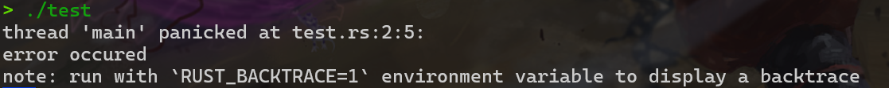

# RUST基础语法
> 据说这门语言很:ox:

## 前置

**Rust语言的特点**

- 高性能: Rust 速度惊人且内存利用率极高。由于没有运行时和垃圾回收，它能够胜任对性能要求特别高的服务，可以在嵌入式设备上运行，还能轻松和其他语言集成。

- 可靠性: Rust 丰富的类型系统和所有权模型保证了内存安全和线程安全，让您在编译期就能够消除各种各样的错误。

- 生产力 Rust 拥有出色的文档、友好的编译器和清晰的错误提示信息， 还集成了一流的工具 —— 包管理器和构建工具， 智能地自动补全和类型检验的多编辑器支持， 以及自动格式化代码等等。
  
**Rust的应用**

Rust 语言可以用于开发：

- 传统命令行程序  Rust 编译器可以直接生成目标可执行程序，不需要任何解释程序。
- Web 应用  Rust 可以被编译成 WebAssembly，WebAssembly 是一种 JavaScript 的高效替代品。
- 网络服务器  Rust 用极低的资源消耗做到安全高效，且具备很强的大规模并发处理能力，十分适合开发普通或极端的服务器程序。

- 嵌入式设备  Rust 同时具有JavaScript 一般的高效开发语法和 C 语言的执行效率，支持底层平台的开发。

RUST文件的后缀名为`.rs`,通过运行`rustc  xxx.rs`可以直接生成可执行文件

rust语言的注释方式跟C语言一样，支持两种注释方法，`//单行注释和/**/多行注释`

但是需要注意的是，在这种情况下`///` 仍然是一种合法的注释方式，所以可以用这种特殊的方式来当作文档的说明

## 变量

###  声明变量

Rust是强类型语言，具有自动判断变量类型的能力。

如果要声明变量需要使用`let`关键字

例如：
```rust
   let a = 1
```
在变量`a`被声明之后,`a`就被确定为整形 **不可变变量** 
也就是说:

- 不可以将其它类型的变量赋给它
- 不允许将小数赋给它，因为自动转换数字精度有损失，Rust 语言不允许精度有损失的自动数据类型转换。
- 不允许对它重新赋其他值


如果想要`a`可以被重新赋值，只需要在`a`前面加一个`mut`（mutable），这样`a`就变成了可变的变量

例如：
```rust
   let mut a = 1
   a = 2
```

!!!常量与不可变变量的区别
    不可变变量仍然是变量，也就是说可以对它**重新定义**，例如：
    ```rust
    let a = 123;   // 可以编译，但可能有警告，因为该变量没有被使用
    let a = 456;   //这里用了let重新绑定变量对应的值，没有直接对它赋值
    ```
    但是如果是常量，就不允许对它进行任何改变的操作
    ```rust
    const a: i32 = 123;
    let a = 456;
    ```
    这种不可变变量的名称可以被重新绑定的机制叫做**重影(shadowing)**

    ```rust
    fn main() {
    let x = 5;
    let x = x + 1;
    let x = x * 2;
    println!("The value of x is: {}", x);
    }
    ```
    程序运行结果

    ```rust
    The value of x is: 12
    ```

### 数据类型

**整数类型**

整数型简称整型，按照比特位长度和有无符号分为以下种类：

|位长度	|有符号	|无符号|
|------|------|-----|
|8-bit	|i8	|u8|
|16-bit	|i16|	u16|
|32-bit	|i32	|u32|
|64-bit	|i64	|u64|
|128-bit	|i128	|u128|
|arch	|isize	|usize|

isize 和 usize 两种整数类型是用来衡量数据大小的，它们的位长度取决于所运行的目标平台，如果是 32 位架构的处理器将使用 32 位位长度整型

rust中可以用不同的方式表示整数

|进制	|例|
|------|-----|
|十进制	|98_222|
|十六进制|	0xff|
|八进制	|0o77|
|二进制	|0b1111_0000|
|字节(只能表示 u8 型)|	b'A'|

!!!example
    虽然 Rust 有自动判断类型的功能，但有些情况下声明类型更加方便：
    ```rust
    let a: u64 = 1;
    ```
    这里声明了 `a` 为无符号 64 位整型变量，如果没有声明类型，`a` 将自动被判断为有符号 32 位整型变量，这对于 `a` 的取值范围有很大的影响。


**浮点数型(Floating-Point)**

Rust 与其它语言一样支持 32 位浮点数（f32）和 64 位浮点数（f64）。默认情况下，64.0 将表示 64 位浮点数，因为现代计算机处理器对两种浮点数计算的速度几乎相同，但 64 位浮点数精度更高。

实例

```rust
fn main() {
    let x = 2.0; // f64
    let y: f32 = 3.0; // f32
}
```

rust 同时也支持基本的数学运算，但是不支持C语言里面有的`++`和`--`,因为这两个运算符出现在变量的前后会影响代码可读性，减弱了开发者对变量改变的意识能力。

基本的四则运算有`+(加)`,`-(减)`,`*(乘)`,`/(除)`,`%(mod)`


**bool类型**

bool值只能为true或者false

**字符型**
>字符型用 char 表示。
>Rust的 char 类型大小为 4 个字节，代表 Unicode标量值，这意味着它可以支持中文，日文和韩文字符等非英文字符甚至表情符号和零宽度空格在 Rust 中都是有效的 char 值。
>Unicode 值的范围从 U+0000 到 U+D7FF 和 U+E000 到 U+10FFFF （包括两端）。 但是，"字符"这个概念并不存在于 Unicode 中，因此您对"字符"是什么的直觉可能与Rust中的字符概念不匹配。所以一般推荐使用字符串储存 UTF-8 文字（非英文字符尽可能地出现在字符串中）。

**注意**：由于中文文字编码有两种（GBK 和 UTF-8），所以编程中使用中文字符串有可能导致乱码的出现，这是因为源程序与命令行的文字编码不一致，所以在 Rust 中字符串和字符都必须使用 UTF-8 编码，否则编译器会报错。


**复合类型**

跟python类似,rust中有

- 元组`()`,可以包含不同的数据类型
```rust
let tup: (i32, f64, u8) = (500, 6.4, 1);
// tup.0 等于 500
// tup.1 等于 6.4
// tup.2 等于 1
let (x, y, z) = tup;
// y 等于 6.4
```   

- 数组`[]`,同类型数据
```rust
let a = [1, 2, 3, 4, 5];
// a 是一个长度为 5 的整型数组

let b = ["January", "February", "March"];
// b 是一个长度为 3 的字符串数组

let c: [i32; 5] = [1, 2, 3, 4, 5];
// c 是一个长度为 5 的 i32 数组

let d = [3; 5];
// 等同于 let d = [3, 3, 3, 3, 3];

let first = a[0];
let second = a[1];
// 数组访问

a[0] = 123; // 错误：数组 a 不可变
let mut a = [1, 2, 3];
a[0] = 4; // 正确
```

## 函数

### 基本结构

rust函数的结构和C语言类似,其基本结构为

```rust
fn <函数名>(<参数>)<函数体>

```

用到的函数需要在main函数里面调用，但是并不需要在调用之前出现

!!!example
    ```rust
    fn main() {
        println!("Hello, world!");
        another_function();
    }
    fn another_function() {
        println!("Hello, runoob!");
    }
    ```

### 函数参数
Rust 中定义函数如果需要具备参数必须声明参数名称和类型：

!!!example
    ```rust
    fn main() {
        another_function(5, 6);
    }

    fn another_function(x: i32, y: i32) {
        println!("x 的值为 : {}", x);
        println!("y 的值为 : {}", y);
    }
    ```
    运行结果
    ```
    x 的值为 : 5
    y 的值为 : 6
    ```

### 函数体的语句和表达式

Rust 函数体由一系列可以  以表达式（Expression）结尾 （在这里断句） 的语句（Statement）组成。

语句是执行某些操作且没有返回值的步骤。例如：
```rust
let a = 6;//没有返回值
let b=(let a = 6;)//语句不正确
```
表达式有计算步骤且有返回值

在Rust 中可以在一个用 `{}`包括的块里编写一个较为复杂的表达式：

```rust
fn main() {
    let x = 5;

    let y = {
        let x = 3;
        x + 1//可以理解为局部变量
    };//和y=连在一起是一条语句

    println!("x 的值为 : {}", x);
    println!("y 的值为 : {}", y);
}
```
最后x的值为5，y的值为3

这段程序中包括了一个表达式块，在块中可以使用函数语句，最后一个步骤是表达式，此表达式的结果值是整个表达式块所代表的值。这种表达式块叫做函数体表达式。

!!!danger
    `x + 1` 之后没有分号，否则它将变成一条语句！

### 返回值

不同于C语言，RUST函数既可以嵌套使用也可以嵌套定义

```rust
   fn main() {
    fn five() -> i32 {
        5//表达式，不能加分号
    }//用{}来创建一个作用域,不用分号
    println!("five() 的值为: {}", five());
   }
```

上面的例子中，在main函数里面定义了一个`five()`，返回类型使用`->`在参数声明之后指明，不是`:`,在函数体中，随时都可以以 return 关键字结束函数运行并返回一个类型合适的值。这也是最接近大多数开发者经验的做法：
!!!example
    ```rust
    fn add(a: i32, b: i32) -> i32 {
    return a + b;
    }
    ```

!!!danger
    注意：函数体表达式并不能等同于函数体，它不能使用 return 关键字。


## 条件语句
 
RUST中的条件语句与C语言类似
例如
```rust
let num=3
if num<5
{
    println!("less than five")
}
else if num==5{
    println!("equal to five")
}
else {
    println!("bigger than five")
}
```
但是有几点需要注意

- 条件表达式不需要用`()`括起来,注意是不需要而不是不允许
- RUST中的`if`语句不存在单句不用`{}`的规则，一个块还是需要括起来的
- RUST中的条件表达式必须是bool类型的，不允许像C中允许的非零即可判断为真，例如下面的程序是非法的
```rust
  fn main() { 
  let number = 3; 
  if number {   // 报错，expected `bool`, found integerrustc(E0308)
      println!("Yes");
  } 
  }
```

!!!Note
    ```rust
    if <condition> { block 1 } else { block 2 }
    ```
    这种结构下的block也可以是函数体表达式
    用法例如
    ```rust
    let a=true;
    let num = if a {1} else {-1};
    println!("number 为 {}", num);
    ``` 
    这样就实现了三元运算表达式`A?B:C`的效果

## 循环

### while循环

例如
```rust
while i>0{
    i=i-1;
}
```

### for循环

跟C语言的for循环相比，rust语言的for循环更加类似于python

```rust
   fn main() { 
    let a = [10, 20, 30, 40, 50]; 
    for i in a.iter() { //a.iter() 代表 a 的迭代器（iterator）
        println!("值为 : {}", i); 
    } 
   }
   fn main() { 
    let a = [10, 20, 30, 40, 50]; 
    for i in 0..5 { //0..5的用法相当于range(0,5)
        println!("a[{}] = {}", i, a[i]); 
    } 
}
```

### loop循环

rust比较有特点，当我们想使用无限循环的时候，不必`while true{}`而本身就内置有`loop`结构无限循环


```rust
    fn main() { 
    let s = ['R', 'U', 'N', 'O', 'O', 'B']; 
    let mut i = 0; 
    loop { 
        let ch = s[i]; 
        if ch == 'O' { 
            break ; 
        } 
        println!("\'{}\'", ch);
        i += 1; 
    } 
}
```
`loop`循环的`break`也可以通过携带关键字来向外部返回一个值,作用类似于`return`

```rust
   fn main() { 
    let s = ['R', 'U', 'N', 'O', 'O', 'B']; 
    let mut i = 0; 
    let location = loop { 
        let ch = s[i];
        if ch == 'O' { 
            break i; 
        } 
        i += 1; 
    }; 
    println!(" \'O\' 的索引为 {}", location); 
}
```

## 迭代器

>Rust 中的迭代器是一种方便、高效的数据遍历方法，它提供了一种抽象的方式来访问集合中的每个元素，而不需要显式地管理索引或循环。

>迭代器允许你以一种声明式的方式来遍历序列，如数组、切片、链表等集合类型的元素。

>迭代器背后的核心思想是将数据处理过程与数据本身分离，使代码更清晰、更易读、更易维护。

**迭代器遵循以下原则：**

- **惰性求值**：迭代器不会立即计算其元素，而是在需要时才计算，这使得迭代器可以用于处理无限序列。例如，当调用 `map()` 或 `filter()` 方法时，并不会立即对集合进行转换或过滤，而是返回一个新的迭代器，只有当真正需要获取数据时，才会对数据进行转换或过滤。

- **消费性**：在迭代器完成迭代后，它所迭代的集合将被消费，即集合的所有权被转移给迭代器，集合不能再被使用。

- **不可变访问**：迭代器默认以不可变方式访问其元素，这意味着在迭代过程中不能修改元素。

- **所有权**：迭代器可以处理拥有或借用的元素。当迭代器借用元素时，它不会取得元素的所有权。例如，`iter()` 方法返回的是一个借用迭代器，而 `into_iter()` 方法返回的是一个获取所有权的迭代器。


### 创建迭代器

- 使用`iter()`方法创建借用迭代器
```rust
let vec = vec![1, 2, 3, 4, 5];
let iter = vec.iter();
```
!!!代码解释
    `let vec`:
    `let` 关键字用于声明变量，`vec` 是变量的名称。在这个例子中，`vec` 将被绑定到一个 `Vec<i32>` 对象上。

    `vec![]` 宏:

    `vec![]` 是一个宏，用于创建一个新的 `Vec`（动态数组）。`Vec` 是 Rust 标准库提供的一个通用集合类型，可以在运行时动态增长。
    通过 `vec![]` 宏，可以直接创建一个包含初始元素的向量。
    `[1, 2, 3, 4, 5]`:

    方括号内的数字 1, 2, 3, 4, 5 是 `Vec` 的初始元素。
    在这个例子中，`vec!` 宏创建了一个 `Vec<i32>` 类型的向量，其中包含了这五个整数。
- 使用` iter_mut()` 方法创建可变借用迭代器
```rust
let mut vec = vec![1, 2, 3, 4, 5];
let iter_mut = vec.iter_mut();
```

- 使用 `into_iter()` 方法创建获取所有权的迭代器：
```rust
let vec = vec![1, 2, 3, 4, 5];
let into_iter = vec.into_iter();
```

### 迭代器方法

- `map()`对每个元素应用特定的转换函数
```rust
let vec = vec![1, 2, 3, 4, 5];
let squared_vec: Vec<i32> = vec.iter().map(|x| x * x).collect();
```
首先定义了一个包含整数的数组，然后使用 `iter()` 方法获取数组的迭代器，接着使用迭代器的 `map()` 方法对数组中的每个元素进行平方运算，并使用 `collect()` 方法将结果收集到一个新的数组 `squared_vec` 中。最后输出了平方后的数组。

- `filter()`根据特定的条件过滤集合中的元素
```rust
let vec = vec![1, 2, 3, 4, 5];
let filtered_vec: Vec<i32> = vec.into_iter().filter(|&x| x % 2 == 0).collect();
```
原理类似

- `fold()`：对集合中的元素进行累积处理。
- `skip()`：跳过指定数量的元素。
- `take()`：获取指定数量的元素。
- `enumerate()`：为每个元素提供索引。
> 感觉记不住，反正先记着，具体用到的时候再搜就行了:grin:

### for循环遍历迭代器
Rust 提供了 for 循环语法来遍历迭代器中的元素，是一种更加简洁和直观的遍历方式。

Rust 的 for 循环底层实际上是使用迭代器的。

```rust
let vec = vec![1, 2, 3, 4, 5];
for &num in vec.iter() {//&代表借用
    println!("{}", num);
}
```

### 消费迭代器
使用迭代器直到它被完全消耗
```rust
let arr = vec![1, 2, 3];
let mut iter = arr.into_iter();
while let Some(val) = iter.next() {
    println!("{}", val);
}
```

### 适配器
迭代器适配器是一系列提供给迭代器的函数，它们可以修改迭代器的行为。例如 map, filter, take 等。
```rust
let arr = [1, 2, 3, 4, 5];
let even_numbers: Vec<_> = arr.into_iter().filter(|&x| x % 2 == 0).collect();
```

### 迭代器链
可以将多个迭代器适配器链接在一起，形成迭代器链。
```rust
use std::iter::Peekable;

let arr = [1, 2, 3, 4, 5];
let mut iter = arr.into_iter().peekable();
while let Some(val) = iter.next() {
    if val % 2 == 0 {
        continue;
    }
    println!("{}", val);
}
```

### 收集器

可以使用`collect`方法将迭代器的元素收集到某种集合中

### 其他

迭代器的生命周期与它所迭代的元素的生命周期相关联。迭代器可以借用元素，也可以取得元素的所有权。这在迭代器的实现中通过生命周期参数来控制。

**迭代器与闭包**
迭代器适配器经常与闭包一起使用，闭包允许你为迭代器操作提供定制逻辑。

**迭代器和性能**

迭代器通常是非常高效的，因为它们允许编译器做出优化。例如，编译器可以内联迭代器适配器的调用，并且可以利用迭代器的惰性求值特性。、

### 附录:迭代器方法
| 方法名       | 描述                          | 示例                                                                 |
| ------------ | ----------------------------- | -------------------------------------------------------------------- |
| `next()`     | 返回迭代器中的下一个元素。    | `let mut iter = (1..5).into_iter(); while let Some(val) = iter.next() { println!("{}", val); }` |
| `size_hint()`| 返回迭代器中剩余元素数量的下界和上界。 | `let iter = (1..10).into_iter(); println!("{:?}", iter.size_hint());` |
| `count()`    | 计算迭代器中元素的数量。      | `let count = (1..10).into_iter().count();`                           |
| `nth()`      | 返回迭代器中的第 n 个元素。    | `let third = (0..10).into_iter().nth(2);`                            |
| `last()`     | 返回迭代器中的最后一个元素。  | `let last = (1..5).into_iter().last();`                              |
| `all()`      | 如果迭代器中的所有元素都满足某个条件，返回 `true`。 | `let all_positive = (1..5).into_iter().all(|x| x > 0);`              |
| `any()`      | 如果迭代器中的至少一个元素满足某个条件，返回 `true`。 | `let any_negative = (1..5).into_iter().any(|x| x < 0);`              |
| `find()`     | 返回迭代器中第一个满足某条件的元素。 | `let first_even = (1..10).into_iter().find(|x| x % 2 == 0);`         |
| `find_map()` | 对迭代器的元素应用一个函数，返回第一个返回 `Some` 的结果。 | `let first_letter = "hello".chars().find_map(|c| if c.is_alphabetic() { Some(c) } else { None });` |
| `map()`      | 对迭代器中的每个元素应用一个函数。 | `let squares: Vec<i32> = (1..5).into_iter().map(|x| x * x).collect();` |
| `filter()`   | 保留迭代器中满足某个条件的元素。 | `let evens: Vec<i32> = (1..10).into_iter().filter(|x| x % 2 == 0).collect();` |
| `filter_map()`       | 对迭代器中的元素应用一个函数，如果该函数返回 `Some`，则保留结果。               | `let chars: Vec<char> = "hello".chars().filter_map(|c| if c.is_alphabetic() { Some(c.to_ascii_uppercase()) } else { None }).collect();` |
| `map_while()`        | 对迭代器中的元素应用一个函数，直到函数返回 `None`。                               | `let first_three = (1..).into_iter().map_while(|x| if x <= 3 { Some(x) } else { None });` |
| `take_while()`       | 从迭代器中取出满足某个条件的元素，直到不满足为止。                               | `let first_five = (1..10).into_iter().take_while(|x| x <= 5).collect::<Vec<_>>();` |
| `skip_while()`       | 跳过迭代器中满足某个条件的元素，直到不满足为止。                                 | `let odds: Vec<i32> = (1..10).into_iter().skip_while(|x| x % 2 == 0).collect();` |
| `for_each()`         | 对迭代器中的每个元素执行某种操作。                                               | `let mut counter = 0; (1..5).into_iter().for_each(|x| counter += x);` |
| `fold()`             | 对迭代器中的元素进行折叠，使用一个累加器。                                       | `let sum: i32 = (1..5).into_iter().fold(0, |acc, x| acc + x);`       |
| `try_fold()`         | 对迭代器中的元素进行折叠，可能在遇到错误时提前返回。                             | `let result: Result<i32, &str> = (1..5).into_iter().try_fold(0, |acc, x| if x == 3 { Err("Found the number 3") } else { Ok(acc + x) });` |
| `scan()`             | 对迭代器中的元素进行状态化的折叠。                                               | `let sum: Vec<i32> = (1..5).into_iter().scan(0, |acc, x| { *acc += x; Some(*acc) }).collect();` |
| `take()`             | 从迭代器中取出最多 n 个元素。                                                    | `let first_five = (1..10).into_iter().take(5).collect::<Vec<_>>();` |
| `skip()`             | 跳过迭代器中的前 n 个元素。                                                      | `let after_five = (1..10).into_iter().skip(5).collect::<Vec<_>>();` |
| `zip()`              | 将两个迭代器中的元素打包成元组。                                                 | `let zipped = (1..3).zip(&['a', 'b', 'c']).collect::<Vec<_>>();`     |
| `cycle()`            | 重复迭代器中的元素，直至停止。                                                   | `let repeated = (1..3).into_iter().cycle().take(7).collect::<Vec<_>>();` |
| `chain()`            | 连接多个迭代器。                                                                 | `let combined = (1..3).chain(4..6).collect::<Vec<_>>();`             |
| `rev()`              | 反转迭代器中的元素顺序。                                                         | `let reversed = (1..4).into_iter().rev().collect::<Vec<_>>();`       |
| `enumerate()`        | 为迭代器中的每个元素添加索引。                                                   | `let enumerated = (1..4).into_iter().enumerate().collect::<Vec<_>>();` |
| `peeking_take_while()` | 取出满足条件的元素，同时保留迭代器的状态，可以继续取出后续元素。                 | `let (first, rest) = (1..10).into_iter().peeking_take_while(|&x| x < 5);` |
| `step_by()`          | 按照指定的步长返回迭代器中的元素。                                               | `let even_numbers = (0..10).into_iter().step_by(2).collect::<Vec<_>>();` |
| `fuse()`             | 创建一个额外的迭代器，它在迭代结束后仍然可以调用 `next()` 方法。                  | `let mut iter = (1..5).into_iter().fuse(); while iter.next().is_some() {}` |
| `inspect()`          | 在取出每个元素时执行一个闭包，但不改变元素。                                     | `let mut counter = 0; (1..5).into_iter().inspect(|x| println!("Inspecting: {}", x)).for_each(|x| println!("Processing: {}", x));` |
| `same_items()`       | 比较两个迭代器是否产生相同的元素序列。                                           | `let equal = (1..5).into_iter().same_items((1..5).into_iter());`     |

## 闭包

Rust 中的闭包是一种匿名函数，它们可以捕获并存储其环境中的变量。

闭包允许在其定义的作用域之外访问变量，并且可以在需要时将其移动或借用给闭包。

闭包在 Rust 中被广泛应用于函数式编程、并发编程和事件驱动编程等领域。

闭包在 Rust 中非常有用，因为它们提供了一种简洁的方式来编写和使用函数。

以下是 Rust 闭包的一些关键特性和用法：
 
### 闭包的声明

闭包的语法声明
```
|参数···|<表达式>
```

其中参数可以有类型注解,也可以省略,RUST编译器会根据上下文推断它们
```rust
let add_one = |x:i32| x+1;
```
闭包可以有0个或者多个参数,并且可以返回一个值,可以像函数一样被调用

```rust
let calculate = |a,b,c| a*c+b;
let result = calculate(1,2,3)
```
闭包有点像python中的`lambda`语句，闭包在 Rust 中类似于匿名函数，可以在代码中以 {} 语法块的形式定义，使用 || 符号来表示参数列表

### 捕获外部变量

闭包可以捕获周围环境中的变量，这意味着它可以访问定义闭包时所在作用域中的变量。

!!!example
    ```rust
    let x = 5;
    let square = |num| num * x;
    println!("{}", square(3)); // 输出: 15
    ``` 

!!!移动与借用
    闭包可以通过 `move` 关键字获取外部变量的所有权，或者通过借用的方式获取外部变量的引用。例如：
    ```rust
    let x = 10;
    let add_x = |y| x + y;
    println!("{}", add_x(5)); // 输出 15
    println!("{}", x); // 仍然可以使用 x
    ```
    通过在闭包前添加 `move` 关键字，闭包会获取它捕获的环境变量的所有权。这意味着这些变量的所有权会从外部作用域转移到闭包内部，外部作用域将无法再使用这些变量。例如：
    ```rust
    let s = String::from("hello");
    let print_s = move || println!("{}", s);
    print_s(); // 输出 "hello"
    // println!("{}", s); // 这行代码将会报错，因为 s 的所有权已经被转移给了闭包
    ```
    `String::from("hello")`: 这是一个调用 `String` 类型的关联函数 `from`，用于将一个字面量字符串`（"hello"）`转换为一个 `String` 类型。

    `String` 类型:

    在 Rust 中，字符串有两种主要的表示形式：`&str` 和 `String`。
    `&str` 是一种切片，通常表示在编译时已知长度的不可变字符串。
    `String` 是一种堆分配的可变字符串，适用于在运行时可能需要修改或扩展的字符串。
    
    `String::from:`

    `String::from` 是 `String` 类型的一个关联函数，它用于从 `&str` 类型创建一个 `String` 类型的值。
    在这个例子中，`String::from("hello")`创建了一个新的 `String`，其中包含了字符串 `"hello"` 的内容。
    
    分配和所有权:

    `String::from("hello")` 创建的 `String` 对象在堆上分配了内存，并且拥有该内存的所有权。
    变量 `s` 获得了这个 `String` 的所有权，这意味着当 s 作用域结束时，Rust 会自动释放 `s` 所占用的内存。

### 迭代器中的闭包

闭包在rust中经常与迭代器一起使用，用于对集合中的元素进行处理

例如之前提过的`map`方法

```rust
let vec = vec![1, 2, 3];
let squared_vec: Vec<i32> = vec.iter().map(|x| x * x).collect();
println!("{:?}", squared_vec); // 输出: [1, 4, 9]
```

在这个例子中，闭包`|x| x*x`被传递给`map()`对集合中的每一个元素进行平方操作

**闭包作为参数和返回值**

闭包可以作为参数传递给函数，也可以作为函数的返回值。

```rust
// 定义一个函数，接受一个闭包作为参数，将闭包应用到给定的数字上
fn apply_operation<F>(num: i32, operation: F) -> i32
where
  F: Fn(i32) -> i32,
{
  operation(num)
}

// 主函数
fn main() {
  // 定义一个数字
  let num = 5;

  // 定义一个闭包，用于对数字进行平方运算
  let square = |x| x * x;

  // 调用函数，并传入闭包作为参数，对数字进行平方运算
  let result = apply_operation(num, square);

  // 输出结果
  println!("Square of {} is {}", num, result);
}
```

!!!Info
     `apply_operation` 函数
    
    `fn apply_operation<F>(num: i32, operation: F) -> i32`:

    这是一个函数定义。
    
    - `apply_operation` 函数接受两个参数并返回一个 `i32` 类型的值。
    - `num: i32`: 第一个参数 `num` 是一个 `i32` 类型的整数。
    - `operation: F`: 第二个参数 `operation` 是一个泛型 `F`，它代表一个闭包（或函数）。
    - `-> i32`: 函数返回一个 `i32` 类型的值。
    
    `where F: Fn(i32) -> i32`:

    这是一个约束，规定了泛型 `F`必须实现 `Fn(i32) -> i32` 这个特性。换句话说，`F` 必须是一个接受一个 `i32` 参数并返回一个 `i32` 值的闭包或函数。
    
    `operation(num)`:

    这行代码调用了传入的闭包 `operation`，并将 `num` 作为参数传递给它。闭包的执行结果将作为 `apply_operation` 函数的返回值。

    `let result = apply_operation(num, square);`:

    这行代码调用 `apply_operation` 函数，将 `num` 和 `square` 闭包作为参数传入。
    `apply_operation` 函数执行 `square(num)`，即计算 5 的平方，并将结果返回给 `result` 变量。

    最后程序会输出Square of 5 is 25

## RUST所有权
!!!Abstract
    计算机程序必须在运行时管理它们所使用的内存资源。

    大多数的编程语言都有管理内存的功能：

    C/C++ 这样的语言主要通过手动方式管理内存，开发者需要手动的申请和释放内存资源。但为了提高开发效率，只要不影响程序功能的实现，许多开发者没有及时释放内存的习惯。所以手动管理内存的方式常常造成资源浪费。

    Java 语言编写的程序在虚拟机（JVM）中运行，JVM 具备自动回收内存资源的功能。但这种方式常常会降低运行时效率，所以 JVM 会尽可能少的回收资源，这样也会使程序占用较大的内存资源。

    所有权对大多数开发者而言是一个新颖的概念，它是 Rust 语言为高效使用内存而设计的语法机制。所有权概念是为了让 Rust 在编译阶段更有效地分析内存资源的有用性以实现内存管理而诞生的概念。

**所有权规则**

- Rust 中的每个值都有一个变量，称为其所有者。
- 一次只能有一个所有者。
- 当所有者不在程序运行范围时，该值将被删除。 


!!!变量范围
    变量范围是变量的一个属性，其代表变量的可行域，默认从声明变量开始有效直到变量所在域结束。
    ```rust
    {
    // 在声明以前，变量 s 无效
    let s = "runoob";
    // 这里是变量 s 的可用范围
    }
    // 变量范围已经结束，变量 s 无效
    ```

### 内存和分配

如果我们定义了一个变量并给它赋予一个值，这个变量的值存在于内存中。这种情况很普遍。但如果我们需要储存的数据长度不确定（比如用户输入的一串字符串），我们就无法在定义时明确数据长度，也就无法在编译阶段令程序分配固定长度的内存空间供数据储存使用。（有人说分配尽可能大的空间可以解决问题，但这个方法很不文明）。这就需要提供一种在程序运行时程序自己申请使用内存的机制————堆。

有分配就有释放，程序不能一直占用某个内存资源。因此决定资源是否浪费的关键因素就是资源有没有及时的释放。

例如在C语言中
```C
   char*s="abcd"
   free(s)
```

很显然，Rust 中没有调用 `free` 函数来释放字符串 `s` 的资源（我们知道这样在 C 语言中是不正确的写法，因为 `"abcd"` 不在堆中，这里假设它在）。Rust 之所以没有明示释放的步骤是因为在变量范围结束的时候，Rust 编译器自动添加了调用释放资源函数的步骤。

这种机制看似很简单了：它不过是帮助程序员在适当的地方添加了一个释放资源的函数调用而已。但这种简单的机制可以有效地解决一个史上最令程序员头疼的编程问题。

### 变量与数据交互的方式

变量与数据交互的方式有两种:移动（move）和克隆（clone）两种

**移动**：

多个变量可以在rust中以不同的方式与相同的数据交互
```rust
let x = 5;
let y = x;
```
这个程序将值 5 绑定到变量 x，然后将 x 的值复制并赋值给变量 y。现在栈中将有两个值 5。此情况中的数据是"基本数据"类型的数据，不需要存储到堆中，仅在栈中的数据的"移动"方式是直接复制，这不会花费更长的时间或更多的存储空间。"基本数据"类型有这些：

+ 所有整数类型，例如 i32 、 u32 、 i64 等。
+ 布尔类型 bool，值为 true 或 false 。
+ 所有浮点类型，f32 和 f64。
+ 字符类型 char。
+ 仅包含以上类型数据的元组（Tuples） 
 
但如果发生交互的数据在堆中就是另外一种情况

```rust
let s1 = String::from("hello");
let s2 = s1;
```

第一步产生一个 String 对象，值为 "hello"。其中 "hello" 可以认为是类似于长度不确定的数据，需要在堆中存储。

第二步：两个 String 对象在栈中，每个 String 对象都有一个指针指向堆中的 "hello" 字符串。在给 s2 赋值时，只有栈中的数据被复制了，堆中的字符串依然还是原来的字符串。

前面我们说过，当变量超出范围时，Rust 自动调用释放资源函数并清理该变量的堆内存。但是 s1 和 s2 都被释放的话堆区中的 "hello" 被释放两次，这是不被系统允许的。为了确保安全，在给 s2 赋值时 s1 已经无效了。没错，在把 s1 的值赋给 s2 以后 s1 将不可以再被使用。

```rust
  let s1 = String::from("hello");
  let s2 = s1; 
  println!("{}, world!", s1); // 错误！s1 已经失效
```

这段程序是错的，在给`s2`赋值之后，`s1`已经名存实亡了


**克隆**


Rust会尽可能地降低程序的运行成本，所以默认情况下，长度较大的数据存放在堆中，且采用移动的方式进行数据交互。但如果需要将数据单纯的复制一份以供他用，可以使用数据的第二种交互方式——克隆。

实例
```rust
fn main() {
    let s1 = String::from("hello");
    let s2 = s1.clone();
    println!("s1 = {}, s2 = {}", s1, s2);
}
```
运行结果：
```
s1 = hello, s2 = hello
```
这里是真的将堆中的 "hello" 复制了一份，所以 s1 和 s2 都分别绑定了一个值，释放的时候也会被当作两个资源。

当然，克隆仅在需要复制的情况下使用，毕竟复制数据会花费更多的时间。

### 涉及函数的所有权机制

对于变量来说这是最复杂的情况了

如果将一个变量当作函数的参数传递给其他函数，怎么样安全的处理所有权呢？

实例
```rust
fn main() {
    let s = String::from("hello");
    // s 被声明有效

    takes_ownership(s);
    // s 的值被当作参数传入函数
    // 所以可以当作 s 已经被移动，从这里开始已经无效

    let x = 5;
    // x 被声明有效

    makes_copy(x);
    // x 的值被当作参数传入函数
    // 但 x 是基本类型，依然有效
    // 在这里依然可以使用 x 却不能使用 s

} // 函数结束, x 无效, 然后是 s. 但 s 已被移动, 所以不用被释放


fn takes_ownership(some_string: String) { 
    // 一个 String 参数 some_string 传入，有效
    println!("{}", some_string);
} // 函数结束, 参数 some_string 在这里释放

fn makes_copy(some_integer: i32) { 
    // 一个 i32 参数 some_integer 传入，有效
    println!("{}", some_integer);
} // 函数结束, 参数 some_integer 是基本类型, 无需释放
```

### 引用与租借

引用类似于C语言中的指针，实质上是变量的间接访问方式

例如
```rust
fn main() {
    let s1 = String::from("hello");
    let s2 = &s1;//& 运算符可以取变量的"引用"。
    println!("s1 is {}, s2 is {}", s1, s2);
}
```

运行结果
`s1 is hello, s2 is hello`
这样就保留了`s1`的所有权

!!!Note
     当一个变量的值被引用时，变量本身不会被认定无效。因为"引用"并没有在栈中复制变量的值,而是类似于`s2`多了一个指向`s1`的指针

     通过借用，可以避免函数丢失所有权
     ```rust
     fn main() {
      let s1 = String::from("hello");

      let len = calculate_length(&s1);

      println!("The length of '{}' is {}.", s1, len);
      }

      fn calculate_length(s: &String) -> usize {
          s.len()
      }
     ```
     运行结果
     ```rust
     The length of 'hello' is 5.
     ```

???Warning
    引用不会获得值的所有权。

    引用只能租借（Borrow）值的所有权。

    引用本身也是一个类型并具有一个值，这个值记录的是别的值所在的位置，但引用不具有所指值的所有权：

    ```rust
    fn main() {
    let s1 = String::from("hello");
    let s2 = &s1;
    let s3 = s1;
    println!("{}", s2);
    }
    ```
    这段程序不正确：因为 `s2` 租借的 `s1` 已经将所有权移动到 `s3`，所以 `s2` 将无法继续租借使用 `s1` 的所有权。如果需要使用 `s2` 使用该值，必须重新租借.
    
    既然引用不具有所有权，即使它租借了所有权，它也只享有使用权（这跟租房子是一个道理）。
    如果尝试利用租借来的权利来修改数据会被阻止：
    ```rust
    fn main() {
    let s1 = String::from("run");
    let s2 = &s1; 
    println!("{}", s2);
    s2.push_str("oob"); // 错误，禁止修改租借的值
    println!("{}", s2);
    }
    ```
    这段程序中 s2 尝试修改 s1 的值被阻止，租借的所有权不能修改所有者的值。

    当然，也存在一种可变的租借方式，就像你租一个房子，如果物业规定房主可以修改房子结构，房主在租借时也在合同中声明赋予你这种权利，你是可以重新装修房子的：
    ```rust
    fn main() {
    let mut s1 = String::from("run");
    // s1 是可变的

    let s2 = &mut s1;
    // s2 是可变的引用

    s2.push_str("oob");
    println!("{}", s2);
    }
    ```
    这段程序就没有问题了。我们用 `&mut` 修饰可变的引用类型。

    可变引用与不可变引用相比除了权限不同以外，可变引用不允许多重引用，但不可变引用可以：
    ```rust
    let mut s = String::from("hello");

    let r1 = &mut s;
    let r2 = &mut s;

    println!("{}, {}", r1, r2);
    ```

    这也很好理解，万一`r1` `r2`并发改变了`s`,如何处理会是一个棘手的问题，rust在编译阶段就避免了这种情况的发生


### 垂悬引用 
类似于C语言中那种那种没有实际指向一个真正能访问的数据的指针(不一定是空指针，也有可能是已经释放的资源)，它们就像失去悬挂物体的绳子，所以叫"垂悬引用"

    然而这种引用在rust中并不允许出现，编译器会发现这种引用并加以阻止
```rust
fn main() {
    let reference_to_nothing = dangle();
}

fn dangle() -> &String {
    let s = String::from("hello");

    &s
}
```
很显然，伴随着 dangle 函数的结束，其局部变量的值本身没有被当作返回值，被释放了。但它的引用却被返回，这个引用所指向的值已经不能确定的存在，故不允许其出现。

## 切片类型

切片（Slice）是对数据值的部分引用。

切片这个名字往往出现在生物课上，我们做样本玻片的时候要从生物体上获取切片，以供在显微镜上观察。在 Rust 中，切片的意思大致也是这样，只不过它从数据取材引用。

rust中的切片与python中的数组切片也是类似的

最简单、最常用的数据切片类型是字符串切片（String Slice），其他类型如数组切片也是允许的
```rust
fn main() {
    let s = String::from("broadcast");

    let part1 = &s[0..5];
    let part2 = &s[5..9];

    println!("{}={}+{}", s, part1, part2);

    let arr = [1, 3, 5, 7, 9];
    let part = &arr[0..3];
    for i in part.iter() {
        println!("{}", i);
    }
}
```

rust中有`x..y`来实现$[x,y)$的含义

- ..y 等价于 0..y
- x.. 等价于位置 x 到数据结束
- .. 等价于位置 0 到结束

被切片引用的字符串禁止更改其值：

实例
```rust
fn main() {
    let mut s = String::from("runoob");
    let slice = &s[0..3];
    s.push_str("yes!"); // 错误
    println!("slice = {}", slice);
}
```
这段程序不正确。

`s` 被部分引用，禁止更改其值。
!!!String和str
    实际上，到目前为止你一定疑惑为什么每一次使用字符串都要这样写`String::from("runoob")` ，直接写 `"runoob"` 不行吗？

    前面也有提到过，但是这里可以更加细致的说明一下

    在 Rust 中有两种常用的字符串类型：str 和 String。str 是 Rust 核心语言类型，就是本章一直在讲的字符串切片（String Slice），常常以引用的形式出现（&str）。

    凡是用双引号包括的字符串常量整体的类型性质都是 &str：
    let s = "hello";
    这里的 s 就是一个 &str 类型的变量。
    String 类型是 Rust 标准公共库提供的一种数据类型，它的功能更完善——它支持字符串的追加、清空等实用的操作。String 和 str 除了同样拥有一个字符开始位置属性和一个字符串长度属性以外还有一个容量（capacity）属性。
    String 和 str 都支持切片，切片的结果是 &str 类型的数据。
    注意：切片结果必须是引用类型，但开发者必须自己明示这一点:
    ```rust
    let slice = &s[0..3];
    ```
    有一个快速的办法可以将 String 转换成 &str：
    ```rust
    let s1 = String::from("hello");
    let s2 = &s1[..];
    ```


## RUST中的结构体
>Rust 中的结构体（Struct）与元组（Tuple）都可以将若干个类型不一定相同的数据捆绑在一起形成整体，但结构体的每个成员和其本身都有一个名字，这样访问它成员的时候就不用记住下标了。元组常用于非定义的多值传递，而结构体用于规范常用的数据结构。结构体的每个成员叫做"字段"。

先给出一个结构体的例子

```rust
struct Site {
    domain: String,
    name: String,
    nation: String,
    found: u32
}
```

C语言中的
```C
struct site{
    char* domain;
    char* name;
    char* nation;
    unsigned int found;    
};
```

!!!Warning
    跟C语言不同,RUST中 struct 语句仅用来定义，不能声明实例也就是说在`}`后不能声明一个struct的变量，结尾不需要 ; 符号，而且每个字段定义之后用,分隔。

### 结构体实例
Rust 很多地方受 JavaScript 影响，在实例化结构体的时候用 JSON 对象的 key: value 语法来实现定义，格式为
```rust
结构体类名 {
    字段名 : 字段值,
    ...
}
```
例如
```rust
let runoob = Site {
    domain: String::from("www.runoob.com"),
    name: String::from("RUNOOB"),
    nation: String::from("China"),
    found: 2013
};
```
如果正在实例化的结构体有字段名称和现存变量名称一样的，可以简化书写：
```rust
let domain = String::from("www.runoob.com");
let name = String::from("RUNOOB");
let runoob = Site {
    domain,  // 等同于 domain : domain,
    name,    // 等同于 name : name,
    nation: String::from("China"),
    traffic: 2013
};
```
有这样一种情况：你想要新建一个结构体的实例，其中大部分属性需要被设置成与现存的一个结构体属性一样，仅需更改其中的一两个字段的值，可以使用结构体更新语法：
```rust
let site = Site {
    domain: String::from("www.runoob.com"),
    name: String::from("RUNOOB"),
    ..runoob
};
```

!!!Note
    `..runoob` 后面不可以有逗号。这种语法不允许一成不变的复制另一个结构体实例，意思就是说至少重新设定一个字段的值才能引用其他实例的值。


### 元组结构体
元组结构体提供了一种更加方便快捷的定义和使用结构体的方式

```rust
struct Color(u8, u8, u8);
struct Point(f64, f64);
let black = Color(0, 0, 0);
let origin = Point(0.0, 0.0);
```
访问的时候可以通过点和下标来访问，如`black.0`


**结构体所有权**:结构体必须掌握字段值所有权，因为结构体失效的时候会释放所有字段。
引用结构体成员给其他变量赋值时，要注意：所有权的转移可能会破坏结构体变量的完整性。例如：
```rust
struct Dog {
    name: String,
    age: i8
}

fn main() {
    let mydog = Dog {
        name:String::from("wangcai"),
        age:3,
    };
    let str = mydog.name;
    println!("str={}", str);
    println!("mydog: name={},age={}", mydog.name, mydog.age);
}
```
编译出错
```
11 |     let str = mydog.name;
   |               ---------- value moved here
12 |     println!("str={}", str);
13 |     println!("mydog: name={},age={}", mydog.name, mydog.age);
   |                                       ^^^^^^^^^^ value borrowed here after move
```

11行，用`mydog.name`给`str`赋值时，所有权就`move`到的`str`变量。

13行，打印时引用`mydog.name`，此时已经不存在，无法再使用。

11行应该改为:

`let str = mydog.name.clone();`
`clone()`会创建`mydog.name`的一个副本。

**输出结构体**

调试中，完整地显示出一个结构体实例是非常有用的。但如果我们手动的书写一个格式会非常的不方便。所以 Rust 提供了一个方便地输出一整个结构体的方法：

!!!Example
    ```rust
    #[derive(Debug)]

    struct Rectangle {
        width: u32,
        height: u32,
    }

    fn main() {
        let rect1 = Rectangle { width: 30, height: 50 };

        println!("rect1 is {:?}", rect1);
    }
    ```
    如第一行所示：一定要导入调试库 `#[derive(Debug)]` ，之后在 `println` 和 `print` 宏中就可以用 `{:?}` 占位符输出一整个结构体：
    ```
    rect1 is Rectangle { width: 30, height: 50 }
    ```
    如果属性较多的话可以使用另一个占位符 `{:#?}` 。
    ```
    rect1 is Rectangle {
    width: 30,
    height: 50
    }
    ```

### 结构体方法
>方法（Method）和函数（Function）类似，只不过它是用来操作结构体实例的。

>如果你学习过一些面向对象的语言，那你一定很清楚函数一般放在类定义里并在函数中用 this 表示所操作的实例。

>Rust 语言不是面向对象的，从它所有权机制的创新可以看出这一点。但是面向对象的珍贵思想可以在 Rust 实现。

>结构体方法的第一个参数必须是 &self，不需声明类型，因为 self 不是一种风格而是关键字。

```rust
struct Rectangle {
    width: u32,
    height: u32,
}

impl Rectangle {
    fn area(&self) -> u32 {
        self.width * self.height
    }

    fn wider(&self, rect: &Rectangle) -> bool {
        self.width > rect.width
    }
}

fn main() {
    let rect1 = Rectangle { width: 30, height: 50 };
    let rect2 = Rectangle { width: 40, height: 20 };

    println!("{}", rect1.wider(&rect2));
}
```

???info
     定义了一个表示矩形的`Rectangle`结构体，并实现了两个方法：`area`和`wider`。接着在`main`函数中创建两个矩形实例，并调用`wider`方法来比较它们的宽度。以下是详细解释：

    1. `Rectangle` 结构体
    ```rust
    struct Rectangle {
        width: u32,
        height: u32,
    }
    ```
    - 这段代码定义了一个结构体`Rectangle`，它有两个字段：`width`（宽度）和`height`（高度），都是`u32`类型的无符号32位整数。

    1. `impl Rectangle`块
    ```rust
    impl Rectangle {
        fn area(&self) -> u32 {
            self.width * self.height
        }

        fn wider(&self, rect: &Rectangle) -> bool {
            self.width > rect.width
        }
    }
    ```
    - `impl Rectangle`块定义了两个方法，`area`和`wider`，它们都属于`Rectangle`结构体。

      - `area`方法：
        - `fn area(&self) -> u32` 定义了一个计算矩形面积的方法。
        - `self`是一个指向调用该方法的矩形实例的引用。
        - `self.width * self.height`计算并返回矩形的面积。

      - `wider`方法：
        - `fn wider(&self, rect: &Rectangle) -> bool`定义了一个比较矩形宽度的方法。
        - 这个方法接收两个参数：`self`表示调用该方法的矩形，`rect`是另一个用于比较的矩形。
        - `self.width > rect.width` 判断调用`wider`方法的矩形是否比传入的矩形更宽，返回一个布尔值。

    1. `main`函数
    ```rust
    fn main() {
        let rect1 = Rectangle { width: 30, height: 50 };
        let rect2 = Rectangle { width: 40, height: 20 };

        println!("{}", rect1.wider(&rect2));
    }
    ```
    - `main`函数是程序的入口点。

      - `let rect1 = Rectangle { width: 30, height: 50 };` 创建一个宽度为30、高度为50的矩形实例`rect1`。
      - `let rect2 = Rectangle { width: 40, height: 20 };` 创建另一个宽度为40、高度为20的矩形实例`rect2`。

      - `println!("{}", rect1.wider(&rect2));` 调用`rect1`的`wider`方法，比较它和`rect2`的宽度，然后将结果打印出来。

    运行结果

    - `rect1.wider(&rect2)`会返回`false`，因为`rect1`的宽度（30）小于`rect2`的宽度（40）。
    - 程序将打印出`false`。


#### 结构体关联函数

之所以"结构体方法"不叫"结构体函数"是因为"函数"这个名字留给了这种函数：它在 impl 块中却没有 &self 参数。

这种函数不依赖实例，但是使用它需要声明是在哪个 impl 块中的。

一直使用的 String::from 函数就是一个"关联函数"。

```rust
#[derive(Debug)]
struct Rectangle {
    width: u32,
    height: u32,
}

impl Rectangle {
    fn create(width: u32, height: u32) -> Rectangle {
        Rectangle { width, height }
    }
}

fn main() {
    let rect = Rectangle::create(30, 50);
    println!("{:?}", rect);
}
```

!!!Note
    结构体 impl 块可以写几次，效果相当于它们内容的拼接！

    结构体可以只作为一种象征而无需任何成员：
    ```rust
    struct UnitStruct;
    ```

    我们称这种没有身体的结构体为单元结构体（Unit Struct）。


## 枚举类

RUST中的枚举类可以比较简单地使用
格式为
```rust
enum 枚举类名称
{
   成员1,
   成员2,
   ...
   最后一个成员
}
```
例如
```rust
#[derive(Debug)]

enum Book {
    Papery, Electronic
}

fn main() {
    let book = Book::Papery;
    println!("{:?}", book);
}
```
这段程序会输出Papery

如果你正在开发一个图书管理系统，你需要描述书的两种不同的属性(纸质书有索引号，电子书有URL)，那么可以为枚举类的成员添加元组属性描述,如果要为属性命名,可以用结构体的语法

```rust
enum Book {
    Papery { index: u32 },
    Electronic { url: String },
}
let book = Book::Papery{index: 1001};
```
虽然可以如此命名，但请注意，并不能像访问结构体字段一样访问枚举类绑定的属性。访问的方法在 match 语法中。

!!!match语法
    枚举的目的是对某一类事物的分类，分类的目的是为了对不同的情况进行描述。基于这个原理，往往枚举类最终都会被分支结构处理（许多语言中的 switch ）。 switch 语法很经典，但在 Rust 中并不支持，很多语言摒弃 switch 的原因都是因为 switch 容易存在因忘记添加 break 而产生的串接运行问题，Java 和 C# 这类语言通过安全检查杜绝这种情况出现。

    Rust 通过 match 语句来实现分支结构。
    ```rust
    fn main() {
    enum Book {
        Papery {index: u32},
        Electronic {url: String},
    }
    
    let book = Book::Papery{index: 1001};
    let ebook = Book::Electronic{url: String::from("url...")};
    
    match book {
        Book::Papery { index } => {
            println!("Papery book {}", index);
        },
        Book::Electronic { url } => {
            println!("E-book {}", url);
        }
    }
    }
    ```
    运行结果为 Papery book 1001

    match 块也可以当作函数表达式来对待，它也是可以有返回值的

    ```rust
    match 枚举类实例 {
    分类1 => 返回值表达式,
    分类2 => 返回值表达式,
    ...
    }
    ```
   
    但是所有返回值表达式的类型必须一样！

    如果把枚举类附加属性定义成元组，在 match 块中需要临时指定一个名字：

    ```rust
    enum Book {
    Papery(u32),
    Electronic {url: String},
    }
    let book = Book::Papery(1001);

    match book {
        Book::Papery(i) => {
            println!("{}", i);
        },
        Book::Electronic { url } => {
            println!("{}", url);
        }
    }
    ```
    match 除了能够对枚举类进行分支选择以外，还可以对整数、浮点数、字符和字符串切片引用（&str）类型的数据进行分支选择。其中，浮点数类型被分支选择虽然合法，但不推荐这样使用，因为精度问题可能会导致分支错误。

    对非枚举类进行分支选择时必须注意处理例外情况，即使在例外情况下没有任何要做的事 . 例外情况用下划线 _ 表示：

    ```rust
    fn main() {
    let t = "abc";
    match t {
        "abc" => println!("Yes"),
        _ => {},
    }
    }
    ```

### Option 枚举类

Option 是 Rust 标准库中的枚举类，这个类用于填补 Rust 不支持 null 引用的空白。

>许多语言支持 null 的存在（C/C++、Java），这样很方便，但也制造了极大的问题，null 的发明者也承认这一点，"一个方便的想法造成累计 10 亿美元的损失"。

>null 经常在开发者把一切都当作不是 null 的时候给予程序致命一击：毕竟只要出现一个这样的错误，程序的运行就要彻底终止。

>为了解决这个问题，很多语言默认不允许 null，但在语言层面支持 null 的出现（常在类型前面用 ? 符号修饰）。

>Java 默认支持 null，但可以通过 @NotNull 注解限制出现 null，这是一种应付的办法。

>Rust 在语言层面彻底不允许空值 null 的存在，但无奈null 可以高效地解决少量的问题，所以 Rust 引入了 Option 枚举类：

```rust
enum Option<T> {
    Some(T),
    None,
}
//这提供了一种定义可以为空值的类的方法
//let opt = Option::Some("Hello");
```

如果你想针对 `opt` 执行某些操作，你必须先判断它是否是 `Option::None`：

```rust
fn main() {
    let opt = Option::Some("Hello");
    match opt {
        Option::Some(something) => {
            println!("{}", something);
        },
        Option::None => {
            println!("opt is nothing");
        }
    }
}
```

如果你的变量刚开始是空值，你体谅一下编译器，它怎么知道值不为空的时候变量是什么类型的呢？

所以初始值为空的 Option 必须明确类型：

```rust
fn main() {
    let opt: Option<&str> = Option::None;
    match opt {
        Option::Some(something) => {
            println!("{}", something);
        },
        Option::None => {
            println!("opt is nothing");
        }
    }
}
```


!!!info
      这种设计会让空值编程变得不容易，但这正是构建一个稳定高效的系统所需要的。由于 Option 是 Rust 编译器默认引入的，在使用时可以省略 Option:: 直接写 None 或者 Some()。

Option 是一种特殊的枚举类，它可以含值分支选择：

```RUST
fn main() {
        let t = Some(64);
        match t {
                Some(64) => println!("Yes"),
                _ => println!("No"),
        }
}
```

### if-let语法

下面这段程序用于判断一个变量是否为0

```rust
let i = 0;
match i {
    0 => println!("zero"),
    _ => {},
}
```
使用`if-let`语法可以对它进行缩短

```rust
let i = 0;
if let 0 = i {
    println!("zero");
}
```

`if-let`语法的格式如下
```rust
if let 匹配值 = 源变量 {
    语句块
}
```

???Note
    if let 语法可以认为是只区分两种情况的 match 语句的"语法糖"（语法糖指的是某种语法的原理相同的便捷替代品）。

可以在之后添加一个 else 块来处理例外情况。
```rust
fn main() {
    enum Book {
        Papery(u32),
        Electronic(String)
    }
    let book = Book::Electronic(String::from("url"));
    if let Book::Papery(index) = book {
        println!("Papery {}", index);
    } else {
        println!("Not papery book");
    }
}
```

### 组织管理

>我没太懂这个是要干嘛，直接抄的菜鸟教程

>任何一门编程语言如果不能组织代码都是难以深入的，几乎没有一个软件产品是由一个源文件编译而成的。

>到目前为止所有的程序都是在一个文件中编写的，主要是为了方便学习 Rust 语言的语法和概念。

>对于一个工程来讲，组织代码是十分重要的。

>Rust 中有三个重要的组织概念：箱、包、模块。


**箱(Crate)**

"箱"是二进制程序文件或者库文件，存在于"包"中。

"箱"是树状结构的，它的树根是编译器开始运行时编译的源文件所编译的程序。

!!!Note
    注意："二进制程序文件"不一定是"二进制可执行文件"，只能确定是是包含目标机器语言的文件，文件格式随编译环境的不同而不同.

**包(Package)**

当我们使用 Cargo 执行 new 命令创建 Rust 工程时，工程目录下会建立一个 Cargo.toml 文件。工程的实质就是一个包，包必须由一个 Cargo.toml 文件来管理，该文件描述了包的基本信息以及依赖项。

一个包最多包含一个库"箱"，可以包含任意数量的二进制"箱"，但是至少包含一个"箱"（不管是库还是二进制"箱"）。

当使用 cargo new 命令创建完包之后，src 目录下会生成一个 main.rs 源文件，Cargo 默认这个文件为二进制箱的根，编译之后的二进制箱将与包名相同。

**模块（Module）**
对于一个软件工程来说，我们往往按照所使用的编程语言的组织规范来进行组织，组织模块的主要结构往往是树。Java 组织功能模块的主要单位是类，而 JavaScript 组织模块的主要方式是 function。

这些先进的语言的组织单位可以层层包含，就像文件系统的目录结构一样。Rust 中的组织单位是模块（Module）。

```rust
mod nation {
    mod government {
        fn govern() {}
    }
    mod congress {
        fn legislate() {}
    }
    mod court {
        fn judicial() {}
    }
}
```
这是一段描述法治国家的程序：国家（nation）包括政府（government）、议会（congress）和法院（court），分别有行政、立法和司法的功能。我们可以把它转换成树状结构：
```
nation
 ├── government
 │ └── govern
 ├── congress
 │ └── legislate
 └── court
   └── judicial
```

在文件系统中，目录结构往往以斜杠在路径字符串中表示对象的位置，Rust 中的路径分隔符是 :: 。

路径分为绝对路径和相对路径。绝对路径从 crate 关键字开始描述。相对路径从 self 或 super 关键字或一个标识符开始描述。例如：
```
crate::nation::government::govern();
```
是描述 govern 函数的绝对路径，相对路径可以表示为：
```
nation::government::govern();
```
现在你可以尝试在一个源程序里定义类似的模块结构并在主函数中使用路径。

如果你这样做，你一定会发现它不正确的地方：government 模块和其中的函数都是私有（private）的，你不被允许访问它们。

### 访问权限
Rust 中有两种简单的访问权：公共（public）和私有（private）。

默认情况下，如果不加修饰符，模块中的成员访问权将是私有的。

如果想使用公共权限，需要使用 pub 关键字。

对于私有的模块，只有在与其平级的位置或下级的位置才能访问，不能从其外部访问。
```rust
mod nation {
    pub mod government {
        pub fn govern() {}
    }

    mod congress {
        pub fn legislate() {}
    }
    
    mod court {
        fn judicial() {
            super::congress::legislate();
        }
    }
}

fn main() {
    nation::government::govern();
}
```
这段程序是能通过编译的。请注意观察 court 模块中 super 的访问方法。

如果模块中定义了结构体，结构体除了其本身是私有的以外，其字段也默认是私有的。所以如果想使用模块中的结构体以及其字段，需要 pub 声明：

```rust
mod back_of_house {
    pub struct Breakfast {
        pub toast: String,
        seasonal_fruit: String,
    }

    impl Breakfast {
        pub fn summer(toast: &str) -> Breakfast {
            Breakfast {
                toast: String::from(toast),
                seasonal_fruit: String::from("peaches"),
            }
        }
    }
}
pub fn eat_at_restaurant() {
    let mut meal = back_of_house::Breakfast::summer("Rye");
    meal.toast = String::from("Wheat");
    println!("I'd like {} toast please", meal.toast);
}
fn main() {
    eat_at_restaurant()
}
```
枚举类枚举项可以内含字段，但不具备类似的性质:

```rust
mod SomeModule {
    pub enum Person {
        King {
            name: String
        },
        Queen
    }
}

fn main() {
    let person = SomeModule::Person::King{
        name: String::from("Blue")
    };
    match person {
        SomeModule::Person::King {name} => {
            println!("{}", name);
        }
        _ => {}
    }
}
```

### 难以发现的模块

使用过 Java 的开发者在编程时往往非常讨厌最外层的 class 块——它的名字与文件名一模一样，因为它就表示文件容器，尽管它很繁琐但我们不得不写一遍来强调"这个类是文件所包含的类"。

不过这样有一些好处：起码它让开发者明明白白的意识到了类包装的存在，而且可以明确的描述类的继承关系。

在 Rust 中，模块就像是 Java 中的类包装，但是文件一开头就可以写一个主函数，这该如何解释呢？

每一个 Rust 文件的内容都是一个"难以发现"的模块。

让我们用两个文件来揭示这一点：

```rust
// main.rs
mod second_module;

fn main() {
    println!("This is the main module.");
    println!("{}", second_module::message());
}
```

```rust
// second_module.rs
pub fn message() -> String {
    String::from("This is the 2nd module.")
}
```
输出
```
This is the main module.
This is the 2nd module.
```

### use关键字

use 关键字能够将模块标识符引入当前作用域：

```rust
mod nation {
    pub mod government {
        pub fn govern() {}
    }
}

use crate::nation::government::govern;

fn main() {
    govern();
}
```

这段程序能够通过编译。

因为 use 关键字把 govern 标识符导入到了当前的模块下，可以直接使用。

这样就解决了局部模块路径过长的问题。

当然，有些情况下存在两个相同的名称，且同样需要导入，我们可以使用 as 关键字为标识符添加别名：

```rust
mod nation {
    pub mod government {
        pub fn govern() {}
    }
    pub fn govern() {}
}
    
use crate::nation::government::govern;
use crate::nation::govern as nation_govern;

fn main() {
    nation_govern();
    govern();
}
```

这里有两个 `govern` 函数，一个是 `nation` 下的，一个是 `government` 下的，我们用 `as` 将 `nation` 下的取别名 `nation_govern`。两个名称可以同时使用。

`use` 关键字可以与 `pub` 关键字配合使用：

```rust
mod nation {
    pub mod government {
        pub fn govern() {}
    }
    pub use government::govern;
}

fn main() {
    nation::govern();
}
```


然后，我们就可以轻松地导入系统库来开发程序了
```rust
use std::f64::consts::PI;

fn main() {
    println!("{}", (PI / 2.0).sin());
}
```

## 错误处理

Rust 有一套独特的处理异常情况的机制，它并不像其它语言中的 try 机制那样简单。

首先，程序中一般会出现两种错误：可恢复错误和不可恢复错误。

可恢复错误的典型案例是文件访问错误，如果访问一个文件失败，有可能是因为它正在被占用，是正常的，我们可以通过等待来解决。

但还有一种错误是由编程中无法解决的逻辑错误导致的，例如访问数组末尾以外的位置。

大多数编程语言不区分这两种错误，并用 `Exception` （异常）类来表示错误。在 Rust 中没有 `Exception`。

对于可恢复错误用 `Result<T, E>` 类来处理，对于不可恢复错误使用 `panic!` 宏来处理。


### 不可恢复错误

不可恢复错误会导致程序受到致命的打击而终止运行

例如

```rust
fn main() {
    panic!("error occured");
    println!("Hello, Rust");
}
```
运行结果


- 第一行第二行输出了`panic!`宏调用的位置以及其输出的错误信息
  
- 第二行是一句提示第二行是一句提示，翻译成中文就是"通过 `RUST_BACKTRACE=1` 环境变量运行以显示回溯"。


### 可恢复的错误

此概念十分类似于 Java 编程语言中的异常。实际上在 C 语言中我们就常常将函数返回值设置成整数来表达函数遇到的错误，在 Rust 中通过 Result<T, E> 枚举类作返回值来进行异常表达：
```rust
enum Result<T, E> {
    Ok(T),
    Err(E),
}
```

在 Rust 标准库中可能产生异常的函数的返回值都是 Result 类型的。例如：当我们尝试打开一个文件时：
```rust
use std::fs::File;

fn main() {
    let f = File::open("hello.txt");
    if let Ok(file) = f {
        println!("File opened successfully.");
    } else {
        println!("Failed to open the file.");
    }
}
```

如果想使一个可恢复错误按不可恢复错误处理，Result 类提供了两个办法：unwrap() 和 expect(message: &str) ：

```rust
use std::fs::File;

fn main() {
    let f1 = File::open("hello.txt").unwrap();
    let f2 = File::open("hello.txt").expect("Failed to open.");
}
```

#### 可恢复的错误的传递

之前所讲的是接收到错误的处理方式，但是如果我们自己编写一个函数在遇到错误时想传递出去怎么办呢？

```rust
fn f(i: i32) -> Result<i32, bool> {
    if i >= 0 { Ok(i) }
    else { Err(false) }
}

fn main() {
    let r = f(10000);
    if let Ok(v) = r {
        println!("Ok: f(-1) = {}", v);
    } else {
        println!("Err");
    }
}
```
运行结果
```rust
Ok: f(-1) = 10000
```

我们再写一个传递错误的函数 g ：
```rust
fn g(i: i32) -> Result<i32, bool> {
    let t = f(i);
    return match t {
        Ok(i) => Ok(i),
        Err(b) => Err(b)
    };
}
```
函数 g 传递了函数 f 可能出现的错误（这里的 g 只是一个简单的例子，实际上传递错误的函数一般还包含很多其它操作）。

Rust 中可以在 Result 对象后添加 ? 操作符将同类的 Err 直接传递出去：

```rust
fn f(i: i32) -> Result<i32, bool> {
    if i >= 0 { Ok(i) }
    else { Err(false) }
}

fn g(i: i32) -> Result<i32, bool> {
    let t = f(i)?;
    Ok(t) // 因为确定 t 不是 Err, t 在这里已经是 i32 类型
}

fn main() {
    let r = g(-10000);
    if let Ok(v) = r {
        println!("Ok: g(10000) = {}", v);
    } else {
        println!("Err");
    }
}
```
运行结果为`Err`

? 符的实际作用是将 Result 类非异常的值直接取出，如果有异常就将异常 Result 返回出去。所以，? 符仅用于返回值类型为 Result<T, E> 的函数，其中 E 类型必须和 ? 所处理的 Result 的 E 类型一致。


!!!Kind

    到此为止，Rust 似乎没有像 try 块一样可以令任何位置发生的同类异常都直接得到相同的解决的语法，但这样并不意味着 Rust 实现不了：我们完全可以把 try 块在独立的函数中实现，将所有的异常都传递出去解决。实际上这才是一个分化良好的程序应当遵循的编程方法：应该注重独立功能的完整性。

    但是这样需要判断 Result 的 Err 类型，获取 Err 类型的函数是 kind()。


    ```rust
    use std::io;
    use std::io::Read;
    use std::fs::File;

    fn read_text_from_file(path: &str) -> Result<String, io::Error> {
        let mut f = File::open(path)?;//首先判断文件是否存在
        let mut s = String::new();
        f.read_to_string(&mut s)?;//判断是否读取失败
        Ok(s)
    }

    fn main() {
        let str_file = read_text_from_file("hello.txt");
        match str_file {
            Ok(s) => println!("{}", s),
            Err(e) => {
                match e.kind() {//根据kind分类
                    io::ErrorKind::NotFound => {
                        println!("No such file");
                    },
                    _ => {
                        println!("Cannot read the file");
                    }
                }
            }
        }
    }
    ```
    运行结果
    ```
    No such file
    ```


## 宏

Rust 宏（Macros）是一种在编译时生成代码的强大工具，它允许你在编写代码时创建自定义语法扩展。

宏（Macro）是一种在代码中进行元编程（Metaprogramming）的技术，它允许在编译时生成代码，宏可以帮助简化代码，提高代码的可读性和可维护性，同时允许开发者在编译时执行一些代码生成的操作。

宏在 Rust 中有两种类型：声明式宏（Declarative Macros）和过程宏（Procedural Macros）。


###  定义宏

在 Rust 中，使用 `macro_rules!` 关键字来定义声明式宏。

主要格式为

```rust
macro_rules! my_macro {
    // 模式匹配和展开
    ($arg:expr) => {
        // 生成的代码
        // 使用 $arg 来代替匹配到的表达式
    };
}
```

声明式宏使用 `macro_rules`! 关键字进行定义，它们被称为 "macro_rules" 宏。这种宏的定义是基于模式匹配的，可以匹配代码的结构并根据匹配的模式生成相应的代码。这样的宏在不引入新的语法结构的情况下，可以用来简化一些通用的代码模式。

这里有一个简单的例子
!!!example
    ```rust
        // 宏的定义
    macro_rules! greet {
        // 模式匹配
        ($name:expr) => {
            // 宏的展开
            println!("Hello, {}!", $name);
        };
    }

    fn main() {
        // 调用宏
        greet!("World");
    }
    ```
       
    定义宏 (`macro_rules! greet`)
    ```rust
    macro_rules! greet {
        // 模式匹配
        ($name:expr) => {
            // 宏的展开
            println!("Hello, {}!", $name);
        };
    }
    ```
    - `macro_rules! greet` 是宏定义的语法。在 Rust 中，宏是一种用于生成代码的机制。
    - `greet` 是宏的名字。
    - `($name:expr)` 是宏的模式匹配部分。这里匹配一个表达式（`expr`），并将其绑定到 `$name` 上。
    - `=> { ... }` 是宏的展开部分。当宏被调用时，匹配到的表达式会被插入到这个位置。在这个例子中，它会展开成一条 `println!` 语句，输出一个带有变量 `$name` 的字符串。

    1. 使用宏
    ```rust
    fn main() {
        // 调用宏
        greet!("World");
    }
    ```
    - `fn main()` 是程序的入口函数。
    - `greet!("World");` 是对宏 `greet` 的调用。在调用时，`"World"` 这个字符串字面量会被传递给宏中的 `$name`。

    在编译时，宏会被展开成常规代码。对于这段代码来说，`greet!("World");` 会展开成：
    ```rust
    println!("Hello, {}!", "World");
    ```
    最终运行时会打印出：
    ```
    Hello, World!
    ```

下面是一个更复杂的例子
!!!Example
    ```rust
        // 宏的定义
    macro_rules! vec {
        // 基本情况，空的情况
        () => {
            Vec::new()
        };
        
        // 递归情况，带有元素的情况
        ($($element:expr),+ $(,)?) => {
            {
                let mut temp_vec = Vec::new();
                $(
                    temp_vec.push($element);
                )+
                temp_vec
            }
        };
    }

    fn main() {
        // 调用宏
        let my_vec = vec![1, 2, 3];
        println!("{:?}", my_vec); // 输出: [1, 2, 3]

        let empty_vec = vec![];
        println!("{:?}", empty_vec); // 输出: []
    }
    ```
    
    1. 定义宏 (`macro_rules! vec`)
    ```rust
    macro_rules! vec {
        // 基本情况，空的情况
        () => {
            Vec::new()
        };
        
        // 递归情况，带有元素的情况
        ($($element:expr),+ $(,)?) => {
            {
                let mut temp_vec = Vec::new();
                $(
                    temp_vec.push($element);
                )+
                temp_vec
            }
        };
    }
    ```
    a. 基本情况：空的 `Vec`
    ```rust
    () => {
        Vec::new()
    };
    ```
    - 当宏被调用时，如果没有传递任何参数（即 `()`），这个模式会匹配。
    - 宏将展开为 `Vec::new()`，它创建并返回一个空的 `Vec`。

    b. 递归情况：带有元素的 `Vec`
    ```rust
    ($($element:expr),+ $(,)?) => {
        {
            let mut temp_vec = Vec::new();
            $(
                temp_vec.push($element);
            )+
            temp_vec
        }
    };
    ```

    - 这个模式匹配一个或多个表达式，表达式之间用逗号分隔。模式中使用了 `$($element:expr),+`，表示匹配一个或多个表达式。
    - `$(,)?` 是一个可选的逗号，用于允许在参数列表的末尾加一个逗号。
    - 该模式的展开部分是一个代码块：
      1. 创建一个空的 `Vec`，命名为 `temp_vec`。
      2. 使用 `$(...)+` 循环，将每个匹配到的表达式（`$element`）推入到 `temp_vec` 中。
      3. 最终返回这个填充好的 `temp_vec`。

    1. 使用宏
    ```rust
    fn main() {
        // 调用宏
        let my_vec = vec![1, 2, 3];
        println!("{:?}", my_vec); // 输出: [1, 2, 3]

        let empty_vec = vec![];
        println!("{:?}", empty_vec); // 输出: []
    }
    ```

    - 在 `main` 函数中，宏 `vec` 被调用了两次。

    a. 创建一个带有元素的 `Vec`
    ```rust
    let my_vec = vec![1, 2, 3];
    ```

    - 这里的宏调用会匹配第二种情况（递归情况）。
    - 宏展开后相当于以下代码：
      ```rust
      let mut temp_vec = Vec::new();
      temp_vec.push(1);
      temp_vec.push(2);
      temp_vec.push(3);
      let my_vec = temp_vec;
      ```

    - 打印时，输出 `[1, 2, 3]`。

    b. 创建一个空的 `Vec`
    ```rust
    let empty_vec = vec![];
    ```
    
    - 这里的宏调用会匹配第一种情况（空的情况）。
    - 宏展开后相当于 `let empty_vec = Vec::new();`。
    - 打印时，输出 `[]`。


## Rust 泛型与特性

泛型是一个编程语言不可或缺的机制

C++语言中用“模板”来实现泛型，而C语言中却没有泛型的机制，这导致使用C语言来构建类型复杂的工程较为困难。

泛型机制是编程语言用于表达类型抽象的机制，一般用于功能确定，数据类型待定的类，例如链表，映射表等等。

### 在函数中定义泛型

```rust
fn max(array: &[i32]) -> i32 {
    let mut max_index = 0;
    let mut i = 1;
    while i < array.len() {
        if array[i] > array[max_index] {
            max_index = i;
        }
        i += 1;
    }
    array[max_index]
}

fn main() {
    let a = [2, 4, 6, 3, 1];
    println!("max = {}", max(&a));
}
```

这是一个简单的取最大值程序，可以用于处理 i32 数字类型的数据，但无法用于 f64 类型的数据。通过使用泛型我们可以使这个函数可以利用到各个类型中去。但实际上并不是所有的数据类型都可以比大小，所以接下来一段代码并不是用来运行的，而是用来描述一下函数泛型的语法格式：

```rust
fn max<T>(array: &[T]) -> T {
    let mut max_index = 0;
    let mut i = 1;
    while i < array.len() {
        if array[i] > array[max_index] {
            max_index = i;
        }
        i += 1;
    }
    array[max_index]
}
```


### 结构体与枚举类中的泛型

Rust 中的结构体和枚举类都可以实现泛型机制

```rust
struct Point<T> {
    x: T,
    y: T
}
```

这是一个点坐标结构体，T 表示描述点坐标的数字类型。我们可以这样使用：

```rust
let p1 = Point {x: 1, y: 2};
let p2 = Point {x: 1.0, y: 2.0};
```

使用时并没有声明类型，这里使用的是自动类型机制，但不允许出现类型不匹配的情况如下：

```rust
let p = Point {x: 1, y: 2.0};
```

x 与 1 绑定时就已经将 T 设定为 i32，所以不允许再出现 f64 的类型。如果我们想让 x 与 y 用不同的数据类型表示，可以使用两个泛型标识符：
```rust
struct Point<T1, T2> {
    x: T1,
    y: T2
}
```

结构体与枚举类都可以定义方法，那么方法也应该实现泛型的机制，否则泛型的类将无法被有效的方法操作。

```rust
struct Point<T> {
    x: T,
    y: T,
}

impl<T> Point<T> {
    fn x(&self) -> &T {
        &self.x
    }
}

fn main() {
    let p = Point { x: 1, y: 2 };
    println!("p.x = {}", p.x());
}
```

### 特性

特性（trait）概念接近于 Java 中的接口（Interface），但两者不完全相同。特性与接口相同的地方在于它们都是一种行为规范，可以用于标识哪些类有哪些方法。

特性在 Rust 中用 trait 表示：

```rust
trait Descriptive {
    fn describe(&self) -> String;
}
```

Descriptive 规定了实现者必需有 `describe(&self) -> String` 方法。

我们用它实现一个结构体：

```rust
struct Person {
    name: String,
    age: u8
}

impl Descriptive for Person {
    fn describe(&self) -> String {
        format!("{} {}", self.name, self.age)
    }
}
```

格式为`impl <特性名> for <所实现的类型名>`

Rust 同一个类可以实现多个特性，每个 impl 块只能实现一个。


#### 默认特性

这是特性与接口的不同点：接口只能规范方法而不能定义方法，但特性可以定义方法作为默认方法，因为是"默认"，所以对象既可以重新定义方法，也可以不重新定义方法使用默认的方法：

```rust
trait Descriptive {
    fn describe(&self) -> String {
        String::from("[Object]")
    }
}

struct Person {
    name: String,
    age: u8
}

impl Descriptive for Person {
    fn describe(&self) -> String {
        format!("{} {}", self.name, self.age)
    }
}

fn main() {
    let cali = Person {
        name: String::from("Cali"),
        age: 24
    };
    println!("{}", cali.describe());
}
```


运行结果为

`Cali 24`

如果我们将 impl Descriptive for Person 块中的内容去掉，那么运行结果就是：

`[Object]`


#### 特性做参数

很多情况下我们需要传递一个函数做参数，例如回调函数、设置按钮事件等。在 Java 中函数必须以接口实现的类实例来传递，在 Rust 中可以通过传递特性参数来实现：

```rust
fn output(object: impl Descriptive) {
    println!("{}", object.describe());
}
```

任何实现了 Descriptive 特性的对象都可以作为这个函数的参数，这个函数没必要了解传入对象有没有其他属性或方法，只需要了解它一定有 Descriptive 特性规范的方法就可以了。当然，此函数内也无法使用其他的属性与方法。

特性参数还可以用这种等效语法实现：
```rust
fn output<T: Descriptive>(object: T) {
    println!("{}", object.describe());
}
```
这是一种风格类似泛型的语法糖，这种语法糖在有多个参数类型均是特性的情况下十分实用：

```rust
fn output_two<T: Descriptive>(arg1: T, arg2: T) {
    println!("{}", arg1.describe());
    println!("{}", arg2.describe());
}
```
特性作类型表示时如果涉及多个特性，可以用 + 符号表示，例如：
```rust
fn notify(item: impl Summary + Display)
fn notify<T: Summary + Display>(item: T)
```

注意：仅用于表示类型的时候，并不意味着可以在 impl 块中使用。

复杂的实现关系可以使用 where 关键字简化，例如：
```rust
fn some_function<T: Display + Clone, U: Clone + Debug>(t: T, u: U)
```
可以简化成：
```rust
fn some_function<T, U>(t: T, u: U) -> i32
    where T: Display + Clone,
          U: Clone + Debug
```

!!!Example
    trait Comparable {
    fn compare(&self, object: &Self) -> i8;
    }

    fn max<T: Comparable>(array: &[T]) -> &T {
        let mut max_index = 0;
        let mut i = 1;
        while i < array.len() {
            if array[i].compare(&array[max_index]) > 0 {
                max_index = i;
            }
            i += 1;
        }
        &array[max_index]
    }

    impl Comparable for f64 {
        fn compare(&self, object: &f64) -> i8 {
            if &self > &object { 1 }
            else if &self == &object { 0 }
            else { -1 }
        }
    }

    fn main() {
        let arr = [1.0, 3.0, 5.0, 4.0, 2.0];
        println!("maximum of arr is {}", max(&arr));
    }


#### 特性做返回值

特性做返回值格式如下：
```rust
fn person() -> impl Descriptive {
    Person {
        name: String::from("Cali"),
        age: 24
    }
}
```

但是有一点，特性做返回值只接受实现了该特性的对象做返回值且在同一个函数中所有可能的返回值类型必须完全一样。比如结构体 A 与结构体 B 都实现了特性 Trait，下面这个函数就是错误的：


```rust
fn some_function(bool bl) -> impl Descriptive {
    if bl {
        return A {};
    } else {
        return B {};
    }
}
```


## 生命周期

Rust 生命周期机制是与所有权机制同等重要的资源管理机制。

之所以引入这个概念主要是应对复杂类型系统中资源管理的问题。

引用是对待复杂类型时必不可少的机制，毕竟复杂类型的数据不能被处理器轻易地复制和计算。

但引用往往导致极其复杂的资源管理问题，首先认识一下垂悬引用：


```rust
{
    let r;

    {
        let x = 5;
        r = &x;
    }//结束之后，r所引用的值已经在使用之前被释放

    println!("r: {}", r);
}
```

引用必须在值的生命周期以内才有效。

一直以来我们都在结构体中使用 String 而不用 &str，我们用一个案例解释原因：

```rust
fn longer(s1: &str, s2: &str) -> &str {
    if s2.len() > s1.len() {
        s2
    } else {
        s1
    }
}
```

!!!Example
    fn main() {
    let r;
    {
        let s1 = "rust";
        let s2 = "ecmascript";
        r = longer(s1, s2);
    }
    println!("{} is longer", r);
   }
   这段程序中虽然经过了比较，但 r 被使用的时候源值 s1 和 s2 都已经失效了。当然我们可以把 r 的使用移到 s1 和 s2 的生命周期范围以内防止这种错误的发生，但对于函数来说，它并不能知道自己以外的地方是什么情况，它为了保障自己传递出去的值是正常的，必选所有权原则消除一切危险，所以 longer 函数并不能通过编译。


### 生命周期注释

生命周期注释是描述引用生命周期的办法。

虽然这样并不能够改变引用的生命周期，但可以在合适的地方声明两个引用的生命周期一致。

生命周期注释用单引号开头，跟着一个小写字母单词：

```
&i32        // 常规引用
&'a i32     // 含有生命周期注释的引用
&'a mut i32 // 可变型含有生命周期注释的引用
```


```rust
fn longer<'a>(s1: &'a str, s2: &'a str) -> &'a str {
    if s2.len() > s1.len() {
        s2
    } else {
        s1
    }
}

fn main() {
    let r;
    {
        let s1 = "rust";
        let s2 = "ecmascript";
        r = longer(s1, s2);
        println!("{} is longer", r);
    }
}

```

我们需要用泛型声明来规范生命周期的名称，随后函数返回值的生命周期将与两个参数的生命周期一致


### 静态生命周期

生命周期注释有一个特别的：'static 。所有用双引号包括的字符串常量所代表的精确数据类型都是 &'static str ，'static 所表示的生命周期从程序运行开始到程序运行结束。