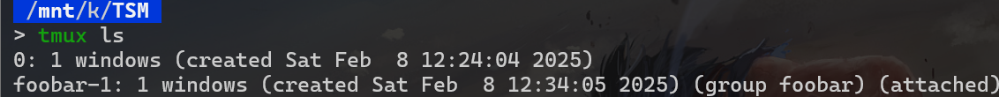
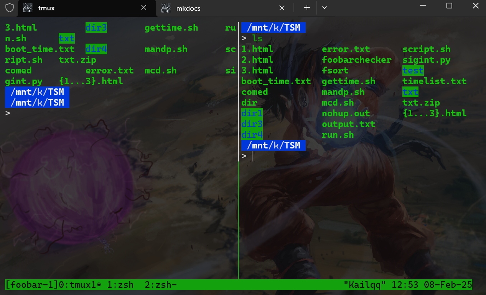
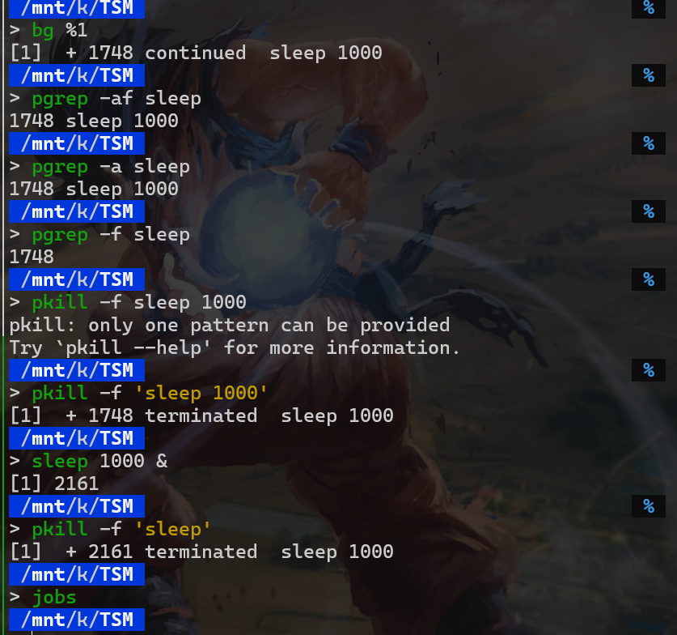
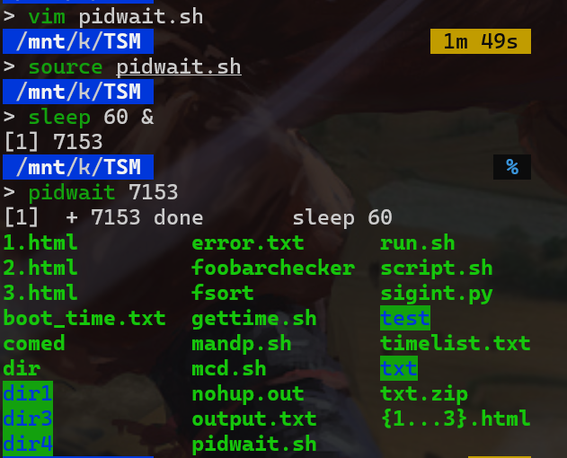

# Command line environment

## Job control

`Sleep`命令可以让进程休眠一段时间，单位是秒。`Sleep`命令的语法如下：

```bash
Sleep <seconds>
```
例如：

```bash
Sleep 10
```

如果想要终止当前进程，可以按 `Ctrl+C` 键。当我们按下 `Ctrl+C` 键时，会发送一个 `SIGINT` 信号给当前进程，从而终止进程。
`SIGINT` 全称是 `Signal Interrupt`，表示中断信号。更多的信号可以参考使用 `man signal` 命令查看。

有时候，我们可以针对`Ctrl+C`进行处理，使其无法关闭我们的进程。

```python
#! /usr/bin/env python3
import signal,time

def handler(signum,frame):
    print("Ctrl+C pressed")

signal.signal(signal.SIGINT,handler)
i=0
while True:
   time.sleep(1)
   print("\r{}".format(i),end="")
   i+=1
```
这段代码用于捕捉和处理`Ctrl+C`（`SIGINT`）信号。

首先，脚本导入了`signal`和`time`模块。然后定义了一个名为`handler`的函数，这个函数在接收到`SIGINT`信号时会被调用，并打印出"Ctrl+C pressed"的消息。

接下来，使用`signal.signal`函数将`SIGINT`信号与`handler`函数绑定。当用户按下`Ctrl+C`时，程序不会立即终止，而是调用`handler`函数。

脚本接着初始化了一个变量`i`为0，并进入一个无限循环。在循环中，程序每秒钟休眠一次，并打印出当前的`i`值，然后将`i`递增1。

这个脚本的作用是每秒钟打印一个递增的数字，并在用户按下`Ctrl+C`时打印一条消息而不是终止程序。

`\r` 是回车符，表示将光标移动到当前行的行首。`end=""` 为了不换行而是在同一行中更新数字

运行之后，按下`Ctrl+C`，会打印出"Ctrl+C pressed"的消息，然后程序继续运行。

要想终止程序，可以按`Ctrl+\`，这样程序会收到一个`SIGQUIT`信号，然后程序会终止。因为我们并没有处理`SIGQUIT`信号。

!!!Tip
    对于`SIGKILL`信号，它是不能被捕获的，当收到这个信号时，程序会立即终止。但是有时候这个信号会留下孤儿进程（其子进程）。


`Ctrl+Z` 会暂停当前进程，并将其置于后台。例如当我们执行`sleep 100`命令时，按下`Ctrl+Z`，会返回`suspended sleep 100`，然后执行`jobs`命令，会看到当前进程被暂停了。
然后我们再输入
```bash
nohup sleep 2000 &
```
这会再执行一个`sleep 2000`命令，并将其置于后台(&的含义)。`nohup`命令的意思是忽略挂起（SIGHUP）信号。
然后查看进程，会看到一个`sleep 2000`的进程。正在`running`
```bash
[1]  + suspended  sleep 100
[2]  - running    nohup sleep 2000
```
如果我们想要重新启动`sleep 100`，可以输入
```bash
bg %1
```
再使用`jobs`命令查看进程，会看到`sleep 100`的进程正在`running`。其中`%1`表示第一个进程。
如果使用的是`fg`命令，则表示将进程放到前台。`bg`命令表示将进程放到后台。


如果我们想要终止`sleep 2000`，可以输入
```bash
kill -KILL %2
```
再使用`jobs`命令查看进程，会看到`sleep 2000`的进程已经被终止。也可以使用`kill -STOP %1`来再次暂停命令

!!!info
    `kill -KILL %2`(kill) 会立即强制终止进程，而`kill %2`(terminate) 会正常终止进程。


## Terminal multiplexer
有的时候我们想要同时打开VIM和终端，一边写代码，一边方便地运行，又或者我们想要在运行某个进程时监视它的资源使用情况……

这些都可以通过打开多个终端来实现，但是事实上还有更方便的方法，那就是使用`Terminal Multiplexer`(终端复用器)。

`Terminal multiplexer`（终端复用器）是一种软件应用程序，它允许用户在一个单一的终端窗口中运行和管理多个终端会话。通过使用终端复用器，用户可以在一个屏幕上同时查看和操作多个终端会话，而不需要打开多个独立的终端窗口。

终端复用器的主要功能包括：

1. **会话管理**：用户可以创建、分离和重新连接到终端会话。这对于远程工作特别有用，因为用户可以在断开连接后重新连接到相同的会话。
- **窗口和面板**：用户可以在一个终端会话中创建多个窗口和面板，每个窗口和面板可以运行不同的命令或程序。
- **快捷键**：终端复用器通常提供丰富的快捷键，方便用户快速切换窗口、分割面板、滚动历史记录等。
- **脚本和自动化**：用户可以编写脚本来自动化常见的任务和配置，从而提高工作效率。

常见的终端复用器有`tmux`和`screen`。其中，`tmux`是现代的终端复用器，提供了更强大的功能和更好的用户体验。

在`tmux`中,有三种层级
```
sessions
   windows
       panes
```

sessions: 会话，一个会话可以有多个窗口
windows: 窗口，一个窗口可以有多个面板。
panes: 面板，一个面板就是一个终端。


例如我们输入`tmux`，这会在当前shell中启动一个`tmux`，然后`tmux`会启动一个`shell`

<figure markdown="span">
{ width="400" }
<figcaption>tmux之前</figcaption>
</figure>

<figure markdown="span">
{ width="400" }
<figcaption>tmux之后</figcaption>
</figure>

可以输入`Ctrl+B`然后输入`D`，这会分离当前的会话，然后回到之前的shell。如果直接输入`Ctrl+D`，这会关闭当前的会话，然后回到之前的shell。


例如我们可以在tmux开出的shell中执行之前创建的python脚本，然后按`Ctrl+B`然后输入`D`，回到之前的shell。进行一系列工作之后，我们再输入`tmux a`，这会重新连接到之前的会话，然后就可以看到我们的python脚本还在运行。

`tmux`与`vim`有些类似,输入`Ctrl+B`然后输入`：`，这会进入命令模式。(下面绿色一行)，然后可以输入`list-sessions`，这会列出所有会话。这也可以通过`tmux ls`来实现。

我们也可以通过`tmux new -t session_name`来创建一个会话，并命名为`session_name`。

例如我创建了一`foobar`的会话，然后输入`tmux ls`:

<figure markdown="span">
{ width="400" }
<figcaption>tmux ls</figcaption>
</figure>

可以看到有两个会话，一个是`foobar`，一个是`0`。

现在可以使用
```bash
tmux a -t foobar
```
来连接到`foobar`会话。

!!!warning
    使用`tmux a -t foobar`时不应该在一个`tmux`会话中，否则会报错,这是为了避免嵌套和混乱。

现在，我们可以关注windows，在一个`tmux`会话中，可以使用`Ctrl+B`然后输入`c`来创建一个新窗口。使用`Ctrl+B`然后输入`n`来切换到下一个窗口。使用`Ctrl+B`然后输入`p`来切换到上一个窗口。当窗口很多时，可以使用`Ctrl+B`然后输入`数字`来切换到对应的窗口。

如果想要删除一个窗口，可以使用`Ctrl+B`然后输入`&`来删除当前的窗口。

<figure markdown="span">
{ width="400" }
<figcaption>tmux窗口切换</figcaption>
</figure>

在上图中，我们可以看到有三个窗口，分别是`0`，`1`，`2`。当前所处的窗口是`0`(用`*`表示)。上一次所在的窗口是`2`(用`-`表示)。

可以看到当前三个window的名字都是`zsh`，这是因为我们没有给window命名。

我们可以使用`Ctrl+B`然后输入`,`来重命名当前窗口zsh为其它名字。
>使用`Ctrl+B`然后输入`$`可以重命名当前会话`foobar`为其它名字。

最后我们再来看看窗格panes，在一个window中，可以使用`Ctrl+B`然后输入`"`来水平分割出一个新的窗格，输入`%`来垂直分割出一个新的窗格。使用`Ctrl+B`然后输入`x`来关闭当前的窗格。使用`Ctrl+B`然后输入`方向键`来切换到对应的窗格。

效果如下：

<figure markdown="span">
{ width="400" }
<figcaption>tmux窗格</figcaption>
</figure>

>还可以浏览不同的窗格布局，这可以通过`Ctrl+B`然后输入`space`(亦即空格键)来实现。

当我们只想观察一个窗格时,可以通过`Ctrl+B`然后输入`z`来放大该窗格使其占据整个窗口，做完我们想做的事之后，可以通过`Ctrl+B`然后输入`z`来恢复原来的大小。这可以避免我们频繁地切换windows。


## Dotfiles

`alias`命令用于为其他命令创建别名。通过使用`alias`，我们可以为常用的命令指定一个简短的名称，从而提高工作效率。例如，输入`alias ll='ls -la'`可以将`ll`设置为`ls -la`的别名，这样每次输入`ll`时就会执行`ls -la`命令。使用`alias ll`命令可以查看`ll`的别名。使用`alias`命令可以查看所有别名。然后使用`unalias`命令来取消别名。

通过`alias`命令，我们可以为常用的命令指定一个简短的名称，从而提高工作效率。

但是当我们拥有的别名越来越多时，总不能每一次打开终端都输入一遍这些别名吧。

这时候，我们就可以使用`dotfiles`来管理这些别名，这就是`dotfiles`的用途之一

`Dotfiles`是指以`.`开头的配置文件，这些文件通常用于存储用户的个性化设置和配置。常见的dotfiles包括`.bashrc`、`.vimrc`、`.gitconfig`等。

通过管理和定制这些dotfiles，我们可以在不同的系统和环境中保持一致的工作环境。例如，我们可以在`.bashrc`中定义别名、环境变量和函数，在`.vimrc`中配置Vim编辑器的行为和外观，在`.gitconfig`中设置Git的用户信息和别名。

!!!Note
    在`bash`中，`~/.bashrc`是用户的主配置文件，当用户登录时，`bash`会读取这个文件。
    在`zsh`中，`~/.zshrc`是用户的主配置文件，当用户登录时，`zsh`会读取这个文件。

例如我们想要在`bash`中定义一个别名`ll`，我们可以在`~/.bashrc`中添加以下内容：
```bash
alias ll='ls -la'
```

然后启动`bash`，输入`ll`，就会看到`ls -la`的输出。

目前比较美观的`dotfiles`管理工具是`oh-my-zsh`，它可以帮助我们管理`zsh`的配置文件。支持很多插件和主题。可以参考[oh-my-zsh](https://ohmyz.sh/)。

Github上有很多人热衷于配置并分享自己的`dotfiles`，也可以去上面找一个自己喜欢的配置。

也存在专门 `dotfiles`的网站，可以参考[Dotfile.github.io](https://dotfile.github.io/)。


## Remote machines

`ssh`（Secure Shell）是一种用于在不安全的网络上安全地访问远程计算机的协议。它提供了加密的通信通道，确保数据的安全性和完整性。`ssh`通常用于远程登录、文件传输和执行命令。

要连接到远程机器，可以使用以下命令：

```bash
ssh username@hostname
```

- `username` 是你在远程机器上的用户名。
- `hostname` 是远程机器的地址，可以是IP地址或域名。

例如，要连接到IP地址为`192.168.1.10`的机器，使用用户名`user`，可以输入：

```bash
ssh user@192.168.1.10
```

可以使用`ssh`直接在远程机器上执行命令，而不需要登录到远程终端。命令的语法如下：

```bash
ssh username@hostname 'command'
```

例如，要在远程机器上查看当前目录的内容，可以使用：

```bash
ssh user@192.168.1.10 'ls -la'
```

这会在远程机器上执行`ls -la`命令，并将结果返回到本地终端。

为了提高安全性，可以使用SSH密钥进行身份验证。SSH密钥由一对密钥组成：公钥和私钥。公钥存储在远程机器上，私钥保存在本地机器上。

可以使用以下命令生成SSH密钥对：

```bash
ssh-keygen -t rsa -b 4096 -C "your_email@example.com"
```

- `-t rsa` 指定密钥类型为RSA。
- `-b 4096` 指定密钥长度为4096位。
- `-C "your_email@example.com"` 添加注释（通常是你的邮箱）。

生成的密钥对通常存储在`~/.ssh/`目录下，公钥文件为`id_rsa.pub`，私钥文件为`id_rsa`。

将公钥添加到远程机器的`~/.ssh/authorized_keys`文件中，以便使用SSH密钥进行登录。

```bash
ssh-copy-id username@hostname
```

常用选项包括：

- `-p port`：指定连接的端口号，默认是22。
- `-i identity_file`：指定私钥文件。
- `-L local_port:remote_host:remote_port`：设置本地端口转发。

可以使用`scp`命令通过SSH协议传输文件：

```bash
scp local_file username@hostname:remote_path
```

- `local_file` 是要传输的本地文件。
- `remote_path` 是远程机器上的目标路径。

例如，将本地文件`example.txt`传输到远程机器的`/home/user/`目录：

```bash
scp example.txt user@192.168.1.10:/home/user/
```


???info "ssh加密"
    目前ssh加密使用的是`RSA`加密算法。
    RSA（Rivest-Shamir-Adleman）算法是一种非对称加密算法，由Ron Rivest、Adi Shamir和Leonard Adleman在1977年提出。非对称加密算法使用一对密钥：公钥和私钥。公钥用于加密，私钥用于解密。

    RSA算法的安全性基于大整数分解的困难性。具体来说，RSA算法依赖于两个大质数的乘积难以分解这一数学难题。RSA算法的基本步骤为：

    1. 生成密钥对：
        - 选择两个大质数 \( p \) 和 \( q \)。
        - 计算它们的乘积 \( n = p \times q \)，其中 \( n \) 是模数。
        - 计算 \( \phi(n) = (p-1) \times (q-1) \)。
        - 选择一个与 \( \phi(n) \) 互质的整数 \( e \)，其中 \( e \) 是公钥指数。
        - 计算 \( d \) 使得 \( d \times e \equiv 1 \mod \phi(n) \)，其中 \( d \) 是私钥指数。

    2. 公钥和私钥：
        - 公钥由 \( (e, n) \) 组成。
        - 私钥由 \( (d, n) \) 组成。

    3. 加密：
        - 将明文消息 \( M \) 转换为整数 \( m \)，其中 \( 0 \leqslant m < n \)。
        - 使用公钥 \( (e, n) \) 进行加密，计算密文 \( c \)：
          
        \[
        c \equiv m^e \mod n
        \]

    4. 解密：
        - 使用私钥 \( (d, n) \) 进行解密，计算明文 \( m \)：
         
        \[
        m \equiv c^d \mod n
        \]

## Exercise&Solutions

### Job Control

1.From what we have seen, we can use some 
`ps aux | grep` commands to get our jobs’ pids and then kill them, 
but there are better ways to do it. Start a sleep 10000 job in 
a terminal, background it with `Ctrl-Z` and continue its execution with `bg`.
Now use `pgrep` to find its pid and `pkill` to kill it without ever typing the pid itself. (Hint: use the `-af` flags).

即使用`pgrep`和`pkill`来找到进程的pid并杀死它，而不需要手动输入pid。

!!!info "ps aux | grep"
    `ps aux | grep` 命令用于显示所有进程的详细信息，并根据指定的条件过滤进程。

    - `ps aux`：显示所有进程的详细信息。
    - `grep`：根据指定的条件过滤进程。
    通过pipe(|)将`ps aux`的输出作为`grep`的输入，然后根据条件过滤进程。

首先了解一下`pgrep`和`pkill`的用法。


`pgrep` 和 `pkill` 是两个非常有用的命令行工具，用于在 Unix 和 Linux 系统上管理进程。

`pgrep` 用于查找与指定模式匹配的进程 ID。

```bash
pgrep [options] pattern
```

常用选项:
  - `-f`: 匹配完整的命令行，而不仅仅是进程名。
  - `-l`: 显示进程名和进程 ID。
  - `-a`: 显示完整的命令行。
  - `-u user`: 只显示属于指定用户的进程。


示例:
```bash
pgrep -f sleep
```
这将查找所有命令行中包含“sleep”的进程。

`pkill` 用于根据名称或其他属性终止进程。

```bash
pkill [options] pattern
```
常用选项:
  - `-f`: 匹配完整的命令行。
  - `-u user`: 只终止属于指定用户的进程。

  - `-signal`: 发送指定的信号（如 `-9` 代表 `SIGKILL`）。

```bash
pkill -f sleep
```
这将终止所有命令行中包含“sleep”的进程。

知道之后，接下来就是简单地验证命令了。

<figure markdown="span">
{ width="350" }
<figcaption>过程</figcaption>
</figure>


2.Say you don’t want to start a process until another completes. How would you go about it? In this exercise, our limiting process will always be `sleep 60 &`. One way to achieve this is to use the `wait` command. Try launching the `sleep` command and having an `ls` wait until the background process finishes.

However, this strategy will fail if we start in a different bash session, since `wait` only works for child processes. One feature we did not discuss in the notes is that the `kill` command’s exit status will be zero on success and nonzero otherwise. `kill -0` does not send a signal but will give a nonzero exit status if the process does not exist. Write a bash function called `pidwait` that takes a pid and waits until the given process completes. You should use `sleep` to avoid wasting CPU unnecessarily.

即我们想要在另一个进程完成之后再启动一个进程，我们可以使用`wait`命令。
例如我们想要在`sleep 60 &`完成之后再启动`ls`，我们可以使用`wait`命令。

```bash
sleep 60 &
wait %1
ls
```

但是`wait`命令只适用于子进程，所以如果我们在不同的bash session中启动进程，这个方法就会失败。

一个课上没有讨论的特性是`kill`命令的退出状态，当成功时为0，否则为非0。`kill -0`不会发送信号，但当进程不存在时会返回非0的退出状态。

所以我们可以使用`kill -0`来检查进程是否存在，如果存在则等待，否则直接执行。

```bash
pidwait() {
    while kill -0 $1 > /dev/null 2>&1; do
        sleep 1
    done
    ls
}
```
将标准错误重定向到与标准输出相同的地方，即`2>&1`。

<figure markdown="span">
{ width="350" }
<figcaption>过程</figcaption>
</figure>

### Terminal multiplexer

Follow this [tmux tutorial](https://hamvocke.com/blog/a-quick-and-easy-guide-to-tmux/) and then learn how to do some basic customizations following [these steps](https://hamvocke.com/blog/a-guide-to-customizing-your-tmux-conf/).

配置的话我只把`Ctrl+B`改成了`Ctrl+A`

水平分割从`"`改成了`-`

垂直分割从`%`改成了`|`

配置完后重启tmux命令即可生效

### Aliases

1.Create an alias dc that resolves to cd for when you type it wrongly.

即创建一个别名`dc`，当输入`dc`时，会自动解析为`cd`。

```bash
alias dc='cd'
```

2.Run `history | awk '{$1="";print substr($0,2)}' | sort | uniq -c | sort -n | tail -n 10` to get your top 10 most used commands and consider writing shorter aliases for them. Note: this works for Bash; if you’re using ZSH, use history 1 instead of just history.

即获取你最常用的10个命令，并考虑为它们写更短的别名。

我最主要用的是

```bash
mkdocs serve
mkdocs gh-deploy
```

我想把它简写为

```bash
alias mkds='mkdocs serve'
alias mkdgh='mkdocs gh-deploy'
```
放在了我的`~/.zshrc`文件中。

Dotfiles的习题主要是给配置添加软连接到本地的文件,不做赘述

### Remote machines

Install a Linux virtual machine (or use an already existing one) for this exercise. If you are not familiar with virtual machines check out this tutorial for installing one.

即安装一个Linux虚拟机(或使用已有的虚拟机)，如果对虚拟机不熟悉，可以参考这个教程[Installing a virtual machine](https://hibbard.eu/install-ubuntu-virtual-box/)。


其实我之前一直都搞不懂ssh的配置文件，做完这道题简直是大彻大悟了。

现在，我有一台windows电脑，安装了linux虚拟机;现在我想要直接通过`ssh vm`连接到虚拟机.

首先，在windows的`~/.ssh`文件夹下创建一个`config`文件，添加以下内容：

```bash
 Host vm
     User username_goes_here
     HostName ip_goes_here
     IdentityFile ~/.ssh/id_xxxx
     LocalForward 9999 localhost:8888
```

这里的Host就是远端机器，在这里就是我的虚拟机。

User就是我的用户名，注意这个用户名在虚拟机中必须要存在。

HostName就是我的虚拟机的ip地址

IdentityFile就是我的私钥文件，在这里就是我的私钥文件。

然后在Windows中通过`ssh-copy-id vm`将我的公钥复制到虚拟机中。
>如果powershell中没有`ssh-copy-id`，可以直接去虚拟机中将对应的公钥内容添加到`~/.ssh/authorized_keys`文件中。

然后就大功告成了，现在就可以直接通过`ssh vm`连接到虚拟机了。

