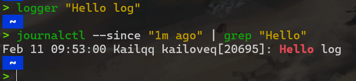

# 调试与性能分析

代码不能完全按照您的想法运行，它只能完全按照您的写法运行，这是编程界的一条金科玉律。


这节课主要是了解一些工具，"you don't have to become a master of all these tools,just know that there exits such tools so you can use instead of doing some unnecessary works"


## 调试代码

### 打印与日志

打印调试法，即Print大法，由于其可以得到快速而直观的反馈，是大多数人十分喜爱的一种调试方法

另外一个方法是使用日志，而不是临时添加打印语句。日志较普通的打印语句有如下的一些优势：

- 可以将日志写入文件、socket 或者甚至是发送到远端服务器而不仅仅是标准输出；
- 日志可以支持严重等级（例如 INFO, DEBUG, WARN, ERROR 等），这使您可以根据需要过滤日志；
- 对于新发现的问题，很可能您的日志中已经包含了可以帮助您定位问题的足够的信息。

例如以下这个`python`程序

```python
import logging
import sys

class CustomFormatter(logging.Formatter):
    """Logging Formatter to add colors and count warning / errors"""

    grey = "\x1b[38;21m"
    yellow = "\x1b[33;21m"
    red = "\x1b[31;21m"
    bold_red = "\x1b[31;1m"
    reset = "\x1b[0m"
    format = "%(asctime)s - %(name)s - %(levelname)s - %(message)s (%(filename)s:%(lineno)d)"

    FORMATS = {
        logging.DEBUG: grey + format + reset,
        logging.INFO: grey + format + reset,
        logging.WARNING: yellow + format + reset,
        logging.ERROR: red + format + reset,
        logging.CRITICAL: bold_red + format + reset
    }

    def format(self, record):
        log_fmt = self.FORMATS.get(record.levelno)
        formatter = logging.Formatter(log_fmt)
        return formatter.format(record)

# create logger with 'spam_application'
logger = logging.getLogger("Sample")

# create console handler with a higher log level
ch = logging.StreamHandler()
ch.setLevel(logging.DEBUG)

if len(sys.argv)> 1:
    if sys.argv[1] == 'log':
        ch.setFormatter(logging.Formatter('%(asctime)s : %(levelname)s : %(name)s : %(message)s'))
    elif sys.argv[1] == 'color':
        ch.setFormatter(CustomFormatter())

if len(sys.argv) > 2:
    logger.setLevel(logging.__getattribute__(sys.argv[2]))
else:
    logger.setLevel(logging.DEBUG)

logger.addHandler(ch)

# logger.debug("debug message")
# logger.info("info message")
# logger.warning("warning message")
# logger.error("error message")
# logger.critical("critical message")

import random
import time
for _ in range(100):
    i = random.randint(0, 10)
    if i <= 4:
        logger.info("Value is {} - Everything is fine".format(i))
    elif i <= 6:
        logger.warning("Value is {} - System is getting hot".format(i))
    elif i <= 8:
        logger.error("Value is {} - Dangerous region".format(i))
    else:
        logger.critical("Maximum value reached")
    time.sleep(0.3)
```

```bash
$ python logger.py
# Raw output as with just prints
$ python logger.py log
# Log formatted output
$ python logger.py log ERROR
# Print only ERROR levels and above
$ python logger.py color
# Color formatted output
```

这会依次打印出不同形式的log.

我们也可以使用彩色文本来显示终端信息，使其可读性更好.

ls 和 grep 这样的程序会使用 [ANSI escape codes](https://en.wikipedia.org/wiki/ANSI_escape_code)，它是一系列的特殊字符，可以使您的 shell 改变输出结果的颜色.

```bash
echo -e "\e[38;2;255;0;0mThis is red\e[0m
```

只要终端支持真彩色(即使用RGB24位色深来表示颜色)

那么这个命令就会打印出红色.

如果想要打印其它颜色.

则基本语法为

```bash
echo -e "\e[38;2;R,G,BmThis is message\e[0m"
```

如果不支持真彩色，那么可以使用16色(4位色深)

```bash
echo -e "\e[31; 1mThis is red\e[0m"
```

### 第三方日志系统

如果您正在构建大型软件系统，您很可能会使用到一些依赖，有些依赖会作为程序单独运行。如 Web 服务器、数据库或消息代理都是此类常见的第三方依赖。

和这些系统交互的时候，阅读它们的日志是非常必要的，因为仅靠客户端侧的错误信息可能并不足以定位问题。

幸运的是，大多数的程序都会将日志保存在您的系统中的某个地方。对于 UNIX 系统来说，程序的日志通常存放在 `/var/log`。例如， NGINX web 服务器就将其日志存放于 `/var/log/nginx`。

目前，系统开始使用 **system log** ，您所有的日志都会保存在这里。大多数（但不是全部的）Linux 系统都会使用 systemd，这是一个系统守护进程，它会控制您系统中的很多东西，例如哪些服务应该启动并运行。systemd 会将日志以某种特殊格式存放于 `/var/log/journal`，您可以使用 `journalctl` 命令显示这些消息。

类似地，在 macOS 系统中是 `/var/log/system.log`，但是有更多的工具会使用系统日志，它的内容可以使用 `log show` 显示。

对于大多数的 UNIX 系统，您也可以使用 `dmesg` 命令来读取内核的日志。

如果希望将日志加入到系统日志中，您可以使用 logger 这个 shell 程序。

```bash
logger "Hello Logs"
journalctl --since "1m ago" | grep Hello
```

<figure markdown="span">
{ width="300" }
<figcaption>过程</figcaption>
</figure>

日志的内容可以非常的多，我们需要对其进行处理和过滤才能得到我们想要的信息。

如果需要对 `journalctl` 和 `log show` 的结果进行大量的过滤，那么此时可以考虑使用它们自带的选项对其结果先过滤一遍再输出。还有一些像 `lnav` 这样的工具，它为日志文件提供了更好的展现和浏览方式。

#### lnav


`lnav` 是一个专为命令行设计的 **高级日志文件查看与分析工具**，支持实时日志跟踪、语法高亮、自动时间戳解析、日志格式识别、多文件合并分析等功能。它特别适合开发者、运维人员处理复杂的日志文件，能显著提升日志分析的效率。


可同时打开多个日志文件（如 `access.log`、`error.log`），并自动按时间顺序合并显示。
```bash
lnav /var/log/nginx/access.log /var/log/nginx/error.log
```


类似 `tail -f`，但支持语法高亮和实时过滤：
```bash
lnav -f /path/to/logfile.log
```

- 自动识别常见日志格式（如 Apache、Nginx、Syslog、JSON 等）。
- 对日志级别（INFO、WARNING、ERROR）进行颜色标记。
- 解析时间戳、IP 地址、URL 等结构化字段。

按时间轴展示日志，支持快速跳转到指定时间点（按 `t` 键）。

- 快速过滤特定级别的日志（如仅显示 `ERROR`）。
- 正则表达式搜索（按 `/` 输入关键字）。
- 支持 SQL 查询日志内容（需学习简单语法）。

支持通过 SQL 语句对日志进行统计，例如统计 HTTP 状态码出现次数：

```sql
SELECT sc_status, COUNT(*) FROM access_log GROUP BY sc_status
```

## 调试器

当通过打印已经不能满足您的调试需求时，您应该使用调试器。

调试器是一种可以允许我们和正在执行的程序进行交互的程序，它可以做到：

- 当到达某一行时将程序暂停；
- 一次一条指令地逐步执行程序；
- 程序崩溃后查看变量的值；
- 满足特定条件时暂停程序；
- 其他高级功能。

很多编程语言都有自己的调试器。Python 的调试器是 pdb.ipdb是一种增强版的 pdb 它使用 IPython 作为 REPL 并开启了 tab 补全、语法高亮、更好的回溯和更好的内省，同时还保留了 pdb 模块相同的接口。


pdb支持的命令有

- `l`(ist) - 显示当前行附近的 11 行或继续执行之前的显示；
- `s`(tep) - 执行当前行，并在第一个可能的地方停止；
- `n`(ext) - 继续执行直到当前函数的下一条语句或者 return 语句；
- `b`(reak) - 设置断点（基于传入的参数）；
- `p`(rint) - 在当前上下文对表达式求值并打印结果。还有一个命令是 `pp` ，它使用 pprint 打印；
- `r`(eturn) - 继续执行直到当前函数返回；
- `q`(uit) - 退出调试器。

对于更加底层的编程语言[gdb](https://www.sourceware.org/gdb/)(及其改进版[pwndbg](https://github.com/pwndbg/pwndbg))和[lldb](https://lldb.llvm.org/),它们都对类 C 语言的调试进行了优化，它允许您探索任意进程及其机器状态：寄存器、堆栈、程序计数器等。

### 专门工具

即使您需要调试的程序是一个二进制的黑盒程序，仍然有一些工具可以帮助到您。当您的程序需要执行一些只有操作系统内核才能完成的操作时，它需要使用 系统调用。有一些命令可以帮助您追踪您的程序执行的系统调用。在 Linux 中可以使用 `strace` ，在 macOS 和 BSD 中可以使用 `dtrace`。

!!!info "系统调用"
    系统调用是操作系统提供的一组接口，允许用户空间的程序请求操作系统内核提供的服务。这些服务包括进程控制、文件操作、系统控制和网络管理等。系统调用作为用户程序与操作系统之间的桥梁，使得用户程序无需直接与硬件交互，从而提高了程序的可移植性和系统的安全性。

### 静态分析

有些问题是您不需要执行代码就能发现的。例如，仔细观察一段代码，您就能发现某个循环变量覆盖了某个已经存在的变量或函数名；或是有个变量在被读取之前并没有被定义。 这种情况下 **静态分析** 工具就可以帮我们找到问题。静态分析会将程序的源码作为输入然后基于编码规则对其进行分析并对代码的正确性进行推理。


```python
import time

def foo():
    return 42

for foo in range(5):
    print(foo)
bar = 1
bar *= 0.2
time.sleep(60)
print(baz)
```

例如使用`pyflakes`分析这段代码(eg.py)，会返回

```bash
eg.py:6:5 redefinition of unused 'foo' from line 3
eg.py:11:7 undefined name 'baz'
```

`mypy` 则是另外一个工具，它可以对代码进行类型检查。这里，`mypy` 会经过我们 `bar` 起初是一个 `int` ，然后变成了 `float`。这些问题都可以在不运行代码的情况下被发现。


```bash
eg.py:6: error: Incompatible types in assignment (expression has type "int", variable has type "Callable[[], Any]")
eg.py:9: error: Incompatible types in assignment (expression has type "float", variable has type "int")
eg.py:11: error: Name "baz" is not defined
Found 3 errors in 1 file (checked 1 source file)
```

在shell工具中，我们使用了shellcheck来静态分析shell脚本,大多数的编辑器和 IDE 都支持在编辑界面显示这些工具的分析结果、高亮有警告和错误的位置。 这个过程通常称为 code linting 。风格检查或安全检查的结果同样也可以进行相应的显示。在 vim 中，有 ale 或 syntastic 可以帮助您做同样的事情。 在 Python 中， pylint 和 pep8 是两种用于进行风格检查的工具，而 bandit 工具则用于检查安全相关的问题。


对于风格检查和代码格式化，还有以下一些工具可以作为补充：用于 Python 的 `black`、用于 Go 语言的 `gofmt`、用于 Rust 的 `rustfmt` 或是用于 JavaScript, HTML 和 CSS 的 `prettier` 。这些工具可以自动格式化您的代码，这样代码风格就可以与常见的风格保持一致。 尽管您可能并不想对代码进行风格控制，标准的代码风格有助于方便别人阅读您的代码，也可以方便您阅读它的代码。

Vscode也有自动格式化代码的功能快捷键。

其它语言的静态分析工具可以参考[这里](https://github.com/analysis-tools-dev/static-analysis)


## 性能分析

### 时间

和调试代码类似，大多数情况下我们只需要打印两处代码之间的时间即可发现问题

```python
import time, random
n = random.randint(1, 10) * 100

# 获取当前时间 
start = time.time()

# 执行一些操作
print("Sleeping for {} ms".format(n))
time.sleep(n/1000)

# 比较当前时间和起始时间
print(time.time() - start)
```

不过电脑可能在同时运行其它进程，也有可能在进行等待，对于工具来说，需要区分真实时间、用户时间和系统时间。通常来说，用户时间 + 系统时间代表了您的进程所消耗的实际 CPU 

- 真实时间:程序开始到结束流失掉的真实时间，包括其他进程的执行时间以及阻塞消耗的时间（例如等待 I/O 或网络）
- 用户时间 User - CPU 执行用户代码所花费的时间；
- 系统时间 Sys - CPU 执行系统内核代码所花费的时间。

例如，试着执行一个用于发起 HTTP 请求的命令并在其前面添加 time 前缀。网络不好的情况下您可能会看到下面的输出结果。请求花费了 2s 多才完成，但是进程仅花费了 15ms 的 CPU 用户时间和 12ms 的 CPU 内核时间。

```bash
$ time curl https://missing.csail.mit.edu &> /dev/null
real    0m2.561s
user    0m0.015s
sys     0m0.012s
```

### CPU profilers

大多数情况下，当人们提及性能分析工具的时候，通常指的是 CPU 性能分析工具。 CPU 性能分析工具有两种： 追踪分析器（tracing）及采样分析器（sampling）。 追踪分析器 会记录程序的每一次函数调用，而采样分析器则只会周期性的监测（通常为每毫秒）您的程序并记录程序堆栈。它们使用这些记录来生成统计信息，显示程序在哪些事情上花费了最多的时间。

在 Python 中，我们使用 cProfile 模块来分析每次函数调用所消耗的时间。 

```python
#!/usr/bin/env python

import sys, re

def grep(pattern, file):
    with open(file, 'r') as f:
        print(file)
        for i, line in enumerate(f.readlines()):
            pattern = re.compile(pattern)
            match = pattern.search(line)
            if match is not None:
                print("{}: {}".format(i, line), end="")

if __name__ == '__main__':
    times = int(sys.argv[1])
    pattern = sys.argv[2]
    for i in range(times):
        for file in sys.argv[3:]:
            grep(pattern, file)
```

```bash
$ python -m cProfile -s tottime grep.py 1000 '^(import|\s*def)[^,]*$' *.py
```

我们可以使用下面的命令来对这段代码进行分析。通过它的输出我们可以知道，IO 消耗了大量的时间，编译正则表达式也比较耗费时间。因为正则表达式只需要编译一次，我们可以将其移动到 for 循环外面来改进性能。


关于 Python 的 cProfile 分析器（以及其他一些类似的分析器），需要注意的是它显示的是每次函数调用的时间。看上去可能快到反直觉，尤其是如果您在代码里面使用了第三方的函数库，因为内部函数调用也会被看作函数调用。

更加符合直觉的显示分析信息的方式是包括每行代码的执行时间，这也是 行分析器 的工作。例如，下面这段 Python 代码会向本课程的网站发起一个请求，然后解析响应返回的页面中的全部 URL：

```python
#!/usr/bin/env python3
import requests
from bs4 import BeautifulSoup

# 这个装饰器会告诉行分析器 
# 我们想要分析这个函数
@profile
def get_urls():
    response = requests.get('https://missing.csail.mit.edu')
    s = BeautifulSoup(response.content, 'lxml')
    urls = []
    for url in s.find_all('a'):
        urls.append(url['href'])

if __name__ == '__main__':
    get_urls()
```


使用行分析器
```
> kernprof -l -v url.py
Wrote profile results to url.py.lprof
Timer unit: 1e-06 s

Total time: 1.52245 s
File: url.py
Function: get_urls at line 8

Line #      Hits         Time  Per Hit   % Time  Line Contents
==============================================================
     8                                           @profile
     9                                           def get_urls():
    10         1    1509897.0 1509897.0     99.2      response = requests.get('https://missing.csail.mit.edu')
    11         1      12178.0  12178.0      0.8      s = BeautifulSoup(response.content, 'lxml')
    12         1          0.0      0.0      0.0      urls = []
    13        48        341.0      7.1      0.0      for url in s.find_all('a'):
    14        47         30.0      0.6      0.0          urls.append(url['href'])
```

### 内存

像 C 或者 C++ 这样的语言，内存泄漏会导致您的程序在使用完内存后不去释放它。为了应对内存类的 Bug，我们可以使用类似 Valgrind 这样的工具来检查内存泄漏问题。

对于 Python 这类具有垃圾回收机制的语言，内存分析器也是很有用的，因为对于某个对象来说，只要有指针还指向它，那它就不会被回收。

```python
@profile
def my_func():
    a = [1] * (10 ** 6)
    b = [2] * (2 * 10 ** 7)
    del b
    return a

if __name__ == '__main__':
    my_func()
```
```bash
> python3 -m memory_profiler mem.py
Filename: mem.py

Line #    Mem usage    Increment  Occurrences   Line Contents
=============================================================
     1   40.828 MiB   40.828 MiB           1   @profile
     2                                         def my_func():
     3   48.363 MiB    7.535 MiB           1       a = [1] * (10 ** 6)
     4  200.906 MiB  152.543 MiB           1       b = [2] * (2 * 10 ** 7)
     5   48.551 MiB -152.355 MiB           1       del b
     6   48.551 MiB    0.000 MiB           1       return a
```

### 事件分析

在我们使用 strace 调试代码的时候，您可能会希望忽略一些特殊的代码并希望在分析时将其当作黑盒处理。perf 命令将 CPU 的区别进行了抽象，它不会报告时间和内存的消耗，而是报告与您的程序相关的系统事件。

例如，perf 可以报告不佳的缓存局部性（poor cache locality）、大量的页错误（page faults）或活锁（livelocks）。下面是关于常见命令的简介：

- perf list - 列出可以被 pref 追踪的事件；
- perf stat COMMAND ARG1 ARG2 - 收集与某个进程或指令相关的事件；
- perf record COMMAND ARG1 ARG2 - 记录命令执行的采样信息并将统计数据储存在 perf.data 中；
- perf report - 格式化并打印 perf.data 中的数据。

### 可视化

使用分析器来分析真实的程序时，由于软件的复杂性，其输出结果中将包含大量的信息。人类是一种视觉动物，非常不善于阅读大量的文字。因此很多工具都提供了可视化分析器输出结果的功能。

对于采样分析器来说，常见的显示 CPU 分析数据的形式是 火焰图，火焰图会在 Y 轴显示函数调用关系，并在 X 轴显示其耗时的比例。火焰图同时还是可交互的，您可以深入程序的某一具体部分，并查看其栈追踪。

调用图和控制流图可以显示子程序之间的关系，它将函数作为节点并把函数调用作为边。将它们和分析器的信息（例如调用次数、耗时等）放在一起使用时，调用图会变得非常有用，它可以帮助我们分析程序的流程。 在 Python 中您可以使用 pycallgraph 来生成这些图片。

### 资源监控

有时候，分析程序性能的第一步是搞清楚它所消耗的资源。程序变慢通常是因为它所需要的资源不够了。例如，没有足够的内存或者网络连接变慢的时候。

有很多很多的工具可以被用来显示不同的系统资源，例如 CPU 占用、内存使用、网络、磁盘使用等。

- [HTOP](https://htop.dev/)
- [iotop](https://man7.org/linux/man-pages/man8/iotop.8.html)
- [df](https://man7.org/linux/man-pages/man1/df.1.html),[ncdu](https://dev.yorhel.nl/ncdu)
- [free](https://man7.org/linux/man-pages/man1/free.1.html)
- [lsof](https://man7.org/linux/man-pages/man8/lsof.8.html)
- [ss](https://man7.org/linux/man-pages/man8/ss.8.html)

如果您希望测试一下这些工具，您可以使用 stress 命令来为系统人为地增加负载。

如果想要进行基准测试并依此对软件选择进行评估。 类似 hyperfine 这样的命令行可以帮您快速进行基准测试。例如，我们在 shell 工具和脚本那一节课中我们推荐使用 fd 来代替 find，们这里可以用 hyperfine 来比较一下它们。


```bash
$ hyperfine --warmup 3 'fd -e jpg' 'find . -iname "*.jpg"'
Benchmark #1: fd -e jpg
  Time (mean ± σ):      51.4 ms ±   2.9 ms    [User: 121.0 ms, System: 160.5 ms]
  Range (min … max):    44.2 ms …  60.1 ms    56 runs

Benchmark #2: find . -iname "*.jpg"
  Time (mean ± σ):      1.126 s ±  0.101 s    [User: 141.1 ms, System: 956.1 ms]
  Range (min … max):    0.975 s …  1.287 s    10 runs

Summary
  'fd -e jpg' ran
   21.89 ± 2.33 times faster than 'find . -iname "*.jpg"'

```