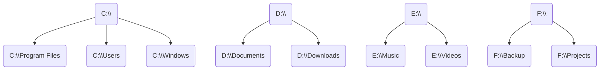
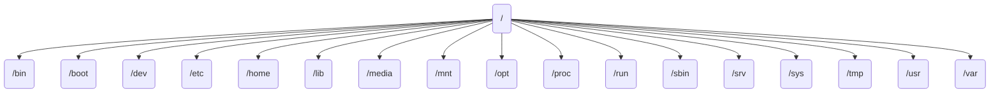
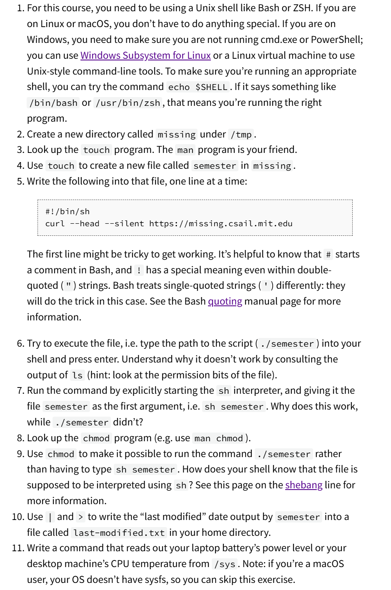
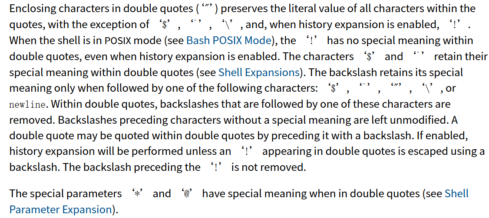
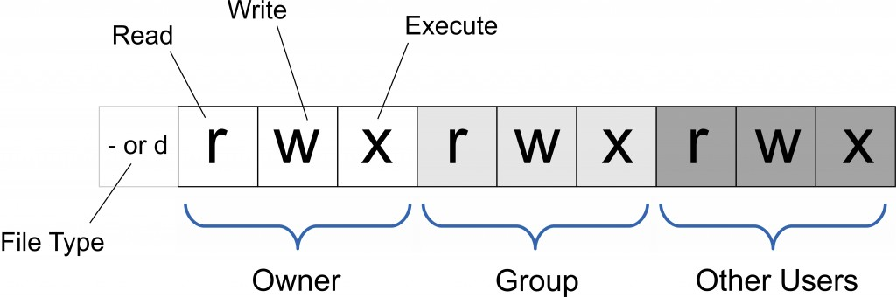

# Overview and Shell

!!!info "什么是终端和shell"

    终端（Terminal）是用户与计算机系统交互的界面。它可以是一个物理设备，如早期的计算机终端，也可以是一个软件应用程序，如现代操作系统中的终端仿真器。通过终端，用户可以输入命令并查看计算机的输出。终端通常用于执行命令行操作，进行文件管理、系统配置和程序运行等任务。

    Shell 是一种命令行解释器，它提供了一个用户与操作系统内核交互的界面。用户在终端中输入的命令会被 Shell 解释并传递给操作系统执行。Shell 还提供了编程功能，如变量、控制结构和脚本编写，使用户能够编写复杂的自动化任务。

    常见的 Shell 包括：

    - Bash（Bourne Again Shell）：大多数 Linux 发行版的默认 Shell。
    - Zsh（Z Shell）：功能强大且可定制的 Shell，近年来越来越受欢迎。
    - Fish（Friendly Interactive Shell）：用户友好的 Shell，提供了许多现代特性。

    Shell 是用户与操作系统之间的重要桥梁，通过它，用户可以高效地管理和控制计算机系统。


如果某些命令不记得了，可以使用`man`命令查看帮助文档，或者安装`tldr`命令查看简化的帮助文档


## echo 命令

`echo` 命令用于在终端中显示一段文本或变量的值。它是一个非常基础且常用的命令，常用于脚本编写和调试。

基本语法：
```bash
echo [选项] [字符串]
```

常用选项：
- `-n`：不在输出的末尾添加换行符。
- `-e`：启用反斜杠转义字符的解释。

示例：
```bash
echo "Hello, World!"
```


输出：
```bash
Hello, World!
```


使用 `-n` 选项：
```bash
echo -n "Hello, World!"
```


输出：
```bash
Hello, World!（没有换行）
```


使用 `-e` 选项：
```bash
echo -e "Hello,\nWorld!"
```

输出：
```bash
Hello,
World!
```


参数之间使用空格分开

## 环境变量(PATH)

环境变量是操作系统中用于存储系统设置和配置信息的变量。它们在操作系统和应用程序之间传递信息，控制程序的行为和运行环境。环境变量通常以键值对的形式存在，每个变量都有一个名称和一个对应的值。

更通俗的说，当我们在终端里面输入命令时, 操作系统会根据 `PATH` 变量中定义的目录顺序搜索该命令对应的可执行文件，如果可以找到，则执行该文件。

要想输出自己的环境变量，可以使用 `echo` 命令，例如：
```bash
echo $PATH
```


会返回绝对路径

??? question "路径"
    绝对路径就是完全确定文件位置的路径

    相对路径是相对于当前工作目录的路径

    `.` 表示当前目录

    `..` 表示上一级目录

    `~` 表示当前用户的主目录

    输入 `pwd` 可以查看当前工作目录

    输入 `ls` 可以查看当前目录下的文件
    
    输入 `cd` 可以切换目录(`cd 目录名`)

在Linux中，路径通常以 `/` 开头，表示根目录。


在windows中，路径通常以 `盘符:\` 开头。


因为在windows中每一个盘都代表一个文件系统，所以我们经常会看到 `C:\` 这样的路径。\

例如




而在Linux中，文件结构是树状的，所以路径通常以 `/` 开头，表示根目录。





如果想知道某条命令具体在哪个目录下，可以使用 `which` 命令，例如：
```zsh
which cd
```
会返回
```zsh
cd: shell built-in command
```

## cd 

`cd` 命令是一个用于在终端中更改当前工作目录的命令。它是 "change directory" 的缩写。使用 `cd` 命令，用户可以在文件系统中导航到不同的目录。

```bash
cd [目录路径]
```

- 如果不带参数，`cd` 会将当前目录更改为用户的主目录。
- 使用 `cd ..` 可以返回到上一级目录。
- 使用 `cd -` 可以返回到上一个工作目录。

一些常见的用法有

```bash
cd /path/to/directory
```

这将把当前工作目录更改为 `/path/to/directory`。

```bash
cd ../path/to/directory
```

这将把当前工作目录更改为上一级目录的上一级目录的指定目录。

```bash
cd ./path
```

这将把当前工作目录更改为当前目录的指定目录


- 路径可以是绝对路径或相对路径。
- 在 Linux 和 macOS 中，路径区分大小写。
- 使用 `pwd` 命令可以查看当前工作目录。

通过 `cd` 命令，用户可以方便地在文件系统中导航，执行文件管理和其他操作。

## ls

`ls` 命令是一个用于列出目录内容的命令。它是 "list" 的缩写。使用 `ls` 命令，用户可以查看指定目录下的文件和子目录。

??? question "folder vs directory"
    directory 是目录, 是文件系统中的一个概念, 而 folder 是文件夹, 是图形化界面中的一个概念，folder 不一定是directory，除非它存在于文件系统中，directory 也不一定显示为是 folder，只有它在GUI环境下才是


使用`ls --help`可以查看`ls`命令的帮助文档

常用的参数有

`-a`：显示所有文件和目录，包括隐藏文件（以`.`开头的文件,即隐藏文件 ）。

`-l`：以长格式显示文件和目录。
例如在本人的`~`目录下输入`ls -l`会返回
```zsh
total 15596

-rw-r--r--  1 kailoveq kailoveq      787 Dec 24  2023 1.txt
-rw-r--r--  1 kailoveq kailoveq      334 Jul  4  2024 Kailqq.txt
drwxr-xr-x  3 kailoveq kailoveq     4096 Sep  2 11:07 MASM
drwxr-xr-x  7 kailoveq kailoveq     4096 Feb 27  2024 autojump
-rw-r--r--  1 kailoveq kailoveq  2634817 Feb  2  2024 get-pip.py
-rw-r--r--  1 kailoveq kailoveq     6140 Nov 12  2015 mysql-community-release-el7-5.noarch.rpm
drwxr-xr-x 10 kailoveq kailoveq     4096 Jan 17 23:54 node_modules
drwxr-xr-x  2 kailoveq kailoveq     4096 Jan 21  2024 ok
-rw-r--r--  1 kailoveq kailoveq     3843 Jan 17 23:58 package-lock.json
-rw-r--r--  1 kailoveq kailoveq      152 Jan 17 23:58 package.json
-rw-r--r--  1 kailoveq kailoveq        0 Feb 20  2024 selected
drwx------  4 kailoveq kailoveq     4096 Jan 24 14:25 snap
drwxr-xr-x  4 kailoveq kailoveq     4096 May 18  2024 texmf
```
首先看`total 15596`，表示该目录下有15596个文件和子目录。

然后看包含`-`的行，如果前面有`d`，表示该文件是一个目录，如果前面是`-`，表示这是一个文件

除第一个外，还剩下九个位置,每三个位置为一组，分别表示对应的权限

前三位表示文件所有者的权限，中间三位表示文件所有者所在组的权限，最后三位表示其他人的权限

例如对于`texmf`,前三位为`rwx`，表示文件所有者有读、写、执行的权限，中间三位为`r-x`，表示文件所有者所在组有读、执行的权限，最后三位为`r-x`，表示其他人有读、执行的权限

目前而言,在我的`home`目录下,所有者和组都是`kailoveq`

如果对于文件而言

- `r`表示可读文件的内容
- `w`表示可对文件进行修改
- `x`表示可以执行文件

如果对于目录而言
- `r`表示可以读取目录中的文件列表
- `w`表示是否可以对目录中的文件进行重命名或者删除,这说明,如果有对于目录内文件的`w`权限,但是没有对于目录的`w`权限,那么不能删除目录内的文件,仅仅可以清空目录
- `x`表示是否可以进入目录


## rename move and delete

`mv`命令用于移动文件或目录，也可以用于重命名文件或目录。

`cp`命令用于复制文件或目录。

`mv`命令的基本语法是

```bash
mv [选项] 源文件 目标文件/目录
```


`cp`命令的基本语法是

```bash
cp [选项] 源文件 目标文件/目录
```

例如我想要将`1.txt`重命名为`2.txt`，那么我可以在终端中输入

```bash
mv 1.txt 2.txt
```

然后我想要将它移动`./dir1`目录下，那么我可以在终端中输入

```bash
mv 2.txt ./dir1
```

这会在`./dir1`目录下创建一个`2.txt`文件，并且将原本的`2.txt`删除，其内容会移动到`./dir1`目录下

其效果等同于

```bash
cp 2.txt ./dir1
rm 2.txt
```

`rm`命令用于删除文件或目录,它并不支持递归删除,所以如果想要删除目录,需要使用`-r`选项

删除文件时

```bash
rm 1.txt
```

删除目录时

```bash
rm -r ./dir1
```

或者当目录为空时,可以使用`rmdir`命令

```bash
rmdir ./dir1
```

如果加上参数`-f`选项表示强制删除.

!!!Note "创建目录"
    创建目录时,可以使用`mkdir`命令

    ```bash
    mkdir dir1 
    ```
    会在当前目录下创建一个名为`dir1`的目录

    ```
    mkdir my photo
    ```
    会在当前目录下创建一个名为`my`的目录和一个名为`photo`的目录
    
    ```bash
    mkdir my\ photo
    ```
    会在当前目录下创建一个名为`my photo`的目录,使用`\`来转义空格,也可以`mkdir "my photo"`来实现同样的效果


    ```bash
    mkdir  dir1/dir2/dir3
    ```
    会在进入到`dir1/dir2`目录后,创建一个名为`dir3`的目录


    如果想要创建多级目录,可以使用`mkdir -p`命令

    ```zsh
    mkdir -p dir1/dir2/dir3
    ```
    会在当前目录下创建一个名为`dir1`的目录,然后进入`dir1`目录,创建一个名为`dir2`的目录,然后进入`dir2`目录,创建一个名为`dir3`的目录
    
>Tips:如果你的终端这时候已经很多东西了,可以使用`Ctrl+L`或者`clear`来清屏

## 重定向

在 shell 中，程序有两个主要的“流”：它们的输入流和输出流。 当程序尝试读取信息时，它们会从输入流中进行读取，当程序打印信息时，它们会将信息输出到输出流中。 通常，一个程序的输入输出流都是您的终端。也就是，您的键盘作为输入，显示器作为输出。 但是，我们也可以重定向这些流。

最基本的有两个

`>` 表示输出重定向，将命令的输出结果重定向到指定文件中。

`<` 表示输入重定向，将指定文件作为命令的输入。

例如

```bash
echo "Hello, World!" > output.txt
```
这会创建一个名为`output.txt`的文件,并将其内容设置为`Hello, World!`

如果使用`cat`命令查看`output.txt`文件的内容,`cat output.txt`会返回

```bash
Hello, World!
```

我们也可以将`output.txt`文件的内容重定向到`input.txt`文件中

```bash
cat output.txt > input.txt
```


```bash
cat < output.txt > input.txt
```

这将把`output.txt`文件的内容重定向到`input.txt`文件中,如果`input.txt`文件不存在,将会创建一个`input.txt`文件,如果`input.txt`文件存在,将会覆盖`input.txt`文件的内容

如果我们不想要覆盖`input.txt`文件的内容,而是想要在`input.txt`文件的末尾添加内容,可以使用`>>`

```bash
cat output.txt >> input.txt
```

这将把`output.txt`文件的内容添加到`input.txt`文件的末尾(append)

### Pipe


管道`|`是一种将左边命令的输出作为右边命令的输入的机制。

例如

```bash
cat output.txt | grep "Hello"
```

这将把`output.txt`文件的内容作为`grep`命令的输入,并返回包含`Hello`的行

假设我只想要`ls -l`的最后一行 

```bash
ls -l | tail -n 1 > output.txt
```

这将把`ls -l`的最后一行作为`tail`命令的输入,并把最后一行(`tail`命令的`-n`选项表示返回最后`n`行)输出到`output.txt`文件中

!!!info
    在这个过程中，`ls`不知道什么是`tail`，`tail`也不知道什么是`ls`，它们只是正常的执行命令，而pipe机制将它们的输出和输入连接了起来

## Root user

在Linux中，`root`用户是超级用户，拥有最高的权限，可以执行任何命令，修改任何文件，删除任何文件，创建任何文件，甚至可以删除其他用户。

`root`用户的UID是0，GID是0

>一般情况下，我们不会使用`root`用户登录，否则万一不小心以root权限执行了错误的命令，Oops，你的电脑崩溃了

某些情况下，我们需要使用`root`用户的权限,这时候我们可以使用`sudo`命令(do as super user)

```bash
sudo [命令]
```

这将使用`root`用户的权限执行命令

当使用`sudo`命令时，系统会提示你输入密码，这是为了防止误操作


例如我们想要修改亮度的配置文件

```bash
echo 500 > /sys/class/backlight/intel_backlight/brightness
```

这将得到

```bash
permission denied
```

这时候我们就可以使用`sudo`命令

```bash
sudo echo 500 > /sys/class/backlight/intel_backlight/brightness
```

仍然是

```bash
permission denied
```

这是因为我们在前面说过,重定向两边并不知道彼此,也就是说shell看到的是我们以`root`权限执行了`echo 500` ，然后在**普通用户**下打开`brightness`文件将结果输入进去，所以会报错

想要解决这个问题,可以切换到`root`用户

```bash
sudo su
```

这时候我们就可以直接执行,值得注意的一点是,切换为`root`用户后,提示符从`$`或者其它你自定义的提示符变为`#`

或者更加优雅的方式是

```bash
echo 500 | sudo tee /sys/class/backlight/intel_backlight/brightness
```

这时候我们告诉`shell`，正常执行`echo 500`，然后使用`sudo tee`命令将结果输出到`/sys/class/backlight/intel_backlight/brightness`文件。

`tee`命令会从标准输入读取数据，并同时写入到标准输出和文件。即写入文件的同时，也会在终端中显示出写入的内容。


>Tips: `xdg-open`命令可以以适当的程序打开一个文件


## Find

`find` 命令是一个强大的工具，用于在文件系统中查找文件和目录。它可以根据各种条件（如名称、类型、大小、修改时间等）进行搜索，并支持递归搜索子目录。


```bash
find [搜索路径] [搜索条件] [操作]
```

- **搜索路径**：指定要搜索的目录路径。如果不指定，默认为当前目录。
- **搜索条件**：指定查找文件的条件，如名称、类型、大小等。
- **操作**：指定对找到的文件执行的操作，如删除、打印等。


- `-name [名称]`：按名称查找文件。
- `-type [类型]`：按文件类型查找，如 `f` 表示文件，`d` 表示目录。
- `-size [大小]`：按文件大小查找。
- `-mtime [天数]`：按修改时间查找，`-mtime +n` 表示 n 天前修改的文件，`-mtime -n` 表示 n 天内修改的文件。
- `-exec [命令] {} \;`：对找到的文件执行指定命令。
- `-L`：跟随符号链接，解析符号链接为其指向的实际文件或目录。

一些例子如下

1. **查找当前目录下名为 `example.txt` 的文件：**

    ```bash
    find . -name "example.txt"
    ```

2. **查找 `/home/user` 目录下所有 `.txt` 文件：**

    ```bash
    find /home/user -name "*.txt"
    ```

3. **查找当前目录下所有大于 100MB 的文件：**

    ```bash
    find . -type f -size +100M
    ```

4. **查找 `/var/log` 目录下 7 天前修改的文件：**

    ```bash
    find /var/log -mtime +7
    ```

5. **查找并删除当前目录下所有 `.tmp` 文件：**

    ```bash
    find . -name "*.tmp" -exec rm {} \;
    ```

6. **查找并列出 `/etc` 目录下所有目录：**

    ```bash
    find /etc -type d
    ```

7. **查找并跟随符号链接：**

    ```bash
    find -L /path/to/search -name "example.txt"
    ```

    这将查找 `/path/to/search` 目录及其子目录中名为 `example.txt` 的文件，并跟随任何符号链接。

!!!info "符号链接"
    在文件系统中，符号链接（symbolic link）是一种特殊类型的文件，它指向另一个文件或目录。符号链接类似于 Windows 中的快捷方式，它们不包含实际数据，而是指向目标文件或目录的路径。

    当我们说“跟随符号链接”时，意思是当一个命令（如 `find`）遇到符号链接时，它会解析这个链接并继续在链接指向的目标文件或目录中执行操作。换句话说，命令会将符号链接视为其指向的实际文件或目录，而不是仅仅将其视为一个链接。


    假设我们有以下文件结构：

    ```
    /home/user
    ├── actual_file.txt
    └── link_to_file.txt -> /home/user/actual_file.txt
    ```

    在这个例子中，`link_to_file.txt` 是一个符号链接，指向 `actual_file.txt`。

    - **不跟随符号链接**：默认情况下，`find` 不会跟随符号链接。这意味着如果你在 `/home/user` 目录中使用 `find` 查找文件，`link_to_file.txt` 会被视为一个符号链接，而不会进一步查找 `actual_file.txt`。

       ```bash
       find /home/user -name "actual_file.txt"
       ```

       这将直接找到 `actual_file.txt`，而不会考虑 `link_to_file.txt`。

    - **跟随符号链接**：使用 `-L` 参数，`find` 会跟随符号链接。这意味着 `find` 会将 `link_to_file.txt` 解析为 `actual_file.txt`，并在其指向的目标中继续查找。

       ```bash
       find -L /home/user -name "actual_file.txt"
       ```

       这将找到 `actual_file.txt`，即使它是通过 `link_to_file.txt` 访问的。

    跟随符号链接在某些情况下非常有用，特别是当你希望在符号链接指向的目录中执行操作时。

### 通配符查找

`find` 命令支持使用通配符进行查找，常用的通配符包括 `*`、`?` 和 `[]`。

- `*`：匹配零个或多个字符。
- `?`：匹配单个字符。
- `[]`：匹配括号内的任意一个字符。
- `{}`：扩展括号内的元素。

1. **查找当前目录下所有以 `.log` 结尾的文件：**

    ```bash
    find . -name "*.log"
    ```

2. **查找当前目录下所有以 `file` 开头并以任意单个字符结尾的文件：**

    ```bash
    find . -name "file?"
    ```

3. **查找当前目录下所有以 `file` 开头并以 `1`、`2` 或 `3` 结尾的文件：**

    ```bash
    find . -name "file[123]"
    ```

通配符也可以在其它命令如`ls`中使用

```bash
ls *.txt
ls file[123]
ls file？
```

```bash
ls file{1,2,3}
```
将会变为

```bash
ls file1 file2 file3
```


!!!info "find 和 locate"
    `locate`命令和`find`命令类似，但是`locate`命令使用的是数据库，所以速度更快。

    `locate`命令会返回所有包含指定字符串的文件路径。


## 课后习题

题目如下


<figure markdown="span">
{ width="70%" }
<figcaption>课后习题</figcaption>
</figure>

### solutions

首先`cd /tmp`进入`tmp`目录,然后创建目录使用`mkdir`

```bash
mkdir missing
```

然后`man`查看`touch`命令

```bash
man touch
```

`touch` 是一个常用的命令行工具，主要用于在文件系统中创建新的空文件或更新现有文件的时间戳。以下是 `touch` 命令的基本用法和功能：


```bash
touch [选项] 文件名
```

- 如果指定的文件不存在，`touch` 会创建一个新的空文件。例如：
  ```bash
  touch newfile.txt
  ```
  这将创建一个名为 `newfile.txt` 的新文件。


- 如果指定的文件已经存在，`touch` 会更新该文件的访问时间（atime）和修改时间（mtime）为当前时间，而不改变文件的内容。例如：
 ```bash
 touch existingfile.txt
 ```

- `-a`：仅更新访问时间。
  ```bash
  touch -a filename
  ```

- `-m`：仅更新修改时间。
  ```bash
  touch -m filename
  ```

- `-t`：使用指定的时间戳（格式为 `[[CC]YY]MMDDhhmm[.ss]`）。
  ```bash
  touch -t 202310101200.00 filename
  ```

- `-c`：如果文件不存在，则不创建文件。
  ```bash
  touch -c filename
  ```

在这里我们直接

```zsh
touch semester
```

即可

然后向`semester`文件中写入两行,这里已经给出提示了

```zsh
 #!/bin/sh
 curl --head --silent https://missing.csail.mit.edu
```


需要用`''`而不是`" "`,官方文档的解释如下


---

<figure markdown="span">
{ width="60%" }
<figcaption>官方文档</figcaption>
</figure>

---

也就是说在双引号中"!"仍然是有特殊意义的

那么只要使用单引号就行了

可以使用`echo`命令加上`>>`输入两次

```zsh
echo '#!/bin/sh' > semester
echo 'curl --head --silent https://missing.csail.mit.edu' >> semester
```

或者加上参数`-e`使用换行符

```zsh
echo -e '#!/bin/sh\ncurl --head --silent https://missing.csail.mit.edu' > semester
```

或者使用`tee`命令

```zsh
echo '#!/bin/sh' | tee -a semester
echo 'curl --head --silent https://missing.csail.mit.edu' | tee -a semester
```

`-a`参数表示追加到文件末尾

当然不使用pipe直接手动tee输入也是可以的,最后使用`^D`结束输入

```zsh
tee semester
#!/bin/sh   
curl --head --silent https://missing.csail.mit.edu
^D
```


也可以

```zsh
tee semester << EOF
#!/bin/sh

curl --head --silent https://missing.csail.mit.edu
EOF

```

然后尝试执行这个文件

发现文件没有执行权限,`ls -l`之后发现就算是root用户也没有执行权限

第一种方法是使用`sh`命令

```zsh
sh semester
```

而我们能使用`sh`命令是因为`semester`文件的第一行是`#!/bin/sh`


!!!info
    在 Unix 和 Unix-like 操作系统中，shell 脚本通常通过文件的第一行（称为 shebang）来指定使用哪个解释器来执行脚本。Shebang 是一个由 #! 开头的行，后面跟着解释器的路径

不使用`sh`命令,使用`./`执行也是可以的，但是首先需要给文件添加执行权限

```zsh
chmod +x semester
```

这个给文件添加了执行权限,然后就可以使用`./semester`执行了

或者

```zsh

chmod 777 semester
```

777表示所有用户都有读写执行权限，这样写是因为权限是三位一组的，用二进制表示为111，即7，代表既可读又可写又可执行，777表示所有用户都有读写执行权限

<figure markdown="span">
{ width="60%" }
<figcaption>示意图</figcaption>
</figure>

执行之后会给我们一堆信息，需要从中提取出`Last-Modified`存放到home directory下的`last-modified`文件中

一开始我以为是`\home`目录,所以我的命令是

```zsh
./semester | grep "last-modified" | sudo tee /home/last-modified.txt
```

然而题目要求使用`>`,重定向，所以应该是`~`目录

```zsh
./semester | grep "last-modified" > tee ~/last-modified.txt
```

最后`cat`检查一下就好了

```zsh
    cat /home/last-modified.txt
    cat ~/last-modified
```


最后一个就简单了，只需要我们获取电量信息

```zsh
cat /sys/class/power_supply/BAT1/capacity
```

>不同的系统文件名好像不一样，可以进到power_supply目录下找一下


    
    


