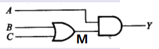
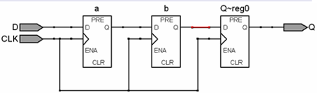
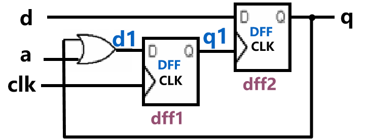
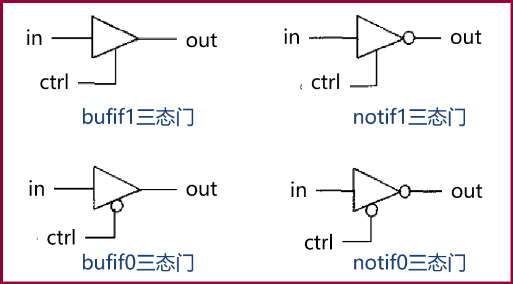
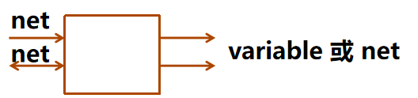
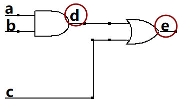
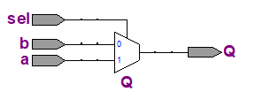
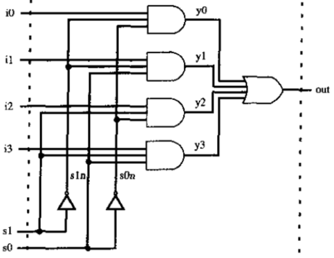

# Verilog 学习笔记-入门篇
> 老师不教是吧,自己学
## Verilog模块结构
Verilog模块大致如下

```verilog
module name_of_module([端口列表]);
     端口信号声明;
     参数声明;
     ---
     内部信号说明
     assign 语句
     底层模块或者门原调用(包括生成模块)
     Initial 或 always 语句块
     任务和函数定义
     specify 块(路径延迟)
endmodule
```
**详细说明**

- 常用语句只有三种
    + `assign`语句
    + `always`语句
    + 底层模块调用语句
- **三种语句的顺序无关** ,这与C语言很不同
- 除一开始的`module`和`endmodule`必须写之外,其他都是可选的

- 缩进在Verilog中并不重要,它主要使用`begin`和`end`来分割

- 模块名是指电路的名字,由用户指定,最好与文件名一致

- **端口列表** 是指电路的输入/输出信号名称列表,信号名由用户指定,各名称用逗号隔开;

- **端口信号声明** 是要说明端口信号的输入输出属性、信号的数据类型,以及信号的位宽;输入输出属性有input,output,inout三种,信号的数据类型常用的有wire和reg两种;信号的位宽用[n1:n2]表示;同一类信号之间用逗号隔开;
- **信号位宽不做说明的话默认是1位,信号类型不做说明的话,默认是wire类型的**
- **参数声明** 要说明参数的名称和初值(例如`parameter` reg A = 1'b1)


!!!Example
     二选一多路选择器的Verilog描述
     ```Verilog
     module MUX21a(a,b,s,y);
     input a,b,s;
     output y;
     assign y=(s?a:b);
     endmodule
     ```
     边沿D触发器的Verilog描述
     ```verilog
     module DFFL(CLK,D,Q);
     input CLK,D;
     output reg Q;
     always @(posedge CLK) begin
      Q <= D;
     endmodule    
     ```
     四位全加器
     ```verilog
     module full_adder(A,B,CIN,COUT);
     input [3:0]A,B;
     input CIN;
     output reg [3:0] S;
     output COUT;
     endmodule
     ```

## assign语句
   `assign`语句称作连续赋值语句,赋值目标必须是wire型的,wire表示电路间的连线.

   基本格式: `assign` 赋值目标 = 表达式,更硬件地说`assign`的左边是一个电路的输入,另外一边是另一个电路的输出

   例如

   - 非: `assgin y = ~a`
   - 与门: `assign y=a&b`
  
  **特点**:之所以称为连续赋值语句是指其总是处于激活状态,只要表达式中的操作数有变化,立即进行计算和赋值.(与连续赋值语句对应的另一种语句称为过程赋值语句)


  Verilog具有丰富的表达式运算功能可以用于assign语句


| 操作类型 | 操作符     | 执行的操作 |
| -------- | ---------- | ---------- |
| 算术     | `*`        | 乘         |
|          | `/`        | 除         |
|          | `+`        | 加         |
|          | `-`        | 减         |
|          | `%`        | 取模       |
|          | `**`       | 求幂       |
| 逻辑     | `!`        | 逻辑求反   |
|          | `&&`       | 逻辑与     |
|          | `          |            | `        | 逻辑或 |
| 关系     | `>`        | 大于       |
|          | `<`        | 小于       |
|          | `>=`       | 大于等于   |
|          | `<=`       | 小于等于   |
| 等价     | `==`       | 相等       |
|          | `!=`       | 不等       |
|          | `===`      | case 相等  |
|          | `!==`      | case 不等  |
| 按位     | `~`        | 按位求反   |
|          | `&`        | 按位与     |
|          | `          | `          | 按位或   |
|          | `^`        | 按位异或   |
|          | `^~`或`~^` | 按位同或   |
| 缩减     | `&`        | 缩减与     |
|          | `~&`       | 缩减与非   |
|          | `          | `          | 缩减或   |
|          | `~         | `          | 缩减或非 |
|          | `^`        | 缩减异或   |
|          | `^~`或`~^` | 缩减同或   |
| 移位     | `>>`       | 右移       |
|          | `<<`       | 左移       |
|          | `>>>`      | 算术右移   |
|          | `<<<`      | 算术左移   |
| 拼接     | `{}`       | 拼接       |
| 复制     | `{n{}}`    | 复制       |
| 条件     | `?:`       | 条件       |


!!!需要注意的地方
     前面几个比较简单,和C语言基本一样

     **等价运算符**
     ```Verilog
     Y=(1'b1==1'bx);结果为x
     Y=(1'bx==1'bx);结果为x
     Y=(1'b1===1'bx);结果为0
     Y=(1'bx===1'bx);结果为1
     ```

     - 等于和不等于运算的结果可能是1(逻辑真)、0(逻辑假)、x(不确定);对于x或z,认为是不确定的值,比较结果为x;
     - case等和case不等的结果只能是1或0,对于x、z认为是确定的值,参加比较;
     
     **按位运算符**

     - 按位运算的操作数是1位或多位二进制数,
     - 按位非的操作数只有一个,将该数的每一位求非运算.
     - 其它按位运算的操作数有2个或多个,将两个操作数对应的位两两运算;
     - 如果操作数位宽不同,位宽小的会自动左添0补齐;
     - 结果与操作数位宽相同;
  
     **缩减运算符**

     ```Verilog
     Y=&4'b1001 (结果为0)
     Y=~&4'b1001 (结果为1,相当于~(&4'b1001))
     ```  

     - 缩减运算的操作数是1位或多位二进制数;
     - 缩减运算的操作数只有一个,将该数的各位自左至右进行逻辑运算,结果只有一位.

     **移位运算符**

     ```Verilog
     Y=4'b1001>>1;(0100)
     Y=4'sb1001>>1;(1100,4'sb指的是有符号)
     ```
           
      - 移位运算的操作数是1位或多位二进制数;
      - 向左或向右移n位;
      - 只有对有符号数的算术右移自动补符号位;
      - 其他移位均自动补0.

     **拼接(拼总线)**
     
     ```Verilog
     Y={4'b1001,2'b11}(100100)
     Y={4{2'b01}}(01010101)
     Y={4{2'b01},2'b11}(0101010111)
     ```
     - 将多个操作数拼接起来;
     - 将操作数复制n遍并拼接起来;
     - 可以组合使用.

     条件运算符
     `a?:b:c`如果a是1,则返回b,否则返回c;可以嵌套使用
  

## always语句块

!!!hint
    基本格式
    ```Verilog
    always @(敏感信号条件表)
       各类顺序语句
    ```

**特点**

- always语句本身不是单一的有意义的一条语句,而是和下面的语句一起构成一个语句块,称之为过程块;过程块中的赋值语句称过程赋值语句;
- 该语句块不是总处于激活状态,当满足激活条件时才能被执行,否则被挂起,挂起时即使操作数有变化,也不执行赋值,赋值目标值保持不变;
- 赋值目标必须是reg型的.

!!!NOTE
    激活条件由敏感信号条件表决定,当敏感条件满足时,过程块被激活.
    **敏感条件有两种,一种是边沿敏感,一种是电平敏感**

**边沿敏感**

- `posedge` 信号名:信号上升沿到来
- `negedge` 信号名:信号下降沿到来

**电平敏感**

- 信号名列表:信号列表中任一个信号有变化(例如`(a,b,c)`或`(a or b or c)`,当三个信号中有一个发生变化) 

!!!example
    ```Verilog
    always @ (posedge CLK)
    Q=D;
    ```
    当CLK上升沿到来时,激活该语句块,将D的值赋给Q;
    否则,该语句块挂起,即使D有变化,Q的值也保持不变,直到下一次赋值
    .

    ```Verilog
    always @ (D)
    Q=D;
    ```
    当D有变化时(不管是由1变0还是由0变1),激活该语句块,将D的值赋给Q;
    否则,该语句块挂起,Q的值保持不变,直到下一次赋值.

!!!NOTE
    - 过程块中的赋值目标必须是reg型的.
    - 由于always语句可以描述边沿变化,在设计时序电路中得到广泛应用.
    - always语句中还可以使用if、case、for循环等语句,其功能更加强大.例如
    ```Verilog
    module DFF2 (CLK,D,Q,RST,EN)
    input CLK,D,RST,EN;
    output Q;
    reg Q;
    always @(posedge CLK or negedge RST)
    begin 
            if (!RST) Q<=0;
            else if (EN) Q<=D
    end
    endmodule
    ``` 
  

**`assign`语句和`always`语句的区别**
   
- 连续赋值语句总是处于激活状态,只要操作数有变化马上进行计算和赋值;
- 过程赋值语句只有当激活该过程时,才会进行计算和赋值,如果该过程不被激活,即使操作数发生变化也不会计算和赋值.
- verilog规定`assign`中的赋值目标必须是`wire`型的,而`always`语句中的赋值目标必须是`reg`型的.
- `always`语句块中如果有多条赋值语句必须将其用`begin` `end`包括起来,`assign`语句中没有`begin` `end`
!!!example
    ```Verilog
    assign Q=D
    ```
    只要D发生变化,马上进行计算和赋值; Q必须是wire型

    ```Verilog
    always @ (posedge clk)                     
             Q=D;
    ```
    只有当clk上升沿到来时,才能激活该块语句,才能进行计算和赋值;否则,即使D发生变化也不会计算和赋值.在未被激活时,Q的值保持不变.
    Q必须是reg型.


**阻塞赋值和非阻塞赋值**

`begin` `end`之间的赋值语句有阻塞赋值和非阻塞赋值之分

- 阻塞赋值`=`:语句顺序执行,前面的执行完才能执行后面的语句;
    ```verilog
       a=1'b1;
       b=1'b1;
    ```
    对a赋值会阻塞赋值b,即只有当赋值a执行完才能执行赋值b.

- 非阻塞赋值`<=`:所有语句并行执行
     ```verilog
       a<=1'b1;
       b<=1'b1;
     ```
    对a赋值不会阻塞赋值b,两个语句并行执行

!!!Example
    ```Verilog
    begin
      m=a*b;
      y=m;
    end   
    ```
    当m赋值完成后,才能执行y的赋值,y得到的是m的新值.
    
    ```Verilog
    begin
      m<=a*b;
      y<=m;
    end   
    ```
    m和y的赋值并行执行,y得到的是m的旧值.
    

    设A、B同时由0变1
    ```Verilog
    always @ (A,B)
    begin
    	M1=A;
    	M2=B&M1;
    	Q=M1|M2;
    end
    ```
    激活前：M1=0,M2=0,Q=0

    激活后：先计算A=1,马上赋值给M1
    再计算B&M1=1,马上赋值给M2
    再计算M1|M2=1,马上赋值给Q

    ```Verilog
    always @ (A,B)
    begin
    	M1<=A;
    	M2<=B&M1;
    	Q <=M1|M2;
    end
    ```

    先计算A=1,(等待,不赋值)

    再计算B&M1=0,(等待,不赋值)

    再计算M1|M2=0,(等待,不赋值)
    
    过程结束
    
    先赋值给M1=1
    
    再赋值给M2=0
    
    再赋值给Q=0

**总结** :

- 阻塞赋值的实质:右边表达式的计算和对左边寄存器变量的赋值是一个统一的原子操作中的两个动作,这两个动作之间不能再插入其他任何动作.

- 非阻塞赋值的实质:首先按顺序计算右边表达式的值,但是并不马上赋值,而是要等到过程结束时再按顺序赋值.


!!!Note
    - 设计组合电路时常用阻塞赋值;
    - 设计时序电路时常用非阻塞赋值;但不是绝对的.
    - 不建议在一个always块中混合使用阻塞赋值和非阻塞赋值

???Example
    阻塞赋值实现的组合电路
    
    ```Verilog
    module MY (A,B,C,Y)
    input A,B,C;
    output Y;
    reg Y;
    reg M;
    always @ (A,B,C)
    begin
        M=B|C;
        Y=A&M;      
    end
    endmodule
    ```
    (其实也可以直接`assign`的)

    非阻塞赋值实现的移位寄存器
      ```verilog    
      module DDF3(CLK,D,Q)
      output Q;
      input  CLK,D;
      reg a,b,Q;
      always @ (posedge CLK)
      begin
      	a<=D;
      	b<=a;
      	Q<=b;
      end
      ```
      这个移位寄存器是每当上升沿到来,同时整体移动的,而不是a先变化,b再变化······

把`assign`和`always`结合起来,举一个4位二进制加法计数器的例子
```Verilog
  module CNT4 (CLK,Q);
  input CLK;
  output [3:0] Q;

  reg [3:0] Q1;

  always @ (posedge CLK)
  begin
    Q1<=Q1+1;
  end

  assign Q=Q1;

  endmodule
```
此程序中有`always`和`assign`两条语句,他们之间是并行的;有一个内部变量Q1,使用时要进行声明;

## 底层模块调用

类似于C语言里面的函数调用,Verilog中也有模块的调用,调用的格式为:**底层模块名 例化名 (端口映射);**

???Example
    实现如下电路

    

    先定义好D触发器,然后再设计顶层电路,在顶层电路中可调用底层模块.
    ```Verilog
    module DFF(CLK,D,Q)
    output reg Q;
    input CLK,D;
    always @ (posedge CLK)
        Q<=D;
    endmodule
    ```
    然后,在顶层模块中调用
    ```Verilog
    module examp (clk,d,a,q)
    output  q;
    input clk,d,a;
    wire d1;
    wire q1;
    DFF dff1(.CLK(clk),.D(d1),.Q(q1));
    DFF dff2(q1,d,q);
    or (d1,a,q);
    endmodule
    ```
    为了调用底层模块,需要加两个内部变量d1和q1,并给两次调用的模块进行命名,调用时例化名不能省略.

**端口映射**

- 端口名关联法(命名法),将模块的端口和调用模块的环境中的变量对应起来, **即(.底层端口名1(外接信号名1),.底层端口名2(外接信号名2),…)** 
```DFF dff1(.CLK(clk),.D(d1),.Q(q1));```,这样的方法因为有名字对应,不必按照模块的端口列表排序.

- 位置关联法(顺序法):将模块的端口以及要接的外部信号按照模块定义的顺序一一对应起来(外接信号名1,外接信号名2,…)
  ```DFF dff2(q1,d,q);```,**这样的方法必须严格按照底层模块的端口信号列表顺序书写**


## 门原语调用

**Verilog** 语言语言提供已经设计好的门,称为门原语(primitive,共12个),这些门可直接调用,不用再对其进行功能描述.

**门原语调用格式：** 门原语名    实例名  (端口连接)

!!!Note
    和模块调用不同,实例名可以省略,端口连接只能采用顺序法,**输出在前,输入在后.**


**常见的门原语**

- 与门等6个:`and`,`or`,`xor`,`nand`,`nor`,`xnor`.用法例如`and (out,in1,in2,in3···)`,第一个是输出,后面跟着输入,输入不限制个数

- 非门:`not`,用法例如`not (OUT,IN)`

- 缓冲器:`buf`,用法例如`buf b1_2out(OUT1, OUT2, IN);`,前面是输出,最后一个是输入,输出个数不限.

- 三态门
    - bufif1(控制端1有效缓冲器) 
    - bufif0 (控制端0有效缓冲器)
    - notif1(控制端1有效非门)
    - notif0(控制端0有效非门)
    - 端口列表中前面是输出,中间是输入,最后是使能端,输出个数不限
???HINT
    
    ```Verilog
    bufif1 b1 (out, in, ctrl);
    bufif0 b0 (out, in, ctrl);
    notif1 n1 (out, in, ctrl);
    notif0 n0 (out, in, ctrl);
    ```


## Verilog中的数据类型
   
   Verilog中的数据类型分为两大类:net(线网)类和variable(变量)类

!!!NOTE
    因连续赋值语句和过程赋值语句的激活特点不同,故赋值目标特点也不同,前者不需要保存,后者需要保存,因此规定两种数据类型,**net型用于连续赋值的赋值目标或门原语的输出**,且仿真时不需要分配内存空间,**variable用于过程赋值的赋值目标**,且仿真时需要分配内存空间.

- net 类中的数据类型(常用wire)
  
|wire(线型)	|tri(三态)	|tri0(下拉电阻)	|supply0(地)|
|------------|-------------|-----------------|------------|
|wand(线与)	|triand(三态与)	|tri1(上拉电阻)	|supply1(电源)|
|wor(线或)	|trior(三态或)	|trireg(电容性线网)|	|

- Variable类中的数据类型(常用reg)
  
|reg(寄存器型)|	           |
|-------------|--------------|
|integer(整型)	|time(时间型)|
|real(实型)	|realtime(实时间型)|  


???info
    将一个信号定义成net型还是varible型,由以下两方面决定
    
    a.使用何种赋值语句对该信号进行赋值,如果是连续赋值或门原语赋值或例化语句赋值,则定义成net型;如果是过程赋值则定义成variable型.
    
    b.对于端口信号来说,input信号和inout信号必须定义成net型的;output信号可以是net型的也可以是variable型的,决定于如何对其赋值(同a).
    
    

!!!Example
    

    该图中d和e的赋值有三种方法

    - 使用连续赋值语句
      ```Verilog
      assign d=a&b;
      assign e=d|c;
      ```
      此时,d和e必须定义为net类的

    - 使用门原语赋值
      ```Verilog
      and (d,a,b);
      or (e,d,c);
      ```
      此时,d和e也必须是net类的

    - 使用过程赋值语句
    ```verilog
       always @(a,b,d,c)
        begin
          d=a&b;
          e=d|c;
        end
    ```
    此时d和e必须是reg类型的.

    我们也可以在这里回忆一下,这里d先改变了,e会受到d的影响,所以需要使用阻塞赋值. 
  
## Verilog中数字的表示格式以及逻辑值

- 无符号数的表示方法:`位宽`+`'`+`进制`+`数字`(5'd8,五位十进制8,也就是$(01000)_2$)
- 有符号数的表示方法:`位宽`+`'`+`sb`+`数字`(8'sb10111011,第一位是符号位,是$-(01000101)_2=-69_{10}$)
- Verilog语言中的逻辑值有四种:
    + 1：逻辑1，高电平，数字1
    + 0：逻辑0，低电平，数字0
    + x：不确定
    + z：高阻态

## if语句

Verilog中有四种类型的if语句,大致也跟C语言类似

- `if(<条件表达式>)语句;`
- `if(<条件表达式>)真语句;else 假语句;`
- ```verilog
  if (<条件表达式1>)语句1;
  else if (<条件表达式2>)语句2 ;
  else if (<条件表达式3>)语句3 ;
  ```
- ```Verilog
  if (<条件表达式1>)语句1 ;
  else if (<条件表达式2>)语句2 ;
  else if (<条件表达式3>)语句3 ;
  else 默认语句 ;
  ```

- 多条语句时使用`begin` `end`

!!!Eexample
    计数器
    ```Verilog
    always @(posedge CLK)
    if (!RST) Q=0;
    else Q=Q+1;  
    ```

???Danger
    在用if语句设计“组合电路”时要注意，如果条件不完整，会综合出寄存器。

    使条件完整的两种方法:
    
    - 加else
    - 设初值
    
    

    ```Verilog
    always @(a,b)
    if (sel) Q=a;
    else      Q=b;
    ```

     ```Verilog
    always @(a,b)
    Q=a;
    if (sel) Q=b;
     ```

- 条件表达式格式:(计算表达式),计算表达式可以是任意形式的表达式；条件表达式的结果只有0和1两种，如果计算表达式的值为0，则条件表达式的值为0，否则为1。

例如,设a=1000,b=0110

|条件表达式|	计算表达式|	结果|
|--------|-----------|--------|
|if (a==b)|	0	|0|
|if (a>b)	|1	|1|
|if (a)|	1000|	1|
|if (a*b)|	11_0000(前两位被截掉)|	0|
|if (a|b)	|1110|	1|
|if (a&b)	|0000|	0|


## Case 语句

功能类似于C语言中的`switch case`语句

格式:
```Verilog
    case (表达式)
    取值1: 语句1;
    取值2: 语句2;
    取值3: 语句3;
    ...
    ...
    default: 默认语句;
    endcase
```

`default`语句可加可不加,但是要注意条件的完整性

## Verilog的语言描述风格

- 结构化描述(也称门级描述,全部使用门原语和底层模块调用)
- 数据流级描述(全部用`assign` 语句)
- 行为级描述(全部用`always`语句配合`if``case`语句等)
- RTL级描述方式(数据流级+行为级，可综合)
- 实际描述是三种混合的

!!!Example 四选一选择器的多种Verilog表示方法
    
    门级描述
    ```Verilog
    module mux4_to_1 (out, i0, i1, i2, i3, s1, s0);
    output out;
    input i0, i1, i2, i3;
    input s1, s0;

    wire s1n, s0n;
    wire y0, y1, y2, y3;

    not (s1n, s1);
    not (s0n, s0);

    and (y0, i0, s1n, s0n);
    and (y1, i1, s1n, s0);
    and (y2, i2, s1, s0n);
    and (y3, i3, s1, s0);

    or (out, y0, y1, y2, y3);
    endmodule
    ```
   
    数据流级描述
    ```Verilog
    module mux4_to_1  (out, i0, i1, i2, i3, s1, s0);
    output out，
    input i0, i1, i2, i3;
    input s1, s0;
    assign out = (~s1 & ~s0 & i0)|(~s1 & s0 & i1) |(s1 & ~s0 & i2) |(s1 & s0 & i3) ;
    endmodule
    ```

    行为级描述
    ```Verilog
    module mux4_to_1(out, i0, i1, i2, i3, s1, s0);
    output out;
    input i0, i1, i2, i3;
    input s1, s0;
    reg out;
    always @(s1 or s0 or i0 or i1 or i2 or i3)
     begin
        case ({s1, s0})
           2'b00: out = i0;
           2'b01: out = i1;
           2'b10: out = i2;
           2'b11: out = i3;
           default: out = 1'bx;
         endcase
      end
    endmodule
    ``` 

## 其他规定

- 关键字:关键字即Verilog语言中预定义的有特殊含义的英文词语

- 标识符:标识符即用户自定义的信号名、模块名等等；
  注意关键字不能作标识符；
  Verilog区别大小写（关键字都是小写）

- Verilog文件扩展名为.v；verilog不要求文件名和模块名一致

- 注释:和C语言一样,//单行注释,/**/多行注释