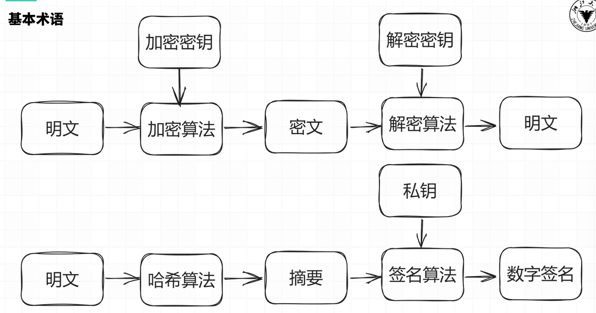

# Lec6-Crypto

> 授课：

## 密码学基础

密码学是研究编制密码和破译密码的技术科学

+ 设计加解密算法
+ 破解加解密算法

## 密码学介绍

### 为何需要密码学

+ 存储：信息的存储可能是不安全的，会被窃取
+ 传输：信息的传输过程可能也不是隐秘的，会被窃听

不能直接使用明文进行存储和传输！

### Crypto in CTF

出题人给定一个有一定缺陷的加密算法，需要选手攻破该加密算法，得到解密后的文字，或者伪造加密信息

比赛中题目虽然常常会涉及许多较新的论文研究结果，但是仍与目前隐私计算等前沿密码学安全研究有一定距离

### Crypto学习资源推荐
+ [CTF Wiki](https://ctf-wiki.org/)
+ 4老师倾情推荐的密码学做题网站：[CryptoHack](https://cryptohack.org/)
+ 密码学入门书籍：[An introduction to mathematical cryptography](https://link.springer.com/book/10.1007/978-1-4939-1711-2)

## 基本术语

+  消息被称为明文（Plaintext）。用某种方法伪装消息以隐藏它的内容的过程称为加密 （Encryption），被加密的消息称为密文（Ciphertext），把密文恢复为明文的过程称为密（Decryption）。
+ 密码算法（Cryptography Algorithm）：是用于加密和解密的数学函数。
+ 密钥（Key）：加密或解密所需要的除密码算法之外的关键信息。
+ 对称加密（Symmetric Cryptography）
    - 特点：在加密和解密时使用同一密钥
    - 例子：流密码（RC4），块密码（AES，DES）
+ 非对称加密（Asymmetric Cryptography）
    - 特点：在加密和解密时使用不同密钥，加密使用公钥，解密使用私钥
    - 例子：RSA，ElGamal，ECC
+ 哈希函数（Hash Function）
    - 特点：把输入内容单向映射到一个短的摘要上
    - 应用：下载文件完整性校验
    - 例子：CRC，MD5，SHA系列
+ 数字签名（Digital Signature）
    - 应用：对消息进行签名（也是一个短的消息），以防消息的冒名伪造或篡改

## 数学基础

### [OI Wiki 数论部分](https://oi-wiki.org/math/number-theory/basic/)

### 整除：$ a \mid b $

+ $\forall a \in \mathbb{Z}~, 1 \mid a$ ；若 $a \neq 0$，则 $a \mid 0$ 且 $a \mid a$
+ 若 $a \mid b$ 且 $b \mid c$，则 $a \mid c$
+ 若 $a \mid b$ 且 $a \mid c$，则 $a \mid (sb + tc)$，其中 $s, t \in \mathbb{Z}$

### 最大公因数（Greatest Common Divisor, GCD）：$ \gcd(a, b) $

+ $\gcd(a, b) = \gcd(b, a)$
+ $\gcd(a, b) = \gcd(a, b - a)$
+ $\gcd(a, b) = \gcd(a, b \mod a)$

特别的，当 $a$、$b$互素，即 $ \gcd(a, b) = 1 $时，一定存在整数 $x, y$ 使得 $ax + by = 1$

### 算数基本定理

任何一个大于 $1$ 的自然数 $n$ 都可以唯一地分解为若干个素数的乘积
$$ n = p_1^{a_1} \times p_2^{a_2} \cdots  \times p_k^{a_k} $$
其中 $p_1, p_2, \cdots, p_k$ 是素数，$a_1, a_2, \cdots, a_k$ 是正整数

### 同余

$a,b$对于模$n$同余：$a \equiv b \pmod{n}$

设 $a, b, c, d, n$均为整数，且 $n \neq 0$，则有：

+ $ n \mid a \Leftrightarrow a \equiv b \pmod{n} $
+ $ a \equiv a \pmod{n} $
+ 若 $a \equiv b \pmod{n}$，$c \equiv d \pmod{n}$，则 $a \pm c \equiv b \pm d \pmod{n}$，$ac \equiv bd \pmod{n}$
+ 若 $a \equiv b \pmod{n}$，则 $a^k \equiv b^k \pmod{n}$
+ 若 $a \equiv b \pmod{n}$，$c \equiv d \pmod{n}$，则 $a^c \equiv b^d \pmod{n}$
+ 若 $a + b \equiv 0 \pmod{n}$，则称 $a$ 与 $b$ 互为加法模 $n$ 逆元
+ 若 $ab \equiv 1 \pmod{n}$，则称 $a$ 与 $b$ 互为乘法模 $n$ 逆元。$a$ 的乘法模 $n$ 逆元记为 $a^{-1}$ ，$a$ 有乘法模 $n$ 逆元当且仅当 $\gcd(a, n) = 1$

### 中国剩余定理

若 $m_1, m_2, \cdots, m_k$ 是两两互质的正整数，则对于任意的整数 $a_1, a_2, \cdots, a_k$，同余方程组
\\[
\begin{cases}
    x \equiv a_1 \pmod{m_1} \\\\
    x \equiv a_2 \pmod{m_2} \\\\
    \cdots \\\\
    x \equiv a_k \pmod{m_k}
\end{cases}
\\]
对模 $m = m_{1}m_{1} \cdots m_{1}$ 有唯一解 $x$。

设 $M_i = \frac{m}{m_i}$，则 $M_i$ 与 $m_i$ 互质，存在整数 $N_i$ 使得 $M_iN_i \equiv 1 \pmod{m_i}$（$N_i$ 为 $M_i$ 的模 $m_i$ 乘法逆元），则
$$ x = \sum_{i=1}^{k} a_iM_iN_i $$

### 欧拉函数

对于正整数 $n$，欧拉函数 $\varphi(n)$ 定义为小于等于 $n$ 的正整数中与 $n$ 互质的数的个数

+ 若 $n = p_1^{a_1} \times p_2^{a_2} \cdots  \times p_k^{a_k}$，则 $\varphi(n) = n \times (1 - \frac{1}{p_1}) \times (1 - \frac{1}{p_2}) \cdots (1 - \frac{1}{p_k})$
+ 若 $n = p^a$，则 $\varphi(n) = p^a - p^{a-1} = p^{a-1}(p-1)$
+ 若 $n = p \times q$，且 $p, q$ 互质，则 $\varphi(n) = \varphi(p) \times \varphi(q)$
+ 若 $n = p \times q$，且 $p, q$ 为不同的质数，则 $\varphi(n) = (p-1)(q-1) = \varphi(p) \times \varphi(q)$

### 欧拉定理

若 $a, n$ 互质，则 $a^{\varphi(n)} \equiv 1 \pmod{n}$

费马小定理（欧拉定理的特例）：当 $n$ 为质数时，$\varphi(n) = n - 1$，即 $a^{n-1} \equiv 1 \pmod{n}$

### RSA算法

+ 选择两个大质数 $p, q$，计算 $n = p \times q$，$\varphi(n) = (p-1)(q-1)$
+ 选择 $e$，使得 $1 < e < \varphi(n)$，且 $\gcd(e, \varphi(n)) = 1$
+ 计算 $d$，使得 $d \equiv e^{-1} \pmod{\varphi(n)}$ ，即 $d \times e \equiv 1 \pmod{\varphi(n)}$
+ 于是得到公钥为 $(e, n)$，私钥为 $(d, n)$， 设明文为 $m$，密文为 $c$，若消息太长，可将消息分段加密
    + 加密：$c = m^e \mod n$
    + 解密：$m = c^d \mod n$

## 古典密码

+ 代换（substitution）密码——用新的替换原先的内容
+ 置换（permutation）密码——打乱原先的顺序
+ Hill密码

### 凯撒密码

又称加法密码，是一种最简单的替换密码，是一种使用恒定偏移量的替换密码，将字母表中的每个字母循环移动固定位数得到密文

+ 加密：$y = \text{encode}(x) = (x + key) \mod 26$
+ 解密：$x = \text{decode}(y) = (y - key) \mod 26$
+ 破解：暴力枚举观察结果（常见编码ROT13，取$key = 13$）

一般的凯撒加密只作用于26个字母，但也可拓展到ASCII码表上（常见编码ROT47，将33~126作为字母表，取$key = 47$）

### 仿射密码

仿射密码是一种线性替换密码，类似于凯撒加密，但不止进行加法

+ 加密 $y = \text{encoude}(x) = (x \times key_1 + key_2) \mod 26$
+ 解密 $x = \text{decode}(y) = (y - key_2) \times key_1^{-1}  \mod 26$
+ 破解：单表密码加密前后的字符是一一对应的，不会破坏统计规律，根据英文文本中字母出现的频率以及一些常见单词即可轻松破解(如`the`, `and`, `you` `a`等)

### 维吉尼亚密码

一种多表加密的替换密码，密钥任意长，并且以循环使用，第 $i$ 个字符用第 $i$ 个密钥进行偏移

+ 加密：$y_i = \text{encode}(x_i) = (x_i + key_i) \mod 26$
+ 解密：$x_i = \text{decode}(y_i) = (y_i - key_i) \mod 26$

例：明文CRANE，密钥TONY

+ (C, T) $\rightarrow$ V
+ (R, O) $\rightarrow$ F
+ (A, N) $\rightarrow$ N
+ (N, Y) $\rightarrow$ L
+ (E, T) $\rightarrow$ X

破解：确定密钥长度 $\rightarrow$ 分组爆破加法密码 $\rightarrow$ 得到密钥

### 置换密码

加密变换使得信息元素只有位置变化而内容不变，比如对于一种置换密码，其置换表为

|X|1|2|3|4|5|6|
|--|--|--|--|--|--|--|
|E(X)|3|5|1|6|4|2|

对于明文$\texttt{crypto basic}$，先进行分组（不足需填充）：$\texttt{[crypto]}$和$\texttt{[ basic]}$，然后对每一组进行置换：
对每一组进行置换：
$\texttt{[crypto]} \rightarrow \texttt{[yoctrp]}$  $\texttt{[ basic]} \rightarrow \texttt{[ac ibs]}$
最终密文就是$\texttt{yoctrpac ibs}$

### 栅栏密码

栅栏密码也是一种置换密码，其将明文分割成k行，然后重新拼接，这里k即为加密的密钥

对于明文$\texttt{crypto basic}$,取 $k=3$ ，将明文分割成三行

|
c
|
p
|&#32;|
s
|
|---|---|---|---|
|r|t|b|i|
|y|o|a|c|

因此得到的密文为$\texttt{cp srtbiyoac}$

### Hill密码

希尔密码是运用基本线性代数原理实现的替换密码

每个字母当作26进制数字，将一串字母当成 $n$ 维向量，与一个 $n \times n$ 的矩阵相乘，再将得出的结果 mod 26，其中这个 $n \times n$ 矩阵就是密钥

比如明文 $\texttt{IT}$ ，转换成26进制为$P = \begin{bmatrix} 9 & 20 \end{bmatrix} $，加密密钥
$ K = \begin{bmatrix}
11 & 8 \\\\
3 & 7
\end{bmatrix} $

密文即为$ C = P \times K = \begin{bmatrix} 159 & 212 \end{bmatrix}\mod 26 = \begin{bmatrix} 3 & 4 \end{bmatrix} $，转回字母即 $\texttt{CD} $
解密只需要计算 $K$ 的逆矩阵即可，$ P = C \times K^{-1} = \begin{bmatrix} 3 & 4 \end{bmatrix} \times
\begin{bmatrix}
7 & 18 \\\\
23 & 11
\end{bmatrix} = \begin{bmatrix} 9 & 20 \end{bmatrix} $，再转回字母即 $\texttt{IT} $