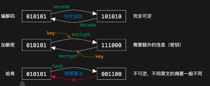
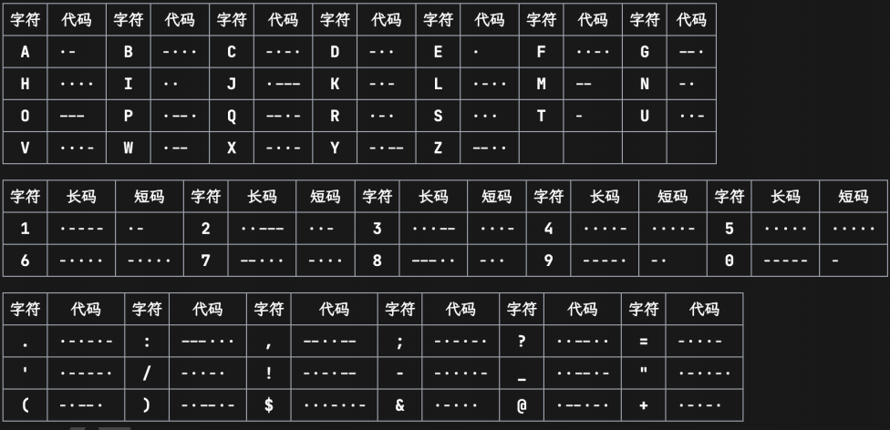
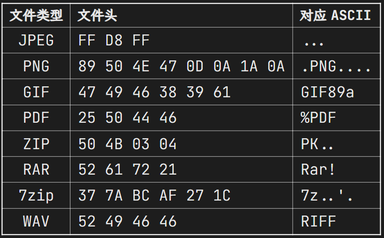
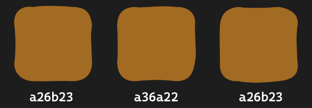
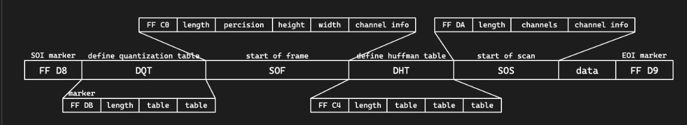
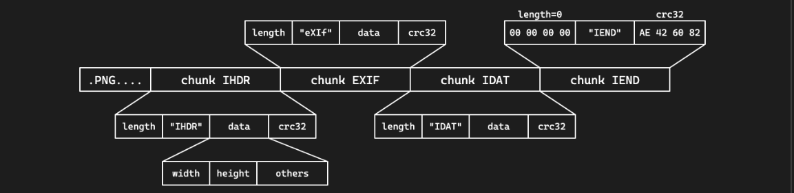
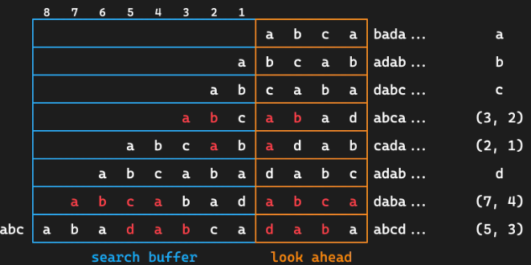
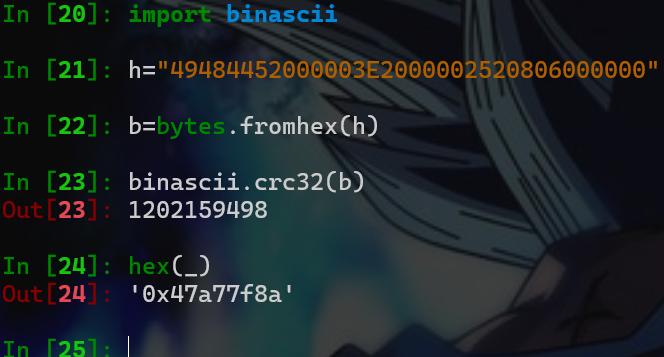

## 7-4 lec3-Misc
> 授课：goduck 

### 什么是Misc
- 杂项 ALL-PWN-WEB-CRYPTO - REVERSE
- 隐写、取证、OSINT（信息搜集）、PPC（编程类） ——传统 misc 题
- 游戏类题目（大概也算 PPC）、工具运用类题目
- 编解码、古典密码 ——不那么 crypto 的 crypto
- 网络解谜、网站代码审计 ——不那么 web 的 web
- 代码审计、沙箱逃逸 ——不那么 binary 的 binary
- Blockchain、IoT、AI ——新兴类别题目

### 编码基础

-  一切信息在计算机看来都是 0 和 1
    - 编解码 / 加解密 / 哈希都是在 01 串之间进行的变换
-  为什么你看见的输入输出是字符？
    - 计算机通过字符编码规则将 01 串转换为了可见字符
- 三种常见的01串转换方式
      
    - 常用的解码工具[ **CyperChef** ](https://lab.tonycrane.cc/CyberChef/)
#### 为什么会乱码
- 字符编码：人类理解的字符 > 计算机理解的 01 串 之间的映射

- 为什么会出现乱码：用一种字符编码规则解读另一种字符编码的 01 串
；A0-FF：可见字符
       - 特点：任何字节流都可以用其解码
- 利用 Unicode 字符集的
- 常见的字符编码：
- ASCII：一共 128 个项，即每个字符可以用一个 7 位的 01 串表示（或一字节）
       - 00-1F：控制字符；20-7E：可见字符；7F：控制字符（DEL）
- Latin-1（ISO-8859-1）：扩展了 ASCII，一共 256 个项
       - 80-9F：控制字符一系列编码
       - UTF-8 / UTF-16 / UTF-32 / UCS
- 中国国标字符集系列编码
       - GB 2312 / GBK / GB 18030-2022
##### 怎么就乱码了
几个字符集不兼容的部分互相编解码，常见的：

- 用 GBK 解码 UTF-8 编码的文本
- 用 UTF-8 解码 GBK 编码的文本
- 用 latin-1 解码 UTF-8 编码的文本
- 用 latin-1 解码 GBK 编码的文本
- 先用 GBK 解码 UTF-8 编码的文本，再用 UTF-8 解码前面的结果
- 先用 UTF-8 解码 GBK 编码的文本，再用 GBK 解码前面的结果
- 这里我们请同学们自行研究，lab 中会用到（后续详细发布），几种推荐的方式：
- CyberChef，通过 Input 和 Output 窗口的字符集设置
- 需要注意，CyberChef 的 UTF-8 不会将错误解码替换为 �（非预期）
- vscode 右下角的编码方案（重新打开 / 用编码保存）
- 必要的时候可以使用 python 来进行编解码 / 进制转换等

#### 摩斯电码

前面说到的字符编码：01 串 > 字符；接下来看另一种：字符 > 字符

- 摩尔斯电码（Morse Code）：利用点划（“滴”的时间长短）来表示字符
    - 点 ·：1 单位；划 -：3 单位
    - 点划之间间隔：1 单位；字符之间间隔：3 单位；单词之间间隔：7 单位
- 字符集：A-Z、0-9、标点符号（.:,; ='/!-_"()$&@+）、一些电码专用表示
- 表示中文：电码表（一个汉字对应四个数字），数字使用短码发送
    

#### BASE编码

- Base16：即 16 进制表示字节流，长度翻倍
- Base32：按照 5 bit 一组（每个 0-31），按照字符表（A-Z2-7）映射
       - 结果长度必须是 5 的倍数，不足的用 = 不齐（明显特征）
- Base64：按照 6 bit 一组，按照字符表映射（最常用）
      - 标准字符表：A-Za-z0-9+/
      - 另有多种常用字符表，如 URL 安全字符表：A-Za-z0-9-_
      - 结果长度必须是 4 的倍数，不足的用 = 不齐（1~2 个，明显特征）  

##### Base-n 系列的本质：
- 字节流 > 整数 > n 进制 > 系数查表
  所以除去前面规则的 16/32/64 进制，还有一些其他的 Base 编码：
- 分组：
      - Base85：4 字节整数 > 85 进制 > 5 个系数
      - 常用字符表：0-9A-Za-z!#$%&()*+-; >?@^_`{ }~
      - 标准字符表：!-u（ASCII 编码中 0x21-0x75）
      - 作为大整数转换进制：
      - Base62：0-9A-Za-z（比 Base64 少了 +/）
      - Base58：0-9A-Za-z 去除 0OIl
      - Base56：比 Base58 少了 1 和 o
      - Base36：0-9A-Z（比 Base62 少了 a-z）

### OSINT 基础
>我要成为开盒糕手！

- Open Source INTelligence：开源网络情报

通过完全公开的信息进行合理的推理，获取情报
一般在 misc 题目中出现即泛指信息搜集，有几种情况：
- 构造了一个全新的虚拟身份，搜集得到出题人准备好的信息
- 根据图片、文档等附件泄漏的信息进行推理（主要）
- 包括根据图片内容推理找到拍摄位置、当时环境等信息

#### 信息搜集
- [数字信息搜集工具](https:/github.com/ffffffff0x/Digital-Privacy)
-  用户名批量查询
   - [sherlock](https:/github.com/sherlock-project/sherlock) 
   - [namechk](https:/namechk.com/)

#### 文件信息泄露
- 各种文档的元信息（metadata）可能包括作者、修改时间等信息
    - 图片的 EXIF 信息，可通过 exiftool 查看一般以 xml 形式存储，可以直接通过二进制抹除，或者通过操作系统
- 工程文件夹泄漏信息
    - Visual Studio 的各种配置文件，.vs 文件夹中信息
    - .vscode 文件夹中的配置文件
    - .git 文件夹，泄漏全部修改历史、提交信息、提交者等
    文件夹路径信息泄漏
    - .DS_Store 文件，macOS 下的文件夹布局信息

前面各种工程配置文件等也会泄漏（比如 vs 的 pdb 调试信息）
markdown 文件图片路径（本地路径 / 图床用户 / 自建图床网站）   

#### 照片信息分析
  - 识图
  - 属性
  - 地标
  - 天气信息，云层信息，估计方向，位置，时间等
  - 风景信息，Yandex搜索

## 7-9 Misc专题1
> 授课: 45gfg9 :fontawesome-solid-box:
>
> 长沙，好玩；上课，不好玩

### Part1:文件系统基础

#### 文件如何存储

- 不同的文件系统，不同的组织方式
    + MS 派：FAT、NTFS、exFAT、ReFS
    + Apple 派：HFS、APFS
    + Linux 派：ext[234]、XFS、Btrfs、ZFS...
- 文件是一串二进制数据
    + 在 HDD 上是微小磁极的磁化方向
    + 在 SSD 上是电荷的存储状态
- “文件名”是由文件系统管理的，不是文件本身数据的一部分
    + 文件系统会记录文件名、文件大小、创建时间、修改时间等信息
    + 文件内容才是真正的数据

####  如何判断文件类型
- 扩展名
    + .jpg  , .webp,.txt,.docx
    + 是文件名的一部分，可以随意修改
    + 决定了打开文件的默认程序
- 内容
    + 通过文件内容来识别文件类型
    + `file` 命令
    + 不同文件类型有不同的magic number

#### 二进制查看文件与分析
- 010 Editor
    + 全平台最常用的二进制编辑器，付费软件（但容易破解）
    + 有丰富的 binary templates，支持解析多种文件格式
- wader/fg
    +  Go 编写的开源二进制文件查看工具
    +  支持类似 jq 语法的查询
- Hex Fiend
    + macOS 上免费开源高效的二进制编辑器
    + 也有多种二进制格式的解析模板，但显示没有 010 丰富
- ImHex
    + 全平台开源二进制编辑器
    + 类似 010 Editor，但使用麻烦一些
    + 可以编写自定义解析模板

#### 文件类型检测与元信息

#### 文件附加内容的识别与分离
- 大部分文件类型都有一个标记文件内容结束的标志
  + 比如 PNG 的 IEND 块、JPEG 的 EOI 标志（FF D9）
  
- 所以一般在文件末尾添加其他字节时，不会影响原文件本身的用途
  + 因此有些隐写是将数据隐藏在文件末尾达到的
  + 或者在文件后叠加另一份文件
  + cat cover.jpg secret.zip > cover_stego.jpg
- 附加内容的识别
  + exiftool 一般可以识别图像文件后的附加数据
  + binwalk 可以检测叠加的文件
- 附加文件的分离
  + binwalk 或 foremost 识别并分离
  + dd if=<src> of=<dst> bs=1 skip=<offset> 手动分离

### Part2: 图像隐写基础技术

#### 文件内容基本隐写
- 文件末尾添加数据
    + exiftool 识别短数据，或者十六进制编辑器直接观察
    + binwalk 识别叠加文件，foremost 提取
    + 图像末尾叠加一个压缩包，就是所谓的“图种”
        - 修改后缀名可能可以解压（部分解压软件会忽略前面的图像）
        - 其实不如直接分离
- 直接利用元信息
    + exiftool 即可读取
  
#### 色彩空间、色彩模式
色彩空间（sRGB、Adobe RGB、Display P3 等）是一个相对非常复杂的概念，而且是针对显示的，我们不详细介绍

我们注重于表示颜色的数据上，一般称为色彩模式（color mode）：

+  二值图像（bitonal）：每个像素只有两种颜色，如黑白
+    灰度图像（grayscale）：每个像素有多种灰度，如 256 级灰度
+    RGB(A)：3(+1) 通道，表示 RGB 三种颜色，A 表示透明度通道(印刷常用)
+    CMYK：青 cyan、品红 magenta、黄 yellow、黑 black 四种颜色混合
+    HSV：色调 hue、饱和度 saturation、明度 value
+    HSL：色调 hue、饱和度 saturation、亮度 lightness
+    YCbCr：亮度 luminance、蓝色色度 blue chroma、红色色度 red chroma
+    LAB：亮度 lightness、绿红色度 A、蓝黄色度 B
+    ...

#### LSB 隐写

- 人眼对于微小的颜色变化不敏感
  + 对于 8 bit 的颜色值，最低位的变化不会被察觉
  + 可以随意修改最低位，而不影响图像的显示效果
- LSB 隐写将颜色通道的最低位用来编码信息
  + 图像：stegsolve / CyberChef View Bit Plane
  + 数据：stegsolve / CyberChef Extract LSB / zsteg / PIL

#### PIL 图像处理基础
PIL（Python Imaging Library）是 Python 中非常常用的图像处理库

- 安装：pip3 install pillow 或 apt install python3-pil
- 官方文档 / 教程：https://pillow.readthedocs.io/en/stable/
  
- 基本用法
    +  from PIL import Image 导入和图像读写处理有关的 Image 类
    +  img = Image.open(file_name) 打开图像
    +  img.show() 显示图像；img.save(file_name) 保存图像
    +  img.size 图像大小，img.mode 图像模式
    +  img.convert(mode) 转换图像模式
    +  img.getpixel((x, y)) 获取像素点颜色
    +  img.putpixel((x, y), color) 设置像素点颜色
    +  np.array(img) 将图像转换为 numpy 数组

- 具体图像模式以及转换
   + '1'：黑白二值（0/255）；'L'：灰度（8 bit），'l'：32 bit 灰度
      - L = 0.299 R + 0.587 G + 0.114 B
   + 'P'：8bit 调色盘，获取的像素值是调色盘索引
   + 'RGB'、'RGBA'
   + 'CMYK'：转换时有色差，CMY = 255 - RGB，K = 0
   + 'YCbCr'、'LAB'、'HSV' 等，转换时有复杂公式（可能出现新的隐写）
- PIL 其他模块用途
    + ImageDraw 用于绘制图像、绘制图形
    + ImageChops 用于图像通道的逻辑运算
    + ImageOps 用于图像整体的运算一类
    + ImageFilter 用于图像的滤波处理

### Part3:图像格式介绍

#### 图像存储
- 图像信息：宽高、色彩模式、色彩空间等
   + EXIF 信息：拍摄设备、拍摄时间、GPS 信息等
- 像素数据：每个像素的颜色信息；二值、灰度、RGB、CMYK、调色盘等
    + 对于标准 RGB 图像，每个像素需要 24 bits(RGB三个字节，可能有A)
    + 对于一张 1080p 图像，需要 6.22 MB(RGB)，4K 则需要 24.88 MB(RGBA)
    + BMP 格式
- 压力给到了图像格式的压缩算法
    + PNG 无损，JPEG 有损
    + GIF 有损且只支持 256 色
    + 新兴格式如 HEIF、WebP、AVIF 等

#### JPEG 文件格式

JPEG 使用分段的结构来进行存储，各段以 0xFF 开头，后接一个字节表示类型：

  -   FFD8（SOI）：文件开始
  -   FFE0（APP0）：应用程序数据段，包含文件格式信息（上图没有）
  -   FFE1（APP1）：应用程序数据段，包含 EXIF 信息（上图没有）
  -   FFDB（DQT）：量化表数据
  -   FFC0（SOF）：帧数据，包含图像宽高、色彩模式等信息
  -   FFC4（DHT）：huffman 表数据
  -   FFDA（SOS）：扫描数据，包含数据的扫描方式，huffman 表的使用方式等
  -   FFD9（EOI）：文件结束
 
 #### JPEG压缩原理
- JPEG 的压缩原理是 DCT（离散余弦变换）+ Huffman 编码
    + 由 RGB 转换到 YCbCr，然后减少 Cb、Cr 的采样率
    + 将图像分块，每个块 8x8，进行 DCT 变换
       - 将图像转换为频域，便于压缩高频部分
- 量化，将 DCT 变换后的系数除以量化表中的系数
    + 再次减少高频部分的数据
    + 根据不同的量化表，可以调整压缩质量
- 通过游程编码和 huffman 编码进行压缩

#### PNG文件格式

- 文件头 89 50 4E 47 0D 0A 1A 0A | .PNG....
- 采用分块的方式存储数据
    + 每块的结构都是 4 字节长度 + 4 字节类型 + 数据 + 4 字节 CRC 校验
    + 四个标准数据块：IHDR、PLTE、IDAT、IEND
    + 其他辅助数据块：eXIf、tEXt、zTXt、tIME、gAMA……
        - eXIf 元信息，tIME 修改时间，tEXt 文本，zTXt 压缩文本

四种标准数据块：

- IHDR：包含图像基本信息，必须位于开头
    + 4 字节宽度 + 4 字节高度
    + 1 字节位深度：1、2、4、8、16
    + 1 字节颜色类型：0 灰度，2 RGB，3 索引，4 灰度透明，6 RGB 透明
    + 1 字节压缩方式，1 字节滤波方式，均固定为 0
    + 1 字节扫描方式：0 非隔行扫描，1 Adam7 隔行扫描
- PLTE：调色板，只对索引颜色类型有用
- IDAT：图像数据，可以有多个，每个数据块最大 2 31 -1 字节
- IEND：文件结束标志，必须位于最后，内容固定
    - PNG 标准不允许 IEND 之后有数据块
  

#### PNG压缩原理

- PNG 使用 Deflate 压缩算法
    + 是 LZ77 结合 huffman 编码的一种压缩算法
    + LZ77：利用滑动窗口，找到最长的重复字符串，用指针和长度表示
     
- 会进行滤波，减少数据的冗余性，提高压缩率
    + 五种滤波器：None、Sub、Up、Average、Paeth

### Part4:隐写进阶技术
#### 图像大小修改
- PNG 图像按行进行像素数据的压缩，以及存储 / 读取
   + 当解码时已经达到了 IHDR 中规定的大小就会结束
   + 因此题目可能会故意修改 IHDR 中的高度数据，使之显示不全
   + 恢复的话更改高度即可，同时注意 crc 校验码，否则可能报错
       - binascii.crc32(data)，data 为从 IHDR 开始的数据
   -    

#### 需要原图的图像隐写

有些情况下的图像隐写需要原图才能解密，这时第一步一般是 OSINT 搜索原图

+ 使用识图工具进行搜索
+ 一般需要搜原图的题题目描述会带有来源暗示之类的
+ 多注意搜到的图像大小、质量，确保是真正的原图
接下来利用原图和隐写图像的差异进行分析

+ 图像像素异或观察差异
    - PIL 手动处理 / ImageChops.difference
    - stegsolve image combiner
盲水印系列
- 给了打水印的代码的话直接尝试根据代码逆推即可
- 没有给代码的可能就是常见的现有盲水印工具
- [guofei9987/blind_watermark](https://github.com/guofei9987/blind_watermark)

- 工具steghide、stegoveritas、SilentEye

#### 音频文件格式简介
音频类题目其实并不常出：

- mp3：有损压缩
   + 具体格式不多介绍，遇到了基本上也就是声音本身的隐写
- wav：无损无压缩（waveform）
    + 直接存储的是音频的波形数据，可操作性更高
    + 文件结构也是分 chunk 的，有 RIFF、fmt、data 等
    + 编码音频数据的 sample 也可以进行 LSB 隐写
- flac：无损压缩，如果出现可能考虑转换为 wav
- 使用 Python 的 soundfile / librosa 库进行音频处理
- 频谱隐写
- 音频叠加
- 如果可以找到原音频，或提供了原音频，可以进行比较
- 方法是在 Audition 中创建多轨会话
    - 将两个音频拖入两个轨道
    - 效果 > 匹配响度，将两条音轨的响度匹配
    - 点进其中一条音轨，效果 > 反相，将波形上下颠倒
    - 两条音轨匹配上波形之后播放 / 混音，就能听到差异了

### 其他Misc题目
#### ZIP伪加密
- ZIP 也使用分段的方式存储数据
    + 本地文件记录 50 4B 03 04，可以有多个
    + 中央目录记录 50 4B 01 02，可以有多个
    + 中央目录结束 50 4B 05 06
- 在中央目录记录中有一个字段记录加密方式
    + 如果不为 0 表示有加密
- 其他字段，如最小版本
    + 可能修改为一个不合法的值，无法用解压软件解压
#### 沙箱逃逸和 PPC
- 沙箱：做了某些限制的隔离环境
    + 例如 Docker，或一个沙箱程序，如 rbash
- Python 解释器也可以作为一个沙箱
    + 通过限制模块、限制函数、代码审计等方式
- 沙箱逃逸就是在沙箱中执行代码，获取到沙箱外的权限
    + Python 的 os 及 importlib 模块是常见的逃逸点

- PPC 题较为不常见
   - 一般是限制代码长度 / 汇编指令，要求实现某个功能

