# Entity Relationship Model


!!!definition "Steps of Database design"

    - Requirement analysis
    - Conceptual database design,一般在这个阶段使用ER图来描述数据库的结构
    - Logical database design,将ER图转换为关系模式
    - Schema refinement,对关系模式进行优化
    - Physical database design,选择合适的数据库管理系统，并进行优化
    - Implementation,将数据库设计文档转换为实际的数据库


## Entity Sets

real world可以由实体的集合与实体之间的联系组成，即

- Collection of entities
- Relationships between entities

!!!Definition "Entity"
    An entity is an object that exists and is distinguishable from other objects. --- An entity may be concrete, or abstract. 

    Entity has attributes, which are the properties of the entity.

    Domain is the set of possible values for an attribute.

    例如：

    - 一个学生,有姓名，年龄，性别，学号等属性
    - 一个课程,有课程名，学分，课程号等属性
    - 一个图书馆,有图书馆名，地址等属性
    - 一个订单,有订单号，订单金额等属性
    - 一个员工,有员工名，员工号等属性
    
!!!Definition "Entity Set"
    An entity set is a collection of entities that share the same attributes.

    例如：

    - 一个学生集合
    - 一个课程集合
    - 一个图书馆集合

!!!Definition "Relationship"
    A relationship is a connection between two entities.

### Attribute types

- Simple attribute:原子化，不可分割的属性
- Composite attribute
    - 复合属性是由多个简单属性组成的属性。它可以分解为更基本的属性。
    - 例如，地址可以是一个复合属性，它由街道、城市、州和邮政编码等简单属性组成。
    - 使用复合属性的好处是可以更好地组织和管理数据，因为它允许将相关的信息分组在一起。

- Single-valued attribute
    - 单值属性是指一个属性只能取一个值。
    - 例如，一个人的姓名只能是一个值。

- Multi-valued attribute
    - 多值属性是指一个属性可以有多个值。
    - 例如，一个人的电话号码可以是多值属性，因为一个人可能有多个电话号码（如家庭电话、工作电话、手机等）。
    - 在数据库设计中，处理多值属性时通常需要创建一个独立的表来存储这些值，以便于管理和查询。

!!!info
    简单和复合，单值和多值是属性类型的两个维度。既可以有简单多值属性，也可以有复合单值属性；

- Derived attribute
    - 派生属性是从其他属性计算得出的属性。
    - 例如，一个人的年龄可以从出生日期计算得出。

<figure markdown="span">
    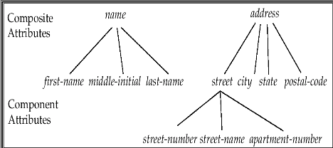{ width="70%" }
    <figcaption>Attribute Types</figcaption>
</figure>

例如在address这个复合属性中，street也可以是一个复合属性，它是address的一个分量属性；


## Relationship Sets

关系是两个或多个不同类实体之间的关联

一个联系集(relationship set)包含多个同类的联系实例，表示两个或多个实体集之间的关联；

可以这样表示

\[
\{(e_1, e_2, \ldots, e_n) \mid e_1 \in E_1, e_2 \in E_2, \ldots, e_n \in E_n\}
\]

其中，\((e_1, e_2, \ldots, e_n)\) 是一个关系，\(E_i\) 是一个实体集。

- 例如：\((\text{Jones}, \text{L-17}) \in \text{borrower}\)，其中 \(\text{Jones} \in \text{customer}\) 且 \(\text{L-17} \in \text{loan}\)

\[
\begin{align*}
(3032111020, 1, 95) \\
(3032111021, 1, 90) \\
(3032111022, 2, 75) \\
\ldots
\end{align*}
\]

属于 \(\text{student, course}\)

### Degree and Cardinality

一个关系集的度(degree)是参与该关系的实体集的个数；

例如：

- 一个二元关系集，表示两个实体集之间的关联；特别的，Relationship sets that involve two entity sets are binary (or degree two). 
- 一个三元关系集，表示三个实体集之间的关联；

Mapping Cardinality:

- 一个实体集可以与另一个实体集有多种关联方式，这种关联方式的数量称为映射基数(mapping cardinality)。

- One-to-one: 一对一
- One-to-many: 一对多
- Many-to-one: 多对一
- Many-to-many: 多对多

<figure markdown="span">
    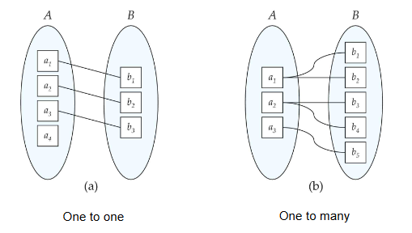{ width="70%" }
    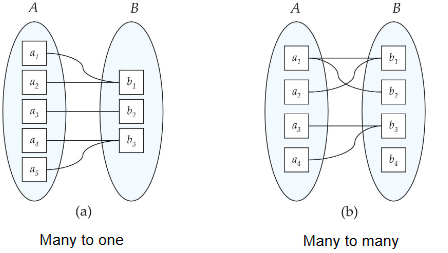{ width="70%" }
</figure>

### Keys for Relationship Sets

- 一个关系集的键(key)是唯一标识该关系集的属性或属性集。通常由参与这个关系的实体集的键组成。

## ER Diagrams

ER图是表示实体集和关系集之间关系的一种图形化表示方法。

<figure markdown="span">
    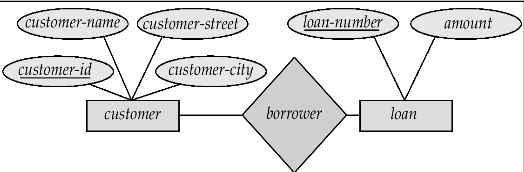{ width="80%" }
    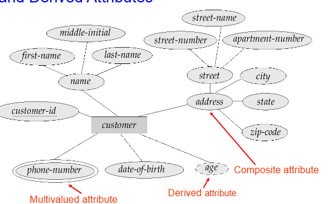{ width="80%" }
</figure>

- 矩形代表Entity Sets
- 菱形代表Relationship Sets
- 椭圆代表Attributes
    - 双椭圆代表multivalued attributes. 
    - 虚椭圆代表derived attributes. 
    - 没用叶子节点代表Simple attributes. 
    - 有叶子节点代表Composite attributes. 
    - 下划线代表key attributes. 


在实体关系模型中，关系的实体集不一定是不同的，这意味着一个实体集可以在同一个关系中扮演多个角色。这种情况被称为自环联系集（Recursive relationship set）。

<figure markdown="span">
    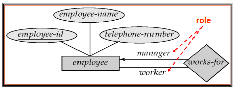{ width="80%" }
    <figcaption>Recursive Relationship Set</figcaption>
</figure>

**角色（Role）**：在一个关系中，实体所扮演的功能或角色。例如，在“works-for”关系集中，标签“manager”（经理）和“worker”（工人）就是角色；它们指定了员工实体如何通过“works-for”关系集进行交互。

角色标签是可选的，主要用于澄清关系的语义。通过使用角色标签，可以更清晰地表达实体在关系中的具体作用，避免歧义。

使用(->)表示one，使用（——）表示many,例如在上面的例子中，员工和manager就是一种一对多的关系;

使用这种表示方法就可以表示四种关系

!!!Example 
    <figure markdown="span">
        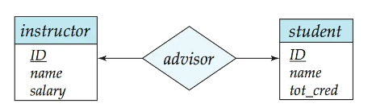{ width="80%" }
        <figcaption>One-to-One</figcaption>
    </figure>

    <figure markdown="span">
        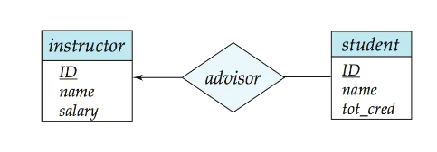{ width="80%" }
        <figcaption>One-to-Many</figcaption>
    </figure>

    <figure markdown="span">
        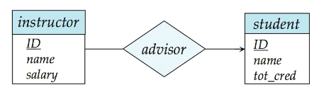{ width="80%" }
        <figcaption>Many-to-One</figcaption>
    </figure>

    <figure markdown="span">
        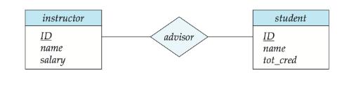{ width="80%" }
        <figcaption>Many-to-Many</figcaption>
    </figure>


还可以使用单线来表示部分参与，双线来表示全参与

<figure markdown="span">
    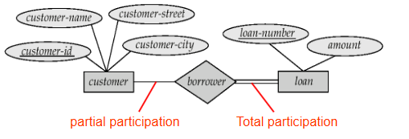{ width="80%" }
    <figcaption>Partial Participation</figcaption>
</figure>

也可以在线的上方来指定参与度

<figure markdown="span">
    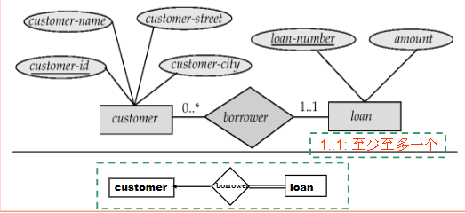{ width="80%" }
    <figcaption>Participation Degree</figcaption>
</figure>

在loan的上方有1..1代表每个loan至多至少参与一个borrow关系，而customer的上方有0..\*代表每个customer可以不参与任何borrow关系,也可以参与多个borrow关系；

即customer和loan的关系是one-to-many


### Binary Vs N-ary Relationships

二元关系(Binary Relationship)：涉及两个实体集的关联。

多元关系(N-ary Relationship)：涉及三个或更多实体集的关联。

有些看似非二元的关系可能更适合用二元关系来表示。例如，一个三元关系“父母”，将一个孩子与他的父亲和母亲联系起来，最好用两个二元关系来替代，即“父亲”和“母亲”。

\[ 
    \text{parents(he, she, child)} \Rightarrow \text{father(he, child), mother(she, child)} 
\]

使用两个二元关系可以表示部分信息，例如，只知道母亲的情况。但是，也有一些关系是自然的非二元关系，例如“works-on(employee, branch, job)”。


但是总的来说，任何非2元关系都可以通过中间的连接实体集来转换为2元关系。

!!!Example
    <figure markdown="span">
        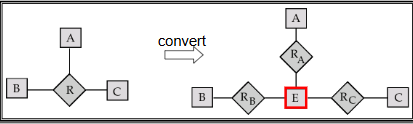{ width="80%" }
        <figcaption>Convert</figcaption>
    </figure>
    
    其过程可以总结为这样:
    
    - 将有n个度的关系的位置替换为一个中间的实体集E
    - 将E与n个实体集通过n个二元关系连接起来

    但是也不是唯一的，也可以将原本就存在的实体集作为中间的实体集，例如：

    <figure markdown="span">
        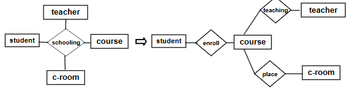{ width="80%" }
        <figcaption>Convert</figcaption>
    </figure>

## Weak Entity Sets

在实体关系模型中，一个没有主键的实体集被称为弱实体集(weak entity set)。弱实体集的存在依赖于一个标识实体集(identifying entity set)的存在。弱实体集必须通过一个从标识实体集到弱实体集的全参与、一对多的关系集(identifying relationship set)与标识实体集关联。标识关系用双菱形表示。

弱实体集的判别器discriminator（或部分键）是用于区分弱实体集中所有实体的一组属性。弱实体集的主键由强实体集的主键（弱实体集依赖于其存在的实体集）和弱实体集的判别器组成。

!!!key-point
    <figure markdown="span">
        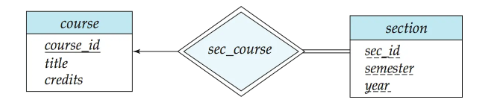{ width="80%" }
        <figcaption>Weak Entity Set</figcaption>
    </figure>

    在课程-章节的例子中，course就是强实体集，也是section的依赖实体集(标识实体集)，section就是弱实体集，course_section就是标识关系集。
    

    在section这个weak entity set中，其判别器就是section_id

    在弱实体集（weak entity set）中，强实体集的主键通常不会显式地存储，因为它已经隐含在标识关系（identifying relationship）中。也就是说，弱实体集依赖于强实体集的存在，而这种依赖关系通过标识关系来体现。

    具体到例子中，如果我们在 `section`（弱实体集）中显式地存储 `course_id`（强实体集 `course` 的主键），那么 `section` 就可以被视为一个强实体集，因为它不再依赖于 `course` 的存在来唯一标识自己。然而，这样做会导致 `section` 和 `course` 之间的关系被 `course_id` 这个属性所隐含的关系重复定义。

    一个另外的常见的例子是贷款和还贷，loan是强实体集，也是payment的依赖实体集，payment就是弱实体集，loan_payment就是标识关系集。

    <figure markdown="span">
        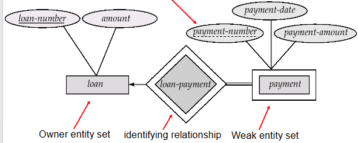{ width="80%" }
        <figcaption>Loan and Payment</figcaption>
    </figure>

    payment是多值属性，因为一个贷款可以有多个还款记录


## Extended E-R Features

### Stratum of entity sets

- Specialization: 一个实体集可以被分解为多个子实体集，每个子实体集具有不同的属性。
>自顶向下的设计过程中我们在一个实体集中指定一些子分组，这些子分组与该实体集中的其他实体有所不同。
>这些子分组会成为较低层次的实体集，它们拥有一些不适用于较高层次实体集的属性，或者参与一些较高层次实体集不涉及的关系。
>属性继承 —— 较低层次的实体集继承与之相关联的较高层次实体集的所有属性和关系参与情况。

<figure markdown="span">
    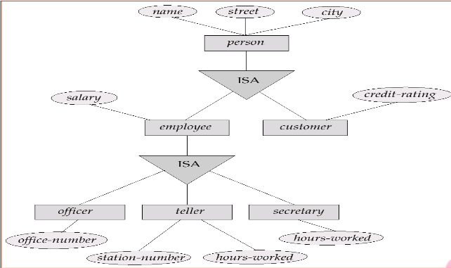{ width="80%" }
    <figcaption>Specialization</figcaption>
</figure>

<figure markdown="span">
    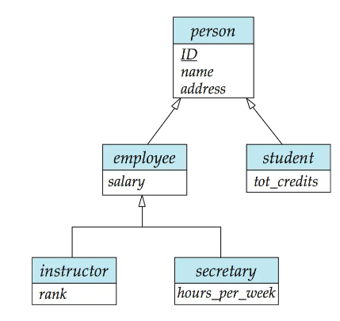{ width="80%" }
    <figcaption>另外的表示</figcaption>
</figure>

在这里Person可以被细分为employee和customer，而employee又可以继续细分；

- Generalization: 一个实体集可以被分解为多个子实体集，每个子实体集具有不同的属性。
>一种自底向上的设计过程 —— 将多个具有相同特征的实体集合并为一个更高层次的实体集。
>特殊化和泛化彼此是简单的逆向过程；它们在实体 - 关系图（E-R 图）中的表示方式相同


分类的方式既可以是条件定义的(Condition-defined)

例如所有大于65岁的为一组，所有小于18岁的为一组，所有介于18到65岁之间的为一组；

也可以是用户定义的(User-defined)


#### Disjoint & Overlapping

Disjoint指两个实体集的交集为空，即两个实体集没有共同的实体。在第二种表示方法种的employee和student是overlapping的；它们分别由两个箭头指向person，但是instructor和secretary就是disjoint的；它们由一个共同的箭头指向employee.

#### Total & Partial 

完全泛化指的是所有的Entity都必须属于泛化出来的其中一个，Partial泛化指的是有些Entity不属于泛化出来的任何一个。

<figure markdown="span">
    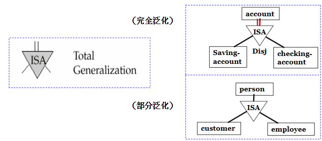{ width="80%" }
    <figcaption>Total & Partial</figcaption>
</figure>

#### Aggregation

Express relationships between relationships;

<figure markdown="span">
    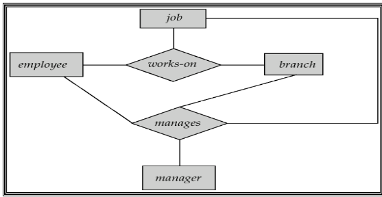{ width="80%" }
    <figcaption>Aggregation</figcaption>
</figure>

Relationship sets works-on and manages represent overlapping information. 

Every manages relationship corresponds to a works-on relationship. 

However, some works-on relationships may not correspond to any manages relationships. 

So we can’t discard the works-on relationship. 

Eliminate this redundancy via aggregation.Treat relationship as an abstract entity. 

Allows relationships between relationships. 

Abstraction of relationship into new entity. 

Without introducing redundancy, the following diagram represents: 

<figure markdown="span">
    { width="80%" }
    <figcaption>Aggregation</figcaption>
</figure>

An employee works on a particular job at a particular branch. 
An employee, branch, job combination may have an associated manager. 

!!!Summary
    <figure markdown="span">
        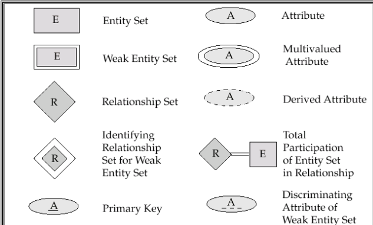{ width="80%" }
        <figcaption>Summary</figcaption>
    </figure>

    <figure markdown="span">
        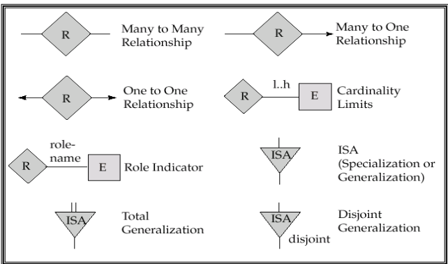{ width="80%" }
        <figcaption>Summary</figcaption>
    </figure>

    <figure markdown="span">
        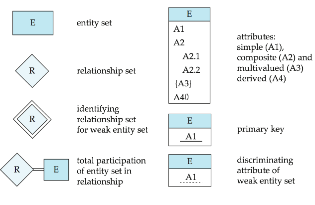{ width="80%" }
        <figcaption>Summary</figcaption>
    </figure>

    <figure markdown="span">
        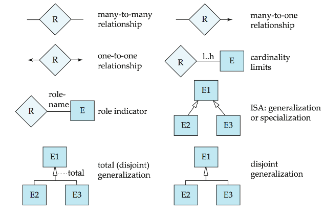{ width="80%" }
        <figcaption>Summary</figcaption>
    </figure>


## E-R design Decisions

- Use an attribute or entity set to represent an object?

若一个对象只对其名字及单值感兴趣，则可作为属性，如性别；若一个对象除名字外，本身还有其他属性需描述，则该对象应定义为实体集。如电话, 部门. 

一个对象不能同时作为实体和属性. 

一个实体集不能与另一实体集的属性相关联，只能实体与实体相联系. 

- Use it as an entity set or a relationship set?

两个对象之间发生的动作使用relationship set表示

- Use it as an attribute of an entity or a relationship?, 

e.g., student(sid, name, sex, age, …, supervisor-id, supervisor-name, supervisor-position, …, class, monitor) 

要从对象的语义独立性和减少数据冗余方面考虑 

- The use of a ternary or n-ary relationship versus a pair of binary relationships. 

- The use of a strong or weak entity set. 

- The use of specialization/generalization – contributes to modularity in the design (有助于模块化). 

- The use of aggregation – can group a part of E-R diagram into a single entity set,  and  treat it as a single unit without concern for the details of its internal structure. 


## Reduction of an E-R Schema to Tables
> Converting an E-R diagram to a table format is the basis for deriving a relational database design from an E-R diagram. 


A database which conforms to an E-R diagram can be represented by a collection of tables.

For each entity set and relationship set, there is a unique table which is assigned the name of the corresponding entity set or relationship set. 

Composite attributes are flattened out by creating a separate attribute for each component attribute. 复合属性被展平为每个组件属性创建一个单独的属性。

A multivalued attribute M of an entity E is represented by a separate table EM: 
多值属性M的实体E表示为单独的表EM: 


A relationship set is represented as a table with columns for the primary keys of the two participating entity sets, (which are foreign keys here) and any descriptive attributes of the relationship set itself. 

即关系集被表示为具有两个参与实体集的主键（这里作为外键）和关系集本身的描述性属性的表。

对于1:n联系，可将“联系”所对应的表，合并到对应“多”端实体的表中
例如

```
account(account-number, balance); 
branch(branch-name, branch-city, assets); 
account-branch(account-number, branch-name) 
```
account是多的一方，可以将account-branch表合并到account表中，得到

```
account(account-number, balance, branch-name); 
```

If participation is partial on the many side, replacing a table by an extra attribute in the relation corresponding to the “many” side could result in null values. 

E.g., cust-banker(customer-id, employee-id, type); 但有的customer没有banker, 则合并之后得：
Customer(customer-id, cust-name, cust-street, cust-city, banker-id, type) ，导致Customer中有些元组的banker-id、 type为null。 


For one-to-one relationship sets, either side can be chosen to act as the “many” side 

The table corresponding to a relationship set linking a weak entity set to its identifying strong entity set is redundant，即对应identifying relationship set的表是多余的，因为存放payment的表可以包含loan的表的主键。这样就直接不需要loan_payment表了。


在泛化中，有两种方式来表示子分组的属性；

- 只包含子分组特有的属性
<figure markdown="span">
    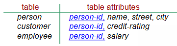{ width="80%" }
    <figcaption>Specialization</figcaption>
</figure>

但是这样访问子分组需要访问两张表，效率较低


- 包含子分组和父分组共同的属性，共同的属性存在父分组中
<figure markdown="span">
    { width="80%" }
    <figcaption>Specialization</figcaption>
</figure>

这样会导致一些冗余的存贮；


