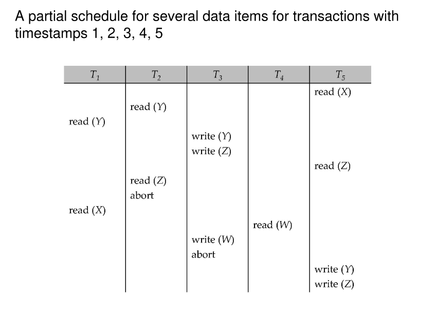
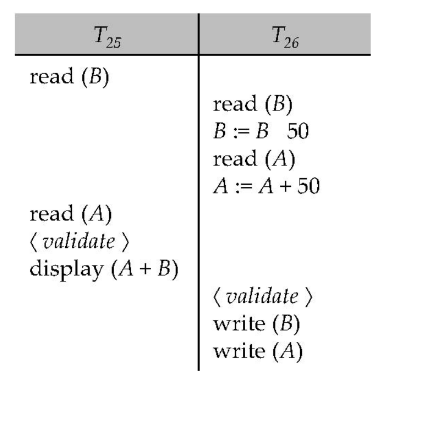
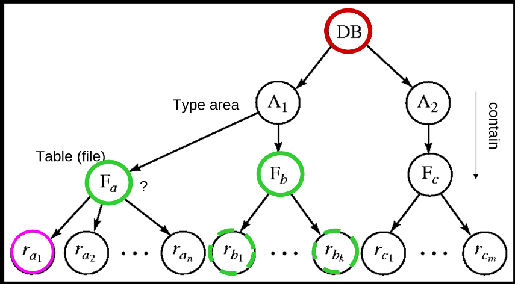
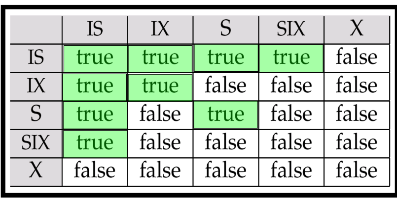

# Concurrency Control

## Lock-Based Protocols

可串行化调度是并发控制的基础；

数据项可以以两种模式锁定：

- Exclusive (X) mode: 数据项可以被读取和写入。X锁通过lock-X指令请求。
- Shared (S) mode: 数据项只能被读取。S锁通过lock-S指令请求。

写一个数据之前，需要先得到一个X锁，读一个数据之前，需要先得到一个S锁。操作结束之后，将这个锁释放。

锁请求由并发控制管理器处理。事务只有在请求被授予后才能继续执行。

S锁与S锁是兼容的，X锁其它锁不兼容.

如果请求的锁与其他事务已经持有的锁兼容，
则事务可以获得对数据项的锁。
任意数量的事务可以对一个数据项持有共享锁（S锁），
但如果任何事务对该数据项持有排他锁（X锁），则其他事务不能持有任何类型的锁。

如果锁不能被授予，请求锁的事务将被阻塞等待，
直到所有不兼容的锁被其他事务释放。
然后，锁才会被授予给等待的事务。


!!!Example
    Example of a transaction performing locking

    ```sql
    lock-S(A)
    read(A)
    unlock(A)
    lock-S(B)
    read(B)
    unlock(B)
    display(A+B)
    ```
    上面的锁定方式不足以保证可串行化 — 如果在读取A和B之间，A和B被更新了，那么显示的总和将是错误的。

    锁定协议(Locking protocols)是所有事务在请求和释放锁时遵循的一组规则。锁定协议限制了可能的调度集合。

    <figure markdown="span">
    { width="500" }
    </figure>

    上图展示了一个死锁的例子：
    
    - T3 持有 B 的 X 锁，并请求 A 的 X 锁
    - T4 持有 A 的 S 锁，并请求 B 的 S 锁
    
    T3 和 T4 都无法继续执行 — T4 执行 lock-S(B) 会导致它等待 T3 释放 B 上的锁，而 T3 执行 lock-X(A) 会导致它等待 T4 释放 A 上的锁。这种情况被称为死锁（deadlock）。
    
    为了处理死锁，必须回滚 T3 或 T4 中的一个事务，并释放其持有的锁。

    !!!info "deadlock & starvation"
        死锁（deadlock）是指在并发系统中，两个或多个事务（或进程）相互等待对方释放资源，从而导致所有事务都无法继续执行的情况。具体来说，在一个死锁的情境中，每个事务都持有某些资源的锁，并请求其他事务持有的资源锁，而这些资源锁又无法被释放，因为持有它们的事务也在等待其他资源的释放。
    
        死锁是大多数锁定协议中存在的问题，可以说是一种"evil"。除了死锁外，饥饿（starvation）也是可能发生的问题，特别是当并发控制管理器设计不良时。

        饥饿的例子包括：

        - 一个事务可能正在等待对某个数据项的X锁，而同时有一系列其他事务请求并获得了对同一数据项的S锁，导致第一个事务无限期等待。
        - 同一个事务由于反复遇到死锁而被多次回滚，无法完成执行。

        一个设计良好的并发控制管理器应该能够防止饥饿现象的发生，例如通过实现公平的锁分配策略或优先级机制来确保所有事务最终都能获得所需的锁并完成执行。
### The 2PL protocol

2PL协议(Two-Phase Locking)是一种用于并发控制的协议，它通过在事务执行过程中对锁的请求和释放进行限制，从而确保事务的执行顺序和结果的正确性。

2PL协议的执行过程可以分为两个阶段：

1. **增长阶段（Growing Phase）**：
    - 事务可以获取锁
    - 事务不能释放锁

-  **缩减阶段（Shrinking Phase）**：
    - 事务可以释放锁
    - 事务不能获取锁

该协议确保了冲突可串行化的调度。可以证明，事务可以按照它们的锁点（即事务获取其最后一个锁的时间点）的顺序进行串行化。

虽然2PL协议确保了冲突可串行化，但它并不能解决所有的并发控制问题：

1. **死锁问题**：2PL协议本身不能防止死锁的发生。当多个事务相互等待对方持有的锁时，仍然可能出现死锁情况。

2. **级联回滚问题**：在标准的2PL协议下，如果一个事务回滚，可能导致其他已读取该事务修改数据的事务也必须回滚，这称为级联回滚（cascading rollback）。

为了解决这些问题，有两种改进的2PL协议：

#### Strict 2PL

严格两阶段锁协议要求事务持有所有排他锁（X锁）直到事务提交或中止。具体规则如下：

- 事务必须按照2PL协议获取锁
- 事务持有的所有排他锁必须在事务结束（提交或中止）后才能释放

Strict 2PL的主要优点是避免了级联回滚问题，因为其他事务无法读取未提交的修改数据。

#### Rigorous 2PL

Rigorous 2PL比Strict 2PL更加严格，它要求事务持有所有锁（包括共享锁和排他锁）直到事务提交或中止：

- 事务必须按照2PL协议获取锁
- 事务持有的所有锁（S锁和X锁）必须在事务结束（提交或中止）后才能释放

Rigorous 2PL的主要优点是事务可以按照它们提交的顺序进行串行化，这提供了一种简单明确的串行化顺序。

在实际数据库系统中，通常采用Strict 2PL或Rigorous 2PL协议，因为它们不仅保证了可串行化，还避免了级联回滚问题，简化了恢复机制。

尽管2PL可能不是实现冲突可串行化的唯一方法，但它是一种通用且可靠的方法，特别是在没有关于事务访问模式的先验知识的情况下。这也解释了为什么2PL协议在实际数据库系统中被广泛采用。


!!!Warning
    虽然2PL协议可以保证生成冲突可串行化的调度，但需要注意的是：

    1. **并非所有冲突可串行化的调度都能通过2PL获得**：
        - 存在一些冲突可串行化的调度，它们无法通过遵循2PL协议的事务执行来产生。
        - 这意味着2PL协议在某种程度上限制了可能的调度集合。

    -  **2PL对于冲突可串行化的必要性**：
        - 在没有额外信息（例如对数据访问的顺序）的情况下，2PL对于确保冲突可串行化是必要的。
        - 这可以通过以下方式理解：如果事务Ti不遵循两阶段锁定协议，我们总能找到另一个遵循两阶段锁定的事务Tj，使得Ti和Tj的某个调度不是冲突可串行化的。(逆否)

### Lock Conversion

锁转换（Lock Conversion）是两阶段锁协议的一个扩展，允许事务在执行过程中动态地改变已持有锁的类型。这种机制增加了并发控制的灵活性，同时仍然保持可串行化的保证。

在带有锁转换的两阶段锁协议中：

- **第一阶段（获取阶段）**：
    - 可以获取项目上的共享锁（S锁）
    - 可以获取项目上的排他锁（X锁）
    - 可以将共享锁（S锁）升级为排他锁（X锁）（Upgrade操作）

- **第二阶段（释放阶段）**：
    - 可以释放共享锁（S锁）（Unlock操作）
    - 可以释放排他锁（X锁）（Unlock操作）
    - 可以将排他锁（X锁）降级为共享锁（S锁）（Downgrade操作）

这个协议确保了可串行化。但它仍然依赖于程序员正确插入各种锁定指令。

锁转换的主要优势在于：

1. **提高并发度**：允许事务根据实际需要调整锁的类型，避免不必要的严格锁定。
- **减少死锁可能性**：通过锁降级，可以在不完全释放锁的情况下减少对资源的独占，降低死锁风险。
- **增强灵活性**：事务可以根据操作的不同阶段调整锁的强度，更好地适应实际需求。


### Automatic acquisition of locks

在实际的数据库系统中，事务通常不需要显式地发出锁请求，而是由系统自动处理锁的获取和释放。这种自动锁定机制简化了编程，并确保了事务的正确执行。

当事务Ti发出标准的读/写指令（没有显式的锁定调用）时，系统会自动处理锁定：

**读操作的处理**：

当事务Ti执行`read(D)`操作时：

```sql
 if Ti has a lock on D then
read(D) 
else begin 
if necessary wait until no other  
transaction has a lock-X on D then
grant Ti a  lock-S on D;
read(D)
end
```

### Implementation of Locking
!!!Definition 
    锁管理器通常被实现为一个独立的进程，事务向其发送锁定和解锁请求。锁管理器的工作流程如下：

    - 当收到锁请求时，锁管理器会回复一个锁授予消息（或在发生死锁的情况下，发送一个要求事务回滚的消息）
    - 请求锁的事务会等待，直到其请求得到回应
    - 锁管理器维护一个称为锁表（lock table）的数据结构，用于记录已授予的锁和待处理的请求

    锁表通常实现为一个内存中的哈希表，以被锁定的数据项的名称作为索引。
    锁表中的每个条目通常包含：

    - 数据项标识符
    - 锁类型（共享/排他）
    - 持有锁的事务列表
    - 等待该数据项锁的事务队列

    <figure markdown="span">
    { width="500" }
    </figure>

    上图展示了一个锁表的示例。

    新的请求会被添加到数据项请求队列的末尾，并且只有当它与所有早期锁兼容时才会被授予。

    解锁请求会导致相应的请求被删除，系统会检查后续请求是否可以被授予。如果事务中止，该事务的所有等待或已授予的请求都会被删除。

    为了高效实现这一机制，锁管理器通常会为每个事务维护一个持有锁的列表。这样，当事务完成或中止时，可以快速找到并释放该事务持有的所有锁。

    锁管理器的实现需要考虑以下几个关键点：

    1. **高效的锁状态查询** ：快速确定某个数据项的锁状态
    2. **兼容性检查** ：判断新的锁请求是否与现有锁兼容
    3. **死锁检测** ：识别并解决可能的死锁情况
    4. **公平性** ：确保长时间等待的事务最终能获得所需的锁

    这种集中式的锁管理机制虽然增加了一定的系统开销，但大大简化了并发控制的实现，并提高了系统的可靠性。

### Graph-Based Protocols

!!!Definition
    **基于图的协议** 是二阶段锁定的一种替代方案。这种协议在数据项集合 
    
    \[
    D = \{d_1, d_2, \ldots, d_h\}
    \]
   
    上施加一个偏序关系。
    
    如果 $d_1 \rightarrow d_2$，那么任何同时访问 $d_1$ 和 $d_2$ 的事务必须先访问 $d_1$ 再访问 $d_2$。这意味着数据集 $D$ 可以被视为一个有向无环图，称为数据库图(database graph)。

    树协议(tree-protocol)是一种简单的图协议。在树协议中，数据项被组织成一棵树的形式，事务必须按照从根到叶的顺序访问数据项。


 <figure markdown="span">
 { width="500" }
 </figure>

树协议的规则如下：

1. **仅允许排他锁（X锁）**：树协议中只使用排他锁，不使用共享锁。

- **首次加锁的灵活性**：事务Ti的第一个锁可以加在任何数据项上。

- **层次化加锁规则**：随后，Ti只能对当前已经被Ti锁定的数据项的子节点加锁。具体来说，数据项Q只有在其父节点已被Ti锁定的情况下才能被Ti锁定。

- **灵活的解锁时间**：数据项可以在任何时候解锁，不必遵循严格的顺序。

- **不可重复加锁**：一旦某个数据项被Ti锁定并解锁后，Ti不能再次锁定该数据项。

<figure markdown="span">
{ width="500" }
</figure>

!!!Summary
    树协议的优缺点：

    **优点**：

    - *无死锁保证*：树协议确保了冲突可串行化以及无死锁发生
    - *提前解锁*：与二阶段锁定协议相比，树协议允许更早地解锁数据项
    - *等待时间更短*：在某些情况下可以提高并发度
    - *无需回滚*：由于协议是无死锁的，不需要执行回滚操作

    **缺点**：

    - *恢复性问题*：协议不保证可恢复性或避免级联回滚
    - *需要额外机制*：为确保可恢复性，需要引入提交依赖关系
    - *额外锁定*：事务可能必须锁定它们实际上不访问的数据项
    - *锁开销增加*：导致额外的等待时间
    - *并发度潜在降低*：在某些情况下可能降低系统的整体并发性能

    值得注意的是，二阶段锁定协议和树协议各有所长，某些在二阶段锁定下不可能的调度在树协议下是可能的，反之亦然。选择哪种协议取决于具体的应用场景和数据访问模式。
    
 
## Timestamp-Based Protocols

!!!definition
    时间戳协议(Timestamp-Based Protocols)是一种基于时间戳的并发控制协议，用于管理数据库中的事务并发。每个事务在进入系统时都会被分配一个时间戳。如果一个旧事务$T_i$的时间戳为$TS(T_i)$，那么一个新事务$T_j$将被分配时间戳$TS(T_j)$，使得$TS(T_i) < TS(T_j)$。该协议通过时间戳来管理并发执行，以确保事务的可串行化顺序。

    为了保证这种行为，协议为每个数据Q维护两个时间戳值：

    - W-timestamp(Q)：是任何成功执行write(Q)的事务中最大的时间戳。也就是最晚的写时间戳。
    - R-timestamp(Q)：是任何成功执行read(Q)的事务中最大的时间戳。也就是最晚的读时间戳。


Suppose a transaction Ti issues a read(Q):

- If $TS(Ti) \leqslant W-timestamp(Q)$, then Ti needs to read a value of Q that was already overwritten. Hence, the read operation is rejected, and Ti is rolled back.有更新的事务已经写入了Q，读取操作被拒绝，事务回滚。

- If $TS(Ti) \geqslant W-timestamp(Q)$, then the read operation is executed, and $R-timestamp(Q)$ is set to the maximum of $R-timestamp(Q)$ and $TS(Ti)$.OK，可以读取。

Suppose that transaction Ti issues a write(Q):

- If $TS(Ti) < R-timestamp(Q)$, then the value of Q that Ti is producing was needed previously, and the system assumed that that value would never be produced. Hence, the write operation is rejected, and Ti is rolled back.有更新的事务已经读取了Q，写入的话会影响已经完成的事务，所以拒绝写入，回滚。

- If $TS(Ti) < W-timestamp(Q)$, then Ti is attempting to write an obsolete value of Q. Hence, this write operation is rejected, and Ti is rolled back.有更新的事务已经写入了Q，Ti试图写入一个过时的值，所以拒绝写入，回滚。

- Otherwise, the write operation is executed, and $W-timestamp(Q)$ is set to $TS(Ti)$.OK，可以写入。


<figure markdown="span">
{ width="500" }
<figcaption>
    Timestamp Protocol Example
</figcaption>
</figure>


- **优先图弧**：在时间戳排序协议中，优先图的构建方式是所有的弧都是从时间戳较早的事务指向时间戳较晚的事务。这种排序确保了没有循环，因为循环意味着一个事务依赖于未来的事务，这与时间戳排序相矛盾。

- **无死锁**：该协议本质上避免了死锁，因为事务之间不会相互等待。如果一个事务由于时间戳冲突而无法继续，它将被回滚并以新的时间戳重新启动，确保没有事务处于等待状态。

- **级联回滚**：虽然时间戳协议防止了死锁，但它并不固有地防止级联回滚。当一个事务被回滚时，可能会导致其他依赖的事务也被回滚。如果一个事务读取了另一个事务写入的值，而后者事务随后被回滚，就会发生级联回滚。为了解决这个问题，事务被结构化为其所有写操作都在处理结束时执行。这确保了事务的所有写操作形成一个原子操作，这意味着在一个事务正在写入时，其他事务不能执行。如果一个事务中止，它将以新的时间戳重新启动。此方法有助于减少级联回滚效应，并确保更稳定和可恢复的调度。


- **可恢复性**：该协议可能还会产生不可恢复的调度。当一个事务读取了另一个事务写入的值时，如果写入事务在读取事务之前提交，调度是可恢复的。在时间戳协议中，一个事务可能会读取另一个事务的值，而后者事务随后被回滚，导致调度不可恢复。

- **权衡**：时间戳排序协议在简化和性能之间提供了一种权衡。它通过避免死锁简化了并发控制，但可能由于潜在的级联回滚和不可恢复的调度而产生性能成本。在实践中，可能需要额外的机制来确保可恢复性和级联自由，例如实现提交依赖关系跟踪系统或使用更复杂的并发控制协议。


### Thomas' Write Rule（托马斯写规则）

!!!definition
    托马斯写规则是时间戳排序协议的一种修改版本，允许在某些情况下忽略过时的写操作，从而增加潜在的并发性。此规则在视图可串行化是可接受的场景中特别有用，即使未实现冲突可串行化。

    当事务 Ti 尝试写入数据项 Q 时：

    - 如果 $TS(Ti) < W-timestamp(Q)$，则 Ti 试图写入一个过时的 Q 值。与标准时间戳排序协议要求的回滚不同，此写操作被简单地忽略。这允许系统在不必要的回滚下继续处理，从而增强并发性。

    - 如果 $TS(Ti) \geqslant W-timestamp(Q)$，则写操作按常规执行，并将 $W-timestamp(Q)$ 更新为 $TS(Ti)$。

    托马斯写规则允许视图可串行化但不一定是冲突可串行化的调度，提供了严格串行化和增加并发性之间的权衡。

- **增加的并发性**：通过忽略某些过时的写操作，托马斯写规则减少了回滚次数，允许更多事务并发进行。

- **视图可串行化**：此规则支持视图可串行化的调度，这比冲突可串行化的调度限制更少，从而实现更灵活的事务排序。

- **权衡**：虽然托马斯写规则增加了并发性，但可能导致调度不是冲突可串行化的。在视图可串行化足以保证正确性的系统中，这种权衡通常是可以接受的。

- **使用场景**：托马斯写规则在高并发环境中特别有利，在这些环境中，管理冲突可串行化的开销过高，并且系统可以容忍视图可串行化的放松约束。

## Validation-Based Protocol

基于验证的协议，也称为乐观并发控制（Optimistic Concurrency Control），事务的执行分为三个阶段：

1. **读取和执行阶段**：在此阶段，事务 Ti 仅写入临时的本地变量。所有操作都在这些本地副本上执行，而不影响实际数据库。

- **验证阶段**：事务 Ti 执行“验证测试”，以确定本地变量是否可以在不违反可串行化的情况下写入。这是确保事务之间不冲突的关键步骤。

- **写入阶段**：如果 Ti 通过验证，则更新将应用于数据库；否则，Ti 将被回滚。

并发执行的事务的三个阶段可以交错进行，但每个事务必须按顺序经历这三个阶段。为了简化起见，假设验证和写入阶段是一起发生的，具有原子性和串行性，即一次只有一个事务执行验证/写入。

这种方法被称为乐观并发控制，因为事务在执行时完全希望在验证期间一切顺利。

- **优点**：
    - **增加并发性**：由于事务在执行期间不锁定数据项，多个事务可以同时进行，从而提高系统吞吐量。
    - **减少死锁**：由于没有锁的存在，消除了死锁的可能性，简化了事务管理。

- **缺点**：
    - **高中止率的可能性**：在高争用环境中，事务验证失败的可能性增加，导致更多的中止和重试。
    - **复杂的验证逻辑**：验证阶段可能变得复杂，特别是在有许多并发事务的系统中，因为它必须确保可串行化。


对于所有事务 Ti，如果 TS(Ti) < TS(Tj)，则以下条件之一成立：

- finish(Ti) < start(Tj)

- start(Tj) < finish(Ti) < validation(Tj) 且 Ti 写入的数据项集合与 Tj 读取的数据项集合不相交。

- 如果第一个条件满足，则没有重叠的执行。
- 如果第二个条件满足，Tj 的写操作不会影响 Ti 的读操作，因为它们发生在 Ti 完成其读操作之后。
- Ti 的写操作不会影响 Tj 的读操作，因为 Tj 没有读取 Ti 写入的任何数据项。

- **验证失败**：如果上述条件均不满足，则验证失败，Tj 将被中止。

<figure markdown="span">
{ width="500" }
<figcaption>
    Validation Protocol Example
</figcaption>
</figure>

## Multiple Granularity


在数据库系统中，允许数据项以不同的大小进行锁定，这被称为多粒度锁定（Multiple Granularity Locking）。这种方法通过定义数据粒度的层次结构来实现，其中较小的粒度嵌套在较大的粒度内，并可以图形化地表示为一棵树。

### Granularity Hierarchy

- **Root Node**：表示整个数据库。
- **Intermediate Node**：表示数据库中的表或文件。
- **Leaf Node**：表示表中的记录或文件中的块。

当事务显式地锁定树中的一个节点时，它隐式地以相同的模式锁定该节点的所有子节点。

### Locking Granularity

- **Fine-Grained Locking**（Lower in tree）：在树的较低层次进行锁定，提供高并发性，但锁定开销较高。
- **Coarse-Grained Locking**（Higher in tree）：在树的较高层次进行锁定，锁定开销较低，但并发性较低。

!!!Example
    假设有一个数据库包含多个表，每个表包含多个记录。可以将数据库视为树的根节点，表作为中间节点，记录作为叶子节点。

    - **细粒度锁定**：如果一个事务需要访问特定的记录，它可以直接锁定该记录。这允许其他事务同时访问同一表中的其他记录，从而提高并发性。
    - **粗粒度锁定**：如果一个事务需要访问整个表，它可以锁定表节点。这将阻止其他事务访问该表中的任何记录，降低并发性，但减少了锁定的开销。

    通过选择适当的锁定粒度，系统可以在并发性和锁定开销之间进行权衡，以满足不同的性能需求。

<figure markdown="span">
{ width="500" }
<figcaption>
    Tree example
</figcaption>
</figure>


### Intention Lock Modes

在多粒度锁定中，存在三种意向锁模式：

- **Intention-shared (IS，共享型意向锁)**: 表明在树的较低层次存在共享锁。这意味着该节点的后代可能被显式地以共享模式锁定。

- **Intention-exclusive (IX，排它型意向锁)**: 表明在树的较低层次存在排他锁。这意味着该节点的后代可能被显式地以排他模式锁定。

- **Shared and intention-exclusive (SIX，共享排它型意向锁)**: 表明以共享模式显式锁定该节点的子树，并且在较低层次以排他模式进行显式锁定。SIX 锁是共享锁和排他意向锁的组合，即 SIX = S + IX。

这些意向锁模式允许事务在不同粒度级别上安全地锁定数据项，从而提高并发性和性能。


!!!Example
    考虑一个场景，其中多个事务正在与结构为树形的数据库交互。以下是意向锁在此上下文中的工作原理：

    - T1 用 X 锁锁定 `ra1`：
        - `ra1` 是一个叶子节点。在用 X 锁锁定 `ra1` 之前，意向排他锁（IX）会被放置在其所有祖先节点上直到根节点。这意味着：
          - 在 `Fa` 上加 IX 锁（如果 `ra1` 在 `Fa` 下）
          - 在 `Fb` 上加 IX 锁（如果 `ra1` 在 `Fb` 下）
          - 在根节点（整个数据库）上加 IX 锁

    - T2 用 S 锁锁定 `Fb`：
        - `Fb` 是一个中间节点。在用 S 锁锁定 `Fb` 之前，意向共享锁（IS）会被放置在其所有祖先节点上直到根节点。这意味着：
          - 在根节点（整个数据库）上加 IS 锁

    - T3 希望用 S 锁锁定 `Fa`：
        - `Fa` 是一个中间节点。在用 S 锁锁定 `Fa` 之前，意向共享锁（IS）会被放置在其所有祖先节点上直到根节点。这意味着：
          - 在根节点（整个数据库）上加 IS 锁
        - 由于 `T1` 在 `Fa` 上有一个 IX 锁，`T3` 可以继续在 `Fa` 上加 S 锁，因为 IS 和 IX 是兼容的。

    - T4 希望用 S 锁锁定整个数据库：
        - 根节点代表整个数据库。在用 S 锁锁定根节点之前，意向共享锁（IS）会被放置在其所有祖先节点上，但由于它是根节点，没有进一步的祖先节点。
        - 如果没有冲突的锁，`T4` 可以继续在整个数据库上加 S 锁。然而，由于 `T1` 在根节点上有一个 IX 锁，`T4` 必须等待，因为 S 和 IX 是不兼容的。

    

<figure markdown="span">
{ width="500" }
<figcaption>
    锁之间的兼容性
</figcaption>
</figure>


### Lock schemas

事务 Ti 可以使用以下规则锁定节点 Q：

1. **锁兼容性矩阵**：
    - Ti 必须遵循锁兼容性矩阵，以确保其获取的锁不会与其他事务持有的现有锁冲突。

- **根节点锁定**：
    - 必须首先锁定树的根节点。根节点可以以任何模式（S, IS, X, IX, SIX）锁定。

- **S 或 IS 模式锁定**：
    - 仅当 Q 的父节点当前被 Ti 以 IX 或 IS 模式锁定时，Ti 才能以 S 或 IS 模式锁定节点 Q。

- **X, SIX 或 IX 模式锁定**：
     - 仅当 Q 的父节点当前被 Ti 以 IX 或 SIX 模式锁定时，Ti 才能以 X, SIX 或 IX 模式锁定节点 Q。

- **两阶段锁定协议 (2PL)**：
   - Ti 只能在尚未解锁任何节点的情况下锁定节点。这确保 Ti 遵循两阶段锁定协议。

- **解锁节点**：
   - Ti 只能在 Q 的所有子节点都未被 Ti 锁定的情况下解锁节点 Q。这确保锁按照从叶到根的顺序释放。

优点：
- **增强并发性**：通过允许事务在不同粒度上锁定节点，系统可以支持更高水平的并发性。
- **降低加锁开销**：使用意向锁和两阶段锁定协议有助于减少与锁定相关的开销，从而提高系统性能。


## Multiversion Schemes

多版本并发控制（MVCC）是一种通过保留数据项的多个版本来提高数据库系统并发性的方法。这种方法允许事务访问不同版本的数据项而不相互干扰，从而提高系统性能并减少等待时间。

### Multiversion Timestamp Ordering

- **版本创建**：每次成功的写操作都会创建数据项的新版本。这个新版本用时间戳标记，通常是执行写操作的事务的时间戳。
  
- **读操作**：当事务发出读(Q)操作时，系统根据事务的时间戳选择Q的最合适版本。选择的版本是时间戳最大且小于或等于读取事务时间戳的版本。这确保了读操作返回的数据视图与事务开始时的一致。

- **并发性**：读取操作永远不需要等待，因为总有一个合适的版本可用。这是多版本方案的一个显著优势，因为它允许读操作在存在并发写操作的情况下不受延迟地进行。

### Multiversion Two-Phase Locking

- **锁定机制**：多版本两阶段锁定（MV2PL）结合了多版本并发控制与两阶段锁定的原则。在这种方案中，读操作不需要锁，因为它们可以直接访问合适的版本。然而，写操作仍然遵循两阶段锁定协议以确保可串行化。

- **版本管理**：与多版本时间戳排序类似，每次写操作都会创建数据项的新版本。系统维护多个版本，每个版本都用创建它的事务的时间戳标记。

- **优点**：通过允许读操作在没有锁的情况下进行，MV2PL减少了争用并提高了并发性。这种方法在读操作较多的工作负载中尤其有利，因为大多数操作都是读取。

总之，多版本并发控制方案，如多版本时间戳排序和多版本两阶段锁定，通过维护数据项的多个版本来增强并发性。这些方案允许读操作在不等待的情况下访问最合适的版本，从而提高系统性能并减少事务等待时间。


!!!info
    在多版本并发控制系统中，事务可以分为两种类型：只读事务和更新事务。每种类型遵循不同的协议以确保数据一致性和系统性能。

    - **更新事务**：
        - **锁定协议**：更新事务在访问的数据项上获取读锁和写锁。它们遵循严格的两阶段锁定协议，这意味着它们在事务完成并提交之前持有所有获取的锁。
        - **版本创建**：更新事务的每次成功写操作都会创建数据项的新版本。这个新版本用时间戳标记。
        - **时间戳管理**：每个新版本的时间戳是从一个计数器 `ts-counter` 中获得的，该计数器在事务提交处理期间递增。

    - **只读事务**：
        - **时间戳分配**：在执行之前，只读事务通过读取 `ts-counter` 的当前值来分配时间戳。此时间戳用于在事务执行期间确定数据版本的可见性。
        - **读取协议**：只读事务遵循多版本时间戳排序协议。它们访问每个数据项的版本，该版本的时间戳最大且小于或等于事务的时间戳，从而确保数据库在事务开始时的一致视图。


## Deadlock handling

### Deadlock Prevention

Deadlock prevention protocols ensure that the system will never enter into a deadlock state. Some prevention strategies:

1) Require that each transaction locks all its data items before it begins execution (predeclaration) – conservative 2PL. (Either all or none are locked)
Disadvantages: bad concurrency, hard to predict 

2) Impose partial ordering of all data items and require that a transaction can lock data items only in the order (graph-based protocol). ---- therefore never form a cycle. 

- **Wait-die scheme — 非抢占式**：较旧的事务可以等待较新的事务释放数据项。较新的事务永远不会等待较旧的事务；相反，它们会被回滚。一个事务可能在获取所需数据项之前多次“死亡”。

- **Wound-wait scheme — 抢占式**：较旧的事务会“伤害”（强制回滚）较新的事务，而不是等待它。较新的事务可以等待较旧的事务。与wait-die方案相比，可能会有更少的回滚。


在wait-and-die和wound-and-wait方案中，被回滚的事务以其原始时间戳重新启动。因此，较旧的事务优先于较新的事务，从而避免了饥饿。

基于超时的方案：

- 事务仅在指定的时间内等待锁。之后，等待超时，事务被回滚。
- 因此，不可能出现死锁。
- 实现简单；但可能会出现饥饿问题。此外，确定超时间隔的良好值也很困难。

### Deadlock Detection

Deadlocks can be described as a wait-for graph, which consists of a pair $G = (V,E)$, 

$V$ is a set of vertices (all the transactions in the system)
$E$ is a set of edges; each element is an ordered pair $T_i \rightarrow T_j$.  

If $T_i \rightarrow T_j$ is in $E$, then there is a directed edge from $T_i$ to $T_j$, implying that $T_i$ is waiting for $T_j$ to release a data item.

When $T_i$ requests a data item currently being held by $T_j$, then the edge $T_i \rightarrow T_j$ is inserted in the wait-for graph. This edge is removed only when $T_j$ is no longer holding a data item needed by $T_i$.

!!!key-point
    The system is in a deadlock state if and only if the wait-for graph has a cycle.  Must invoke a deadlock-detection algorithm periodically to look for cycles.


### Deadlock Recovery


When a deadlock is detected, the system must choose a transaction to roll back in order to break the deadlock. The selection of the victim transaction should be based on minimizing the cost. The cost can be determined by factors such as the amount of work done by the transaction, the resources it holds, and the number of rollbacks it has already undergone to prevent starvation.

1. **Victim Selection**:
      - Choose the transaction with the minimum cost as the victim.
      - Consider the number of rollbacks a transaction has already experienced as part of the cost to avoid starvation.

- **Rollback Strategy**:
      - **Total Rollback**: Abort the transaction completely and restart it. This is straightforward but may not always be the most efficient.
      - **Partial Rollback**: Roll back the transaction only as far as necessary to resolve the deadlock. This can be more efficient as it allows the transaction to retain some of its progress.

- **Starvation Prevention**:
      - Track the number of times each transaction has been rolled back.
      - Increase the cost factor for transactions that have been rolled back multiple times to ensure they are not repeatedly chosen as victims.

By implementing these strategies, the system can effectively manage deadlocks while minimizing the impact on transaction processing and avoiding starvation.

### Insert and delete

### Insert and Delete Operations in Two-Phase Locking

In a two-phase locking protocol, certain rules must be followed to ensure serializability when performing insert and delete operations:

- **Delete Operation**: 
  - A delete operation may be performed only if the transaction deleting the tuple has an exclusive (X) lock on the tuple to be deleted. This ensures that no other transaction can access the tuple while it is being deleted, maintaining data consistency.

- **Insert Operation**: 
  - A transaction that inserts a new tuple into the database is given an X-mode lock on the tuple. This exclusive lock prevents other transactions from accessing the tuple until the insert operation is complete, ensuring that the new data is correctly integrated into the database.

### Phantom Phenomenon

Insertions and deletions can lead to the phantom phenomenon, which occurs when:

- A transaction scans a relation (e.g., finding the sum of balances of all accounts in Perryridge).
- Another transaction inserts a tuple into the relation (e.g., inserting a new account at Perryridge).

These transactions conceptually conflict despite not accessing any tuple in common. If only tuple locks are used, non-serializable schedules can result. For example, the scan transaction may not see the new account but reads some other tuple written by the update transaction.

To prevent the phantom phenomenon, additional locking mechanisms, such as predicate locks or index-range locks, may be required to ensure that the set of tuples being scanned remains consistent throughout the transaction's execution.


### Index locking protocols

- 每个关系必须至少有一个索引。对关系的访问必须仅通过该关系的一个索引进行。
- 执行查找的事务 Ti 必须以 S 模式锁定其访问的所有索引桶。
- 事务 Ti 不得在不更新所有关系 r 的索引的情况下将元组 ti 插入到关系 r 中。
- Ti 必须在每个索引上执行查找，以查找所有可能已经包含指向元组 ti 的指针的索引桶，并在所有这些索引桶上以 X 模式获取锁。Ti 还必须在其修改的所有索引桶上以 X 模式获取锁。
- 必须遵守两阶段锁定协议的规则。

