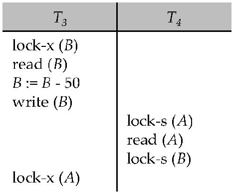
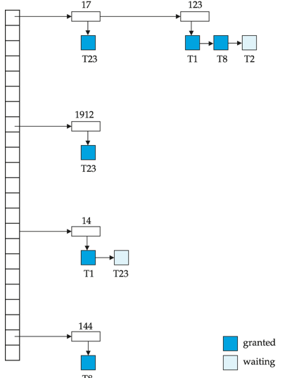
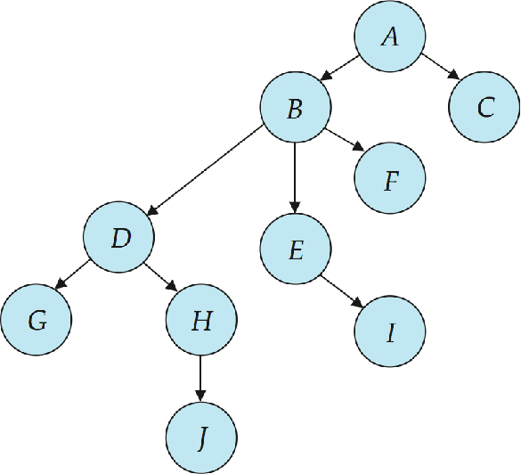
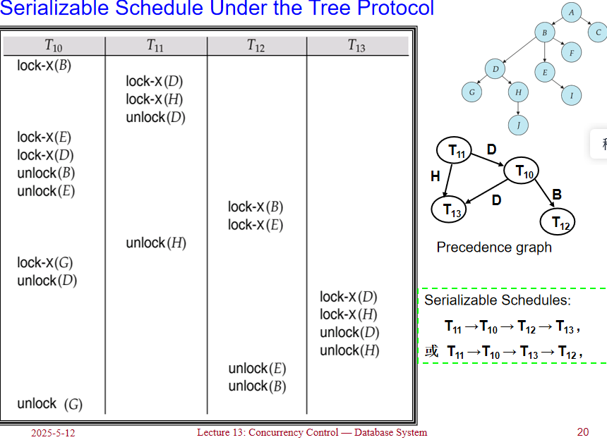

# Concurrency Control

## Lock-Based Protocols

可串行化调度是并发控制的基础；

数据项可以以两种模式锁定：

- Exclusive (X) mode: 数据项可以被读取和写入。X锁通过lock-X指令请求。
- Shared (S) mode: 数据项只能被读取。S锁通过lock-S指令请求。

写一个数据之前，需要先得到一个X锁，读一个数据之前，需要先得到一个S锁。操作结束之后，将这个锁释放。

锁请求由并发控制管理器处理。事务只有在请求被授予后才能继续执行。

S锁与S锁是兼容的，X锁其它锁不兼容.

如果请求的锁与其他事务已经持有的锁兼容，
则事务可以获得对数据项的锁。
任意数量的事务可以对一个数据项持有共享锁（S锁），
但如果任何事务对该数据项持有排他锁（X锁），则其他事务不能持有任何类型的锁。

如果锁不能被授予，请求锁的事务将被阻塞等待，
直到所有不兼容的锁被其他事务释放。
然后，锁才会被授予给等待的事务。


!!!Example
    Example of a transaction performing locking

    ```sql
    lock-S(A)
    read(A)
    unlock(A)
    lock-S(B)
    read(B)
    unlock(B)
    display(A+B)
    ```
    上面的锁定方式不足以保证可串行化 — 如果在读取A和B之间，A和B被更新了，那么显示的总和将是错误的。

    锁定协议(Locking protocols)是所有事务在请求和释放锁时遵循的一组规则。锁定协议限制了可能的调度集合。

    <figure markdown="span">
    { width="500" }
    </figure>

    上图展示了一个死锁的例子：
    
    - T3 持有 B 的 X 锁，并请求 A 的 X 锁
    - T4 持有 A 的 S 锁，并请求 B 的 S 锁
    
    T3 和 T4 都无法继续执行 — T4 执行 lock-S(B) 会导致它等待 T3 释放 B 上的锁，而 T3 执行 lock-X(A) 会导致它等待 T4 释放 A 上的锁。这种情况被称为死锁（deadlock）。
    
    为了处理死锁，必须回滚 T3 或 T4 中的一个事务，并释放其持有的锁。

    !!!info "deadlock & starvation"
        死锁（deadlock）是指在并发系统中，两个或多个事务（或进程）相互等待对方释放资源，从而导致所有事务都无法继续执行的情况。具体来说，在一个死锁的情境中，每个事务都持有某些资源的锁，并请求其他事务持有的资源锁，而这些资源锁又无法被释放，因为持有它们的事务也在等待其他资源的释放。
    
        死锁是大多数锁定协议中存在的问题，可以说是一种"evil"。除了死锁外，饥饿（starvation）也是可能发生的问题，特别是当并发控制管理器设计不良时。

        饥饿的例子包括：

        - 一个事务可能正在等待对某个数据项的X锁，而同时有一系列其他事务请求并获得了对同一数据项的S锁，导致第一个事务无限期等待。
        - 同一个事务由于反复遇到死锁而被多次回滚，无法完成执行。

        一个设计良好的并发控制管理器应该能够防止饥饿现象的发生，例如通过实现公平的锁分配策略或优先级机制来确保所有事务最终都能获得所需的锁并完成执行。
### The 2PL protocol

2PL协议(Two-Phase Locking)是一种用于并发控制的协议，它通过在事务执行过程中对锁的请求和释放进行限制，从而确保事务的执行顺序和结果的正确性。

2PL协议的执行过程可以分为两个阶段：

1. **增长阶段（Growing Phase）**：
    - 事务可以获取锁
    - 事务不能释放锁

-  **缩减阶段（Shrinking Phase）**：
    - 事务可以释放锁
    - 事务不能获取锁

该协议确保了冲突可串行化的调度。可以证明，事务可以按照它们的锁点（即事务获取其最后一个锁的时间点）的顺序进行串行化。

虽然2PL协议确保了冲突可串行化，但它并不能解决所有的并发控制问题：

1. **死锁问题**：2PL协议本身不能防止死锁的发生。当多个事务相互等待对方持有的锁时，仍然可能出现死锁情况。

2. **级联回滚问题**：在标准的2PL协议下，如果一个事务回滚，可能导致其他已读取该事务修改数据的事务也必须回滚，这称为级联回滚（cascading rollback）。

为了解决这些问题，有两种改进的2PL协议：

#### Strict 2PL

严格两阶段锁协议要求事务持有所有排他锁（X锁）直到事务提交或中止。具体规则如下：

- 事务必须按照2PL协议获取锁
- 事务持有的所有排他锁必须在事务结束（提交或中止）后才能释放

Strict 2PL的主要优点是避免了级联回滚问题，因为其他事务无法读取未提交的修改数据。

#### Rigorous 2PL

Rigorous 2PL比Strict 2PL更加严格，它要求事务持有所有锁（包括共享锁和排他锁）直到事务提交或中止：

- 事务必须按照2PL协议获取锁
- 事务持有的所有锁（S锁和X锁）必须在事务结束（提交或中止）后才能释放

Rigorous 2PL的主要优点是事务可以按照它们提交的顺序进行串行化，这提供了一种简单明确的串行化顺序。

在实际数据库系统中，通常采用Strict 2PL或Rigorous 2PL协议，因为它们不仅保证了可串行化，还避免了级联回滚问题，简化了恢复机制。

尽管2PL可能不是实现冲突可串行化的唯一方法，但它是一种通用且可靠的方法，特别是在没有关于事务访问模式的先验知识的情况下。这也解释了为什么2PL协议在实际数据库系统中被广泛采用。


!!!Warning
    虽然2PL协议可以保证生成冲突可串行化的调度，但需要注意的是：

    1. **并非所有冲突可串行化的调度都能通过2PL获得**：
        - 存在一些冲突可串行化的调度，它们无法通过遵循2PL协议的事务执行来产生。
        - 这意味着2PL协议在某种程度上限制了可能的调度集合。

    -  **2PL对于冲突可串行化的必要性**：
        - 在没有额外信息（例如对数据访问的顺序）的情况下，2PL对于确保冲突可串行化是必要的。
        - 这可以通过以下方式理解：如果事务Ti不遵循两阶段锁定协议，我们总能找到另一个遵循两阶段锁定的事务Tj，使得Ti和Tj的某个调度不是冲突可串行化的。(逆否)

### Lock Conversion

锁转换（Lock Conversion）是两阶段锁协议的一个扩展，允许事务在执行过程中动态地改变已持有锁的类型。这种机制增加了并发控制的灵活性，同时仍然保持可串行化的保证。

在带有锁转换的两阶段锁协议中：

- **第一阶段（获取阶段）**：
    - 可以获取项目上的共享锁（S锁）
    - 可以获取项目上的排他锁（X锁）
    - 可以将共享锁（S锁）升级为排他锁（X锁）（Upgrade操作）

- **第二阶段（释放阶段）**：
    - 可以释放共享锁（S锁）（Unlock操作）
    - 可以释放排他锁（X锁）（Unlock操作）
    - 可以将排他锁（X锁）降级为共享锁（S锁）（Downgrade操作）

这个协议确保了可串行化。但它仍然依赖于程序员正确插入各种锁定指令。

锁转换的主要优势在于：

1. **提高并发度**：允许事务根据实际需要调整锁的类型，避免不必要的严格锁定。
- **减少死锁可能性**：通过锁降级，可以在不完全释放锁的情况下减少对资源的独占，降低死锁风险。
- **增强灵活性**：事务可以根据操作的不同阶段调整锁的强度，更好地适应实际需求。


### Automatic acquisition of locks

在实际的数据库系统中，事务通常不需要显式地发出锁请求，而是由系统自动处理锁的获取和释放。这种自动锁定机制简化了编程，并确保了事务的正确执行。

当事务Ti发出标准的读/写指令（没有显式的锁定调用）时，系统会自动处理锁定：

**读操作的处理**：

当事务Ti执行`read(D)`操作时：

```sql
 if Ti has a lock on D then
read(D) 
else begin 
if necessary wait until no other  
transaction has a lock-X on D then
grant Ti a  lock-S on D;
read(D)
end
```

### Implementation of Locking
!!!Definition 
    锁管理器通常被实现为一个独立的进程，事务向其发送锁定和解锁请求。锁管理器的工作流程如下：

    - 当收到锁请求时，锁管理器会回复一个锁授予消息（或在发生死锁的情况下，发送一个要求事务回滚的消息）
    - 请求锁的事务会等待，直到其请求得到回应
    - 锁管理器维护一个称为锁表（lock table）的数据结构，用于记录已授予的锁和待处理的请求

    锁表通常实现为一个内存中的哈希表，以被锁定的数据项的名称作为索引。
    锁表中的每个条目通常包含：

    - 数据项标识符
    - 锁类型（共享/排他）
    - 持有锁的事务列表
    - 等待该数据项锁的事务队列

    <figure markdown="span">
    { width="500" }
    </figure>

    上图展示了一个锁表的示例。

    新的请求会被添加到数据项请求队列的末尾，并且只有当它与所有早期锁兼容时才会被授予。

    解锁请求会导致相应的请求被删除，系统会检查后续请求是否可以被授予。如果事务中止，该事务的所有等待或已授予的请求都会被删除。

    为了高效实现这一机制，锁管理器通常会为每个事务维护一个持有锁的列表。这样，当事务完成或中止时，可以快速找到并释放该事务持有的所有锁。

    锁管理器的实现需要考虑以下几个关键点：

    1. **高效的锁状态查询** ：快速确定某个数据项的锁状态
    2. **兼容性检查** ：判断新的锁请求是否与现有锁兼容
    3. **死锁检测** ：识别并解决可能的死锁情况
    4. **公平性** ：确保长时间等待的事务最终能获得所需的锁

    这种集中式的锁管理机制虽然增加了一定的系统开销，但大大简化了并发控制的实现，并提高了系统的可靠性。

### Graph-Based Protocols

!!!Definition
    **基于图的协议** 是二阶段锁定的一种替代方案。这种协议在数据项集合 
    
    \[
    D = \{d_1, d_2, \ldots, d_h\}
    \]
   
    上施加一个偏序关系。
    
    如果 $d_1 \rightarrow d_2$，那么任何同时访问 $d_1$ 和 $d_2$ 的事务必须先访问 $d_1$ 再访问 $d_2$。这意味着数据集 $D$ 可以被视为一个有向无环图，称为数据库图(database graph)。

    树协议(tree-protocol)是一种简单的图协议。在树协议中，数据项被组织成一棵树的形式，事务必须按照从根到叶的顺序访问数据项。


 <figure markdown="span">
 { width="500" }
 </figure>

树协议的规则如下：

1. **仅允许排他锁（X锁）**：树协议中只使用排他锁，不使用共享锁。

- **首次加锁的灵活性**：事务Ti的第一个锁可以加在任何数据项上。

- **层次化加锁规则**：随后，Ti只能对当前已经被Ti锁定的数据项的子节点加锁。具体来说，数据项Q只有在其父节点已被Ti锁定的情况下才能被Ti锁定。

- **灵活的解锁时间**：数据项可以在任何时候解锁，不必遵循严格的顺序。

- **不可重复加锁**：一旦某个数据项被Ti锁定并解锁后，Ti不能再次锁定该数据项。

<figure markdown="span">
{ width="500" }
</figure>

!!!Summary
    树协议的优缺点：

    **优点**：

    - *无死锁保证*：树协议确保了冲突可串行化以及无死锁发生
    - *提前解锁*：与二阶段锁定协议相比，树协议允许更早地解锁数据项
    - *等待时间更短*：在某些情况下可以提高并发度
    - *无需回滚*：由于协议是无死锁的，不需要执行回滚操作

    **缺点**：

    - *恢复性问题*：协议不保证可恢复性或避免级联回滚
    - *需要额外机制*：为确保可恢复性，需要引入提交依赖关系
    - *额外锁定*：事务可能必须锁定它们实际上不访问的数据项
    - *锁开销增加*：导致额外的等待时间
    - *并发度潜在降低*：在某些情况下可能降低系统的整体并发性能

    值得注意的是，二阶段锁定协议和树协议各有所长，某些在二阶段锁定下不可能的调度在树协议下是可能的，反之亦然。选择哪种协议取决于具体的应用场景和数据访问模式。
    
 
