# Indexing and Hashing

索引的结构一般由搜索键(search key)和指针(pointer)组成

## Ordered indices

在有序索引中，索引条目按照搜索键值进行排序存储，例如图书馆中的作者目录。

- **顺序排序文件(Sequentially ordered file)** : 文件(数据文件)中的记录按搜索键排序。

- **主索引(Primary index)** : 搜索键与顺序排序数据文件的搜索键相等的索引。(与对应的数据文件本身的排列顺序相同的索引称为主索引)
  - 也称为聚集索引(clustering index)
  - 主索引的搜索键通常是但并非一定是主码(primary key)
  - 非顺序文件没有主索引，但关系可以有主键

- **索引顺序文件(Index-sequential file)** : 带有主索引的顺序排序文件

- **辅助索引(Secondary index)** : 搜索键与顺序排序数据文件的搜索键不相等的索引。Also called non-clustering index
> 例如，在以书号为搜索键的索引中，书名和作者名是辅助索引

### Dense Index

- 索引文件中的每个搜索键值都对应一个索引条目

<figure markdown="span">
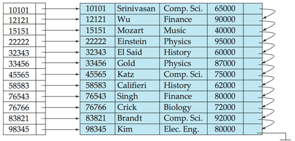{ width="500" }
<figcaption>ID 索引</figcaption>
</figure>

<figure markdown="span">
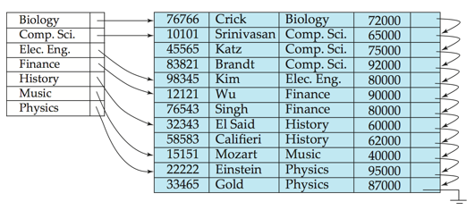{ width="500" }
<figcaption>Name 索引</figcaption>
</figure>

### Sparse Index

- 稀疏索引仅包含部分搜索键值的索引条目。通常，一个数据块对应一个索引条目，一个块包含多个有序的数据记录。

*稀疏索引仅适用于数据文件记录按搜索键顺序排列的情况*。

要定位搜索键值为 K 的记录，搜索方法如下：

1. 找到索引记录中小于 K 的最大搜索键值。

2. 从索引条目指向的记录开始，顺序搜索文件。

<figure markdown="span">
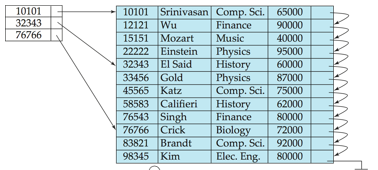{ width="500" }
<figcaption>稀疏索引</figcaption>
</figure>


!!!Note
    Sparse index 智能用于顺序的文件，而dense index则可以用于顺序和非顺序文件

### Secondary Index

- **辅助索引(Secondary Index)** : 在实际应用中，常常需要查找某个字段中满足特定条件的所有记录，而该字段并不是主索引的搜索键。
    - 例如：在按账户号码顺序存储的账户数据库中，我们可能希望查找所有余额为指定值或在某个范围内的账户。
    - 我们可以为每个搜索键值创建一个辅助索引，索引记录指向一个桶(Bucket)，该桶包含指向所有具有该特定搜索键值的实际记录的指针。

<figure markdown="span">
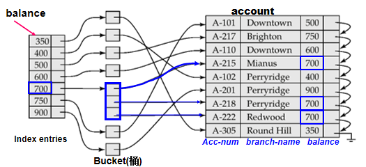{ width="500" }
<figcaption>一个balance对应了很多个account，将它们都装在一个桶中</figcaption>
</figure>

### Multilevel Index

- **多级索引(Multilevel Index)** : 当主索引过大而无法放入内存时，访问变得昂贵。
    - 例如：1,000,000 条记录 / 每块 10 条记录 = 100,000 块 = 100,000 个索引条目，(稀疏索引) / 每块 100 个条目 = 1000 块 (稀疏索引文件的大小)。
    - 二分查找: 「log2(1000)」= 9 次块读取，10*15ms = 150ms。
    - 为了减少对索引记录的磁盘访问次数，将磁盘上的主索引视为顺序文件，并在其上构建稀疏索引。
    - 外层索引 – 主索引的稀疏索引。
    - 内层索引 – 主索引文件。
    - 如果即使是外层索引也太大而无法放入主存，则可以创建另一个级别的索引，依此类推。(可以推广到任意多层索引)
    - 在文件中插入或删除时，所有级别的索引都必须更新。

<figure markdown="span">
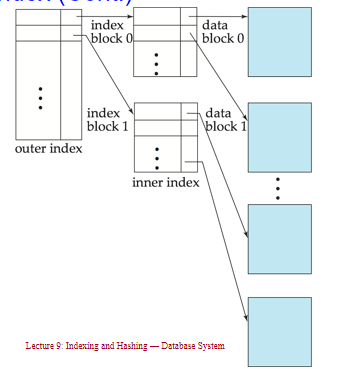{ width="500" }
<figcaption>多级索引示意图</figcaption>
</figure>

多级索引也可以用于聚集索引和非聚集索引;

<figure markdown="span">
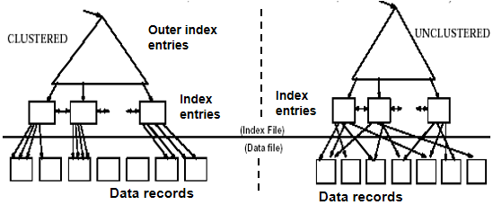{ width="500" }
<figcaption>多级索引示意图</figcaption>
</figure>

### Deletion of index

在数据库中删除记录时，索引文件也需要相应更新。以下是单级索引删除的步骤：

*步骤1：系统在数据文件中找到记录，然后删除该记录。*

*步骤2：更新索引文件：*

- **情况1：密集索引 (Dense indices)**

  - 如果被删除的记录是其特定搜索键值的唯一记录，则从索引文件中删除相应的索引条目。（单记录，即search-key有唯一性）
  
  - 否则，（多条记录，即search-key无唯一性）
  
    - 如果有多个指针指向具有相同搜索键值的所有记录，则从索引条目中删除指向被删除记录的指针。（对应辅助索引的情况）
    
    - 否则，（对应主索引）
    
      - 如果被删除的记录是第一个被指向的记录，则将指针更改为下一条记录。
      
      - 否则，不需要对索引条目进行任何操作。

- **情况2：稀疏索引 (Sparse indices)**

  - 如果被删除记录的搜索键值未出现在索引中，则不需要对索引进行任何操作。
  
  - 否则，如果索引文件中存在该搜索键的索引条目，则通过用数据文件中的下一个搜索键值（按搜索键顺序）替换该条目来删除它。
  
  - 如果下一个搜索键值已经有索引条目，则删除索引条目而不是替换。


对于多级索引：由底层逐级向上层扩展，每一层的处理过程与上述单层索引情况下类似。


### Insertion of index

在数据库中插入记录时，索引文件也需要相应更新。以下是单级索引插入的步骤：

*步骤1：利用索引找到插入位置，在数据文件中插入记录。*

*步骤2：更新索引文件：*

- **情况1：密集索引 (Dense indices)**

  - 如果搜索键值未出现在索引中，则插入一个包含该搜索键值的索引条目。
  
  - 否则，
  
    - 如果有多个指针指向具有相同搜索键值的所有记录，则在索引条目中添加一个指向新记录的指针。
    
    - 否则，不需要对索引条目进行任何操作。

- **情况2：稀疏索引 (Sparse indices)**

  - 如果创建了一个新块，则将新块中出现的第一个搜索键值插入到索引中。
  
  - 如果新记录在其块中具有最小的搜索键值，则更新索引条目。
  
  - 否则，不需要对索引进行任何更改。


对于多级索引：由底层逐级向上层扩展，每一层的处理过程与上述单层索引情况下类似。


!!!summary
    索引在搜索记录时提供了显著的优势。

    但是：更新索引会在数据库修改时带来额外的开销——当文件被修改时，文件上的每个索引都必须更新。

    使用主索引的顺序扫描是高效的，但使用辅助索引的顺序扫描则代价高昂。每次记录访问可能会从磁盘中获取一个新块。块的获取大约需要5到10毫秒，而内存访问大约需要100纳秒。


## B + Tree indices
> [B+ Tree](../ADS/wk2.md)

!!!quote "B+树索引的优缺点"
    **索引顺序文件的缺点：**

    - 随着文件的增长，性能会下降，因为会创建许多溢出块。
    - 需要定期重组整个文件。

    **B+树索引文件的优点：**
    
    - 在插入和删除时，能够通过小的局部变化自动重组自身。
    - 不需要重组整个文件来维持性能。

    **B+树的（次要）缺点：**
    
    - 额外的插入和删除开销；空间开销。

    **B+树的优点超过了缺点**
    
    - B+树被广泛使用。


### Basic Structure

!!!Definition "B+树"
    B+树是一种平衡树,我们说B+树是m阶的，如果其具有以下特性：

    - 每个节点最多有$m$个子节点。
    - 除根节点外，每个非叶子节点至少有$\lceil m/2 \rceil$个子节点。
    - 根节点至少有两个子节点（除非它是叶子节点）。

    - 每个非叶子节点最多有$m-1$个搜索键值。
    - 每个非叶子节点至少有$\lceil m/2 \rceil - 1$个搜索键值。

    - 叶子节点的值个数在$\lceil m/2 \rceil - 1$和$m-1$之间。

    - 所有叶子节点在同一层。

    - 如果根节点是叶子节点（即树中没有其他节点），它可以有0到$m-1$个值。

<figure markdown="span">
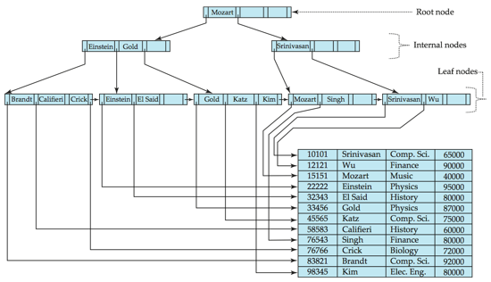{ width="500" }
<figcaption>4阶B+树</figcaption>
</figure>

<figure markdown="span">
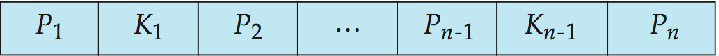{ width="500" }
<figcaption>B+树的Node</figcaption>
</figure>

其中：

- $K_i$ 是搜索键值
- $P_i$ 是子节点指针

一般而言

\[
    K_1 < K_2 < \cdots < K_{n-1}
\]

!!!Property "B+树叶子节点的特性"
    在B+树中，对于$i = 1, 2, \ldots, n-1$，指针$P_i$要么指向具有搜索键值$K_i$的文件记录，要么指向一个指向文件记录的指针桶，每个记录都有搜索键值$K_i$。只有当搜索键不构成主键时才需要指针桶。（类似于密集索引，每个搜索键出现在叶节点中）

    如果$L_i, L_j$是叶节点且$i < j$，则$L_i$中的所有搜索键值都小于$L_j$的搜索键值。（叶节点间的搜索键不重叠，且所有左节点中的搜索键值一定小于右节点中的搜索键值）

    必须有$\lceil (n-1)/2 \rceil$到$n-1$个搜索键。当$n = 5$时，搜索键的数量满足$2 \leqslant \text{搜索键数量} \leqslant 4$。

    指针$P_n$指向按搜索键顺序的下一个叶节点，这对于文件的顺序处理非常方便。

!!!Property "B+树非叶节点的特性"
    非叶节点的指针（子树）数量在$\lceil n/2 \rceil$和$n$之间。扇出数（Fanout）即为节点中的指针数量。非叶节点在叶节点上形成一个多级稀疏索引。对于一个具有$m$个指针的非叶节点：

    - $P_1$所指的子树中的所有搜索键值都小于$K_1$。
    - 对于$2 \leqslant i \leqslant n - 1$，$P_i$所指的子树中的所有搜索键值都大于或等于$K_{i-1}$且小于$K_i$。
    - $P_n$所指的子树中的所有搜索键值都大于或等于$K_{n-1}$。
    
    可以理解为$P_i$ 和 $K_{i-1}$ 是一对(从后往前看)，指向的是以$K_{i-1}$为第一个搜索键值的节点;

    
!!!Section "B+树的优势"
    由于节点间的连接是通过指针完成的，因此"逻辑上"相近的块不需要"物理上"相近。B+树的非叶节点层级构成了一个稀疏索引的层次结构。B+树包含的层级数量相对较少（与主文件的大小呈对数关系），因此可以高效地进行搜索。对主文件的插入和删除操作可以高效地处理，因为索引可以在对数时间内重构。


### Queries

```C++
Find record with search-key value V.
C = root
While C is not a leaf node {
    Let i be the least value such that V ≤ Ki.
    If no such i exists, set C to the last non-null pointer in C
    Else {
        if (V = Ki) set C = Pi + 1
        else set C = Pi
    }
}
Let i be the least value such that Ki = V
If there is such a value i, follow pointer Pi to the desired record.
Else no record with search-key value V exists.
```

!!!Property "B+树的性能分析"
    如果文件中有$K$个搜索键值，树的高度不超过$\lceil \log_{\lceil n/2 \rceil}(K) \rceil$。一个节点通常与磁盘块大小相同，通常为4千字节，而$n$通常约为100（每个索引条目40字节）。对于100万个搜索键值且$n = 100$，在查找中最多访问$\log_{50}(1,000,000) = 4$个节点。相比之下，具有100万个搜索键值的平衡二叉树在查找中大约需要访问20个节点。上述差异是显著的，因为每次节点访问可能需要一次磁盘I/O，耗时约20毫秒。


在B+树中处理重复的搜索键值需要特殊的机制：

- **重复搜索键的存在位置**：
  - 在叶节点和内部节点中都可能有重复的搜索键

- **重复键的性质**：
  - 我们不能保证 $K_1 < K_2 < K_3 < \cdots < K_{n-1}$
  - 但可以保证 $K_1 \leq K_2 \leq K_3 \leq \cdots \leq K_{n-1}$

- **搜索键在子树中的分布**：
  - 搜索键在子树中的分布必须满足：
    - 搜索键值 $\leq K_i$，但不一定小于 $K_i$
    - 若要查看某个搜索键值 $V$ 是否在两个叶节点 $L_i$ 和 $L_{i+1}$ 中存在，则在父节点 $K$ 中必须等于 $V$

- **查找过程修改**：
  - 我们需要修改查找过程如下：
    - 遍历指针 $P_i$，即使当 $V = K_i$ 时
    - 当我们到达叶节点 $C$ 时，检查 $C$ 是否只有小于 $V$ 的搜索键值
      - 如果是，在检查 $C$ 是否包含 $V$ 之前，将 $C$ 设置为 $C$ 的右兄弟节点

- **printAll过程**：
  - 使用修改后的查找过程来找到 $V$ 的第一次出现
  - 遍历连续的叶节点以找到 $V$ 的所有出现

### Insertion

1. **找到叶节点**：找到搜索键值将出现的叶节点。

2. **检查键值是否存在**：
    - 如果搜索键值已经存在于叶节点中：
        - 将记录添加到文件中。
        - 如果需要，添加指向桶的指针。

3. **键值不存在**：
    - 将记录添加到主文件中（如果需要，创建一个桶）。
    - 如果叶节点中有空间，插入（键值，指针）对到叶节点中。
    - 否则，分裂节点（包括新插入的（键值，指针）条目），具体步骤如下：

4. **分裂叶节点**：
    - 将n个（搜索键值，指针）对（包括正在插入的那个）按顺序排列。
    - 将前⎡n/2⎤个放入原节点，其余的放入新节点。
    - 设新节点为p，设k为p中最小的键值。在被分裂节点的父节点中插入（k,p）。
    - 如果父节点已满，分裂它并将分裂向上传播。

5. **节点分裂向上传播**：
    - 分裂节点的过程向上进行，直到找到一个未满的节点。
    - 在最坏的情况下，根节点可能会被分裂，从而增加树的高度1。


### Deletion


1. **找到要删除的记录**：
    + 在主文件中找到要删除的记录，并将其删除。
    + 如果存在桶，则从桶中删除记录。

2. **从叶节点中删除**：
    - 如果没有桶或桶已空，从叶节点中删除（搜索键值，指针）。

3. **节点合并**：
     - 如果由于删除导致节点条目过少，并且节点与其兄弟节点的条目可以合并成一个节点，则合并兄弟节点：
     - 将两个节点中的所有搜索键值插入到一个节点（左侧节点）中，并删除另一个节点。
     - 从其父节点中删除（Ki–1, Pi），其中Pi是指向被删除节点的指针，递归使用上述过程。

4. **指针重新分配**：
     - 如果由于删除导致节点条目过少，但节点与其兄弟节点的条目不能合并成一个节点，则重新分配指针：
     - 在节点与其兄弟节点之间重新分配指针，使得两者都有超过最小数量的条目。
     - 更新节点父节点中的相应搜索键值。

5. **级联删除**：
     - 节点删除可能会向上级联，直到找到一个有⎡n/2⎤或更多指针的节点。

6. **根节点处理**：
     - 如果删除后根节点只有一个指针，则删除根节点，唯一的子节点成为新的根节点。

### B Tree indices

B树与B+树相似，但B树允许搜索键值只出现一次，从而消除了搜索键的冗余存储。在B树中，非叶节点中的搜索键不会出现在其他地方；因此，每个非叶节点中的搜索键必须包含一个额外的指针字段。

在B树中，所有节点都是广义的叶节点。

- **非叶节点**：指针Bi指向桶或文件记录。

即B树的非叶节点与B+树的非叶节点类似，但B树的非叶节点中包含搜索键值，而B+树的非叶节点中不包含搜索键值。

<figure markdown="span">
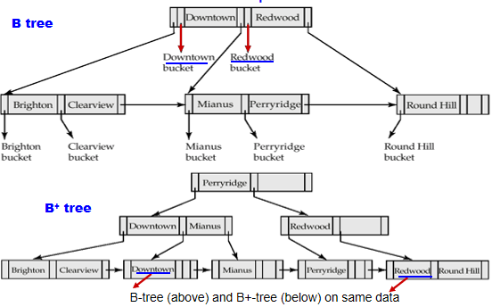{ width="500" }
<figcaption>B树和B+树</figcaption>
</figure>


**B树索引的优点：**

- 可能使用比对应的B+树更少的树节点（因为没有重复）。
- 有时可以在到达叶节点之前找到搜索键值。

**B树索引的缺点：**

- 只有一小部分搜索键值可以提前找到。
- 非叶节点较大，因此扇出减少。因此，B树通常比对应的B+树具有更大的深度。
- 插入和删除比在B+树中更复杂。
- 实现比B+树更困难。

通常情况下，B树的优点并不超过其缺点,B+树更受欢迎。

## Static Hashing

静态哈希是一种哈希文件组织方法，其中桶的数量在创建时是固定的，并且不会随着数据的增加而改变。

- **桶（Bucket）**：桶是一个存储单元，包含一个或多个记录（桶通常是一个磁盘块）。

- **哈希函数**：在哈希文件组织中，我们使用哈希函数直接从记录的搜索键值获取桶。哈希函数h是从所有搜索键值集合K到所有桶地址集合B的一个函数。

- **记录定位**：哈希函数用于定位记录以进行访问、插入以及删除。

- **冲突处理**：具有不同搜索键值的记录可能会映射到同一个桶，因此必须顺序搜索整个桶以定位记录。

静态哈希的优点是简单且易于实现，但其缺点是当数据量增加时，可能会导致桶的溢出，从而需要额外的溢出处理机制。

<figure markdown="span">
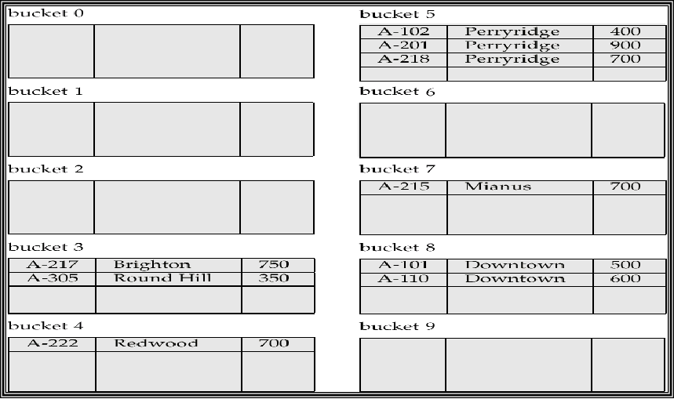{ width="500" }
<figcaption>静态哈希示意图</figcaption>
</figure>

!!!Note "哈希函数的特性"
    最差的哈希函数会将所有搜索键值映射到同一个桶中，这使得访问时间与文件中搜索键值的数量成正比。
    
    理想的哈希函数是均匀的，即每个桶被分配到相同数量的搜索键值，这样可以确保每个桶中记录的数量相同，不受文件中搜索键值实际分布的影响。
    
    典型的哈希函数会对搜索键的内部二进制表示进行计算。例如，对于一个字符串类型的搜索键，可以将字符串中所有字符的二进制表示相加，然后对桶的数量取模，返回结果。
    
    这种方法确保了哈希函数的随机性，使得每个桶中分配的记录数量相对均匀，从而提高了哈希表的访问效率。

### Overflows

桶溢出可能发生在以下几种情况下：

- **桶数量不足**：当桶的数量不足以容纳所有记录时，可能会导致桶溢出。
- **记录分布不均**：这可能由于以下两个原因导致：
  - 多个记录具有相同的搜索键值。
  - 所选的哈希函数产生了非均匀的键值分布。

尽管可以通过优化来降低桶溢出的概率，但无法完全消除；通常通过使用溢出桶来处理桶溢出问题。

溢出桶是用于存储那些无法放入原始桶中的记录的额外存储单元。通过这种方式，即使发生桶溢出，记录仍然可以被有效地存储和访问。

<figure markdown="span">
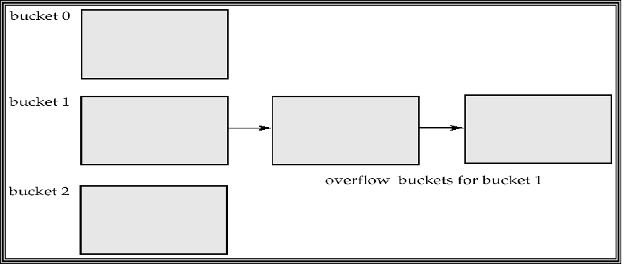{ width="500" }
<figcaption>溢出桶示意图</figcaption>
</figure>

### Hash Indexing

哈希不仅可以用于文件组织，还可以用于索引结构的创建。哈希索引将搜索键及其关联的记录指针组织成一个哈希文件结构。

严格来说，如果文件本身是使用哈希组织的，那么在其上使用相同搜索键的单独主哈希索引是没有必要的，因此哈希索引总是作为辅助索引。然而，我们使用“哈希索引”一词来指代辅助索引结构和哈希组织的文件。

哈希索引的优点在于其快速的查找速度，因为它可以直接通过哈希函数定位到相应的桶，从而快速访问记录。这使得哈希索引在处理大量数据时非常高效，尤其是在需要频繁查找的场景中。

然而，哈希索引也有其局限性，例如在处理范围查询时效率较低，因为哈希索引不维护数据的顺序。此外，哈希索引在处理动态数据集时可能需要重新哈希以适应数据的增长。

总的来说，哈希索引是一种强大的工具，适用于需要快速查找的应用场景，但在选择使用时需要考虑其局限性和适用性。

<figure markdown="span">
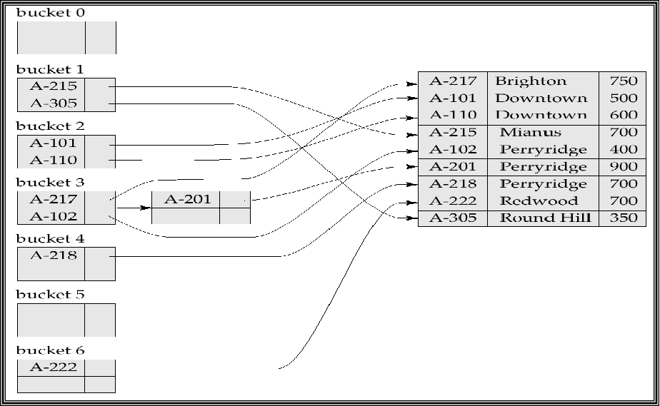{ width="500" }
<figcaption>哈希索引</figcaption>
</figure>

## Dynamic Hashing

在静态哈希中，哈希函数 h 将搜索键值映射到固定数量的桶地址集合 B 中。然而，随着时间的推移，数据库会增长。如果初始的桶数量过少，性能会因为过多的溢出而下降。如果预期未来文件的大小并相应地分配桶的数量，则最初会浪费大量空间。如果数据库缩小，空间也会被浪费。一个选择是定期使用新的哈希函数重新组织文件，但这非常昂贵。

这些问题可以通过使用允许动态修改桶数量的技术来避免。

动态哈希技术包括：

- **扩展哈希**：通过使用目录来管理桶，目录的大小可以动态增长或缩小。每个目录项指向一个桶，哈希函数的结果用于索引目录。这样可以在不重新组织整个文件的情况下增加或减少桶的数量。

- **线性哈希**：通过逐步增加桶的数量来处理文件的增长，而不是一次性增加。线性哈希使用一个增量的方式来分配新的桶，并在需要时重新分配现有记录。

动态哈希的优点在于它能够适应数据库的增长和缩小，避免了静态哈希中常见的空间浪费和性能下降问题。通过动态调整桶的数量，动态哈希可以在保持高效查找性能的同时，优化存储空间的使用。

然而，动态哈希也有其复杂性，例如需要额外的机制来管理桶的动态变化，并且在某些情况下可能会引入额外的计算开销。

### Extendable Hashing

可扩展哈希是一种动态哈希技术，适用于大小不断变化的数据库。它允许动态修改哈希函数，并通过使用目录来管理桶的地址。

在可扩展哈希中，哈希函数生成一个大范围的值，通常是 $b$ 位整数，$b = 32$。在任何时候，只使用哈希函数的前缀来索引桶地址表。前缀的长度为 $i$ 位，$0 \leq i \leq 32$。桶地址表的大小为 $2^i$。最初，$i = 0$。

随着数据库的增长和缩小，$i$ 的值也会相应地增长和缩小。桶地址表中的多个条目可能指向同一个桶。因此，实际的桶数量小于 $2^i$。由于桶的合并和分裂，桶的数量也会动态变化。

这种方法的优点在于它能够灵活地适应数据库的变化，避免了静态哈希中常见的空间浪费和性能下降问题。通过动态调整桶的数量和哈希函数的前缀长度，可扩展哈希在保持高效查找性能的同时，优化了存储空间的使用。

然而，可扩展哈希也需要额外的机制来管理桶的动态变化，并且在某些情况下可能会引入额外的计算开销。


每个桶 $j$ 存储一个值 $i_j$；所有指向同一桶的条目在前 $i_j$ 位上具有相同的值。

要定位包含搜索键 $K_j$ 的桶：

1. 计算 $h(K_j) = X$
2. 使用 $X$ 的前 $i$ 个高位作为桶地址表中的位移，并跟随指针到达适当的桶

要插入具有搜索键值 $K_j$ 的记录：

1. 按照与查找相同的过程，定位桶 $j$。
2. 如果桶 $j$ 中有空间，则将记录插入桶中。
3. 否则，必须分裂桶并重新尝试插入。
4 在某些情况下使用溢出桶


**分裂桶 j 时插入搜索键值为 $K_j$ 的记录**：
  - 如果 $i > i_j$（多个指针指向桶 $j$）：
        - 分配一个新桶 $z$，并将 $i_j$ 和 $i_z$ 设置为旧的 $i_j + 1$。
        - 将桶地址表中指向 $j$ 的后一半条目改为指向 $z$。
        - 移除并重新插入桶 $j$ 中的每个记录。
        - 重新计算 $K_j$ 的新桶，并将记录插入该桶（如果桶仍然满，则需要进一步分裂）。

  - 如果 $i = i_j$（只有一个指针指向桶 $j$）：
        - 增加 $i$ 并将桶地址表的大小加倍。
        - 将表中的每个条目替换为两个指向同一桶的条目。
        - 重新计算 $K_j$ 的新桶地址表条目。
        - 现在 $i > i_j$，因此使用上述第一种情况。

**溢出桶的创建**：

- 当插入一个值时，如果经过多次分裂后桶仍然满（即 $i$ 达到某个限制 $b$），则创建一个溢出桶，而不是进一步分裂桶地址表。

**删除键值**：
- 定位键值所在的桶并将其删除。
- 如果桶变为空，则可以删除该桶（同时适当更新桶地址表）。
- 桶的合并可以进行（仅能与具有相同 $i_j$ 值和相同 $i_j - 1$ 前缀的“伙伴”桶合并，如果存在的话）。
- 也可以减少桶地址表的大小。


接下来通过一个例子来理解可扩展哈希的插入过程：

<figure markdown="span">
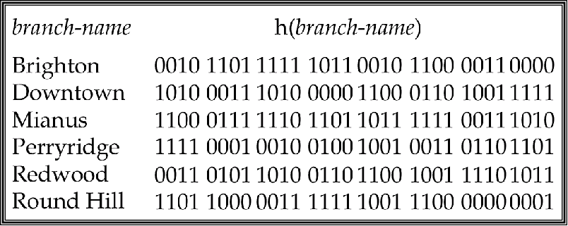{ width="500" }
<figcaption>假设通过brachName来hash，桶大小为2</figcaption>
</figure>

<figure markdown="span">
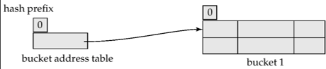{ width="500" }
<figcaption>一开始深度为0，只有一个bucket</figcaption>
</figure>

<figure markdown="span">
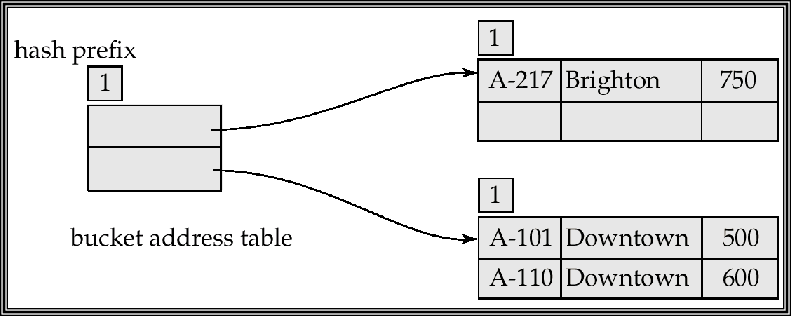{ width="500" }
<figcaption>insertion of one Brighton and two Downtown records</figcaption>
</figure>

插入brighton时，hash结果为0(mod $2^0$)，插入到bucket0中，深度为0，全局和局部深度一样；

插入第一个Downtown时，hash结果为0,也插入bucket0，此时桶满了；

插入第二个Downtown时，hash结果为0，放不下了，此时全局深度需要+1，分裂成两个桶bucket0和bucket1，全局深度$i$为1，局部深度$i_j$为1，将两个downtown插入bucket1，Brighton插入bucket0；此时bucket1也满了

此时目录表为0和1

<figure markdown="span">
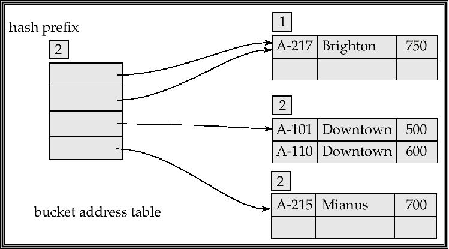{ width="500" }
<figcaption>insertion of one Mianus record</figcaption>
</figure>


接下来插入Mianus时，第一位为1，想插入bucket1，但是bucket1满了，此时需要分裂bucket1，全局深度$i$为2，将bucket1分裂成bucket10和bucket11，将Mianus插入bucket11，

此时目录表为00,01,10,11；其中00,01指向bucket0，因为其深度仍然还是1($i>i_j$)，10,11指向bucket10和11，因为其深度为2($i=i_j$)

<figure markdown="span">
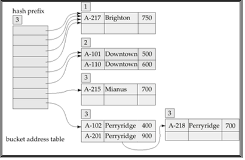{ width="500" }
<figcaption>insertion of 3 perryridge records</figcaption>
</figure>

接下来插入三个perryridge时，其对应Hash值为1111，第一个正常进入11，第二个需要分裂，全局深度$i$为3，将11分裂成110和111，将第一第二个perryridge插入111，第三个perryridge插入时发现又满了，假设此时分裂达到了阈值，那么创建一个溢出桶存放第三个；

此时目录表为000,001,010,011,100,101,110,111；其中000,001,010,011指向bucket0，因为其深度仍然还是1($i>i_j$)，100,101指向bucket10，因为其深度为2($i>i_j$)，110,111指向bucket110和111，因为其深度为3($i=i_j$)；


最后插入Redwood and Round Hill records,直接根据索引插入即可；

<figure markdown="span">
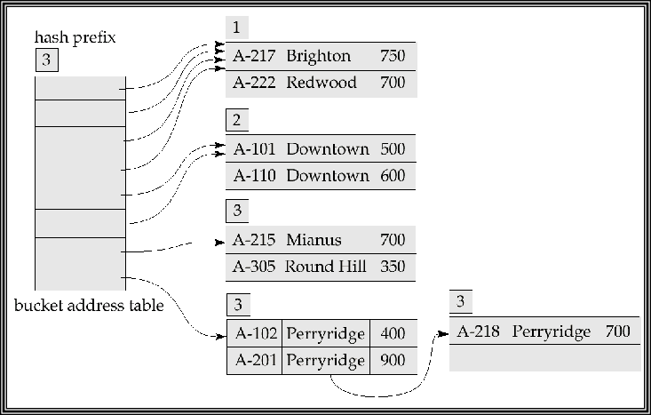{ width="500" }
<figcaption>insertion of 2 Redwood and 2 Round Hill records</figcaption>
</figure>


!!!info "Ordered Indexing VS. Hashing"
    在选择索引方法时，需要考虑以下几个因素：

    1. **周期性重组的成本**：在某些情况下，索引可能需要定期重组以保持其效率。重组的成本可能会影响索引方法的选择。

    2. **插入和删除的相对频率**：如果插入和删除操作频繁，可能需要选择一种能够高效处理这些操作的索引方法。

    3. **优化平均访问时间与最坏情况访问时间的权衡**：在某些应用中，可能需要在优化平均访问时间和最坏情况访问时间之间进行权衡。

    4. **预期的查询类型**：
        - **哈希索引**：通常在检索具有指定键值的记录时表现更好。
        - **有序索引**：如果范围查询很常见，则有序索引更为合适。

## Write-Optimized Indexing

### LSM Tree

在写优化索引中，LSM树（Log-Structured Merge-Tree）是一种常用的数据结构。其基本思想是将记录首先插入到内存中的树（L0树）中。

当内存树满时，记录会被移动到磁盘上的树（L1树）。L1树通过自底向上的构建方式，合并现有的L1树和来自L0树的记录，构建B+-树。

当L1树超过某个阈值时，会合并到L2树中。以此类推，更多的层级可以继续扩展。对于每一层级Li+1树，其大小阈值是Li树大小阈值的k倍。

这种结构的优点在于，它能够有效地处理大量的写操作，同时在读取时通过合并的B+-树提供高效的查询性能。

**LSM方法的优点**
- 插入操作仅使用顺序I/O操作
- 叶子节点是满的，避免了空间浪费
- 与普通B+-树相比，每条记录插入所需的I/O操作次数减少（在某个大小范围内）

**LSM方法的缺点**
- 查询需要搜索多个树
- 每个层级的内容会被多次复制


### Stepped-Merge Index

Stepped-Merge Index是LSM树的一种变体，每个层级有多个树。
- 相较于LSM树，写入成本降低
- 但查询成本更高
- 使用布隆过滤器来避免在大多数树中进行查找


### Insertion and Deletion

在LSM树中，删除操作通过添加特殊的“删除”条目来处理。查找操作会找到原始条目和删除条目，并且必须仅返回那些没有匹配删除条目的条目。当树合并时，如果发现删除条目与原始条目匹配，则两者都会被删除。

更新操作通过插入+删除来处理。

LSM树最初是为基于磁盘的索引引入的，但在基于闪存的索引中也很有用，因为它们可以最大限度地减少擦除操作。LSM树的阶梯合并变体在许多大数据存储系统中使用，例如Google BigTable、Apache Cassandra、MongoDB，以及最近的SQLite4、LevelDB和MySQL的MyRocks存储引擎。


### Buffer Tree

Buffer Tree是一种B+-树的变体，其关键思想是在每个内部节点中设置一个缓冲区以存储插入操作。当缓冲区满时，插入操作会被移动到更低的层级。通过使用较大的缓冲区，每次可以将许多记录移动到更低的层级，从而相应地减少每条记录的I/O操作。

**Buffer Tree的优点**

- 查询的开销较小
- 可以与任何树索引结构结合使用
- 在PostgreSQL的通用搜索树（GiST）索引中使用

**Buffer Tree的缺点**
- 比LSM树有更多的随机I/O操作

<figure markdown="span">
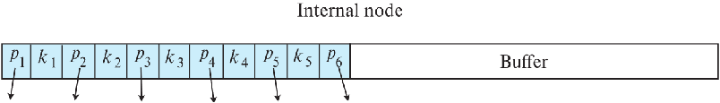{ width="500" }
<figcaption>Buffer Tree</figcaption>
</figure>


## Index Definition in SQL

SQL提供了创建和删除索引的语法，使数据库管理员和开发人员能够优化查询性能。

### Create Index

基本语法：

```sql
CREATE INDEX <索引名> ON <表名> (<属性列表>);
```

Example:
```sql
-- 在branch表的branch-name列上创建索引
CREATE INDEX b-index ON branch(branch-name);

-- 创建多列索引
CREATE INDEX cust-strt-city-index ON customer(customer-city, customer-street);
```

### Create Unique Index

通过创建唯一索引，可以间接指定并强制执行搜索键是候选键的条件：

```sql
CREATE UNIQUE INDEX <索引名> ON <表名> (<属性列表>);
```

Example:
```sql
-- 在account表的account-number列上创建唯一索引
CREATE UNIQUE INDEX uni-acnt-index ON account(account-number);
```

**注意**：如果SQL已经支持唯一性完整性约束（通过`UNIQUE`关键字），则不一定需要使用唯一索引。

### Drop Index

语法：
```sql
DROP INDEX <索引名>;
```

### Other Index Options

根据不同的数据库管理系统，创建索引时可能还有其他选项，如：

- 指定索引类型（B+树、哈希等）
- 指定聚集索引（Clustered Index）或非聚集索引（Non-Clustered Index）
- 设置填充因子（Fill Factor）
- 包含额外的列（INCLUDE子句）

例如，在某些数据库系统中：

```sql
-- 在MySQL中创建B树索引
CREATE INDEX idx_name USING BTREE ON table_name(column_name);

-- 在SQL Server中创建聚集索引
CREATE CLUSTERED INDEX idx_name ON table_name(column_name);
```

索引的选择和创建应基于查询模式、数据分布和系统性能要求进行考虑。

## Multiple-Key Access

### Grid File

网格文件（grid file）是一种用于加快处理涉及一个或多个比较运算符的一般性多搜索键查询的结构。
它具有以下特点：
- 拥有一个单一的网格数组，并且针对每个搜索键属性都有一个线性刻度。网格数组的维度数量与搜索键属性的数量相等。例如，如果有两个搜索键属性，那么网格数组就是二维的。

- 网格数组中的多个单元格可以指向同一个存储桶（bucket）。也就是说，不同的单元格可能对应着相同的数据存储位置。
- 当要为一个搜索键值找到对应的存储桶时，需要使用线性刻度来确定该值所在单元格的行和列，然后顺着单元格的指针就能找到对应的存储桶。
- 通过这种结构，网格文件可以更高效地处理多搜索键的查询操作，提高数据检索的速度和效率。

在插入数据时，如果一个存储桶已满，当有不止一个单元格指向该存储桶时，可以创建一个新的存储桶。这一思路与可扩展散列类似，但应用于多个维度。
如果只有一个单元格指向该已满的存储桶，那么就必须创建一个溢出存储桶，或者增大网格的规模。

- 必须选择合适的线性刻度，以便将记录均匀地分布在各个单元格之间。否则，将会产生过多的溢出存储桶。
- 定期进行重新组织以增大网格规模会有所帮助。但重新组织的代价可能非常高昂。
- 网格数组的空间开销可能会很大。

<figure markdown="span">
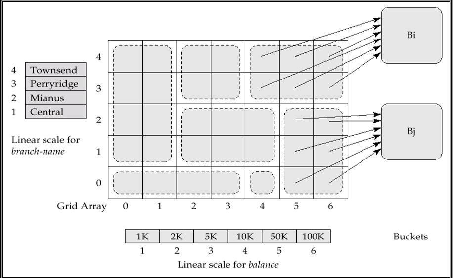{ width="500" }
<figcaption>Grid File</figcaption>
</figure>


