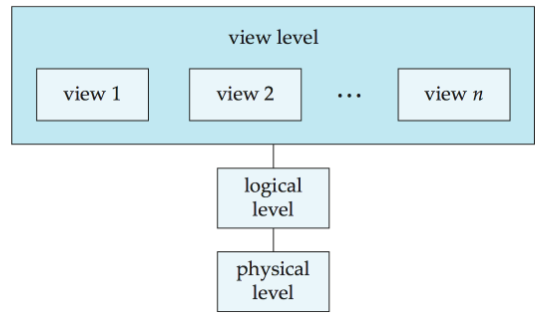

# Introduction


!!! question "What is a Database system"
    - Database : A very large, integrated collection of data 
    - Models a real-world enterprise
        - Entities (e.g., teams, companies) 
        - Relationships (e.g., The Patriots is playing in The Superbowl) 
        - More recently, also includes active components (e.g., business logic)
    - A Database Management System (DBMS) is a software system designed to store, manage, and facilitate access to databases
        - Provides an interface for users to interact with the database
        - Hides the implementation details of how the data is stored and maintained
        - Ensures that the data is consistent and secure
        - Provides tools for querying and updating the data
        - Provides tools for managing the database itself (e.g., backup and recovery)

## Purpose of Database Systems

### Applications

Data processing and management are the most important fields of computer applications. 

So the knowledge of database systems is essential for computer scientists.


Database Applications 

- Banking: all transactions
- Airlines: reservations, schedules
- Universities:  registration, grades
- Sales: customers, products, purchases
- Manufacturing: production, inventory, orders, supply chain
- Human resources: employee records, salaries, tax deductions 

Databases touch all aspects of our lives although you don’t see them.


### Characteristics of DBMS

- Efficiency and scalability in data access. 
- Reduced application development time. 
- Data independence (including physical data independence and  logical data independence). 
- Data integrity and security. 
- Concurrent access and robustness (i.e., recovery). 

### File-Processing System

File-processing system is supported by a conventional Operating System (OS). 

New application programs must be written if necessary, and new data files are created as required. But over a long period of time, data files may be in different formats. 

Data files are independent each other. 

#### Drawbacks of File-Processing System

- Data redundancy and inconsistency: Multiple file formats, duplication of information in different files 
- Difficulty in accessing data:need to write a new program to carry out each task
- Data isolation——multiple files and multiple formats cause it difficult to retrieve and share
- Integrity problems Integrity constraints  (e.g. account balance > 0) become part of program code 
- Hard to add new constraints or change existing ones 
- No atomicity of update :Failures may leave database in an inconsistent state with partial updates carried out( atomicity of update refers to the task should either complete or not happen at all)
- Difficult to concurrent access by multiple users 
      - Concurrent access needed for performance
      - Uncontrolled concurrent accesses can lead to inconsistencies
      - Example: Two people reading a balance (say 100) and updating it by withdrawing money (say 50 each) at the same time
- Security problems

** But Database systems offer solutions to all the above problems！ **


**Open source databases**

- [MySQL](http://www.mysql.com): is the most popular open source database for small system on web sites, is a key part of  LAMP (Linux, Apache, MySQL, PHP/Perl/Python), and is a fast growing open source enterprise software stack. 

- [PostgreSQL](http://www.postgresql.org): is a highly scalable, open source object-relational database management system, and is originally  developed by the Department of Computer Science, UC Berkeley (called Postgres) 

## View of Data

### LEvels of Data Abstraction

Different usage needs different level of abstraction.

- *Physical level*:describes how a record is stored
- *Logical level*: describes data stored in database,and the relationships among the data on upper level
-  *view level*:View level: application programs hide details of data types. Note that views can also hide information (e.g., employee’s salary) for security purposes. 

<figure markdown="span">
{ width="400" }
<figcaption>architecture</figcaption>
</figure>

#### Schemas and instances

**Schema**--the structure of the database on different level 
>Analogous to type information of a variable in a program 

- Physical schema: database structure design at the physical level 
- Logical schema: database structure design at the logical level 
- Subschema: schema at view level 

**instance**--the actual content of the database at a particular point in time
>Analogous to the value of a variable 


!!!Note
    The relationship between schema and instance is similar to types and variables in programming languages 
    (type-schema, variable-instance) 
    即schema是数据库中的蓝图或者目录，用于描述其结构和内容，定义数据应该如何存储和组织，instance是其具体的数据

#### Physical & Logical Independence

*Physical data independence* – the ability to modify the physical schema without changing the logical schema. 

- Applications depend on the logical schema.
- Applications are insulated from how data is structured and stored.
- One of the most important benefits of using a DBMS! 
对于物理结构的更改不应该影响到更高级的层面


*Logical data independence* – protect application programs from changes in logical structure of data. 

- Logical data independence is hard to achieve as the application programs are heavily dependent on the logical structure of data. 


### Data Models

Data model is a collection of conceptual tools for describing 

- data structure
- data relationships
- data semantics
- data constraints 

Different level of data abstraction needs different data model to describe 

## Database language

- Data Definition Language (DDL): Specification notation for defining the database schema. 
- Data Manipulation Language (DML): Language for accessing and manipulating the data organized by appropriate data model. 
- Data Control Language (DCL) 


### DDL

Specifies a database scheme as a set of definitions of relational schema. 

Also specifies storage structure, access methods, and consistency constraints. 

DDL statements are compiled, resulting in a set of tables stored in a special file called data dictionary. 

for example

```SQL
CREATE TABLE account (ccount_number char(10),         balance  integer); 
```


Data dictionary contains metadata (i.e., the data about data) about 

- Database schema 
- Integrity constraints 
- Primary Key 
- Referential integrity 
- Authorization 


### DML

Data Manipulation Language (DML) 
- Retrieve data from the database 
- Insert / delete / update data in the database 
- DML also known as query language 


Two classes of DMLs 
- Procedural DML – user specifies what data is required and how to get those data  (e.g., C, Pascal, Java, etc.). 
- Nonprocedural DML – user specifies what data is required without specifying how to get those data  (e.g., SQL, Prolog, etc.). 

SQL is the most widely used query language 

## Database Design

### Steps of Database Design 

- Requirement analysis :What data, applications, and operations needed. 

- Conceptual database design :A high-level description of data, constraints using Entity-Relationship (E-R) model or a similar high level data model
-  Logical database design Convert the conceptual design into a DB schema. 
- Schema refinement-Normalization of relations: Check relational schema for redundancies and related anomalies. 
- Physical database design:Indexing, query, clustering, and database tuning. 
- Create and initialize the database & Security design 
Load initial data, testing. Identify different user groups and their roles.  

### Entity-Relationship(E-R Model)

E-R model of real world 

- Entities (objects) E.g., customers, accounts, bank branch. Entities are described by a set of attributes. 

- Relationships between entities 
E.g., Account A-101 is held by customer Johnson. 
Relationship set depositor associates customers with accounts 

E-R Model is widely used for database design 
Database design in E-R model is usually converted to design in the relational model . E-R model was first proposed by Peter Chen. 

<div align=center>

</div>

## Users and Administrators

### Database Users


Users are differentiated by the way they expect to interact with the system 

Naive users – invoke one of the permanent application programs that have been written previously by a high level language. 
E.g., people accessing database over the web, bank tellers, clerical staff. 

Application programmers – interact with system via SQL calls. 

Sophisticated users – form requests in a database query language. 
E.g., Online Analytical Processing (OLAP), Data mining. 

Specialized users – write specialized database applications that do not fit into the traditional data processing framework. 
E.g., CAD, Expert System (ES), KDB. 


<div align=center>

</div>

### Database Administrators

Database administrator (DBA): A special user having central control over database and programs accessing those data.

- DBA has the highest privilege for the database. 
- DBA coordinates all the activities of the database system. 
- DBA controls all users authority to the database. 
- DBA has a good understanding of the enterprise’s information resources and requirements

Database administrator's duties/functions include: 

- Schema definition 
- Storage structure and access method definition 
- Schema and physical organization modification 
- Granting of authorization for data access 
Routing maintenance 
- Monitoring performance and responding to changes in requirements 
Security for the database (e.g. periodically backup database, recovery when failure) 

## Transaction Management

Concurrent use/access is important, but causes problems/conflict. 

A transaction is a collection of operations that performs a single logical function in a database application. 

Transaction requirements include atomicity, consistence, isolation, durability. 

Transaction-management component ensures that the database remains in a consistent (or correct) state, although system failures (e.g., power failures and operating system crashes) and transaction failures. 

Concurrency-control manager controls the interaction among the concurrent transactions. 

## Database Architecture

### storage manager

Storage Manager is a program module that provides the interface between the low-level data stored in the database and the application programs and queries submitted to the system. 

Storage Manager is responsible for the following tasks: 

- Interaction with the file manager 
- Efficient storing, retrieving and updating of data 

Storage Manager includes 

- Transaction manager 
- Authorization and integrity manger 
- File manager (interaction with the file system to process data files, data dictionary, and index files) 
- Buffer manager 


### Query Processor

Query Processor includes DDL interpreter, DML compiler, and query processing. 

- Parsing and translation 
- Optimization 
- Evaluation 

<div align=center>

</div>