# Relational Model

!!!info "relational model"
    - the relational model is vary simple and elegant
    - A relational database is a collection of relations (based on the relational model)
    - A relation is a table with columns and rows
    - relational model has two advantages:
          - straight forward data representation
          - ease with which even complex queries can be expressed
    - Owing to the great language SQL


<figure markdown="span">
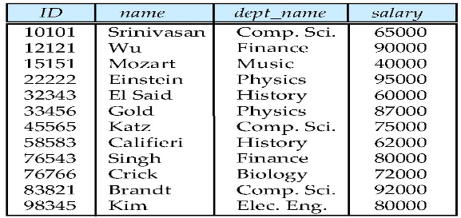{ width="400" }
<figcaption>Example</figcaption>
</figure>

The difference between relationship and relation

- A relationship is an association among several entities
- A relation is the mathematical concept, referred to as a table

Entity set and relationship set <--> real world

Relation---Table,tuple---row  <--> machine world


## Structure of Relational Databases


### Basic Structure

Formally,given sets $D_1,D_2,\ldots,D_n.(D_i|_{j=1,\ldots,k})$

A relation $r$ is a subset of 

\[
    D_1\times D_2\times\ldots\times D_n
\]

aka a **Cartesian product** of a list of domains $D_1,D_2,\ldots,D_n$

Thus,a relation is a set of $n$-tuples$(a_{1j},a_{2j},\ldots,a_{nj})$

where $a_{ij}\in D_i$

即一个关系是一个元组的集合，每个元组有$n$个属性，每个属性的值来自于一个域$D_i$

<figure markdown="span">
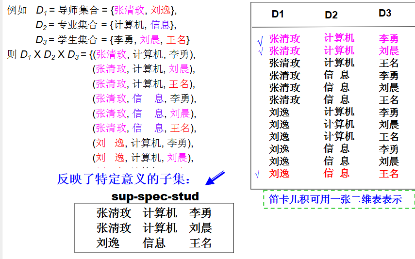{ width="400" }
<figcaption>Example</figcaption>
</figure>

!!!eg
    ```python
    If 
         customer-name = {Jones, Smith, Curry, Lindsay} 
         customer-street = {Main, North, Park} 
         customer-city = {Harrison, Rye, Pittsfield} 
    Then r = {(Jones, Main, Harrison), 
              (Smith, North, Rye),
              (Curry, North, Rye),
              (Lindsay, Park, Pittsfield)}
                     
    is a relation over customer-name x customer-street x customer-city.  (total 36 tuples) 
    ```

### Attribute Types

Each attribute of a relation has a name

THe set of allowed values for each attribute is called the **domain** of the attribute

**Attribute values** are normally required to be atomic,i.e.,indivisible---1st normal form

- E,g multivalue attributes,composite attributes,derived attributes

For every domain , there exists a special value called **null** 

The null value causes complications(并发) in the definition of many operations. 

### Concepts about Relation

A relation is concerned with the following concepts:

- relation schema:describes the structure of the relation

EG.`Student-schema = (sid: string, name: string, sex: string, age: int, dept:  string)`

- relation instance: corresponds to the snapshot(快照) of the data in the relation at a given instant in time. 

```
Variable --- relation 
Variable  type --- relation schema 
Variable  value --- relation instance 
```

### Relation Schema

A **relation schema** is a blueprint or structure that defines the organization of data in a relational database. It specifies the **tables** (also called relations), the **attributes** (or columns), and the **data types** for each attribute. It serves as a way to describe the logical view of the data, but without the actual data being stored.

In a relational schema:
- Each **relation (table)** has a name.
- Each **attribute (column)** within the relation has a name and an associated data type (like `integer`, `varchar`, `date`, etc.).
- The **keys** for the relation are often defined, like primary keys, foreign keys, or unique keys.

For example, a relation schema for a `Student` table could look like this:

- **Student**(`student_id: INT`, `first_name: VARCHAR(50)`, `last_name: VARCHAR(50)`, `dob: DATE`)

Here:
- `Student` is the relation.(`student_id: INT`, `first_name: VARCHAR(50)`, `last_name: VARCHAR(50)`, `dob: DATE`)is the relation schema.
- `student_id`, `first_name`, `last_name`, and `dob` are the attributes.
- `INT`, `VARCHAR(50)`, and `DATE` are the data types for those attributes.

The relation schema helps in organizing the data in a relational database and ensures consistency, integrity, and the proper relationships between different tables.


### Relation Instance

The current values (i.e., relation instance) of a relation are specified  by a table. 

An element t of r is a tuple, represented by a row in a table. 

Let a tuple variable t be a tuple, then t[name] denotes the value of t on the name attribute. 

<figure markdown="span">
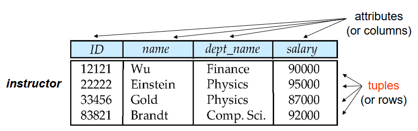
<figcaption>Example</figcaption>
</figure>

The order of tuples is *irrelevant* (i.e., tuples may be stored in an arbitrary). 

No duplicated tuples in a relation. Attribute values are atomic. 


### Key

let $K \subset R$,$K$ is a *superkey* (超码) of $R$ if values for $K$ are sufficient to identify a unique tuple of each possible relation $r(R)$

Eg,E.g., both {ID} and {ID, name} are superkeys of the relation instructor. 


$K$ is a *candidate key* (候选码) if K is minimal superkey. 

E.g., both {ID} and {name} are candidate keys of the relation instructor.Since each of them is a superkey and no any subset. 

$K$ is a *primary key* (主码), if $K$ is a candidate key and is defined by user explicitly. 

Primary key is usually marked by underline. 


*Foreign key* (外码) is a set of attributes in a relation that is a key of another relation.

Assume there exists relations $r$ and $s$: $r(A, B, C)$, $s(B, D)$, we can say that attribute $B$ in relation $r$ is foreign key referencing $s$, and $r$ is a referencing relation (参照关系), and $s$ is a referenced relation (被参照关系). 


**参照关系中外码的值必须在被参照关系中实际存在, 或为null**

Primary key and foreign key are integrated constraints. 
即外键和主键是一体的约束，协同工作。


## Fundamental relational-algebra operations

### Select

Notation: $\sigma_{p}(r)$,where $r$ is a relation and $p$ is a predicate.

Defined as:

\[ \sigma_{p}(r) = \{t|t\in r \land p(t)\} \]

where $p(t)$ is a predicate that is true for a tuple $t$ if the tuple satisfies the condition specified by the predicate.And $p$ is a formula in propositional calculus consistion of terms connected by logical operators.

And each term is of the form :

\[
    <attribute> <operator> <constant> or <attribute> <operator> <attribute>
\]

where $<operator>$ is one of the following: $=, \neq, <, \leq, >, \geq$

Eg. $\sigma_{age>20}(Student)$


### Project(投影)

>如果说select是对行的操作，那么project就是对列的操作

Notation: $\pi_{A_1,A_2,\ldots,A_n}(r)$,where $r$ is a relation and $A_1,A_2,\ldots,A_n$ are attributes of $r$.

The result of the operation is obtained by deleting columns that are not in the list of attributes.And duplicate rows will be removed

<figure markdown="span">
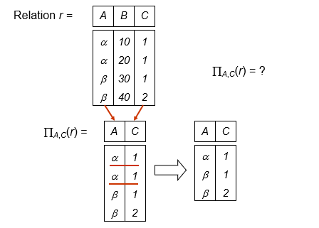{ width="500" }
<figcaption>Example</figcaption>
</figure>


### Union

Notation: $r \cup s$, where $r$ and $s$ are relations with the same schema.

Defined as:

\[
    r \cup s = \{t|t\in r \lor t\in s\}
\]

Eg.

<figure markdown="span">
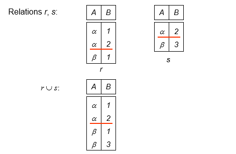{ width="500" }
<figcaption>Example</figcaption>
</figure>


### set difference

Notation: $r - s$, where $r$ and $s$ are relations with the same schema.

Defined as:

\[
    r - s = \{t|t\in r \land t\notin s\}
\]

set difference must be taken between two compatible relations.

- $r$ and $s$ must have the same arity
- Attribute domains must be compatible

Eg.

<figure markdown="span">
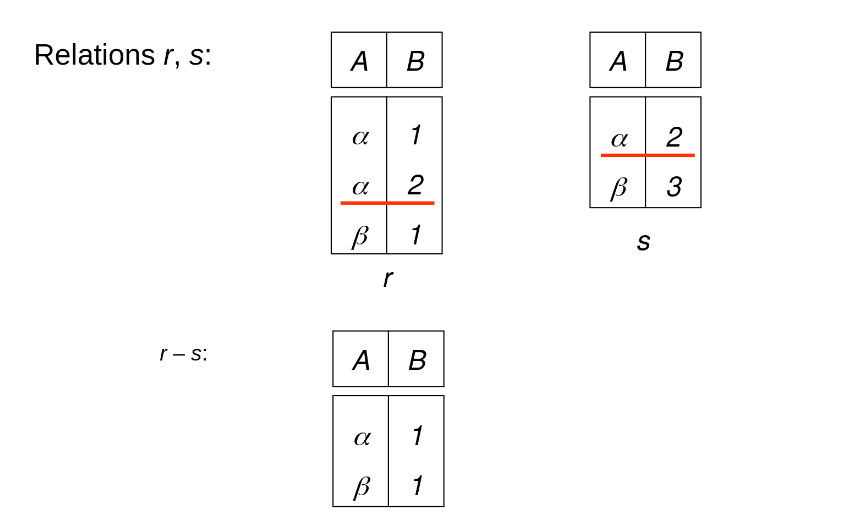{ width="500" }
<figcaption>Example</figcaption>
</figure>

### Cartesian product

Notation:$r \times s$

Defined as:

\[
    r \times s \{ \{ t q \} |t\in r \land q\in s\}
\]

- Assume that attributes of $r$ and $s$ are disjoint (i.e.,R \cap S = \emptyset)

- If attributes of $r(R)$ and $s(S)$ are not disjoint, then renaming for attributes must be used.

Eg.

<figure markdown="span">
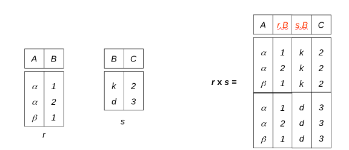{ width="500" }
<figcaption>Example</figcaption>
</figure>


### Rename

Allow us to rename the attributes of a relation include the name of the relation itself.

used as

\[
    \rho_{x(A_1,A_2,\ldots,A_n)}(r)    
\]

which means rename the relation $r$ as $x$ and rename the attributes' names of the relation  as $A_1,A_2,\ldots,A_n$

### Exercise

For a Banking example,we have following relations:

- branch(branch-name, branch-city, assets) 
- customer(customer-name, customer-street, customer-city) 
- account(account-number, branch-name, balance) 
- loan(loan-number, branch-name, amount) 
- depositor(customer-name, account-number) 
- borrower(customer-name, loan-number) 

<figure markdown="span">
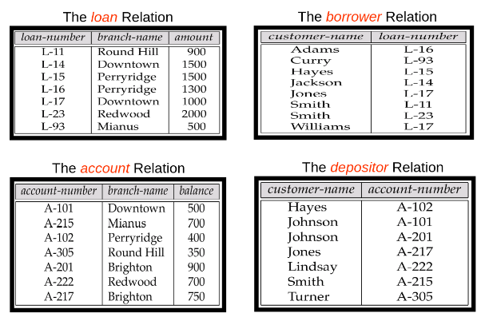{ width="500" }
<figcaption>instance</figcaption>
</figure>

<figure markdown="span">
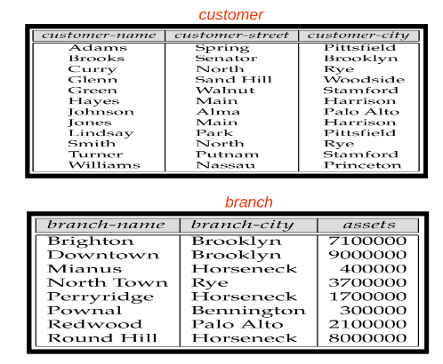{ width="500" }
<figcaption>instance</figcaption>
</figure>

- Find the names of all customers who have an account at the Perryridge branch.

we have following queries:


\[
    \Pi_{customer-name}(\sigma_{branch-name='Perryridge'}(\sigma_{borrower.loan-number=loan.loan-number}(borrower \times loan)))
\]

and 

\[
    \Pi_{customer-name}(\sigma_{borrower.loan-number=loan.loan-number}(borrower \times \sigma_{branch-name='Perryridge'}(loan)))
\]

query 2 is better because it reduced the size of Cartesian product.

- Find the names of all customers who have loans at the Perryridge branch but do not have an account at any branch of the bank. 

Just use the result above and do a set difference operation.

\[
    result- \Pi_{customer-name}(depositor)
\]

- Find the largest account balance (i.e., self-comparison)
> 这个例子很好的揭示了rename操作是必要的

- Step 1： Rename account relation as $d$
- Step 2: Find the relation including all balances except the largest one
- Finally, find the largest balance in the relation

\[
    \Pi_{balance}(account)-\Pi_{account.balance}(\sigma_{account.balance>d.balance}(account \times \rho_d(account)))
\]

例如一个(4x1)表其中含有1,2,3,4;那么Cartesian product之后会得到(16x2)的表，上面减号右边的表达式会取出例如[1,2],[1,3],[1,4];[2,3]...[3,4]这样的表，然后再投影到account balance上就得到了不包含最大值的所有项，然后进行set difference就OK了

## Additional Relation-algebra Operations

Although using the six fundamental operations is enough for any query requirements,the additional operations simplify common queries.

Remember,the additional operations do not add any power to the relational algebra.

### Set Intersection

Notation: $r \cap s$

Defined as:

\[
    r \cap s = \{ t | t \in r \land t \in s\}
\]

requirements are same as set difference since 

\[
    r \cap s = r-(r-s)
\]

<figure markdown="span">
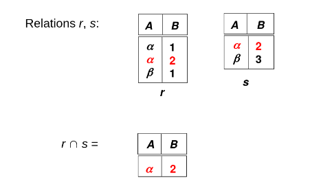{ width="500" }
<figcaption>instance</figcaption>
</figure>

### Natural join

Notation: $r \bowtie s$

Example: R=(A,B,C,D),S=(B,D,E)

- Result schema of the natural-join of $r$ and $s$ = (A, B, C, D, E) 

- $r \bowtie s= \Pi_{r.A,r.B,r.C,r.D,s.E}(\sigma_{r.B=s.B \land r.D=s.D}(r \times s))$

<figure markdown="span">
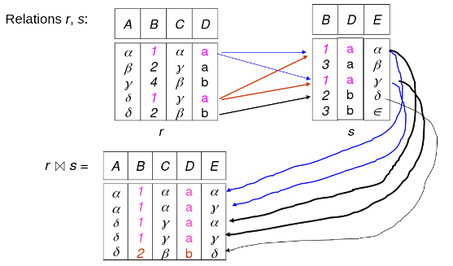{ width="500" }
<figcaption>instance</figcaption>
</figure>

#### Theta Join Operation

Notation: $r \bowtie_\theta s$ where $\theta is the predicate on attributes in the schema$

Theta join:  $r \bowtie_\theta s= \sigma_theta(r \times s)$


### Division

Division operation suited to queries that include the phase "for all"

与算数一样，除法就是乘法的逆运算

Notation: $r \div s$

assume R and S  are relation schemas for relation $r$ and $s$

\[
    r \div s = t, t \in \Pi_{R-S} \land  \forall u \in s ,tu 
    \in r
\]

即剩下的$t$必须在原relation中与s中所有元素都有元组的组合

Eg

<figure markdown="span">
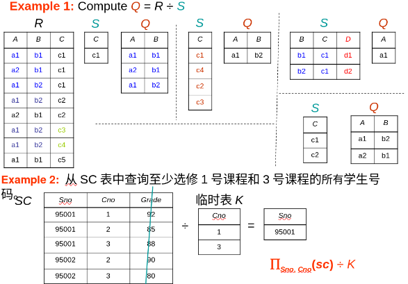{ width="500" }
<figcaption>instance</figcaption>
</figure>

- Find all customers who have an account from at least the “Downtown” and the “Uptown” branches. 

\[
\Pi_{customer-name,branch-name}(depositor \bowtie account) \div \rho_{temp}(branch-name)(\{('downtown'),('uptown')\})
\]


### Assignment

The assignment operation ($\leftarrow$) provides a convenient way to express complex queries. 


## Extended Relational-Algebra Operations 

### Generalized Projection
Extends the projection operation by allowing arithmetic functions to be used in the projection list. 

\[
\Pi_{F_1,F_2,\ldots,F_n}(E)
\]

where $E$ is any relational-algebra expression,and each of $F_1,F_2,\ldots,F_n$ are arithmetic expressions involving constants and attruibutes in the schema of E


Eg.
Given a relation credit-info(customer-name, limit, credit_balance),  find how much more each person can spend:  

\[
    \Pi_{customer-name,limit-credit\_balanced}(Credit-info)
\]


### Aggregate Functions

Aggregation function takes a collection of values and returns a single value as a result. 

- avg: average value 
- min: minimum value 
- max: maximum value 
- sum: sum of values 
- count: number of values 


\[
    _{G_1,\ldots,G_n}g_{F_1(A_1),\ldots,F_n(A_n)}(E)
\]

where $E$ is any relational-algebra expression, G1, G2 …, Gn is a list of attributes on which to group (can be empty), each Fi is an  aggregate function, and each Ai is an attribute name. 

即可以分组进行

<figure markdown="span">
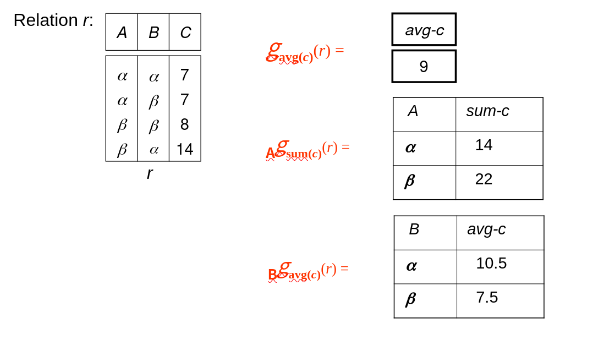{ width="500" }
<figcaption>instance</figcaption>
</figure>

## Modification of the Database

### Deletion
A delete request is expressed similarly to a query, except instead of displaying tuples to the user, the selected tuples are removed from the database. 


It can delete only whole tuples; cannot delete values on some  particular attributes.  

A deletion is expressed in relational algebra by: 

\[
    r \leftarrow r-E
\] 

where r is a relation and E is a relational algebra query. 

### Inserting

To insert data into a relation, we either: 
- Specify a tuple to be inserted. 
- Write a query whose result is a set of tuples to be inserted. 

In relational algebra, an insertion is expressed by: 

\[
				r \leftarrow  r  \cup  E 
\]

where r is a relation and E is a relational algebra expression. 

The insertion of a single tuple is expressed by letting E be a constant relation containing one tuple. 

### Updating

A mechanism to change a value in a tuple without charging all  values in the tuple. 

Use the *generalized projection* operator to do this task 

\[
				r \leftarrow \Pi_{F1, F2,\ldots, Fn}(r) 
\]

where each $F_i$ is either the $i$th attribute of $r$, if the $i$th attribute is not updated, or, if the attribute is to be updated $F_i$  is an expression, involving only constants and the attributes of $r$, which gives the new value for the attribute

