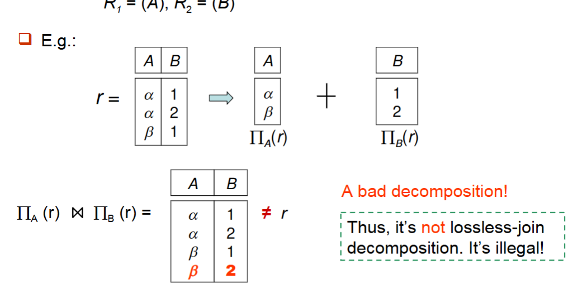

# Relational Datavase design

## First Normal Form

!!!Definition
     A relational schema R is infirst normal form(1NF)if the domains of all attributes of R are atomic. 


第一范式（First Normal Form，简称1NF）是数据库规范化过程中的基本范式，也是其他所有高级范式的基础。一个关系模式满足第一范式需要符合以下条件：

-  **原子性**：表中的每个属性（列）必须是不可再分的原子值，不允许有复合值或多值属性。
-  **每个关系有一个主键**：每个关系（表）必须有一个主键，用于唯一标识表中的每一行数据。
-  **每个属性只包含单一值**：表中的每个单元格只能包含一个值，不允许有集合、数组或其他多值类型。


不符合第一范式的表：

| 学生ID | 学生姓名 | 课程       |
|-------|---------|------------|
| 1     | 张三     | 数学, 物理   |
| 2     | 李四     | 语文, 历史, 地理 |

符合第一范式的表：

| 学生ID | 学生姓名 | 课程  |
|-------|---------|------|
| 1     | 张三     | 数学  |
| 1     | 张三     | 物理  |
| 2     | 李四     | 语文  |
| 2     | 李四     | 历史  |
| 2     | 李四     | 地理  |

!!!eg "How to deal with non-atomic values"
    - 复合属性：使用多个单独的属性来代替复合值。

    - 多值属性：使用多个单独的属性来代替多值属性。或者使用一个单独的表，或者使用single field来表示多值属性。

    例如：

    | 学生ID | 学生姓名 | 课程  |
    |-------|---------|------|
    | 1     | 张三     | 数学  |
    | 1     | 张三     | 物理  |
    | 2     | 李四     | 语文  |
    | 2     | 李四     | 历史  |
    | 2     | 李四     | 地理  |

    可以将课程列分解为两个单独的列：

    | 学生ID | 学生姓名 | 课程1 | 课程2 |
    |-------|---------|------|------|
    | 1     | 张三     | 数学  | 物理  |
    | 2     | 李四     | 语文  | 历史  |
    | 2     | 李四     | 地理  |

    也可以使用一个单独的表来表示多值属性：

    | 学生ID | 课程  |
    |-------|------|
    | 1     | 数学  |
    | 1     | 物理  |
    | 2     | 语文  |

    也可以使用一个新的属性来表示多值属性，合并成同一个字段，但是这种方式实际上在技术上仍然违反了1NF：

    | 学生ID | 学生姓名 | 课程表|
    |-------|---------|------|
    | 1     | 张三     | 数学, 物理  |
    | 2     | 李四     | 语文, 历史, 地理  |


一个域中的元素是否是原子的，取决于它们在关系中的使用方式。

!!!eg
    字符串一般来说会被认为是原子的；

    但是如果每个学生被机遇roll number，形如'CS0012'，'EE1127'等，如果前缀被挑选出来，用于标识学生所在的系，那么这个域的元素就不是原子的。

    但是这样做是不好的：这导致信息被编码在应用程序中，而不是在数据库中。

## Pitfalls in Relational Database Design

关系数据库要求我们寻找一个好的schema，对于坏的schema，会出现以下问题：

- 数据冗余
- 更新异常
- 插入异常
- 删除异常
- 表示信息的能力下降


!!!example "一个设计不良的表"
    | 学生ID | 学生姓名 | 系名 | 系主任 | 课程编号 | 课程名称 | 成绩 |
    |-------|---------|-----|-------|---------|---------|-----|
    | 101   | 张三     | 计算机系 | 王教授 | CS101 | 数据库原理 | 85 |
    | 101   | 张三     | 计算机系 | 王教授 | CS102 | 计算机网络 | 92 |
    | 102   | 李四     | 物理系   | 刘教授 | PH101 | 力学     | 78 |
    | 103   | 王五     | 计算机系 | 王教授 | CS101 | 数据库原理 | 91 |

    这个表存在的问题：
    
    - **冗余**：系名和系主任信息在每个学生的多条记录中重复
    - **更新异常**：如果系主任变更，需要更新多行记录
    - **删除异常**：如果删除所有选修某课程的学生记录，课程信息也会丢失
    - **插入异常**：无法添加尚未选课的新生，因为成绩字段无法填写

1. **缺乏适当的范式化**：未能将表分解为合适的范式，导致上述异常问题

2. **过度范式化**：将表分解得过于细碎，导致需要大量连接操作，影响查询性能

3. **不恰当的主键选择**：
    - 使用不稳定的业务属性作为主键
    - 使用过于复杂的复合主键
    - 没有为表定义适当的主键

4. **糟糕的命名约定**：
    - 表名和列名不清晰
    - 不一致的命名风格
    - 使用保留字作为名称

5. **未恰当使用索引**：
    - 索引不足，导致查询性能差
    - 索引过多，影响数据修改操作的性能

6. **忽视数据完整性约束**：
    - 缺少必要的外键约束
    - 缺少检查约束或触发器来维护复杂的数据规则

7. **不考虑数据增长**：
    - 设计未考虑到数据随时间增长的需求
    - 表结构不灵活，难以扩展


### Decomposition

一个调整schema的方法叫decomposition，它将一个关系分解为多个关系。

例如将r(ABCD)分解为r1(AB)和r2(BCD)

**要求1**

如果$R_1$和$R_2$的是由$R$通过decomposition得到的，那么$R_1$和$R_2$的属性并集是$R$的属性

\[
    R_1 \cup R_2 = R
\]

**要求2**

无损连接分解(lossless join decomposition)即，对于所有可能的关系$r \in R$，有

\[
    \pi_{R_1}(r) \bowtie \pi_{R_2}(r) = r
\]

例如$R=(A,B),R_1=(A),R_2=(B)$，那么

<figure markdown="span">
{ width="60%" }
</figure>
>没有共同属性时，natural join相当于笛卡尔积

这种分解是non-lossless的，因为$R_1(r) \bowtie R_2(r) \neq r$

总的来说，无损分解要求子关系是原关系的投影，并且子关系通过自然连接可以恢复原关系。

通过decomposition，可以去除冗余。

## Functional Dependencies

!!!Definition
    Let $R$ be a relation schema,$\alpha$ and $\beta$ be attributes of $R$.

    The functional dependency 
    $\alpha \rightarrow \beta$ holds on $R$ if and only if for any legal relations $r(R)$, whenever any two tuples $t_1$ and $t_2$ of $r$ agree on the attributes $\alpha$, they also agree on the attributes $\beta$, i.e., 

    \[
        t_1[\alpha] = t_2[\alpha] \Rightarrow t_1[\beta] = t_2[\beta]
    \]


简单来说，功能依赖$\alpha \rightarrow \beta$表示：如果我们知道$\alpha$的值，就能唯一确定$\beta$的值。

考虑一个学生选课关系：StudentCourse(学号, 姓名, 年龄, 课程号, 成绩, 学分)

在这个关系中可能存在以下功能依赖：

- 学号 $\rightarrow$ 姓名, 年龄
- 学号, 课程号 $\rightarrow$ 成绩
- 课程号 $\rightarrow$ 学分

!!!key-point "Functional dependency vs. key"
    - A functional dependency is a generalization of the notion of a key.

    - $K$ is a superkey of $R$ if and only if $K \rightarrow R$

    - $K$ is a candidate key of $R$ if and only if $K \rightarrow R$ and for no $\alpha \subset K$, $\alpha \rightarrow R$

    - Functional dependencies allow us to express constraints that cannot be expressed using keys. 


### The use of functional dependencies

We can use  functional dependencies to: 

- Test relations to see if they are legal under a given set of functional dependencies $F$.
> 如果r是R的合法关系，那么称r满足F(r satisfies F)。

例如 $r$ 的表如下

|A|B|C|D|
|---|---|---|---|
|a1|b1|c1|d1|
|a1|b2|c1|d2|
|a2|b2|c2|d2|
|a2|b3|c2|d3|
|a3|b3|c2|d4|


那么F={A $\rightarrow$ C, AB $\rightarrow$ D(也可以写为(A,B) $\rightarrow$ D),ABC $\rightarrow$ D}

但是A $\rightarrow$ B不成立;

- Specify constraints(F) on the set of legal relations--schema
> 我们说F在R上成立(F holds on R) 如果对于所有可能的合法关系r(R),r满足F。

在上面那个例子中，我们看到了一个合法的关系，但是它满足F，但是不能仅仅通过一个关系来确定。

容易判别一个r是否满足给定的F;不易判别F是否在R上成立。不能仅由某个r推断出F。R上的函数依赖F, 通常由定义R的语义决定。

### Functional dependency types

1. 平凡的功能依赖(trivial functional dependency)：如果$Y \subseteq X$，那么$X \rightarrow Y$是平凡的(trivial)。例如：$(学号, 姓名) \rightarrow 学号$。

- 非平凡的功能依赖(non-trivial functional dependency)：如果$Y \not\subseteq X$，那么$X \rightarrow Y$是非平凡的(non-trivial)。例如：$学号 \rightarrow 姓名$。

- 完全功能依赖(fully functional dependency)：如果$X \rightarrow Y$，且对于$X$的任何真子集$X'$，都不存在$X' \rightarrow Y$，则称$Y$完全功能依赖于$X$。

- 部分功能依赖(partial functional dependency)：如果$X \rightarrow Y$，但存在$X$的真子集$X'$，使得$X' \rightarrow Y$，则称$Y$部分功能依赖于$X$。


### Armstrong's axioms

Armstrong公理是一组用于推导功能依赖的规则：

1. **自反律** (reflexivity)：如果$Y \subseteq X$，则$X \rightarrow Y$（平凡依赖）

-  **增广律** (augmentation)：如果$X \rightarrow Y$，则$XZ \rightarrow YZ$,也有$XZ \rightarrow Y$（对于任意属性集$Z$）

-  **传递律** (transitivity)：如果$X \rightarrow Y$且$Y \rightarrow Z$，则$X \rightarrow Z$


!!!Note
    以上三条定律是

    - Sound：从Armstrong公理推导出的所有功能依赖都是正确的。包对的。
    - Complete：Armstrong公理可以推导出所有可能的功能依赖。完备的。


从Armstrong公理可以推导出以下规则：

1. **合并规则** (union rule)：如果$X \rightarrow Y$且$X \rightarrow Z$，则$X \rightarrow YZ$

!!!Proof
    $X \rightarrow Y$,则两边添加$X$，得到$XX \rightarrow XY$，即$X \rightarrow XY$

    同理，$X \rightarrow Z$，则两边添加$Y$，得到$XY \rightarrow YZ$，由传递律推导出$X \rightarrow YZ$


2. **分解规则** (decomposition rule)：如果$X \rightarrow YZ$，则$X \rightarrow Y$且$X \rightarrow Z$ 

!!!Proof
    $YZ \rightarrow Y$，且$YZ \rightarrow Z$，由传递律推导出$X \rightarrow Y$和$X \rightarrow Z$


- **伪传递规则** (pseudo-transitivity rule)：如果$X \rightarrow Y$且$WY \rightarrow Z$，则$XW \rightarrow Z$

!!!Proof
    $X \rightarrow Y$，则$XW \rightarrow YW$，由传递律推导出$XW \rightarrow Z$


### Closure of a set of functional dependencies

给定一组功能依赖$F$，我们可以使用Armstrong公理推导出所有可能的功能依赖，这个集合称为$F$的闭包，记作$F^+$。


!!!info "How to find $F^+$"
    repeat:

    For each functional dependency $f \in F^+$

    - Apply reflexivity and augmentation rules on $f$
    
    - Add the resulting functional dependencies to $F^+$

    - For each pair of functional dependencies $f_1$ and $f_2$ in $F^+$

    - If $f_1$ and $f_2$ can be combined using transitivity
    
    - Then add the resulting functional dependency to $F^+$
    
    Until $F^+$ does not change any further 
    


### Attribute closure


如何测试属性A是不是R的一个superkey?

- 找到$F^+$
- 检查$A \rightarrow B_i \in F^+$
- 如果$\bigcup B_i = R$，则A是superkey

但是$F^+$很难计算，所以需要使用属性闭包。直接计算能被$A$属性确定的属性集合。

!!!Definition
    对于属性集$X$，其属性闭包$X^+$是所有被$X$函数确定的属性的集合：

    \[
        X^+ = \{A | X \rightarrow A \ is \ in \ F^+ \}
    \]


!!!example
    给定关系R(A,B,C,D,E)和功能依赖集F = {A → BC, CD → E, B → D, E → A}
    
    求属性集{A}的闭包：
    
    1. 初始：{A}+ = {A}
    2. 使用A → BC：{A}+ = {A,B,C}
    3. 使用B → D：{A}+ = {A,B,C,D}
    4. 使用CD → E：{A}+ = {A,B,C,D,E}
    
    因此{A}+ = {A,B,C,D,E}
    
    所以A是superkey。


!!!info "How to find $A^+$?"
    result = A
    while (changes to result):
        for each functional dependency f in F:
            if f.left subset of result:
                result = result union f.right
    
    return result
    

    使用属性闭包可以避免反复使用公理寻找$F^+$。


There are three kind uses if the atrribute set closure:

- Test if an attribute is a superkey,查看$A^+$是否等于R
- Testing functional dependencies,查看$X \rightarrow Y$是否在$F^+$中，只需要查看$Y \subseteq X^+$
- Computing closure of F,计算$F^+$，对于每个属性集$X$，计算$X^+$，对于每个$Y \subseteq X^+$，$X \rightarrow Y$在$F^+$中,输出所有的$X \rightarrow Y$组成$F^+$

### Canonical cover

DBMS should always check to ensure not violate any Functional Dependency (FD) in F. 

!!!Definition
    一个关系模式$R$的正则覆盖(canonical cover)是$F$的一个最小超集，满足：

    - $F$中的所有函数依赖(FD)都包含在$F_c$中
    - $F_c$中的所有函数依赖都满足$F$中的所有函数依赖
    - $F_c$中左边是唯一的
    - 对于$FD \in F_c$，$FD$不包含无关属性(Extraneous attribute)

将F中的多余属性去掉就得到F的正则覆盖。

对于多余属性，有三种情况

- FD可从其它FD推导出

Eg：

\[
    F=\{A \rightarrow B, B \rightarrow C, A \rightarrow C\}
\]

$A \rightarrow C$可从$A \rightarrow B$和$B \rightarrow C$推导出，所以$A \rightarrow C$是多余的。

$F_c=\{A \rightarrow B, B \rightarrow C\}$

- FD中左边是多余的

Eg：

\[
    F=\{A \rightarrow B, B \rightarrow C, AC \rightarrow D\}
\]

由于从前两个可以推导出$A \rightarrow C$，所以$A \rightarrow AC \rightarrow D$,所以属性$C$是多余的。

$F_c=\{A \rightarrow B, B \rightarrow C, A \rightarrow D\}$


- FD中右边是多余的

Eg：

\[
    F=\{A \rightarrow B, B \rightarrow C, A \rightarrow CD\}
\]


$C$是多余的，因为$A \rightarrow CD$可以写为$A \rightarrow C$和$A \rightarrow D$，而$A \rightarrow C$已经可以由前两条推出$F$。

$F_c=\{A \rightarrow B, B \rightarrow C, A \rightarrow D\}$

#### Judging Extraneous Attributes


在寻找正则覆盖时，需要识别和移除多余属性。多余属性的判定可以分为以下两种情况：

对于函数依赖 $\alpha \rightarrow \beta$ 在 $F$ 中：

- **左侧多余属性**

如果属性 $A \in \alpha$，且 $F$ 逻辑上等价于 $F' = (F - \{\alpha \rightarrow \beta\}) \cup \{(\alpha - A) \rightarrow \beta\}$，则 $A$ 在 $\alpha$ 中是多余的。

也就是说，如果移除了 $A$ 后的函数依赖仍能推导出相同的约束，则 $A$ 是多余的。

**例如**：

- $\alpha = \{A\alpha'\}$，$\{A\alpha'\} \rightarrow \beta$。若 $F$ 蕴涵 $\alpha' \rightarrow \beta$，则 $\{A\alpha'\} \rightarrow \beta$ 多余，即 $A$ 多余。
- 给定 $F = \{A \rightarrow C, AB \rightarrow C\}$
  因为 $F = \{A \rightarrow C, AB \rightarrow C\}$ 逻辑上蕴涵 $A \rightarrow C$，所以 $B$ 在 $AB \rightarrow C$ 中是多余的，
  $F' = \{A \rightarrow C, A \rightarrow C\} = \{A \rightarrow C\}$

!!!info "testing"
    testing if A is extraneous in $\alpha$

    Compute $(\alpha - A)^+$ using F

    If $(\alpha - A)^+$ contains $\beta$, then A is extraneous in $\alpha$
    

    在原属性下移除A后，新的属性集能推出原来的FD，则A是多余的，因为不需要A参与左侧也能推出右侧。

- **右侧多余属性**

如果属性 $A \in \beta$，且函数依赖集 $F' = (F - \{\alpha \rightarrow \beta\}) \cup \{\alpha \rightarrow (\beta - A)\}$ 逻辑上蕴涵 $F$，则 $A$ 在 $\beta$ 中是多余的。

**例如**：

- $\beta = \{A\beta'\}$, $\alpha \rightarrow \{A\beta'\}$，有 $\{\alpha \rightarrow A, \alpha \rightarrow \beta\}$。若 $F'$ 蕴涵 $\alpha \rightarrow A$，则 $\alpha \rightarrow A$ 多余（即可用 $F'$ 代替 $F$）。
- 给定 $F = \{A \rightarrow C, AB \rightarrow CD\}$
  由于 $AB \rightarrow CD \Rightarrow \{AB \rightarrow C, AB \rightarrow D\}$，且 $AB \rightarrow C$ 可以从 $F' = \{A \rightarrow C, AB \rightarrow D\}$ 推导出，
  因此 $C$ 在 $AB \rightarrow CD$ 中是多余的。


!!!info "testing"
    testing if A is extraneous in $\beta$

    Compute $\alpha^+$ using $F'$

    where $F' = (F - \{\alpha \rightarrow \beta\}) \cup \{\alpha \rightarrow (\beta - A)\}$

    If $\alpha^+$ contains A, then A is extraneous in $\beta$

    在移除了包含可疑属性FD的新的F中，如果仍能推出A，则A是多余的。
    因为A已经蕴含在新的F中。


!!!key-point
    将包含可疑的多余属性的FD从F中去掉之后，再加上去掉多余属性的FD，得到新的F'，如果F'与F等价，则去掉的可疑属性确实是多余的。


#### Computing canonical cover

要计算函数依赖集F的规范覆盖，需要执行以下步骤：

**重复执行以下操作**：

- 使用合并规则，将$F$中形如 $\alpha_1 \rightarrow \beta_1$ 和 $\alpha_1 \rightarrow \beta_2$ 的依赖替换为 $\alpha_1 \rightarrow \beta_1\beta_2$
- 查找具有多余属性的函数依赖 $\alpha \rightarrow \beta$（多余属性可能出现在$\alpha$或$\beta$中）
- 如果发现多余属性，则从 $\alpha \rightarrow \beta$ 中删除该属性

**直到F不再变化为止**

**注意**：当某些多余属性被删除后，合并规则可能变得适用，因此需要重新应用合并规则。

## Decomposition

!!!Note "Goals of Normalization"
    judge whether a particular relation is in a good form,i.e.,

    - No redundant
    - No insert ,delete ,update anomalies

    In the case that a relationm is not in a good form,we decompose it into a set
    of relations that：

    - The decomposition is a lossless-join decomposition(无损连接分解).
    - The decomposition is dependency preservation(依赖保持).
    -Each relation Ri is in a good form(BCNF or 3NF)

### Desirable properties of a decomposition

- 子关系属性的并必须覆盖原属性
- 子关系必须是无损连接的,对于一分为二的分解，分解后的两个子模式的共同属性必须是R1或者R2
- 子关系必须保持函数依赖(Dependency preserving)

-为了高效地检查更新（确保不违反任何FD），允许在子关系$R_i$中分别进行更新验证，而无需执行它们的连接操作。

- F对$R_i$的限制是：$F_i \subseteq F^+$；$F_i$只包含$R_i$的属性。

- $(F_1 \cup F_2 \cup ... \cup F_n)^+ = F^+$，其中$F_i$是包含在$F^+$中且只包含$R_i$属性的依赖集。
  

- 子关系必须满足一定的范式.Boyce-Codd范式（BCNF）或第三范式（3NF）。


!!!example
    R(A,B,C),F={A $\rightarrow$ B,B $\rightarrow$ C}

    分解为R1(A,B),R2(B,C)

    - 无损分解验证：
    
    \[
        R1 \cap R2 = B
    \]

    而$B^+ = \{B,C\}$，所以$B$是$R_2$的Key，所以$R_1$和$R_2$是无损分解

    - 依赖保持验证：

    \[
        F1 = \{A \rightarrow B\}
    \]

    \[
        F2 = \{B \rightarrow C\}
    \]

    \[
        F1 \cup F2 = \{A \rightarrow B, B \rightarrow C\}
    \]

    \[
        (F1 \cup F2)^+ = \{A \rightarrow B, B \rightarrow C\}=F
    \]
    
    所以正确

    若是分解为R1(A,B),R2(A,C)

    则对于依赖保持，有

    \[
        F1 = \{A \rightarrow B\}
    \]
    
    \[
        F2 = \{A \rightarrow C\}
    \]

    \[
        F1 \cup F2 = \{A \rightarrow B, A \rightarrow C\} \neq F
    \]
    
    所以不正确


!!!info "tesing for Dependency Preservation"
    To check if dependency $\alpha \rightarrow \beta$ is preserved in a decomposition of 
    
    R into R1,R2,...,Rn


    initial result = $\alpha$

    while (changes to result):
        for each Ri in the decomposition:
            t= (result $\cap$ Ri)+ $\cap$ Ri
            result = result $\cup$ t

    if result contains all attributes in $\beta$,then the dependency is preserved
        
    
    即对于每个子关系Ri：取result与Ri的交集，找出当前已知属性中属于Ri的部分
    
    计算这些属性在Ri关系上的闭包(使用Ri上有效的函数依赖)再与Ri取交集，确保结果仍在Ri的属性范围内
    
    将计算结果并入result集合

    apply this process to each dependency in F


## Boyce-Codd Normal Form

!!!Definition
    关系模式$R$在功能依赖集$F$下满足BCNF(Boyce-Codd Normal Form)，如果对于$F^+$中所有形如$\alpha \rightarrow \beta$的功能依赖，其中$\alpha \subseteq R$且$\beta \subseteq R$，至少满足以下条件之一：

    - $\alpha \rightarrow \beta$是平凡的（即$\beta \subseteq \alpha$）
    - 或
    - $\alpha$是$R$的超键（即$R \subseteq \alpha^+$，$\alpha \rightarrow R$）

    简单来说，BCNF要求所有非平凡的功能依赖，其左侧必须是超键。这个范式比第一范式更加严格，能够消除更多的数据冗余和异常问题。


!!!example
    R(A,B,C),F={A $\rightarrow$ B,B $\rightarrow$ C}，Key={A}

    R不是BCNF，因为$B \rightarrow C$的左侧不是超键，也不是平凡的。

    R分解为R1(A,B),R2(B,C)

    - 无损分解验证和依赖保持验证成立；

    - 此时R1和R2都是BCNF

### Testing for BCNF

要检查一个非平凡依赖 $\alpha \rightarrow \beta$ 是否违反BCNF：

- 计算 $\alpha^+$（属性 $\alpha$ 的闭包）
- 验证 $\alpha^+$ 是否包含关系 $R$ 的所有属性，即 $\alpha$ 是否是 $R$ 的超键

简化测试：要检查关系模式 $R$ 是否满足BCNF，只需检查给定集合 $F$ 中的依赖是否违反BCNF，而不必检查 $F^+$ 中的所有依赖。

- 如果 $F$ 中没有依赖违反BCNF，那么 $F^+$ 中的依赖也不会违反BCNF

> $F^+$ 是由Armstrong的3个公理从 $F$ 推出的，而任何公理都不会使函数依赖(FD)左边变小(拆分)，故如果 $F$ 中没有违反BCNF的FD(即左边是superkey)，则 $F^+$ 中也不会。

#### Warning

然而，仅使用 $F$ 来测试BCNF可能在测试分解关系 $R_i$ 时出现错误。

例如，考虑 $R(A, B, C, D)$，函数依赖 $F = \{A \rightarrow B, B \rightarrow C\}$

- $R$ 是否满足BCNF？候选键是什么？
- 将 $R$ 分解为 $R_1(A, B)$ 和 $R_2(A, C, D)$
- $F$ 中没有仅包含 $(A, C, D)$ 属性的函数依赖，因此可能误认为 $R_2$ 满足BCNF
- 实际上，$F^+$ 中的依赖 $A \rightarrow C$ 表明 $R_2$ 不满足BCNF，因为$A$不是$R_2$的超键，它不能确定$D$

> 可在 $F$ 下判别 $R$ 是否违反BCNF，但必须在 $F^+$ 下判别 $R$ 的分解式是否违反BCNF。


#### Algorithm for BCNF Decomposition


result := {R};

done := false;

compute F+;

while (not done) do

if (there is a schema Ri in result that is not in BCNF)

then begin

let $\alpha \rightarrow \beta$ be a nontrivial functional 

dependency that holds on Ri such

that $\alpha \rightarrow Ri$ is not in F+, and $\alpha \cap \beta = 

\emptyset$;

result := (result - Ri)  $\cup$ ($\alpha, \beta$)  $\cup$ (Ri - $\beta$);

end
    
else done := true;


> 注：最终，每个子模式都满足BCNF，且分解是无损连接的。

说明：

- 当发现结果集中存在不满足BCNF的关系模式Ri时，这意味着Ri中存在非平凡函数依赖$\alpha \rightarrow \beta$，且$\alpha$不是键
- 将Ri分解为两个子模式：
  - Ri1 = ($\alpha, \beta$) 
  - Ri2 = (Ri - $\beta$, $\alpha$)
  - 其中$\alpha$是Ri1和Ri2的共同属性


!!!example "BCNF分解实例"
    考虑关系模式：
    
    R = (branch-name, branch-city, assets, customer-name, loan-number, amount)
    
    函数依赖集：
    
    F = {branch-name $\rightarrow$ branch-city assets, 
         loan-number $\rightarrow$ amount branch-name}
    
    候选键是 {loan-number, customer-name}
    
    **分解过程**：
    
    1. 首先检查R是否满足BCNF
        - 函数依赖 branch-name $\rightarrow$ branch-city assets 中，branch-name 不是超键
        - 所以R违反BCNF
        
    2. 使用算法进行分解：
        - 选择依赖 branch-name $\rightarrow$ branch-city assets
        - $\alpha$ = branch-name, $\beta$ = {branch-city assets}
        - 得到 R1= (branch-name, branch-city, assets)
        - 和 R2 = (branch-name, customer-name, loan-number, amount)
    
    3. 检查R1是否满足BCNF
        - R1中唯一的非平凡依赖是 branch-name $\rightarrow$ branch-city assets
        - branch-name 是 R1 的候选键
        - 所以R1满足BCNF
    
    4. 检查R2是否满足BCNF
        - R2中有依赖 loan-number $\rightarrow$ amount branch-name
        - loan-number 不是 R2 的超键（不能决定customer-name）
        - 所以R2违反BCNF
    
    5. 继续分解R2：
        - 选择依赖 loan-number $\rightarrow$ amount branch-name
        - 得到 R3 = (loan-number, amount, branch-name)
        - 和 R4 = (loan-number, customer-name)
    
    6. 检查R3和R4是否满足BCNF
        - R3满足BCNF（loan-number是R3的候选键）
        - R4满足BCNF（{loan-number, customer-name}是R4的候选键）
    
    **最终分解**：

    - R1 = (branch-name, branch-city, assets)
    - R3 = (loan-number, branch-name, amount)
    - R4 = (customer-name, loan-number)
    
    所有最终的关系模式都满足BCNF，且整个分解是无损连接的。


## Third Normal Form

!!!quote "Motivation"
    实际生活中，存在这样的情况：
    
    - Decompose into BCNF is not dependency preserving
    - But efficient checking for FD violation on updates is important

!!!solution
    Use 3NF, which is weaker than BCNF, but 

    - allows some redundancy
    - But FDs can be checked on individual relations without computing a join
    - There is always a lossless-join, dependency-preserving decomposition into 3NF. 


第三范式（3NF）是比BCNF稍弱的范式，它允许某些非平凡依赖的左侧不是超键，但要求右侧属性必须是主键的一部分。

!!!Definition
    关系模式 $R$ 在函数依赖集 $F$ 下满足第三范式（3NF），如果对于 $F^+$ 中所有形如 $\alpha \rightarrow \beta$ 的函数依赖，至少满足以下条件之一：

    - $\alpha \rightarrow \beta$ 是平凡的（即 $\beta \subseteq \alpha$）
    - 或者 $\alpha$ 是 $R$ 的超键
    - 或者 $\beta - \alpha$ 中的每个属性都是 $R$ 的某个候选键的成员,如果$\beta$中没有$\alpha$的属性，则$\beta$是候选键的一部分
    - Note: 每个属性可能属于不同的候选键

    任何BCNF都是3NF，但3NF不一定是BCNF


    *Third condition is a minimal relaxation of BCNF to ensure dependency preservation* 


第三范式的特点：

- 比BCNF更容易实现，但允许一定程度的冗余
- 总能找到一个无损连接且保持依赖的分解
- 实际应用中，当BCNF分解导致依赖不保持时，会采用3NF

!!!Example
    R(J,K,L),F={JK $\rightarrow$ L,L $\rightarrow$ K}

    有两个candidate key:JK,JL

    那么R是3NF，因为在第一个FD中，JK是superkey，在第二个FD中，K是candidate key的一部分

    但是R不是BCNF，因为L $\rightarrow$ K，L不是superkey

    例如J是student，K是course，L是teacher；

    一门课有多个教师，一个教师上一门课，一门课多个学生选；

    |J|L|K|
    |--|--|--|
    |j1|l1|k1|
    |j2|l1|k1|
    |j3|l1|k1|
    |null|l2|k2|

    A schema that is in 3NF but not in BCNF has the problems of repetition of information (e.g., the relationship l1, k1), and may need to use null values (e.g., to represent the relationship l2, k2, where there is no corresponding value for J).  

### Testing for 3NF

- 只需检查依赖集 $F$ 中的函数依赖，无需检查 $F^+$ 中的所有函数依赖。

- 使用 **属性闭包** 来检查每个依赖 $\alpha \rightarrow \beta$，以判断 $\alpha$ 是否为 **超键** 。

- 当 $\alpha$ 不是超键时
    - 需要验证 $\beta$ 中的每个属性是否包含在关系 $R$ 的某个候选键中。
    - 这个测试相对昂贵，因为涉及到查找所有候选键。
    - 测试关系是否满足$3NF$已被证明是 NP-hard。
    - 有趣的是，将关系分解为第三范式（稍后会描述）可以在多项式时间内完成。

注：第三范式比BCNF稍弱，但可以保证依赖保持性，这在实际应用中非常重要。


### 3NF Decomposition Algorithm

3NF分解算法是一种能够保证无损连接和依赖保持的分解方法，该算法可以在多项式时间内完成。

#### Algorithm steps

1. 找到函数依赖集$F$的正则覆盖$F_c$

2. 为$F_c$中的每个函数依赖$\alpha \rightarrow \beta$创建一个关系模式$R_i = (\alpha, \beta)$

3. 如果没有任何关系模式包含原关系的候选键，则添加一个包含候选键的关系模式

4. 消除冗余的关系模式（如果有）

```
Let Fc be a canonical cover for F;
i := 0;
for each functional dependency α → β in Fc do
    if none of the schemas Rj, 1 ≤ j ≤ i contains αβ
        then begin
            i := i + 1;
            Ri := (α, β)
        end
if none of the schemas Rj, 1 ≤ j ≤ i contains a candidate key for R then
    begin
        i := i + 1;
        Ri := any candidate key for R;
    end
return (R1, R2, ..., Ri)
```

这个算法的特点：

- 第2步确保了依赖保持性，因为$F_c$中的每个函数依赖都被包含在某个子模式中
- 第3步确保了无损连接性，因为至少有一个子模式包含原关系的候选键
- 生成的所有关系模式都满足3NF

!!!example "3NF分解示例"
    原始关系模式
    ```
    Banker-info-schema = (branch-name, customer-name, banker-name, office-number)
    ```

    功能依赖集
    ```
    F = {banker-name → branch-name office-number, 
        customer-name branch-name → banker-name}
    ```

    候选键
    ```
    {customer-name, branch-name}
    ```

    3NF分解过程

    根据3NF分解算法，我们需要对关系模式进行分解：

    1. 首先确认F即为规范覆盖Fc（没有多余属性）
    2. 为每个功能依赖创建关系模式：
        - 处理 banker-name → branch-name office-number：
            ```
            Banker-office-schema = (banker-name, branch-name, office-number)
            ```
        - 处理 customer-name branch-name → banker-name：
            ```
            Banker-schema = (customer-name, branch-name, banker-name)
            ```
    3. 检查是否包含候选键：Banker-schema包含了原关系的候选键(customer-name, branch-name)
    4. 检查冗余关系：两个模式都不冗余

    ```
    Banker-office-schema = (banker-name, branch-name, office-number)
    Banker-schema = (customer-name, branch-name, banker-name)
    ```

    这个分解具有无损连接性和依赖保持性，且两个关系模式都满足第三范式。这样的分解消除了原关系中可能存在的更新、插入和删除异常问题。

    在实际银行系统中，这样的分解使得银行职员信息和客户-银行职员对应关系可以独立管理，更有效地避免了数据冗余和不一致性问题。


!!!Summary "BCNF与3NF的比较"

    | 特性 | BCNF | 3NF |
    |------|------|-----|
    | 定义 | 所有非平凡依赖的左侧必须是超键 | 所有非平凡依赖的左侧是超键，或右侧是候选键的一部分 |
    | 数据冗余 | 较少 | 可能存在一些冗余 |
    | 依赖保持 | 不保证 | 总是保证 |
    | 无损连接 | 保证 | 保证 |
    | 复杂度 | NP-complete | 多项式时间可解 |

    在实际数据库设计中：
    
    - 如果能够得到无损连接且保持依赖的BCNF分解，优先选择BCNF
    - 如果BCNF分解无法保持依赖，而效率检查很重要，则选择3NF
    - 有时也会选择混合方案：一部分关系采用BCNF，一部分采用3NF

## Multivalued Dependencies 

!!!Definition
    Let $R$ be a relation schema and let $\alpha \in R$ and $\beta \in R$, the multivalued dependency

    \[ 
        \alpha \rightarrow\rightarrow \beta 
    \]
    
    holds on $R$, if in any legal relation $r(R)$, for **all pairs** of tuples $t_1$ and $t_2$ 
    in $r$ such that $t_1[\alpha] = t_2[\alpha]$, there exist tuples $t_3$ and $t_4$ in $r$ such that:
     
    \[t_1[\alpha] = t_2[\alpha] = t_3[\alpha] = t_4[\alpha]\]
     
    \[t_3[\beta] = t_1[\beta]\]

    \[t_3[R - \alpha - \beta] = t_2[R - \alpha - \beta]\]
     
    \[t_4[\beta] = t_2[\beta]\]

    \[t_4[R - \alpha - \beta] = t_1[R - \alpha - \beta]\]

    Let $R - \alpha - \beta = Z$:
    
    \[t_3[Z] = t_2[Z]\]

    \[t_4[Z] = t_1[Z]\]

    如果$\beta \in \alpha$，则$\alpha \rightarrow\rightarrow \beta$是平凡的

    如果$\alpha \cup \beta = R$，则$\alpha \rightarrow\rightarrow \beta$是平凡的

!!!Example
    Let R be a relation schema with a set of attributes that are partitioned into 3 nonempty subsets. 
    
    \[Y, Z, W\]
    
    We say that $Y \rightarrow\rightarrow Z$ (Y multi-determines Z) if and only if for all possible relations r(R) $t_1=(y1, z1, w1) \in r$ and $t_2=(y1, z2, w2) \in r$ 
    
    then $t_3=(y1, z1, w2) \in r$ and $t_4=(y1, z2, w1) \in r$ 
    
    Note that since the behavior of Z and W are identical, it follows that $Y \rightarrow\rightarrow Z$ if $Y \rightarrow\rightarrow W$. 
    
多值依赖可以这样理解：当一个属性A($\alpha$)确定了另一组属性B($\beta$)的一组值，并且这组值 **独立于** 其他属性C($R-\alpha-\beta$)时，我们说A多值依赖于B（写作A→→B）。

简单来说："如果我知道A的值，那么B的值集合与C的值集合是相互独立的组合"。


想象一个学生选课表：

- 每个学生可以选多门课程
- 每个学生有多个爱好
- 学生选什么课与他有什么爱好没有关系

这就形成了：

- 学生ID →→ 课程（学生ID多值依赖于课程）
- 学生ID →→ 爱好（学生ID多值依赖于爱好）


假设张三选了数学和物理两门课，他有绘画和游泳两个爱好，表中就会出现：

| 学生ID | 课程 | 爱好 |
|-------|-----|------|
| 张三 | 数学 | 绘画 |
| 张三 | 数学 | 游泳 |
| 张三 | 物理 | 绘画 |
| 张三 | 物理 | 游泳 |

注意：表中每个课程都与每个爱好组合出现了一次，这就是多值依赖导致的**数据冗余**。


因为多值依赖表示的是"独立的多对多关系"：

- 学生与课程是多对多关系
- 学生与爱好是多对多关系
- 这两种关系相互独立

当我们把独立的关系放在同一张表中，必然会产生所有可能组合，导致冗余。


将表分解为两个独立的关系：

1. 学生-课程表：(学生ID, 课程)
- 学生-爱好表：(学生ID, 爱好)

这样既减少了冗余，也反映了数据的真实语义：课程选择和爱好是两个独立的多值事实。

这就是为什么我们需要第四范式(4NF)：消除非平凡且非函数依赖的多值依赖。

## Fourth Normal Form

!!!Definition
    The closure $D^+$ of $D$ is the set of all functional and multivalued dependencies logically implied by $D$. 即D的闭包

    一个关系模式$R$在给定的函数依赖集和多值依赖集$D$下满足第四范式(4NF)，当且仅当对于所有在$D^+$中的多值依赖$\alpha \rightarrow\rightarrow \beta$（其中$\alpha \subseteq R$且$\beta \subseteq R$），至少满足以下条件之一：

    - **平凡依赖**：$\alpha \rightarrow\rightarrow \beta$是平凡的，意味着$\beta \subseteq \alpha$（$\beta$是$\alpha$的子集）或$\alpha \cup \beta = R$（$\alpha$和$\beta$的并集等于整个关系）
    - **超键约束**：$\alpha$是$R$的超键

- 如果一个关系满足4NF，它必然满足BCNF
- 4NF主要解决了多值依赖导致的数据冗余问题
- 4NF比BCNF更严格

以学生-课程-爱好关系为例：

| 学生ID | 课程 | 爱好 |
|-------|-----|------|
| 张三 | 数学 | 绘画 |
| 张三 | 数学 | 游泳 |
| 张三 | 物理 | 绘画 |
| 张三 | 物理 | 游泳 |

这个关系存在多值依赖：
- 学生ID →→ 课程
- 学生ID →→ 爱好

但学生ID不是该关系的超键，因此违反4NF。

将违反4NF的关系分解为满足4NF的关系：

1. 学生-课程关系：(学生ID, 课程)
- 学生-爱好关系：(学生ID, 爱好)


### Requirements for decomposition

> Restriction of MVDs

Assume $R$ is decomposed into $R_1, R_2, ..., R_n$, each $R_i$ is required to conform to 4NF. 

The restriction of $D$ to $R_i$ is the set $D_i$ consisting of :

- All functional dependencies in $D^+$ that include only attributes of $R_i$
- All multivalued dependencies of the form 

\[\alpha \rightarrow\rightarrow (\beta \cap R_i)\]

where $\alpha \subseteq R_i$ and $\alpha \rightarrow\rightarrow \beta$ is in $D^+$

所有在$D^+$中（$D$的闭包）仅包含$R_i$属性的函数依赖会被保留在$D_i$中。

例如：如果原关系有依赖$A \rightarrow B$，且$A$和$B$都在子关系$R_i$中，则$A \rightarrow B$会保留在$D_i$中。

对于$D^+$中的每个多值依赖$\alpha \rightarrow\rightarrow \beta$：

如果$\alpha$包含在$R_i$中

则$\alpha \rightarrow\rightarrow (\beta \cap R_i)$会被包含在$D_i$中

这表示在子关系上，多值依赖的右侧被"裁剪"为只包含该子关系的属性

### Algorithm for 4NF Decomposition

```
result := {R};        // 初始结果集包含原始关系R
done := false;        // 设置循环继续标志
compute D+;           // 计算依赖集D的闭包
Let Di denote the restriction of D+ to Ri  // 确定D+对每个关系的限
while (not done) {
    // 检查result中是否存在不满足4NF的关系
    if (存在关系Ri不满足4NF) {
        // 找到一个违反4NF的多值依赖
        选择非平凡多值依赖 α →→ β，使得:
            - α不是Ri的超键
            - α与β没有交集(α∩β=∅)
            
        // 分解关系Ri
        result := (result - Ri) ∪ (α, β) ∪ (Ri - β);
    }
    else {
        done := true;  // 所有关系都满足4NF，算法结束
    }
}
```

!!!Example "4NF分解示例"
    有关系模式 $R = (A, B, C, G, H, I)$
    
    函数依赖和多值依赖集：

    ```
    D = {A →→ B
         B →→ HI
         CG →→ H}
    ```

    从中也可以推导出$A \rightarrow\rightarrow H$,$A \rightarrow\rightarrow I$$
    
    $R$ 不满足4NF，因为 $A →→ B$ 中 $A$ 不是超键。
    
    **分解过程**：
    
    a) $R_1 = (A, B)$ ($R_1$ 满足4NF)
    
    b) $R_2 = (A, C, G, H, I)$ ($R_2$ 不满足4NF,将其分解为$R_3$和$R_4$)
    
    c) $R_3 = (C, G, H)$ ($R_3$ 满足4NF)
    
    d) $R_4 = (A, C, G, I)$ ($R_4$ 不满足4NF,因为$A →→ I$中$A$不是超键)
    
    e) $R_5 = (A, I)$ ($R_5$ 满足4NF)
    
    f) $R_6 = (A, C, G)$ ($R_6$ 满足4NF)
    
    最终的分解结果是：$R_1$, $R_3$, $R_5$, $R_6$，所有这些关系都满足4NF，并且分解是无损连接的。
