# Storage and File Structure

主要面临的问题有

- **Data Storage(数据存储)** ：如何高效地存储和管理数据。
- **API 应用程序接口 (SQL)** ：提供标准化的接口，支持查询、插入、删除和更新操作。
- **High Performance(高性能)** ：通过索引、缓冲管理、查询处理和优化来提升数据库性能。
- **Concurrent Control(并发控制)** ：确保多个用户同时访问数据库时的一致性和正确性。
- **Reliability(可靠性)** ：在系统故障时，保证数据的完整性和可恢复性。
- **Security(安全性)** ：通过授权和加密机制保护数据免受未授权访问。

## Overview of Physical Storage Media

### Physical Level of Databases

- **Files and Storage** : 数据库在物理层面上存储为文件，例如 `.mdf`, `.ldf`, `.ora`, `.dbf` 等。

- **Storage Media Classification** :
    - **Speed**: 数据访问速度。
    - **Cost**: 每单位数据的存储成本。
    - **Reliability**:数据在断电或系统崩溃时可能丢失。存储设备的物理故障（如 RAID 提供的容错机制）。

Storages classified by reliability:

- Volatile storage: loses contents when power is switched off, e.g., DDR2, SDR. 
- Non-volatile storage(非易失性存储器): contents persist even when power is switched off. Includes secondary and tertiary storage, as well as batter-backed up main-memory. 

Storages classified by speed: 
- Cache 
- Main-memory 
- Flash memory
- Magnetic-disk 
- Optical storage 
- Tape storage

### Hierarchy

<figure markdown="span">
{ width="400" }
<figcaption>Storage Hierarchy</figcaption>
</figure>

- Primary storage: Fastest media but volatile (cache, main memory). 

- Secondary storage (辅助存储器，联机存储器): next level in hierarchy, non-volatile, moderately fast access time ;Also called on-line storage E.g., flash memory, magnetic disks 

- Tertiary storage (三级存储器，脱机存储器): lowest level in hierarchy, non-volatile, slow access time ;also called off-line storage,E.g., magnetic tape, optical storage

### Physical Storage Media (Cont.)

#### Cache
- **Fastest and most costly form of storage**, volatile, and managed by the computer system hardware.
- **Speed**: ≤ 0.5 nanoseconds (ns, 1 ns = 10⁻⁹ seconds).
- **Size**: ~ KB to ~ MB.

#### Main Memory
- **Fast access** : 10 to 100 ns.
- **Capacity** : Generally too small (or too expensive) to store the entire database.
    - Widely used capacities: up to a few Gigabytes (1 GB = $10^9$ B).
    - Capacities have increased, and per-byte costs have decreased steadily (roughly a factor of 2 every 2–3 years).
- **Volatile** : Contents are lost during power failure or system crash.

#### Flash Memory (快闪存储器)

- Also known as **EEPROM** (Electrically Erasable Programmable Read-Only Memory, 电可擦可编程只读存储器).
- **Non-volatile** : Data survives power failures.
- **Write/Erase Limitations** :
    - Data can be written at a location only once, but the location can be erased and rewritten.
    - Supports a limited number of write/erase cycles (10K–1M).
    - Erasing must be done to an entire bank of memory.
- **Performance** :
    - Reads: Roughly as fast as main memory (< 100 ns).
    - Writes: Slower (~10 μs), and erases are even slower.
- **Cost** : Similar to main memory.
- **Usage** : Widely used in embedded devices such as digital cameras, phones, and USB keys.

#### Magnetic Disk
- **Storage** : Data is stored on spinning disks and read/written magnetically.
- **Primary medium** : Used for long-term storage, typically storing the entire database.
- **Access** :
    - Data must be moved to main memory for access and written back for storage.
    - Much slower access than main memory.
    - Direct-access: Data can be read in any order (unlike magnetic tape).
- **Capacity** :
    - Ranges up to ~1.5 TB (as of 2009).
    - Larger capacity and lower cost/byte than main memory or flash memory.
    - Growing rapidly with technology improvements (factor of 2–3 every 2 years).
- **Reliability** :
    - Survives power failures and system crashes.
    - Disk failure is rare but can destroy data.

#### Optical Storage
- **Non-volatile** : Data is read optically from a spinning disk using a laser.
- **Popular Forms** :
    - CD-ROM (640 MB).
    - DVD (4.7–17 GB).
- **Write Types** :
    - Write-once, read-many (WORM) disks (e.g., CD-R, DVD-R) for archival storage.
    - Multiple-write versions available (e.g., CD-RW, DVD-RW, DVD-RAM).
- **Performance** :
    - Reads and writes are slower than magnetic disks.
- **Juke-box Systems(自动光盘机)** :
    - Large numbers of removable disks with a few drives.
    - Mechanism for automatic loading/unloading of disks for storing large volumes of data.

#### Tape Storage

- **非易失性** ：主要用于备份（从磁盘故障中恢复）和归档数据。
- **顺序访问** ：访问速度远慢于磁盘。
- **容量** ：容量非常高（40 到 300 GB 的磁带可用）。
- **可移除** ：磁带可以从驱动器中移除，因此存储成本远低于磁盘，但驱动器价格昂贵。
- **磁带自动机 (Tape Jukebox)** ：
    - 可用于存储海量数据。
    - 容量范围从数百 TB（1 TB = $10^{12}$ 字节）到甚至 PB（1 PB = $10^{15}$ 字节）。

## Magnetic Disks

<figure markdown="span">
{ width="400" }
<figcaption>
Structure
</figcaption>
</figure>

### Disk Structure 

磁头 (Read-Write Head)

- **位置**：磁头非常接近盘片表面（几乎接触）。
- **功能**：用于读取或写入磁性编码的信息。

盘片表面 (Surface of Platter)

- **圆形磁道 (Tracks)**：
    - 盘片表面被划分为多个圆形磁道。
    - 典型硬盘每个盘片上有超过 50K–100K 条磁道。

- **扇区 (Sectors)**：
    - 每个磁道被划分为多个扇区。
    - 扇区是可以读取或写入的最小数据单位。

- **扇区大小**：通常为 512 字节。

- **每磁道的扇区数**：
    - 内圈磁道：500 到 1000 个扇区。
    - 外圈磁道：1000 到 2000 个扇区。

读/写扇区 (To Read/Write a Sector)

- **磁臂 (Disk Arm)**：
   - 磁臂移动以将磁头定位到正确的磁道上。
- **盘片旋转 (Platter Spins)**：
   - 盘片持续旋转，当扇区经过磁头下方时，数据被读取或写入。

磁头-磁盘组件 (Head-Disk Assemblies)

- **多盘片 (Multiple Disk Platters)**：
   - 单个主轴上通常有 4 到 16 个盘片。
- **磁头 (Heads)**：
   - 每个盘片对应一个磁头，所有磁头安装在一个公共磁臂上。
- **柱面 (Cylinder)**：
   - 第 i 个柱面由所有盘片的第 i 个磁道组成。

磁盘控制器 (Disk Controller)

- **功能**：
    - 作为计算机系统与磁盘驱动硬件之间的接口。
    - 接收高层次的读/写扇区命令。
    - 执行动作，例如移动磁臂到正确的磁道并实际读取或写入数据。
- **校验和 (Checksum)**：
    - 计算并附加校验和到每个扇区，以验证数据是否正确读取。
    - 如果数据损坏，存储的校验和与重新计算的校验和很可能不匹配。
- **写入验证 (Write Verification)**：
    - 写入后通过读取扇区来确保写入成功。
- **坏扇区重映射 (Bad Sector Remapping)**：
    - 将坏扇区从逻辑地址映射到预留的物理扇区。
    - 重映射信息记录在磁盘或其他非易失性存储器中。

磁盘的性能主要由以下几个方面决定：

- 转速（RPM）：盘片的旋转速度，转速越高，数据访问速度越快。
- 磁头寻道时间（Seek Time）：磁头移动到目标轨道所需的时间，寻道时间越短，数据访问速度越快。
- 数据传输率（Data Transfer Rate）：硬盘与计算机之间的数据传输速度，传输率越高，数据访问速度越快。
- 缓存（Cache）：硬盘内部的高速缓存，用于临时存储数据，提高数据传输效率。

!!!quote
    [计组关于磁盘性能的描述](../CO/wk6.md)

### Optimization of Disk-Block Access

#### Block

- **定义**：来自单个磁道的连续扇区序列。
- **数据传输**：数据在磁盘和主存之间以块为单位传输。
- **块大小**：
    - 范围从 512 字节到几千字节。
    - **小块**：需要更多的磁盘传输。
    - **大块**：可能浪费更多空间（由于部分填充的块）。
    - **典型块大小**：目前范围为 4 到 16 KB。

#### Disk-Arm-Scheduling Algorithms

<figure markdown="span">
{ width="400" }
</figure>

- **目标**：对磁盘访问请求进行排序，以最小化磁盘臂的移动。
- **电梯算法 (Elevator Algorithm)**：
    - 磁盘臂向一个方向移动（从外圈到内圈或反之），处理该方向上的下一个请求。
    - 当该方向没有更多请求时，反转方向并重复。

#### File Organization

- **优化块访问时间**：通过组织块的位置，使其与数据访问方式相对应。
    - 例如，将相关信息存储在同一个柱面或附近的柱面上。
- **文件碎片化**：
    - 随着文件中数据的插入或删除，文件可能会变得碎片化。
    - 如果磁盘上的空闲块分散，新创建的文件可能会被分散存储。
    - 对碎片化文件的顺序访问会导致磁盘臂移动增加。
- **碎片整理工具**：
    - 一些系统提供碎片整理工具以加速文件访问。
    - 但在运行这些工具时，系统通常无法使用。

#### 非易失性写缓冲区 (Nonvolatile Write Buffers)

- **作用**：通过将块立即写入非易失性 RAM 缓冲区来加速磁盘写入。

- **非易失性 RAM**：
    - 由电池供电的 RAM 或闪存组成。
    - 即使断电，数据仍然安全，并将在电力恢复后写入磁盘。
- **控制器行为**：
    - 当磁盘没有其他请求或请求等待了一段时间时，控制器将数据写入磁盘。
    - 数据库操作可以在数据写入磁盘之前继续运行。
    - 写入可以重新排序以最小化磁盘臂移动。

#### 日志磁盘 (Log Disk)
- **定义**：专门用于写入块更新日志的磁盘。
- **特点**：
    - 写入日志磁盘非常快，因为不需要寻道。
    - 不需要特殊硬件（如非易失性 RAM）。
- **文件系统行为**：
    - 日志文件系统以安全顺序将数据写入非易失性 RAM 或日志磁盘。
    - 如果没有日志记录，重新排序写入可能会导致文件系统数据损坏。

## RAID

> Redundant Array of Inexpensive Disks
> RAID 最初是作为一种成本较低的替代方案，用于替代大型昂贵的磁盘。  
> RAID 中的 "I" 最初代表 "inexpensive"（廉价）。  
> 如今，RAID 被视为 "independent"（独立的）。

!!!info 
    Disk organization techniques that manage a large numbers of disks, providing a view of a single disk of 
    
    •High capacity and high speed  by using multiple disks in parallel, and 
    
    •High reliability by storing data redundantly, so that data can be recovered even if  a disk fails 

**The chance that some disk out of a set of N disks will fail is much higher than the chance that a specific single disk will fail**

!!!eg
    a system with 100 disks, each with MTTF of 100,000 hours (approx.  11 years), will have a system MTTF of 1000 hours (approx. 41 days) 
    
    Techniques for using redundancy to avoid data loss are critical with large numbers of disks 

### Reliability improvement

- **冗余原理** ：存储额外的信息，用于在磁盘故障时重建丢失的数据

- **镜像(Mirroring)技术** ：
    - 每个磁盘都有一个完整的副本
    - 一个逻辑磁盘实际由两个物理磁盘组成
    - 每次写操作都在两个磁盘上执行
    - 读操作可以从任一磁盘进行
  
- **故障恢复** ：
    - 单个磁盘故障时，数据仍可从镜像磁盘获取
    - 只有当磁盘及其镜像磁盘在系统修复前都发生故障时才会丢失数据
    - 这种双重故障的概率非常小
    - 需注意依赖性故障模式(如火灾、建筑物倒塌或电涌)

- **平均数据丢失时间** ：
    - 取决于平均故障时间(MTTF)和平均修复时间
    - 示例：
    - MTTF = 100,000小时
    - 平均修复时间 = 10小时
    - 镜像磁盘对的平均数据丢失时间 = 500 $\times$ $10^6$小时(约57,000年)
    - (计算公式：$100000^2$/(2 $\times$ 10))

### Performance improvement

- **并行化的主要目标** ：
  1. 负载均衡：通过处理多个小访问提高吞吐量
  2. 并行化大型访问以减少响应时间

- **数据条带化(Striping)技术** ：

1 **比特级条带化** ：

- 将每个字节的位分散到多个磁盘
- 示例：在8个磁盘阵列中，每个字节的第i位写入第i个磁盘
- 可实现8倍于单磁盘的数据读取速率
- 缺点：寻道/访问时间比单磁盘更差
- 现在较少使用
 
2 **块级条带化** ：

- 在n个磁盘中，文件的第i个块存储在第((i mod n) + 1)个磁盘上
- 不同块的请求可以在不同磁盘上并行运行
- 长序列块的请求可以并行使用所有磁盘

### RAID levels

<figure markdown="span">
{ width="400" }
<figcaption>
RAID 0 and RAID 1
</figcaption>
</figure>

#### RAID Level 0

- **块级条带化** ：不具备冗余性。
- **应用场景** ：用于高性能应用，数据丢失不关键。
- **工作原理** ：使用块级条带化，将数据分散到多个磁盘上。没有冗余，因此数据丢失风险较高。
- **优点** ：提供高数据传输速率，适用于对性能要求高但数据安全性要求不高的应用。

#### RAID Level 1

- **镜像磁盘与块级条带化** ：提供最佳性能。
- **应用场景** ：常用于数据库系统中的日志文件存储。
- **工作原理** ：使用镜像技术，每个磁盘都有一个完整的副本。所有写操作都在两个磁盘上执行，读操作可以从任一磁盘进行。
- **优点** ：提供高数据安全性和读取性能，适用于需要高可靠性的数据存储。

#### RAID Level 2

<figure markdown="span">
{ width="400" }
<figcaption>
RAID 2
</figcaption>
</figure>

- **Memory-Style Error-Correcting-Codes (ECC)与比特级条带化** 。

- **工作原理** ：使用内存风格的错误校正码(ECC)和比特级条带化。数据被分成位并分布在多个磁盘上，ECC用于错误检测和校正。
- **优点** ：提供错误校正能力，但实现复杂且成本较高。

#### RAID Level 3

<figure markdown="span">
{ width="400" }
<figcaption>
RAID 3
</figcaption>
</figure>

- **比特交错奇偶校验** ：
    - 单个奇偶位足以进行错误校正。
    - 写入数据时，需计算并写入相应的奇偶位。
    - 数据恢复通过计算其他磁盘（包括奇偶位磁盘）的位的异或。
    - 数据传输速度快于单个磁盘，但每个I/O需要所有磁盘参与。
- **工作原理** ：使用比特交错奇偶校验。一个奇偶位磁盘用于错误校正。写入数据时，需计算并写入相应的奇偶位。
- **优点** ：提供快速的数据传输速率，适用于需要高吞吐量的应用。

#### RAID Level 4

<figure markdown="span">
{ width="400" }
<figcaption>
RAID 4
</figcaption>
</figure>

- **块交错奇偶校验** ：
    - 使用块级条带化，并在单独的磁盘上保存奇偶校验块。
    - 写入数据块时，需计算并写入相应的奇偶校验块。
    - 数据恢复通过计算其他磁盘（包括奇偶校验块）的块的异或。
- **工作原理**：使用块交错奇偶校验。数据块和奇偶校验块分布在不同的磁盘上。
- **优点**：提供数据冗余和错误校正能力，但奇偶校验磁盘可能成为瓶颈。

#### RAID Level 5

<figure markdown="span">
{ width="400" }
<figcaption>
RAID 5
</figcaption>
</figure>

- **块交错分布式奇偶校验** ：

    - 数据和奇偶校验分布在所有N+1个磁盘上。
    - 提供比RAID 4更高的I/O速率。
    - 避免了奇偶校验磁盘的瓶颈。

- **工作原理** ：使用块交错分布式奇偶校验。数据和奇偶校验分布在所有磁盘上，避免了单一奇偶校验磁盘的瓶颈。
- **优点** ：提供高I/O速率和数据冗余，适用于大多数应用。

#### RAID Level 6

<figure markdown="span">
{ width="400" }
<figcaption>
RAID 6
</figcaption>
</figure>

- **P+Q冗余方案**：
  - 类似于RAID 5，但存储额外的冗余信息以防止多重磁盘故障。
  - 提供比RAID 5更好的可靠性，但成本更高。
- **工作原理**：使用P+Q冗余方案，类似于RAID 5，但增加了额外的冗余信息以防止多重磁盘故障。
- **优点**：提供更高的可靠性，适用于需要极高数据安全性的应用。

!!!info "Choosing RAID Levels"
    选择RAID级别的因素

    - **成本** ：考虑经济成本。
    - **性能** ：每秒I/O操作次数和正常操作期间的带宽。
    - **故障期间的性能** ：在磁盘故障期间的性能表现。
    - **故障磁盘重建期间的性能** ：包括重建故障磁盘所需的时间。

    RAID级别的使用建议

    - **RAID 0** ：仅在数据安全性不重要时使用，例如数据可以从其他来源快速恢复。
    - **RAID 1和5** ：主要竞争者。
    - **RAID 1** ：提供更好的写入性能，适用于高更新率环境，如日志磁盘。
    - **RAID 5** ：适用于低更新率和大数据量的应用。

    不常用的RAID级别

    - **RAID 2和4** ：不再使用，因为被RAID 3和5取代。
    - **RAID 3** ：由于比特级条带化需要单块读取所有磁盘，浪费磁盘臂移动，已不再使用。
    - **RAID 6** ：由于RAID 1和5提供了足够的安全性，RAID 6使用较少。

    其他注意事项

    - **RAID 1** ：尽管存储成本较高，但随着磁盘容量的快速增长，成本影响减小。
    - **RAID 5** ：需要至少2次块读取和2次块写入来写入单个块，而RAID 1只需2次块写入。

### Hardware

#### 软件RAID

- **定义** ：完全通过软件实现的RAID，不需要特殊的硬件支持。

#### 硬件RAID

- **定义** ：使用特殊硬件实现的RAID。
- **特点** ：

- 使用非易失性RAM记录正在执行的写操作。
- 注意：写入期间的电源故障可能导致磁盘损坏。
- 例如，在写入一个块后但在镜像系统中写入第二个块之前发生故障。
- 这种损坏的数据必须在恢复电源时检测到。
- 从损坏中恢复类似于从故障磁盘中恢复。
- NV-RAM有助于有效检测潜在的损坏块。
- 否则，必须读取磁盘的所有块并与镜像/奇偶校验块进行比较。

### RAID 问题

#### 潜在故障
>Latent failure

- **定义** ：先前成功写入的数据被损坏。
- **影响** ：即使只有一个磁盘故障，也可能导致数据丢失。

#### 数据清理
>Data scrubbing

- **定义** ：持续扫描潜在故障，并从副本/奇偶校验中恢复。

#### 热插拔
>Hot swap

- **定义** ：在系统运行时更换磁盘，无需断电。
- **支持** ：由某些硬件RAID系统支持。
- **优点** ：减少恢复时间，大大提高可用性。

#### 备用磁盘
>Spare disk

- **定义** ：许多系统维护备用磁盘，在线保持，并在检测到故障时立即用作故障磁盘的替代品。
- **优点** ：大大减少恢复时间。

#### 硬件RAID系统的可靠性
>Reliability of hardware RAID systems

- **特点** ：确保单点故障不会停止系统功能。
- **方法** ：
    - 使用带电池备份的冗余电源。
    - 使用多个控制器和多重互连以防止控制器/互连故障。

!!!info "Optical Disk"
    - 只读光盘 (CD-ROM，Compact Disc Read Only Memory)
        - 特点：
            - 可移动光盘，每张容量640 MB。
            - 寻道时间约为100毫秒（光学读头较重且较慢）。
            - 较高的延迟（3000 RPM）和较低的数据传输速率（3-6 MB/s），相比磁盘。
    - 数字视频光盘 (DVD，Digital Versatile Disc)
        - DVD-5：容量4.7 GB，DVD-9：容量8.5 GB。
        - DVD-10和DVD-18：双面格式，容量分别为9.4 GB和17 GB。
        - 蓝光DVD：27 GB（双面光盘为54 GB）。
        - 寻道时间较慢，原因与CD-ROM相同。
        - 一次写入版本 (CD-R和DVD-R)
            - 特点：
                - 数据只能写入一次，不能擦除。
                - 高容量和长寿命；用于档案存储。
        - 多次写入版本（CD-RW、DVD-RW、DVD+RW和DVD-RAM）也可用。

!!!info "Magnetic Tape"
    - **大容量和高传输速率**：
    
    - DAT（数字音频磁带）格式容量为几GB，DLT（数字线性磁带）格式容量为10-40 GB，Ultrium格式容量超过100 GB，Ampex格式容量为330 GB。
    - 传输速率从几MB/s到几十MB/s。

    - **磁带便宜，但驱动器成本很高**。

    - **访问时间非常慢**，与磁盘和光盘相比：
    
    - 仅限于顺序访问。
    - 一些格式（如Accelis）提供更快的寻道（几十秒），但容量较低。

    - **主要用于备份**，存储不常用的信息，以及作为离线介质在系统之间传输信息。

    - **磁带自动机用于超大容量存储**：
    
    - 多个PB（\(10^{15}\)字节）。

## Storage Access

<figure markdown="span">
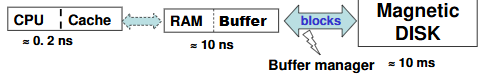{ width="400" }
<figcaption>
Storage Access
</figcaption>
</figure>

数据库文件被逻辑上划分为固定长度的存储单元，称为块（blocks）;块是数据库系统中存储分配和数据传输的单位。

缓冲区（Buffer）

- 定义：主存中可用来存储磁盘块副本的部分。
- 目标：数据库系统旨在最小化磁盘和内存之间的块传输次数。
- 减少磁盘访问次数：通过在主存中保留尽可能多的块来实现——即缓冲区。
- 限制：缓冲区的大小是有限的。

缓冲区管理器（Buffer Manager）

- 职责：负责在主存中分配缓冲区空间的子系统。

<figure markdown="span">
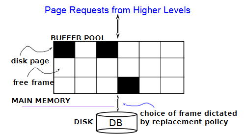{ width="400" }
</figure>

缓冲池（Buffer Pool）：

- 位于主存中，用于存储磁盘页的副本。
- 黑色方块表示已占用的磁盘页，白色方块表示空闲帧。

页面请求：

- 来自更高层次的请求需要访问数据。
- 数据必须在RAM中才能被DBMS操作。

磁盘（Disk）和数据库（DB）：

- 数据库文件存储在磁盘上。
- 数据从磁盘加载到缓冲池中。

帧选择：

- 由替换策略决定哪个帧用于存储新加载的页面。

帧和页的关系：

- 页（Page）：数据的单位。
- 块（Block）：磁盘空间的单位。
- 帧（Frame）：缓冲池的单位。
- 实际上，块和页不完全相同。

维护表：

- 维护一个`<frame#, pageid>`对的表，用于跟踪缓冲池中的数据。

### Buffer Management

请求块：

- 应用程序需要从磁盘获取块时，会调用缓冲管理器。

检查缓冲区：

- 如果块已在缓冲区中：
    - 请求程序获得块在主存中的地址。
- 如果块不在缓冲区中：
    - 缓冲管理器在缓冲区中为块分配空间。
- 如果没有空闲空间，则替换（丢弃）一些旧页。

写回磁盘：

- 被丢弃的块如果被修改过，则写回磁盘。

读取新块：

- 一旦在缓冲区中分配了空间，缓冲管理器从磁盘读取块到缓冲区，并将块在主存中的地址传递给请求者。

替换策略：

- 使用LRU（最近最少使用）或MRU（最近最多使用）策略。

固定块(Pinned Block)：

- 被固定的块不允许写回磁盘，直到使用结束。

立即丢弃策略：

- 块的最后一个元组处理完后，立即释放空间。

强制输出：
    - 请求者必须解锁块，并指示页面是否被修改。
    - 使用“脏位”标识修改。

页面请求：

- 缓冲池中的页面可能被多次请求。
- 使用固定计数(Pin Count)，只有当固定计数为0时，页面才是替换的候选。

### Buffer-replacement Policies

1. **LRU策略（最近最少使用策略）** ：
    - **原理** ：替换最近最少使用的块。
    - **思路** ：使用过去的块引用模式作为未来引用的预测。
    - **优点** ：适用于有明确访问模式的查询。
    - **缺点** ：对于涉及重复扫描数据的查询，LRU可能表现不佳。

<figure markdown="span">
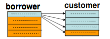{ width="400" }
</figure>

设 M = 5 (buffer has 5 blocks), 1 for borrower, 3 for customer, 1 for out 对customer, LRU的块可能是下面快要用的块(循环)，而最近刚用过的块则暂时不用，当空间不够时倒是可以将其覆盖的, 故LRU策略不佳。

2. **MRU策略（最近最常用策略）** ：
    - **原理** ：系统固定当前正在处理的块。
    - **过程** ：块的最后一个元组处理完后，块被解锁，成为最常用的块。
    - **优点** ：适用于某些特定的访问模式。

3. **统计信息** ：
    - 缓冲管理器可以维护统计信息，以提高请求引用特定关系的概率。
    - 例如，数据字典通常被频繁访问。

4. **强制输出** ：
    - 缓冲管理器支持块的强制输出，以便进行恢复。

5. **混合策略** ：
    - 与查询优化器提供的替换策略结合使用。

## File Organization

The database is stored as a collection of files. 

- Each file is a sequence of records. 
- A record is a sequence of fields. 
- Two kinds of record: 
    - Fixed-length records.
    - Variable-length records. 

### Fixed-length Records

- **优势：方法简单**：
   - 记录 \(i\) 从字节 \(n \times (i - 1)\) 开始存储，其中 \(n\) 是每个记录的大小。
   - 记录访问简单，但记录可能会跨越块。

修改:

- 不允许记录跨越块边界。

<figure markdown="span">
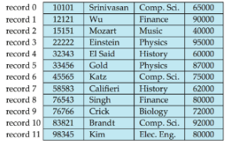{ width="400" }
<figcaption>
Fixed-length Records
</figcaption>
</figure>

删除记录 \(i\) 的方法:

1. **方法1** ：将记录 \(i+1\) 到 \(n\) 向前移动。
2. **方法2** ：将记录 \(n\) 移动到位置 \(i\)。
3. **方法3** ：不移动记录，而是将所有空闲记录链接到一个空闲列表（free list）中。

#### Free Lists

<figure markdown="span">
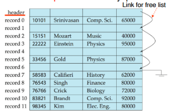{ width="400" }
<figcaption>
Free Lists
</figcaption>
</figure>

空闲列表（Free List）

- 存储地址：在文件头中存储第一个被删除记录的地址。
- 链接记录：使用第一个被删除的记录来存储第二个被删除记录的地址，依此类推。
- 指针概念：这些存储的地址可以视为指针，因为它们“指向”记录的位置。
- 优势
     - 空间效率：更高效的空间表示。
     - 重新利用空闲记录的正常属性空间来存储指针。
     - 使用中的记录中不存储指针。
     - 空闲列表通过链接被删除的记录，优化了存储空间的使用和管理。

### Variable-length Records
出现方式：

- 文件中存储多种记录类型。
- 允许一个或多个字段具有可变长度的记录类型（如字符串）。
- 允许重复字段的记录类型（用于一些旧的数据模型）。

属性存储：

- 按顺序存储。
- 可变长度属性用固定大小（偏移量、长度）表示，实际数据存储在所有定长属性之后。
- 空值用空值位图表示。

<figure markdown="span">
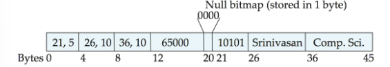{ width="400" }
<figcaption>
Variable-length Records
</figcaption>
</figure>

#### Slotted Page Structure

<figure markdown="span">
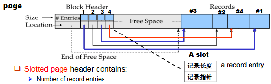{ width="400" }
<figcaption>
Slotted Page Structure
</figcaption>
</figure>

结构组成

- 块头（Block Header）：
    - 包含有关页面的元数据
    - 存储记录条目数量
    - 标记空闲空间的结束位置
    - 包含每条记录的位置和大小信息

- 槽（Slot）：
    - 页头中的一个条目
    - 包含两个关键信息：
        - 记录长度（记录大小）
        - 记录指针（指向实际记录的位置）
    - 槽的标识形式为：rid = `<slot# pid>`（记录ID由槽号和页ID组成）

- 记录区域：
    - 实际存储数据记录的区域
    - 记录从页面尾部开始向前存储（`#1, #2, #3, #4`）
    - 中间可能有空闲空间

工作原理

- 当需要访问记录时，系统首先查找页头中的相应槽
- 通过槽中的指针找到实际记录位置
- 记录可以在页面内移动，以保持数据连续性（没有空隙）
- 移动记录后，只需更新页头中的槽信息，而不需要更新外部指针
- 指针不应直接指向记录，而应指向头中的记录条目（间接指针）。

### Representation

#### 保留空间（Reserved Space）

<figure markdown="span">
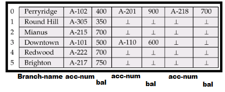{ width="400" }
<figcaption>
Reserved Space
</figcaption>
</figure>

原理

- 使用已知最大长度的定长记录
- 为每条记录分配固定大小的空间
- 较短记录中的未使用空间用空值或记录结束符填充

特点

- **简单性**：实现和管理简单直接
- **预测性**：记录位置可以通过简单公式计算
- **存取效率**：随机访问速度快，无需额外索引
- **空间浪费**：短记录会造成空间浪费
- **限制性**：对超过预定最大长度的记录无法处理

应用场景

- 记录长度变化不大的数据
- 对随机访问性能要求高的应用
- 简单数据结构的存储

#### 指针（Pointers）

<figure markdown="span">
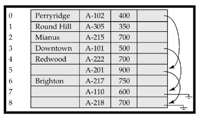{ width="400" }
<figcaption>
Pointers
</figcaption>
</figure>

原理

- 使用指针指向实际数据的位置
- 可以是直接指针（指向实际数据）或间接指针（指向中间结构）

特点

- **灵活性**：支持任意长度的记录
- **空间效率**：可以减少空间浪费
- **复杂性**：实现和管理相对复杂
- **性能开销**：访问数据需要额外的指针解析步骤

应用场景

- 记录长度差异大的数据
- 存储大型对象或文档
- 需要灵活空间管理的应用

**空间浪费**：除了链中的第一条记录外，所有记录中都有浪费的空间（用于分支名称），这意味着在溢出链中的记录结构可能包含未使用的字段，造成存储效率降低

解决方案：

<figure markdown="span">
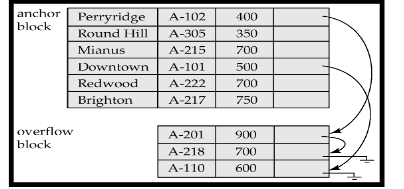{ width="400" }
<figcaption>
Pointer Structure
</figcaption>
</figure>   

通过在文件中使用两种不同类型的块：

1. **锚块（Anchor Block，锚块）**：
    - 包含链中的第一条记录
    - 这些记录需要存储完整信息，包括分支名称等所有字段
    - 通常是哈希表的主要存储区域

2. **溢出块（Overflow Block，溢出块）**：
    - 包含除链中第一条记录以外的其他记录
    - 这些记录可以使用更紧凑的结构，省略不必要的字段
    - 专门设计用于存储冲突记录

溢出记录不再需要存储冗余信息，结构优化：可以为不同用途的记录设计专门的结构，性能提升：更紧凑的记录意味着每个块可以存储更多记录，减少I/O操作

!!!Summary "两种方法的比较"
    | 特性 | 保留空间 | 指针 |
    |------|---------|------|
    | 实现复杂度 | 低 | 中到高 |
    | 空间利用率 | 低到中 | 中到高 |
    | 访问速度 | 快 | 较慢（需解析指针） |
    | 记录长度灵活性 | 有限 | 高 |
    | 更新操作效率 | 高（原地更新） | 可能需要重定位 |

    保留空间方法更适合记录长度相对固定且对访问速度要求高的场景，而指针方法则更适合处理变长记录和需要高空间利用率的情况。

## Organization of Records in Files

- Heap file (堆文件, 流水文件):a record can be placed anywhere in the file where there is space,有空间就可以放

- Sequential file (顺序文件):store records in sequential order, based on the value of a search key of each record ，根据搜索键的值存储记录

- Hashing file (散列文件):a hash function computed on some attribute of each record; the result specifies in which block of the file the record should be placed ，根据每个记录的某个属性计算散列值，结果指定记录应该存储在文件的哪个块中

- Clustering file organization (聚集文件组织):records of several different relations can be stored in the same file ，几个不同的关系的记录可以存储在同一个文件中
>  Motivation: store related records in different relations on the same block to minimize I/O ，在同一个块中存储相关记录以最小化I/O操作

### Sequential File Organization

<figure markdown="span">
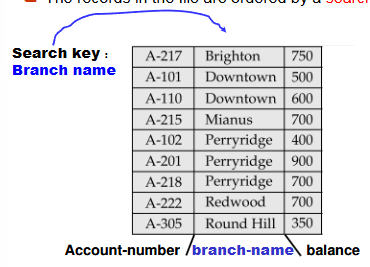{ width="400" }
<figcaption>
Sequential File Organization
</figcaption>
</figure>

- 适用于：需要对整个文件进行顺序处理的应用
- 数据排序：文件中的记录按搜索键排序（如图中按账号-分支名排序）
- 唯一性：一个顺序文件只有一个搜索键
- 操作机制
1. 删除操作
    使用指针链（pointer chains）处理删除
    被删除的记录位置可通过指针链接起来形成空闲列表
2. 插入操作

需要找到记录应该插入的正确位置（保持排序顺序）
<figure markdown="span">
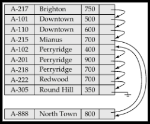{ width="400" }
<figcaption>
Insertion in Sequential File
</figcaption>
</figure>

插入策略：

- 如果插入位置有空闲空间，直接插入
- 如果没有空闲空间，将记录插入溢出块
- 在任何情况下，都需要更新指针链

3. 文件重组:随着插入和删除操作的频繁进行，文件的顺序性会下降;需要定期重新组织文件以恢复顺序
重组过程消耗资源，但能提高后续访问效率

### Multitable Clustering

<figure markdown="span">
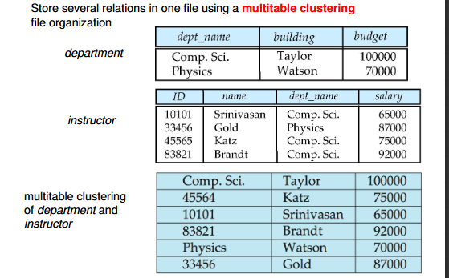{ width="400" }
<figcaption>
Multitable Clustering
</figcaption>
</figure>

多关系存储：

- 在一个文件中存储多个关系表（如图中的department和instructor表）
- 数据按照关系间的连接属性进行排序和组织

物理布局：

- 首先是逻辑表视图：department表和instructor表分别展示
- 然后是物理存储视图：department和instructor记录交错存储，按关系聚类

聚类方式：

- 相关记录物理上相邻（如Comp.Sci.部门记录后紧跟该部门的所有教师记录）
- 每个部门的记录块后面是属于该部门的所有教师记录

优缺点：

- 优点
    - 适合联合查询：
        - 对涉及department和instructor的连接查询效率高
        - 对查询单个部门及其所有教师的操作性能好
        - 减少磁盘I/O，因为相关数据物理上相近
    - 可扩展性：
        - 支持可变大小的记录

- 缺点
    - 单表查询劣势：
        - 对仅涉及department表的查询效率低，可以添加指针链来链接特定关系的记录
        - 必须扫描整个文件来定位所有部门记录
    - 复杂度：
        - 插入和删除操作复杂

<figure markdown="span">
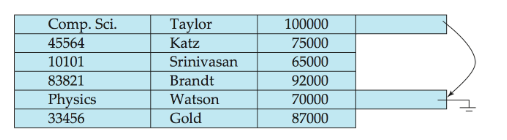{ width="400" }
<figcaption>
Pointer Relation
</figcaption>
</figure>
> 添加指针连接department关系，这样可优化对于department表的查询

维护聚类结构需要额外开销

## Data-Dictionary Storage

Data dictionary (also called system catalog) stores metadata:  that is, data about data, such as:

- Information about relations
    - Names of relations
    - Names and types of attributes of each relation
    - Names and definitions of views
    - Integrity constraints

- User and accounting information, including passwords

- Statistical and descriptive data
    - Number of tuples in each relation

- Physical file organization information
    - How relation is stored (sequential/hash/...)
    - Physical location of relation
    - Operating system file name or
    - Disk addresses of blocks containing records of the relation
- Information about indices 

### Relational Representation of System Metadata

<figure markdown="span">
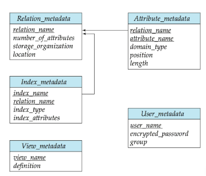{ width="400" }
<figcaption>
Relational Representation of System Metadata
</figcaption>
</figure>

- 关系表示法：
    - 关系表示法是一种用于存储和管理元数据的结构化方式
    - 关系表示法将元数据存储在关系数据库中，每个关系表示一个元数据实体
    - 关系表示法可以方便地进行查询和更新

### Column-Oriented Storage

<figure markdown="span">
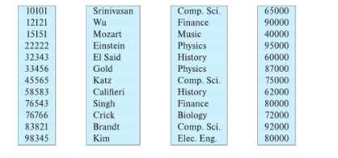{ width="400" }
<figcaption>
Column-Oriented Storage
</figcaption>
</figure>

列式存储，也称为列式表示（columnar representation），是一种数据库表的物理存储方法，与传统的行式存储截然不同。

基本概念

- 核心思想：分别存储关系表的每个属性（列）
- 存储方式：相同列的数据被连续存储在一起，而不是将一行数据存储在一起

图中示例展示了一个表格，分为四列（可能是员工ID、姓名、部门和薪资）：

- 每一列单独存储（如ID列：10101, 12121, 15151...）
- 姓名列单独存储（Srinivasan, Wu, Mozart...）
- 部门列单独存储（Comp. Sci., Finance, Music...）
- 薪资列单独存储（65000, 90000, 40000...）

列式存储的优势

- 减少I/O量：
    - 当查询只需访问少量列时，可以只读取需要的列
    - 避免读取不需要的数据，显著减少I/O操作
- 改善CPU缓存性能：
    - 同质数据连续存储增强数据局部性
    - 更好地利用CPU缓存，减少缓存未命中
- 更好的压缩效率：
    - 同一列的数据通常具有相似性，压缩效率更高
    - 可以应用专门针对列数据特性的压缩算法
- 支持向量处理：
    - 适合现代CPU架构的SIMD（单指令多数据）操作
    - 能同时对多个数据元素进行相同操作

列式存储的缺点

- 元组重构成本：
    - 需要从多个列中重新组合数据以重建完整行
    - 增加查询处理复杂性
- 更新和删除操作成本：
    - 修改一行数据需要修改多个不同的存储位置
    - 使更新操作更加复杂
- 解压缩成本：
    - 访问压缩数据需要额外的解压缩步骤

应用场景

- 决策支持系统：列式存储被证明比行式存储更高效
- 事务处理：传统行式存储更适合
- 混合系统：一些数据库支持混合行列存储，称为混合行/列存储
- 列式存储特别适合分析型工作负载（OLAP），如数据仓库和商业智能应用，这些应用通常只需访问少量列但需要处理大量行数据。

#### Representation

<figure markdown="span">
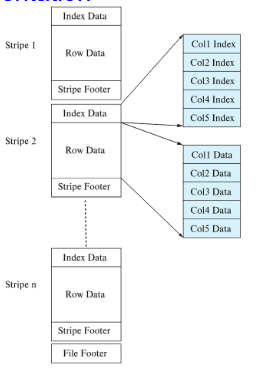{ width="400" }
<figcaption>
ORC
</figcaption>
</figure>

ORC和Parquet：两种流行的列式存储文件格式,这些格式在文件内部采用列式存储方式

图中展示了ORC文件格式的结构

应用场景：

- 非常适合大数据应用
- 被广泛应用于数据仓库和分析系统

ORC文件结构：

- 文件分条带(Stripe)：整个文件被分为多个条带（Stripe 1, Stripe 2, ..., Stripe n）
- 每个条带包含：
    - 索引数据(Index Data)：存储每列的统计信息和位置信息
    - 行数据(Row Data)：按列组织的实际数据
    - 条带页脚(Stripe Footer)：包含条带的元数据

内部组织：

- 每列数据单独存储（Col1, Col2, Col3等）
- 数据分为索引部分（Col1 Index, Col2 Index等）和数据部分（Col1 Data, Col2 Data等）
- 最下方有文件页脚(File Footer)，包含整个文件的元数据