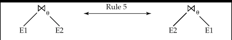
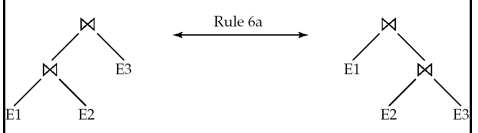
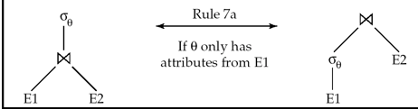
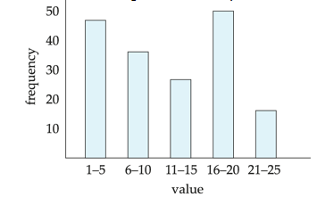

# Query Optimization

## Transformation of Relational Expressions

!!!Definition
    Two relational expressions are said to be equivalent  if the two expressions generate the same set of tuples on every legal database instance.

    - The order of tuples is irrelevant.
    - we don't care if they generate different results on databases that violate integrity constraints

    即我们只关心查询在正确的数据库状态下的行为，而不需要考虑它在错误状态下的表现。

    ** An equivalence rule says that expressions of two forms are equivalent **

!!!Property "Equivalence Rules"
    === "rule1"
        合取式可以分解为多个选择运算符

        \[
            \sigma_{F_1 \land F_2}(R) = \sigma_{F_1}(\sigma_{F_2}(R))
        \]

    === "rule2"
        选择运算符可以交换

        \[
            \sigma_{F_1}(\sigma_{F_2}(R)) = \sigma_{F_2}(\sigma_{F_1}(R))
        \]

    === "rule3"
        连续投影，只有最后一个投影需要应用

        \[
            \Pi_{L_1}(\Pi_{L_2}(...\Pi_{L_n}(R)...)) = \Pi_{L_1}(R) \text{ where } L_1 \subseteq L_2 \subseteq ... \subseteq L_n
        \]

         e.g. $\Pi_{A,B}(\Pi_{A,B,C,D}(R)) = \Pi_{A,B}(R)$

    === "rule4"
        选择操作可以和笛卡尔积和theta连接操作合并

        \[
            \sigma_{F}(R \times S) = R \bowtie_{F} S \\
            \sigma_{F_1}(R \bowtie_{F_2} S) = R \bowtie_{F_1 \land F_2} S
        \]

    === "rule5"
        自然连接和theta连接可以交换

        \[
            R \bowtie_{F} S = S \bowtie_{F} R
        \]

        <figure markdown="span">
            { width=400 }
        </figure>

    === "rule6.a"
        自然连接有结合律

        \[
            (R \bowtie S) \bowtie T = R \bowtie (S \bowtie T)
        \]

        <figure markdown="span">
            { width=400 }
        </figure>
    
    === "rule6.b"
        theta连接有结合律，其中$\theta_2$只包含$S$和$T$的属性

        \[
            (R \bowtie_{\theta_1} S) \bowtie_{\theta_2 \land \theta_3} T = R \bowtie_{\theta_1 \land \theta_3} (S \bowtie_{\theta_2} T)
        \]
        
    === "rule7.a"
        theta连接有分配律,假设$\theta_0$只包含$R$的属性

        \[
            \sigma_{\theta_0}(R \bowtie_{\theta} S) = \sigma_{\theta_0}(R) \bowtie_{\theta} S
        \]

        <figure markdown="span">
            { width=400 }
        </figure>
    
    === "rule7.b"
        theta连接有分配律,假设$\theta_1$只包含$S$的属性,$\theta_2$只包含$T$的属性

        \[
            \sigma_{\theta_1 \land \theta_2}(R \bowtie_{\theta} S) = \sigma_{\theta_1}(R) \bowtie_{\theta} \sigma_{\theta_2}(S)
        \]

         简单来说，就是先选后连接还是先连接后选，一般来说，先选后连接的效率更高。

    === "rule8.a"
        投影操作的分配律,假设$\theta$只包含$L_1$和$L_2$的属性

        \[
            \Pi_{L_1 \cup L_2}(R \bowtie_{\theta} S) = \Pi_{L_1}(R) \bowtie_{\theta} \Pi_{L_2}(S)
        \]
    
        先投影再连接，和先连接再投影，结果是一样的。

    === "rule8.b"
        投影操作的分配律,考虑以下条件

        - $L_1$ 和 $L_2$ 是 $R$ 和 $S$ 的属性
        - $L_{1a}$ 是 $R$ 的属性,在$\theta$中,但不在 $L_1 \cup L_2$ 中
        - $L_{1b}$ 是 $S$ 的属性,在$\theta$中,但不在 $L_1 \cup L_2$ 中

        \[
            \Pi_{L_1 \cup L_2}(R \bowtie_{\theta} S) = \Pi_{L_{1a} \cup L_1}(R) \bowtie_{\theta} \Pi_{L_{1b} \cup L_2}(S)
        \]

        先将参与连接的属性投影出来，再进行连接，最后再提取需要的属性。结果和先连接再投影是一样的。

    === "rule9"
        集合的交和并操作可交换

        \[
            R \cup S = S \cup R
        \]

        \[
            R \cap S = S \cap R
        \]

    === "rule10"
        集合的交和并操作可结合

        \[
            (R \cup S) \cup T = R \cup (S \cup T)
        \]

        \[
            (R \cap S) \cap T = R \cap (S \cap T)
        \]

    === "rule11"
        选择操作可在集合运算上分配，如果$F$包含$R$和$S$的元组

        \[
            \sigma_F(R \cup S) = \sigma_F(R) \cup \sigma_F(S)
        \]
        
        对于 $\cap$ 和 $\setminus$ 也成立

        如果$F$只包含$R$的元组，则

        \[
            \sigma_F(R \cap S) = \sigma_F(R) \cap \sigma_F(S)
        \]

        对于 $\setminus$ 也成立，但是对于 $\cup$ 不成立
        
        !!!eg 
            E1 = {a, b}，E2 = {c, d}，$\theta$: 只保留a

            \[
                \sigma_{\theta}(E1 \cup E2) = \sigma_{\theta}({a, b, c, d}) = {a}
            \]

            \[
                \sigma_{\theta}(E1) \cup E2 = {a} \cup {c, d} = {a, c, d}
            \]

            结果不同
            
    === "rule12"
        投影操作可分配

        \[
            \Pi_{L_1}(R \cup S) = \Pi_{L_1}(R) \cup \Pi_{L_1}(S)
        \]
    
    

## Statistics for Cost Estimation

!!!Definition "统计信息"
    - $n_r$: 关系 $r$ 中的元组数量
    - $b_r$: 包含关系 $r$ 元组的块数量
    - $l_r$: 关系 $r$ 中一个元组的大小
    - $f_r$: 关系 $r$ 的阻塞因子 — 即一个块中能容纳的 $r$ 的元组数量 tuples per block
    - $V(A, r)$: 在关系 $r$ 的属性 $A$ 上出现的不同值的数量；等同于 $\Pi_A(r)$ 的大小
    - 如果关系 $r$ 的元组在物理上存储在一个文件中，则：
        
        \[
           b_r = \lceil \frac{n_r}{f_r} \rceil
        \]

### Histograms

<figure markdown="span">
{ width=500 }
<figcaption>eg,Histogram on attribute age of relation person</figcaption>
</figure>

#### Equi-width histograms

等宽直方图将值域划分为相同宽度的区间。每个区间的宽度相同，但每个区间内的元组数量可能差异很大。

特点：

- 所有区间的宽度相同
- 实现简单
- 对于数据分布不均匀的情况，可能导致某些区间元组数过多，某些区间元组数过少
- 容易受到极端值的影响

#### Equi-depth histograms

等深直方图将数据划分为包含相同元组数量的区间。每个区间包含大致相同数量的元组，但区间宽度可能不同。

特点：

- 所有区间包含大致相同数量的元组
- 对于偏斜数据分布有更好的适应性
- 提供更准确的选择率估计
- 计算成本比等宽直方图高
- 在数据更新时可能需要重新计算区间边界

### Selection Size Estimation

选择操作的大小估计是查询优化中的关键步骤，它帮助优化器评估不同执行计划的成本。

#### $\sigma_{A=v}(r)$

对于等值选择操作 $\sigma_{A=v}(r)$，其结果大小估计为：

- 如果 $A$ 是 $r$ 的主键：结果大小为 1 或 0
- 如果 $A$ 不是主键：结果大小约为 $\frac{n_r}{V(A,r)}$，假设每种值的个数一样来估计，即其均匀分布在$V(A,r)$个值中，v值的概率为$\frac{1}{V(A,r)}$，所以结果大小为$n_r \times \frac{1}{V(A,r)}$

#### $\sigma_{A \leq v}(r)$

对于范围选择操作 $\sigma_{A \leq v}(r)$，如果没有可用的直方图信息：

- 假设值均匀分布，结果大小估计为：$n_r \cdot \frac{v - \min(A,r)}{\max(A,r) - \min(A,r)}$
- 其中 $\min(A,r)$ 和 $\max(A,r)$ 分别是属性 $A$ 在关系 $r$ 中的最小值和最大值，这种估计方法采用了区间比例的方式

- 如果信息不够，则使用默认估计：$\frac{n_r}{2}$

### Complex Selection Conditions

对于复杂的选择条件，我们需要估计多个条件组合的选择率。

#### Selectivity

Selectivity of $\theta$ is the probability that a tuple in $r$ satisfies $\theta$.

- If $s_r$ is the number of tuples in $r$ that satisfy $\theta$, then the selectivity is $\frac{s_r}{n_r}$

#### Estimation of Selectivity for Complex Conditions

- **合取条件（Conjunction）**：$\sigma_{\theta_1 \land \theta_2 \land ... \land \theta_n}(r)$

假设条件之间相互独立，估计结果元组数为：

\[
    n_r \times \frac{s_1 \times s_2 \times ... \times s_n}{n_r^n}
\]

其中 $s_i$ 是满足条件 $\theta_i$ 的元组数。

- **析取条件（Disjunction）**：$\sigma_{\theta_1 \lor \theta_2 \lor ... \lor \theta_n}(r)$

估计结果元组数为：

\[
    n_r \times \left(1-(1-\frac{s_1}{n_r}) \times (1-\frac{s_2}{n_r}) \times ... \times (1-\frac{s_n}{n_r})\right)
\]

即选择率为1减去一个都没选到的概率

- **否定条件（Negation）**：$\sigma_{\lnot\theta}(r)$

   估计结果元组数为：
   
\[
    n_r - size(\sigma_\theta(r))
\]

!!! note "独立性假设的局限"
    在实际数据中，属性之间通常存在相关性，独立性假设可能导致估计不准确。一些数据库系统会维护多列统计信息来处理这种情况。

### Estimation of the Size of Joins

- **笛卡尔积**  
$r \times s$ 包含 $n_r \cdot n_s$ 个元组，每个元组大小为 $s_r + s_s$ 字节。

- **无交集的连接**  

如果 $R \cap S = \emptyset$，则 $r \Join s$ 等价于 $r \times s$。

- **连接属性为主键**  
 
如果 $R \cap S$ 是 $R$ 的主键，则 $s$ 中的每个元组至多与 $r$ 中一个元组连接，  
所以 $r \Join s$ 的元组数不超过 $s$ 的元组数。

- **连接属性为外键**  

如果 $R \cap S$ 在 $S$ 中是外键，引用 $R$ 的主键，则 $r \Join s$ 的元组数等于 $s$ 的元组数。  

反过来，如果 $R \cap S$ 在 $R$ 中是外键，引用 $S$ 的主键，则结果等于 $r$ 的元组数。

!!!Example
    查询 `student \Join takes`，其中 `takes` 表的 `ID` 是外键，引用 `student` 的主键。  
    因此结果正好有 $n_{takes}$ 个元组。

- 如果 $R \cap S = \{A\}$ 不是 $R$ 或 $S$ 的主键，  
  假设 $R$ 中每个元组都能和 $S$ 中 $A$ 值相等的元组连接，  
  则 $r \Join s$ 的元组数估计为：

\[
    \frac{n_r \cdot n_s}{V(A, s)}
\]

即$S$中A每一种值大概有$n_s/V(A, s)$个元组，$R$中每个关系来匹配这些元组，所以结果为$n_r \cdot n_s/V(A, s)$

- 如果反过来（$A$ 在 $R$ 中的不同值更少），则估计为：

\[
    \frac{n_r \cdot n_s}{V(A, r)}
\]

- 取这两个估计值中**较小的那个**，通常更准确。

如果有直方图，则可以对每个区间分别用类似公式估计，然后加总，得到更准确的结果。

!!!Example
    让我们看一个具体的例子：
    
    - `student` 表有 5000 条记录，每个块存储 50 条记录，共需要 100 个块
    - `takes` 表有 10000 条记录，每个块存储 25 条记录，共需要 400 个块
    - `ID` 在 `takes` 表中有 2500 个不同值，意味着平均每个学生选修了 4 门课程
    - `ID` 在 `student` 表中有 5000 个不同值（是主键）
    - `takes` 表中的 `ID` 是引用 `student` 表的外键
    假设我们要计算 `student ⋈ takes` 的大小估计，但不使用外键信息：

    - 假设 `V(ID, takes) = 2500`，`V(ID, student) = 5000`
    - 两种估计方式：
    - $\frac{n_{student} \cdot n_{takes}}{V(ID, takes)} = \frac{5000 \cdot 10000}{2500} = 20000$
    - $\frac{n_{student} \cdot n_{takes}}{V(ID, student)} = \frac{5000 \cdot 10000}{5000} = 10000$
    - 我们选择较小的估计值 10000，这与使用外键信息得到的结果相同

        
## Size Estimation for other operations

- **投影操作**：$\Pi_A(r)$ 的估计大小为 $V(A, r)$
    - 因为投影操作会去除重复元组，结果大小取决于属性的不同值数量

- **聚合操作**：$_{A}G_F(r)$ 的估计大小为 $V(A, r)$
    - 因为按 A 分组后，每个不同的 A 值对应一个结果元组

- **外连接操作**：
    - 左外连接：$r$ leftouterjoin $s$ 的估计大小为 $r \bowtie s$ 的大小加上 $r$ 中不能连接的元组数量，即 $size(r \bowtie s) + size(r)$
    - 右外连接：$r$ rightouterjoin $s$ 的估计大小为 $r \bowtie s$ 的大小加上 $s$ 中不能连接的元组数量，即 $size(r \bowtie s) + size(s)$
    - 全外连接：$r$ fullouterjoin $s$ 的估计大小为 $size(r \bowtie s) + size(r) + size(s)$

- **集合操作**：
    - 对于同一关系上的选择条件的并/交集：可以重写为单个选择然后使用选择大小估计
        - 例如，$\sigma_{\theta_1 \lor \theta_2}(r)$ 可重写为 $\sigma_{\theta_1}(r) \cup \sigma_{\theta_2}(r)$
    - 对于不同关系上的操作：
        - $r \cup s$ 的估计大小为 $size(r) + size(s)$（上界估计）
        - $r \cap s$ 的估计大小为 $min(size(r), size(s))$（上界估计）
        - $r - s$ 的估计大小为 $size(r)$（上界估计）
    - 所有这些估计可能不太准确，但提供了操作结果大小的上界

## Estimation of Number of Distinct Values）

### Selection

1. **等值选择**：$\sigma_{A=v}(r)$
    - 如果选择条件强制 A 取特定值（如 A=3），则 $V(A, \sigma_{A=v}(r)) = 1$

- **值集合选择**：$\sigma_{A \in \{v_1, v_2, ..., v_n\}}(r)$
    - 如果选择条件强制 A 取特定值集合中的值，则 $V(A, \sigma_{A \in \{...\}}(r)) = n$（集合中值的数量）
    - 例如，$\sigma_{A=1 \lor A=3 \lor A=4}(r)$ 中 $V(A) = 3$

- **范围选择**：$\sigma_{A \, op \, v}(r)$（其中op是比较操作符）
    - 估计 $V(A, \sigma_{A \, op \, v}(r)) = V(A, r) \times s$
    - 其中 $s$ 是选择的选择率（selectivity）

- **其他情况**：
    - 使用近似估计：$min(V(A, r), n_{\sigma_\theta(r)})$
    - 即取属性在原关系中的不同值数量和选择结果大小中的较小值

### Join

1. **属性全部来自一个关系**：
    - 如果 A 的所有属性都来自于关系 $r$，则 $V(A, r \bowtie s) = min(V(A, r), n_{r \bowtie s})$
    - 也就是说，不会超过原关系中的不同值数量和连接结果大小

- **属性来自多个关系**：
    - 如果 A 包含来自 $r$ 的属性 A1 和来自 $s$ 的属性 A2，则：
    - $V(A, r \bowtie s) = min(V(A1, r) \times V(A2, s), V(A1-A2, r) \times V(A2, s), V(A1, r) \times V(A2-A1, s), n_{r \bowtie s})$

!!! note "公式解释"
    **$V(A1, r) \times V(A2, s)$**：
    
    - 假设A1和A2中的值完全独立
    - 例如：如果A1有10个不同值，A2有5个不同值，最多可能有10×5=50个不同组合

    **$V(A1-A2, r) \times V(A2, s)$**：
    
    - A1-A2表示A1中不在A2中的属性
    - 考虑了A1和A2可能有重叠属性的情况
    - 只计算A1中独有属性与A2所有属性的组合

    **$V(A1, r) \times V(A2-A1, s)$**：
    
    - A2-A1表示A2中不在A1中的属性
    - 与前一项类似，但从另一个角度考虑
    - 计算A1所有属性与A2中独有属性的组合

    **$n_{r \bowtie s}$**：
    
    - 连接结果的总元组数
    - 这是一个上界，因为不同值数量不能超过元组总数

### Other

1. **投影操作**：
    - $V(A, \Pi_{A}(r)) = V(A, r)$
    - 投影不会改变属性的不同值数量

- **分组聚合操作**：
    - 对于分组属性，不同值数量不变
    - 对于聚合值：
        - 对于 MIN/MAX 函数，不同值数量估计为 $min(V(A, r), V(G, r))$，其中 G 是分组属性
        - 对于其他聚合（SUM, AVG, COUNT等），假设所有结果值都不同，使用 $V(G, r)$

这些估计方法提供了查询优化器所需的基本统计信息，虽然有时可能不够准确，但在实际应用中通常足够指导查询优化器选择合理的执行计划。

## Choice of Evaluation Plans

在查询优化中，选择合适的查询评估计划是关键步骤。这不仅涉及各个操作的执行成本估计，还需要考虑操作之间的交互关系。

- **单独优化的陷阱**：为每个操作独立选择最便宜的算法，可能不会产生全局最优的查询计划
  
- **考虑交互作用的例子**：
    - Merge-join可能比Hash-join成本高，但它能提供已排序的输出，可能减少上层聚合操作的成本
    - Nested-loop join可能提供流水线执行(pipelining)的机会，减少中间结果的物化成本

实际的查询优化器通常结合以下两种方法：

1. **基于成本的搜索**：
    - 搜索所有可能的计划，基于成本模型选择最佳计划
    - 全面但计算开销大

- **基于启发式的选择**：
    - 使用启发式规则快速缩小搜索空间
    - 速度快但可能错过全局最优解

## Cost-Based Optimization

- **连接操作数量增长**：对于n个关系的连接 $r_1 \bowtie r_2 \bowtie \ldots \bowtie r_n$
    - 不同连接顺序的数量为 $(2(n-1))!/(n-1)!$
    - 当n=7时，有665,280种不同顺序
    - 当n=10时，超过1760亿种顺序

- **动态规划解决方案**：
    - 不需要生成所有可能的连接顺序
    - 使用动态规划，任何子集 $\{r_1, r_2, \ldots, r_m\}$ 的最佳连接顺序只需计算一次
    - 结果存储起来供后续使用，显著减少计算量

