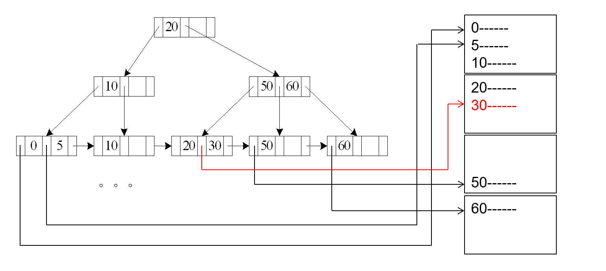
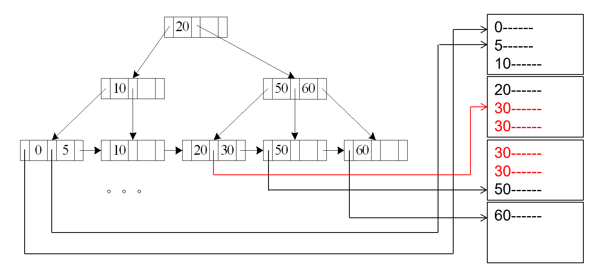
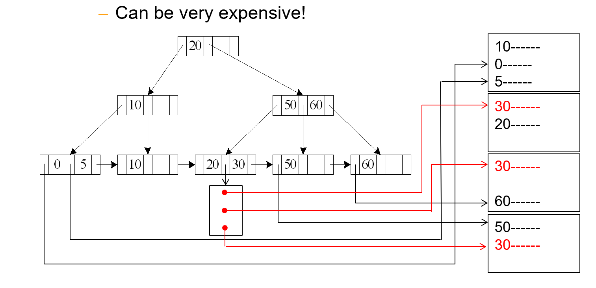
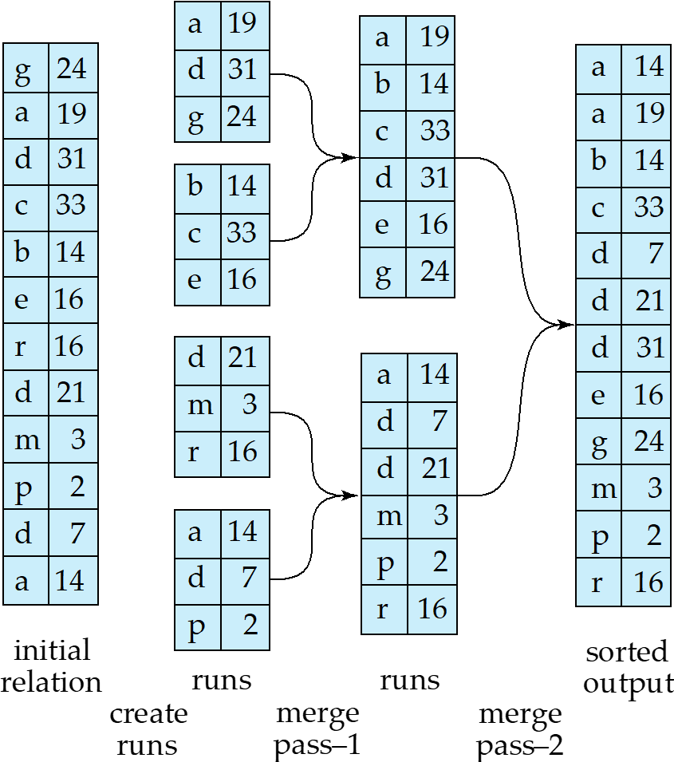
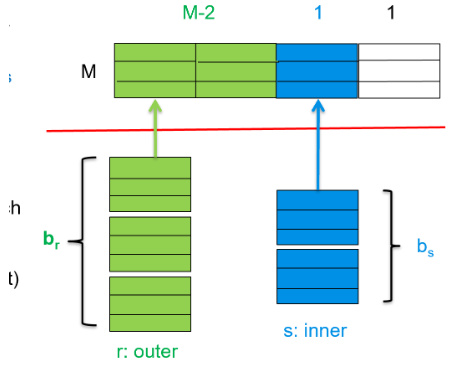
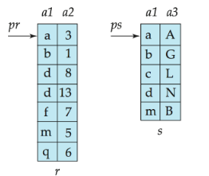
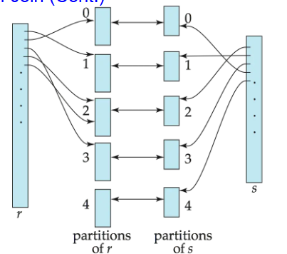

# Query Processing

## Measures of Query Cost

Cost  is generally measured as total elapsed time for answering query.

影响时间成本的因素有很多，一般而言我们主要关注 Disk Access, CPU Time, Network Traffic.

而 Disk Access 是主导因素，主要考虑以下三个方面

- Number of Seek operations
- Read Cost: Number of blocks read $\times$ Average block read cost
- Write Cost: Number of blocks written $\times$ Average block write cost

而Write Cost 一般远大于 Read Cost，因为写完之后还需要从内存中读出来，以确保数据写回的正确性。

为了简化计算，我们使用

- $t_T$ Time to transfer a block
- $t_S$ Time for one seek

例如，查找$b$个block和$s$次seek的代价为$b t_T + s t_S$


!!! note "内存缓冲区对查询成本的影响"
    查询成本很大程度上取决于主内存中缓冲区的大小：

    - 更多的内存可以减少对磁盘访问的需求
    - 实际可用于缓冲的内存大小取决于其他并发的操作系统进程，这很难在实际执行前确定
    - 我们通常使用最坏情况估计，假设只有操作所需的最小内存可用
    - 同时也会考虑最佳情况估计

    需要注意的是，所需数据可能已经在缓冲区中，这样可以避免磁盘I/O。但这种情况很难在成本估算中准确考虑。


## Selection Operation

### File Scan
文件扫描是一种 **不使用索引** 的搜索算法，用于定位和检索满足选择条件的记录。


### A1 - Linear Search

线性搜索是最基本的选择操作实现方法：

**算法 A1（线性搜索）**：

- 扫描每个文件块并测试所有记录，检查它们是否满足选择条件

- 成本估计 = $b_r$ 次 block transfer + 1 次 seek
   - $b_r$ 表示包含关系 $r$ 中记录的块数
- 如果选择条件是基于键属性，找到记录后可以停止
   - 成本 = $(b_r/2)$ 次 block transfer + 1 次 seek,这是平均的成果，具体来说，我们找到第一个满足条件的记录就可以返回了，因为它是唯一的；最好的情况是$b_r=1$，最坏的情况是$b_r=b$，由于目标文件是随机存储的，所以期望就是就是$b_r/2$

1次Seek是因为将磁头移动到目标块，然后依次往下面走就行

- 线性搜索可以应用于任何选择条件、任何文件记录排序方式，不需要索引

### A2 - Binary Search

- 适用条件：选择是一个等值比较（equality comparison），且文件按该属性排序
- 假设关系的块是连续存储的

- 成本 = $\lceil\log_2(b_r)\rceil$ 次 block transfer + $\lceil\log_2(b_r)\rceil$ 次 seek（定位第一个元组的成本）二分搜索的工作原理要求每次比较后跳转到文件的不同部分。每次我们需要检查一个新的中间点时，都需要将磁盘头重新定位到一个可能相距较远的新块位置。

- 如果选择不是基于键属性，还需加上包含满足选择条件记录的块数
- block transfer = $\lceil\log_2(b_r)\rceil$ + $\lceil sc(A, r)/f_r \rceil$ - 1, 其中$sc(A, r)$是满足选择条件的记录数，$f_r$是每个块的记录数当我们知道满足选择条件的记录总数 $sc(A, r)$ 时，需要计算这些记录会占用多少个块。所以用记录总数 $sc(A, r)$ 除以每块记录数 $f_r$，再向上取整 $\lceil sc(A, r)/f_r \rceil$，就得到了存储这些记录所需的块数。

例如，如果有100条记录满足条件，而每个块可以存储25条记录，那么就需要 $\lceil 100/25 \rceil = 4$ 个块来存储这些记录。

所以完整的传输成本 = 定位第一个满足条件记录所需的块传输 + 读取所有满足条件记录所需的块数 - 1（减1是因为第一个块已经在定位过程中计算过了）。

!!! note "二分搜索的局限性"
    二分搜索通常不适用于数据库查询，因为：
    - 数据通常不是连续存储的
    - 除非有可用的索引，否则二分搜索需要比索引搜索更多的寻道操作


!!!Summary
     Linear Search 和 Binary Search 都是基于文件扫描的搜索算法，但它们在性能上有显著差异。

     Linear Search 的优点是：

     - 适用于任何选择条件
     - 不需要预先排序
     - 实现简单

     Binary Search 的优点是：
     
     - 适用于等值比较
     - 需要预先排序
     - 实现复杂
     - 性能更好

---

### Index Scan

顾名思义，索引扫描就是利用索引进行扫描。

### A3 - Primary Index - Equality

- 适用条件：在关系的键属性上建立了主索引，且查询是等值条件
- 检索满足等值条件的单个记录
- 成本 = $(h_i + 1) \times (t_T + t_S)$
    - 其中 $h_i$ 为索引树的高度(与数据结构定义略有不同，这里指的是一共有多少层，也就是从1开始)
    - 索引扫描需要 $h_i$ 次读取操作找到索引项
    - 加 1 是因为需要一次额外的读取操作来访问包含目标记录的数据块

<figure markdown="span">
{ width="500" }
<figcaption>主索引等值查询</figcaption>
</figure>

首先，我们需要从索引根节点开始，逐层向下搜索，每次需要一次seek操作将磁头定位到索引块，一次transfer操作读取该索引块的内容，这个过程重复$h_i$次（索引树的高度），找到叶子节点中的索引项后，还需要一次额外操作来访问实际数据块：再一次seek操作来将磁头定位到包含目标记录的数据块，一次transfer操作来读取该数据块。

### A4 - Primary Index - Equality on Non-key

- 适用条件：在关系的非键属性上建立了主索引，且查询是等值条件
- 检索满足条件的多个记录，这些记录通常位于连续的数据块中
- 成本 = $h_i \times (t_T + t_S) + t_S + t_T \times b$
    - 其中 $h_i$ 为索引树高度
    - $b$ 为包含匹配记录的块数量
    - $h_i \times (t_T + t_S)$ 用于在索引中查找第一个匹配的索引项
    - $t_S$ 用于将磁头定位到第一个包含匹配记录的数据块
    - $t_T \times b$ 用于读取所有包含匹配记录的连续块

<figure markdown="span">
{ width="500" }
<figcaption>主索引非键等值查询</figcaption>
</figure>

与A3类似，不过找到叶子节点后有多个block需要读取，所以需要$t_T \times b$

### A5 - Secondary Index - Equality on Non-key

- 适用条件：在关系的非键属性上建立了二级索引，且查询是等值条件
- 检索匹配记录的行为取决于搜索键是否为候选键
    - 如果搜索键是候选键（检索单条记录）成本 = $(h_i + 1) \times (t_T + t_S)$
    - 如果搜索键不是候选键（检索多条记录）每个匹配的记录可能位于不同的数据块中，成本 = $(h_i + m + n) \times (t_T + t_S)$
        - 首先通过索引树查找（$h_i$ 次操作），然后读取包含记录指针的叶子节点（$m$ 次操作）最后根据指针读取实际记录（$n$ 次操作）
        - 这种情况开销非常大！可能比线性扫描更糟糕
        - 每次读取一条记录都需要一次独立的I/O操作

<figure markdown="span">
{ width="500" }
<figcaption>二级索引非键等值查询</figcaption>
</figure>

---

如比较符`>, <, >=,<=,<>` 与等值比较的不同之处在于其选择范围更大

### A6 - Primary Index - Range

- 适用条件：在关系的某属性上建立了主索引，且查询是范围条件
- 使用索引找到范围的第一个值，然后顺序扫描关系
- 成本 = $h_i \times (t_T + t_S) + t_S + t_T \times b$
  - 其中 $b$ 是范围内所有匹配记录占用的块数量
  - 类似于A4的成本结构

### A7 - Secondary Index - Comparison

- 适用于辅助索引上的比较操作（如 $\sigma_{A \geq v}(r)$ 或 $\sigma_{A < v}(r)$）

- 对于 $\sigma_{A \geq v}(r)$：使用索引找到第一个值 $\geq v$ 的索引项，然后顺序扫描索引找出所有指向的记录

- 对于 $\sigma_{A < v}(r)$：从索引开始顺序扫描，直到找到第一个 $\geq v$ 的值为止

- 在任何情况下，都需要获取指向的记录
    - 每个记录需要一次I/O操作
    - 线性文件扫描可能更划算


---

### Implementation of complex Selections

如果有多个条件的合取：$\sigma_{\theta_1 \wedge \theta_2 \wedge \ldots \wedge \theta_n}(r)$

#### A8 - conjunctive selection using one index)

- 选择一个条件 $\theta_i$ 和算法A1到A7中的一个，使得处理 $\sigma_{\theta_i}(r)$ 的成本最小

- 在内存缓冲区中检查获取的元组是否满足其他条件

- 这种方法适用于一个条件的选择性非常高的情况，其他条件可以在内存中高效验证

#### A9 - conjunctive selection using one index)

- 如果有可用的组合索引（即多键索引），可以直接使用它处理多个条件
- 这种方法比单独处理每个条件更高效

#### A10 - conjunctive selection using one index)

- 如果多个条件各有对应的索引，可以：
    - 使用每个索引获取满足对应条件的记录指针集合
    - 计算所有这些集合的交集，确定同时满足所有条件的记录
    - 从文件中读取这些记录
- 如果某些条件没有合适的索引，在内存中应用测试

---


如果是多个条件的析取：$\sigma_{\theta_1 \vee \theta_2 \vee \ldots \vee \theta_n}(r)$

#### A11 - disjunctive selection using one index)

- 适用条件：所有条件都有可用索引，否则使用线性扫描
- 使用每个条件对应的索引，获取满足条件的记录指针集合
- 计算所有这些集合的并集
- 从文件中读取这些记录

---

#### A12 - negation using one index)

否定条件形式为：$\sigma_{\neg \theta}(r)$

- 通常使用文件的线性扫描
- 如果很少记录满足 $\neg \theta$，且 $\theta$ 有可用索引：
    - 使用索引找到满足 $\theta$ 的记录
    - 获取这些记录
    - 计算补集得到满足 $\neg \theta$ 的记录


## Sorting
> [此事在ADS亦有记载](../ADS/wk14.md)

排序是数据库查询处理中的基础操作，有两个主要使用场景：

1. 响应需要有序输出的查询
2. 加速连接操作的实现

数据库系统需要能够处理比内存大的数据集的排序。实现方式主要有：

### Internal Sort

- 适用于能够完全装入内存的关系
- 可以使用快速排序（quicksort）等高效的内存排序算法

### External Sort-Merge

- 适用于无法完全装入内存的大型关系
- 采用多路归并排序（external sort-merge）算法

### External Sort-Merge Algorithm

假设 $M$ 表示可用内存大小（以页或块为单位）：

- **创建有序段（runs）**：
    - 初始化 $i = 0$
    - 重复以下步骤直到处理完整个关系：
        - (a) 读取 $M$ 个数据块到内存
        - (b) 在内存中对数据块进行排序
        - (c) 将排序后的数据写入到段 $R_i$，并递增 $i$
    - 最终 $i$ 的值为 $N$（段的数量）

- **合并段（N-路合并）**：
    - 假设 $N < M$（段数不超过内存容量）：
        - 使用 $N$ 个内存块作为输入缓冲区，1个块作为输出缓冲区
        - 从每个段读取第一个块到各自的缓冲区
        - 反复执行：
        - 选择所有缓冲区中排序值最小的记录
        - 将该记录写入输出缓冲区（缓冲区满时写入磁盘）
        - 从原缓冲区删除该记录，缓冲区空时从对应段读取下一块
        - 直到所有输入缓冲区都为空

当 $N \geq M$ 时，需要多次合并传递：

- 每次传递合并 $M-1$ 个连续段
- 一次传递将段数减少为原来的 $\frac{1}{M-1}$ ，同时每个段的长度增加相同倍数
- 重复传递直到所有段合并为一个

!!!eg
    If M=11, and there are 90 runs, one pass reduces the number of runs to 9, each 10 times the size of the initial runs.

<figure markdown="span">
{ width="500" }
<figcaption>外部排序-合并</figcaption>
</figure>

### External Sort-Merge Cost Analysis

- **合并传递次数**：
    - 需要 $\lceil\log_{M-1}(b_r/M)\rceil$ 次合并传递
    - 其中 $b_r$ 是关系 $r$ 的块数

- **块传输次数**：

在外部排序-合并算法中，每个数据块通常需要经历一次读取和一次写入操作。
具体来说：

1. 在初始段创建阶段，每个块需要从磁盘读入内存（一次读取），排序后再写回磁盘形成有序段（一次写入）

2. 在每次合并传递中，同样需要从磁盘读取数据块（一次读取），然后将合并后的结果写回磁盘（一次写入）

因此，对于整个关系的 $b_r$ 个块，在每个阶段（初始段创建和每次合并传递）都需要 $2b_r$ 次传输操作（$b_r$ 次读取 + $b_r$ 次写入）。

唯一的例外是最后一次合并传递，通常不计算写入成本，因为结果可能直接传递给下一个操作而不必写回磁盘。所以总传输次数为：

- 初始段创建：$2b_r$ 次传输（$b_r$ 读 + $b_r$ 写）
- 前 $\lceil\log_{M-1}(b_r/M)\rceil - 1$ 次合并传递：每次 $2b_r$ 传输
- 最后一次合并传递：只有 $b_r$ 次读取操作

一共

\[
    b_r \times (2 \times \lceil\log_{M-1}(b_r/M)\rceil + 1)
\]


- **寻道次数**：

**段生成阶段**：

- 对于每个长度为M的段，需要一次寻道来读取这个段的数据，一次寻道来写入排序后的结果
- 总共有 $\lceil b_r/M \rceil$ 个段，所以需要 $2\lceil b_r/M \rceil$ 次寻道

**合并阶段**：

- 在每次合并传递中，我们需要读取和写入块
- $b_B$ 是缓冲区大小，表示在一次I/O操作中可以读/写的块数
- 读取时，每读取 $b_B$ 个块需要一次寻道，所以读取 $b_r$ 个块需要 $\lceil b_r/b_B \rceil$ 次寻道
- 写入也是类似的，需要 $\lceil b_r/b_B \rceil$ 次寻道
- 因此每次合并传递需要 $2\lceil b_r/b_B \rceil$ 次寻道
- 最后一次合并传递不需要写回磁盘，所以不计算写入寻道次数
- 合并传递总次数是 $\lceil\log_{M-1}(b_r/M)\rceil$，其中最后一次只需要读取的寻道
- 所以合并阶段的寻道次数为 $\lceil b_r/b_B \rceil(2\lceil\log_{M-1}(b_r/M)\rceil - 1)$

**总寻道次数** 就是段生成和合并阶段的寻道次数之和

为

\[
    2\lceil b_r/M \rceil + \lceil b_r/b_B \rceil(2\lceil\log_{M-1}(b_r/M)\rceil - 1)
\]

## Join Operation

连接操作是关系数据库中最重要的操作之一，它将两个关系中满足特定条件的元组合并起来。

### Nested-Loop Join

最简单的连接算法是嵌套循环连接：

```py linenums="1"
for each tuple tr in relation r do begin
    for each tuple ts in relation s do begin
        test pair (tr,ts) to see if they satisfy the join condition θ
        if they do, add tr • ts to the result.
    end
end
```

- $r$ 被称为外部关系(outer relation)，$s$ 被称为内部关系(inner relation)
- 不需要索引，可用于任何类型的连接条件
- 代价高昂，因为需要检查两个关系中所有元组对

#### Cost

在最坏情况下，如果内存只能容纳每个关系的一个块：
- 块传输次数：$n_r \times b_s + b_r$
- 寻道次数：$n_r + b_r$

!!!info "explanation" 
    - 块传输 $b_r$：首先需要读取外部关系r的所有块一次
    - 块传输 $n_r \times b_s$：对于r中的每个元组($n_r$个)，都需要扫描s的所有块($b_s$个)
    - 寻道 $b_r$：读取外部关系需要的寻道次数
    - 寻道 $n_r$：每处理一个外部元组时，都需要重新定位到内部关系的起始位置，需要一次寻道

如果较小的关系能完全装入内存，应该将其用作内部关系：

- 块传输次数降为 $b_r + b_s$,读入两个关系

- 寻道次数降为 2，两个关系的寻道

### Block Nested-Loop Join

块嵌套循环连接是嵌套循环连接的优化版本，以块为单位而不是元组为单位进行处理：

```py linenums="1"
for each block Br of r do begin
    for each block Bs of s do begin
        for each tuple tr in Br do begin
            for each tuple ts in Bs do begin
                Check if (tr,ts) satisfy the join condition
                if they do, add tr • ts to the result.
            end
        end
    end
end
```

#### Cost

最坏情况估计：

- 块传输次数：$b_r \times b_s + b_r = b_r(b_s + 1)$
- 寻道次数：$2 \times b_r$

**I/O成本分析详解**：
- 块传输 $b_r$：读取外部关系的所有块一次
- 块传输 $b_r \times b_s$：对于外部关系的每个块，都需要读取内部关系的所有块进行匹配
- 寻道 $b_r$：读取外部关系需要的寻道次数
- 寻道 $b_r$：对于外部关系的每个块，都需要一次寻道来访问内部关系

对比嵌套循环连接，块嵌套循环连接显著减少了寻道次数，从 $n_r$ 减少到 $b_r$，这是因为以块为单位处理减少了对内部关系的重复访问。因为通常 $n_r \gg b_r$（元组数远大于块数），所以这种优化非常有效。

#### Improvement


在改进的块嵌套循环连接中，假设内存可以容纳M个块：
1. 我们分配M-2个块来存储外部关系的数据
2. 剩余的1个块用于读取内部关系的数据
3. 另外1个块用于输出缓冲区

这种分配方式的优势在于：

- 可以一次读取外部关系的多个块(M-2个)到内存中
- 然后将这M-2个块与内部关系的每个块进行连接操作
- 这样内部关系只需要被扫描 $\lceil b_r/(M-2) \rceil$ 次，而不是 $b_r$ 次

这使得I/O成本显著降低：
- 块传输次数：$\lceil b_r/(M-2) \rceil \times b_s + b_r$
- 寻道次数：$2 \times \lceil b_r/(M-2) \rceil$

当M很大时，$\lceil b_r/(M-2) \rceil$ 可能会接近1，这意味着内部关系几乎只需要被扫描一次，极大地提高了连接操作的效率。


这种优化充分利用了可用内存，是数据库查询优化中的一个重要技术。

<figure markdown="span">
{ width="500" }
<figcaption>优化</figcaption>
</figure>

!!!Summary 
    其实优化的想法是减少外部循环的次数，从$n_r$到$b_r$到$\lceil b_r/(M-2) \rceil$

    进一步优化：
    
    - 如果连接属性是内部关系的键，在第一次匹配后停止内部循环
    - 交替正向和反向扫描内部循环，利用缓冲区中剩余的块
    - 如果内部关系有索引，可以使用它加速查找


### Index Nested-Loop Join

如果内部关系在连接属性上有索引，可以使用索引嵌套循环连接：

- 索引可以替代文件扫描，前提是：
    - 连接是等值连接或自然连接
    - 内部关系在连接属性上有可用索引（或可以构建临时索引）

- 基本算法：
```py linenums="1"
for each tuple tr in the outer relation r:
    use the index to look up tuples in s that satisfy the join condition with tuple tr
```

- 最坏情况：只需一页内存缓冲区，每个外部关系的元组需要一次索引查找
- 成本计算：$b_r \times (t_T + t_S) + n_r \times c$
   - 其中 $c$ 是使用索引查找并获取所有匹配元组的成本
   - $c$ 可以估计为针对连接条件的单个选择操作成本
   - 成本包含读取外部关系和对每个元组执行索引操作，这里没有内部关系是因为外部寻找的过程就是将其与内部关系做比对了；

- 如果连接属性在两个关系都有索引，应选择元组数较少的关系作为外部关系

### Sort-Merge Join

当两个关系按连接属性排序或可以先排序再连接时，排序合并连接非常有效：
#### Algorithm

1. **排序阶段**：对关系r按连接属性排序（如果尚未排序）,对关系s按连接属性排序（如果尚未排序）

2. **合并阶段**：类似于排序算法的合并阶段,主要区别是处理连接属性中的重复:对于连接属性值相同的每对元组，都需要生成一个连接结果

#### Features

- 仅适用于等值连接和自然连接
- 每个块只需读取一次（假设所有给定连接属性值的元组都能放入内存）
- 成本分析：
    - 块传输次数：$b_r + b_s$ 次传输 + 排序成本
    - 寻道次数：$\lceil b_r/b_B \rceil + \lceil b_s/b_B \rceil$ 次


<figure markdown="span">
{ width="500" }
</figure>

如图所示，两个按a1列排序的关系pr和ps可以高效连接：

- pr包含属性a1和a2
- ps包含属性a1和a3
- 通过合并算法，可以匹配所有连接属性值相同的元组，如(a, 3)和(a, A)

#### Cost

总成本 = 排序r的成本 + 排序s的成本 + 合并阶段成本($b_r + b_s$)+ $\lceil b_r/ b_b \rceil$ + $\lceil b_s/ b_b \rceil$ Seeks

如果关系已经按连接属性排序，则省略排序成本。

### Hybrid Merge-Join

**混合合并连接** 是排序合并连接的一个变种，适用于以下情况：一个关系已按连接属性排序，另一个关系在连接属性上有B+树索引

1. 按顺序扫描排序好的关系
2. 对于每个元组，使用B+树索引查找匹配的元组
3. 将结果按未排序关系的物理地址排序
4. 顺序扫描未排序的关系，并与之前的结果合并，替换地址为实际元组

这种方法结合了索引查找和排序合并的优点：

- 避免了对两个关系都进行排序
- 利用已有的索引结构减少I/O操作
- 通过批处理和排序减少了随机I/O访问

### Hash Join

<figure markdown="span">
{ width="500" }
</figure>

哈希连接利用哈希函数将具有相同连接属性值的元组分配到相同的桶中：

- 适用于等值连接和自然连接，通过哈希函数将元组分区，使具有相同连接属性值的元组分到同一个桶中,只需比较同一个桶中的元组，不需要跨桶比较

- 能够连接上的记录一定处于同一个桶，但是处于同一个桶的不一定可以连接的上

#### Hash function

- 哈希函数 $h$ 用于对两个关系进行分区
- $h$ 将连接属性值映射到范围 $\{0, 1, ..., n\}$，其中 $n$ 是分区数
    - $r_0, r_1, ..., r_n$ 表示关系 $r$ 的分区
    - $s_0, s_1, ..., s_n$ 表示关系 $s$ 的分区
- 关系 $r$ 中的元组 $t_r$ 被放入分区 $r_i$，其中 $i = h(t_r[JoinAttrs])$
- 关系 $s$ 中的元组 $t_s$ 被放入分区 $s_i$，其中 $i = h(t_s[JoinAttrs])$

#### Attributes

只有 $r_i$ 中的元组需要与 $s_i$ 中的元组比较，不需要与其他分区比较;原因：满足连接条件的元组必然有相同的连接属性值，因此会被哈希到相同的分区.如果连接属性值被哈希到值 $i$，则关系 $r$ 的元组必须在分区 $r_i$，关系 $s$ 的元组必须在分区 $s_i$

#### Algorithm

**分区阶段**：使用哈希函数 $h$ 对关系 $s$ 进行分区,类似地，对关系 $r$ 进行分区,分区时，为每个分区保留一个内存输出缓冲区

**连接阶段**：对每个分区 $i$：
   - (a) 将分区 $s_i$ 加载到内存并构建内存哈希索引（使用与 $h$ 不同的哈希函数）
   - (b) 读取分区 $r_i$ 中的元组，对每个元组使用内存哈希索引查找匹配的元组
   - \(c\) 输出匹配的连接结果

#### requirements

- 分区数 $n$ 和哈希函数 $h$ 的选择应使每个分区 $s_i$ 能完全装入内存
- 通常 $n$ 选择为 $\lceil b_s/M \rceil \times f$，其中：
   - $b_s$ 是构建关系的块数,通常选择较小的关系($b_r>b_s$)
   - $M$ 是可用内存页数
   - $f$ 是"修正因子"，通常在1.2左右

#### recursive partitioning

如果分区数 $n$ 大于可用内存页数 $M$，则需要递归分区：

- 使用 $M-1$ 个分区而不是 $n$ 个分区
- 使用不同的哈希函数对这 $M-1$ 个分区进行进一步分区
- 对大型分区重复分区过程，直到每个分区能装入内存

在现代数据库系统中，递归分区很少需要：

- 对于4KB块大小，2MB内存足以处理<1GB的关系

- 12MB内存足以处理<36GB的关系

#### Handing overflows

哈希表溢出发生在分区$Hs_i$中，如果$Hs_i$不适合内存。发生这种情况的原因有：

- 许多元组在$s$中具有相同的连接属性值（分区不均匀）
- 哈希函数不良，导致数据分布不均

解决方案：

- 通常选择$f_h$为"调整因子"，大约1.2，来确定分区数量
- 溢出处理（递归分区）可以在构建阶段完成：
   - 分区$Hs_i$进一步使用不同的哈希函数进行分区
   - 分区$Hr_i$必须同样分区
- 溢出避免（避免溢出）在构建过程中谨慎执行分区：
   - 例如，将构建关系分成许多分区，然后合并它们
- 如果出现大量重复项，两种方法都会失败：
   - 备选方案：对溢出的连接属性值使用嵌套循环连接

### Cost of Hash-Join

#### No recursive partitioning

当内存足够大，能够容纳至少一个分区时，哈希连接的成本是：

- 块传输次数：$3(b_r + b_s) + 4 \times n_h$
  - 其中，$n_h$ 是哈希函数的分区数
  - $3(b_r + b_s)$ 包含：读取两个关系一次（构建哈希表）+ 写入两个关系的分区 + 读取所有分区（执行连接）
  
- 寻道次数：$2(\lceil b_r/b_B \rceil + \lceil b_s/b_B \rceil) + 2n_h$
  - 读取关系 + 写入分区 + 读取分区 

!!!info "详细成本解释"
    **块传输次数** $3(b_r + b_s) + 4 \times n_h$ 的详细分解：
    
    - **分区阶段**: $2(b_r + b_s)$ 块传输
    - 写入分区: $b_r + b_s$ 块
    
    - **连接阶段**: $b_r + b_s$ 块传输
        - 读取所有分区进行连接
    
    - **部分填充块的开销**: $4 \times n_h$ 块传输
        - 由于哈希分区可能导致部分填充的块
        - 每个关系的每个分区可能有一个部分填充的块
        - 每个分区需要写入和读取这些部分填充的块
        - $n_h$ 个分区 $\times$ 2个关系 $\times$ (读+写) = $4 \times n_h$
    
    **寻道次数** $2(\lceil b_r/b_B \rceil + \lceil b_s/b_B \rceil) + 2n_h$ 的解释：
    
    - **分区阶段**: $2(\lceil b_r/b_B \rceil + \lceil b_s/b_B \rceil)$ 寻道
        - 假设输入缓冲区大小为 $b_B$ 块
        - 读取关系 $r$ 需要 $\lceil b_r/b_B \rceil$ 次寻道
        - 读取关系 $s$ 需要 $\lceil b_s/b_B \rceil$ 次寻道
        - 写入分区也需要相同数量的寻道
    
    - **连接阶段**: $2n_h$ 寻道
        - 每个关系的每个分区只需一次寻道，因为可以顺序读取
        - $n_h$ 个分区 $\times$ 2个关系 = $2n_h$ 次寻道

#### recursive partitioning

当内存较小，需要递归分区时：

- 递归分区的次数 $s$ 是 $\lceil \log_{M-1}(b_s) - 1 \rceil$，其中 $b_s$ 是构建关系的块数
- 最好选择较小的关系作为构建关系

总成本估计为：

- 块传输次数：$2(b_r + b_s)(\lceil \log_{M-1}(b_s) - 1 \rceil) + b_r + b_s$：读写每个关系 $s$ 次 + 最后读取一次进行连接
  
- 寻道次数：$2(\lceil b_r/b_B \rceil + \lceil b_s/b_B \rceil)(\lceil \log_{M-1}(b_s) - 1 \rceil)$

#### best case

如果整个构建输入可以保存在主内存中（不需要分区）：

- 成本降低为 $b_r + b_s$（最佳情况）
- 只需读取两个关系各一次

## Other Operations

### Duplicate Elimination

重复消除可以通过哈希或排序实现：

#### Sorting

- 排序关系r，使重复元组相邻
- 扫描排序后的关系：将当前元组与前一个元组进行比较，只在不同时输出当前元组
- 优化：可以在外部排序-合并的运行生成阶段以及中间合并步骤中删除重复项

#### Hashing

- 将元组哈希到不同的桶中，重复元组会进入相同的桶
- 在每个桶内识别并消除重复项

成本（排序方法）= 排序关系的成本（如果关系已排序，则跳过此步骤）+ 关系扫描成本（$b_r$ 个块传输 + 1 次寻道）

### Projection

投影操作包含两个步骤：

- 对每个元组执行属性投影
- 进行重复消除（除非我们知道不会有重复）

如果只投影少量属性，生成的关系可能比原始关系小很多，这可以显著减少后续重复消除的成本。

### Set Operations ($\cup$, $\cap$, $-$)

集合操作（$\cup$, $\cap$, $-$）可以通过排序后的归并连接变体或哈希连接变体实现。

#### 基于排序的集合操作

1. 对两个关系按照相同的排序键进行排序
2. 同时扫描两个排序后的关系，类似于归并连接
3. 根据不同的集合操作执行相应的处理：
    - 并集($\cup$)：输出两个关系中的所有元组，但重复元组只输出一次
    - 交集($\cap$)：只输出同时出现在两个关系中的元组
    - 差集($-$)：只输出在第一个关系中但不在第二个关系中的元组

#### 基于哈希的集合操作

1. 使用相同的哈希函数对两个关系进行分区，创建 $r_1$, $r_2$, ..., $r_n$ 和 $s_1$, $s_2$, ..., $s_n$
2. 对每个分区 $i$ 进行如下处理：
    - 使用不同的哈希函数，在将 $r_i$ 加载到内存后为其构建内存中的哈希索引
    - 根据不同的集合操作处理 $s_i$：
        - 并集($r \cup s$)：将 $s_i$ 中不在哈希索引中的元组添加到索引中，最后将哈希索引中的所有元组添加到结果中
        - 交集($r \cap s$)：如果 $s_i$ 中的元组已存在于哈希索引中，则将其输出到结果中
        - 差集($r - s$)：对于 $s_i$ 中的每个元组，如果它存在于哈希索引中，则从索引中删除；最后将哈希索引中剩余的元组添加到结果中

集合操作的成本分析与哈希连接或排序-归并连接类似，但通常更低，因为不需要连接匹配的元组。

### Aggregation

聚合操作可以采用类似于重复消除的方式实现。

可以使用排序或哈希将同一组的元组聚集在一起，然后对每个组应用聚合函数。

在运行生成和中间合并期间，通过计算部分聚合值来合并同一组中的元组：

- 对于 count、min、max、sum：保持到目前为止在组中找到的元组的聚合值
  - 当合并部分聚合值时，对于 count，将聚合值相加
- 对于 avg：保持 sum 和 count，并在最后用 sum 除以 count

排序和哈希方法的实现与重复消除类似，但在处理每个组时应用相应的聚合函数。

### Outer Join


外连接（Outer Join）可以通过以下两种方式计算：

1. 先计算内连接，然后添加空值填充的非参与元组

2. 修改连接算法

#### 修改归并连接计算外连接 $r \, \overrightarrow{\bowtie} \, s$

- 在 $r \, \overrightarrow{\bowtie} \, s$ 中，非参与元组是指在 $r - \Pi_{r}(r \bowtie s)$ 中的元组
- 修改归并连接计算 $r \, \overrightarrow{\bowtie} \, s$：在归并过程中，对于来自 $r$ 的每个元组 $t_r$，如果在 $s$ 中没有匹配的元组，则输出 $t_r$ 与空值填充的结果
- 右外连接和全外连接可以类似地计算

#### 修改哈希连接计算外连接 $r \, \overrightarrow{\bowtie} \, s$

- 如果 $r$ 是探测关系，输出未匹配的 $r$ 元组与空值填充
- 如果 $r$ 是构建关系，在探测阶段跟踪哪些 $r$ 元组匹配了 $s$ 元组。在探测结束时，输出未匹配的 $r$ 元组与空值填充


### Exaluation of Expressions

#### Materialized Evaluation


物化求值是一种逐步求值表达式的方法，从最底层操作开始，一次计算一个操作。

具体步骤：

1. 从关系代数表达式的最底层操作开始
2. 将每个操作的结果物化（materialized）到临时关系中
3. 使用这些临时关系来计算下一级操作

例如，对于表达式 $\Pi_{A}(\sigma_{C}(r \bowtie s))$：

- 首先计算 $temp1 = r \bowtie s$
- 然后计算 $temp2 = \sigma_{C}(temp1)$
- 最后计算 $result = \Pi_{A}(temp2)$

!!! info "物化求值的特点"
    - 物化求值总是适用的
    - 将结果写入磁盘并重新读取的成本可能相当高
    - 我们对操作的成本公式忽略了将结果写入磁盘的成本
    - 因此，总体成本 = 各个操作成本之和 + 将中间结果写入磁盘的成本

    改进方法：

    - **双缓冲（Double buffering）** ：为每个操作使用两个输出缓冲区，当一个缓冲区满时将其写入磁盘，同时另一个缓冲区正在填充
    - 这允许磁盘写入与计算重叠，从而减少执行时间


#### Pipelining

流水线求值（Pipelining）是一种同时执行多个操作的方法，将一个操作的结果直接传递给下一个操作，而不需要物化中间结果。

具体特点：

1. 多个操作同时执行，形成一个处理流水线
2. 一个操作的输出直接成为下一个操作的输入
3. 避免了将中间结果写入磁盘的开销
4. 减少了 I/O 操作和存储需求

例如，对于表达式 $\Pi_{A}(\sigma_{C}(r \bowtie s))$：
- 连接操作产生的元组直接传递给选择操作
- 选择操作的结果直接传递给投影操作
- 整个过程中不需要创建完整的中间关系

!!! info "流水线求值的优势"
    - 比物化求值便宜得多：不需要将临时关系存储到磁盘
    - 流水线处理可能并不总是可行（取决于下一个操作的类型，以及输出是否已排序等）
    - 为了使流水线处理有效，需要使用能够在接收输入元组的同时生成输出元组的评估算法
    
    流水线可以通过两种方式执行：

    1. **需求驱动（Demand Driven）** ：从上层操作开始，向下层操作请求数据
    2. **生产者驱动（Producer Driven）** ：从底层操作开始，将结果推送到上层操作


#### Iterator Model

迭代器模型是实现流水线处理的一种常见方法，它为每个关系代数操作符定义了三个主要函数：

1. **Open()** - 初始化操作

    - 例如，文件扫描：初始化文件扫描，将文件开头的指针存储为状态
    - 例如，合并连接：对关系进行排序，并将排序后关系的开头指针存储为状态

2. **Next()** - 获取下一个元组
    - 例如，文件扫描：输出下一个元组，并前进和存储文件指针
    - 例如，合并连接：从之前的状态继续合并，直到找到下一个输出元组，将指针保存为迭代器状态

3. **Close()** - 清理资源

这种模型允许操作符以统一的方式进行交互，使得流水线处理变得简单高效。上层操作符通过调用下层操作符的Next()函数来获取输入数据，从而形成一个需求驱动的流水线。

