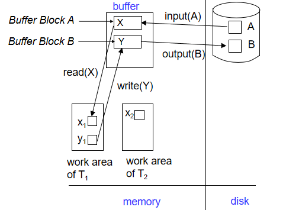
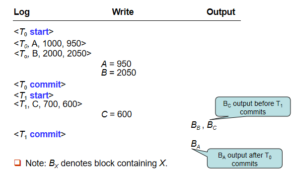
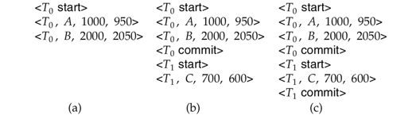
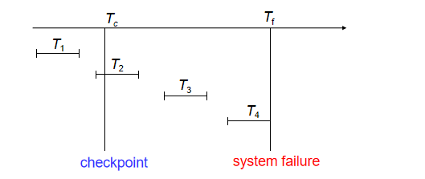
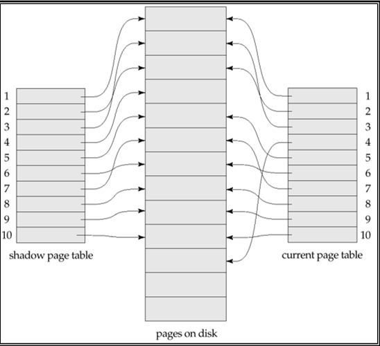

# Recovery


## Failure Classification

### Transaction Failure

- **Logical Errors**: Transaction cannot complete due to internal error conditions
    - Overflow
    - Bad input
    - Data not found
    - etc.

- **System Errors**: Database system must terminate an active transaction due to error conditions
   - Example: Deadlock

### System Crash

- Power failure or other hardware/software failures causing system crash
- **Fail-stop Assumption**: Non-volatile storage contents are assumed to not be corrupted by system crash
- Database systems implement numerous integrity checks to prevent disk data corruption

### Disk Failure

- Head crash or similar disk failure destroying all or part of disk storage
- **Destruction Assumption**: Failures are assumed to be detectable
   - Disk drives use checksums to detect failures

!!!info "Recovery Algorithms"
    Consider transaction Ti that transfers $50 from account A to account B
    >Two updates: subtract 50 from A and add 50 to B 
    
    Transaction Ti requires updates to A and B to be output to the database. 
    
    A failure may occur after one of these modifications have been made but before both of them are made. 
    
    Modifying the database without ensuring that the transaction will commit may leave the database in an inconsistent state
    
    Not modifying the database may result in lost updates if failure occurs just after transaction commits
    
    Recovery algorithms have two parts

    1. Actions taken during normal transaction processing to ensure enough information exists to recover from failures
    - Actions taken after a failure to recover the database contents to a state that ensures atomicity, consistency and durability

## Storage Structure

- Volatile storage:
    - Does not survive system crashes
    - Examples: main memory, cache memory

- Nonvolatile storage:
    - Survives system crashes
    - Examples: disk, tape, flash memory, 
        non-volatile (battery backed up) RAM 
    - But may still fail, losing data

- Stable storage:
    - A mythical form of storage that survives all failures
    - Approximated by maintaining multiple copies on distinct nonvolatile media

### Stable-Storage Implementation

- 在多个独立的非易失性存储介质上维护每个块的多个副本

- 副本可以存放在远程站点，以防止火灾或洪水等灾难

- 数据传输过程中的故障仍可能导致副本不一致：
    - 块传输可能导致：
        - 成功完成
        - 部分失败：目标块包含错误信息
        - 完全失败：目标块从未更新

- 保护存储介质在数据传输过程中免受故障（一种解决方案）：
    - 按以下方式执行输出操作（假设每个块有两个副本）：
        1. 将信息写入第一个物理块
        - 当第一次写入成功完成后，将相同的信息写入第二个物理块
        - 只有在第二次写入成功完成后，输出操作才算完成

- 由于输出操作期间的故障，块的副本可能不同。要从中恢复：

1. 首先找到不一致的块：
    - 昂贵方案：比较每个磁盘块的两个副本
    - 更好的方案：
        - 在非易失性存储上记录正在进行的磁盘写入（非易失性RAM或磁盘的特殊区域）
        - 在恢复期间使用此信息查找可能不一致的块，并仅比较这些块的副本
        - 在硬件RAID系统中使用

- 如果检测到不一致块的两个副本中的任何一个有错误（错误的校验和），则用另一个副本覆盖它
- 如果两个副本都没有错误但不同，则用第一个块覆盖第二个块

### Data Access

- 物理块(Physical blocks):
    - 存储在磁盘上的块
    - 通过input(B)操作将物理块B传输到主内存
    - 通过output(B)操作将缓冲区块B传输到磁盘,并替换相应的物理块

- 缓冲区块(Buffer blocks):
    - 临时存储在主内存中的块
    - 用于提高数据访问效率

- 数据项(Data items):
    - 为简化起见,假设每个数据项都能放入单个块中
    - 存储在单个块内部

- 块传输操作:
    - input(B): 将物理块B传输到主内存
    - output(B): 将缓冲区块B传输到磁盘

### Transaction Operations

- 每个事务Ti都有其私有的工作区，用于保存它访问和更新的所有数据项的本地副本
- Ti的数据项X的本地副本称为xi

- 在系统缓冲区块和事务私有工作区之间传输数据项的操作：
    - read(X)：将数据项X的值赋给局部变量xi
    - write(X)：将局部变量xi的值赋给缓冲区块中的数据项X
    - 注意：output(BX)不必立即跟随write(X)。系统可以在认为合适的时候执行输出操作

- 事务必须：
    - 在首次访问X之前执行read(X)（后续读取可以从本地副本进行）
    - write(X)可以在事务提交之前的任何时间执行

<figure markdown="span">
{ width="500" }
<figcaption>
Example of Data Access
</figcaption>
</figure>

## Log-Based Recovery

### Log Records

- 日志记录在稳定存储上维护
- 日志是一系列日志记录，记录了数据库上的更新活动
- 日志记录类型：
    - `<Ti start>`: 事务Ti开始时写入
    - `<Ti, X, V1, V2>`: 事务Ti执行write(X)前写入
        - V1: X的旧值
        - V2: 要写入X的新值
    - `<Ti commit>`: 事务Ti完成最后一条语句时写入


```Log
   <T1 start>
   <T1, A, 100, 200>
   <T2 start>
   <T2, B, 300, 400>
   <T3 start>
   <T1, C, 500, 600>
   <T1 commit>
   <T3, C, 600, 700>
   <T3, C, 700, 800>
    <T3 commit>
    <T2, C, 800, 900>
    <T2, B, 400, 500>
...
```

1. 延迟数据库修改(Deferred Database Modification)
    - 事务执行期间不修改数据库
    - 所有修改都记录在日志中
    - 事务提交时才将修改写入数据库
    - 优点：恢复简单，只需重做已提交事务
    - 缺点：需要大量日志空间

- 立即数据库修改(Immediate Database Modification)
    - 事务执行期间直接修改数据库（buffer或者disk）
    - 同时记录日志
    - 需要同时支持重做(redo)和撤销(undo)操作
    - 优点：减少日志空间需求
    - 缺点：恢复过程较复杂

!!!Note
    立即修改方案允许在事务提交前将未提交事务的更新写入缓冲区或磁盘本身。更新日志记录必须在数据库项写入前完成记录。我们假定日志记录直接输出到稳定存储。更新后的数据块输出到稳定存储可发生于事务提交前后的任意时刻，且数据块输出顺序与其写入顺序可以不同。

<figure markdown="span">
{ width="500" }
<figcaption>
Example of Deferred Database Modification
</figcaption>
</figure>

如果崩溃时稳定存储上的日志是以下情况：

a): 不需要redo

b): 需要redo，T0需要redo，T1不需要redo

c): 需要redo，T0和T1都需要redo


<figure markdown="span">
{ width="500" }
<figcaption>
Example of immediate database modification
</figcaption>
</figure>

!!!info "immediate database modification"
    恢复流程包含两个操作而非一个：
    
    - `undo(Ti)`: 将Ti事务更新的所有数据项恢复为旧值，从Ti的最后一个日志记录开始逆向处理
    - `redo(Ti)`: 将Ti事务更新的所有数据项设置为新值，从Ti的第一个日志记录开始正向处理
    
    这两个操作都必须满足幂等性。也就是说，即使操作被执行多次，效果与执行一次相同。这一特性是必需的，因为在恢复过程中
    操作可能会被重复执行。
    
    故障恢复时的处理规则：
    
    - 当日志包含`<Ti start>`记录但未包含`<Ti commit>`记录时，需要对事务Ti执行撤销操作
    - 当日志同时包含`<Ti start>`和`<Ti commit>`记录时，需要对事务Ti执行重做操作
    - 恢复时先执行所有`undo`操作，再执行所有`redo`操作


<figure markdown="span">
{ width="500" }
<figcaption>
Example of Recovery
</figcaption>
</figure>

在以下几种情况中恢复

a): undo T0,将B的值恢复为2000，A的值恢复为1000；

b): redo T0，undo T1：将C的值恢复为700，将A和B的值分别设置为950和2050（先执行undo，再执行redo）。日志记录<T1, C, 700>和<T1, abort>被写出。

c): redo T0，redo T1：将A和B的值分别设置为950和2050，然后将C的值设置为600。

### Checkpoints

Redo/undo 操作是非常慢的：

- Processing the entire log is time-consuming if the system has run for a long time
- We might unnecessarily redo transactions which have already output their updates to the database. 


Streamline recovery procedure by periodically performing checkpointing 

- Output all log records currently residing in main memory onto stable storage.
- Output all modified buffer blocks to the disk.
- Write a log record `< checkpoint L>` onto stable storage where L is a list of all transactions active at the time of checkpoint.
- All updates are stopped while doing checkpointing

通过定期检查点操作来简化恢复流程。


在恢复过程中，我们只需考虑checkpoint前最近启动的事务Ti，以及Ti之后启动的事务。从日志末尾反向扫描，找到最近的`<checkpoint L>`记录。只有L列表中或checkpoint后启动的事务需要重做或撤销。在checkpoint前已提交或中止的事务，其所有更新均已输出到稳定存储中。可能需要日志的较早部分用于撤销操作。继续反向扫描，直到为L列表中的每个事务Ti找到对应的`<Ti start>`记录。上述最早`<Ti start>`记录之前的日志部分在恢复时无需使用，可随时清除。


<figure markdown="span">
{ width="500" }
<figcaption>
Example of Checkpoint
</figcaption>
</figure>

T1可以被忽略，因为T1在checkpoint之前已经提交，其所有更新已经输出到稳定存储中。

T2和T3需要被重做，因为它们在checkpoint之后启动。

T4需要被撤销，因为它是中止的。

!!!Example
    假设我们有以下日志记录序列：

    ```
    <T1 start>
    <T1, A, 100, 200>
    <T1 commit>
    <T2 start>
    <T2, B, 300, 400>
    <checkpoint {T2}>
    <T3 start>
    <T3, C, 500, 600>
    <T2, D, 700, 800>
    <T2 commit>
    <T3, E, 900, 1000>
    系统崩溃
    ```

    - 首先从日志末尾反向扫描，找到最近的检查点记录：`<checkpoint {T2}>`

    - 根据检查点记录，我们知道：
        - T1 在检查点之前已经提交，其所有更新已经写入稳定存储，不需要处理
        - T2 在检查点时是活动事务，需要处理
        - T3 在检查点之后启动，需要处理

    - 继续反向扫描，找到 T2 和 T3 的 start 记录

    - 恢复处理：
        - T2 需要重做(redo)，因为它在检查点后提交了
        - T3 需要撤销(undo)，因为它在系统崩溃时还未提交

    - 具体操作：
        - 重做 T2 的更新：
            - 将 B 的值设为 400
            - 将 D 的值设为 800
    - 撤销 T3 的更新：
        - 将 C 的值恢复为 500
        - 将 E 的值恢复为 900

    - 检查点之前的日志记录（T1 相关的记录）可以安全清除，因为：
        - T1 已经提交
        - 所有更新都已写入稳定存储
        - 这些记录对恢复过程没有帮助


## Shadow Paging

!!!definition "Shadow Paging"
    Shadow paging is an alternative to log-based recovery;this scheme is useful if transactions execute serially 

    **Idea**:maintain two page tables during the lifetime of a transaction 
    –the current page table, and the shadow page table 
 
Store the shadow page table in nonvolatile storage, 
such that state of the database prior to transaction execution may be recovered. 

Shadow page table is never modified during execution

To start with, both the page tables are identical. 
Only current page table is used for data item accesses during execution of the transaction.

Whenever any page is about to be written for the first time

- A copy of this page is made onto an unused page. 
- The current page table is then made to point to the copy
- The update is performed on the copy

<figure markdown="span">
{ width="500" }
<figcaption>
Example of Shadow Paging
</figcaption>
</figure>

提交之前：

1. 将主内存中所有修改过的页面刷新到磁盘
- 将当前页表输出到磁盘
- 将当前页表设置为新的影子页表:
    - 在磁盘上的固定(已知)位置保存指向影子页表的指针
    - 通过更新指针指向磁盘上的当前页表,使当前页表成为新的影子页表

一旦影子页表指针被写入,事务就提交完成。

崩溃后不需要恢复 - 新事务可以立即开始,使用影子页表。

不在当前/影子页表中指向的页面应该被释放(垃圾回收)。


!!!Summary
    **优点**:

    - 不需要日志
    - 恢复速度快
    - 实现简单

    **缺点**:

    - 数据碎片化
    - 垃圾回收开销
    - 并发事务处理复杂
    - 不适合频繁更新的数据库

## Recovery With Concurrent Transactions

> We modify the log-based recovery schemes to allow multiple transactions to execute concurrently.

- 所有事务共享一个磁盘缓冲区和日志文件。
- 一个缓冲块可能包含多个事务更新的数据项。
- 使用严格两阶段锁(Strict 2PL)进行并发控制：
    - 排他锁(X-lock)持有到事务结束。
    - 未提交事务的更新对其他事务不可见。
- 日志记录方式与之前相同。
- 不同事务的日志记录在日志文件中交错排列。

### checkpoint

- 检查点记录格式为 `<checkpoint L>`，其中 L 是在检查点时活跃的事务列表，例如 `{ T2, T4 }`。
- 假设在执行检查点时没有更新正在进行。

### Recovery

- 恢复时需要考虑多个事务同时活跃的情况。
- 检查点后，恢复操作需要从最近的检查点开始，并根据日志记录恢复各个事务的状态。


!!!info "when the system recovers from a crash"
    - 首先，初始化 undo-list 和 redo-list 为空
    - 从尾至头扫描日志文件，直到找到第一个checkpoint，此时，对于每一个在这一过程中扫描到的事务，做以下事情
        - 如果扫描到的日志记录是 `<Ti commit>`，将Ti加入redo-list
        - 如果扫描到的日志记录是 `<Ti start>`，将Ti加入undo-list,当然，前提是它不在redo-list中
        - 如果扫描到的日志记录是 `<Ti abort>`，将Ti加入undo-list
    
    - 然后，对于在checkpoint中出现的每一个事务Ti，如果其不在redo-list中，则将Ti加入undo-list

    此刻，undo-list中包含所有需要撤销的事务，redo-list中包含所有需要重做的事务

    然后，恢复过程继续执行：

    - 从日志文件末尾开始反向扫描，直到遇到undo-list中每个事务的`<Ti start>`记录为止。
    - 在扫描过程中，对属于undo-list中事务的每条日志记录执行撤销操作。
    - 找到最近的`<checkpoint L>`记录。
    - 从`<checkpoint L>`记录开始向前扫描日志，直到日志末尾。
    - 在扫描过程中，对属于redo-list中事务的每条日志记录执行重做操作。

!!!Example
    假设我们有以下日志记录序列：
    
    ```
    <T0 start>
    <checkpoint {T0} >
    <T0, A, 0, 10>
    <T0 commit>
    <T1 start>
    <T1, A, 10, 15>
    <T2 start>                   ——————
    <T2, C, 0, 10>                 |  
    <T2, B, 10, 20>                |
    <checkpoint {T1, T2 } > ____   |    ————————
    <T3 start>               |     |       |
    <T1 commit>              |     |       |
    <T3, A, 15, 20>          |     |       |
    <T3, D, 0, 10>           |     |       |
    <T3 commit>              |     |       |
    - - -Crashed- - -       step1 step2-1 step2-2
    ```

    1. 初始化 undo-list {}, redo-list {}
    - 从尾至头扫描日志文件，直到找到第一个checkpoint `<checkpoint {T1,T2} >`，此时，undo-list = {T2}, redo-list = {T1,T3}
    
    开始恢复

    1. 从尾至头扫描日志文件，直到找到所有在undo-list中的事务的`<Ti start>`记录为止,在这里停在`<T2 start>`,撤销T2
    - 从`<checkpoint {T1,T2} >`开始向前扫描日志，直到日志末尾。
    - 对redo-list中的事务执行重做操作，重做T1和T3

## Buffer Management

- 通常，输出到稳定存储的单位是块，而日志记录通常比块小得多。

- 因此，日志记录会缓存在主存中，而不是直接输出到稳定存储。

- 日志记录会在以下情况下输出到稳定存储：
    1. 缓冲区中的日志记录块已满，
    2. 或者执行了强制日志操作。
        - 例如，发生检查点时。

- 强制日志（log force）用于通过将所有日志记录（包括提交记录`<Ti commit>`）强制输出到稳定存储来提交事务。

- 因此，可以通过单个输出操作输出多个日志记录，从而降低I/O成本。


!!!Note "Write-Ahead Logging (WAL) 先写日志规则"
    1. 日志记录按照创建的顺序输出到稳定存储。
    - 事务Ti只有在日志记录`<Ti commit>`已输出到稳定存储后，才进入提交状态。
    - 在`<Ti commit>`可以输出到稳定存储之前，所有与Ti相关的日志记录必须已经输出到稳定存储。
    - 在主存中的数据块输出到数据库之前，所有与该数据块相关的日志记录必须已经输出到稳定存储。（日志应先于数据写到磁盘）。 这一规则被称为先写日志规则（Write-Ahead Logging Rule, WAL）。
    严格来说，WAL只要求撤销信息被输出


数据库维护一个内存缓冲区，用于存储数据块。
当需要一个新的数据块时，如果缓冲区已满，则需要从缓冲区中移除一个现有的数据块。
如果被选择移除的数据块已被更新，则必须将其输出到磁盘。

恢复算法支持无强制策略，即在事务提交时，更新的数据块不需要被写入磁盘。
强制策略：要求在提交时将更新的数据块写入磁盘，这会导致提交操作更昂贵。

恢复算法支持抢占策略，即包含未提交事务更新的数据块可以在事务提交之前被写入磁盘。


- 如果一个包含未提交更新的块被输出到磁盘，首先将更新的日志记录（包含撤销信息）输出到稳定存储的日志中（先写日志规则）。

- 在块被输出到磁盘时，不应有更新正在进行。可以通过以下方式确保：
    - 在写入数据项之前，事务获取包含该数据项的块的独占锁。
    - 写入完成后可以释放锁。
    - 这种短时间持有的锁称为闩锁(latch)。

- 要将一个块输出到磁盘：
    1. 首先获取该块的独占闩锁(exclusive latch)。
        - 确保没有更新正在该块上进行。
    2. 然后执行日志刷新。
    3. 接着将块输出到磁盘。
    4. 最后释放该块的闩锁。

!!!info "缓冲区实现"
    数据库缓冲区可以通过以下两种方式实现：

    - 在为数据库保留的真实主存区域中实现。
    - 在虚拟内存中实现。

    在为数据库保留的主存中实现缓冲区有以下缺点：
    
    - 内存在预先分配时被划分为数据库缓冲区和应用程序，限制了灵活性。
    - 需求可能会发生变化，尽管操作系统最了解如何在任何时候划分内存，但它无法改变内存的分区。
    
    因此，使用虚拟内存实现数据库缓冲区可以提供更大的灵活性，因为操作系统可以动态管理内存的分配和使用。

    尽管存在一些缺点，数据库缓冲区通常在虚拟内存中实现：

    - 当操作系统需要驱逐一个已被修改的页面时，该页面会被写入磁盘上的交换空间。
    - 当数据库决定将缓冲区页面写入磁盘时，缓冲区页面可能在交换空间中，可能需要从磁盘上的交换空间读取并输出到数据库，导致额外的I/O操作！
    - 这种情况被称为双重分页问题。

    理想情况下，当操作系统需要从缓冲区驱逐一个页面时，它应该将控制权交给数据库，数据库应：

    - 如果页面被修改过，先将页面输出到数据库（确保先输出日志记录），而不是输出到交换空间。
    - 从缓冲区释放该页面，以供操作系统使用。

    这样可以避免双重分页，但常见的操作系统不支持这种功能。

## Failure with Loss of Nonvolatile Storage

在之前的讨论中，我们假设非易失性存储没有丢失。然而，为了应对非易失性存储的丢失，可以使用类似于检查点的技术。

这种技术要求定期将整个数据库内容转储到稳定存储中。在转储过程中，不允许有事务处于活动状态；因此，必须执行类似于检查点的过程。

具体步骤如下：

1. 将当前驻留在主存中的所有日志记录输出到稳定存储。
- 将所有缓冲区块输出到磁盘。
- 将数据库的内容复制到稳定存储。
- 在稳定存储的日志中输出一条记录<dump>。

通过这些步骤，可以确保即使在非易失性存储丢失的情况下，数据库的内容也能够被恢复。

## Disk Failure Recovery

为了从磁盘故障中恢复，可以从最近的转储中恢复数据库。然后，查阅日志并重做所有在转储后提交的事务。

这种方法可以扩展以允许在转储期间事务处于活动状态，称为模糊转储或在线转储。

在各种商业数据库管理系统中，使用了许多安全性和可靠性方法。商业数据库产品中有多种工具可用于帮助进行副本和恢复。


## Advanced Recovery Techniques

!!!definition "物理日志和逻辑日志"
    物理日志：准确记录了数据库的物理状态变化，即值的变化。例如`<Ti, X, V1, V2>`，表示事务Ti对数据项X的值从V1更新为V2。
    
    逻辑日志：记录了事务的逻辑操作，而不是具体的值。例如`<Ti, Oj, operation-begin,U>`，表示事务Ti开始执行操作Oj，U是操作Oj的撤销信息。例如某个操作的物理日志为`<Ti, A, 600, 500>`，则其逻辑日志为`<Ti, A, operation-begin,U>`，其中U为`<A+100>`。

在高并发环境中，支持锁定技术是至关重要的，尤其是在处理B+-树的并发控制时。B+-树的插入和删除操作通常会提前释放锁。这些操作不能通过恢复旧值（物理撤销）来撤销，因为一旦锁被释放，其他事务可能已经更新了B+-树。

相反，插入（或删除）操作的撤销是通过执行删除（或插入）操作来实现的，这被称为逻辑撤销。对于这样的操作，撤销日志记录应包含要执行的撤销操作，这被称为逻辑撤销日志记录，与物理撤销日志记录相对。

即使对于这样的操作，重做信息也是以物理方式记录的（即每次写入的新值）。逻辑重做非常复杂，因为磁盘上的数据库状态可能不是“操作一致”的。

操作日志记录如下：

- 当操作开始时，记录日志 <Ti, Oj, operation-begin>。其中 Oj 是操作实例的唯一标识符。
- 当操作正在执行时，记录包含物理重做和物理撤销信息的普通日志记录。
- 当操作完成时，记录日志 <Ti, Oj, operation-end, U>，其中 U 包含执行逻辑撤销所需的信息。

如果在操作完成之前发生崩溃/回滚：

- 找不到 operation-end 日志记录，
- 使用物理撤销信息来撤销操作。

如果在操作完成之后发生崩溃/回滚：

- 找到 operation-end 日志记录，在这种情况下，
- 使用 U 执行逻辑撤销；忽略操作的物理撤销信息。

操作的重做（崩溃后）仍然使用物理重做信息。

!!!note "transaction 和 operation的区别"
    在数据库系统中，transaction（事务）和operation（操作）是两个不同的概念：

    - **Transaction（事务）**: 
        - 事务是一个逻辑上的工作单元，由一组操作组成，这些操作要么全部成功，要么全部失败。事务具有ACID特性，即原子性（Atomicity）、一致性（Consistency）、隔离性（Isolation）和持久性（Durability）。
        - 事务的主要目的是确保数据库从一个一致性状态转换到另一个一致性状态，即使在系统故障的情况下，也能通过回滚或重做来保持数据的一致性。

    - **Operation（操作）**:
        - 操作是事务中的基本组成部分，通常指对数据库的单个读或写动作。例如，插入、更新、删除或查询都是操作。
        - 操作是事务执行的具体步骤，多个操作组合在一起形成一个完整的事务。

    简而言之，事务是由多个操作组成的一个完整的逻辑单元，而操作是事务中的具体执行步骤。

!!!key-point "rollback a transaction"
    回滚事务 Ti 的过程如下：
    
    1. 反向扫描日志
    - 如果找到日志记录 `<Ti, X, V1, V2>`，执行撤销操作，并记录一个特殊的仅重做日志记录 `<Ti, X, V1>`。
    - 如果找到 `<Ti, Oj, operation-end, U>` 记录：
        - 使用撤销信息 U 逻辑地回滚操作。
        - 回滚期间执行的更新与正常操作执行时一样被记录。
        - 在操作回滚结束时，不记录 operation-end 记录，而是生成一条记录 `<Ti, Oj, operation-abort>`。
    - a 如果找到仅重做记录，忽略它。
    - b 如果找到 `<Ti, Oj, operation-abort>` 记录：
          - 跳过 Ti 的所有前面的日志记录，直到找到记录 `<Ti, Oj, operation-begin>`。
    - 当找到记录 `<Ti, start>` 时停止扫描。
    - 在日志中添加一条 `<Ti, abort>` 记录。

    !!!note "注意事项"
        上述情况a和情况b只有在数据库在回滚事务时崩溃时才会发生。
        如情况b中所述，跳过日志记录对于防止同一操作的多次回滚是至关重要的。


## ARIES Recovery Algorithm

## Remote Backup Systems


