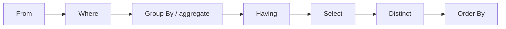

# SQL 

SQL includes several parts:

- DDL: Data Definition Language
- DML: Data Manipulation Language
- DQL: Data Query Language
- DCL: Data Control Language


## Data Definition Language

The main functions of DDL contain:

- Define the *schema* for each relation
- Define the *domain* of values associated with each attribute
- Define the *integrity constraints*
- Define the *physical storage structure* of each relation on disk
- Define the *indices* to be maintained for each relations
- Define the *view* on relations

For example,if we want to define a table named `branch`

```sql
CREATE TABLE branch (
    branch_name VARCHAR(20) PRIMARY KEY,
    branch_city VARCHAR(20),
    assets NUMERIC(12, 2)
);
```

or

```sql
CREATE TABLE branch (
    branch_name CHAR(15) NOT NULL,
    branch_city VARCHAR(30),
    assets NUMERIC(8, 2),
    PRIMARY KEY (branch_name)
);
```


### Domain types

- `CHAR(n)`: fixed length character string,with user-specified length
- `VARCHAR(n)`: variable length character string,with user-specified maximum length
- `INT` or `INTEGER`: integer number
- `SMALLINT`: small integer number
- `NUMERIC(p, d)`: fixed point number with user-specified precision and scale(总共为p位有效位,其中小数点后有d位)
- `FLOAT(n)`: floating point number with user-specified precision,if `n` is omitted,the precision is 24
- `REAL`: floating point number with user-specified precision,such as 3.14，`REAL` is equivalent to `FLOAT(24)`
- `DOUBLE` or `DOUBLE PRECISION`: double precision floating point number
- `NULL`: no value
- `DATE`: date in the format YYYY-MM-DD,such as 2025-03-01
- `TIME`: time in the format HH:MM:SS,such as 12:00:00
- `TIMESTAMP`: date and time in the format YYYY-MM-DD HH:MM:SS,such as 2025-03-01 12:00:00


SQL provides various functions for data manipulation and type conversion, though the implementation may vary across different database systems. Here are some examples:

- String functions:
    - `CHAR(n)`: Convert ASCII code n to character,in Oracle,it is `CHR(n)`
    - `SUBSTRING(str, start, length)`: Extract substring from position start with given length,in Oracle,it is `SUBSTR(str, start, length)`
    - `LEN(str)`: Get length of string,in Oracle,it is `LENGTH(str)`
    - `GETDATE()`: Get current date and time,in Oracle,it is `SYSDATE`
    - `DATALENGTH(str)`: Get number of bytes used to represent string
    - `CONCAT(str1, str2)`: Concatenate two or more strings
    - `UPPER(str)`: Convert string to uppercase
    - `LOWER(str)`: Convert string to lowercase
    - `LTRIM(str)`: Remove leading spaces
    - `RTRIM(str)`: Remove trailing spaces

- Numeric functions:
    - `ABS(n)`: Absolute value
    - `ROUND(n, d)`: Round number to d decimal places
    - `CEILING(n)`: Round up to nearest integer
    - `FLOOR(n)`: Round down to nearest integer
    - `POWER(x, y)`: x raised to power y
    - `SQRT(n)`: Square root

- Date functions:
    - `GETDATE()`: Current date and time
    - `DATEADD(part, n, date)`: Add n units to date
    - `DATEDIFF(part, date1, date2)`: Difference between dates
    - `YEAR(date)`: Extract year
    - `MONTH(date)`: Extract month
    - `DAY(date)`: Extract day

### Create Table

An SQL relation is define using the `CREATE TABLE` statement.

```sql
CREATE TABLE r (
    A1 D1,
    A2 D2,
    ...,
    An Dn,
    (integrity constraint1),
    ...,
    (integrity constraintk)
);
```

- r is the name of the relation
- Each Ai is an attribute name in the schema of relation r
- Di is the data type of values in the domain of attribute Ai
- integrity constrainti is a constraint on the values of attribute Ai,即完整性约束条件，例如外键约束，主键约束，唯一约束，检查约束等
  

#### Integrity Constraints

- **Not NULL**: The attribute cannot be NULL
  ```sql
  CREATE TABLE employees (
      employee_id INT NOT NULL,
      first_name VARCHAR(50),
      last_name VARCHAR(50) NOT NULL
  );
  ```

- **Primary Key**: The attribute is the primary key of the relation
  ```sql
  CREATE TABLE departments (
      department_id INT PRIMARY KEY,
      department_name VARCHAR(50) NOT NULL
  );
  ```

- **Check**: The attribute must satisfy a specified condition
  ```sql
  CREATE TABLE products (
      product_id INT PRIMARY KEY,
      price DECIMAL(10, 2) CHECK (price > 0)
  );
  ```

- **Unique**: The attribute must be unique
  ```sql
  CREATE TABLE users (
      user_id INT PRIMARY KEY,
      email VARCHAR(100) UNIQUE
  );
  ```

- **Foreign Key**: The attribute must be a foreign key of the relation
  ```sql
  CREATE TABLE orders (
      order_id INT PRIMARY KEY,
      customer_id INT,
      FOREIGN KEY (customer_id) REFERENCES customers(customer_id)
  );
  ```

- **Default**: The attribute must have a default value
  ```sql
  CREATE TABLE settings (
      setting_id INT PRIMARY KEY,
      theme VARCHAR(20) DEFAULT 'light'
  );
  ```

- **Index**: The attribute must be indexed
  ```sql
  CREATE INDEX idx_last_name ON employees(last_name);
  ```

- **View**: The attribute must be a view of the relation
  ```sql
  CREATE VIEW employee_view AS
  SELECT employee_id, first_name, last_name FROM employees;
  ```

- **Trigger**: The attribute must be a trigger of the relation
  ```sql
  CREATE TRIGGER update_stock
  AFTER INSERT ON sales
  FOR EACH ROW
  BEGIN
      UPDATE products SET stock = stock - NEW.quantity WHERE product_id = NEW.product_id;
  END;
  ```

> Primary key declaration on an attribute automatically ensures not null in SQL_92 onwards, needs to be explicitly stated in SQL_89 

Another way to use integrity constraints is 

```sql
CREATE TABLE employees (
    employee_id INT,
    primary key (employee_id)
);
```

### DROP and ALTER Table

<div style="text-align: center;">
<strong style="font-size: 2em;color: red;">Be careful to use the DROP command!!!</strong>
</div>

#### Drop Table

the drop table statement is used to delete a table from the database.

```sql
DROP TABLE employees;
```

#### Alter Table

the alter table statement is used to modify the structure of a table.


the format is 

```sql
ALTER TABLE table_name ADD column_name data_type;
-- add a new column
ALTER TABLE table_name ADD (column_name data_type, column_name data_type, ...);
-- add multiple columns
ALTER TABLE table_name DROP COLUMN column_name;
-- drop a column
ALTER TABLE table_name MODIFY column_name data_type;
-- modify the data type of a column
```


```sql
ALTER TABLE employees ADD COLUMN email VARCHAR(100);
```

#### Create Index

Index is a data structure that improves the performance of database queries by allowing the database to quickly locate the data without having to scan the entire table.

```sql
CREATE INDEX index_name ON table_name(attribute_list);
-- unique index
CREATE UNIQUE INDEX index_name ON table_name(attribute_list);
-- drop index
DROP INDEX index_name;
```

Example:

```sql
CREATE INDEX idx_last_name ON employees(last_name);
```
## Basic Structure

### The select clause

The select clause is used to select the data from the database.

```sql
SELECT attribute_list FROM table_name;
```

such as:

```sql
SELECT * FROM employees;
```

where `*` is the wildcard character, it means all the attributes.

SQL allows duplicates in relations as well as in query results. 

```sql
SELECT DISTINCT attribute_list FROM table_name;
```

where `DISTINCT` is used to remove duplicates.

the opposite of `DISTINCT` is `ALL`, which means all the duplicates are kept.

```sql
SELECT ALL attribute_list FROM table_name;
```

By default, the select clause returns all the attributes of the relation.

### The where clause

The where clause is used to filter the data from the database.

```sql
SELECT attribute_list FROM table_name WHERE condition;
```

such as:

```sql
SELECT * FROM employees WHERE salary > 5000;
```

Comparison results can be combined using the logical connectives:

- `AND`: Both conditions must be true
- `OR`: At least one condition must be true  
- `NOT`: Negates a condition

The `BETWEEN` operator can be used to specify a range:

```sql
SELECT loan_number, amount
FROM loan
WHERE amount BETWEEN 1000 AND 10000 AND branch_name = 'Downtown';
```

The `IN` operator can be used to specify a list of values:

```sql
SELECT loan_number, amount
FROM loan
WHERE amount IN (1000, 2000, 3000);
```

### The from clause

The from clause is used to specify the table from which to select the data.

```sql
SELECT attribute_list FROM table_name1, table_name2, ...;
```

such as:

```sql
SELECT branch_name, branch_city
FROM branch, account
WHERE branch.branch_name = account.branch_name;
```

This will return a Cartesian product of the two tables.

if there are multiple tables contain the same attribute, we need to use the table name to specify the attribute.

```sql
SELECT branch.branch_name, branch_city, account.account_number
FROM branch, account
WHERE branch.branch_name = account.branch_name;
```

### The rename operation


The rename operation is used to rename the attributes of the relation.

```sql
SELECT attribute_list AS new_attribute_list FROM table_name;
```

such as:

```sql
SELECT branch_name AS branch, branch_city AS city
FROM branch;
```

Tuple variables are defined in the FROM clause via the use of the as clause. 

```sql
SELECT customer_name, T.loan_number, S.amount 
FROM borrower as T, loan as S 
WHERE T.loan_number = S.loan_number 
AND S.amount > 10000;
```

In SQL, the use of the `AS` keyword to define the table alias is optional. The alias can be defined directly in the `FROM` clause without using the `AS` keyword. Therefore, you can remove the `AS` keyword, and the code will still work. Here is the code without the `AS` keyword:

```sql
SELECT customer_name, T.loan_number, S.amount 
FROM borrower T, loan S 
WHERE T.loan_number = S.loan_number 
AND S.amount > 10000;
```

!!!question
    Find the names of all branches that have greater assets than some branch located in city Brooklyn. 

    ```sql
    SELECT DISTINCT T.branch_name
    FROM branch AS T, branch AS S
    WHERE T.assets > S.assets 
        AND S.branch_city = 'Brooklyn';
    ```
    
### String operation


#### fuzzy matching
SQL includes a string-matching operator for comparisons on character strings. Patterns are described using the following two special characters: 

- `%`: Matches any sequence of characters
- `_`: Matches any single character


with this,we can achieve the fuzzy matching.

```sql
SELECT * FROM employees WHERE last_name LIKE 'S%';
```

This will return all the employees whose last name starts with 'S'.

```sql
SELECT * FROM employees WHERE last_name LIKE '_o%';
```

This will return all the employees whose last name has 'o' as the second character.

It should be use in the where clause and must be used in conjunction with the `LIKE` operator.

#### other string operations

SQL provides the `||` operator to concatenate strings.

```sql
SELECT 'Hello' || ' ' || 'World';
```

This will return 'Hello World'.

Converting string from upper case to lower case:

```sql
SELECT LOWER('Hello');
-- output: hello
SELECT UPPER('Hello');
-- output: HELLO
```

### Ordering the display of results

ordering the display of results is achieved by using the `ORDER BY` clause.

```sql
SELECT attribute_list FROM table_name WHERE condition ORDER BY attribute_name;
```

We may specify desc for descending order or asc for ascending order, and for each attribute, ascending order is the default. 

```sql
SELECT * FROM employees ORDER BY salary DESC;
```

This will return all the employees sorted by salary in descending order.

## SET Operations

In SQL, use the set operations including `UNION`, `INTERSECT`, and `EXCEPT` operate on relations as well as correspond to the relational algebra operations $\cup$, $\cap$, and $\setminus$.

Each of the operations including `UNION`, `INTERSECT`, and `EXCEPT` automatically eliminates duplicates. To retain duplicates, use `UNION ALL`, `INTERSECT ALL`, and `EXCEPT ALL` instead.

!!!Example
     Find all customers who have a loan or an account or both. 

     ```sql
     SELECT customer_name FROM borrower
     UNION
     SELECT customer_name FROM depositor;
     ```

     Find all customers who have both a loan and an account.

     ```sql
     SELECT customer_name FROM borrower
     INTERSECT
     SELECT customer_name FROM depositor;
     ```

     Find all customers who have a loan but not an account.

     ```sql
     SELECT customer_name FROM borrower
     EXCEPT
     SELECT customer_name FROM depositor;
     ```

## Aggregate Functions

Aggregate functions are used to perform calculations on a set of values(a column) and return a single value.

- `COUNT`: Counts the number of rows
- `SUM`: Calculates the sum of a set of values
- `AVG`: Calculates the average of a set of values
- `MAX`: Finds the maximum value
- `MIN`: Finds the minimum value

Such as:

```sql
SELECT COUNT(*) as total_employees FROM employees;
```

This will return the number of rows in the employees table.

!!!Note
    The `COUNT(*)` function counts all rows, including those with null values.

    But `COUNT(attribute_name)` function counts only the rows where the attribute is not null.

    We can also use `COUNT(distinct attribute_name)` to count the number of distinct values in a column.


### Group By

```sql
SELECT branch_name, avg(balance) avg_bal 
FROM account 
WHERE branch_name = 'Perryridge';
```

在 SQL 中，当你在 `SELECT` 子句中使用聚合函数（例如 `AVG`、`SUM` 等）时，所有不在聚合函数中的属性（字段）必须出现在 `GROUP BY` 子句中。这是因为 SQL 需要知道如何对数据进行分组，以便正确地计算聚合值。

否则在这种情况下，在前面要求了挑出Branch_name,where 中又要求branch_name = 'Perryridge'；没什么意义

正确的写法是：

```sql
SELECT branch_name, avg(balance) avg_bal 
FROM account 
GROUP BY branch_name;
```
### Having

The `HAVING` clause is used to filter the results of a `GROUP BY` operation.

```sql
SELECT branch_name, avg(balance) avg_bal 
FROM account 
GROUP BY branch_name HAVING avg(balance) > 1000;
```

This will return all the branches whose average balance is greater than 1000.


## Summary of Select

Select 语句的完整语法如下：

```sql
SELECT <[DISTINCT] c1, c2, …> 
		FROM <r1, …> 
		[WHERE <condition>] 
		[GROUP BY <c1, c2, …> [HAVING <condition>]] 
		[ORDER BY <c1 [DESC] [, c2 [DESC|ASC], …]>] 
```

[] 表示可选部分

其执行顺序为



<div style="text-align: center;font-size: 1em;color: blue;">Note that predicates in the having clause are applied after the formation of groups, whereas predicates in the where clause are applied before forming groups.</div>


## Null Values

Null is a special marker used in SQL and was first introduced by E.F. Codd in 1974.

The meaning of null is that the value is unknown or not applicable.

The result of any arithmetic operation involving null is null.
> 5+null = null

Any comparison involving null is 'unknown', which is neither true nor false.
> null = null is unknown

!!!info "unknown"
    Three-valued logic using the truth value unknown: (true, false, unknown)

    - `OR` operation: 
        - (unknown OR true) = true
        - (unknown OR false) = unknown 
        - (unknown OR unknown) = unknown

    - `AND` operation:
        - (unknown AND true) = unknown
        - (unknown AND false) = false
        - (unknown AND unknown) = unknown

    - `NOT` operation:
        - (NOT unknown) = unknown

    - `=` operation:
        - (unknown = unknown) = unknown

    - `!=` operation:
        - (unknown != unknown) = unknown

 
The predicate `IS NULL`  and `IS NOT NULL` are used to test for null values.
>recall that the primary key of a relation cannot be null.

!!!Example
    Find all loan number which appears in the loan relation with null values for amount. 

    ```sql
    SELECT loan_number
    FROM loan
    WHERE amount IS NULL;
    ```

    we cannot use `=` to test for null values,the result will return null.

    see as follows:

    <figure markdown="span">
    { width="300" }
    </figure>

### Null Values in Aggregate Functions


```sql
SELECT sum(balance) FROM account;
```

This will return the sum of the balance of all the accounts.Result is null if there is no non-null values.


All aggregate operations **except count(*)** ignore tuples with null values on the aggregated attributes. 


## Nested Subqueries

Nested subqueries in SQL are queries within queries. They allow you to perform more complex queries by embedding one query inside another. This is particularly useful when you need to filter data based on the results of another query.

### Basic Structure

A nested subquery is typically found in the `WHERE` clause of a SQL statement. The subquery is executed first, and its result is used by the outer query.

```sql
SELECT column1, column2
FROM table1
WHERE column3 <operator> (
    SELECT column3
    FROM table2
    WHERE condition
);
```

the `<operator>` can be `=`, `!=`, `>`, `>=`, `<`, `<=`, `IN`, `NOT IN`, `ANY`, `ALL`, `EXISTS`, `NOT EXISTS`. 

it can also be nested in the FROM clause.

```sql
SELECT column1, column2
FROM (SELECT column3 FROM table2 WHERE condition) as subquery;
```
or in the having clause such as:

```sql
SELECT department, AVG(salary) AS avg_salary
FROM employees
GROUP BY department
HAVING AVG(salary) > (SELECT AVG(salary) FROM employees);
```
> 找出每个 [部门平均工资] 大于[所有员工平均工资]的部门。


!!!Example
    Find all customers who have both an account and a loan at the bank. 
    
    ```sql
    SELECT customer_name
    FROM borrower
    WHERE customer_id IN (
        SELECT customer_id
        FROM depositor
    );
    ```

    recall that we can also use the set operation to achieve the same result.

    ```sql
    SELECT customer_name
    FROM borrower
    INTERSECT
    SELECT customer_name FROM depositor;
    ```


