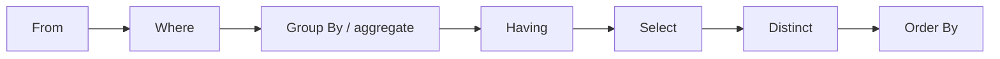

# SQL 

SQL includes several parts:

- DDL: Data Definition Language
- DML: Data Manipulation Language
- DQL: Data Query Language
- DCL: Data Control Language


## Data Definition Language

The main functions of DDL contain:

- Define the *schema* for each relation
- Define the *domain* of values associated with each attribute
- Define the *integrity constraints*
- Define the *physical storage structure* of each relation on disk
- Define the *indices* to be maintained for each relations
- Define the *view* on relations

For example,if we want to define a table named `branch`

```sql
CREATE TABLE branch (
    branch_name VARCHAR(20) PRIMARY KEY,
    branch_city VARCHAR(20),
    assets NUMERIC(12, 2)
);
```

or

```sql
CREATE TABLE branch (
    branch_name CHAR(15) NOT NULL,
    branch_city VARCHAR(30),
    assets NUMERIC(8, 2),
    PRIMARY KEY (branch_name)
);
```


### Domain types

- `CHAR(n)`: fixed length character string,with user-specified length
- `VARCHAR(n)`: variable length character string,with user-specified maximum length
- `INT` or `INTEGER`: integer number
- `SMALLINT`: small integer number
- `NUMERIC(p, d)`: fixed point number with user-specified precision and scale(总共为p位有效位,其中小数点后有d位)
- `FLOAT(n)`: floating point number with user-specified precision,if `n` is omitted,the precision is 24
- `REAL`: floating point number with user-specified precision,such as 3.14，`REAL` is equivalent to `FLOAT(24)`
- `DOUBLE` or `DOUBLE PRECISION`: double precision floating point number
- `NULL`: no value
- `DATE`: date in the format YYYY-MM-DD,such as 2025-03-01
- `TIME`: time in the format HH:MM:SS,such as 12:00:00
- `TIMESTAMP`: date and time in the format YYYY-MM-DD HH:MM:SS,such as 2025-03-01 12:00:00


SQL provides various functions for data manipulation and type conversion, though the implementation may vary across different database systems. Here are some examples:

- String functions:
    - `CHAR(n)`: Convert ASCII code n to character,in Oracle,it is `CHR(n)`
    - `SUBSTRING(str, start, length)`: Extract substring from position start with given length,in Oracle,it is `SUBSTR(str, start, length)`
    - `LEN(str)`: Get length of string,in Oracle,it is `LENGTH(str)`
    - `GETDATE()`: Get current date and time,in Oracle,it is `SYSDATE`
    - `DATALENGTH(str)`: Get number of bytes used to represent string
    - `CONCAT(str1, str2)`: Concatenate two or more strings
    - `UPPER(str)`: Convert string to uppercase
    - `LOWER(str)`: Convert string to lowercase
    - `LTRIM(str)`: Remove leading spaces
    - `RTRIM(str)`: Remove trailing spaces

- Numeric functions:
    - `ABS(n)`: Absolute value
    - `ROUND(n, d)`: Round number to d decimal places
    - `CEILING(n)`: Round up to nearest integer
    - `FLOOR(n)`: Round down to nearest integer
    - `POWER(x, y)`: x raised to power y
    - `SQRT(n)`: Square root

- Date functions:
    - `GETDATE()`: Current date and time
    - `DATEADD(part, n, date)`: Add n units to date
    - `DATEDIFF(part, date1, date2)`: Difference between dates
    - `YEAR(date)`: Extract year
    - `MONTH(date)`: Extract month
    - `DAY(date)`: Extract day

### Create Table

An SQL relation is define using the `CREATE TABLE` statement.

```sql
CREATE TABLE r (
    A1 D1,
    A2 D2,
    ...,
    An Dn,
    (integrity constraint1),
    ...,
    (integrity constraintk)
);
```

- r is the name of the relation
- Each Ai is an attribute name in the schema of relation r
- Di is the data type of values in the domain of attribute Ai
- integrity constrainti is a constraint on the values of attribute Ai,即完整性约束条件，例如外键约束，主键约束，唯一约束，检查约束等
  

#### Integrity Constraints

- **Not NULL**: The attribute cannot be NULL
  ```sql
  CREATE TABLE employees (
      employee_id INT NOT NULL,
      first_name VARCHAR(50),
      last_name VARCHAR(50) NOT NULL
  );
  ```

- **Primary Key**: The attribute is the primary key of the relation
  ```sql
  CREATE TABLE departments (
      department_id INT PRIMARY KEY,
      department_name VARCHAR(50) NOT NULL
  );
  ```

- **Check**: The attribute must satisfy a specified condition
  ```sql
  CREATE TABLE products (
      product_id INT PRIMARY KEY,
      price DECIMAL(10, 2) CHECK (price > 0)
  );
  ```

- **Unique**: The attribute must be unique
  ```sql
  CREATE TABLE users (
      user_id INT PRIMARY KEY,
      email VARCHAR(100) UNIQUE
  );
  ```

- **Foreign Key**: The attribute must be a foreign key of the relation
  ```sql
  CREATE TABLE orders (
      order_id INT PRIMARY KEY,
      customer_id INT,
      FOREIGN KEY (customer_id) REFERENCES customers(customer_id)
  );
  ```

- **Default**: The attribute must have a default value
  ```sql
  CREATE TABLE settings (
      setting_id INT PRIMARY KEY,
      theme VARCHAR(20) DEFAULT 'light'
  );
  ```

- **Index**: The attribute must be indexed
  ```sql
  CREATE INDEX idx_last_name ON employees(last_name);
  ```

- **View**: The attribute must be a view of the relation
  ```sql
  CREATE VIEW employee_view AS
  SELECT employee_id, first_name, last_name FROM employees;
  ```

- **Trigger**: The attribute must be a trigger of the relation
  ```sql
  CREATE TRIGGER update_stock
  AFTER INSERT ON sales
  FOR EACH ROW
  BEGIN
      UPDATE products SET stock = stock - NEW.quantity WHERE product_id = NEW.product_id;
  END;
  ```

> Primary key declaration on an attribute automatically ensures not null in SQL_92 onwards, needs to be explicitly stated in SQL_89 

Another way to use integrity constraints is 

```sql
CREATE TABLE employees (
    employee_id INT,
    primary key (employee_id)
);
```

### DROP and ALTER Table

<div style="text-align: center;">
<strong style="font-size: 2em;color: red;">Be careful to use the DROP command!!!</strong>
</div>

#### Drop Table

the drop table statement is used to delete a table from the database.

```sql
DROP TABLE employees;
```

#### Alter Table

the alter table statement is used to modify the structure of a table.


the format is 

```sql
ALTER TABLE table_name ADD column_name data_type;
-- add a new column
ALTER TABLE table_name ADD (column_name data_type, column_name data_type, ...);
-- add multiple columns
ALTER TABLE table_name DROP COLUMN column_name;
-- drop a column
ALTER TABLE table_name MODIFY column_name data_type;
-- modify the data type of a column
```


```sql
ALTER TABLE employees ADD COLUMN email VARCHAR(100);
```

#### Create Index

Index is a data structure that improves the performance of database queries by allowing the database to quickly locate the data without having to scan the entire table.

```sql
CREATE INDEX index_name ON table_name(attribute_list);
-- unique index
CREATE UNIQUE INDEX index_name ON table_name(attribute_list);
-- drop index
DROP INDEX index_name;
```

Example:

```sql
CREATE INDEX idx_last_name ON employees(last_name);
```
## Basic Structure

### The select clause

The select clause is used to select the data from the database.

```sql
SELECT attribute_list FROM table_name;
```

such as:

```sql
SELECT * FROM employees;
```

where `*` is the wildcard character, it means all the attributes.

SQL allows duplicates in relations as well as in query results. 

```sql
SELECT DISTINCT attribute_list FROM table_name;
```

where `DISTINCT` is used to remove duplicates.

the opposite of `DISTINCT` is `ALL`, which means all the duplicates are kept.

```sql
SELECT ALL attribute_list FROM table_name;
```

By default, the select clause returns all the attributes of the relation.

### The where clause

The where clause is used to filter the data from the database.

```sql
SELECT attribute_list FROM table_name WHERE condition;
```

such as:

```sql
SELECT * FROM employees WHERE salary > 5000;
```

Comparison results can be combined using the logical connectives:

- `AND`: Both conditions must be true
- `OR`: At least one condition must be true  
- `NOT`: Negates a condition

The `BETWEEN` operator can be used to specify a range:

```sql
SELECT loan_number, amount
FROM loan
WHERE amount BETWEEN 1000 AND 10000 AND branch_name = 'Downtown';
```

The `IN` operator can be used to specify a list of values:

```sql
SELECT loan_number, amount
FROM loan
WHERE amount IN (1000, 2000, 3000);
```

### The from clause

The from clause is used to specify the table from which to select the data.

```sql
SELECT attribute_list FROM table_name1, table_name2, ...;
```

such as:

```sql
SELECT branch_name, branch_city
FROM branch, account
WHERE branch.branch_name = account.branch_name;
```

This will return a Cartesian product of the two tables.

if there are multiple tables contain the same attribute, we need to use the table name to specify the attribute.

```sql
SELECT branch.branch_name, branch_city, account.account_number
FROM branch, account
WHERE branch.branch_name = account.branch_name;
```

### The rename operation


The rename operation is used to rename the attributes of the relation.

```sql
SELECT attribute_list AS new_attribute_list FROM table_name;
```

such as:

```sql
SELECT branch_name AS branch, branch_city AS city
FROM branch;
```

Tuple variables are defined in the FROM clause via the use of the as clause. 

```sql
SELECT customer_name, T.loan_number, S.amount 
FROM borrower as T, loan as S 
WHERE T.loan_number = S.loan_number 
AND S.amount > 10000;
```

In SQL, the use of the `AS` keyword to define the table alias is optional. The alias can be defined directly in the `FROM` clause without using the `AS` keyword. Therefore, you can remove the `AS` keyword, and the code will still work. Here is the code without the `AS` keyword:

```sql
SELECT customer_name, T.loan_number, S.amount 
FROM borrower T, loan S 
WHERE T.loan_number = S.loan_number 
AND S.amount > 10000;
```

!!!question
    Find the names of all branches that have greater assets than some branch located in city Brooklyn. 

    ```sql
    SELECT DISTINCT T.branch_name
    FROM branch AS T, branch AS S
    WHERE T.assets > S.assets 
        AND S.branch_city = 'Brooklyn';
    ```
    
### String operation


#### fuzzy matching
SQL includes a string-matching operator for comparisons on character strings. Patterns are described using the following two special characters: 

- `%`: Matches any sequence of characters
- `_`: Matches any single character


with this,we can achieve the fuzzy matching.

```sql
SELECT * FROM employees WHERE last_name LIKE 'S%';
```

This will return all the employees whose last name starts with 'S'.

```sql
SELECT * FROM employees WHERE last_name LIKE '_o%';
```

This will return all the employees whose last name has 'o' as the second character.

It should be use in the where clause and must be used in conjunction with the `LIKE` operator.

#### other string operations

SQL provides the `||` operator to concatenate strings.

```sql
SELECT 'Hello' || ' ' || 'World';
```

This will return 'Hello World'.

Converting string from upper case to lower case:

```sql
SELECT LOWER('Hello');
-- output: hello
SELECT UPPER('Hello');
-- output: HELLO
```

### Ordering the display of results

ordering the display of results is achieved by using the `ORDER BY` clause.

```sql
SELECT attribute_list FROM table_name WHERE condition ORDER BY attribute_name;
```

We may specify desc for descending order or asc for ascending order, and for each attribute, ascending order is the default. 

```sql
SELECT * FROM employees ORDER BY salary DESC;
```

This will return all the employees sorted by salary in descending order.

## SET Operations

In SQL, use the set operations including `UNION`, `INTERSECT`, and `EXCEPT` operate on relations as well as correspond to the relational algebra operations $\cup$, $\cap$, and $\setminus$.

Each of the operations including `UNION`, `INTERSECT`, and `EXCEPT` automatically eliminates duplicates. To retain duplicates, use `UNION ALL`, `INTERSECT ALL`, and `EXCEPT ALL` instead.

!!!Example
     Find all customers who have a loan or an account or both. 

     ```sql
     SELECT customer_name FROM borrower
     UNION
     SELECT customer_name FROM depositor;
     ```

     Find all customers who have both a loan and an account.

     ```sql
     SELECT customer_name FROM borrower
     INTERSECT
     SELECT customer_name FROM depositor;
     ```

     Find all customers who have a loan but not an account.

     ```sql
     SELECT customer_name FROM borrower
     EXCEPT
     SELECT customer_name FROM depositor;
     ```

## Aggregate Functions

Aggregate functions are used to perform calculations on a set of values(a column) and return a single value.

- `COUNT`: Counts the number of rows
- `SUM`: Calculates the sum of a set of values
- `AVG`: Calculates the average of a set of values
- `MAX`: Finds the maximum value
- `MIN`: Finds the minimum value

Such as:

```sql
SELECT COUNT(*) as total_employees FROM employees;
```

This will return the number of rows in the employees table.

!!!Note
    The `COUNT(*)` function counts all rows, including those with null values.

    But `COUNT(attribute_name)` function counts only the rows where the attribute is not null.

    We can also use `COUNT(distinct attribute_name)` to count the number of distinct values in a column.


### Group By

```sql
SELECT branch_name, avg(balance) avg_bal 
FROM account 
WHERE branch_name = 'Perryridge';
```

在 SQL 中，当你在 `SELECT` 子句中使用聚合函数（例如 `AVG`、`SUM` 等）时，所有不在聚合函数中的属性（字段）必须出现在 `GROUP BY` 子句中。这是因为 SQL 需要知道如何对数据进行分组，以便正确地计算聚合值。

否则在这种情况下，在前面要求了挑出Branch_name,where 中又要求branch_name = 'Perryridge'；没什么意义

正确的写法是：

```sql
SELECT branch_name, avg(balance) avg_bal 
FROM account 
GROUP BY branch_name;
```
### Having

The `HAVING` clause is used to filter the results of a `GROUP BY` operation.

```sql
SELECT branch_name, avg(balance) avg_bal 
FROM account 
GROUP BY branch_name HAVING avg(balance) > 1000;
```

This will return all the branches whose average balance is greater than 1000.


## Summary of Select

Select 语句的完整语法如下：

```sql
SELECT <[DISTINCT] c1, c2, …> 
		FROM <r1, …> 
		[WHERE <condition>] 
		[GROUP BY <c1, c2, …> [HAVING <condition>]] 
		[ORDER BY <c1 [DESC] [, c2 [DESC|ASC], …]>] 
```

[] 表示可选部分

其执行顺序为



<div style="text-align: center;font-size: 1em;color: blue;">Note that predicates in the having clause are applied after the formation of groups, whereas predicates in the where clause are applied before forming groups.</div>


## Null Values

Null is a special marker used in SQL and was first introduced by E.F. Codd in 1974.

The meaning of null is that the value is unknown or not applicable.

The result of any arithmetic operation involving null is null.
> 5+null = null

Any comparison involving null is 'unknown', which is neither true nor false.
> null = null is unknown

!!!info "unknown"
    Three-valued logic using the truth value unknown: (true, false, unknown)

    - `OR` operation: 
        - (unknown OR true) = true
        - (unknown OR false) = unknown 
        - (unknown OR unknown) = unknown

    - `AND` operation:
        - (unknown AND true) = unknown
        - (unknown AND false) = false
        - (unknown AND unknown) = unknown

    - `NOT` operation:
        - (NOT unknown) = unknown

    - `=` operation:
        - (unknown = unknown) = unknown

    - `!=` operation:
        - (unknown != unknown) = unknown

 
The predicate `IS NULL`  and `IS NOT NULL` are used to test for null values.
>recall that the primary key of a relation cannot be null.

!!!Example
    Find all loan number which appears in the loan relation with null values for amount. 

    ```sql
    SELECT loan_number
    FROM loan
    WHERE amount IS NULL;
    ```

    we cannot use `=` to test for null values,the result will return null.

    see as follows:

    <figure markdown="span">
    { width="300" }
    </figure>

### Null Values in Aggregate Functions


```sql
SELECT sum(balance) FROM account;
```

This will return the sum of the balance of all the accounts.Result is null if there is no non-null values.


All aggregate operations **except count(*)** ignore tuples with null values on the aggregated attributes. 


## Nested Subqueries

Nested subqueries in SQL are queries within queries. They allow you to perform more complex queries by embedding one query inside another. This is particularly useful when you need to filter data based on the results of another query.

### Basic Structure

A nested subquery is typically found in the `WHERE` clause of a SQL statement. The subquery is executed first, and its result is used by the outer query.

```sql
SELECT column1, column2
FROM table1
WHERE column3 <operator> (
    SELECT column3
    FROM table2
    WHERE condition
);
```

the `<operator>` can be `=`, `!=`, `>`, `>=`, `<`, `<=`, `IN`, `NOT IN`, `ANY`, `ALL`, `EXISTS`, `NOT EXISTS`. 

it can also be nested in the FROM clause.

```sql
SELECT column1, column2
FROM (SELECT column3 FROM table2 WHERE condition) as subquery;
```
or in the having clause such as:

```sql
SELECT department, AVG(salary) AS avg_salary
FROM employees
GROUP BY department
HAVING AVG(salary) > (SELECT AVG(salary) FROM employees);
```
> 找出每个 [部门平均工资] 大于[所有员工平均工资]的部门。


!!!Example
    Find all customers who have both an account and a loan at the bank. 
    
    ```sql
    SELECT customer_name
    FROM borrower
    WHERE customer_id IN (
        SELECT customer_id
        FROM depositor
    );
    ```

    recall that we can also use the set operation to achieve the same result.

    ```sql
    SELECT customer_name
    FROM borrower
    INTERSECT
    SELECT customer_name FROM depositor;
    ```

    Find  all customers who have both an account and a loan at the Perryridge branch. 

    - query 1:
    ```sql
    SELECT DISTINCT customer_name
    FROM borrower B, loan L
    WHERE B.loan_number = L.loan_number
      AND branch_name = 'Perryridge'
      AND (branch_name, customer_name) IN (
        SELECT branch_name, customer_name
        FROM depositor D, account A
        WHERE D.account_number = A.account_number
      );
    ```
    
    - query 2:
    ```sql
    SELECT DISTINCT customer_name
    FROM borrower B, loan L
    WHERE B.loan_number = L.loan_number
      AND branch_name = 'Perryridge'
      AND customer_name IN (
        SELECT customer_name
        FROM depositor D, account A
        WHERE D.account_number = A.account_number
          AND branch_name = 'Perryridge'
    );
    ```

    - query 3:指定名称，将外层的结果传递进去
    ```sql
    SELECT DISTINCT customer_name
    FROM borrower B, loan AS t
    WHERE B.loan_number = t.loan_number
      AND branch_name = 'Perryridge'
      AND customer_name IN (
        SELECT customer_name
        FROM depositor D, account A
        WHERE D.account_number = A.account_number
          AND branch_name = t.branch_name -- branch_name is the same as the branch_name in the outer (Perryridge)
    );
    ```


Find the account_number with the maximum balance for every branch.

```sql
SELECT account_number, balance 
	      FROM account 
        WHERE balance >= max(balance) 
        GROUP BY branch_name 
```

错，聚合函数不能在where子句中使用

```sql
SELECT account_number, max(balance) 
FROM account 
GROUP BY branch_name 
```
错误，account_number不是聚合函数的一部分，且没有在group by子句中

正确的为

```sql
-- Select account number and balance from the account table
SELECT account_number AS AN, balance
FROM account A
-- Filter to get accounts with the maximum balance in each branch
WHERE balance >= (
    -- Subquery to get the maximum balance for each branch
    SELECT max(balance)
    FROM account B
    WHERE A.branch_name = B.branch_name
)
-- Order the results by balance
ORDER BY balance;
```
但是
```sql
SELECT account_number, balance 
FROM account 
GROUP by branch_name 
HAVING balance >= max(balance) 
ORDER by balance 
```
错误，max(balance)是聚合列，balance不是聚合列

### Set Comparison

Find all branches that have greater assets than some branch located in Brooklyn. 

```sql
SELECT branch_name
FROM branch
WHERE assets > SOME (
    SELECT assets
    FROM branch
    WHERE branch_city = 'Brooklyn'
);
```

Find all branches that have greater assets than all branches located in Brooklyn.

```sql
SELECT branch_name
FROM branch
WHERE assets > ALL (
    SELECT assets
    FROM branch
    WHERE branch_city = 'Brooklyn'
);
```
or

```sql
SELECT branch_name
FROM branch
WHERE assets > (SELECT MAX(assets) FROM branch WHERE branch_city = 'Brooklyn');
```

### Test for Empty Relations

The `exists` construct returns the value true if the argument subquery is non-empty. 

- `exists` $r$ equal to $r \neq \emptyset$
- `not exists` $r$ equal to $r = \emptyset$


!!!Example
    Find all customers who have accounts at all branches located in city Brooklyn. 

    ```sql
     SELECT DISTINCT S.customer_name
     FROM depositor AS S
     WHERE NOT EXISTS (
         (SELECT branch_name
          FROM branch
          WHERE branch_city = 'Brooklyn')
         EXCEPT
         (SELECT DISTINCT R.branch_name
          FROM depositor AS T, account AS R
          WHERE T.account_number = R.account_number
          AND S.customer_name = T.customer_name)
     );
    ```

    即挑出的S将满足，**Brooklyn所有支行的branch_number减去S有账户的branch_number后，为空**。
    而由于

    \[
       A - B = \emptyset \iff A \subseteq B
    \]

    所以挑出的S将满足，**S有账户的branch_number包含了Brooklyn所有支行的branch_number**。

    也就满足了要求。
    
    ```sql
    SELECT DISTINCT S.customer_name
    FROM depositor AS S
    WHERE NOT EXISTS (
        SELECT *
        FROM branch B
        WHERE branch_city = 'Brooklyn' AND NOT EXISTS (
            SELECT *
            FROM depositor AS T, account AS R
            WHERE T.account_number = R.account_number
            AND R.branch_name = B.branch_name
            AND S.customer_name = T.customer_name
        )
    );
    ```   

    这里有两个not exists，里面的select子句挑出了在Brooklyn中没有某些支行账户的表格，外面的not exists挑出了不存在这一条件的客户;
    即 **不存在在Brooklyn中不存在账户的客户** ，也就是 **在Brooklyn的所有支行都有账户的客户** 。

### Test for Absence of Duplicate Tuples

The unique construct tests whether a subquery has any duplicate tuples in its result. 

!!!Example
     Find all customers who have at most one account at the Perryridge branch. 
     
     ```sql
     SELECT customer_name
     FROM depositor AS T
     WHERE UNIQUE (
         SELECT R.customer_name
         FROM account, depositor AS R
         WHERE T.customer_name = R.customer_name
         AND R.account_number = account.account_number
         AND account.branch_name = 'Perryridge'
     );
     ```

     Find all customers who have at least two accounts at the Perryridge branch. 

     ```sql
     SELECT DISTINCT T.customer_name
     FROM depositor AS T
     WHERE NOT UNIQUE (
           SELECT R.customer_name
           FROM account, depositor AS R
           WHERE T.customer_name = R.customer_name
           AND R.account_number = account.account_number
           AND account.branch_name = 'Perryridge'
     );
     ```
## Views

A view is a virtual table that is defined by a query. It is a stored query that can be used to simplify complex queries and to provide a consistent view of the data.

Provide a mechanism to hide certain data from the view of certain users. 

### Create View

```sql
CREATE VIEW view_name AS SELECT attribute_list FROM table_name WHERE condition;
-- or
CREATE VIEW view_name (c1, c2, ..., cn) AS SELECT attribute_list FROM table_name WHERE condition;
```


!!!advice
    Benefits of using views 
    - Security 
    - Easy to use, support logical independence
    - Simplify complex queries
    - Hide certain data from the view of certain users

### Drop View

```sql
DROP VIEW view_name;
```

!!!Example
    Create a view consisting of branches and their customer names. 

    ```sql
    CREATE VIEW all_customer AS 
    (
        (SELECT branch_name, customer_name 
         FROM depositor, account 
         WHERE depositor.account_number = account.account_number) 
       UNION
        (SELECT branch_name, customer_name 
         FROM borrower, loan 
         WHERE borrower.loan_number = loan.loan_number)
    );
    ```


## Derived Relations

In SQL, Derived Relations (derived relations) are created through subqueries (subquery) in the `FROM` clause. They are typically used to simplify complex queries and make them more readable.

Such as:Find the average account balance of those branches where the average account balance is greater than $500. 

```sql
SELECT branch_name, avg_bal 
     FROM (SELECT branch_name, avg(balance) 
      FROM account 
      GROUP BY branch_name) 
      as result (branch_name, avg_bal) 
     WHERE avg_bal > 500 
```
> The derived table must have its own alias

### With Clause

The WITH clause allows views to be defined locally for a query, rather than globally. 
>`WITH` 子句允许在查询中局部定义视图，而不是全局定义。这意味着你可以在一个特定的查询中创建一个临时的视图，这个视图只在该查询的上下文中可用，而不会影响数据库的其他部分。这种方法的好处是可以简化复杂查询，使其更易于阅读和维护，同时避免在数据库中创建永久视图。使用 `WITH` 子句，你可以在查询中定义多个子查询，并在主查询中引用它们，从而提高查询的可读性和效率。


Such as:Find all accounts with the maximum balance. 

```sql
WITH max_balance(value) AS (
    SELECT max(balance) 
    FROM account
)
SELECT account_number 
FROM account, max_balance 
WHERE account.balance = max_balance.value;
```

## Modification of Database

### Deletion

```sql
DELETE FROM table_name WHERE condition;
```

such as:
 Delete all accounts and relevant information at depositor for every branch located in Needham city. 


```sql
DELETE FROM account 
WHERE branch_name IN (
    SELECT branch_name 
    FROM branch 
    WHERE branch_city = 'Needham'
);

DELETE FROM depositor 
WHERE account_number IN (
    SELECT account_number 
    FROM branch B, account A 
    WHERE branch_city = 'Needham' 
    AND B.branch_name = A.branch_name
);
```

以下写法错误

```sql
DELETE FROM account, depositor, branch
WHERE account.account_number = depositor.account_number
AND branch.branch_name = account.branch_name
AND branch_city = 'Needham';
```

<div style="color: red;">
每一个delete语句，只能够针对一个表进行操作，不能够针对多个表进行操作。
</div>

Example2:

 Delete the record of all accounts with balances below the average at the bank. 

```sql
DELETE FROM account WHERE balance < (SELECT avg(balance) FROM account);
```

**Problem:** as we delete tuples from account, the average 
balance changes.

**Solution:**

```sql
WITH avg_balance AS (
    SELECT avg(balance) AS avg_bal
    FROM account
),
to_delete AS (
    SELECT account_number
    FROM account
    WHERE balance < (SELECT avg_bal FROM avg_balance)
)
DELETE FROM account
WHERE account_number IN (SELECT account_number FROM to_delete);
```

!!!info
    在同一SQL语句内，除非外层查询的元组变量引入内层查询，否则层查询只进行一次.

    这句话的意思是：在一个 SQL 语句中，除非外层查询的元组变量（即表的别名或列名）被引入到内层查询中，否则内层查询只会执行一次。

    换句话说，如果内层查询不依赖于外层查询的任何变量或条件，那么内层查询会在整个 SQL 语句执行过程中只运行一次，并将其结果用于外层查询的每一行。如果内层查询依赖于外层查询的变量，那么内层查询可能会为外层查询的每一行执行一次。


### Insertion

Add a new tuple to the relation.

Format:

```sql
INSERT INTO <table|view> [(c1, c2,…)] 
      VALUES (e1, e2, …) 
-- or
INSERT INTO <table|view> [(c1, c2,…)] 
      SELECT e1, e2, … 
      FROM … 
```

```sql
INSERT INTO account (account_number, branch_name, balance)
VALUES ('A_9732', 'Perryridge', 1200);

-- or equivalently

INSERT INTO account (branch_name, balance, account_number)
VALUES ('Perryridge', 1200, 'A_9732');
```

Such as:Provide as a gift for all loan customers of the Perryridge branch, a $200 savings account.  Let the loan number serve as the account number for the new savings account. 

```sql
-- Step 1: insert into account
INSERT INTO account (account_number, branch_name, balance)
SELECT loan_number, branch_name, 200
FROM loan
WHERE branch_name = 'Perryridge';

-- Step 2: insert into depositor
INSERT INTO depositor (customer_name, account_number)
SELECT customer_name, A.loan_number
FROM loan A, borrower B
WHERE A.branch_name = 'Perryridge' AND A.loan_number = B.loan_number;
```


!!!question "what? select 200?"
    在 SQL 中，`SELECT` 语句可以用于从一个或多个表中提取数据，
    并且可以在 `SELECT` 子句中使用常量值。常量值会被应用到每一行的结果中。

    代码中：

    ```sql
    INSERT INTO account (account_number, branch_name, balance)
    SELECT loan_number, branch_name, 200
    FROM loan
    WHERE branch_name = 'Perryridge';
    ```

    这里的 `SELECT loan_number, branch_name, 200` 是从 `loan` 表中选择 `loan_number` 和 `branch_name`，并且为每一行都插入一个常量值 `200` 作为 `balance`。
    这意味着对于每一个符合条件的 `loan` 表中的记录，都会插入一条新的记录到 `account` 表中，其中 `balance` 字段的值固定为 `200`。
    这种用法在 SQL 中是合法的，并且常用于在插入数据时为某些字段设置默认值或固定值。

The “select from where” statement is fully evaluated before any of its results are inserted into the relation. 


### Updates

Update the value of an attribute of a tuple.

Format:

```sql
UPDATE <table | view> 
 	      SET <c1 = e1 [, c2 = e2, …]> [WHERE <condition>] 
```

Such as:

```sql
UPDATE account 
SET balance = balance * 1.05 
WHERE branch_name = 'Perryridge';
```

!!!Example
    Increase all accounts with balances over $10,000 by 6%, all other accounts receive 5%. 

    ```sql
    UPDATE account 
    SET balance = balance * 1.06 
    WHERE balance > 10000;
    
    UPDATE account 
    SET balance = balance * 1.05 
    WHERE balance <= 10000;
    ```
    The order is important.
    如果顺序反过来，那么有可能一开始没有10000，先更新了，然后就变成10000了，然后又可以增加6%了。

#### Case Statement for Conditional Updates

The same query as before: Increase all accounts with balances over $10,000 by 6%, and all other accounts receive 5%. 

```sql
UPDATE account
SET balance = CASE
    WHEN balance <= 10000 THEN balance * 1.05
    ELSE balance * 1.06
END;
```
