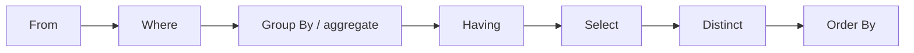
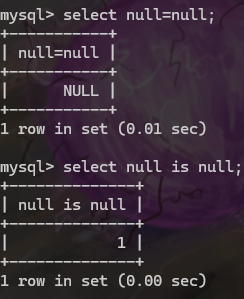
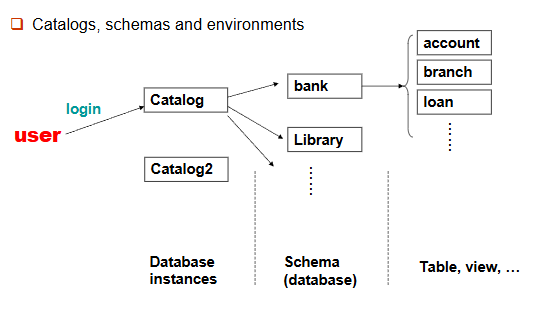
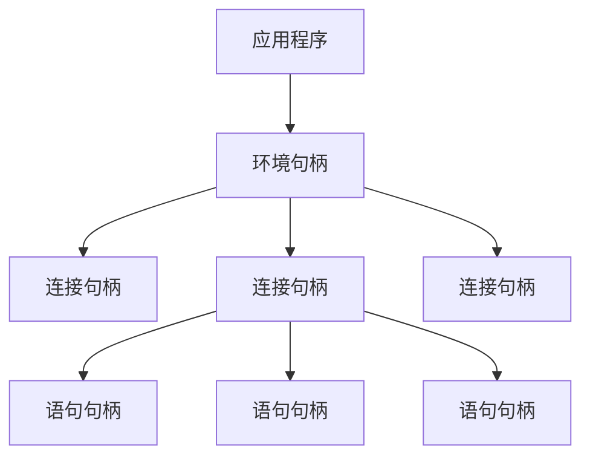

# SQL 

SQL includes several parts:

- DDL: Data Definition Language
- DML: Data Manipulation Language
- DQL: Data Query Language
- DCL: Data Control Language


## Data Definition Language

The main functions of DDL contain:

- Define the *schema* for each relation
- Define the *domain* of values associated with each attribute
- Define the *integrity constraints*
- Define the *physical storage structure* of each relation on disk
- Define the *indices* to be maintained for each relations
- Define the *view* on relations

For example,if we want to define a table named `branch`

```sql
CREATE TABLE branch (
    branch_name VARCHAR(20) PRIMARY KEY,
    branch_city VARCHAR(20),
    assets NUMERIC(12, 2)
);
```

or

```sql
CREATE TABLE branch (
    branch_name CHAR(15) NOT NULL,
    branch_city VARCHAR(30),
    assets NUMERIC(8, 2),
    PRIMARY KEY (branch_name)
);
```


### Domain types

- `CHAR(n)`: fixed length character string,with user-specified length
- `VARCHAR(n)`: variable length character string,with user-specified maximum length
- `INT` or `INTEGER`: integer number
- `SMALLINT`: small integer number
- `NUMERIC(p, d)`: fixed point number with user-specified precision and scale(总共为p位有效位,其中小数点后有d位)
- `FLOAT(n)`: floating point number with user-specified precision,if `n` is omitted,the precision is 24
- `REAL`: floating point number with user-specified precision,such as 3.14，`REAL` is equivalent to `FLOAT(24)`
- `DOUBLE` or `DOUBLE PRECISION`: double precision floating point number
- `NULL`: no value
- `DATE`: date in the format YYYY-MM-DD,such as 2025-03-01
- `TIME`: time in the format HH:MM:SS,such as 12:00:00
- `TIMESTAMP`: date and time in the format YYYY-MM-DD HH:MM:SS,such as 2025-03-01 12:00:00


SQL provides various functions for data manipulation and type conversion, though the implementation may vary across different database systems. Here are some examples:

- String functions:
    - `CHAR(n)`: Convert ASCII code n to character,in Oracle,it is `CHR(n)`
    - `SUBSTRING(str, start, length)`: Extract substring from position start with given length,in Oracle,it is `SUBSTR(str, start, length)`
    - `LEN(str)`: Get length of string,in Oracle,it is `LENGTH(str)`
    - `GETDATE()`: Get current date and time,in Oracle,it is `SYSDATE`
    - `DATALENGTH(str)`: Get number of bytes used to represent string
    - `CONCAT(str1, str2)`: Concatenate two or more strings
    - `UPPER(str)`: Convert string to uppercase
    - `LOWER(str)`: Convert string to lowercase
    - `LTRIM(str)`: Remove leading spaces
    - `RTRIM(str)`: Remove trailing spaces

- Numeric functions:
    - `ABS(n)`: Absolute value
    - `ROUND(n, d)`: Round number to d decimal places
    - `CEILING(n)`: Round up to nearest integer
    - `FLOOR(n)`: Round down to nearest integer
    - `POWER(x, y)`: x raised to power y
    - `SQRT(n)`: Square root

- Date functions:
    - `GETDATE()`: Current date and time
    - `DATEADD(part, n, date)`: Add n units to date
    - `DATEDIFF(part, date1, date2)`: Difference between dates
    - `YEAR(date)`: Extract year
    - `MONTH(date)`: Extract month
    - `DAY(date)`: Extract day

### Create Table

An SQL relation is define using the `CREATE TABLE` statement.

```sql
CREATE TABLE r (
    A1 D1,
    A2 D2,
    ...,
    An Dn,
    (integrity constraint1),
    ...,
    (integrity constraintk)
);
```

- r is the name of the relation
- Each Ai is an attribute name in the schema of relation r
- Di is the data type of values in the domain of attribute Ai
- integrity constrainti is a constraint on the values of attribute Ai,即完整性约束条件，例如外键约束，主键约束，唯一约束，检查约束等
  

#### Integrity Constraints

- **Not NULL**: The attribute cannot be NULL
  ```sql
  CREATE TABLE employees (
      employee_id INT NOT NULL,
      first_name VARCHAR(50),
      last_name VARCHAR(50) NOT NULL
  );
  ```

- **Primary Key**: The attribute is the primary key of the relation
  ```sql
  CREATE TABLE departments (
      department_id INT PRIMARY KEY,
      department_name VARCHAR(50) NOT NULL
  );
  ```

- **Check**: The attribute must satisfy a specified condition
  ```sql
  CREATE TABLE products (
      product_id INT PRIMARY KEY,
      price DECIMAL(10, 2) CHECK (price > 0)
  );
  ```

- **Unique**: The attribute must be unique
  ```sql
  CREATE TABLE users (
      user_id INT PRIMARY KEY,
      email VARCHAR(100) UNIQUE
  );
  ```

- **Foreign Key**: The attribute must be a foreign key of the relation
  ```sql
  CREATE TABLE orders (
      order_id INT PRIMARY KEY,
      customer_id INT,
      FOREIGN KEY (customer_id) REFERENCES customers(customer_id)
  );
  ```

- **Default**: The attribute must have a default value
  ```sql
  CREATE TABLE settings (
      setting_id INT PRIMARY KEY,
      theme VARCHAR(20) DEFAULT 'light'
  );
  ```

- **Index**: The attribute must be indexed
  ```sql
  CREATE INDEX idx_last_name ON employees(last_name);
  ```

- **View**: The attribute must be a view of the relation
  ```sql
  CREATE VIEW employee_view AS
  SELECT employee_id, first_name, last_name FROM employees;
  ```

- **Trigger**: The attribute must be a trigger of the relation
  ```sql
  CREATE TRIGGER update_stock
  AFTER INSERT ON sales
  FOR EACH ROW
  BEGIN
      UPDATE products SET stock = stock - NEW.quantity WHERE product_id = NEW.product_id;
  END;
  ```

> Primary key declaration on an attribute automatically ensures not null in SQL_92 onwards, needs to be explicitly stated in SQL_89 

Another way to use integrity constraints is 

```sql
CREATE TABLE employees (
    employee_id INT,
    primary key (employee_id)
);
```

### DROP and ALTER Table

<div style="text-align: center;">
<strong style="font-size: 2em;color: red;">Be careful to use the DROP command!!!</strong>
</div>

#### Drop Table

the drop table statement is used to delete a table from the database.

```sql
DROP TABLE employees;
```

#### Alter Table

the alter table statement is used to modify the structure of a table.


the format is 

```sql
ALTER TABLE table_name ADD column_name data_type;
-- add a new column
ALTER TABLE table_name ADD (column_name data_type, column_name data_type, ...);
-- add multiple columns
ALTER TABLE table_name DROP COLUMN column_name;
-- drop a column
ALTER TABLE table_name MODIFY column_name data_type;
-- modify the data type of a column
```


```sql
ALTER TABLE employees ADD COLUMN email VARCHAR(100);
```

#### Create Index

Index is a data structure that improves the performance of database queries by allowing the database to quickly locate the data without having to scan the entire table.

```sql
CREATE INDEX index_name ON table_name(attribute_list);
-- unique index
CREATE UNIQUE INDEX index_name ON table_name(attribute_list);
-- drop index
DROP INDEX index_name;
```

Example:

```sql
CREATE INDEX idx_last_name ON employees(last_name);
```
## Basic Structure

### The select clause

The select clause is used to select the data from the database.

```sql
SELECT attribute_list FROM table_name;
```

such as:

```sql
SELECT * FROM employees;
```

where `*` is the wildcard character, it means all the attributes.

SQL allows duplicates in relations as well as in query results. 

```sql
SELECT DISTINCT attribute_list FROM table_name;
```

where `DISTINCT` is used to remove duplicates.

the opposite of `DISTINCT` is `ALL`, which means all the duplicates are kept.

```sql
SELECT ALL attribute_list FROM table_name;
```

By default, the select clause returns all the attributes of the relation.

### The where clause

The where clause is used to filter the data from the database.

```sql
SELECT attribute_list FROM table_name WHERE condition;
```

such as:

```sql
SELECT * FROM employees WHERE salary > 5000;
```

Comparison results can be combined using the logical connectives:

- `AND`: Both conditions must be true
- `OR`: At least one condition must be true  
- `NOT`: Negates a condition

The `BETWEEN` operator can be used to specify a range:

```sql
SELECT loan_number, amount
FROM loan
WHERE amount BETWEEN 1000 AND 10000 AND branch_name = 'Downtown';
```

The `IN` operator can be used to specify a list of values:

```sql
SELECT loan_number, amount
FROM loan
WHERE amount IN (1000, 2000, 3000);
```

### The from clause

The from clause is used to specify the table from which to select the data.

```sql
SELECT attribute_list FROM table_name1, table_name2, ...;
```

such as:

```sql
SELECT branch_name, branch_city
FROM branch, account
WHERE branch.branch_name = account.branch_name;
```

This will return a Cartesian product of the two tables.

if there are multiple tables contain the same attribute, we need to use the table name to specify the attribute.

```sql
SELECT branch.branch_name, branch_city, account.account_number
FROM branch, account
WHERE branch.branch_name = account.branch_name;
```

### The rename operation


The rename operation is used to rename the attributes of the relation.

```sql
SELECT attribute_list AS new_attribute_list FROM table_name;
```

such as:

```sql
SELECT branch_name AS branch, branch_city AS city
FROM branch;
```

Tuple variables are defined in the FROM clause via the use of the as clause. 

```sql
SELECT customer_name, T.loan_number, S.amount 
FROM borrower as T, loan as S 
WHERE T.loan_number = S.loan_number 
AND S.amount > 10000;
```

In SQL, the use of the `AS` keyword to define the table alias is optional. The alias can be defined directly in the `FROM` clause without using the `AS` keyword. Therefore, you can remove the `AS` keyword, and the code will still work. Here is the code without the `AS` keyword:

```sql
SELECT customer_name, T.loan_number, S.amount 
FROM borrower T, loan S 
WHERE T.loan_number = S.loan_number 
AND S.amount > 10000;
```

!!!question
    Find the names of all branches that have greater assets than some branch located in city Brooklyn. 

    ```sql
    SELECT DISTINCT T.branch_name
    FROM branch AS T, branch AS S
    WHERE T.assets > S.assets 
        AND S.branch_city = 'Brooklyn';
    ```
    
### String operation


#### fuzzy matching
SQL includes a string-matching operator for comparisons on character strings. Patterns are described using the following two special characters: 

- `%`: Matches any sequence of characters
- `_`: Matches any single character


with this,we can achieve the fuzzy matching.

```sql
SELECT * FROM employees WHERE last_name LIKE 'S%';
```

This will return all the employees whose last name starts with 'S'.

```sql
SELECT * FROM employees WHERE last_name LIKE '_o%';
```

This will return all the employees whose last name has 'o' as the second character.

It should be use in the where clause and must be used in conjunction with the `LIKE` operator.

#### other string operations

SQL provides the `||` operator to concatenate strings.

```sql
SELECT 'Hello' || ' ' || 'World';
```

This will return 'Hello World'.

Converting string from upper case to lower case:

```sql
SELECT LOWER('Hello');
-- output: hello
SELECT UPPER('Hello');
-- output: HELLO
```

### Ordering the display of results

ordering the display of results is achieved by using the `ORDER BY` clause.

```sql
SELECT attribute_list FROM table_name WHERE condition ORDER BY attribute_name;
```

We may specify desc for descending order or asc for ascending order, and for each attribute, ascending order is the default. 

```sql
SELECT * FROM employees ORDER BY salary DESC;
```

This will return all the employees sorted by salary in descending order.

## SET Operations

In SQL, use the set operations including `UNION`, `INTERSECT`, and `EXCEPT` operate on relations as well as correspond to the relational algebra operations $\cup$, $\cap$, and $\setminus$.

Each of the operations including `UNION`, `INTERSECT`, and `EXCEPT` automatically eliminates duplicates. To retain duplicates, use `UNION ALL`, `INTERSECT ALL`, and `EXCEPT ALL` instead.

!!!Example
     Find all customers who have a loan or an account or both. 

     ```sql
     SELECT customer_name FROM borrower
     UNION
     SELECT customer_name FROM depositor;
     ```

     Find all customers who have both a loan and an account.

     ```sql
     SELECT customer_name FROM borrower
     INTERSECT
     SELECT customer_name FROM depositor;
     ```

     Find all customers who have a loan but not an account.

     ```sql
     SELECT customer_name FROM borrower
     EXCEPT
     SELECT customer_name FROM depositor;
     ```

## Aggregate Functions

Aggregate functions are used to perform calculations on a set of values(a column) and return a single value.

- `COUNT`: Counts the number of rows
- `SUM`: Calculates the sum of a set of values
- `AVG`: Calculates the average of a set of values
- `MAX`: Finds the maximum value
- `MIN`: Finds the minimum value

Such as:

```sql
SELECT COUNT(*) as total_employees FROM employees;
```

This will return the number of rows in the employees table.

!!!Note
    The `COUNT(*)` function counts all rows, including those with null values.

    But `COUNT(attribute_name)` function counts only the rows where the attribute is not null.

    We can also use `COUNT(distinct attribute_name)` to count the number of distinct values in a column.


### Group By

```sql
SELECT branch_name, avg(balance) avg_bal 
FROM account 
WHERE branch_name = 'Perryridge';
```

在 SQL 中，当你在 `SELECT` 子句中使用聚合函数（例如 `AVG`、`SUM` 等）时，所有不在聚合函数中的属性（字段）必须出现在 `GROUP BY` 子句中。这是因为 SQL 需要知道如何对数据进行分组，以便正确地计算聚合值。

否则在这种情况下，在前面要求了挑出Branch_name,where 中又要求branch_name = 'Perryridge'；没什么意义

正确的写法是：

```sql
SELECT branch_name, avg(balance) avg_bal 
FROM account 
GROUP BY branch_name;
```
### Having

The `HAVING` clause is used to filter the results of a `GROUP BY` operation.

```sql
SELECT branch_name, avg(balance) avg_bal 
FROM account 
GROUP BY branch_name HAVING avg(balance) > 1000;
```

This will return all the branches whose average balance is greater than 1000.


## Summary of Select

Select 语句的完整语法如下：

```sql
SELECT <[DISTINCT] c1, c2, …> 
		FROM <r1, …> 
		[WHERE <condition>] 
		[GROUP BY <c1, c2, …> [HAVING <condition>]] 
		[ORDER BY <c1 [DESC] [, c2 [DESC|ASC], …]>] 
```

[] 表示可选部分

其执行顺序为



<div style="text-align: center;font-size: 1em;color: blue;">Note that predicates in the having clause are applied after the formation of groups, whereas predicates in the where clause are applied before forming groups.</div>


## Null Values

Null is a special marker used in SQL and was first introduced by E.F. Codd in 1974.

The meaning of null is that the value is unknown or not applicable.

The result of any arithmetic operation involving null is null.
> 5+null = null

Any comparison involving null is 'unknown', which is neither true nor false.
> null = null is unknown

!!!info "unknown"
    Three-valued logic using the truth value unknown: (true, false, unknown)

    - `OR` operation: 
        - (unknown OR true) = true
        - (unknown OR false) = unknown 
        - (unknown OR unknown) = unknown

    - `AND` operation:
        - (unknown AND true) = unknown
        - (unknown AND false) = false
        - (unknown AND unknown) = unknown

    - `NOT` operation:
        - (NOT unknown) = unknown

    - `=` operation:
        - (unknown = unknown) = unknown

    - `!=` operation:
        - (unknown != unknown) = unknown

 
The predicate `IS NULL`  and `IS NOT NULL` are used to test for null values.
>recall that the primary key of a relation cannot be null.

!!!Example
    Find all loan number which appears in the loan relation with null values for amount. 

    ```sql
    SELECT loan_number
    FROM loan
    WHERE amount IS NULL;
    ```

    we cannot use `=` to test for null values,the result will return null.

    see as follows:

    <figure markdown="span">
    { width="300" }
    </figure>

### Null Values in Aggregate Functions


```sql
SELECT sum(balance) FROM account;
```

This will return the sum of the balance of all the accounts.Result is null if there is no non-null values.


All aggregate operations **except count(*)** ignore tuples with null values on the aggregated attributes. 


## Nested Subqueries

Nested subqueries in SQL are queries within queries. They allow you to perform more complex queries by embedding one query inside another. This is particularly useful when you need to filter data based on the results of another query.

### Basic Structure

A nested subquery is typically found in the `WHERE` clause of a SQL statement. The subquery is executed first, and its result is used by the outer query.

```sql
SELECT column1, column2
FROM table1
WHERE column3 <operator> (
    SELECT column3
    FROM table2
    WHERE condition
);
```

the `<operator>` can be `=`, `!=`, `>`, `>=`, `<`, `<=`, `IN`, `NOT IN`, `ANY`, `ALL`, `EXISTS`, `NOT EXISTS`. 

it can also be nested in the FROM clause.

```sql
SELECT column1, column2
FROM (SELECT column3 FROM table2 WHERE condition) as subquery;
```
or in the having clause such as:

```sql
SELECT department, AVG(salary) AS avg_salary
FROM employees
GROUP BY department
HAVING AVG(salary) > (SELECT AVG(salary) FROM employees);
```
> 找出每个 [部门平均工资] 大于[所有员工平均工资]的部门。


!!!Example
    Find all customers who have both an account and a loan at the bank. 
    
    ```sql
    SELECT customer_name
    FROM borrower
    WHERE customer_id IN (
        SELECT customer_id
        FROM depositor
    );
    ```

    recall that we can also use the set operation to achieve the same result.

    ```sql
    SELECT customer_name
    FROM borrower
    INTERSECT
    SELECT customer_name FROM depositor;
    ```

    Find  all customers who have both an account and a loan at the Perryridge branch. 

    - query 1:
    ```sql
    SELECT DISTINCT customer_name
    FROM borrower B, loan L
    WHERE B.loan_number = L.loan_number
      AND branch_name = 'Perryridge'
      AND (branch_name, customer_name) IN (
        SELECT branch_name, customer_name
        FROM depositor D, account A
        WHERE D.account_number = A.account_number
      );
    ```
    
    - query 2:
    ```sql
    SELECT DISTINCT customer_name
    FROM borrower B, loan L
    WHERE B.loan_number = L.loan_number
      AND branch_name = 'Perryridge'
      AND customer_name IN (
        SELECT customer_name
        FROM depositor D, account A
        WHERE D.account_number = A.account_number
          AND branch_name = 'Perryridge'
    );
    ```

    - query 3:指定名称，将外层的结果传递进去
    ```sql
    SELECT DISTINCT customer_name
    FROM borrower B, loan AS t
    WHERE B.loan_number = t.loan_number
      AND branch_name = 'Perryridge'
      AND customer_name IN (
        SELECT customer_name
        FROM depositor D, account A
        WHERE D.account_number = A.account_number
          AND branch_name = t.branch_name -- branch_name is the same as the branch_name in the outer (Perryridge)
    );
    ```


Find the account_number with the maximum balance for every branch.

```sql
SELECT account_number, balance 
	      FROM account 
        WHERE balance >= max(balance) 
        GROUP BY branch_name 
```

错，聚合函数不能在where子句中使用

```sql
SELECT account_number, max(balance) 
FROM account 
GROUP BY branch_name 
```
错误，account_number不是聚合函数的一部分，且没有在group by子句中

正确的为

```sql
-- Select account number and balance from the account table
SELECT account_number AS AN, balance
FROM account A
-- Filter to get accounts with the maximum balance in each branch
WHERE balance >= (
    -- Subquery to get the maximum balance for each branch
    SELECT max(balance)
    FROM account B
    WHERE A.branch_name = B.branch_name
)
-- Order the results by balance
ORDER BY balance;
```
但是
```sql
SELECT account_number, balance 
FROM account 
GROUP by branch_name 
HAVING balance >= max(balance) 
ORDER by balance 
```
错误，max(balance)是聚合列，balance不是聚合列

### Set Comparison

Find all branches that have greater assets than some branch located in Brooklyn. 

```sql
SELECT branch_name
FROM branch
WHERE assets > SOME (
    SELECT assets
    FROM branch
    WHERE branch_city = 'Brooklyn'
);
```

Find all branches that have greater assets than all branches located in Brooklyn.

```sql
SELECT branch_name
FROM branch
WHERE assets > ALL (
    SELECT assets
    FROM branch
    WHERE branch_city = 'Brooklyn'
);
```
or

```sql
SELECT branch_name
FROM branch
WHERE assets > (SELECT MAX(assets) FROM branch WHERE branch_city = 'Brooklyn');
```

### Test for Empty Relations

The `exists` construct returns the value true if the argument subquery is non-empty. 

- `exists` $r$ equal to $r \neq \emptyset$
- `not exists` $r$ equal to $r = \emptyset$


!!!Example
    Find all customers who have accounts at all branches located in city Brooklyn. 

    ```sql
     SELECT DISTINCT S.customer_name
     FROM depositor AS S
     WHERE NOT EXISTS (
         (SELECT branch_name
          FROM branch
          WHERE branch_city = 'Brooklyn')
         EXCEPT
         (SELECT DISTINCT R.branch_name
          FROM depositor AS T, account AS R
          WHERE T.account_number = R.account_number
          AND S.customer_name = T.customer_name)
     );
    ```

    即挑出的S将满足，**Brooklyn所有支行的branch_number减去S有账户的branch_number后，为空**。
    而由于

    \[
       A - B = \emptyset \iff A \subseteq B
    \]

    所以挑出的S将满足，**S有账户的branch_number包含了Brooklyn所有支行的branch_number**。

    也就满足了要求。
    
    ```sql
    SELECT DISTINCT S.customer_name
    FROM depositor AS S
    WHERE NOT EXISTS (
        SELECT *
        FROM branch B
        WHERE branch_city = 'Brooklyn' AND NOT EXISTS (
            SELECT *
            FROM depositor AS T, account AS R
            WHERE T.account_number = R.account_number
            AND R.branch_name = B.branch_name
            AND S.customer_name = T.customer_name
        )
    );
    ```   

    这里有两个not exists，里面的select子句挑出了在Brooklyn中没有某些支行账户的表格，外面的not exists挑出了不存在这一条件的客户;
    即 **不存在在Brooklyn中不存在账户的客户** ，也就是 **在Brooklyn的所有支行都有账户的客户** 。

### Test for Absence of Duplicate Tuples

The unique construct tests whether a subquery has any duplicate tuples in its result. 

!!!Example
     Find all customers who have at most one account at the Perryridge branch. 
     
     ```sql
     SELECT customer_name
     FROM depositor AS T
     WHERE UNIQUE (
         SELECT R.customer_name
         FROM account, depositor AS R
         WHERE T.customer_name = R.customer_name
         AND R.account_number = account.account_number
         AND account.branch_name = 'Perryridge'
     );
     ```

     Find all customers who have at least two accounts at the Perryridge branch. 

     ```sql
     SELECT DISTINCT T.customer_name
     FROM depositor AS T
     WHERE NOT UNIQUE (
           SELECT R.customer_name
           FROM account, depositor AS R
           WHERE T.customer_name = R.customer_name
           AND R.account_number = account.account_number
           AND account.branch_name = 'Perryridge'
     );
     ```
## Views

A view is a virtual table that is defined by a query. It is a stored query that can be used to simplify complex queries and to provide a consistent view of the data.

Provide a mechanism to hide certain data from the view of certain users. 

### Create View

```sql
CREATE VIEW view_name AS SELECT attribute_list FROM table_name WHERE condition;
-- or
CREATE VIEW view_name (c1, c2, ..., cn) AS SELECT attribute_list FROM table_name WHERE condition;
```


!!!advice
    Benefits of using views 
    - Security 
    - Easy to use, support logical independence
    - Simplify complex queries
    - Hide certain data from the view of certain users

### Drop View

```sql
DROP VIEW view_name;
```

!!!Example
    Create a view consisting of branches and their customer names. 

    ```sql
    CREATE VIEW all_customer AS 
    (
        (SELECT branch_name, customer_name 
         FROM depositor, account 
         WHERE depositor.account_number = account.account_number) 
       UNION
        (SELECT branch_name, customer_name 
         FROM borrower, loan 
         WHERE borrower.loan_number = loan.loan_number)
    );
    ```


## Derived Relations

In SQL, Derived Relations (derived relations) are created through subqueries (subquery) in the `FROM` clause. They are typically used to simplify complex queries and make them more readable.

Such as:Find the average account balance of those branches where the average account balance is greater than $500. 

```sql
SELECT branch_name, avg_bal 
     FROM (SELECT branch_name, avg(balance) 
      FROM account 
      GROUP BY branch_name) 
      as result (branch_name, avg_bal) 
     WHERE avg_bal > 500 
```
> The derived table must have its own alias

### With Clause

The WITH clause allows views to be defined locally for a query, rather than globally. 
>`WITH` 子句允许在查询中局部定义视图，而不是全局定义。这意味着你可以在一个特定的查询中创建一个临时的视图，这个视图只在该查询的上下文中可用，而不会影响数据库的其他部分。这种方法的好处是可以简化复杂查询，使其更易于阅读和维护，同时避免在数据库中创建永久视图。使用 `WITH` 子句，你可以在查询中定义多个子查询，并在主查询中引用它们，从而提高查询的可读性和效率。


Such as:Find all accounts with the maximum balance. 

```sql
WITH max_balance(value) AS (
    SELECT max(balance) 
    FROM account
)
SELECT account_number 
FROM account, max_balance 
WHERE account.balance = max_balance.value;
```

## Modification of Database

### Deletion

```sql
DELETE FROM table_name WHERE condition;
```

such as: Delete all accounts and relevant information at depositor for every branch located in Needham city. 


```sql
DELETE FROM account 
WHERE branch_name IN (
    SELECT branch_name 
    FROM branch 
    WHERE branch_city = 'Needham'
);

DELETE FROM depositor 
WHERE account_number IN (
    SELECT account_number 
    FROM branch B, account A 
    WHERE branch_city = 'Needham' 
    AND B.branch_name = A.branch_name
);
```

以下写法错误

```sql
DELETE FROM account, depositor, branch
WHERE account.account_number = depositor.account_number
AND branch.branch_name = account.branch_name
AND branch_city = 'Needham';
```

<div style="color: red;">
每一个delete语句，只能够针对一个表进行操作，不能够针对多个表进行操作。
</div>

Example2:

 Delete the record of all accounts with balances below the average at the bank. 

```sql
DELETE FROM account WHERE balance < (SELECT avg(balance) FROM account);
```

**Problem:** as we delete tuples from account, the average 
balance changes.

**Solution:**

```sql
WITH avg_balance AS (
    SELECT avg(balance) AS avg_bal
    FROM account
),
to_delete AS (
    SELECT account_number
    FROM account
    WHERE balance < (SELECT avg_bal FROM avg_balance)
)
DELETE FROM account
WHERE account_number IN (SELECT account_number FROM to_delete);
```

!!!info
    在同一SQL语句内，除非外层查询的元组变量引入内层查询，否则层查询只进行一次.

    这句话的意思是：在一个 SQL 语句中，除非外层查询的元组变量（即表的别名或列名）被引入到内层查询中，否则内层查询只会执行一次。

    换句话说，如果内层查询不依赖于外层查询的任何变量或条件，那么内层查询会在整个 SQL 语句执行过程中只运行一次，并将其结果用于外层查询的每一行。如果内层查询依赖于外层查询的变量，那么内层查询可能会为外层查询的每一行执行一次。


### Insertion

Add a new tuple to the relation.

Format:

```sql
INSERT INTO <table|view> [(c1, c2,…)] 
      VALUES (e1, e2, …) 
-- or
INSERT INTO <table|view> [(c1, c2,…)] 
      SELECT e1, e2, … 
      FROM … 
```

```sql
INSERT INTO account (account_number, branch_name, balance)
VALUES ('A_9732', 'Perryridge', 1200);

-- or equivalently

INSERT INTO account (branch_name, balance, account_number)
VALUES ('Perryridge', 1200, 'A_9732');
```

Such as:Provide as a gift for all loan customers of the Perryridge branch, a $200 savings account.  Let the loan number serve as the account number for the new savings account. 

```sql
-- Step 1: insert into account
INSERT INTO account (account_number, branch_name, balance)
SELECT loan_number, branch_name, 200
FROM loan
WHERE branch_name = 'Perryridge';

-- Step 2: insert into depositor
INSERT INTO depositor (customer_name, account_number)
SELECT customer_name, A.loan_number
FROM loan A, borrower B
WHERE A.branch_name = 'Perryridge' AND A.loan_number = B.loan_number;
```


!!!question "what? select 200?"
    在 SQL 中，`SELECT` 语句可以用于从一个或多个表中提取数据，
    并且可以在 `SELECT` 子句中使用常量值。常量值会被应用到每一行的结果中。

    代码中：

    ```sql
    INSERT INTO account (account_number, branch_name, balance)
    SELECT loan_number, branch_name, 200
    FROM loan
    WHERE branch_name = 'Perryridge';
    ```

    这里的 `SELECT loan_number, branch_name, 200` 是从 `loan` 表中选择 `loan_number` 和 `branch_name`，并且为每一行都插入一个常量值 `200` 作为 `balance`。
    这意味着对于每一个符合条件的 `loan` 表中的记录，都会插入一条新的记录到 `account` 表中，其中 `balance` 字段的值固定为 `200`。
    这种用法在 SQL 中是合法的，并且常用于在插入数据时为某些字段设置默认值或固定值。

The "select from where" statement is fully evaluated before any of its results are inserted into the relation. 


### Updates

Update the value of an attribute of a tuple.

Format:

```sql
UPDATE <table | view> 
 	      SET <c1 = e1 [, c2 = e2, …]> [WHERE <condition>] 
```

Such as:

```sql
UPDATE account 
SET balance = balance * 1.05 
WHERE branch_name = 'Perryridge';
```

!!!Example
    Increase all accounts with balances over $10,000 by 6%, all other accounts receive 5%. 

    ```sql
    UPDATE account 
    SET balance = balance * 1.06 
    WHERE balance > 10000;
    
    UPDATE account 
    SET balance = balance * 1.05 
    WHERE balance <= 10000;
    ```
    The order is important.
    如果顺序反过来，那么有可能一开始没有10000，先更新了，然后就变成10000了，然后又可以增加6%了。

#### Case Statement for Conditional Updates

The same query as before: Increase all accounts with balances over $10,000 by 6%, and all other accounts receive 5%. 

```sql
UPDATE account
SET balance = CASE
    WHEN balance <= 10000 THEN balance * 1.05
    ELSE balance * 1.06
END;
```

#### Update of view

Example:Create a view of all loan data in loan relation, hiding the amount attribute. 

```sql
CREATE VIEW branch_loan as 
SELECT branch_name, loan_number 
FROM loan;
```

Add a new tuple to branch_loan. 

```sql
INSERT INTO branch_loan 
VALUES ('Perryridge', 'L-307') 
```

This insertion will be translated into: 

```sql
INSERT INTO loan 
VALUES ('L-307', 'Perryridge', null) 
```

Updates on more complex views are difficult or impossible to translate into updates on the base relations,and hence are not allowed.


#### Summary of update on view

- View 是虚表，对其进行的所有操作都将转化为对基表的操作。
- 查询操作时，VIEW与基表没有区别，但对VIEW的更新操作有严格限制，如只有行列视图(建立在单个基本表上的视图，且视图的列对应表的列，称为"行列视图"。)，可更新数据
- 大多数SQL实现只允许在单个关系上定义的简单视图上进行更新操作，且不包含聚合函数


### Transaction

在 SQL 中，事务（Transaction）是指一系列查询和数据更新语句，这些语句作为一个单一的逻辑单元执行。事务的目的是确保数据库操作的完整性和一致性。事务通常具有以下四个特性，简称为 ACID：

1. **原子性（Atomicity）**：事务中的所有操作要么全部完成，要么全部不完成。事务不能只完成其中的一部分。

2. **一致性（Consistency）**：事务的执行必须使数据库从一个一致的状态转变为另一个一致的状态。

3. **隔离性（Isolation）**：一个事务的执行不能被其他事务干扰。即使多个事务并发执行，在事务之间的操作结果是相互隔离的。

4. **持久性（Durability）**：一旦事务提交，其结果就应该永久保存在数据库中，即使系统发生故障。

在 SQL 中，事务通常是隐式启动的，并通过以下两种方式之一来终止：

- **COMMIT WORK**：提交事务，将事务中所有的更新永久地保存到数据库中。这意味着事务中的所有操作都被确认并生效。

- **ROLLBACK WORK**：回滚事务，撤销事务中执行的所有更新。这意味着事务中的所有操作都被取消，数据库状态恢复到事务开始之前的状态。

通过使用 `COMMIT` 和 `ROLLBACK`，可以控制事务的完成或取消，从而确保数据库的可靠性和一致性，即使在出现错误或系统崩溃的情况下。

## Joined Relations

Join operations take as input two relations and return as a result another relation. 

<span style="color:red">Join condition</span> – defines which tuples in the two relations match, and what attributes are present in the result of the join. 


<span style="color:red">Join type</span> – defines how tuples in each relation that do not match any tuple in the other relation (based on the join condition) are treated. 

- 自然连接：自然连接是一种特殊的等值连接，它要求两个关系中所有同名属性都相等，不需要指定连接条件。

```sql
R natural {inner join, left join, right join, full join} S 
```


- 非自然连接： 需要指定连接条件。

```sql
R {inner join, left join, right join, full join} S on condition using (A1, A2, ..., An)
```


### INNER JOIN

- **作用**：返回两个表中匹配的行。
- **语法**：
  ```sql
  SELECT columns
  FROM table1
  INNER JOIN table2 ON table1.column = table2.column;
  ```

---

### LEFT JOIN (LEFT OUTER JOIN)
- **作用**：返回左表所有行 + 右表匹配的行（未匹配的右表字段为 `NULL`）。
- **语法**：
  ```sql
  SELECT columns
  FROM table1
  LEFT JOIN table2 ON table1.column = table2.column;
  ```

---

### RIGHT JOIN (RIGHT OUTER JOIN)
- **作用**：返回右表所有行 + 左表匹配的行（未匹配的左表字段为 `NULL`）。
- **语法**：
  ```sql
  SELECT columns
  FROM table1
  RIGHT JOIN table2 ON table1.column = table2.column;
  ```

---

### FULL OUTER JOIN
- **作用**：返回左右表所有行（未匹配的字段为 `NULL`）。
- **语法**：
  ```sql
  SELECT columns
  FROM table1
  FULL OUTER JOIN table2 ON table1.column = table2.column;
  ```

---

### CROSS JOIN
- **作用**：返回两表的笛卡尔积（无连接条件）。
- **语法**：
  ```sql
  SELECT columns
  FROM table1
  CROSS JOIN table2;
  ```

---

### SELF JOIN
- **作用**：将表与自身连接，常用于层级或对称关系查询。
- **语法**：
  ```sql
  SELECT a.column, b.column
  FROM table a
  JOIN table b ON a.column = b.column;
  ```

---

### JOIN condition

#### ON 
- **作用**：指定任意连接条件（支持多条件和复杂逻辑）。
- **语法**：
  ```sql
  SELECT *
  FROM orders
  JOIN customers ON orders.customer_id = customers.id;
  ```

#### USING 
- **作用**：简化同名列的连接（自动匹配列名）。
- **语法**：
  ```sql
  SELECT *
  FROM employees
  JOIN departments USING (dept_id);
  ```

---

### JOIN performance optimization
1. **索引优化**：  
   - 在连接列（如 `dept_id`）上创建索引。
2. **减少数据量**：  
   - 先通过 `WHERE` 过滤再 `JOIN`。
3. **避免笛卡尔积**：  
   - 确保 `CROSS JOIN` 是必要且可控的。
4. **使用 EXPLAIN**：  
   - 分析查询计划，检查连接顺序和算法（如 Nested Loop、Hash Join）。

---

### Summary
| JOIN 类型          | 匹配规则                          | 是否保留未匹配数据       |
|--------------------|-----------------------------------|--------------------------|
| `INNER JOIN`       | 仅匹配的行                        | 否                       |
| `LEFT JOIN`        | 左表全保留 + 右表匹配             | 左表未匹配行保留         |
| `RIGHT JOIN`       | 右表全保留 + 左表匹配             | 右表未匹配行保留         |
| `FULL OUTER JOIN`  | 左右表全保留                      | 左右表未匹配行均保留     |
| `CROSS JOIN`       | 无条件，笛卡尔积                  | 不适用                   |

## Advanced SQL

### SQL Data Types and Schemas

- [Built-in types](https://www.postgresql.org/docs/current/datatype.html)

#### User-defined types

```sql
CREATE TYPE address as varchar(255);
```
也可以定义复合类型

```sql
CREATE TYPE address as (
    street varchar(255),
    city varchar(255)
);
```

Create a table with the address type:

```sql
CREATE TABLE person (
    id int,
    name varchar(255),
    person_address address
);
```

Drop the address type:

```sql
DROP TYPE address;
```

#### Create new domain

```sql
CREATE DOMAIN domain_name AS data_type
[ DEFAULT default_value ]
[ CONSTRAINT constraint_name CHECK (expression) ];
```

such as
```sql
Create domain Dollars as numeric(12, 2) not null; 
Create domain Pounds as numeric(12,2); 
Create table employee 
        (eno char(10) primary key, 
            ename varchar(15), 
            job varchar(10), 
            salary Dollars, 
            comm Pounds); 
```

!!!Note "domain vs type"
    在 SQL 中，`DOMAIN` 和 `TYPE` 都用于定义自定义的数据类型，但它们有不同的用途和特性。

    `DOMAIN` 是基于现有数据类型的约束集合。它允许你为特定的数据类型添加约束条件，以确保数据的完整性。
    主要用于在多个表中重用相同的数据类型和约束。例如，定义一个 `DOMAIN` 来表示电子邮件地址，并附加格式检查约束。
    可以附加 `CHECK` 约束来验证数据的有效性。
    `DOMAIN` 继承了基础数据类型的所有特性，并可以在其上添加额外的约束。
    示例:
    ```sql
    CREATE DOMAIN email_domain AS VARCHAR(255)
    CHECK (VALUE ~ '^[A-Za-z0-9._%+-]+@[A-Za-z0-9.-]+\.[A-Za-z]{2,}$');
    ```

    `TYPE` 是用于定义新的数据类型，特别是复合类型（包含多个字段）或枚举类型。
    适用于需要定义复杂数据结构的场景，例如需要在表中存储地址信息的多个字段。
    复合类型可以包含多个字段，每个字段可以有不同的数据类型。
    枚举类型可以定义一组固定的值。
    示例:
    复合类型:
    ```sql
    CREATE TYPE address AS (
        street VARCHAR(255),
        city VARCHAR(100),
        zip_code VARCHAR(10)
    );
    ```
    枚举类型:
    ```sql
    CREATE TYPE mood AS ENUM ('happy', 'sad', 'neutral');
    ```

#### Large object types

SQL provides two types of large object data types:

- `BLOB` (Binary Large Object)
    - Stores large collections of uninterpreted binary data
    - Examples: images, videos, CAD files
    - Interpretation is handled by external applications
    - Maximum size depends on DBMS implementation

- `CLOB` (Character Large Object) 
    - Stores large collections of character/text data
    - Examples: documents, XML files, long text
    - Data is interpreted as character strings
    - Maximum size depends on DBMS implementation

When querying large objects, the database returns a pointer/reference to the data rather than the full object itself. This helps optimize performance and memory usage.

Example usage:

```sql
CREATE TABLE students (
    sid char(10) PRIMARY KEY,
    name varchar(10),
    gender char(1),
    photo blob(20MB),
    cv clob(10KB)
);
```

<figure markdown="span">
{ width="500" }
</figure>

### Integrity Constraints

Integrity constraints guard against accidental damage to the database, by ensuring that authorized changes to the database do not result in a loss of data consistency. 

- 实体完整性、参照完整性和用户定义的完整性约束 
- 完整性约束是数据库实例(Instance)必须遵循的 
- 完整性约束由DBMS维护 

!!!extra
    Constraints on a single relation：
    
    - Not null
    - Unique
    - Primary key
    - Foreign key
    - Check(Predicate)

    Eg.
    ```sql
    Create table branch2 
    (branch_name varchar(30) primary key, 
    branch_city varchar(30), 
    assets integer not null, 
    check (assets >= 100)) 
    ```

#### Domain Constraints
The check clause in SQL-92 permits domains to be restricted: 
```sql
Create domain hourly-wage numeric(5, 2) 
Constraint value-test check(value > = 4.00) 
--The clause constraint value-test is optional; useful to indicate which constraint an update violated. 

```
为约束命名可以更容易地诊断问题；


#### Referential Integrity
Let $r_1(R_1)$ and $r_2(R_2)$ be the relations with primary keys $K_1$ and $K_2$, respectively. 

The subset $\alpha$ of $R_2$ is a foreign key referencing $K_1$ in relation $r_1$, if for every $t_2$ in $r_2$ there must be a tuple $t_1$ in $r_1$ such that $t_1[K_1] = t_2[\alpha]$. 

\[
    \forall t_2 \in r_2, \exists t_1 \in r_1, t_1[K_1] = t_2[\alpha]
\]

Referential integrity constraint also called subset dependency, since its can be written as 

\[
    \Pi_{\alpha}(r_2) \subseteq \Pi_{K_1}(r_1)
\]

在这里$r_2$是参照关系(referencing relation)，$r_1$是被参照关系(referenced relation)。

参照关系中外码的值必须在被参照关系中实际存在，或为null. 

For example, the following constraint ensures that the `branch_name` in the `employee` relation must match the `branch_name` in the `branch` relation:

```sql
Create table employee 
(eno char(10) primary key, 
ename varchar(15), 
job varchar(10), 
branch_name varchar(10), 
foreign key (branch_name) references branch(branch_name));
```


- INSERT:If a tuple $t_2$ is inserted into $r_2$, the system must ensure that there is a tuple $t_1$ in $r_1$ such that $t_1[K_1] = t_2[\alpha]$, 例如如果插入一个员工，则该员工所属的branch_name必须在branch表中存在。


- DELETE: If a tuple $t_1$ is deleted from $r_1$, the system must compute the set of tuples in $r_2$ that reference $t_1$:

\[
    \sigma_{\alpha = t_1[K_1]}(r_2)
\] 

>如果r2中存在与r1中被删记录匹配的元组 

If this set is not empty, then either the delete command is rejected as an error, or the tuples in $t_2$ that references $t_1$ must themselves be deleted (cascading deletions are possible). 

例如如果删除了一个branch，则所有属于该branch的employee也必须被删除，或者这个删除操作被拒绝。


- UPDATE CASE 1: If a tuple $t_2$ is updated in relation $r_2$ and the update modifies values for foreign key $\alpha$, then a test similar to the insert case is made:

Let $t_2'$ denote the new value of tuple $t_2$. The system must ensure that 

\[
    t_2'[K_1] \in \Pi_{K_1}(r_1)
\] 

例如如果更新一个employee的branch_name，则该employee的branch_name必须在branch表中存在。


- UPDATE CASE 2: If a tuple $t_1$ is updated in relation $r_1$ and the update modifies values for candidate key $K$, then a test similar to the delete case is made: 

Either the update command is rejected as an error, or the tuples in $t_2$ that references $t_1$ must themselves be updated(cascading updates are possible). 

例如如果更新了branch里面的branch_name，则所有属于该branch的employee的branch_name也必须被更新，或者拒绝这个更新操作。


!!!key-point "Referential Integrity"
    Primary, candidate keys, and foreign keys can be specified as part of the SQL create table statement: 

    - The primary key clause lists attributes that comprise the primary key. 
    - The unique key clause lists attributes that comprise a candidate key. 
    - The foreign key clause lists the attributes that comprise the foreign key and the name of the relation referenced by the foreign key. 
    
    EG
    ```sql
    Create table employee 
    (eno char(10), 
    ename varchar(15), 
    job varchar(10), 
    branch_name varchar(10), 
    foreign key (branch_name) references branch(branch_name),
    primary key (eno),
    unique (ename));
    ```

    By default, a foreign key references the primary key attributes of the referenced table: 

    E.g., 
    ```sql
    foreign key (account-number) references account 
    --如果不指定，则默认引用account表的primary key
    ```

    Short form for specifying a single column as foreign key: 
    E.g., 
    ```sql
    account-number char (10) references account 
    -- 简写，指定account-number为外码
    ```

    Reference columns in the referenced table can be explicitly specified
    
    but must be declared as primary/candidate keys: 
    ```sql
    foreign key (account-number) references account (account-number) 

    -- 指定account-number为外码，并引用account表的account-number，也可以使用不同的名字，例如

    foreign key (account-number) references account (acnum) 
    ```

!!!info "Cascading actions"
    ```sql
    Create table account ( 
			. . . 
	foreign key (branch-name) references branch 
		[ on delete cascade] 
		[ on update cascade ] 
		. . . ); 
    ```
   
    加了on delete cascade，如果branch表中删除了一个元组，则account表中所有引用该branch的元组也会被删除。

    加了on update cascade，如果branch表中更新了一个元组的branch-name，则account表中所有引用该branch的元组也会被更新。

    如果在多个关系之间存在一系列的外键依赖关系，并且每个依赖关系都指定了on delete cascade，那么在链的一端进行的删除或更新操作可以传播到整个链。

    但是，如果级联更新或删除导致了一个无法通过进一步级联操作来处理的约束违反，系统将会中止该事务。

    As a result, all the changes caused by the transaction and its cascading actions are undone. 
    
    在 SQL 中，外键约束用于维护表之间的参照完整性。除了级联删除（`ON DELETE CASCADE`）之外，还有其他选项可以在删除被引用的记录时指定外键的行为：

    1. **`ON DELETE SET NULL`** : 当被引用的记录被删除时，将外键列的值设置为 `NULL`。这意味着如果一个记录在被引用的表中被删除，那么在引用表中所有引用该记录的外键列将被设置为 `NULL`。

    2. **`ON DELETE SET DEFAULT`** : 当被引用的记录被删除时，将外键列的值设置为一个默认值。这个默认值必须在创建表时定义。

    关于外键属性中的空值（`NULL`）：

    - 如果外键的任何属性为 `NULL`，则该元组被定义为满足外键约束。这是因为 `NULL` 表示未知或不适用，因此 SQL 允许外键列包含 `NULL` 值，而不违反参照完整性。

    然而，外键属性中的 `NULL` 值会使 SQL 的参照完整性语义变得复杂。因此，通常建议使用 `NOT NULL` 约束来防止外键属性中出现 `NULL` 值，以确保数据的一致性和完整性。

    例如：

    ```sql
    CREATE TABLE orders (
        order_id INT PRIMARY KEY,
        customer_id INT,
        FOREIGN KEY (customer_id) REFERENCES customers(id)
        ON DELETE SET NULL
    );
    ```

    在这个例子中，如果 `customers` 表中的某个 `id` 被删除，那么 `orders` 表中所有引用该 `id` 的 `customer_id` 列将被设置为 `NULL`。

!!!idea 
    参照完整性只在事务结束时才会被检查

    也就是说：在事务执行过程中的中间步骤允许违反参照完整性，只要在事务结束时这些违反被消除即可。
    
    否则，某些数据库状态将无法创建，例如：插入两个相互引用的元组（它们的外键互相指向对方）

#### Assertions

An assertion is a predicate expressing a condition that we wish the database always to satisfy. --- for complex check condition on several relations! 

Format:
```sql
Create assertion constraint_name check <condition>;
```

When an assertion is made, the system tests it for validity on every update that may violate the assertion. (when the predicate is true, it is Ok, otherwise report error.) 

这种测试可能会带来大量的系统开销；因此，断言应该谨慎使用。

!!!Example
    if we require "the sum of all loan amounts for each branch must be less than the sum of all account balances at the branch". 
     
    But SQL does not provide a construct for asserting: 
    ```sql
    for all X, P(X) 
    ```
    So it is achieved in a round-about fashion, using: 

    ```sql
    not exists X, such that not P(X)  
    ```

    ```sql
    CREATE ASSERTION sum-constraint CHECK
        (NOT EXISTS (SELECT * FROM branch B
        WHERE 
        (SELECT SUM(amount) FROM loan
        WHERE loan.branch-name = B.branch-name)
        > (SELECT SUM(balance) FROM account
          WHERE account.branch-name = B.branch-name)
          )
        );
    ```

#### Triggers

A trigger is a statement that is executed automatically by the system as a side-effect of a modification to the database. 

To design a trigger mechanism, we must: 

1. Specify the conditions under which the trigger is to be executed. 
- Specify the actions to be taken when the trigger executes. 

>Triggers were introduced to SQL standard in SQL:1999, but supported even earlier using non-standard syntax by most databases. 

Format:
```sql
Create trigger trigger_name
{before | after} {insert | delete | update} [of attribute_name]
on relation_name
[for each row]
[when (condition)]
begin
    <action>
end;
```


!!!Note
    触发器可以限制在特定属性的更新上：
    例如：
    ```sql
    Create trigger overdraft-trigger 
	        	after update of balance on account … 
    ```

    更新前后的属性值可以被引用：
    Referencing old row as：用于删除和更新操作
    Referencing new row as：用于插入和更新操作


!!!Example
    Suppose that instead of allowing negative account balances, the bank deals with overdrafts by (the actions): 

    - Setting the account balance to zero 
    - Creating a loan in the amount of the overdraft, giving this loan a loan number identical to the account number of the overdrawn account 

    The condition for executing the trigger is an update to the account relation that results in a negative balance value. 

    ```sql
    CREATE TRIGGER overdraft-trigger after update on account 
        referencing new row as nrow 
        for each row 
        when nrow.balance < 0 
    begin atomic 
        insert into borrower 
            (select customer_name, account_number from depositor 
            where nrow.account_number = depositor.account_number) 
        insert into loan values 
            (nrow.account_number, nrow.branch_name, -nrow.balance) 
        update account set balance = 0 
            where account.account_number = nrow.account_number 
    end 
    ```

!!!info "Statement Level Triggers"
    Instead of executing a separate action for each affected row, a single action can be executed for all rows affected by a transaction. 

    - Use for each statement instead of for each row 
    - Use referencing old table or referencing new table to refer to temporary tables  (called transition tables) containing the affected rows 
    - Can be more efficient when dealing with SQL statements that update a large number of rows 
    

    当然，这里有一个使用语句级触发器的示例。假设我们有一个 `orders` 表，我们希望在更新订单状态时记录所有受影响订单的日志。

    表结构

    ```sql
    CREATE TABLE orders (
        order_id INT PRIMARY KEY,
        order_status VARCHAR(20),
        last_updated TIMESTAMP
    );

    CREATE TABLE order_log (
        log_id SERIAL PRIMARY KEY,
        order_id INT,
        old_status VARCHAR(20),
        new_status VARCHAR(20),
        change_time TIMESTAMP
    );
    ```

    语句级触发器

    ```sql
    CREATE TRIGGER log_order_status_change
    AFTER UPDATE OF order_status ON orders
    REFERENCING OLD TABLE AS old_orders NEW TABLE AS new_orders
    FOR EACH STATEMENT
    BEGIN
        INSERT INTO order_log (order_id, old_status, new_status, change_time)
        SELECT old_orders.order_id, old_orders.order_status, new_orders.order_status, CURRENT_TIMESTAMP
        FROM old_orders, new_orders
        WHERE old_orders.order_id = new_orders.order_id;
    END;
    ```

    这个触发器在 `orders` 表的 `order_status` 列更新后执行一次，将所有受影响的订单状态变化记录到 `order_log` 表中。这样可以有效地记录批量更新的变化，而不需要为每一行单独执行触发器。


!!!info "External World Actions"
    We sometimes require external world actions to be triggered on a database update 
    E.g., Re-ordering an item whose quantity in a warehouse has become small, or turning on an alarm light. （当库存低于警戒线，增加订货或报警） 
   
    Triggers cannot be used to directly implement external-world actions, BUT 
    Triggers can be used to record actions-to-be-taken in a separate table 
    Have an external process that repeatedly scans the table, carries out external-world actions and deletes action from table. 

    Suppose a warehouse has the following tables 
    
    `inventory(item, level)`: How much of each item is in the warehouse presently 

    `minlevel(item, level)`: What is the minimum desired level of each item 

    `reorder(item, amount)`: What quantity should we re-order at a time 

    `orders(item, quantity)`: Orders to be placed  (to be read by external process) 
    

    ```sql
    CREATE TRIGGER reorder-trigger 
    after update of level on inventory 
	referencing old row as orow, new row as nrow 
   	for each row 
	when nrow.level < = (select level 
	                      from minlevel 
	                      where minlevel.item = nrow.item) 
                   and orow.level > (select level 
			                        from minlevel 
		                            where minlevel.item = orow.item) 
	begin 
		insert into orders 
			(select item, amount 
			from reorder 
		    where reorder.item = orow.item) 
	end 
    ```

    虽然这个trigger不能直接执行外部世界的操作，但是可以记录下需要执行的操作，然后由外部进程来执行。
      
    这个触发器在 `inventory` 表的 `level` 列更新后执行。它会检查更新后的库存量是否低于最低期望库存量，并且更新前的库存量是否高于最低期望库存量。如果满足条件，就会在 `orders` 表中插入一条新的订单记录。这样，外部进程可以读取 `orders` 表中的记录来执行实际的订购操作。


触发器在早些年被用于以下任务：
维护汇总数据（例如，每个部门的总工资）
通过记录对特殊关系（称为变更或增量关系）的更改并让一个单独的进程将更改应用到副本来复制数据库。

现在有更好的方法来完成这些任务：
如今的数据库提供内置的物化视图功能来维护汇总数据；
数据库提供内置的复制支持。

!!!Summary "Check vs assertion vs trigger"
    在 SQL 中，`CHECK` 约束、`ASSERTION` 和 `TRIGGER` 是用于维护数据完整性和一致性的三种不同机制。以下是它们的比较：

    - CHECK：用于在表级别定义简单的条件，以确保列中的数据满足特定条件。限于单个表的单个列或多个列。通常性能较好，因为它们在插入或更新时直接在表级别进行检查。不能跨多个表进行复杂的条件检查。

    ```sql
    CREATE TABLE employees (
        employee_id INT PRIMARY KEY,
        salary DECIMAL(10, 2) CHECK (salary > 0)
    );
    ```

    - ASSERTION：用于定义跨多个表的复杂条件，以确保数据库的整体一致性。可以跨多个表进行检查。可能会影响性能，因为每次相关表更新时都需要检查断言。在许多数据库系统中不被广泛支持。

    ```sql
    CREATE ASSERTION salary_check
    CHECK (
        (SELECT AVG(salary) FROM employees) < 100000
    );
    ```

    - TRIGGER：用于在特定事件（如插入、更新或删除）发生时自动执行一段代码。可以执行几乎任何类型的操作，包括调用外部程序。可能会影响性能，特别是在触发器中执行复杂逻辑时。
    - 限制：在许多数据库系统中不被广泛支持。


### Authorization

#### Security

Security involves protection from malicious attempts to steal or modify data. It can be addressed at various levels:

- **Database System Level**: Authentication and authorization mechanisms allow specific users access only to required data. 

- **Operating System Level**: Operating system super-users can do anything they want to the database! Good operating system level security is required.

- **Network Level**: Must use encryption to prevent:
  - Eavesdropping (unauthorized reading of messages)
  - Masquerading (pretending to be an authorized user or sending messages supposedly from authorized users)

- **Physical Level**: Physical access to computers allows destruction of data by intruders; traditional lock-and-key security is needed. Computers must also be protected from floods, fire, etc. -- (Recovery)

- **Human Level**: Users must be screened to ensure that authorized users do not give access to intruders. Users should be trained on password selection and secrecy.


#### Forms of Authorization on Parts of the Database

- **Read Authorization**: Allows reading, but not modification of data.
- **Insert Authorization**: Allows insertion of new data, but not modification of existing data.
- **Update Authorization**: Allows modification, but not deletion of data.
- **Delete Authorization**: Allows deletion of data.

#### Forms of Authorization to Modify the Database Schema

- **Index Authorization**: Allows creation and deletion of indices.
- **Resources Authorization**: Allows creation of new relations.
- **Alteration Authorization**: Allows addition or modifying of attributes in a relation.
- **Drop Authorization**: Allows deletion of relations.


!!!info 
    Users can be given authorization on views, without being given any authorization on the relations used in the view definition. 

    Ability of views to hide data serves both to simplify usage of the system and to enhance security by allowing users access only to data they need for their job. 

    A combination of relational-level security and view-level security can be used to limit a user's access to precisely  the data that user needs. 


!!!Example
    Suppose a bank clerk needs to know the names of the customers of each branch, but is not authorized to see specific loan information. 

    Approach: Deny direct access to the loan relation, but grant access to the view cust-loan, which consists only of  the names of customers and the branches at which they have a loan. 
    The cust-loan view is defined in SQL as follows: 

    ```sql
    CREATE VIEW cust-loan as 
    SELECT branchname, customer-name 
    FROM borrower, loan 
    WHERE borrower.loan-number = loan.loan-number 
    ```

    The clerk can now read the cust-loan view, which will give him the information he needs without seeing the loan relation. 
    
    Creation of view does not require resources authorization since no real relation is being created. 

    the creator of a view gets only those privileges that provide no additional authorization beyond that he already had. 


#### Granting of Privileges

<figure>
    
    <figcaption>Authorization Graph</figcaption>
</figure>
    
        
该图的节点是用户。图的根节点是数据库管理员。
考虑对贷款进行更新授权的图。

一个边 \( U_i \rightarrow U_j \) 表示用户 \( U_i \) 已将对贷款的更新授权授予用户 \( U_j \)。

!!!property
    授权图中的所有边必须是从数据库管理员开始的某条路径的一部分。

    - **如果数据库管理员撤销了对 U1 的授权：**
    - 必须从 U4 撤销授权，因为 U1 不再拥有授权。
    - 不必从 U5 撤销授权，因为 U5 通过 U2 还有另一条从数据库管理员到达的授权路径。

    - **必须防止没有从根节点路径的授权循环：**
    - 数据库管理员授予 U7 授权
    - U7 授予 U8 授权
    - U8 授予 U7 授权
    - 数据库管理员撤销了对 U7 的授权

    必须撤销从 U7 到 U8 和从 U8 到 U7 的授权，因为不再有从数据库管理员到 U7 或 U8 的路径。

#### Grant Statement

The grant statement is used to grant privileges to users.

```sql
GRANT <privilege-list> ON <table|view> TO <user-name-list>
```

- `user name list`:

- user-ids
- public, which allows all valid users the privilege granted 
- A role 

!!!info
    1 **Public**（公共）：

    - 在 SQL 中，`public` 关键字用于将权限授予所有用户。当你将某个权限授予 `public` 时，意味着每个有权访问数据库的用户都可以执行指定的操作。
    - 例如，如果你将某个表的 `SELECT` 权限授予 `public`，那么任何用户都可以查询该表。
    - 这是使某些数据或操作普遍可访问的一种方式，而无需指定具体的用户。

    2 **Role**（角色）：
    
    - SQL 中的 `role` 是一组相关权限的命名集合，可以授予用户或其他角色。角色用于简化用户权限的管理。
    - 与其将相同的一组权限单独授予多个用户，不如创建一个包含这些权限的角色，然后将该角色授予用户。
    - 角色也可以授予其他角色，从而允许层次化的权限管理。
    - 角色有助于更高效地组织和管理权限，特别是在拥有众多用户的大型数据库中。


- `privilege-list`:

- `SELECT`:allows read access to relation, or the ability to query using the view 
- `Insert`: the ability to insert tuples. 
- `Update`: the ability to update using the SQL update statement. 
- `Delete`: the ability to delete tuples. 
- `References`: ability to declare foreign keys when creating relations. 
- `All privileges`: used as a short form for all the allowable privileges. 
- `All`: used as a short form for all the allowable privileges. 

e.g.

```sql
GRANT SELECT, INSERT ON loan TO U1,U2,U3
```

- `WITH GRANT OPTION`: Allows a user who is granted a privilege to pass the privilege on to other users. 

e.g.

```sql
GRANT SELECT ON loan TO U1 WITH GRANT OPTION
```
现在U1不仅有对loan表的查找权限，还可以将这个权限传递给其它的用户


#### Roles
>permiting common privileges for a class of users can be specified just once, by creating a corresponding "role". 

Privileges can be granted to or revoked from roles, just like user;  roles can be assigned to users, and even to other roles. 

```sql
Create role teller; 
Create role manager; 
Grant select on branch to teller; 
Grant update (balance) on account to teller; 
Grant all privileges on account to manager; 
Grant teller to manager; 
Grant teller to alice, bob; 
Grant manager to avi; 
```

####  Revoking Authorization

Revoking authorization is the inverse of granting authorization. 

The revoke statement is used to revoke authorization. 

format

```sql
REVOKE <privilege list> ON <table | view> 
	     	FROM <user list> [restrict | cascade] 
```

- `<privilege list>`：要撤销的权限列表，例如 `SELECT`、`INSERT`、`UPDATE` 和`ALL`等·
- `<table | view>`：指定要撤销权限的表或视图。
- `<user list>`：指定要从中撤销权限的用户列表，pubilc表示所有用户
- `[restrict | cascade]`：指定撤销权限的方式。
    - `restrict`：如果有其他用户依赖于被撤销的权限，则不允许撤销。
    - `cascade`：即使有其他用户依赖于被撤销的权限，也强制撤销，并同时撤销所有依赖的权限。

e.g.

```sql
Revoke select on branch from U1, U3 cascade; 
--移除U1和U3在branch上的select权限，如果有依赖也一并移除
Revoke select on branch from U1, U3 restrict; 
-- 移除U1和U3在branch上的select权限，如果有依赖就fail
```

!!!info "limitations" 
    SQL 不支持在元组级别进行授权。例如，我们无法通过授权限制学生只能查看（存储）自己的成绩。

    随着 Web 访问数据库的增长，数据库访问主要来自应用程序服务器。终端用户没有数据库用户 ID，他们都被映射到同一个数据库用户 ID。

    一个应用程序（例如 Web 应用程序）的所有终端用户可能被映射到一个单一的数据库用户。

    在上述情况下，授权的任务由应用程序来完成，而没有 SQL 的支持。

    - **好处** ：应用程序可以实现细粒度的授权，例如对单个元组的授权。
    - **缺点** ：授权必须在应用程序代码中完成，并且可能分散在整个应用程序中。由于需要阅读大量的应用程序代码，检查授权漏洞的缺失变得非常困难。

#### Audit Trails

An audit trail is a log of all changes (inserts/deletes/updates) to the database along with information such as which user performed the change, and when the change was performed. 

Used to track erroneous/fraudulent updates. 

Can be implemented using triggers, but many database systems provide direct support. 


语句审计: 

E.g., audit table by scott by access whenever successful ---- 审计用户scott每次成功地执行有关table的语句 (create table, drop table, alter table)。 

格式：

```sql
AUDIT <st-opt> [BY <users>] [BY SESSION | ACCESS] [WHENEVER SUCCESSFUL | WHENEVER NOT SUCCESSFUL] 
```

- 当 BY <users> 缺省，对所有用户审计。 
- BY SESSION每次会话期间，相同类型的需审计的SQL语句仅记录一次。 
- 常用的<St-opt>：table, view, role, index, … 
- 取消审计：NOAUDIT …(其余同audit语句)。 

对象(实体)审计： 

E.g., audit delete, update on student --- 审计所有用户对student表的delete和update操作。 
格式：

```sql
AUDIT <obj-opt> ON <obj> | DEFAULT [BY SESSION | BY ACCESS]  [WHENEVER SUCCESSFUL | WHENEVER NOT SUCCESSFUL] 
```

- obj-opt: insert, delete, update, select, grant, … 
- 实体审计对所有的用户起作用。 
- ON <obj> 指出审计对象表、视图名。 
- ON DEFAULT 对其后创建的所有对象起作用。 
- 取消审计：NOAUDIT … 

怎样看审计结果： 
审计结果记录在数据字典表: sys.aud$中，也可从dba_audit_trail, dba_audit_statement, dba_audit_object中获得有关情况。 
上述数据字典表需在DBA用户（system）下才可见。 


### Embedded SQL

SQL标准定义了在多种编程语言中嵌入SQL的方式，例如Pascal、PL/I、Fortran、C和Cobol。 

在其中嵌入SQL查询的语言被称为宿主语言（Host language），而在宿主语言中允许的SQL结构组成了嵌入式SQL。 

EXEC SQL语句用于标识嵌入式SQL请求给预处理器： 

```sql
EXEC SQL <嵌入式SQL语句> END_EXEC 
```

注意：这在不同语言中有所不同，例如，Java嵌入使用# 

```java
# SQL { …. } 
```

#### SELECT

- 单行查询

```c
EXEC SQL BEGIN DECLARE SECTION; 
char V_an[20], bn[20]; 
float  bal; 
EXEC SQL END DECLARE SECTION; 
……. 
scanf(“%s”, V_an);   // 读入账号,然后据此在下面的语句获得bn, bal的值 
EXEC SQL SELECT branch_name, balance INTO :bn, :bal FROM 
account WHERE account_number = :V_an; 
END_EXEC
    printf(“%s, %s, %f”, V_an, bn, bal); 
……. 
```

```c
#include <stdio.h>
#include <sqlca.h>  // SQL Communications Area

int main() {
    EXEC SQL BEGIN DECLARE SECTION;
    int emp_id;
    char first_name[50];
    char last_name[50];
    float salary;
    EXEC SQL END DECLARE SECTION;

    // 读取用户输入的员工ID
    printf("Enter Employee ID: ");
    scanf("%d", &emp_id);

    // 执行SQL查询
    EXEC SQL SELECT first_name, last_name, salary
    INTO :first_name, :last_name, :salary
    FROM employees
    WHERE employee_id = :emp_id;

    // 检查SQL执行结果
    if (sqlca.sqlcode == 0) {
        // 输出查询结果
        printf("Employee ID: %d\n", emp_id);
        printf("First Name: %s\n", first_name);
        printf("Last Name: %s\n", last_name);
        printf("Salary: %.2f\n", salary);
    } else {
        // 处理错误
        printf("Error: Employee not found or SQL error occurred.\n");
    }

    return 0;
}
```

- 多行查询

在嵌入式SQL中，多行查询通常使用游标（Cursor）来处理。游标允许程序逐行处理查询结果集。


假设我们有以下三个表：`depositor`、`customer`和`account`。我们希望找到在某个账户中余额超过给定金额的客户的姓名和城市。

- STEP 1: 声明游标

首先，声明一个游标来保存查询结果。

````c
EXEC SQL BEGIN DECLARE SECTION;
float v_amount;
char cn[50];  // customer name
char ccity[50];  // customer city
EXEC SQL END DECLARE SECTION;

// 声明游标
EXEC SQL DECLARE c CURSOR FOR
SELECT customer_name, customer_city
FROM depositor D, customer B, account A
WHERE D.customer_name = B.customer_name
      AND D.account_number = A.account_number
      AND A.balance > :v_amount;
END_EXEC
````

- STEP 2: 打开游标

使用`OPEN`语句执行查询并打开游标。

````c
// 打开游标
EXEC SQL OPEN c END_EXEC;
````

- STEP 3: 获取数据

使用`FETCH`语句逐行获取查询结果，并将结果存储在宿主语言变量中。

````c
// 获取数据
while (1) {
    EXEC SQL FETCH c INTO :cn, :ccity END_EXEC;
    if (sqlca.sqlcode == 100) {  // SQLSTATE '02000' indicates no more data
        break;
    }
    printf("Customer Name: %s, City: %s\n", cn, ccity);
}
````

- STEP 4: 关闭游标

使用`CLOSE`语句关闭游标并释放资源。

````c
// 关闭游标
EXEC SQL CLOSE c END_EXEC;
````

#### Update

- 单行修改

在嵌入式SQL中，单行修改操作允许我们通过SQL语句直接更新数据库中的数据。

假设我们有一个`account`表，其中包含字段`account_number`和`balance`。我们希望根据用户输入的账号和存款额来更新账户余额。

首先，声明用于存储用户输入的账号和存款额的变量。

```c
EXEC SQL BEGIN DECLARE SECTION;
char an[20];  // account number
float bal;    // balance to add
EXEC SQL END DECLARE SECTION;
```

使用`scanf`函数读取用户输入的账号和存款额。

```c
// 读取账号和存款额
printf("Enter account number and amount to deposit: ");
scanf("%s %f", an, &bal);
```

使用`EXEC SQL UPDATE`语句更新数据库中的账户余额。

```c
// 更新账户余额
EXEC SQL UPDATE account SET balance = balance + :bal
WHERE account_number = :an;
```

- 多行修改

在嵌入式SQL中，可以通过声明游标为可更新（`FOR UPDATE`）来更新游标获取的元组。这允许在游标当前指向的记录上执行更新操作。以下是一个示例，展示如何在C语言中使用嵌入式SQL和游标来更新数据库中的数据。

假设我们有一个`account`表，我们希望更新`Perryridge`分行的所有账户余额，每个账户增加100。

首先，声明用于存储查询结果的变量，并声明一个可更新的游标。

```c
EXEC SQL BEGIN DECLARE SECTION;
char an[20];  // account number
float bal;    // balance
EXEC SQL END DECLARE SECTION;

// 声明可更新游标
EXEC SQL DECLARE csr CURSOR FOR
SELECT *
FROM account
WHERE branch_name = 'Perryridge'
FOR UPDATE OF balance;
```

使用`OPEN`语句执行查询并打开游标。

```c
// 打开游标
EXEC SQL OPEN csr;
```


使用`FETCH`语句逐行获取查询结果，并在游标当前指向的记录上执行更新操作。

```c
// 获取和更新数据
while (1) {
    EXEC SQL FETCH csr INTO :an, :bal;
    if (sqlca.sqlcode != 0) {  // 检查是否成功获取数据
        break;
    }
    // 处理数据（例如打印）
    printf("Account Number: %s, Balance: %.2f\n", an, bal);

    // 更新当前游标位置的记录
    EXEC SQL UPDATE account
    SET balance = balance + 100
    WHERE CURRENT OF csr;
}
```


使用`CLOSE`语句关闭游标并释放资源。

```c
// 关闭游标
EXEC SQL CLOSE csr;
```

### Dynamic SQL


动态SQL（Dynamic SQL）允许程序在运行时构建和提交SQL查询。这种技术非常有用，因为它提供了灵活性，使程序能够根据用户输入或其他运行时条件生成SQL语句。


```c
char *sqlprog = "update account set balance = balance * 1.05 where account_number = ?"; 
EXEC SQL PREPARE dynprog FROM :sqlprog; 
char v_account [10] = "A_101"; 
……
EXEC SQL EXECUTE dynprog USING :v_account;
```

- `char *sqlprog`定义了一个包含占位符?的SQL语句。占位符用于在执行时插入实际的值。
- `EXEC SQL PREPARE dynprog FROM :sqlprog;`准备动态SQL程序dynprog，将SQL语句从字符串变量sqlprog中读取。
- `char v_account[10] = "A_101";`定义了一个变量v_account，用于存储要更新的账户号码。
- `EXEC SQL EXECUTE dynprog USING :v_account;`执行准备好的SQL程序dynprog，并通过USING子句将v_account的值插入到SQL语句中的占位符位置。

## ODBC and JDBC

开放数据库互连（ODBC，Open DataBase Connectivity）  
一种用于应用程序与数据库服务器通信的标准。  
通过应用程序接口（API）来：  

- 打开与数据库的连接，
- 发送查询和更新，
- 获取结果。

GUI、电子表格等应用程序可以使用 ODBC。

嵌入式 SQL 与 ODBC 的比较：  

- 嵌入式 SQL：预编译器是特定于 DBMS 的。
- ODBC 提供了一种通过 API 将数据库连接到应用程序程序员的标准化方式。
- 不特定于 DBMS。
- 不需要预编译。

ODBC提供了一个公共的、与具体数据库无关的应用程序设计接口API 。它为开发者提供单一的编程接口，这样同一个应用程序就可以访问不同的数据库服务器。 

使用ODBC访问数据库的方法：

- ODBC API访问数据库 
- Visual C++的MFC提供了丰富的ODBC类，它们封装了大量的函数用以完成数据库的大部分应用 

访问数据库的其他方法: 

- OLE DB (Object Link and Embedding DataBase) --- 是一套通过COM (Component Object Model,组件对象模型)接口访问数据库的ActiveX的底层接口技术,速度快，支持关系型和非关系型数据库，编程量大。 
- ADO---基于COM，建立在OLE DB 之上，更易于使用. 
- DAO (Data Access Objects) 

<figure>
    
    <figcaption>ODBC Architecture</figcaption>
</figure>

**句柄**（Handle）是一种抽象的引用，用于标识和管理系统资源。句柄通常是一个整数或指针，程序通过它来访问和操作特定的资源，而不需要直接与资源的底层实现交互。




1. 分配环境句柄
```c
HENV henv;
SQLAllocEnv ( &henv );
```

2. 分配连接句柄
```c
HDBC hdbc;
SQLAllocConnect(henv, &hdbc);
```

3.用已分配的连接句柄连接数据源
```c
SQLConnect (hdbc, szDSN, cbDSN, szUID, cbUID, szAuthStr, 
cbAuthStr) ; 
```
说明：`hdbc`是一个已分配的连接句柄；
`szDSN`和`cbDSN`分别表示系统所要连接的数据源名称字符串及其长度；
`szUID`和`cbUID`分别表示连接数据源的用户名字符串及其长度 
`szAuthStr`和`cbAuthStr`分别表示连接数据源的权限字符串及其长
度。


4. 分配语句句柄
```c
HSTMT hstmt;
SQLAllocStmt (hdbc, &hstmt); 
```


5. 1直接执行SQL语句
```c
SQLExecDirect ( hstmt, szSqlStr, cbSqlStr );
```
说明：`hstmt`是一个有效的语句句柄；
`szSqlStr`和`cbSqlStr`分别表示将要执行的SQL语句的字符串及其长度。
例子：`retcode=SQLExecDirect(hstmt, "delete from book where ISBN=1", SQL_NTS);`
说明：删除book表中ISBN=1的记录。SQL_NTS是ODBC的一个常数，当字符串是以NULL结束时，可用它来表示字符串的长度。


5.2有准备地执行SQL语句
如果SQL语句需要执行几次，则采用有准备的执行更好，避免了SQL语句的多次分析。有准备的执行需要两个函数。
```c
SQLPrepare ( hstmt, szSqlStr, cbSqlStr);
```
说明：SQL语句准备函数，参数同SQLExecDirect。
```c
SQLExecute ( hstmt );
```
说明：SQL语句执行函数

6. 查询结果的获取
```c
SQLFetch(hstmt);
```
说明：把游标移到下一行，当查询语句执行后第一次调用时移到结果集的第一行。
```c
SQLGetData(hstmt, icol, fCType, rgbValue, cbValueMax, pcbValue);
```
说明：读取游标指向行的列值。
icol和fCType分别表示结果集的列号和类型；
rgbValue和cbValueMax是接收数据存储区的指针和最大长度；
pcbValue是返回参数，表示本次调用后实际接收到的数据的字节数。

7.释放语句句柄
```c
SQLfreeStmt(hstmt, foption);
```
说明：`foption`指定选项，一个选项是用`SQL_DROP`表示释放所有与该句 
柄相关的资源。

8.断开数据源连接
```c
SQLDisconnect(hdbc);
```
9.释放连接句柄
```c
SQLFreeConnect(hdbc);   
```

10.释放环境句柄
```c
SQLFreeEnv(henv); 
```

<figure>
    
    <figcaption>ODBC 编程流程</figcaption>
</figure>


!!!Example
    ```c
    int ODBCexample()   // 程序结构 
	{ 
	   RETCODE error; 
	   HENV env;   /* environment */ 
	   HDBC conn;   /* database connection */ 
	   SQLAllocEnv(&env); 
	   SQLAllocConnect(env, &conn);   /* 建立连接句柄 */ 
	   SQLConnect (conn, "MySQLServer", SQL_NTS, "user", SQL_NTS, "password", SQL_NTS);  /* 建立用户user与数据源的连接，SQL_NTS表示前一参量以null结尾 */ 

	   char branchname[80]; 
	   float balance; 
	   int lenOut1, lenOut2; 
	   HSTMT stmt; 

	   SQLAllocStmt(conn, &stmt);   /* 为该连接建立数据区，将来存放查询结果 */ 
	   char *sqlquery = "select branch_name, sum(balance) from account group by branch_name";   /* 装配SQL语句 */ 
	   error = SQLExecDirect(stmt, sqlquery, SQL_NTS); /* 执行sql语句,查询结果存放到数据区stmt，同时sql语句执行状态的返回值送变量error */ 

	   if (error == SQL_SUCCESS) { 
	       SQLBindCol(stmt, 1, SQL_C_CHAR, branchname, 80, &lenOut1); 
	       SQLBindCol(stmt, 2, SQL_C_FLOAT, &balance, 0, &lenOut2); 
	       /* 对stmt中的返回结果数据加以分离，并与相应变量绑定。第1项数据转换为C的字符类型，送变量branchname(最大长度为80)，lenOut1为实际字符串长度（若＝-1代表null），第2项数据转换为C的浮点类型送变量balance中 */ 

	       while (SQLFetch(stmt) >= SQL_SUCCESS) { /* 逐行从数据区stmt中取数据，放到绑定变量中 */ 
	           printf("%s  %.2f\n", branchname, balance); 
	           /* 对取出的数据进行处理 */ 
	       } 
	   } 

	   SQLFreeStmt(stmt, SQL_DROP);  /* 释放数据区 */ 
	   SQLDisconnect(conn); 
	   SQLFreeConnect(conn); 
	   SQLFreeEnv(env); 
	}
    ```

JDBC（Java Database Connectivity）是Java语言中用于连接和操作数据库的API。它提供了一种标准的方法，使Java应用程序能够与各种数据库进行交互。JDBC允许开发者执行SQL语句、检索和更新数据库中的数据。


        

